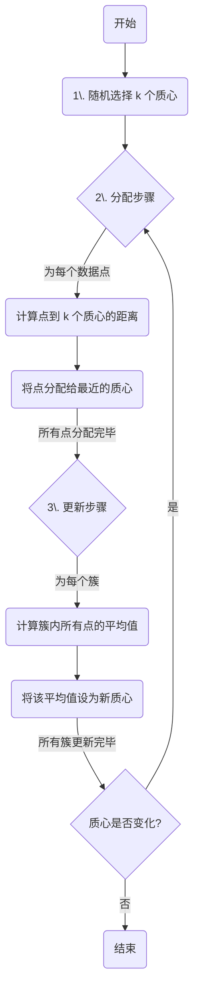
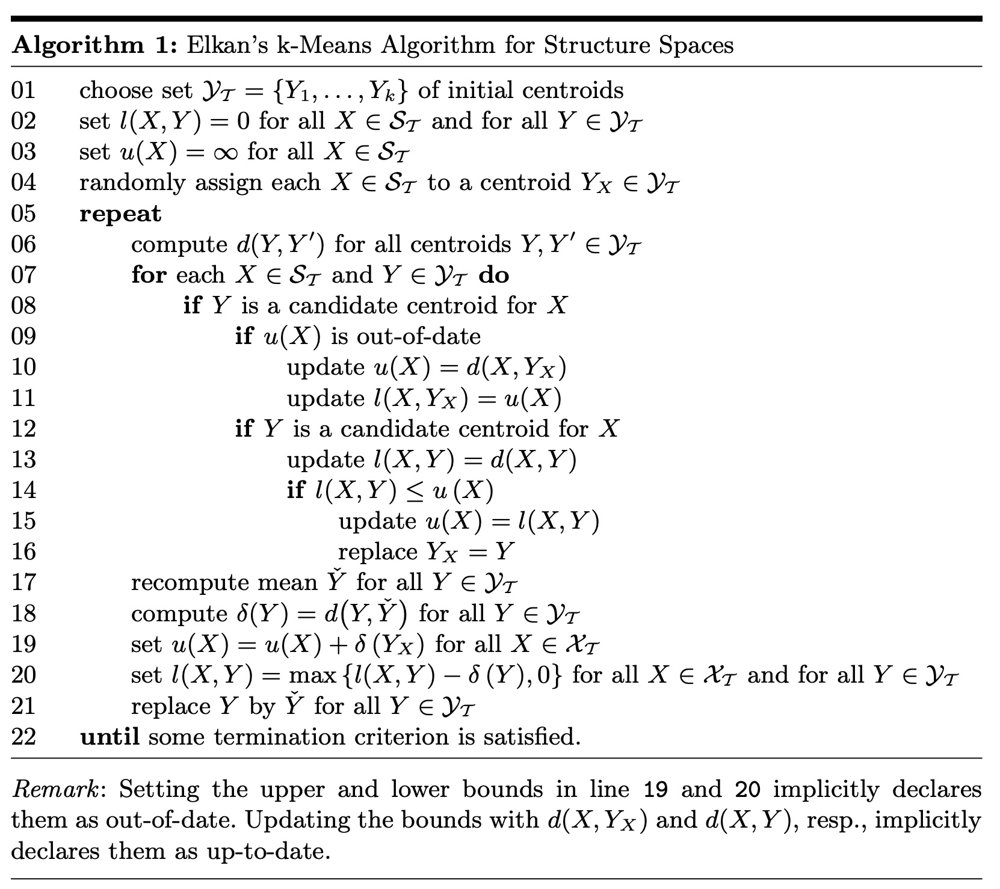
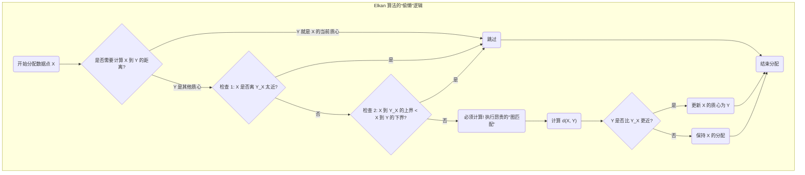
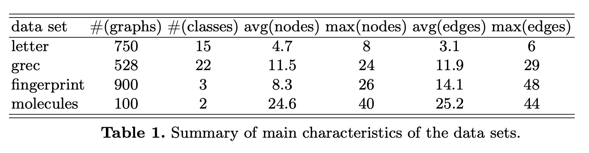
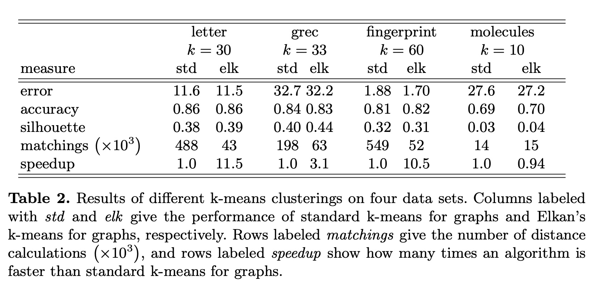
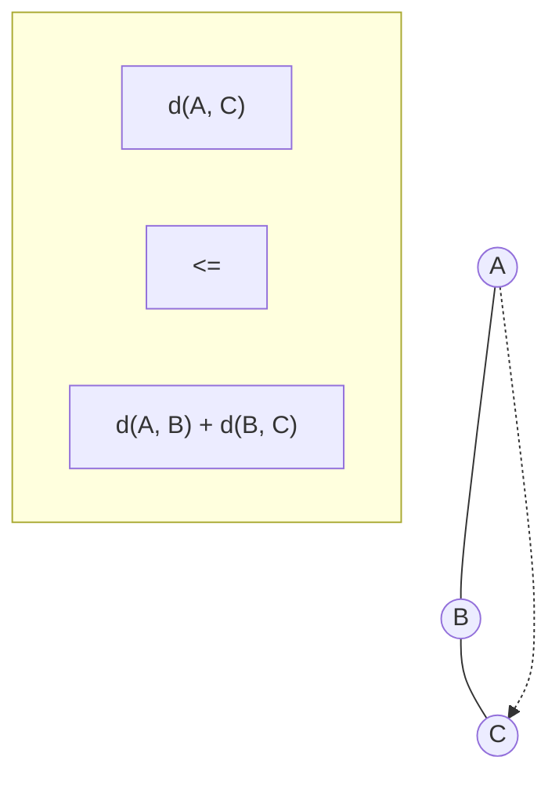
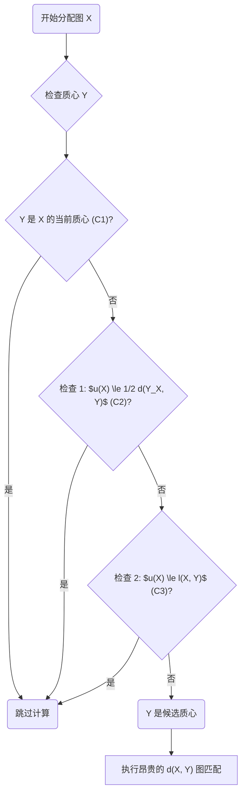

## AI论文解读 | Elkan’s k-Means Algorithm for Graphs
        
### 作者        
digoal        
        
### 日期        
2025-11-04        
        
### 标签        
PostgreSQL , PolarDB , DuckDB , AI , 论文解读        
        
----        
        
## 背景  
      
https://www.researchgate.net/publication/220887701_Elkan's_k-Means_Algorithm_for_Graphs        
  
提示:          
```          
读懂《Elkan’s k-Means Algorithm for Graphs》这篇论文需要提前掌握哪些基础知识, 请使用中文通熟易懂的讲解这些基础知识, 可以引用论文中的图、表或使用Markdown支持的图形(text,mermaid等)增加解释性. 
  
使用中文通熟易懂的解读《Elkan’s k-Means Algorithm for Graphs》这篇论文, 其中的关键内容请着重讲解, 可以引用论文中的图、表或使用Markdown支持的图形(text,mermaid等)增加解释性. 
  
提取《Elkan’s k-Means Algorithm for Graphs》这篇论文中的重要术语, 使用中文对这些术语进行通熟易懂的讲解, 可以引用论文中的图、表或使用Markdown支持的图形(text,mermaid等)增加解释性. 
```     
  
## 1 前置知识 
  
好的，这是一篇信息量很大的学术论文。要读懂它，你需要一个“知识工具箱”。这篇论文的核心是**将一种（在向量空间上）很成熟的 k-Means 加速算法（Elkan 算法），创造性地应用到了（计算上更复杂）图（Graph）数据上** 。

通俗来讲，这篇论文解决的问题是： **“k-Means 聚类在图数据上跑得太慢了，我们用一种数学技巧（三角不等式）来给它加速。”** 

你需要预先掌握的基础知识主要有以下四大块：

### 1\. 核心基础：k-Means 聚类算法

这是最基本的要求。k-Means 是一种“聚类”算法，即把“长得像”的数据点自动分到同一个组里。你必须理解它在**标准向量空间**（即简单的点）上是如何工作的：

  * **目标：** 把 N 个数据点分成 k 个簇（Cluster）。
  * **核心步骤（迭代进行）：**
    1.  **分配 (Assignment)：** 计算每个数据点 $X_i$ 到 k 个“质心”（Centroid） $Y_j$ 的距离 。把 $X_i$ 分配给离它最近的那个质心 。
    2.  **更新 (Update)：** 重新计算 k 个簇的“平均值”，这个平均值就是新的质心 。
    3.  **重复：** 不断重复步骤 1 和 2，直到质心不再变化或变化很小 。

这篇论文假设你对上述流程了如指掌。



### 2\. 关键难点：图 (Graph) 数据与图匹配 (Graph Matching)

这篇论文处理的不是简单的“点”，而是**图（Graphs）** 。

  * **什么是图？** 你需要知道图论的基本概念。一个图由“顶点”（Vertices）和“边”（Edges）组成 。这篇论文处理的是“属性图”（Attributed Graphs） ，意味着点和边都可以有自己的属性（比如化学分子中的原子类型和键的类型 ）。

  * **最大的坎：如何计算“图距离”？**

      * 对于两个点，距离很好算（比如欧氏距离）。
      * 但对于两个图（比如两个分子结构），怎么衡量它们的“相似度”或“距离”？
      * 这需要一个复杂的过程，称为 **“图匹配”（Graph Matching）** 。你需要找到一种最佳的“对齐”（alignment）方式，才能计算出最小距离 。
      * 论文明确指出，计算这个图距离是一个**NP-hard 问题** 。这就是为什么标准 k-Means for Graphs 这么慢的根本原因 ——它在每一步迭代中都要做好几千次（甚至更多）这种超高难度的计算 。

### 3\. 加速技巧：度量空间 (Metric Space) 与三角不等式 (Triangle Inequality)

这是论文的“加速”部分的理论基础。

  * **什么是“度量”（Metric）？** 论文提到，他们假设图距离是一种“度量” 。一个“度量”是一个严格的距离定义，它必须满足几个条件，其中最重要的是**三角不等式** 。

  * **三角不等式 (Triangle Inequality)：**

      * 这是一个初中数学概念： **“三角形两边之和大于第三边”** 。
      * 用距离来表示就是：`d(A, C) <= d(A, B) + d(B, C)`。
      * **为什么这能加速？** \* 想象一下，你要计算数据点 $X$ 到质心 $Y$ 的距离 $d(X, Y)$ （这是一个非常耗时的图匹配计算 ）。
          * 但你*已经*知道 $X$ 离它*当前*的质心 $Y_X$ 的距离 $d(X, Y_X)$ （假设是 5）。
          * 你也*已经*知道两个质心之间的距离 $d(Y_X, Y)$ （假设是 20）。
          * 根据三角不等式， $d(Y_X, Y) \le d(Y_X, X) + d(X, Y)$ ，变形后得到 $d(X, Y) \ge d(Y_X, Y) - d(Y_X, X)$ 。
          * $d(X, Y) \ge 20 - 5 = 15$ 。
          * 如果你知道 $X$ 离 $Y_X$ 的距离是 5，而你发现 $X$ 离 $Y$ 的距离 *至少* 是 15，你就**根本不需要**去花大力气计算 $d(X, Y)$ 的精确值了，因为 $Y$ 肯定不是 $X$ 的新质心。
      * 这就是 Elkan 算法的核心思想：利用三角不等式，通过已知的距离来设置“下界”（lower bound） $l(X,Y)$ 和“上界”（upper bound） $u(X)$ ，从而“跳过”大量不必要的、昂贵的图距离计算 。

### 4\. 论文背景：Elkan 的 k-Means 加速算法

这篇论文的标题是“Elkan's k-Means Algorithm for Graphs”。这意味着它并不是*发明*这个算法，而是*扩展*它。

  * **你需要知道：** Charles Elkan 在 2003 年*已经*为**向量空间**（普通的数据点）提出了这种利用三角不等式加速 k-Means 的方法 。
  * **这篇论文的贡献：** 证明了 Elkan 的思想同样可以被“移植”到复杂得多的“图空间”（Graph Spaces）上 ，并设计出了一套具体的算法（Algorithm 1 ）来实现这种移植。    

-----

### 总结：你的知识清单

要读懂这篇论文，请确保你至少了解：

1.  **k-Means 聚类：** 知道它是什么，以及“分配-更新”的迭代步骤。
2.  **图论基础：** 知道什么是“图”，什么是“属性图” 。
3.  **计算复杂度：** 理解“NP-hard”  意味着“计算起来非常非常慢”。
4.  **图匹配：** 明白“计算两个图的距离”是这篇论文要优化的核心瓶颈 。
5.  **三角不等式：** 这是 Elkan 算法（以及这篇论文）用来“偷懒”和“剪枝”的数学工具 。

如果你对这些概念（特别是 k-Means 和图匹配）有了基本的了解，再去看这篇论文，你就能抓住它的脉络：**它是在用“三角不等式”这个工具，去解决“图匹配”这个瓶颈，最终实现了“k-Means for Graphs”的加速。**

希望这个讲解对你有帮助！你希望我详细解释其中哪一个基础知识点吗？
  
## 2 解读论文 
  
好的，这是一篇关于 **“如何给图数据（Graph）的 k-Means 聚类算法进行大幅提速”** 的学术论文。

我来为你做一个通俗易懂的解读。

-----

### 论文解读：《Elkan’s k-Means Algorithm for Graphs》

#### 1\. 一句话总结：图聚类太慢了，我们用“三角不等式”来跳过海量计算

这篇论文的核心贡献是，将 Elkan 的 k-Means 加速算法（原本用于向量数据） **成功地“移植”到了图（Graph）数据上** 。

其 **“提速”** 的秘诀在于利用了图距离的“三角不等式”特性 ，通过数学推导，**避免（跳过）了大量本就不必要的、极其耗时的“图距离”计算**，同时又保证了聚类结果的质量 。

-----

#### 2\. 核心问题：为什么图（Graph）的 k-Means 聚类这么慢？

在标准的 k-Means 算法中，我们迭代两个步骤：

1.  **分配：** 计算每个“数据点”到 k 个“质心”的距离，并将其分配给最近的质心 。
2.  **更新：** 重新计算 k 个簇的“平均值”，作为新的质心 。

这个流程在处理简单数据（如二维坐标点）时很快。但当数据变成“图”（Graphs）时——比如化学分子结构 、图像描述  或社交网络结构——就崩溃了。

**瓶颈在于“计算距离” 。**

  * 计算两个**点**的距离：非常快（例如，欧氏距离）。
  * 计算两个**图**的距离：**极其缓慢**。

在论文中，这个过程被称为“图匹配”（Graph Matching）。你需要找到两个图之间“最佳”的对齐方式才能算出它们的相似度 。这在计算上是一个 **NP-hard** 问题 ，即计算量随图的大小呈指数级增长。

标准的 k-Means 算法（k-Means for Graphs）在*每一步迭代*中，都需要计算 *N* 个图到 *k* 个质心的距离 。这导致了海量的、昂贵的“图匹配”计算，使得算法在大型数据集上几乎不可用 。

-----

#### 3\. 关键内容：Elkan 算法如何利用“三角不等式”偷懒？

既然“图匹配”计算这么昂贵，那么我们能 **“少算几次”** 吗？

Elkan 算法的精髓就在于此。它利用了“度量（Metric）”的一个基本特性：**三角不等式** 。

> **三角不等式（通俗解释）：**  
> 假设有 A、B、C 三个地方。从 A 到 C 的直线距离，永远不会超过“从 A 经过 B 再到 C”的距离。  
> 即：`d(A, C) ≤ d(A, B) + d(B, C)`  

Elkan 算法在 k-Means 的“分配”步骤中，通过这个不等式设置了巧妙的“检查站”。

**核心思路：**
对于一个数据点 $X$ （一个图），它当前属于质心 $Y_X$ 。我们现在要判断是否需要计算 $X$ 到另一个质心 $Y$ 的距离 $d(X, Y)$ （这是一次昂贵的图匹配）。

算法会维护两个值：

1.  $u(X)$ : $X$ 到它*当前*质心 $Y_X$ 的距离上界（Upper bound）。
2.  $l(X, Y)$ : $X$ 到*其他*质心 $Y$ 的距离下界（Lower bound）。

在计算 $d(X, Y)$ 之前，算法会进行两次“廉价”的检查 ：

**检查 1 (C2)： $u(X) \le \frac{1}{2}d(Y_X, Y)$** 

  * **通俗解释：** 如果 $X$ 离它自己的质心 $Y_X$ **“太近”** 了，近到它（根据三角不等式）*不可能*离 $Y$ 更近，那我们就不用算了。
  * **例子：** 你 (X) 离你家 ( $Y_X$ ) 距离最多 1 公里。你家 ( $Y_X$ ) 离 B 公司 ( $Y$ ) 距离是 10 公里。根据三角不等式，你 (X) 离 B 公司 ( $Y$ ) *至少*是 10-1=9 公里。因此 $Y$ 绝不可能是你（X）的新质心，**跳过**昂贵的 $d(X, Y)$ 计算。

**检查 2 (C3)： $u(X) \le l(X, Y)$** 

  * **通俗解释：** $X$ 离它自己质心的**最大**距离（上界），已经小于 $X$ 离另一个质心 $Y$ 的**最小**距离（下界）了。
  * **例子：** 你 (X) 离你家 ( $Y_X$ ) 距离最多 1 公里。算法已经知道你 (X) 离 B 公司 ( $Y$ ) 距离最少 3 公里。1 \< 3，你家 ( $Y_X$ ) 肯定更近，**跳过**计算。




只有当这些“廉价”检查都无法排除 $Y$ 时，算法才会“很不情愿地”去执行那次昂贵的“图匹配”计算 。

-----

#### 4\. 实验结果：效果如何？

论文在4个公开图数据集上进行了实验（见论文表1）。    

| data set | \#(graphs) | \#(classes) | avg(nodes) | max(nodes) | avg(edges) | max(edges) |
| :--- | :--- | :--- | :--- | :--- | :--- | :--- |
| letter | 750 | 15 | 4.7 | 8 | 3.1 | 6 |
| grec | 528 | 22 | 11.5 | 24 | 11.9 | 29 |
| fingerprint | 900 | 3 | 8.3 | 26 | 14.1 | 48 |
| molecules | 100 | 2 | 24.6 | 40 | 25.2 | 44 |

他们比较了标准 k-Means (std) 和 Elkan 加速版 (elk)（见论文表2）。

**关键发现 1：聚类质量几乎一致**
在聚类误差（error）、准确率（accuracy）和轮廓系数（silhouette）上，std 和 elk 的表现基本相同 。这意味着 **Elkan 加速算法没有以牺牲质量为代价**。

**关键发现 2：速度大幅提升（大部分情况下）**
论文报告了“matchings”（图匹配计算次数）作为速度的衡量标准 。

我们来看论文表2  中的惊人对比（单位：千次）：    

| 数据集 | Elkan (elk) 计算次数 | Standard (std) 计算次数 | 提速倍数 (Speedup) |
| :--- | :---: | :---: | :---: |
| letter | 43 | 488 | **11.5 倍**  |
| grec | 63 | 198 | **3.1 倍**  |
| fingerprint | 52 | 549 | **10.5 倍**  |
| molecules | 15 | 14 | 0.94 倍 (略慢)  |

**关键发现 3：加速依赖“数据结构”**
为什么 Elkan 在 `molecules` 数据集上“失效”了？

论文解释：Elkan 算法的加速效果，依赖于数据本身 **存在清晰的“聚类结构”** （即簇与簇之间分得比较开）。

而 `molecules` 数据集的轮廓系数（silhouette index）非常低（只有 0.03-0.04），意味着数据本身就是一团乱麻，没有清晰的簇。当数据没有结构时，上述的“三角不等式检查”就很难跳过计算，Elkan 算法也就失去了优势 。

-----

#### 5\. 论文结论

1.  **成功移植：** 论文成功地将 Elkan k-Means 算法从向量空间扩展到了图空间 。
2.  **核心贡献：** 利用图距离的三角不等式特性，大幅减少了昂贵的“图匹配”计算次数 。
3.  **实践价值：** 实验证明，**只要数据中存在聚类结构**，Elkan k-Means (elk) 就能在不损失聚类质量的前提下，比标准 k-Means (std) **快非常多** 。

希望这个解读对你有帮助！你是否想了解更多关于“图匹配”或“三角不等式”的具体应用？
  
## 3 术语 
  
好的，这篇论文《Elkan’s k-Means Algorithm for Graphs》是关于解决一个经典难题的：k-Means 聚类算法在“图”（Graph）这种复杂数据上跑得太慢，作者们用 Elkan 算法的思想给它进行了加速 。

要读懂这篇论文，你需要理解以下几个关键术语。

### 1\. 基础概念

#### 📈 k-Means (K-均值聚类)

  * **通俗讲解：** 这是最著名的聚类算法之一。它的目标是把 N 个数据点自动分成 k 个簇（Cluster）。
  * **工作原理：** 它通过“分配-更新”两个步骤不断迭代：
    1.  **分配：** 计算每个数据点到 k 个“质心”（Centroid）的距离，把它分给最近的那个质心。
    2.  **更新：** 重新计算每个簇的“平均值”，这个“平均值”就成为新的质心。
  * **论文中的应用：** 论文的目标就是最小化一个“聚类目标”函数（J），这个函数计算了所有图到它们各自质心的总平方距离 。

#### 🧬 Attributed Graphs (属性图)

  * **通俗讲解：** 在现实世界中，图不仅仅是“点”和“线”。“属性图”意味着图中的点（顶点）和线（边）都可以有自己的“属性”或“标签” 。
  * **举例：**
      * **化学分子 ：** “点”是原子（属性：碳、氧...），“线”是化学键（属性：单键、双键...）。
      * **图像描述 ：** “点”是物体，“线”是物体间的空间关系。

-----

### 2\. 核心瓶颈（为什么这么慢？）

#### 📏 Graph Distance (图距离)

  * **通俗讲解：** 这是这篇论文要解决的核心难题。计算两个**点**的距离很简单（比如用尺子量），但计算两个**图**（比如两个分子结构）有多“像”或“不“像”（即“距离”）就非常复杂了 。
  * **论文中的定义：** 两个图 $X$ 和 $Y$ 之间的距离，被定义为它们所有可能的“对齐”方式中，差异最小的那个值 。

#### 🔗 Graph Matching (图匹配)

  * **通俗讲解：** 这就是计算“图距离”的具体方法。你需要找到一个“最佳”的匹配方案，把图 A 的节点“对齐”到图 B 的节点，使得它们的结构和属性差异最小 。
  * **举例：** 想象你有两张拼图，你要一片片对比，找到最佳的重叠方式，才能判断这两张拼图有多像。
  * **最佳对齐 (Optimal Alignment)：** 论文中提到，能让两个图 $X$ 和 $Y$ 之间距离最小的那种“对齐”方式，就叫做最佳对齐 。

#### 🤯 NP-hard (NP-hard 问题)

  * **通俗讲解：** 这是一个计算复杂度术语，你可以简单理解为 **“极其耗时”** 或 **“计算噩梦”** 。
  * **论文中的含义：** 论文明确指出，计算“图距离”（即图匹配问题）是一个 **NP-hard** 问题 。这意味着，随着图的增大，计算所需的时间会呈指数级爆炸性增长。
  * **直接后果：** 标准的 k-Means 算法在每一步迭代中，都需要计算 N 个图到 k 个质心的距离 。如果 N=1000, k=10，一次迭代就要算 10000 次 NP-hard 的图匹配！这就是它慢的根源。

-----

### 3\. 解决方案（Elkan 的“加速器”）

#### 📐 Triangle Inequality (三角不等式)

  * **通俗讲解：** 这是 Elkan 算法的**核心数学工具**，也是我们初中就学过的“三角形两边之和大于第三边”。
  * **公式表达：** `d(A, C) ≤ d(A, B) + d(B, C)`。
  * **论文中的应用：** 作者利用这个不等式来“偷懒” 。如果算法能*推断*出一个图 $X$ 离质心 $Y$ *一定*很远，它就**跳过**那次昂贵的 NP-hard 计算 。




#### BOUNDS (上界与下界)

  * **通俗讲解：** 这是“三角不等式”的具体实现。算法为每个图 $X$ 维护了两个“账本”：
    1.  **Upper Bound (上界) $u(X)$ ：** 我（ 图 $X$ ）离我*当前*质心 $Y_X$ 的距离，*最多*（上界）是 $u(X)$ 这么远 。
    2.  **Lower Bound (下界) $l(X, Y)$ ：** 我（ 图 $X$ ）离*另一个*质心 $Y$ 的距离，*最少*（下界）是 $l(X, Y)$ 这么远 。

#### 🎯 Candidate Centroid (候选质心)

  * **通俗讲解：** 一个“有可能成为我（ 图 $X$ ）新质心”的质心。
  * **Elkan 的加速逻辑 (C1-C3) ：**
      * 算法在计算 $X$ 和 $Y$ 之前，会先做“廉价”的检查：
        1.  **检查 (C2)：** $Y_X$ 离 $Y$ 是不是“太远”了？（ $u(X) \le 1/2 d(Y_X, Y)$ ） 
        2.  **检查 (C3)：** 我离我当前质心的“最大距离” $u(X)$ ，是不是已经*小于*我离 $Y$ 的“最小距离” $l(X,Y)$ 了？（ $u(X) \le l(X, Y)$ ） 
      * **如果任一检查通过：** 意味着 $Y$ *不可能是* $X$ 的新质心。算法会**安全地跳过**这次 NP-hard 计算！
      * **如果全部检查失败：** $Y$ 才被视为一个“候选质心” ，算法*不得不*去执行那次昂贵的“图匹配”计算 。




-----

### 4\. 评估指标

#### 📊 Silhouette Index (轮廓系数)

  * **通俗讲解：** 这是一个衡量聚类“质量”的“跑分”。它告诉我们簇与簇之间是否“分得开”，簇内部是否“足够紧凑” 。
  * **分数范围：** -1 到 1 。分数越高，表示聚类效果越好 。
  * **论文中的应用：** 论文用这个指标来证明 Elkan 加速版 (elk) 和标准版 (std) 的聚类**质量相当**（见表 2）。    

#### 🚀 Speedup (加速比)

  * **通俗讲解：** 衡量 Elkan (elk) 版本比标准 (std) 版本快了多少倍 。
  * **论文中的应用：** 这是本论文最重要的成果。如表 2 所示，在 `letter` 数据集上，Elkan 版本所需的“图匹配”计算次数 (43k) 远小于标准版 (488k)，实现了 **11.5 倍**的加速比 。
  
## 参考        
         
https://www.researchgate.net/publication/220887701_Elkan's_k-Means_Algorithm_for_Graphs    
        
<b> 以上内容基于DeepSeek、Qwen、Gemini及诸多AI生成, 轻微人工调整, 感谢杭州深度求索人工智能、阿里云、Google等公司. </b>        
        
<b> AI 生成的内容请自行辨别正确性, 当然也多了些许踩坑的乐趣, 毕竟冒险是每个男人的天性.  </b>        
    
#### [期望 PostgreSQL|开源PolarDB 增加什么功能?](https://github.com/digoal/blog/issues/76 "269ac3d1c492e938c0191101c7238216")
  
  
#### [PolarDB 开源数据库](https://openpolardb.com/home "57258f76c37864c6e6d23383d05714ea")
  
  
#### [PolarDB 学习图谱](https://www.aliyun.com/database/openpolardb/activity "8642f60e04ed0c814bf9cb9677976bd4")
  
  
#### [PostgreSQL 解决方案集合](../201706/20170601_02.md "40cff096e9ed7122c512b35d8561d9c8")
  
  
#### [德哥 / digoal's Github - 公益是一辈子的事.](https://github.com/digoal/blog/blob/master/README.md "22709685feb7cab07d30f30387f0a9ae")
  
  
#### [About 德哥](https://github.com/digoal/blog/blob/master/me/readme.md "a37735981e7704886ffd590565582dd0")
  
  

  
