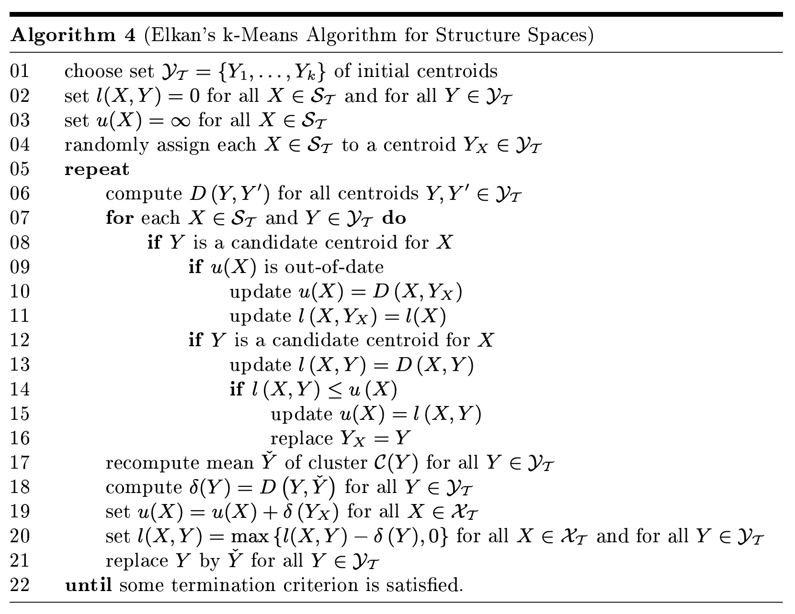
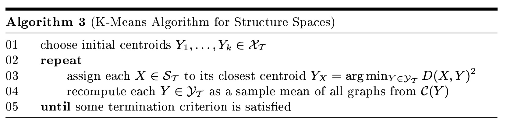
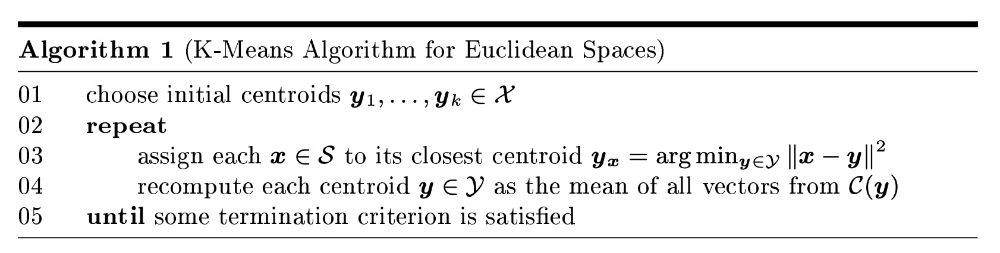

## AI论文解读 | Elkan's k-Means for Graphs
        
### 作者        
digoal        
        
### 日期        
2025-11-04        
        
### 标签        
PostgreSQL , PolarDB , DuckDB , AI , 论文解读        
        
----        
        
## 背景  
      
https://arxiv.org/pdf/0912.4598        
  
提示:          
```          
读懂《Elkan's k-Means for Graphs》这篇论文需要提前掌握哪些基础知识, 请使用中文通熟易懂的讲解这些基础知识, 可以引用论文中的图、表或使用Markdown支持的图形(text,mermaid等)增加解释性. 
  
使用中文通熟易懂的解读《Elkan's k-Means for Graphs》这篇论文, 其中的关键内容请着重讲解, 可以引用论文中的图、表或使用Markdown支持的图形(text,mermaid等)增加解释性. 
  
提取《Elkan's k-Means for Graphs》这篇论文中的重要术语, 使用中文对这些术语进行通熟易懂的讲解, 可以引用论文中的图、表或使用Markdown支持的图形(text,mermaid等)增加解释性. 
```     
  
## 1 前置知识 
  
理解这篇论文《Elkan's k-Means for Graphs》 需要你对机器学习中的一个经典算法、图论的基本概念以及一些优化技巧有所了解。

这篇论文的核心目标是：将一个叫做 **k-Means** 的经典聚类算法，从它通常处理的简单“向量”数据（比如身高、体重组成的点），扩展到可以处理复杂的“图”结构数据（比如分子结构、社交网络），并且还要让这个过程变得**更快**。

以下是你需要掌握的 5 个关键基础知识，我将用通俗易懂的方式为你讲解：

### 1\. 基础知识一：k-Means 聚类算法 (K-Means Clustering)

  * **是什么？**
    k-Means 是一种“物以类聚”的算法 。你告诉它要分成 $k$ 类，它就会自动把一堆数据点分成 $k$ 个簇 (cluster)。
  * **怎么做的？**
    它主要通过两步不断循环，直到（在论文的算法1中有描述）：
    1.  **分配 (Assignment)：** 计算每个数据点到 $k$ 个“中心点”（也叫**质心, centroid**）的距离，然后把自己分配给离它最近的那个质心 。
    2.  **更新 (Update)：** 重新计算每个簇的“中心点”。在传统 k-Means 中，这个“中心点”就是簇内所有数据点的**平均值**（即**样本均值, sample mean**）。

你可以把这个过程想象成：

```text
(初始化 k 个中心点)
    |
    v
(循环开始) --> (1. 所有点找到离自己最近的中心点，站队)
                  |
                  v
             (2. 每个队伍重新计算自己的"平均位置"，中心点移动到新位置)
                  |
                  v
             (中心点位置不怎么变了？) -- 是 --> (结束)
                  |
                  v
                  (否)
```

  * **论文的难点：** 传统 k-Means 依赖“求平均值” 。但对于一堆“图”结构，你怎么求它们的“平均图”呢？ 这就是论文要解决的第一个问题。

-----

### 2\. 基础知识二：图论 (Graph Theory) 基础

  * **是什么？**
    这里说的“图” (Graph)，不是指图片或图表，而是指由“点”（**顶点, vertices**）和“线”（**边, edges**）组成的数学结构 。
  * **论文中的图：**
    论文中处理的数据就是这种“图” 。比如：
      * **字母 (Letter) 数据集：** 顶点是字母笔画的端点，边是连接端点的笔画 。
      * **分子 (Molecules) 数据集：** 顶点是原子，边是化学键 。
        这些图还带有“属性” (attributed graphs)，比如原子的类型（碳、氢、氧）或端点的位置坐标 。
  * **论文的难点：**
    计算两个“图”有多像（或多不像）是一个非常困难的问题，称为“**图匹配**” (Graph Matching) 。在最坏的情况下，这是一个“NP完全”问题，计算量极大 。
    而 k-Means 的每一步（分配）都需要计算点到中心的“距离” 。如果这个距离计算本身就极其缓慢，那么整个 k-Means 算法在图数据上会慢到无法使用 。

-----

### 3\. 基础知识三：距离度量 (Distance Metric) 与 三角不等式 (Triangle Inequality)

这是理解论文**加速**部分（Elkan 算法）的**绝对核心**。

  * **距离度量 (Metric)：**
    就是一个测量“距离”的函数 $D(A, B)$ 。它必须满足几个条件，其中最重要的是“**三角不等式**” 。

  * **三角不等式 (Triangle Inequality)：**
    这个概念你在初中就学过： **“三角形中，两边之和大于第三边。”**
    换成距离来说就是：从 $A$ 点到 $C$ 点的距离，**不会**比 $A$ 先到 $B$ 、再从 $B$ 到 $C$ 的距离之和更长。
    即： $D(A, C) \le D(A, B) + D(B, C)$

    这篇论文的加速技巧**完全**依赖于这个特性 。

-----

### 4\. 基础知识四：优化 (Optimization) 与 次梯度法 (Subgradient Methods)

  * **问题：** 既然“图”不能简单地“求平均值”，那 k-Means 的“更新”步骤（重算中心点）怎么办？

  * **论文的解决方案：**
    论文把“求图的均值”重新定义为一个**优化问题** (Problem P) 。

    > 它的目标是：找到一个“中心图” $Y$ ，使得这个簇里所有图 $X_i$ 到 $Y$ 的**距离平方和**（SSD）最小 。

  * **新问题：**
    这个距离平方和 $F(X)$ 组成的函数（目标函数），它不是一个平滑的曲线。由于“图匹配”的复杂性，这个函数是“**局部利普希茨 (locally Lipschitz)**”的 ，通俗讲就是它上面可能有很多“尖角”（不可导的点）。

  * **“次梯度法” (Subgradient Methods)：**
    对于有“尖角”的函数，我们没法用标准的“梯度下降”（沿着最陡的坡下山）。“次梯度法”是一种更广义的方法，它允许我们在这些“尖角”处（不可导点）也能找到一个“大致”的下降方向，从而逐步“走”向最小值 。
    论文中提到，他们使用了一种叫 **IAM (Incremental Arithmetic Mean)** 的次梯度法来近似计算这个“图的均值” 。

-----

### 5\. 基础知识五：Elkan 加速算法的核心思想

现在，我们把所有知识组合起来，看看论文的**核心贡献**：Elkan's k-Means for Graphs (算法 4) 。    

  * **目标：** k-Means 的“分配”步骤需要计算 *每个点* 到 *每个中心点* 的距离 。对于 $N$ 个图和 $k$ 个中心，每次迭代需要 $k \times N$ 次昂贵的“图距离”计算。我们能跳过一些计算吗？
  * **Elkan 的妙招：** 利用**三角不等式**来避免不必要的计算 。
    算法会为每个数据点 $X$ 和每个质心 $Y$ 维护“ 距离的上界 $u(X)$ ”和“ 距离的下界 $l(X, Y)$ ” 。

**核心逻辑（一个简化的例子）：**

1.  假设数据点 $X$ 当前属于质心 $A$ （ $A$ 是离 $X$ 最近的 ）。
2.  我们已经计算过 $X$ 到 $A$ 的真实距离 $D(X, A)$ 。我们把这个值设为 $X$ 的**上界** $u(X)$  (意思是： $X$ 到“它的老大”的距离*最多*也就是这么远)。
3.  现在，我们要判断 $X$ 是否需要“叛变”到质心 $B$ ？这需要计算 $D(X, B)$ 吗？
4.  **先别算！** 算法会利用三角不等式维护一个 $X$ 到 $B$ 的**下界** $l(X, B)$  (意思是： $X$ 到 $B$ 的距离*至少*有这么远)。
5.  **关键判断来了：**
    如果算法发现 $u(X) \le l(X, B)$ 
      * **翻译成人话：** “ $X$ 到它老大 $A$ 的**最坏**距离 ( $u(X)$ ) ” 仍然 “小于等于 $X$ 到 $B$ 的**最好**距离 ( $l(X, B)$ )”。
      * **结论：** $B$ 绝对不可能是 $X$ 的新老大了。
      * **行动：** **跳过 (Skip)！** 我们根本不需要计算 $D(X, B)$ 这个昂贵的图距离！

通过这种方式，算法可以安全地跳过大量昂贵的图距离计算，尤其是在聚类后期，簇结构稳定时 。

### 总结

要读懂这篇论文，你需要：

1.  **k-Means：** 知道“分配”和“更新”两个步骤 。
2.  **图论：** 明白“图距离/图匹配”是计算的瓶颈 。
3.  **三角不等式：** 理解 $D(A, C) \le D(A, B) + D(B, C)$ ，这是 Elkan 加速的数学基础 。
4.  **优化：** 知道“图的均值”被定义为一个优化问题 ，并用“次梯度法”求解 。
5.  **Elkan 思想：** 明白算法是通过维护“上/下界”  并利用三角不等式  来**跳过**不必要的距离计算，从而实现加速的。

如果你对这些概念（尤其是 k-Means 和三角不等式）有了清晰的理解，再去看论文中的算法 3 (标准 k-Means for Graphs)  和算法 4 (Elkan's k-Means for Graphs) ，就会发现思路清晰很多了。      

希望这个解释对你有帮助！你是否想了解一下这篇论文中提到的“次梯度法 (Subgradient Methods)”是如何具体运作的？
  
## 2 解读论文 
  
这是一篇关于如何在“图”（Graphs）这种复杂数据上实现 K-Means 聚类，并使其**运行得更快**的学术论文 。

简单来说，这篇论文做了两件事：

1.  **扩展 k-Means：** 把只能处理“向量”（Euclidean spaces，比如身高体重坐标点）的 k-Means 算法，扩展到能处理“图”（Graphs，比如分子结构、社交网络）。
2.  **加速 k-Means：** 解决了一个致命问题——“图”上的 k-Means 算法**超级慢**。作者通过引入 Elkan 算法的思想，利用数学技巧（三角不等式） **跳过** 了大量不必要的计算，实现了显著加速 。

下面我们来通俗地拆解这篇论文的关键内容。

-----

### 🚀 关键内容一：为什么“图 k-Means”这么难且慢？

要理解这篇论文的贡献，我们必须先知道为什么在“图”上做 k-Means 这么困难。

标准的 k-Means 算法（如论文中的算法1 ）主要做两件事：     

1.  **分配 (Assignment)：** 计算每个数据点到 $k$ 个“中心点”的距离，然后把自己分配给最近的那个中心。
2.  **更新 (Update)：** 重新计算每个簇的“中心点”，这个中心点就是簇内所有点的“**平均值**”（Sample Mean）。

当我们把数据从“向量”换成“图”时，这两个步骤都遇到了大麻烦：

**难点 1：如何计算两个“图”的距离？**
计算两个向量的距离很简单（比如欧氏距离）。但计算两个“图”的距离（相似度）是一个被称为“**图匹配**”(Graph Matching) 的问题 。

> 通俗地说，这就像要判断两栋建筑（图）有多像，你可能需要旋转、平移，并比较它们的结构、节点（房间）、边（走廊）。

这是一个非常耗时的计算，在最坏情况下是 NP-complete 问题 ，计算成本极高 。

**难点 2：如何计算一堆“图”的“平均图”？**
向量可以简单地求平均值 。但 100 个“分子结构图”的“平均图”是什么？

论文指出，为了解决这个问题，研究者（包括本文作者在 [13, 14] 中的工作）将“图的均值”重新定义为一个**优化问题** (Problem P) 。

> 它的目标是：找到一个（虚拟的）“中心图” $Y$ ，使得簇内所有图 $X_i$ 到这个 $Y$ 的**距离平方和 (SSD) 最小** 。  

计算这个“图均值”也需要复杂的“**次梯度法**”(Subgradient Methods) ，比如论文中使用的 IAM 方法 ，这又是一笔不小的计算开销。

**速度瓶颈：标准图 k-Means (算法3)**     
标准的图 k-Means 算法 ，在**每一次迭代**中：

  * **分配**：需要 $N$ (数据点数) $\times$ $k$ (中心点数) 次昂贵的“图距离”计算 。
  * **更新**：需要至少 $O(N)$ 次“图距离”计算来估算新的中心点 。

对于大型数据集，这种计算量是“**令人望而却步的**”(prohibitive) 。

-----

### 🚀 关键内容二：Elkan 加速的核心武器——“三角不等式”

这篇论文的核心贡献，就是引入 Elkan 的方法  来解决上述的速度瓶颈。

**核心思想：** 我能不能**跳过**那些明显不必要的“图距离”计算？

**使用的武器：** **三角不等式** (Triangle Inequality) 。

这是一个我们都学过的数学公理：

> **从 A 点到 C 点的距离，永远小于等于 A 先到 B、再从 B 到 C 的距离之和。**  
> 即： $D(A, C) \le D(A, B) + D(B, C)$  

Elkan 算法巧妙地利用了这个特性。它通过维护每个数据点 $X$ 和每个中心 $Y$ 之间距离的“**上界** (upper bound)” 和 “**下界** (lower bound)” 来工作 。

**Elkan 是如何“偷懒”的？(算法4)**    

假设一个数据点（ 图 $X$ ）当前属于中心 $A$ ( $Y_X=A$ )。我们现在要判断 $X$ 是否需要“叛变”到另一个中心 $B$ ？

在标准的图 k-Means 中，我们必须老老实实地计算 $D(X, B)$ （一次昂贵的图匹配）。

但在 Elkan 算法中，我们**先不计算**，而是做一系列“廉价”的检查。论文中列出了几个条件 ，我们挑最核心的两个来解释 ( $u(X)$ 是 $X$ 到 $A$ 的距离上界， $l(X,B)$ 是 $X$ 到 $B$ 的距离下界)：

**检查 1 (基于中心点距离)：**

  * **如果**： $X$ 到 $A$ 的距离 $u(X)$ ，小于 $A$ 和 $B$ 之间距离的一半。
  * **即**： $u(X) \le \frac{1}{2} D(A, B)$
  * **结论**：根据三角不等式， $B$ 绝无可能比 $A$ 更近。
  * **行动**：**跳过！** (Skip)

**检查 2 (基于上/下界)：**

  * **如果**： $X$ 到 $A$ 的最坏距离 $u(X)$ ，仍然小于 $X$ 到 $B$ 的最好距离 $l(X, B)$ 。
  * **即**： $u(X) \le l(X, B)$
  * **结论**： $B$ 绝无可能比 $A$ 更近。
  * **行动**：**跳过！** (Skip)


```text
图 (X)  --- D(X, A) ---> 中心 A (Yx)
  |
  | ?
  |
  v
中心 B (Y)

Elkan 算法：
1. 我知道 D(X, A) 的上界是 u(X) 。
2. 我知道 D(A, B) 。
3. 我知道 D(X, B) 的下界是 l(X, B) 。
4.
   IF u(X) <= 0.5 * D(A, B)  --> 结论：B 不可能，跳过计算 D(X, B) 
   OR
   IF u(X) <= l(X, B)        --> 结论：B 不可能，跳过计算 D(X, B) 
5.
   ELSE (没办法了)          --> 行动：老老实实计算 D(X, B) 
```

通过这种方式，算法（Algorithm 4）安全地跳过了大量的图距离计算 ，尤其是在聚类趋于稳定时，大部分计算都可以被跳过。    

-----

### 🚀 关键内容三：实验结果——效果到底好不好？

论文通过在 4 个真实世界的图数据集（Letter, GREC, Fingerprint, Molecules）上进行实验 ，对比了标准图 k-Means (std) 和 Elkan 图 k-Means (elk) 。

结果在论文的 **表 2 (Table 2)**  中有清晰的展示：    

#### 1\. 聚类质量 (Accuracy, Error)：几乎没有损失

Elkan (elk) 和标准 (std) 算法在错误率 (error)、准确率 (accuracy) 和剪影指数 (silhouette) 上的表现**不相上下** 。

  * 例如，在 Fingerprint 数据集上，std 准确率 0.81，elk 准确率 0.82 。
  * 这证明 Elkan 算法的“偷懒”是**安全的**，并没有牺牲聚类质量 。

#### 2\. 运行速度 (Matchings, Speedup)：显著提升！

速度的提升是惊人的。论文通过计算昂贵的“图匹配”(matchings) 次数来衡量速度：

| 数据集 (k) | 算法 | 匹配总数 (x1000) | 总速度提升 (Speedup) |
| :--- | :--- | :--- | :--- |
| **Letter** (30) | std | 488.4 | 1.0x |
| | **elk** | **42.5** | **11.5x** |
| **Grec** (33) | std | 197.5 | 1.0x |
| | **elk** | **63.1** | **3.1x** |
| **Fingerprint** (60) | std | 549.0 | 1.0x |
| | **elk** | **52.4** | **10.5x** |
| **Molecules** (10) | std | 14.3 | 1.0x |
| | **elk** | **14.5** | **0.94x** |

*(数据来源：论文中的表 2 )*

从上表可以清晰看到：

  * 在 Letter 和 Fingerprint 数据集上，Elkan (elk) 的计算量减少了超过 90%，带来了**超过 10 倍**的速度提升 。
  * 在 Grec 数据集上，也有 3 倍的提升 。

#### 3\. 为什么在 Molecules 上失效了？

我们注意到，在 Molecules 数据集上，Elkan (elk) 反而更慢了（0.94x）。

论文给出了精辟的解释：**因为这个数据集没有清晰的“簇结构”** 。

  * Molecules 的剪影指数 (silhouette) 只有 0.03（接近 0），意味着数据点分布混乱，簇与簇之间没有明显界限 。
  * **Elkan 加速的前提是数据存在聚类结构** 。如果数据本身就是一团乱麻，Elkan 的“三角不等式”技巧就无法“剪掉”任何计算，反而维护上/下界还会增加额外开销 。

-----

### 总结

这篇论文成功地将 Elkan 的 k-Means 加速技巧从简单的向量空间扩展到了复杂的图空间 。

它通过利用**三角不等式** ，在不牺牲聚类质量的前提下 ，安全地跳过了大量昂贵的“图匹配”计算，从而**极大地**提升了图 k-Means 聚类算法的速度（在有结构的数据上可达 10 倍以上）。

这篇论文的意义在于，它为在大型、复杂的结构化数据（如生物信息学、化学信息学、计算机视觉中的图数据）上使用 k-Means 算法扫清了关键的速度障碍 。

希望这个解读对你有帮助！你是否想了解一下实验中提到的“剪影指数 (Silhouette Index)”是如何评估聚类质量的？
  
## 3 术语 
  
这篇论文《Elkan's k-Means for Graphs》的核心是将一个经典的聚类算法 (k-Means) 应用于复杂数据（图），并利用一个巧妙的数学技巧（三角不等式）为其**显著加速**。

以下是理解这篇论文所需掌握的重要术语及其通俗讲解：

### 1\. 核心算法与数据

#### k-Means (k-均值算法)

  * **通俗讲解：** 这是一种“物以类聚”的算法，也是最流行的聚类方法之一 。你告诉它要分成 $k$ 个簇 (cluster)，它就会迭代地执行两个步骤：
    1.  **分配 (Assignment)：** 每个数据点找到离它最近的“中心点”（质心, centroid），然后“站队”到那个中心点 。
    2.  **更新 (Update)：** 重新计算每个簇的“中心点”。在传统 k-Means 中，这个中心点就是簇内所有数据点的**平均值** (mean) 。
  * **论文中的挑战：** 传统 k-Means 只能处理向量（即在空间中的点），而这篇论文要让它能处理“图” 。

#### 图 (Graph)

  * **通俗讲解：** 这不是指图片或图表，而是数学中由“顶点”（vertices）和“边”（edges）组成的结构 。
  * **论文中的例子：** 论文处理的数据就是这种“图”结构，例如字母的笔画结构、化学分子结构、指纹的纹路结构等 。

### 2\. 核心挑战：为什么“图 k-Means”这么难？

#### 图距离 (Graph Distance) / 图匹配 (Graph Matching)

  * **通俗讲解：** k-Means 的“分配”步骤需要计算“距离”。计算两个向量的距离很简单，但计算两个“图”的距离（即它们有多相似或多不相似）是一个极其复杂的问题，称为“图匹配” 。
  * **为什么是挑战：** 确定两个图的距离是一个“NP完全”问题 ，计算它非常非常慢，具有指数级的复杂度 。这是导致图 k-Means 算法“慢到令人望而却步”的**根本障碍** 。

#### 图的样本均值 (Sample Mean of Graphs)

  * **通俗讲解：** k-Means 的“更新”步骤需要计算“平均值”。但你没法简单地把一堆“分子结构图”相加再除以 $N$ 来获得一个“平均图”。
  * **论文中的解决方案：** 论文将“图的均值”重新定义为一个**优化问题 (P)** 。它的目标是：找到一个（虚拟的）“中心图”，使得簇内所有图到这个中心图的“**距离平方和**”(SSD, Sum of Squared Distances) 最小 。

#### 次梯度法 (Subgradient Methods)

  * **通俗讲解：** 由于“图距离”函数不是平滑的曲线（它上面有很多“尖角”，在数学上称为“非光滑”或“不可导”），不能用标准的微积分方法（如梯度下降）来找到最小的 SSD。
  * **论文中的应用：** 次梯度法是一种专门用于解决这种“非光滑”优化问题的技术 。论文使用它来求解“图的样本均值”，即用它来完成 k-Means 的“更新”步骤 。

### 3\. 核心贡献：Elkan 加速

#### Elkan k-Means

  * **通俗讲解：** 这是 Charles Elkan 在 2003 年提出的一种 k-Means 加速算法 。它不是一种新的 k-Means，而是一种让标准 k-Means 跑得更快的“优化技巧”。
  * **核心武器：** **三角不等式** (Triangle Inequality) 。

#### 三角不等式 (Triangle Inequality)

  * **通俗讲解：** 这是一个你非常熟悉的数学公理：“**三角形两边之和大于第三边**”。
  * **论文中的应用：** 论文指出，只要“图距离”是一种“度量”(metric)，它就满足三角不等式 。Elkan 算法的核心就是利用这个公理，来**避免** (avoid) 那些不必要的、昂贵的“图距离”计算 。

#### 上界 $u(X)$ 和 下界 $l(X, Y)$ (Upper/Lower Bounds)

  * **通俗讲解：** 这是 Elkan 算法实现“跳过计算”的具体工具。算法会为每个数据点 $X$ 和每个中心 $Y$ 维护两个值 ：

      * **$u(X)$ (上界):** 粗略地讲，这是 $X$ 到它*当前所属中心* $Y_X$ 的距离 。它代表了“ $X$ 到它老大 $Y_X$ 的距离*最多*有这么远 ”。
      * **$l(X, Y)$ (下界):** 这是 $X$ 到*其他某个中心* $Y$ 的距离的*保守估计值*（即最小可能距离） 。它代表“ $X$ 到 $Y$ 的距离*至少*有这么远 ”。

  * **“跳过”计算的逻辑 (The "Skip")：**
    在“分配”步骤中，当算法判断 $X$ 是否要“叛变”到中心 $Y$ 时，它会先比较 $u(X)$ 和 $l(X, Y)$ 。

    > **如果 $u(X) \le l(X, Y)$** ：
    > **翻译：** “ $X$ 到它老大 $Y_X$ 的最坏距离” 仍然 “小于等于 $X$ 到新中心 $Y$ 的最好距离 ”。
    > **结论：** $X$ 绝无可能“叛变”到 $Y$ 。
    > **行动：** **跳过！** (Skip) 算法根本不需要计算 $D(X, Y)$ 这个昂贵的图距离 。


```text
数据点 (X)  ---- D(X, Yx) ---> 中心 A (Yx, X的老大)
   |
   |  ? (要不要计算昂贵的 D(X, Y)？)
   |
   v
中心 B (Y, 另一个中心)

Elkan 的判断逻辑：
1. 维护 u(X)：X 到 A 的最坏距离 (上界) 
2. 维护 l(X, Y)：X 到 B 的最好距离 (下界) 
3. IF u(X) <= l(X, Y)  
   --> 结论：B 绝不可能比 A 更近。
   --> 行动：跳过！(Skip) 
```

### 4\. 评估指标

#### 匹配次数 (Matchings)

  * **通俗讲解：** 由于“图距离”计算（即图匹配）是算法最耗时的部分 ，论文不使用“秒”来计时（因为这会随机器变化），而是直接统计“图距离”的**计算次数**（在表2中称为 "matchings"） 。    
  * **意义：** 这个数字越低，算法越快。实验（表2）显示，Elkan (elk) 的匹配次数远低于标准 (std) 算法（例如在 Letter 数据集上，42.5k vs 488.4k），证明了加速的有效性 。

#### 剪影指数 (Silhouette Index)

  * **通俗讲解：** 这是一种评估聚类“好坏”的指标，取值在 -1 到 1 之间 。
  * **意义：** 值越高，说明聚类效果越好（簇内紧密，簇间分离） 。论文用这个指标来证明 Elkan (elk) 和标准 (std) 算法的**聚类质量**是相当的 ，说明 Elkan 算法在“偷懒”的同时没有牺牲质量。
  * **关键发现：** 在 Molecules 数据集上，剪影指数很低（0.03） ，说明数据本身没有清晰的簇结构，这也导致了 Elkan 加速在
    该数据集上失效了 。
  
## 参考        
         
https://arxiv.org/pdf/0912.4598    
        
<b> 以上内容基于DeepSeek、Qwen、Gemini及诸多AI生成, 轻微人工调整, 感谢杭州深度求索人工智能、阿里云、Google等公司. </b>        
        
<b> AI 生成的内容请自行辨别正确性, 当然也多了些许踩坑的乐趣, 毕竟冒险是每个男人的天性.  </b>        
    
#### [期望 PostgreSQL|开源PolarDB 增加什么功能?](https://github.com/digoal/blog/issues/76 "269ac3d1c492e938c0191101c7238216")
  
  
#### [PolarDB 开源数据库](https://openpolardb.com/home "57258f76c37864c6e6d23383d05714ea")
  
  
#### [PolarDB 学习图谱](https://www.aliyun.com/database/openpolardb/activity "8642f60e04ed0c814bf9cb9677976bd4")
  
  
#### [PostgreSQL 解决方案集合](../201706/20170601_02.md "40cff096e9ed7122c512b35d8561d9c8")
  
  
#### [德哥 / digoal's Github - 公益是一辈子的事.](https://github.com/digoal/blog/blob/master/README.md "22709685feb7cab07d30f30387f0a9ae")
  
  
#### [About 德哥](https://github.com/digoal/blog/blob/master/me/readme.md "a37735981e7704886ffd590565582dd0")
  
  

  
