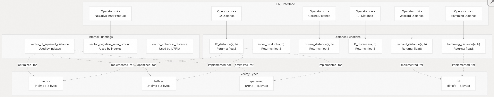
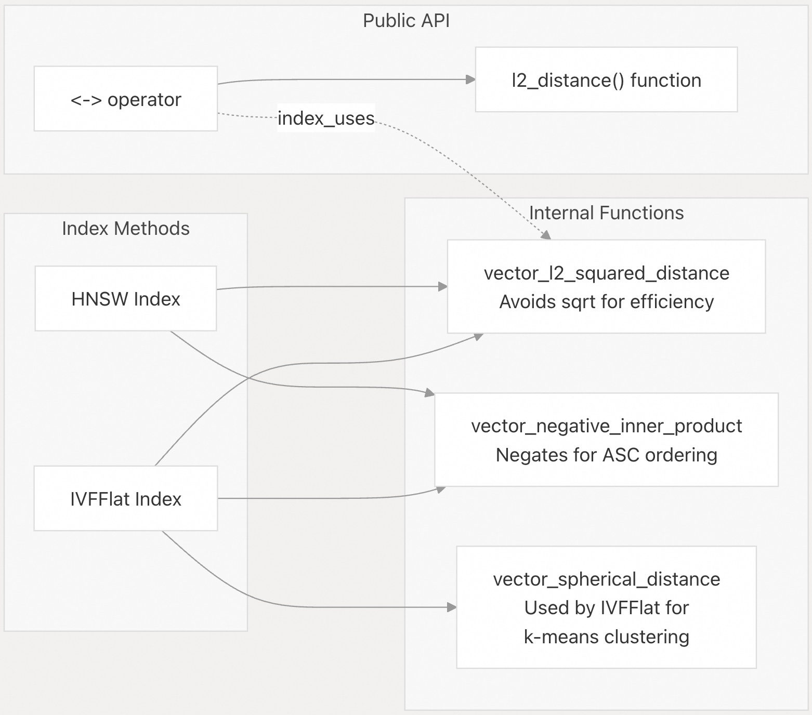
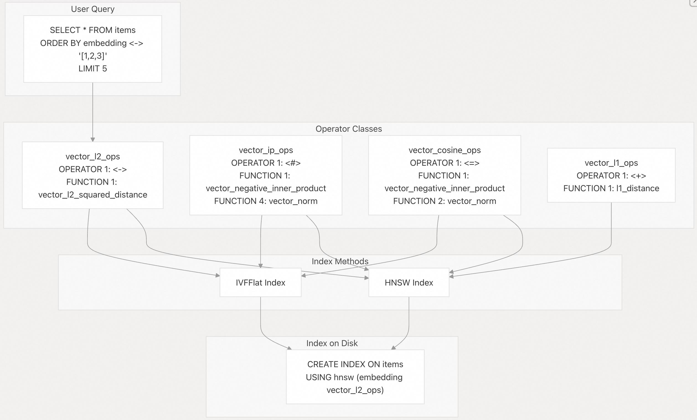

## pgvector 源码学习: 3 距离函数与运算符（Distance Functions and Operators）  
                                                      
### 作者                                                      
digoal                                                      
                                                      
### 日期                                                      
2025-11-04                                                      
                                                      
### 标签                                                      
pgvector , 源码学习                                                      
                                                      
----                                                      
                                                      
## 背景                                                      
本文介绍 `pgvector` 中提供的所有**距离度量（distance metrics）和运算符（operators）**。它涵盖了用于**最近邻查询（nearest neighbor queries）的 SQL 运算符、用于直接计算的对应距离函数（distance functions）**，以及不同 **向量类型（vector types）** 和支持的距离度量之间的关系。  
  
-----  
  
## 距离度量概览（Distance Metrics Overview）  
  
`pgvector` 在四种向量类型中支持六种距离度量：  
  
| 距离度量（Distance Metric） | 运算符（Operator） | `vector` | `halfvec` | `sparsevec` | `bit` | 用例（Use Case） |  
| :--- | :--- | :--- | :--- | :--- | :--- | :--- |  
| **L2（欧几里得）**（Euclidean） | `<->` | ✓ | ✓ | ✓ | - | 通用相似度（General-purpose similarity） |  
| **内积**（Inner Product） | `<#>` | ✓ | ✓ | ✓ | - | 点积（Dot product），标准化向量（normalized vectors） |  
| **余弦距离**（Cosine Distance） | `<=>` | ✓ | ✓ | ✓ | - | 方向相似度（Directional similarity） |  
| **L1（曼哈顿）**（Manhattan） | `<+>` | ✓ | ✓ | ✓ | - | 出租车距离（Taxicab distance） |  
| **汉明距离**（Hamming Distance） | `<~>` | - | - | - | ✓ | 二进制向量相似度（Binary vector similarity） |  
| **杰卡德距离**（Jaccard Distance） | `<%>` | - | - | - | ✓ | 集合相似度（Set similarity） |  
  
**来源:**  
[`README.md` 136-143](https://github.com/pgvector/pgvector/blob/d823c445/README.md#L136-L143)  
[`README.md` 948-1058](https://github.com/pgvector/pgvector/blob/d823c445/README.md#L948-L1058)  
  
-----  
  
## 架构：运算符、函数与类型系统（Architecture: Operators, Functions, and Type System）  
  
  
  
**来源:**  
[`sql/vector.sql` 34-44](https://github.com/pgvector/pgvector/blob/d823c445/sql/vector.sql#L34-L44)  
[`sql/vector.sql` 96-103](https://github.com/pgvector/pgvector/blob/d823c445/sql/vector.sql#L96-L103)  
[`sql/vector.sql` 174-192](https://github.com/pgvector/pgvector/blob/d823c445/sql/vector.sql#L174-L192)  
[`sql/vector.sql` 660-668](https://github.com/pgvector/pgvector/blob/d823c445/sql/vector.sql#L660-L668)  
  
-----  
  
## 运算符 vs 函数（Operators vs Functions）  
  
`pgvector` 提供 **运算符（operators）** 和 **函数（functions）** 来计算距离：  
  
### 距离运算符（Distance Operators）  
  
距离运算符（例如：`<->`、`<#>`）设计用于 `ORDER BY` 子句，并可利用**索引（indexes）**：  
  
```  
-- Uses index if available  
SELECT * FROM items ORDER BY embedding <-> '[1,2,3]' LIMIT 5;  
```  
  
**关键特性（Key characteristics）：**  
  
  * 可用于 `ORDER BY` 进行**最近邻搜索（nearest neighbor search）**  
  * 支持 **HNSW** 和 **IVFFlat** 索引访问方法  
  * 在适当时会被查询规划器（query planner）自动选择  
  * 需要 `LIMIT` 子句才能有效使用索引  
  
### 距离函数（Distance Functions）  
  
距离函数（例如：`l2_distance()`、`cosine_distance()`）用于直接计算：  
  
```  
-- Direct distance calculation  
SELECT id, l2_distance(embedding, '[1,2,3]') AS dist FROM items;  
```  
  
**关键特性（Key characteristics）：**  
  
  * 返回 `float8`（双精度）值  
  * 可用于任何表达式上下文（expression context）  
  * 不利用索引  
  * 适用于不进行排序的距离计算  
  
**来源:**  
[`README.md` 128-177](https://github.com/pgvector/pgvector/blob/d823c445/README.md#L128-L177)  
[`sql/vector.sql` 34-44](https://github.com/pgvector/pgvector/blob/d823c445/sql/vector.sql#L34-L44)  
  
-----  
  
## 距离运算符参考（Distance Operator Reference）  
  
### 向量类型运算符（Vector Type Operators）  
  
为 `vector`、`halfvec` 和 `sparsevec` 类型定义的所有运算符：  
  
| 运算符（Operator） | 名称（Name） | 返回值（Returns） | 描述（Description） | 添加版本（Added） |  
| :--- | :--- | :--- | :--- | :--- |  
| `<->` | **L2 距离**（L2 distance） | `float8` | 欧几里得距离：$\sqrt{\Sigma(a-b)^2}$ | 0.1.0 |  
| `<#>` | **负内积**（Negative inner product） | `float8` | $-( \Sigma(a \times b) )$ 用于 **ASC** 排序 | 0.1.0 |  
| `<=>` | **余弦距离**（Cosine distance） | `float8` | $1 - \frac{\Sigma(a \times b)}{ \left \| a \right \| \times \left \| b \right \| }$ | 0.1.0 |  
| `<+>` | **L1 距离**（L1 distance） | `float8` | 曼哈顿距离： $\Sigma \left \| a-b \right \|$ | 0.7.0 |  
  
**实现（Implementation）：**  
  
  * `vector`: [`sql/vector.sql` 174-192](https://github.com/pgvector/pgvector/blob/d823c445/sql/vector.sql#L174-L192)  
  * `halfvec`: [`sql/vector.sql` 516-534](https://github.com/pgvector/pgvector/blob/d823c445/sql/vector.sql#L516-L534)  
  * `sparsevec`: [`sql/vector.sql` 828-846](https://github.com/pgvector/pgvector/blob/d823c445/sql/vector.sql#L828-L846)  
  
### 位类型运算符（Bit Type Operators）  
  
`bit` 类型特有的运算符：  
  
| 运算符（Operator） | 名称（Name） | 返回值（Returns） | 描述（Description） | 添加版本（Added） |  
| :--- | :--- | :--- | :--- | :--- |  
| `<~>` | **汉明距离**（Hamming distance） | `float8` | 不同位的数量（Count of differing bits） | 0.7.0 |  
| `<%>` | **杰卡德距离**（Jaccard distance） | `float8` | $1 - \frac{\text{intersection}}{\text{union}}$ | 0.7.0 |  
  
**实现（Implementation）：** [`sql/vector.sql` 660-668](https://github.com/pgvector/pgvector/blob/d823c445/sql/vector.sql#L660-L668)  
  
**来源:**  
[`README.md` 136-143](https://github.com/pgvector/pgvector/blob/d823c445/README.md#L136-L143)  
[`README.md` 948-996](https://github.com/pgvector/pgvector/blob/d823c445/README.md#L948-L996)  
[`sql/vector.sql` 174-192](https://github.com/pgvector/pgvector/blob/d823c445/sql/vector.sql#L174-L192)  
  
-----  
  
## 距离函数参考（Distance Function Reference）  
  
### 向量距离函数（Vector Distance Functions）  
  
适用于 `vector`、`halfvec` 和 `sparsevec` 的函数：  
  
| 函数（Function） | 名称（Name） | 描述（Description） | 添加版本（Added） |  
| :--- | :--- | :--- | :--- |  
| `l2_distance(a, b)` | L2 距离 | 欧几里得距离 | 0.7.0 |  
| `inner_product(a, b)` | 内积 | 点积（Dot product） | 0.7.0 |  
| `cosine_distance(a, b)` | 余弦距离 | $1 - \text{cosine\_similarity}$ | 0.7.0 |  
| `l1_distance(a, b)` | L1 距离 | 曼哈顿距离 | 0.7.0 |  
  
```  
-- L2 (Euclidean) distance  
l2_distance(vector, vector) → float8  
l2_distance(halfvec, halfvec) → float8  
l2_distance(sparsevec, sparsevec) → float8  
  
-- Inner product (NOT negated, unlike operator)  
inner_product(vector, vector) → float8  
inner_product(halfvec, halfvec) → float8  
inner_product(sparsevec, sparsevec) → float8  
  
-- Cosine distance  
cosine_distance(vector, vector) → float8  
cosine_distance(halfvec, halfvec) → float8  
cosine_distance(sparsevec, sparsevec) → float8  
  
-- L1 (Manhattan/Taxicab) distance  
l1_distance(vector, vector) → float8  
l1_distance(halfvec, halfvec) → float8  
l1_distance(sparsevec, sparsevec) → float8  
```  
  
**实现（Implementation）：**  
  
  * `vector`: [`sql/vector.sql` 34-44](https://github.com/pgvector/pgvector/blob/d823c445/sql/vector.sql#L34-L44)  
  * `halfvec`: [`sql/vector.sql` 364-374](https://github.com/pgvector/pgvector/blob/d823c445/sql/vector.sql#L364-L374)  
  * `sparsevec`: [`sql/vector.sql` 721-731](https://github.com/pgvector/pgvector/blob/d823c445/sql/vector.sql#L721-L731)  
  
### 位距离函数（Bit Distance Functions）  
  
适用于 `bit` 的函数：  
  
| 函数（Function） | 名称（Name） | 描述（Description） | 添加版本（Added） |  
| :--- | :--- | :--- | :--- |  
| `hamming_distance(a, b)` | 汉明距离 | 不同位的数量 | 0.7.0 |  
| `jaccard_distance(a, b)` | 杰卡德距离 | $1 - \frac{\text{intersection}}{\text{union}}$ | 0.7.0 |  
  
```  
-- Hamming distance (count of differing bits)  
hamming_distance(bit, bit) → float8  
  
-- Jaccard distance (for set similarity)  
jaccard_distance(bit, bit) → float8  
```  
  
**实现（Implementation）：** [`sql/vector.sql` 652-656](https://github.com/pgvector/pgvector/blob/d823c445/sql/vector.sql#L652-L656)  
  
**来源:**  
[`README.md` 959-971](https://github.com/pgvector/pgvector/blob/d823c445/README.md#L959-L971)  
[`README.md` 1029-1058](https://github.com/pgvector/pgvector/blob/d823c445/README.md#L1029-L1058)  
[`sql/vector.sql` 34-44](https://github.com/pgvector/pgvector/blob/d823c445/sql/vector.sql#L34-L44)  
[`sql/vector.sql` 652-656](https://github.com/pgvector/pgvector/blob/d823c445/sql/vector.sql#L652-L656)  
  
-----  
  
## 内部/私有距离函数（Internal/Private Distance Functions）  
  
`pgvector` 定义了几个供 **索引访问方法（index access methods）** 使用的内部距离函数。用户通常不会直接调用它们：  
  
  
  
### 关键内部函数（Key Internal Functions）  
  
**对于 `vector` 类型：**  
  
  * `vector_l2_squared_distance(vector, vector)`：返回 $L2^2$（没有平方根，对比较更高效）  
  * `vector_negative_inner_product(vector, vector)`：返回**负内积**（实现 **ASC** 排序）  
  * `vector_spherical_distance(vector, vector)`：由 **IVFFlat** 用于**球面 K 均值（spherical k-means）**  
  
**对于 `halfvec` 类型：**  
  
  * `halfvec_l2_squared_distance(halfvec, halfvec)`  
  * `halfvec_negative_inner_product(halfvec, halfvec)`  
  * `halfvec_spherical_distance(halfvec, halfvec)`  
  
**对于 `sparsevec` 类型：**  
  
  * `sparsevec_l2_squared_distance(sparsevec, sparsevec)`  
  * `sparsevec_negative_inner_product(sparsevec, sparsevec)`  
  
**来源:**  
[`sql/vector.sql` 96-103](https://github.com/pgvector/pgvector/blob/d823c445/sql/vector.sql#L96-L103)  
[`sql/vector.sql` 426-433](https://github.com/pgvector/pgvector/blob/d823c445/sql/vector.sql#L426-L433)  
[`sql/vector.sql` 762-766](https://github.com/pgvector/pgvector/blob/d823c445/sql/vector.sql#L762-L766)  
  
-----  
  
## 运算符语义和特殊情况（Operator Semantics and Special Cases）  
  
### 负内积（Negative Inner Product）  
  
运算符 `<#>` 返回的是**负内积**，而不是内积本身：  
  
```  
-- These are NOT equivalent:  
SELECT embedding <#> '[1,2,3]' FROM items;        -- Returns NEGATIVE inner product  
SELECT inner_product(embedding, '[1,2,3]') FROM items;  -- Returns inner product  
  
-- To get actual inner product from operator, multiply by -1:  
SELECT (embedding <#> '[1,2,3]') * -1 AS inner_product FROM items;  
```  
  
**原因：** PostgreSQL 索引仅支持 **ASC**（升序）排序。通过对内积取负，较大的（较好的）值会变成较小的数值，从而可以在 `ORDER BY ... <#> ... ASC` 中使用索引。  
  
**来源:**  
[`README.md` 79](https://github.com/pgvector/pgvector/blob/d823c445/README.md#L79-L79)  
[`README.md` 167-171](https://github.com/pgvector/pgvector/blob/d823c445/README.md#L167-L171)  
  
### 余弦相似度（Cosine Similarity）  
  
**余弦距离（Cosine distance）返回 $[0, 2]$ 范围内的值。要获取余弦相似度（cosine similarity）**，请使用：  
  
```sql  
SELECT 1 - (embedding <=> '[1,2,3]') AS cosine_similarity FROM items;  
```  
  
**来源:** [`README.md` 174-177](https://github.com/pgvector/pgvector/blob/d823c445/README.md#L174-L177)  
  
### 可交换运算符（Commutative Operators）  
  
所有距离运算符都是**可交换的（commutative）**（顺序不影响结果）：  
  
```  
-- These are equivalent:  
a <-> b  ≡  b <-> a  
a <#> b  ≡  b <#> a  
a <=> b  ≡  b <=> a  
```  
  
**实现（Implementation）：** 每个运算符在 [`sql/vector.sql` 174-192](https://github.com/pgvector/pgvector/blob/d823c445/sql/vector.sql#L174-L192) 中都定义了 `COMMUTATOR` 属性。  
  
自定义运算符参考:   
- [《PostgreSQL (User defined Operator) UDO & Operator Optimization Information》](../201507/20150717_02.md)    
  
### NULL 值处理（NULL Handling）  
  
  * 带有 `NULL` 值的向量不被索引  
  * **零向量（Zero vectors）** 不被索引用于余弦距离（会导致除以零）  
  * 涉及 `NULL` 的距离计算返回 `NULL`  
  
**来源:** [`README.md` 921-933](https://github.com/pgvector/pgvector/blob/d823c445/README.md#L921-L933)  
  
-----  
  
## 运算符类集成（Operator Class Integration）  
  
距离运算符通过 **运算符类（operator classes）** 连接到索引方法：  
  
  
  
**运算符类定义（Operator class definitions）：**  
  
  * **HNSW** 运算符类：[`sql/vector.sql` 313-332](https://github.com/pgvector/pgvector/blob/d823c445/sql/vector.sql#L313-L332)  
  * **IVFFlat** 运算符类：[`sql/vector.sql` 292-311](https://github.com/pgvector/pgvector/blob/d823c445/sql/vector.sql#L292-L311)  
  
**来源:**  
[`sql/vector.sql` 292-332](https://github.com/pgvector/pgvector/blob/d823c445/sql/vector.sql#L292-L332)  
[`README.md` 210-246](https://github.com/pgvector/pgvector/blob/d823c445/README.md#L210-L246)  
  
-----  
  
## 类型特定的距离函数实现（Type-Specific Distance Function Implementations）  
  
每种向量类型都有其优化的距离函数实现：  
  
### `vector` 类型  
  
全精度（32 位浮点数）实现：  
  
  * **L2 距离（L2 Distance）：** [`src/vector.c`](https://github.com/pgvector/pgvector/blob/d823c445/src/vector.c) - 具有 **SIMD 优化（SIMD optimizations）** 的标准欧几里得距离  
  * **内积（Inner Product）：** [`src/vector.c`](https://github.com/pgvector/pgvector/blob/d823c445/src/vector.c) - 具有 **FMA（乘加运算）** 支持的点积  
  * **余弦距离（Cosine Distance）：** [`src/vector.c`](https://github.com/pgvector/pgvector/blob/d823c445/src/vector.c) - 使用内积和范数（norms）计算  
  * **L1 距离（L1 Distance）：** [`src/vector.c`](https://github.com/pgvector/pgvector/blob/d823c445/src/vector.c) - 绝对差值之和  
  
### `halfvec` 类型  
  
半精度（16 位浮点数）实现，带有 **F16C CPU 扩展（F16C CPU extensions）**：  
  
  * **L2 距离（L2 Distance）：** [`src/halfvec.c`](https://github.com/pgvector/pgvector/blob/d823c445/src/halfvec.c) - 在可用时使用 **F16C 指令（F16C instructions）**  
  * **内积（Inner Product）：** [`src/halfvec.c`](https://github.com/pgvector/pgvector/blob/d823c445/src/halfvec.c) - 硬件加速转换  
  * **余弦距离（Cosine Distance）：** [`src/halfvec.c`](https://github.com/pgvector/pgvector/blob/d823c445/src/halfvec.c)  
  * **L1 距离（L1 Distance）：** [`src/halfvec.c`](https://github.com/pgvector/pgvector/blob/d823c445/src/halfvec.c)  
  
`halfvec` 函数使用单独的 C 函数名称定义：[`sql/vector.sql` 364-374](https://github.com/pgvector/pgvector/blob/d823c445/sql/vector.sql#L364-L374)  
  
### `sparsevec` 类型  
  
**稀疏向量（Sparse vector）** 实现，跳过零元素：  
  
  * **L2 距离（L2 Distance）：** [`src/sparsevec.c`](https://github.com/pgvector/pgvector/blob/d823c445/src/sparsevec.c) - 仅迭代非零坐标  
  * **内积（Inner Product）：** [`src/sparsevec.c`](https://github.com/pgvector/pgvector/blob/d823c445/src/sparsevec.c) - 非零索引的交集（Intersection of non-zero indices）  
  * **余弦距离（Cosine Distance）：** [`src/sparsevec.c`](https://github.com/pgvector/pgvector/blob/d823c445/src/sparsevec.c)  
  * **L1 距离（L1 Distance）：** [`src/sparsevec.c`](https://github.com/pgvector/pgvector/blob/d823c445/src/sparsevec.c)  
  
函数定义：[`sql/vector.sql` 721-731](https://github.com/pgvector/pgvector/blob/d823c445/sql/vector.sql#L721-L731)  
  
### `bit` 类型  
  
二进制向量距离实现，带有 **AVX512 优化（AVX512 optimizations）**：  
  
  * **汉明距离（Hamming Distance）：** [`src/bitvector.c`](https://github.com/pgvector/pgvector/blob/d823c445/src/bitvector.c) - 在可用时使用 **AVX512 POPCNT**  
  * **杰卡德距离（Jaccard Distance）：** [`src/bitvector.c`](https://github.com/pgvector/pgvector/blob/d823c445/src/bitvector.c) - 基于位运算  
  
函数定义：[`sql/vector.sql` 652-656](https://github.com/pgvector/pgvector/blob/d823c445/sql/vector.sql#L652-L656)  
  
**来源:**  
[`sql/vector.sql` 34-44](https://github.com/pgvector/pgvector/blob/d823c445/sql/vector.sql#L34-L44)  
[`sql/vector.sql` 364-374](https://github.com/pgvector/pgvector/blob/d823c445/sql/vector.sql#L364-L374)  
[`sql/vector.sql` 652-656](https://github.com/pgvector/pgvector/blob/d823c445/sql/vector.sql#L652-L656)  
[`sql/vector.sql` 721-731](https://github.com/pgvector/pgvector/blob/d823c445/sql/vector.sql#L721-L731)  
  
-----  
  
## 使用示例（Usage Examples）  
  
### 基本最近邻搜索（Basic Nearest Neighbor Search）  
  
查找与给定向量最近的 5 个项目（使用 L2 距离）：  
  
```sql  
-- L2 distance (most common)  
SELECT * FROM items ORDER BY embedding <-> '[3,1,2]' LIMIT 5;  
  
-- Inner product (for normalized vectors)  
SELECT * FROM items ORDER BY embedding <#> '[3,1,2]' LIMIT 5;  
  
-- Cosine distance (directional similarity)  
SELECT * FROM items ORDER BY embedding <=> '[3,1,2]' LIMIT 5;  
  
-- L1 distance  
SELECT * FROM items ORDER BY embedding <+> '[3,1,2]' LIMIT 5;  
```  
  
### 直接距离计算（Direct Distance Calculation）  
  
计算两个向量之间的内积：  
  
```sql  
-- Calculate distance without ordering  
SELECT id, l2_distance(embedding, '[3,1,2]') AS distance FROM items;  
  
-- Get actual inner product (not negated)  
SELECT id, inner_product(embedding, '[3,1,2]') AS inner_prod FROM items;  
  
-- Cosine similarity (not distance)  
SELECT id, 1 - cosine_distance(embedding, '[3,1,2]') AS similarity FROM items;  
```  
  
### 距离过滤（Distance Filtering）  
  
查找距离给定向量在 0.5 以内的所有向量（使用余弦距离）：  
  
```sql  
-- Find vectors within a certain distance  
SELECT * FROM items WHERE embedding <-> '[3,1,2]' < 5;  
```  
  
**注意：** 与 `ORDER BY` 和 `LIMIT` 结合使用可有效利用索引。  
  
### 二进制向量距离（Binary Vector Distances）  
  
计算两个二进制位串的汉明距离：  
  
```sql  
-- Hamming distance  
SELECT * FROM items ORDER BY binary_embedding <~> '101010' LIMIT 5;  
  
-- Jaccard distance    
SELECT * FROM items ORDER BY binary_embedding <%> '101010' LIMIT 5;  
```  
  
**来源:**  
[`README.md` 128-177](https://github.com/pgvector/pgvector/blob/d823c445/README.md#L128-L177)  
[`README.md` 564-600](https://github.com/pgvector/pgvector/blob/d823c445/README.md#L564-L600)  
  
-----  
  
## 总结（Summary）  
  
`pgvector` 通过 **运算符（operators）** 和 **函数（functions）** 提供了一套全面的距离度量：  
  
  * **6 种距离度量：** L2、内积（Inner Product）、余弦（Cosine）、L1、汉明（Hamming）、杰卡德（Jaccard）  
  * **4 种向量类型：** `vector`、`halfvec`、`sparsevec`、`bit`  
  * **运算符（Operators）用于索引加速的最近邻搜索（nearest neighbor search）**   
  * **函数（Functions）** 用于直接的距离计算  
  * **内部函数（Internal functions）** 用于索引优化  
  * **运算符类（Operator classes）** 将运算符连接到索引方法  
  
**来源:**  
[`README.md` 136-143](https://github.com/pgvector/pgvector/blob/d823c445/README.md#L136-L143)  
[`README.md` 936-1058](https://github.com/pgvector/pgvector/blob/d823c445/README.md#L936-L1058)  
[`sql/vector.sql` 1-919](https://github.com/pgvector/pgvector/blob/d823c445/sql/vector.sql#L1-L919)  
    
#### [期望 PostgreSQL|开源PolarDB 增加什么功能?](https://github.com/digoal/blog/issues/76 "269ac3d1c492e938c0191101c7238216")
  
  
#### [PolarDB 开源数据库](https://openpolardb.com/home "57258f76c37864c6e6d23383d05714ea")
  
  
#### [PolarDB 学习图谱](https://www.aliyun.com/database/openpolardb/activity "8642f60e04ed0c814bf9cb9677976bd4")
  
  
#### [PostgreSQL 解决方案集合](../201706/20170601_02.md "40cff096e9ed7122c512b35d8561d9c8")
  
  
#### [德哥 / digoal's Github - 公益是一辈子的事.](https://github.com/digoal/blog/blob/master/README.md "22709685feb7cab07d30f30387f0a9ae")
  
  
#### [About 德哥](https://github.com/digoal/blog/blob/master/me/readme.md "a37735981e7704886ffd590565582dd0")
  
  

  
