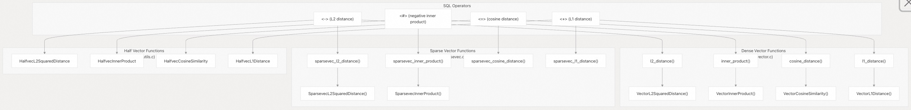
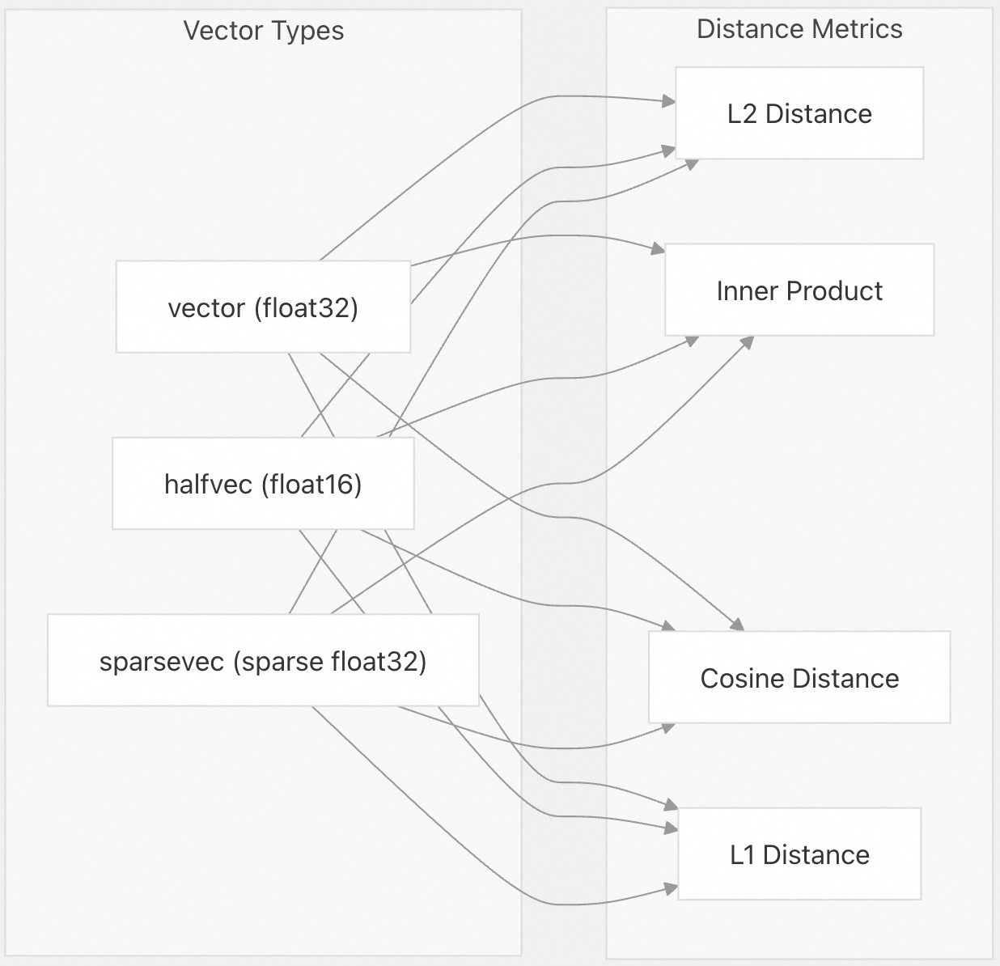
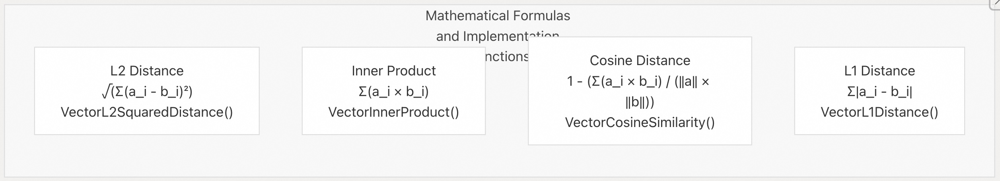
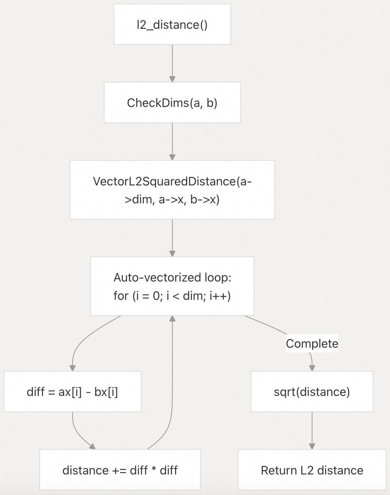
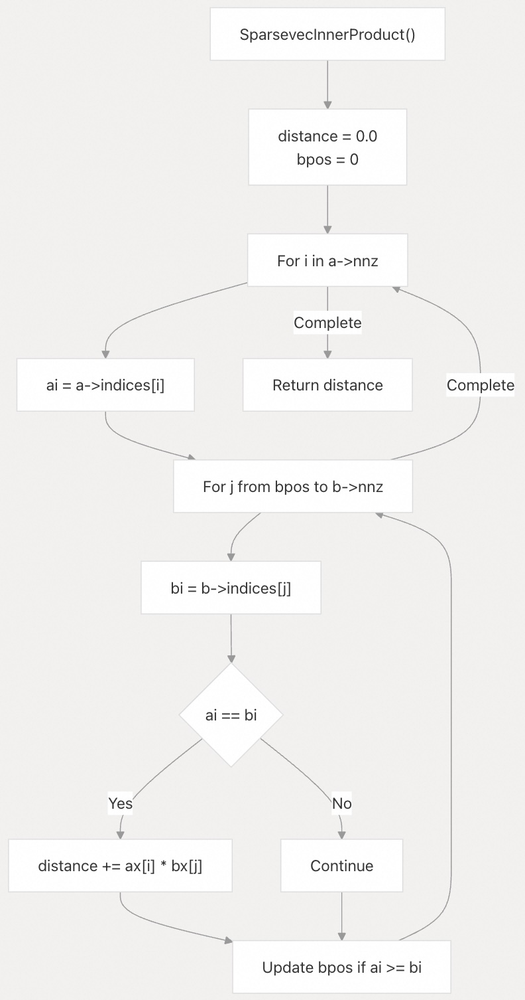
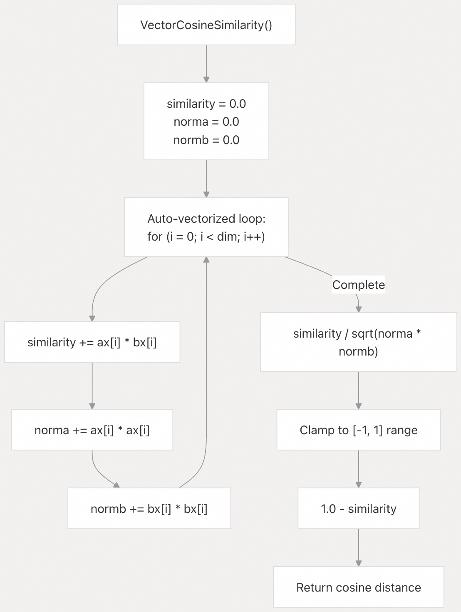
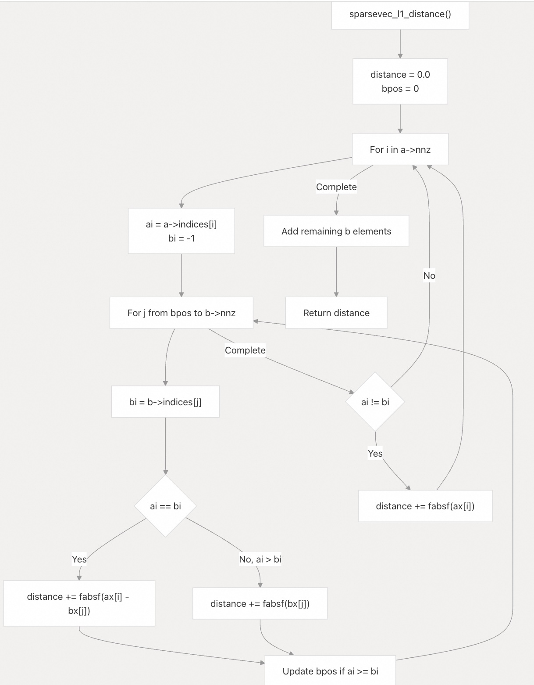

## pgvector 源码学习: 3.1 向量距离度量 (Vector Distance Metrics)   
                                                        
### 作者                                                        
digoal                                                        
                                                        
### 日期                                                        
2025-11-04                                                        
                                                        
### 标签                                                        
pgvector , 源码学习                                                        
                                                        
----                                                        
                                                        
## 背景                                                        
`pgvector` 为**密集向量 (dense vectors)**和**稀疏向量 (sparse vectors)**实现了四种主要的**距离度量 (distance metrics)**：**L2 距离 (欧几里得距离) (L2 (Euclidean))**、**内积 (inner product)**、**余弦 (cosine)**和 **L1 距离 (曼哈顿距离) (L1 (Manhattan) distance)**。每种度量都针对 `vector`、`halfvec` 和 `sparsevec` 类型进行了优化实现，并带有相应的 **SQL 运算符 (SQL operators)** 和 **C 函数 (C functions)**。  
  
---  
  
## 距离函数实现概览 (Distance Function Implementation Overview)  
  
### SQL 运算符到 C 函数的映射 (SQL Operator to C Function Mapping)  
  
  
  
来源: [`src/vector.c` 564-735](https://github.com/pgvector/pgvector/blob/d823c445/src/vector.c#L564-L735) [`src/sparsevec.c` 851-1037](https://github.com/pgvector/pgvector/blob/d823c445/src/sparsevec.c#L851-L1037) [`src/halfutils.c` 22-26](https://github.com/pgvector/pgvector/blob/d823c445/src/halfutils.c#L22-L26)  
  
### 向量类型支持矩阵 (Vector Type Support Matrix)  
  
  
  
来源: [`src/vector.c` 564-735](https://github.com/pgvector/pgvector/blob/d823c445/src/vector.c#L564-L735) [`src/sparsevec.c` 851-1037](https://github.com/pgvector/pgvector/blob/d823c445/src/sparsevec.c#L851-L1037) [`src/halfutils.c` 27-298](https://github.com/pgvector/pgvector/blob/d823c445/src/halfutils.c#L27-L298)  
  
### 距离度量公式和核心函数 (Distance Metric Formulas and Core Functions)  
  
  
  
| 距离度量 (Distance Metric) | 核心函数 (Core Function) | SQL 函数 (SQL Function) | 运算符 (Operator) |  
| :--- | :--- | :--- | :--- |  
| L2 距离 (欧几里得距离) (L2 (Euclidean)) | `VectorL2SquaredDistance` | `l2_distance` | `<->` |  
| 内积 (Inner Product) | `VectorInnerProduct` | `inner_product` | `<#>` |  
| 余弦 (Cosine) | `VectorCosineSimilarity` | `cosine_distance` | `<=>` |  
| L1 距离 (曼哈顿距离) (L1 (Manhattan)) | `VectorL1Distance` | `l1_distance` | `<+>` |  
  
来源: [`src/vector.c` 545-559](https://github.com/pgvector/pgvector/blob/d823c445/src/vector.c#L545-L559) [`src/vector.c` 592-602](https://github.com/pgvector/pgvector/blob/d823c445/src/vector.c#L592-L602) [`src/vector.c` 634-651](https://github.com/pgvector/pgvector/blob/d823c445/src/vector.c#L634-L651) [`src/vector.c` 710-720](https://github.com/pgvector/pgvector/blob/d823c445/src/vector.c#L710-L720)  
  
---  
  
## L2 距离 (欧几里得距离) (L2 Distance (Euclidean))  
  
**L2 距离 (L2 distance)** 衡量的是**欧几里得空间 (Euclidean space)** 中向量之间的直线距离。  
  
### 实现函数 (Implementation Functions)  
  
**密集向量 (`vector`)：**  
  
* `VectorL2SquaredDistance()` [`src/vector.c` 545-559](https://github.com/pgvector/pgvector/blob/d823c445/src/vector.c#L545-L559) - 核心**平方距离 (squared distance)**计算  
* `l2_distance()` [`src/vector.c` 564-574](https://github.com/pgvector/pgvector/blob/d823c445/src/vector.c#L564-L574) - 计算平方距离的**平方根 (square root)**  
* `vector_l2_squared_distance()` [`src/vector.c` 580-590](https://github.com/pgvector/pgvector/blob/d823c445/src/vector.c#L580-L590) - 直接的平方距离函数  
  
**稀疏向量 (`sparsevec`)：**  
  
* `SparsevecL2SquaredDistance()` [`src/sparsevec.c` 803-846](https://github.com/pgvector/pgvector/blob/d823c445/src/sparsevec.c#L803-L846) - 高效处理稀疏表示  
* `sparsevec_l2_distance()` [`src/sparsevec.c` 851-861](https://github.com/pgvector/pgvector/blob/d823c445/src/sparsevec.c#L851-L861) - 平方根封装器  
  
**半精度向量 (`halfvec`)：**  
  
* `HalfvecL2SquaredDistance` [`src/halfutils.c` 22](https://github.com/pgvector/pgvector/blob/d823c445/src/halfutils.c#L22-L22) - 带有 **CPU 调度 (CPU dispatch)** 的函数指针 (Function pointer)  
* `HalfvecL2SquaredDistanceDefault()` [`src/halfutils.c` 27-41](https://github.com/pgvector/pgvector/blob/d823c445/src/halfutils.c#L27-L41) - 默认实现  
* `HalfvecL2SquaredDistanceF16c()` [`src/halfutils.c` 44-76](https://github.com/pgvector/pgvector/blob/d823c445/src/halfutils.c#L44-L76) - **F16C 优化实现 (Optimized F16C implementation)**  
  
### 核心算法流程 (Core Algorithm Flow)  
  
  
  
该实现使用**编译器自动向量化 (compiler auto-vectorization)**，并包含针对半精度向量使用 **F16C 指令 (F16C instructions)** 的 **CPU 特定优化 (CPU-specific optimizations)**。  
  
### SQL 用法 (SQL Usage)  
  
```  
-- L2 distance operator  
SELECT embedding <-> '[3,1,2]' FROM items;  
  
-- Direct function call  
SELECT l2_distance(embedding, '[3,1,2]') FROM items;  
  
-- Squared distance (avoids sqrt)  
SELECT vector_l2_squared_distance(embedding, '[3,1,2]') FROM items;  
```  
  
来源: [`src/vector.c` 545-590](https://github.com/pgvector/pgvector/blob/d823c445/src/vector.c#L545-L590) [`src/sparsevec.c` 803-861](https://github.com/pgvector/pgvector/blob/d823c445/src/sparsevec.c#L803-L861) [`src/halfutils.c` 27-76](https://github.com/pgvector/pgvector/blob/d823c445/src/halfutils.c#L27-L76)  
  
---  
  
## 内积 (Inner Product)  
  
**内积 (Inner product)** 计算的是向量之间**元素级乘积 (element-wise products)** 的总和。  
  
### 实现函数 (Implementation Functions)  
  
**密集向量 (`vector`)：**  
  
* `VectorInnerProduct()` [`src/vector.c` 592-602](https://github.com/pgvector/pgvector/blob/d823c445/src/vector.c#L592-L602) - 核心内积计算  
* `inner_product()` [`src/vector.c` 607-617](https://github.com/pgvector/pgvector/blob/d823c445/src/vector.c#L607-L617) - 返回实际内积  
* `vector_negative_inner_product()` [`src/vector.c` 622-632](https://github.com/pgvector/pgvector/blob/d823c445/src/vector.c#L622-L632) - 返回负值，用于**索引 (indexing)**  
  
**稀疏向量 (`sparsevec`)：**  
  
* `SparsevecInnerProduct()` [`src/sparsevec.c` 882-913](https://github.com/pgvector/pgvector/blob/d823c445/src/sparsevec.c#L882-L913) - 针对稀疏向量的优化  
* `sparsevec_inner_product()` [`src/sparsevec.c` 918-928](https://github.com/pgvector/pgvector/blob/d823c445/src/sparsevec.c#L918-L928) - SQL 函数封装器  
* `sparsevec_negative_inner_product()` [`src/sparsevec.c` 933-943](https://github.com/pgvector/pgvector/blob/d823c445/src/sparsevec.c#L933-L943) - 返回负值，用于索引  
  
**半精度向量 (`halfvec`)：**  
  
* `HalfvecInnerProduct` [`src/halfutils.c` 23](https://github.com/pgvector/pgvector/blob/d823c445/src/halfutils.c#L23-L23) - 带有 CPU 调度的函数指针  
* `HalfvecInnerProductDefault()` [`src/halfutils.c` 79-89](https://github.com/pgvector/pgvector/blob/d823c445/src/halfutils.c#L79-L89) - 默认实现  
* `HalfvecInnerProductF16c()` [`src/halfutils.c` 92-119](https://github.com/pgvector/pgvector/blob/d823c445/src/halfutils.c#L92-L119) - F16C 优化版本  
  
### 稀疏向量算法 (Sparse Vector Algorithm)  
  
  
  
稀疏实现使用**双指针技术 (two-pointer technique)** 来高效查找匹配的索引，而无需遍历所有元素。  
  
### SQL 用法 (SQL Usage)  
  
```  
-- Negative inner product operator (for indexing)  
SELECT embedding <#> '[3,1,2]' FROM items;  
  
-- Actual inner product  
SELECT inner_product(embedding, '[3,1,2]') FROM items;  
  
-- For sparse vectors  
SELECT sparsevec_inner_product(sparse_embedding, '{1:1,2:2}/2') FROM items;  
```  
  
来源: [`src/vector.c` 592-632](https://github.com/pgvector/pgvector/blob/d823c445/src/vector.c#L592-L632) [`src/sparsevec.c` 882-943](https://github.com/pgvector/pgvector/blob/d823c445/src/sparsevec.c#L882-L943) [`src/halfutils.c` 79-119](https://github.com/pgvector/pgvector/blob/d823c445/src/halfutils.c#L79-L119)  
  
---  
  
## 余弦距离 (Cosine Distance)  
  
**余弦距离 (Cosine distance)** 通过计算 `1 - 余弦相似度 (cosine_similarity)` 来衡量向量之间的**角距离 (angular distance)**。  
  
### 实现函数 (Implementation Functions)  
  
**密集向量 (`vector`)：**  
  
* `VectorCosineSimilarity()` [`src/vector.c` 634-651](https://github.com/pgvector/pgvector/blob/d823c445/src/vector.c#L634-L651) - **单次遍历 (single pass)** 计算余弦相似度  
* `cosine_distance()` [`src/vector.c` 656-681](https://github.com/pgvector/pgvector/blob/d823c445/src/vector.c#L656-L681) - 返回 `1 - similarity` 并带有**范围钳位 (range clamping)**  
  
**稀疏向量 (`sparsevec`)：**  
  
* `sparsevec_cosine_distance()` [`src/sparsevec.c` 948-988](https://github.com/pgvector/pgvector/blob/d823c445/src/sparsevec.c#L948-L988) - 使用 `SparsevecInnerProduct()` 加上单独的**范数 (norm)** 计算  
  
**半精度向量 (`halfvec`)：**  
  
* `HalfvecCosineSimilarity` [`src/halfutils.c` 24](https://github.com/pgvector/pgvector/blob/d823c445/src/halfutils.c#L24-L24) - 带有 CPU 调度的函数指针  
* `HalfvecCosineSimilarityDefault()` [`src/halfutils.c` 122-142](https://github.com/pgvector/pgvector/blob/d823c445/src/halfutils.c#L122-L142) - 默认实现  
* `HalfvecCosineSimilarityF16c()` [`src/halfutils.c` 145-192](https://github.com/pgvector/pgvector/blob/d823c445/src/halfutils.c#L145-L192) - F16C 优化版本  
  
### 密集向量单次遍历算法 (Dense Vector Single-Pass Algorithm)  
  
  
  
该实现通过对向量的单次遍历，高效地计算**相似度 (similarity)** 和**两个范数 (both norms)**，然后应用范围钳位来处理**浮点精度 (floating-point precision)** 问题。  
  
### SQL 用法 (SQL Usage)  
  
```  
-- Cosine distance operator  
SELECT embedding <=> '[3,1,2]' FROM items;  
  
-- Direct function call  
SELECT cosine_distance(embedding, '[3,1,2]') FROM items;  
  
-- For sparse vectors  
SELECT sparsevec_cosine_distance(sparse_embedding, '{1:1,2:2}/2') FROM items;  
```  
  
来源: [`src/vector.c` 634-681](https://github.com/pgvector/pgvector/blob/d823c445/src/vector.c#L634-L681) [`src/sparsevec.c` 948-988](https://github.com/pgvector/pgvector/blob/d823c445/src/sparsevec.c#L948-L988) [`src/halfutils.c` 122-192](https://github.com/pgvector/pgvector/blob/d823c445/src/halfutils.c#L122-L192)  
  
---  
  
## L1 距离 (曼哈顿距离) (L1 Distance (Manhattan))  
  
**L1 距离 (L1 distance)** 计算**对应向量元素之间 (corresponding vector elements)** 的**绝对差值之和 (sum of absolute differences)**。  
  
### 实现函数 (Implementation Functions)  
  
**密集向量 (`vector`)：**  
  
* `VectorL1Distance()` [`src/vector.c` 710-720](https://github.com/pgvector/pgvector/blob/d823c445/src/vector.c#L710-L720) - 核心 L1 距离计算  
* `l1_distance()` [`src/vector.c` 725-735](https://github.com/pgvector/pgvector/blob/d823c445/src/vector.c#L725-L735) - SQL 函数封装器  
  
**稀疏向量 (`sparsevec`)：**  
  
* `sparsevec_l1_distance()` [`src/sparsevec.c` 993-1037](https://github.com/pgvector/pgvector/blob/d823c445/src/sparsevec.c#L993-L1037) - 优化后的稀疏实现  
  
**半精度向量 (`halfvec`)：**  
  
* `HalfvecL1Distance` [`src/halfutils.c` 25](https://github.com/pgvector/pgvector/blob/d823c445/src/halfutils.c#L25-L25) - 带有 CPU 调度的函数指针  
* `HalfvecL1DistanceDefault(https://github.com/pgvector/pgvector/blob/d823c445/src/halfutils.c#L195-L205)` [`src/halfutils.c` 195-205]() - 默认实现  
* `HalfvecL1DistanceF16c()` [`src/halfutils.c` 209-237](https://github.com/pgvector/pgvector/blob/d823c445/src/halfutils.c#L209-L237) - F16C 优化版本  
  
### 稀疏向量 L1 算法 (Sparse Vector L1 Algorithm)  
  
  
  
稀疏实现通过**同时遍历 (iterating simultaneously)** 两个索引数组，高效地处理向量具有不同**稀疏模式 (sparsity patterns)** 的情况。  
  
### SQL 用法 (SQL Usage)  
  
```  
-- L1 distance operator  
SELECT embedding <+> '[3,1,2]' FROM items;  
  
-- Direct function call  
SELECT l1_distance(embedding, '[3,1,2]') FROM items;  
  
-- For sparse vectors  
SELECT sparsevec_l1_distance(sparse_embedding, '{1:1,2:2}/2') FROM items;  
```  
  
来源: [`src/vector.c` 710-735](https://github.com/pgvector/pgvector/blob/d823c445/src/vector.c#L710-L735) [`src/sparsevec.c` 993-1037](https://github.com/pgvector/pgvector/blob/d823c445/src/sparsevec.c#L993-L1037) [`src/halfutils.c` 195-237](https://github.com/pgvector/pgvector/blob/d823c445/src/halfutils.c#L195-L237)  
  
---  
  
## 距离度量和索引 (Distance Metrics and Indexing)  
  
`pgvector` 中的每种距离度量都可以用于**索引 (indexing)**，以加速**相似性搜索 (similarity search)** 操作。下表总结了每种度量可用的**运算符类 (operator classes)**：  
  
| 距离度量 (Distance Metric) | 运算符 (Operator) | 运算符类 (Operator Class) | HNSW 支持 (HNSW Support) | IVFFlat 支持 (IVFFlat Support) |  
| :--- | :--- | :--- | :--- | :--- |  
| L2 距离 (欧几里得距离) (L2 (Euclidean)) | `<->` | `vector_l2_ops` | 是 (Yes) | 是 (Yes) |  
| 内积 (Inner Product) | `<#>` | `vector_ip_ops` | 是 (Yes) | 是 (Yes) |  
| 余弦 (Cosine) | `<=>` | `vector_cosine_ops` | 是 (Yes) | 是 (Yes) |  
| L1 距离 (曼哈顿距离) (L1 (Manhattan)) | `<+>` | `vector_l1_ops` | 是 (Yes) | 否 (No) |  
  
### 为不同的距离度量创建索引 (Creating Indexes for Different Distance Metrics)  
  
```  
-- L2 distance index  
CREATE INDEX ON items USING hnsw (embedding vector_l2_ops);  
  
-- Inner product index  
CREATE INDEX ON items USING hnsw (embedding vector_ip_ops);  
  
-- Cosine distance index  
CREATE INDEX ON items USING hnsw (embedding vector_cosine_ops);  
  
-- L1 distance index  
CREATE INDEX ON items USING hnsw (embedding vector_l1_ops);  
```  
  
来源: [`README.md` 218-254](https://github.com/pgvector/pgvector/blob/d823c445/README.md#L218-L254)  
  
---  
  
## 选择正确的距离度量 (Choosing the Right Distance Metric)  
  
距离度量的选择取决于您的**数据性质 (nature of your data)** 和应用程序的特定要求：  
  
* **L2 距离 (L2 Distance)**：通用的度量，适用于许多应用程序。当向量的**大小 (magnitude)** 有意义时效果很好。  
* **内积 (Inner Product)**：当向量经过**预归一化 (pre-normalized)** 时很有用。对于非归一化向量，大小较高的向量将占据主导地位。  
* **余弦距离 (Cosine Distance)**：比较文档或**文本嵌入 (text embeddings)** 的理想选择，其中**方向 (direction)** 比大小更重要。常用于**归一化向量 (normalized vectors)**。  
* **L1 距离 (L1 Distance)**：适用于沿每个维度上的差异应被**同等加权 (weighted equally)** 而无需平方的情况。与 L2 距离相比，对**异常值 (outliers)** 更具鲁棒性 (robust)。  
  
对于**归一化到长度 1 (normalized to length 1)** 的向量（例如 **OpenAI 嵌入 (OpenAI embeddings)**），使用内积可以提供最佳性能。  
  
来源: [`README.md` 718-722](https://github.com/pgvector/pgvector/blob/d823c445/README.md#L718-L722)  
  
---  
  
## 不同向量类型的距离度量 (Distance Metrics with Different Vector Types)  
  
所有四种主要距离度量都适用于 `vector`、`halfvec` 和 `sparsevec` 类型。每种向量类型都有相应的运算符类：  
  
| 向量类型 (Vector Type) | L2 距离 (L2) | 内积 (Inner Product) | 余弦 (Cosine) | L1 距离 (L1) |  
| :--- | :--- | :--- | :--- | :--- |  
| `vector` | `vector_l2_ops` | `vector_ip_ops` | `vector_cosine_ops` | `vector_l1_ops` |  
| `halfvec` | `halfvec_l2_ops` | `halfvec_ip_ops` | `halfvec_cosine_ops` | `halfvec_l1_ops` |  
| `sparsevec` | `sparsevec_l2_ops` | `sparsevec_ip_ops` | `sparsevec_cosine_ops` | `sparsevec_l1_ops` |  
  
稀疏向量实现可以高效地处理元素可能具有**零值 (zero values)** 的情况。  
  
来源: [`README.md` 224](https://github.com/pgvector/pgvector/blob/d823c445/README.md#L224-L224) [`src/sparsevec.c` 799-1124](https://github.com/pgvector/pgvector/blob/d823c445/src/sparsevec.c#L799-L1124)  
  
---  
  
## 性能考量 (Performance Considerations)  
  
`pgvector` 中距离度量的实现包括多项优化：  
  
1.  **自动向量化 (Auto-vectorization)**：代码使用**编译器自动向量化 (compiler auto-vectorization)** 来利用可用的 **SIMD 指令 (SIMD instructions)**。  
2.  **单次遍历算法 (Single-pass algorithms)**：像余弦距离这样的度量可以在对向量的**单次遍历 (single pass)** 中计算多个值（内积、范数）。  
3.  **优化平方根 (Optimized square root)**：L2 距离函数提供了一个**平方距离函数 (squared distance function)**，以便在可能的情况下避免不必要的**平方根 (square root)** 计算。  
4.  **稀疏表示 (Sparse representation)**：对于稀疏向量，距离函数经过优化，可以高效地处理**零元素 (zero elements)**。  
  
对于**归一化向量 (normalized vectors)** 的最佳查询性能，请使用**内积 (inner product)**，因为它可以避免昂贵的**归一化计算 (normalization calculations)**。  
  
来源: [`Makefile` 30-36](https://github.com/pgvector/pgvector/blob/d823c445/Makefile#L30-L36) [`src/vector.c` 545-559](https://github.com/pgvector/pgvector/blob/d823c445/src/vector.c#L545-L559) [`README.md` 718-722](https://github.com/pgvector/pgvector/blob/d823c445/README.md#L718-L722)  
    
#### [期望 PostgreSQL|开源PolarDB 增加什么功能?](https://github.com/digoal/blog/issues/76 "269ac3d1c492e938c0191101c7238216")
  
  
#### [PolarDB 开源数据库](https://openpolardb.com/home "57258f76c37864c6e6d23383d05714ea")
  
  
#### [PolarDB 学习图谱](https://www.aliyun.com/database/openpolardb/activity "8642f60e04ed0c814bf9cb9677976bd4")
  
  
#### [PostgreSQL 解决方案集合](../201706/20170601_02.md "40cff096e9ed7122c512b35d8561d9c8")
  
  
#### [德哥 / digoal's Github - 公益是一辈子的事.](https://github.com/digoal/blog/blob/master/README.md "22709685feb7cab07d30f30387f0a9ae")
  
  
#### [About 德哥](https://github.com/digoal/blog/blob/master/me/readme.md "a37735981e7704886ffd590565582dd0")
  
  

  
