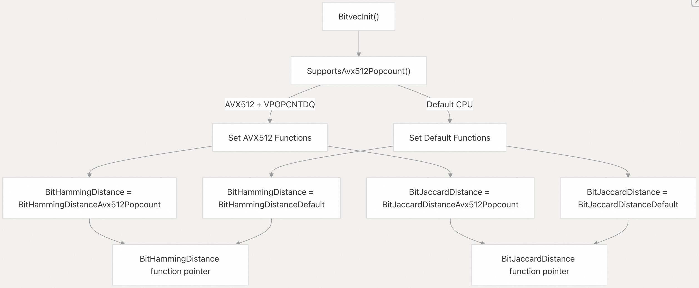
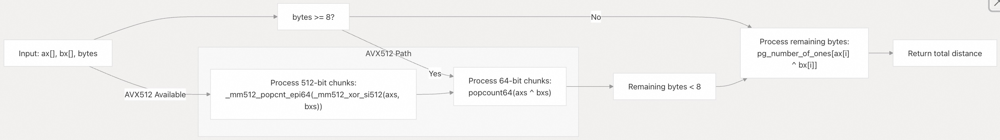
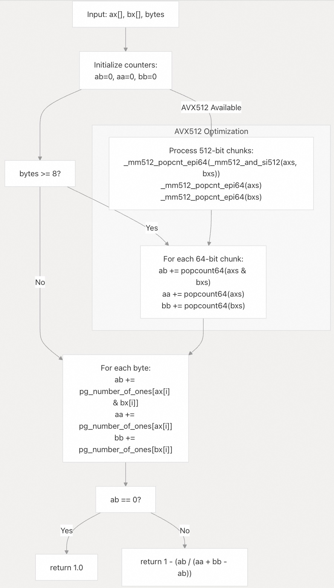

## pgvector 源码学习: 3.2 比特向量距离度量 (`Bit Vector Distance Metrics`)  
                                                          
### 作者                                                          
digoal                                                          
                                                          
### 日期                                                          
2025-11-04                                                          
                                                          
### 标签                                                          
pgvector , 源码学习                                                          
                                                          
----                                                          
                                                          
## 背景                                                          
本文介绍 pgvector 中为**比特向量** (`bit vectors`) 实现的**距离度量** (`distance metrics`)，特别是**汉明距离** (`Hamming Distance`) 和**杰卡德距离** (`Jaccard Distance`) 的计算。这些度量与 `bit` 数据类型一起使用，用于**二进制相似性搜索** (`binary similarity search`) 操作。  
  
## 概述 (`Overview`)  
  
pgvector 为**比特向量** (`bit vectors`) 实现了两种专门的距离度量，每种都通过特定于 **CPU** 的实现进行了优化，在可用时利用 **SIMD** (单指令多数据) 指令：  
  
| 距离度量 (`Distance Metric`) | 运算符 (`Operator`) | 数学公式 (`Mathematical Formula`) | 用例 (`Use Case`) |  
| :--- | :--- | :--- | :--- |  
| **汉明距离** (`Hamming Distance`) | `<~>` | 不同的比特数 (`Number of differing bits`) | 二进制相似性 (`Binary similarity`)，精确匹配 (`exact matching`) |  
| **杰卡德距离** (`Jaccard Distance`) | `<%>` | `1 - | A ∩ B | / | A ∪ B |` | 集合相异性 (`Set dissimilarity`) |  
  
两种度量都利用**函数指针** (`function pointers`) 在默认实现和优化实现之间进行**运行时分派** (`runtime dispatching`)，从而实现自动 **CPU** 特性检测和选择。  
  
来源: [`src/bitutils.h` 11-12](https://github.com/pgvector/pgvector/blob/d823c445/src/bitutils.h#L11-L12) [`src/bitutils.c` 44-45](https://github.com/pgvector/pgvector/blob/d823c445/src/bitutils.c#L44-L45)  
  
## 函数分派架构 (`Function Dispatch Architecture`)  
  
比特向量距离系统使用**运行时分派机制** (`runtime dispatch mechanism`)，根据可用的 **CPU** 特性选择最佳的实现：  
  
  
  
**初始化过程** (`initialization process`) 在扩展加载期间只发生一次，设置用于所有后续距离计算的**函数指针** (`function pointers`)。  
  
来源: [`src/bitutils.c` 206-222](https://github.com/pgvector/pgvector/blob/d823c445/src/bitutils.c#L206-L222) [`src/bitutils.c` 171-202](https://github.com/pgvector/pgvector/blob/d823c445/src/bitutils.c#L171-L202)  
  
## 汉明距离实现 (`Hamming Distance Implementation`)  
  
**汉明距离** (`Hamming distance`) 计算两个比特向量 (`bit vectors`) 之间不同比特的数量。该实现采用**分层方法** (`hierarchical approach`)，以最大可用**数据块** (`chunks`) 的形式处理数据：  
  
  
  
默认实现会在可用时处理 **64 位**数据块，使用**编译器内置函数** (`compiler builtins`) 或 **PostgreSQL** 的 `popcount` 实现：  
  
* **64 位处理** (`64-bit processing`): 使用 `popcount64(axs ^ bxs)` 来计算 **8 字节**数据块中不同的比特数。  
* **字节处理** (`Byte processing`): 对于剩余的字节，回退到**查找表** (`lookup table`) `pg_number_of_ones[ax[i] ^ bx[i]]`。  
* **AVX512 优化** (`AVX512 optimization`): 使用 `_mm512_popcnt_epi64` 指令处理 **64 字节**数据块。  
  
来源: [`src/bitutils.c` 47-71](https://github.com/pgvector/pgvector/blob/d823c445/src/bitutils.c#L47-L71) [`src/bitutils.c` 74-93](https://github.com/pgvector/pgvector/blob/d823c445/src/bitutils.c#L74-L93)  
  
## 杰卡德距离实现 (`Jaccard Distance Implementation`)  
  
**杰卡德距离** (`Jaccard distance`) 衡量**二进制集合** (`binary sets`) 之间的相异性，计算公式为 `1 - |A ∩ B| / |A ∪ B|`。该实现同时计算**交集** (`intersection`) 和两个集合的**基数** (`cardinalities`)：  
  
  
  
该算法维护三个**运行总计** (`running totals`)：  
  
* **ab**: 使用 **按位 AND**  (`bitwise AND`) (`axs & bxs`) 计算的 **交集计数**  (`Intersection count`)  
* **aa**: 使用 `popcount(axs)` 计算的第一个向量的**基数**  (`Cardinality`)  
* **bb**: 使用 `popcount(bxs)` 计算的第二个向量的**基数**  (`Cardinality`)  
  
当向量没有交集时，有**特殊处理**  (`Special handling`) 来防止**除以零** (`division by zero`)。  
  
来源: [`src/bitutils.c` 96-129](https://github.com/pgvector/pgvector/blob/d823c445/src/bitutils.c#L96-L129) [`src/bitutils.c` 132-157](https://github.com/pgvector/pgvector/blob/d823c445/src/bitutils.c#L132-L157)  
  
## CPU 特性检测和优化 (`CPU Feature Detection and Optimization`)  
  
该系统包含全面的 **CPU 特性检测** (`CPU feature detection`)，以便在可用时启用 **AVX512** 优化：  
  
| 特性 (`Feature`) | 用途 (`Purpose`) | 检测方法 (`Detection Method`) |  
| :--- | :--- | :--- |  
| **OSXSAVE** | 操作系统对**扩展状态** (`extended state`) 的支持 | `CPUID leaf 1, ECX bit 27` |  
| **XMM/YMM/ZMM** | 寄存器状态 (`Register state`) 已启用 | `_xgetbv(0) & 0xe6 == 0xe6` |  
| **AVX512F** | **AVX512 基础** (`AVX512 foundation`) | `CPUID leaf 7, EBX bit 16` |  
| **AVX512VPOPCNTDQ** | **位群计数指令** (`Population count instructions`) | `CPUID leaf 7, ECX bit 14` |  
  
**AVX512 实现** (`AVX512 implementations`) 通过并行处理 **512 位 (64 字节)** 数据块，相比默认实现处理 **64 位**数据块，提供了显著的**性能提升** (`performance improvements`)。  
  
来源: [`src/bitutils.c` 160-203](https://github.com/pgvector/pgvector/blob/d823c445/src/bitutils.c#L160-L203)  
  
## 性能特征 (`Performance Characteristics`)  
  
比特向量距离计算的 **性能层次结构** (`performance hierarchy`) 遵循以下顺序：  
  
1.  **AVX512VPOPCNTDQ**: 每迭代处理 **64 字节**，使用专用的 `popcount` 指令。  
2.  **默认 (Default) + popcount64**: 每迭代处理 **8 字节**，使用**硬件 popcount** (`hardware popcount`)。  
3.  **回退 (Fallback)**: 使用**查找表** (`lookup tables`) 进行**逐字节处理** (`Byte-by-byte processing`)。  
  
**目标克隆编译** (`Target clones compilation`) (`BIT_TARGET_CLONES`) 允许编译器生成针对不同 **CPU 特性** (`CPU features`) 优化的**多个函数版本** (`multiple versions of functions`)，并根据可用指令在运行时进行选择。  
  
这些实现使用 `memcpy` 进行 **64 位操作**，并使用**直接字节访问** (`direct byte access`) 处理剩余数据，从而安全地处理**非对齐内存访问** (`unaligned memory access`)。  
  
来源: [`src/bitutils.c` 27-42](https://github.com/pgvector/pgvector/blob/d823c445/src/bitutils.c#L27-L42) [`src/bitutils.c` 206-222](https://github.com/pgvector/pgvector/blob/d823c445/src/bitutils.c#L206-L222)  
      
#### [期望 PostgreSQL|开源PolarDB 增加什么功能?](https://github.com/digoal/blog/issues/76 "269ac3d1c492e938c0191101c7238216")
  
  
#### [PolarDB 开源数据库](https://openpolardb.com/home "57258f76c37864c6e6d23383d05714ea")
  
  
#### [PolarDB 学习图谱](https://www.aliyun.com/database/openpolardb/activity "8642f60e04ed0c814bf9cb9677976bd4")
  
  
#### [PostgreSQL 解决方案集合](../201706/20170601_02.md "40cff096e9ed7122c512b35d8561d9c8")
  
  
#### [德哥 / digoal's Github - 公益是一辈子的事.](https://github.com/digoal/blog/blob/master/README.md "22709685feb7cab07d30f30387f0a9ae")
  
  
#### [About 德哥](https://github.com/digoal/blog/blob/master/me/readme.md "a37735981e7704886ffd590565582dd0")
  
  

  
