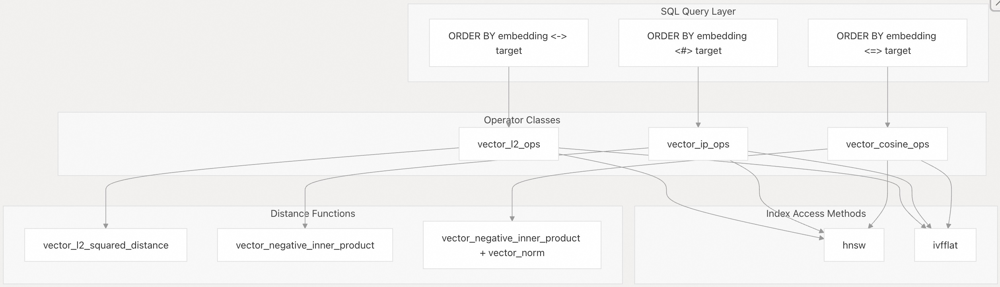
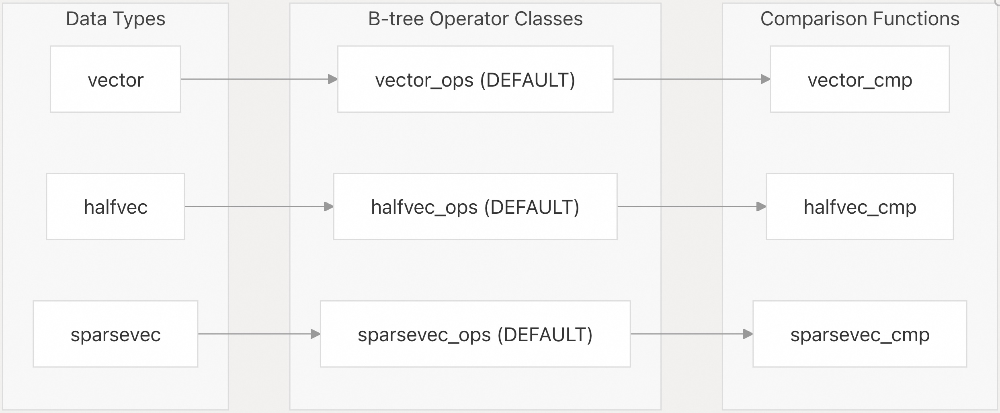
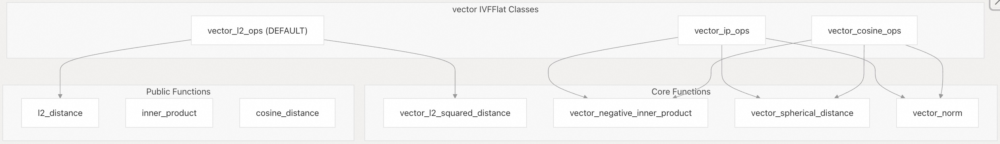
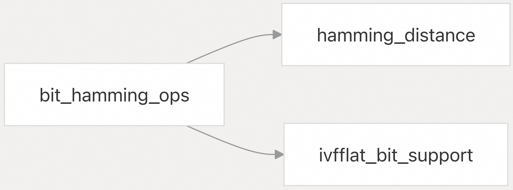
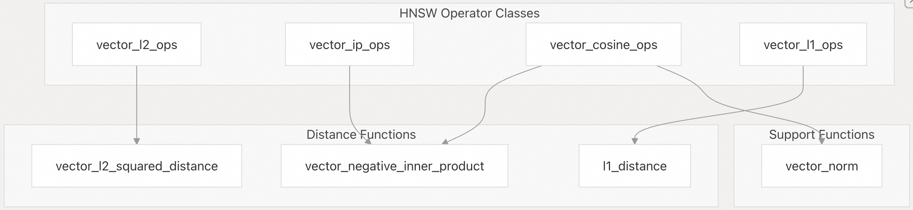
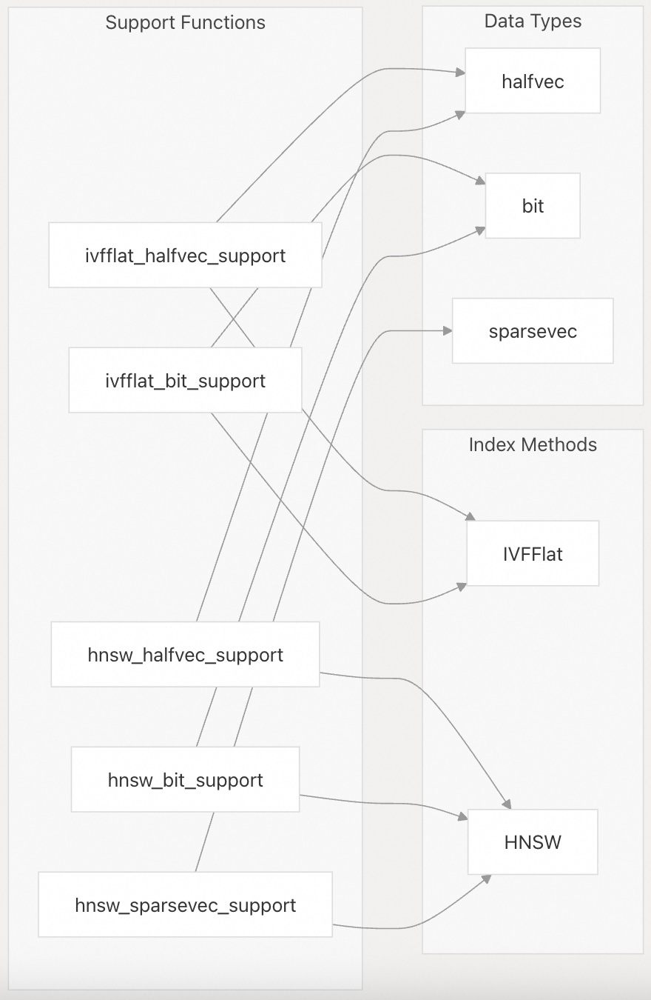

## pgvector 源码学习: 3.3 操作符类 (Operator Classes)  
                                                            
### 作者                                                            
digoal                                                            
                                                            
### 日期                                                            
2025-11-04                                                            
                                                            
### 标签                                                            
pgvector , 源码学习                                                            
                                                            
----                                                            
                                                            
## 背景                                                            
本文介绍 **操作符类 (Operator Classes)**，它们使 **PostgreSQL** 的**查询规划器 (query planner)**能够使用 **pgvector** 的专用**索引方法 (index methods)**进行**近似最近邻搜索 (approximate nearest neighbor searches)**。操作符类将**距离操作符 (distance operators)**映射到**距离函数 (distance functions)**，并定义了哪些**索引访问方法 (index access methods)**可以优化特定的查询模式。  
  
## **概述 (Overview)**  
  
**pgvector** 中的**操作符类 (Operator Classes)**弥合了 **SQL 操作符**（例如用于 **L2 距离 (L2 distance)**的 `<->`）与**距离函数 (distance functions)**的底层 **C 实现**之间的差距。它们告知 **PostgreSQL** 的**查询规划器 (query planner)**，哪些**索引 (indexes)**可以优化使用特定**距离操作符 (distance operators)**的查询，从而实现高效的**近似最近邻搜索 (approximate nearest neighbor searches)**。  
  
  
  
来源: [`sql/vector.sql` 292-332](https://github.com/pgvector/pgvector/blob/d823c445/sql/vector.sql#L292-L332)  
  
## **距离操作符映射 (Distance Operator Mapping)**  
  
每个**距离操作符 (distance operator)**都通过**操作符类 (operator class)**定义映射到特定的**距离函数 (distance functions)**。这些**操作符类 (operator classes)**确保 **PostgreSQL** 了解在**索引操作 (index operations)**期间应调用哪个函数进行**距离计算 (distance calculations)**。  
  
| 操作符 (Operator) | 距离度量 (Distance Metric) | 主要函数 (Primary Function) | 用法 (Usage) |  
| :--- | :--- | :--- | :--- |  
| `<->` | L2 (**欧几里得**) | `l2_distance` | 默认**向量相似度 (vector similarity)** |  
| `<#>` | **负内积 (Negative Inner Product)** | `vector_negative_inner_product` | **最大内积搜索 (Maximum inner product search)** |  
| `<=>` | **余弦距离 (Cosine Distance)** | `cosine_distance` | **角度相似度 (Angular similarity)** |  
| `<+>` | L1 (**曼哈顿**) | `l1_distance` | **曼哈顿距离 (Manhattan distance)** |  
| `<~>` | **汉明距离 (Hamming Distance)** | `hamming_distance` | **二进制向量相似度 (Binary vector similarity)** |  
| `<%>` | **Jaccard 距离 (Jaccard Distance)** | `jaccard_distance` | **集合相似度 (Set similarity)** |  
  
来源: [`sql/vector.sql` 174-192](https://github.com/pgvector/pgvector/blob/d823c445/sql/vector.sql#L174-L192) [`sql/vector.sql` 660-668](https://github.com/pgvector/pgvector/blob/d823c445/sql/vector.sql#L660-L668)  
  
## **B-tree 操作符类 (B-tree Operator Classes)**  
  
**B-tree 操作符类 (B-tree operator classes)**支持**向量类型 (vector types)**的标准**比较操作 (comparison operations)**和**排序 (sorting)**。它们被标记为 `DEFAULT`，支持**相等 (equality)**和**排序 (ordering)**操作，而非**相似度搜索 (similarity search)**。  
  
  
  
**B-tree 操作符类 (B-tree operator classes)**定义了标准**比较操作符 (comparison operators)**（`<`、`<=`、`=`、`>=`、`>`），并使用如 `vector_cmp` 等**比较函数 (comparison functions)**对**向量 (vectors)**进行**字典序排序 (lexicographic ordering)**。  
  
来源: [`sql/vector.sql` 283-290](https://github.com/pgvector/pgvector/blob/d823c445/sql/vector.sql#L283-L290) [`sql/vector.sql` 592-599](https://github.com/pgvector/pgvector/blob/d823c445/sql/vector.sql#L592-L599) [`sql/vector.sql` 886-893](https://github.com/pgvector/pgvector/blob/d823c445/sql/vector.sql#L886-L893)  
  
## **IVFFlat 操作符类 (IVFFlat Operator Classes)**  
  
**IVFFlat 操作符类 (IVFFlat operator classes)**支持**倒排文件索引 (inverted file indexing)**，用于**近似最近邻搜索 (approximate nearest neighbor search)**。每个操作符类都包含用于 **k-means 分区 (k-means partitioning)**阶段的**聚类函数 (clustering functions)**，以及用于**类型特定优化 (type-specific optimizations)**的**支持函数 (support functions)**。  
  
### **向量类型 (Vector Type) IVFFlat 类**  
  
  
  
* `vector_l2_ops`: 默认类，使用 **L2 距离 (L2 distance)**，通过 `vector_l2_squared_distance` 进行**聚类 (clustering)**。  
* `vector_ip_ops`: **内积搜索 (Inner product search)**，使用**球面距离 (spherical distance)**进行 **k-means 聚类 (k-means clustering)**。  
* `vector_cosine_ops`: **余弦相似度 (Cosine similarity)**，需要**向量归一化 (vector normalization)**。  
  
来源: [`sql/vector.sql` 292-311](https://github.com/pgvector/pgvector/blob/d823c445/sql/vector.sql#L292-L311)  
  
### **半精度向量 (Half Vector) IVFFlat 类**  
  
**半精度向量操作符类 (Half vector operator classes)**包含**支持函数 (support functions)** (`ivfflat_halfvec_support`)，用于在**索引操作 (index operations)**期间进行 **16 位精度优化 (16-bit precision optimizations)**。  
  
来源: [`sql/vector.sql` 601-623](https://github.com/pgvector/pgvector/blob/d823c445/sql/vector.sql#L601-L623)  
  
### **位向量 (Bit Vector) IVFFlat 类**  
  
**位向量 IVFFlat 类 (Bit vector IVFFlat class)**支持**汉明距离 (Hamming distance)**，并使用专用的**位操作函数 (bit manipulation functions)**。  
  
  
  
来源: [`sql/vector.sql` 672-677](https://github.com/pgvector/pgvector/blob/d823c445/sql/vector.sql#L672-L677)  
  
## **HNSW 操作符类 (HNSW Operator Classes)**  
  
**HNSW 操作符类 (HNSW operator classes)**支持**分层可导航小世界索引 (Hierarchical Navigable Small World indexing)**，与 **IVFFlat** 相比，它们支持更全面的**距离度量 (distance metric)**。  
  
### **HNSW 距离支持矩阵 (HNSW Distance Support Matrix)**  
  
| 数据类型 (Data Type) | L2 (`<->`) | 内积 (Inner Product) (`<#>`) | 余弦 (Cosine) (`<=>`) | L1 (`<+>`) | 汉明 (Hamming) (`<~>`) | Jaccard (`<%>`) |  
| :--- | :--- | :--- | :--- | :--- | :--- | :--- |  
| `vector` | ✓ | ✓ | ✓ | ✓ | - | - |  
| `halfvec` | ✓ | ✓ | ✓ | ✓ | - | - |  
| `sparsevec` | ✓ | ✓ | ✓ | ✓ | - | - |  
| `bit` | - | - | - | - | ✓ | ✓ |  
  
### **HNSW 操作符类结构 (HNSW Operator Class Structure)**  
  
  
  
**HNSW 操作符类 (HNSW operator classes)**比 **IVFFlat 类**更简单，因为它们不需要**聚类函数 (clustering functions)**，主要关注在**图遍历 (graph traversal)**期间使用的**距离计算函数 (distance calculation functions)**。  
  
来源: [`sql/vector.sql` 313-332](https://github.com/pgvector/pgvector/blob/d823c445/sql/vector.sql#L313-L332) [`sql/vector.sql` 625-648](https://github.com/pgvector/pgvector/blob/d823c445/sql/vector.sql#L625-L648)  
  
## **支持函数 (Support Functions)**  
  
**支持函数 (Support functions)**提供**类型特定的优化 (type-specific optimizations)**，并使**索引访问方法 (index access methods)**能够有效地处理不同的**向量格式 (vector formats)**。  
  
### **支持函数类型 (Support Function Types)**  
  
  
  
**支持函数 (Support functions)**在**操作符类 (operator class)**定义中注册为 `FUNCTION 3` 或 `FUNCTION 5`，并为以下各项提供专业化处理：  
  
* **半精度向量 (Half precision vectors)**：优化的 **16 位浮点运算 (16-bit floating-point operations)**  
* **位向量 (Bit vectors)**：用于**汉明/Jaccard 距离 (Hamming/Jaccard distances)**的高效**位操作 (bit manipulation)**  
* **稀疏向量 (Sparse vectors)**：针对**稀疏向量表示 (sparse vector representations)**的优化操作  
  
来源: [`sql/vector.sql` 266-279](https://github.com/pgvector/pgvector/blob/d823c445/sql/vector.sql#L266-L279) [`sql/vector.sql` 606](https://github.com/pgvector/pgvector/blob/d823c445/sql/vector.sql#L606-L606) [`sql/vector.sql` 677](https://github.com/pgvector/pgvector/blob/d823c445/sql/vector.sql#L677-L677)  
  
## **默认操作符类 (Default Operator Classes)**  
  
当在**索引创建 (index creation)**中未明确指定**操作符类 (operator class)**时，**PostgreSQL** 会自动选择**默认操作符类 (Default operator classes)**：  
  
* **B-tree 默认值**: `vector_ops`、`halfvec_ops`、`sparsevec_ops` 用于**比较操作 (comparison operations)**  
* **IVFFlat 默认值**: `vector_l2_ops` 用于 **L2 距离相似度搜索 (L2 distance similarity search)**  
* **HNSW**: 没有默认类 - 必须**明确指定 (explicitly specified)**  
  
```  
-- Uses default vector_l2_ops for IVFFlat  
CREATE INDEX ON items USING ivfflat (embedding);  
  
-- Must specify operator class for HNSW  
CREATE INDEX ON items USING hnsw (embedding vector_l2_ops);  
```  
  
来源: [`sql/vector.sql` 283](https://github.com/pgvector/pgvector/blob/d823c445/sql/vector.sql#L283-L283) [`sql/vector.sql` 292](https://github.com/pgvector/pgvector/blob/d823c445/sql/vector.sql#L292-L292) [`sql/vector.sql` 592](https://github.com/pgvector/pgvector/blob/d823c445/sql/vector.sql#L592-L592)  
    
#### [期望 PostgreSQL|开源PolarDB 增加什么功能?](https://github.com/digoal/blog/issues/76 "269ac3d1c492e938c0191101c7238216")
  
  
#### [PolarDB 开源数据库](https://openpolardb.com/home "57258f76c37864c6e6d23383d05714ea")
  
  
#### [PolarDB 学习图谱](https://www.aliyun.com/database/openpolardb/activity "8642f60e04ed0c814bf9cb9677976bd4")
  
  
#### [PostgreSQL 解决方案集合](../201706/20170601_02.md "40cff096e9ed7122c512b35d8561d9c8")
  
  
#### [德哥 / digoal's Github - 公益是一辈子的事.](https://github.com/digoal/blog/blob/master/README.md "22709685feb7cab07d30f30387f0a9ae")
  
  
#### [About 德哥](https://github.com/digoal/blog/blob/master/me/readme.md "a37735981e7704886ffd590565582dd0")
  
  

  
