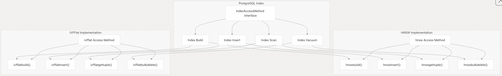
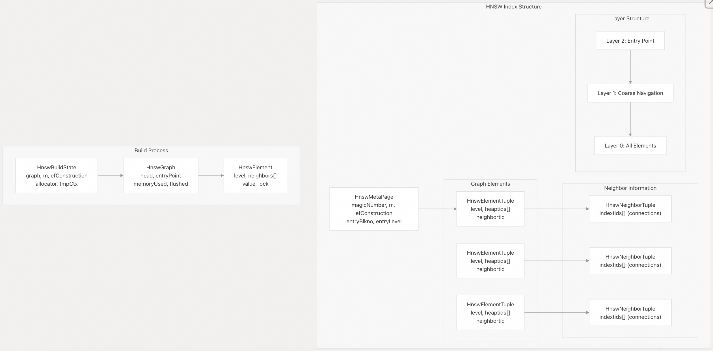
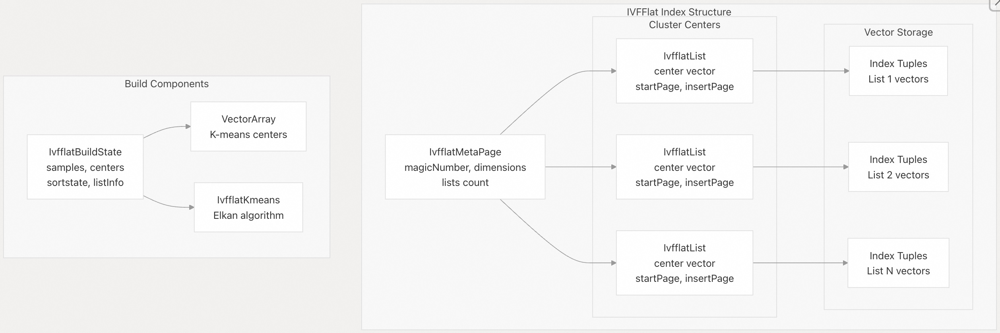
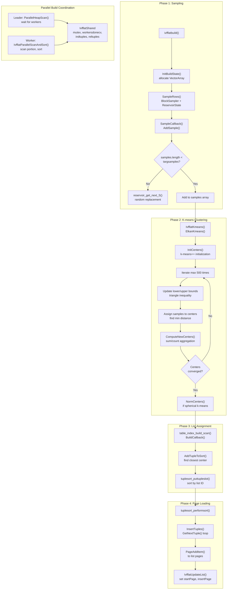
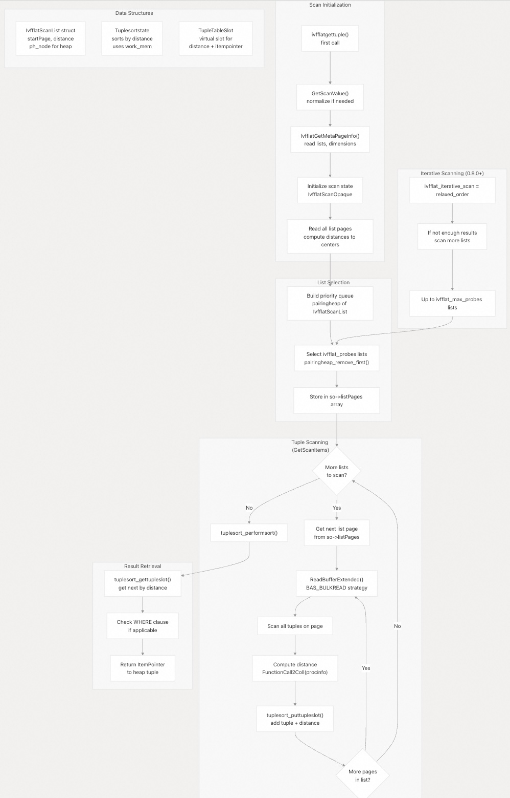
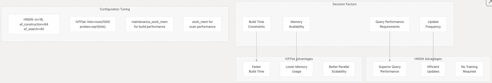

## pgvector 源码学习: 4 索引方法 (Indexing Methods)  
                                                              
### 作者                                                              
digoal                                                              
                                                              
### 日期                                                              
2025-11-04                                                              
                                                              
### 标签                                                              
pgvector , 源码学习                                                              
                                                              
----                                                              
                                                              
## 背景                                                              
本文介绍 `pgvector` 中可用的**近似最近邻** (**Approximate Nearest Neighbor**, **ANN**) 索引方法、其实现架构和配置选项。这些索引方法通过牺牲一定的**召回率** (**recall**) 来换取相较于**精确顺序扫描** (**exact sequential scans**) 显著的性能提升，从而为**向量数据类型** (**vector data types**) 提供高效的**相似性搜索** (**similarity search**) 能力。  
  
## 概述 (**Overview**)  
  
`pgvector` 提供了两种专门的**索引访问方法** (**index access methods**) 用于近似最近邻搜索，它们都实现了不同的算法方法来有效地划分和搜索**向量空间** (**vector spaces**)。  
  
  
  
### 索引方法对比 (**Index Method Comparison**)  
  
| 方面 (**Aspect**) | **HNSW** | **IVFFlat** |  
| :--- | :--- | :--- |  
| 算法 (**Algorithm**) | **多层图遍历** (**Multilayer graph traversal**) | **带有 k-means 聚类的倒排文件** (**Inverted file with k-means clustering**) |  
| 查询性能 (**Query Performance**) | 卓越的**速度-召回率权衡** (**speed-recall tradeoff**) | 良好但低于 HNSW |  
| 构建时间 (**Build Time**) | 较慢，更消耗 **CPU** | 采用**并行 k-means** 较快 |  
| 内存使用 (**Memory Usage**) | 构建和扫描期间较高 | 总体**内存占用** (**footprint**) 较低 |  
| 增量更新 (**Incremental Updates**) | 高效的**插入性能** (**insert performance**) | 适度的插入性能 |  
| 训练要求 (**Training Requirement**) | 无需**训练阶段** (**training phase**) | 需要对样本进行 **k-means 聚类** (**clustering**) |  
| 向量类型支持 (**Vector Type Support**) | vector, halfvec, sparsevec, bit | vector, halfvec, bit (不支持 sparsevec) |  
| 距离指标 (**Distance Metrics**) | L2, **内积** (**inner product**), **余弦** (**cosine**), L1, **汉明** (**Hamming**), **Jaccard** | L2, 内积, 余弦, 汉明 |  
  
**来源:**  
[`README.md` 204-254](https://github.com/pgvector/pgvector/blob/d823c445/README.md#L204-L254) [`README.md` 330-373](https://github.com/pgvector/pgvector/blob/d823c445/README.md#L330-L373) [`src/hnsw.h` 15-22](https://github.com/pgvector/pgvector/blob/d823c445/src/hnsw.h#L15-L22) [`src/ivfflat.h` 26-32](https://github.com/pgvector/pgvector/blob/d823c445/src/ivfflat.h#L26-L32)  
  
## HNSW 索引 (**HNSW Index**)  
  
**HNSW** (**Hierarchical Navigable Small World**，**分层可导航小世界**) 创建了一个**多层图结构** (**multilayer graph structure**)，其中每一层都包含索引向量的一个子集。较高的层包含较少的元素，用于**粗略导航** (**coarse navigation**)，而第 0 层包含所有元素，用于**最终细化** (**final refinement**)。  
  
### HNSW 架构 (**HNSW Architecture**)  
  
  
  
**关键数据结构** (**Key Data Structures**):  
  
  * `HnswElement`: **核心图节点** (**Core graph node**)，包含层级 (**level**)、**堆 TID** (**heap TIDs**) 和**邻居连接** (**neighbor connections**)  
  * `HnswNeighborArray`: 每层**最近邻** (**nearest neighbors**) 的**动态数组** (**Dynamic array**)  
  * `HnswGraph`: **索引构建** (**index building**) 期间的**内存图结构** (**In-memory graph structure**)  
  * `HnswBuildState`: 构建时状态，包括**内存管理** (**memory management**) 和配置  
  
**来源:**  
[`src/hnsw.h` 138-156](https://github.com/pgvector/pgvector/blob/d823c445/src/hnsw.h#L138-L156) [`src/hnsw.h` 304-317](https://github.com/pgvector/pgvector/blob/d823c445/src/hnsw.h#L304-L317) [`src/hnswbuild.c` 76-104](https://github.com/pgvector/pgvector/blob/d823c445/src/hnswbuild.c#L76-L104)  
  
### HNSW 构建过程 (**HNSW Build Process**)  
  
**HNSW 索引构建** (**index construction**) 遵循一种**两阶段方法** (**two-phase approach**)，该方法针对内存使用和构建性能进行了优化。构建过程由 `hnswbuild()` 协调，它管理**内存中** (**in-memory**) 阶段和**磁盘上** (**on-disk**) 阶段之间的转换。  
  
**HNSW 构建流程**  
  
  
  
**构建算法步骤:**  
  
1.  **初始化** (**Initialization**): `CreateMetaPage()` 使用**魔数** (**magic number**)、`m` 和 `efConstruction` 创建**元页面** (**metapage**)  
2.  **内存阶段** (**Memory Phase**): 在 `maintenance_work_mem` 中使用 `HnswGraph` 结构构建图  
3.  **元素创建** (**Element Creation**): `HnswInitElement()` 使用**指数分布** (**exponential distribution**) 创建具有随机层级 (**level**) 的元素，其中 `level = (int)(-log(RandomDouble()) * ml)`，且 `ml = 1/log(m)`  
4.  **邻居查找** (**Neighbor Finding**): `HnswFindElementNeighbors()` 使用 `HnswSearchLayer()` 来查找每一层的最近邻  
5.  **双向链接** (**Bidirectional Links**): `UpdateNeighborsInMemory()` 调用 `HnswUpdateConnection()` 来添加**反向边** (**reverse edges**)  
6.  **内存监控** (**Memory Monitoring**): 检查 `graph->memoryUsed` 是否超过 `graph->memoryTotal`（该值来自 `maintenance_work_mem`）  
7.  **磁盘刷新** (**Disk Flush**): `FlushPages()` 将 `HnswElementTuple` 和 `HnswNeighborTuple` 写入磁盘  
8.  **磁盘阶段** (**On-Disk Phase**): 剩余的**元组** (**tuples**) 通过 `HnswInsertTupleOnDisk()` 插入，使用与 **INSERT** 相同的算法  
  
**来源:**  
[`src/hnswbuild.c` 1-36](https://github.com/pgvector/pgvector/blob/d823c445/src/hnswbuild.c#L1-L36) [`src/hnswbuild.c` 618-720](https://github.com/pgvector/pgvector/blob/d823c445/src/hnswbuild.c#L618-L720) [`src/hnswbuild.c` 421-467](https://github.com/pgvector/pgvector/blob/d823c445/src/hnswbuild.c#L421-L467) [`src/hnswutils.c` 106-129](https://github.com/pgvector/pgvector/blob/d823c445/src/hnswutils.c#L106-L129) [`src/hnswutils.c` 239-262](https://github.com/pgvector/pgvector/blob/d823c445/src/hnswutils.c#L239-L262)  
  
### HNSW 搜索过程 (**HNSW Search Process**)  
  
搜索算法通过 `hnswgettuple()` 和 `HnswSearchLayer()` 实现了论文中的**算法 5** (**Algorithm 5**，**带有动态候选列表的贪婪搜索** - **greedy search with dynamic candidate list**)。  
  
**HNSW 搜索算法**  
  
  
  
**搜索配置参数:**  
  
| 参数 (**Parameter**) | 默认值 (**Default**) | 目的 (**Purpose**) | 位置 (**Location**) |  
| :--- | :--- | :--- | :--- |  
| `hnsw_ef_search` | 40 | 第 0 层的**动态候选列表大小** (**Dynamic candidate list size**) | `hnsw.c` **GUC 变量** |  
| `hnsw_max_scan_tuples` | 20,000 | **迭代扫描** (**iterative scan**) 中访问的**最大元组数** (**Maximum tuples**) | `hnsw.c` GUC 变量 |  
| `hnsw_scan_mem_multiplier` | 1 | 内存限制，是 `work_mem` 的倍数 | `hnsw.c` GUC 变量 |  
| `hnsw_iterative_scan` | off (**关闭**) | 启用迭代扫描 (**strict\_order**/**relaxed\_order**) | `hnsw.c` GUC 变量 |  
  
**算法详情:**  
  
  * **入口点** (**Entry Point**): 通过 `HnswGetEntryPoint()` 从 `HnswMetaPage` 检索（存储为 `entryBlkno`、`entryOffno`、`entryLevel`）  
  * **贪婪搜索** (**Greedy Search**): 上层使用 `ef=1` 进行快速下降到**目标区域** (**target area**)  
  * **第 0 层搜索** (**Layer 0 Search**): 使用可配置的 `hnsw_ef_search` 来平衡**召回率** (**recall**) 与**速度** (**speed**)  
  * **已访问跟踪** (**Visited Tracking**): **哈希表** (**Hash table**) 防止重复访问节点（磁盘上使用 `tidhash`，内存中使用 `pointerhash`）  
  * **距离计算** (**Distance Calculation**): `HnswGetDistance()` 调用 `HNSW_DISTANCE_PROC` **支持函数** (**support function**)  
  * **堆管理** (**Heap Management**): 两个**配对堆** (**pairing heaps**)（`C` 用于候选者，`W` 用于结果）维护动态列表  
  
**来源:**  
[`src/hnswscan.c` 14-45](https://github.com/pgvector/pgvector/blob/d823c445/src/hnswscan.c#L14-L45) [`src/hnswscan.c` 48-76](https://github.com/pgvector/pgvector/blob/d823c445/src/hnswscan.c#L48-L76) [`src/hnswscan.c` 178-250](https://github.com/pgvector/pgvector/blob/d823c445/src/hnswscan.c#L178-L250) [`src/hnswutils.c` 813-976](https://github.com/pgvector/pgvector/blob/d823c445/src/hnswutils.c#L813-L976) [`src/hnswutils.c` 617-657](https://github.com/pgvector/pgvector/blob/d823c445/src/hnswutils.c#L617-L657)  
  
## IVFFlat 索引 (IVFFlat Index)  
  
**IVFFlat**（带有平面量化器（Flat quantizer）的倒排文件（Inverted File））使用 **k-均值聚类**（k-means clustering）将向量空间划分为 **Voronoi 单元**（Voronoi cells）。每个单元（**列表**，list）包含最接近该聚类中心（cluster center）的向量，从而通过仅检查最相关的列表来实现高效搜索。  
  
### IVFFlat 架构 (IVFFlat Architecture)  
  
  
  
**关键数据结构 (Key Components):**  
  
  * `IvfflatList`：聚类元数据（Cluster metadata），包含中心向量和页面指针。  
  * `VectorArray`：用于高效存储样本向量和聚类中心的结构。  
  * `IvfflatBuildState`：构建上下文（Build context），包含 k-均值状态和元组排序信息。  
  * `ListInfo`：每个聚类的页面位置信息。  
  
**来源:**  
[`src/ivfflat.h` 241-248](https://github.com/pgvector/pgvector/blob/d823c445/src/ivfflat.h#L241-L248)  
[`src/ivfflat.h` 171-220](https://github.com/pgvector/pgvector/blob/d823c445/src/ivfflat.h#L171-L220)  
[`src/ivfbuild.c` 315-381](https://github.com/pgvector/pgvector/blob/d823c445/src/ivfbuild.c#L315-L381)  
  
### IVFFlat 构建过程 (IVFFlat Build Process)  
  
IVFFlat 的构建由 `ivfflatbuild()` 协调，包含四个不同的阶段：采样（sampling）、k-均值聚类、列表分配（list assignment）和页面加载（page loading）。  
  
**IVFFlat 构建流程图 (IVFFlat Build Pipeline)**  
  

  
**构建参数 (Build Parameters):**  
  
  * **样本大小 (Sample Size)**：`lists * 50` 个样本（samples），高质量聚类（quality clustering）要求最少 10,000 个（在 `ComputeCenters()` 中配置）。  
  * **列表数 (Lists)**：通过 `WITH (lists = N)` 配置，存储在 `IvfflatOptions` 结构中。  
  * **推荐列表数 (Recommended Lists)**：`rows / 1000`（适用于最多 1M 行数据）或 `sqrt(rows)`（适用于超过 1M 行数据）。  
  * **内存检查 (Memory Check)**：在 `ElkanKmeans()` 中计算总大小，并与 `maintenance_work_mem` 进行验证。  
  * **K-均值距离 (K-means Distance)**：使用 `IVFFLAT_KMEANS_DISTANCE_PROC`（可能与索引扫描距离不同）。  
  
**Elkan 算法优化 (Elkan's Algorithm Optimizations):**  
  
k-均值实现使用了 **Elkan 算法**（Elkan's algorithm）来减少距离计算（distance calculations）：  
  
  * 下界（Lower bounds）：`lowerBound[j * numCenters + k]` 跟踪样本 j 到中心 k 的最小距离。  
  * 上界（Upper bounds）：`upperBound[j]` 跟踪样本到其分配中心（assigned center）的距离。  
  * **三角不等式**（Triangle inequality）：如果 `upperBound[j] <= s[c]`（中心间最小距离），则跳过该样本。  
  * 半距离（Half-distances）：`halfcdist[j * numCenters + k]` 缓存中心间距离的 0.5 倍。  
  
**来源:**  
[`src/ivfbuild.c` 115-135](https://github.com/pgvector/pgvector/blob/d823c445/src/ivfbuild.c#L115-L135)  
[`src/ivfbuild.c` 402-441](https://github.com/pgvector/pgvector/blob/d823c445/src/ivfbuild.c#L402-L441)  
[`src/ivfbuild.c` 251-310](https://github.com/pgvector/pgvector/blob/d823c445/src/ivfbuild.c#L251-L310)  
[`src/ivfkmeans.c` 21-89](https://github.com/pgvector/pgvector/blob/d823c445/src/ivfkmeans.c#L21-L89)  
[`src/ivfkmeans.c` 258-496](https://github.com/pgvector/pgvector/blob/d823c445/src/ivfkmeans.c#L258-L496)  
  
### IVFFlat 搜索过程 (IVFFlat Search Process)  
  
搜索算法计算查询向量到所有聚类中心的距离，选择最近的列表（lists）进行探测（probe），并对这些列表中的元组（tuples）进行排序。该过程由 `ivfflatgettuple()` 协调。  
  
**IVFFlat 搜索算法 (IVFFlat Search Algorithm)**  
  
  
  
**搜索配置参数 (Search Configuration Parameters):**  
  
| 参数 (Parameter) | 默认值 (Default) | 目的 (Purpose) | 位置 (Location) |  
| :--- | :--- | :--- | :--- |  
| `ivfflat_probes` | 1 | 要扫描的列表数 (Number of lists to scan) | `ivfflat.c` GUC 变量 (GUC variable) |  
| `ivfflat_max_probes` | (无) | 迭代扫描的最大探针数 (Maximum probes for iterative scan) | `ivfflat.c` GUC 变量 (GUC variable) |  
| `ivfflat_iterative_scan` | off | 启用自适应探测（仅限 relaxed\_order） (Enable adaptive probing (relaxed\_order only)) | `ivfflat.c` GUC 变量 (GUC variable) |  
  
**算法详情 (Algorithm Details):**  
  
  * **列表距离计算 (List Distance Calculation)**：使用 `IVFFLAT_DISTANCE_PROC` 计算查询向量到每个 `IvfflatList.center` 的距离。  
  * **优先级队列 (Priority Queue)**：使用 `pairingheap` 和 `CompareScanLists()` 比较器（comparator）维护按距离排序的列表。  
  * **元组排序 (Tuple Sorting)**：`tuplesort_begin_heap()` 创建以距离为排序键的排序状态。  
  * **缓冲策略 (Buffer Strategy)**：`GetAccessStrategy(BAS_BULKREAD)` 优化顺序列表扫描（sequential list scanning）。  
  * **归一化 (Normalization)**：如果存在 `IVFFLAT_NORM_PROC`，则对查询向量进行归一化（normalizes），并检查向量范数（vector norm）是否大于 0。  
  
**探测数调优 (Probes Tuning):**  
  
  * 推荐的起始值：`sqrt(lists)` 以获得良好的 **召回率**（recall）。  
  * 更高的值会提高召回率，但会线性增加扫描时间。  
  * 将 `probes` 设置为 `lists` 会**退化为精确扫描**（exact scan）（规划器将不会使用索引）。  
  
**来源:**  
[`src/ivfscan.c` 14-120](https://github.com/pgvector/pgvector/blob/d823c445/src/ivfscan.c#L14-L120)  
[`src/ivfscan.c` 122-238](https://github.com/pgvector/pgvector/blob/d823c445/src/ivfscan.c#L122-L238)  
[`src/ivfscan.c` 239-310](https://github.com/pgvector/pgvector/blob/d823c445/src/ivfscan.c#L239-L310)  
[`src/ivfutils.c` 12-40](https://github.com/pgvector/pgvector/blob/d823c445/src/ivfutils.c#L12-L40)  
[`README.md` 374-391](https://github.com/pgvector/pgvector/blob/d823c445/README.md#L374-L391)  
  
## 索引选择与性能 (Index Selection and Performance)  
  
选择 **HNSW** 还是 **IVFFlat** 取决于特定的工作负载特性和性能要求。  
  
  
  
**性能调优指南 (Performance Tuning Guidelines):**  
  
  * **HNSW**：增加 `maintenance_work_mem` 以加快构建速度，调整 `ef_search` 以平衡召回率与速度。  
  * **IVFFlat**：选择适当的列表数量（list count），增加 `probes` 以获得更好的召回率。  
  * **两者**：对于生产环境构建，使用 `CONCURRENTLY`，并通过 `pg_stat_progress_create_index` 进行监控。  
  
**来源:**  
[`README.md` 287-316](https://github.com/pgvector/pgvector/blob/d823c445/README.md#L287-L316)  
[`README.md` 374-401](https://github.com/pgvector/pgvector/blob/d823c445/README.md#L374-L401)  
[`README.md` 658-733](https://github.com/pgvector/pgvector/blob/d823c445/README.md#L658-L733)  
    
#### [期望 PostgreSQL|开源PolarDB 增加什么功能?](https://github.com/digoal/blog/issues/76 "269ac3d1c492e938c0191101c7238216")
  
  
#### [PolarDB 开源数据库](https://openpolardb.com/home "57258f76c37864c6e6d23383d05714ea")
  
  
#### [PolarDB 学习图谱](https://www.aliyun.com/database/openpolardb/activity "8642f60e04ed0c814bf9cb9677976bd4")
  
  
#### [PostgreSQL 解决方案集合](../201706/20170601_02.md "40cff096e9ed7122c512b35d8561d9c8")
  
  
#### [德哥 / digoal's Github - 公益是一辈子的事.](https://github.com/digoal/blog/blob/master/README.md "22709685feb7cab07d30f30387f0a9ae")
  
  
#### [About 德哥](https://github.com/digoal/blog/blob/master/me/readme.md "a37735981e7704886ffd590565582dd0")
  
  

  
