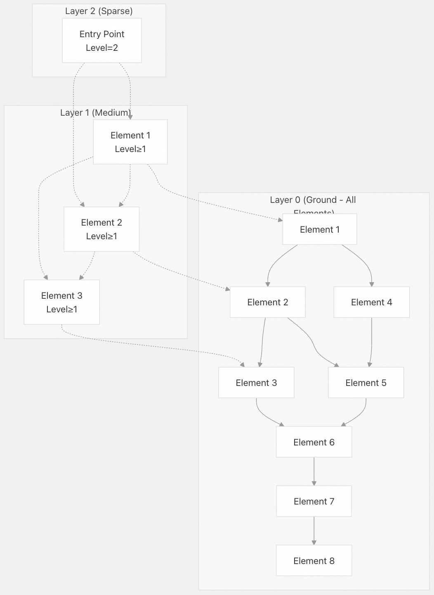
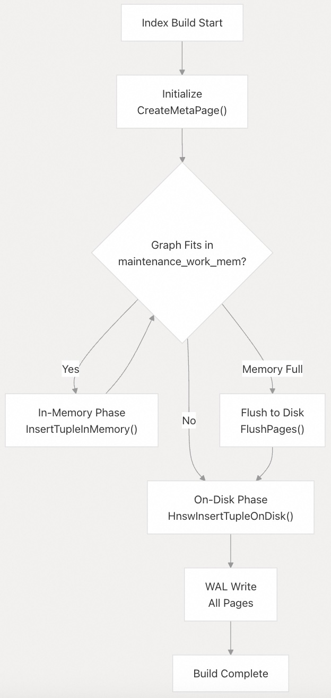
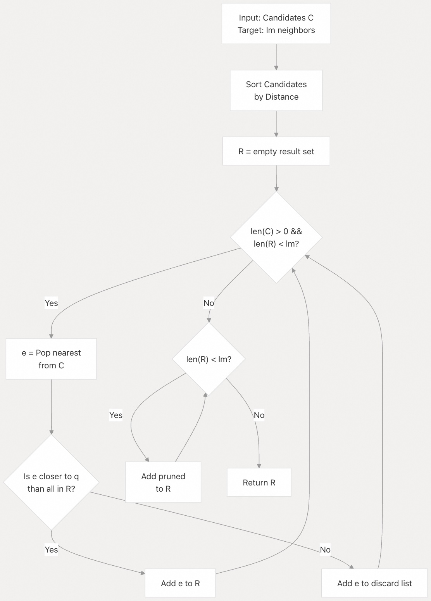
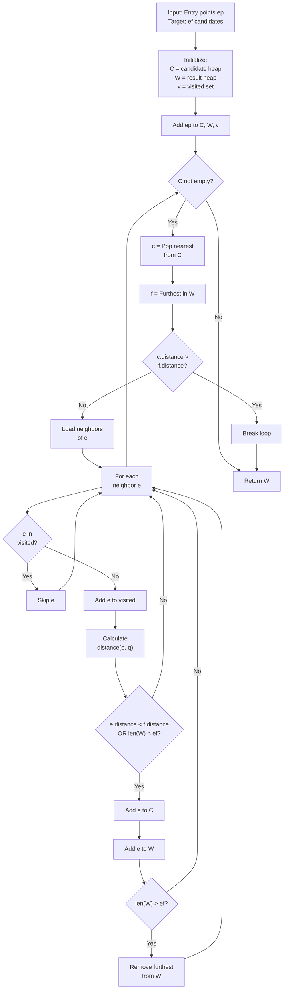
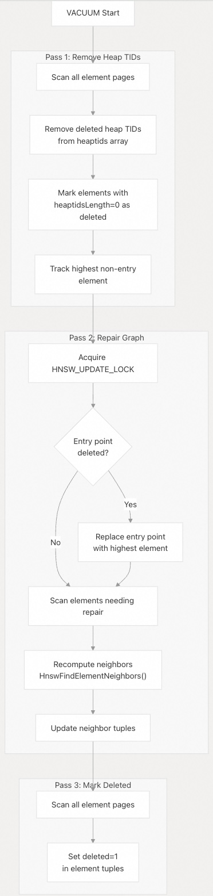

## pgvector 源码学习: 4.1 HNSW 索引 (HNSW Index)  
                                                                
### 作者                                                                
digoal                                                                
                                                                
### 日期                                                                
2025-11-04                                                                
                                                                
### 标签                                                                
pgvector , 源码学习                                                                
                                                                
----                                                                
                                                                
## 背景                                                                
本文介绍 `pgvector` 中 **HNSW** (**Hierarchical Navigable Small World**，分层可导航小世界) 索引的实现。HNSW 是一种**近似最近邻** (**ANN**, Approximate Nearest Neighbor) 索引类型，它将向量组织成一个多层图结构，用于高效的**相似性搜索** (**similarity search**)。  
  
**来源:** [`README.md` 204-276](https://github.com/pgvector/pgvector/blob/d823c445/README.md#L204-L276) [`src/hnsw.h` 1-511](https://github.com/pgvector/pgvector/blob/d823c445/src/hnsw.h#L1-L511)  
  
相关论文:  
- [《AI论文解读 | Efficient and robust approximate nearest neighbor search using Hierarchical Navigable Small World graphs》](../202506/20250619_02.md)    
  
-----  
  
## 索引结构 (**Index Structure**)  
  
### 多层图架构 (**Multi-Layer Graph Architecture**)  
  
HNSW 构建了一个**分层图** (**hierarchical graph**)，其中每一层都包含索引向量的一个子集。更高的层更稀疏 (**sparser**)，用于**远距离导航** (**long-range navigation**)，而第 0 层（底层，**ground layer**）包含所有向量并提供**精确的局部搜索** (**precise local search**)。  
  
    
  
**图表: HNSW 多层图结构**  
  
在插入过程中，每个元素都会**概率性地** (**probabilistically**) 分配一个层级 (**level**)。该层级决定了该元素参与哪些图层。更高级别的元素充当“枢纽”（**hubs**），用于高效的远距离导航。  
  
**来源:** [`src/hnsw.h` 14-16](https://github.com/pgvector/pgvector/blob/d823c445/src/hnsw.h#L14-L16) [`src/hnswutils.c` 239-262](https://github.com/pgvector/pgvector/blob/d823c445/src/hnswutils.c#L239-L262)  
  
-----  
  
## 核心数据结构 (**Core Data Structures**)  
  
### HnswElement（HNSW 元素）  
  
`HnswElement` 结构表示图中的单个索引向量。  
  
| 字段 (**Field**) | 类型 (**Type**) | 目的 (**Purpose**) |  
| :--- | :--- | :--- |  
| `next` | `HnswElementPtr` | 构建列表中的下一个元素的链接 |  
| `heaptids[HNSW_HEAPTIDS]` | `ItemPointerData[10]` | 堆元组指针 (**Heap tuple pointers**)（支持重复） |  
| `heaptidsLength` | `uint8` | 有效的堆 **TIDs** 数量 |  
| `level` | `uint8` | 该元素参与的最大层级 (**layer**) (0-255) |  
| `deleted` | `uint8` | 删除标志 (**Deletion flag**) |  
| `version` | `uint8` | 用于**并发控制** (**concurrency control**) 的版本 |  
| `neighbors` | `HnswNeighborsPtr` | 指向每一层邻居数组的指针 |  
| `blkno` | `BlockNumber` | 元素元组 (**element tuple**) 的块号 (**Block number**) |  
| `offno` | `OffsetNumber` | 元素元组的偏移号 (**Offset number**) |  
| `neighborPage` | `BlockNumber` | 邻居元组 (**neighbor tuple**) 的块号 |  
| `neighborOffno` | `OffsetNumber` | 邻居元组的偏移号 |  
| `value` | `DatumPtr` | 指向向量数据的指针 |  
| `lock` | `LWLock` | 用于**并行构建** (**parallel builds**) 的锁 |  
  
**来源:** [`src/hnsw.h` 138-154](https://github.com/pgvector/pgvector/blob/d823c445/src/hnsw.h#L138-L154)  
  
### HnswNeighborArray（HNSW 邻居数组）  
  
每个元素都为其参与的每一层维护一个 `HnswNeighborArray`，用于存储与附近元素的连接。  
  
| 字段 (**Field**) | 类型 (**Type**) | 目的 (**Purpose**) |  
| :--- | :--- | :--- |  
| `length` | `int` | 数组中的邻居数量 |  
| `closerSet` | `bool` | 用于邻居选择优化的**缓存标志** (**Cache flag**) |  
| `items[]` | `HnswCandidate[]` | 邻居候选者 (**neighbor candidates**) 的**柔性数组** (**Flexible array**) |  
  
每个 `HnswCandidate` 包含：  
  
  * `element`: 指向邻居元素的指针  
  * `distance`: 到邻居的距离  
  * `closer`: 在邻居选择算法中使用的标志  
  
**来源:** [`src/hnsw.h` 165-170](https://github.com/pgvector/pgvector/blob/d823c445/src/hnsw.h#L165-L170) [`src/hnsw.h` 158-163](https://github.com/pgvector/pgvector/blob/d823c445/src/hnsw.h#L158-L163)  
  
### HnswMetaPage（HNSW 元数据页）  
  
**元数据页** (**metapage**)（块 0）存储索引配置和**入口点** (**entry point**) 信息。  
  
| 字段 (**Field**) | 类型 (**Type**) | 目的 (**Purpose**) |  
| :--- | :--- | :--- |  
| `magicNumber` | `uint32` | 用于验证的**魔术数** (**Magic number**) `0xA953A953` |  
| `version` | `uint32` | 索引版本（当前为 1） |  
| `dimensions` | `uint32` | 向量维度 (**Vector dimensions**) |  
| `m` | `uint16` | 每层最大连接数 (**Max connections per layer**) (默认 16) |  
| `efConstruction` | `uint16` | 构建参数 (**Construction parameter**) (默认 64) |  
| `entryBlkno` | `BlockNumber` | 入口点块号 |  
| `entryOffno` | `OffsetNumber` | 入口点偏移号 |  
| `entryLevel` | `int16` | 入口点层级 |  
| `insertPage` | `BlockNumber` | 下一次插入使用的页 |  
  
**来源:** [`src/hnsw.h` 304-315](https://github.com/pgvector/pgvector/blob/d823c445/src/hnsw.h#L304-L315) [`src/hnswbuild.c` 76-104](https://github.com/pgvector/pgvector/blob/d823c445/src/hnswbuild.c#L76-L104)  
  
### 磁盘元组布局 (**On-Disk Tuple Layout**)  
  
元素使用两种元组类型存储在磁盘上：  
  
**HnswElementTuple** 存储向量数据和元数据 (**metadata**):  
  
  * `type`: 元组类型标识符 (`HNSW_ELEMENT_TUPLE_TYPE`)  
  * `level`: 元素层级  
  * `deleted`: 删除标志  
  * `version`: 版本号  
  * `heaptids[HNSW_HEAPTIDS]`: 堆 TID 数组  
  * `neighbortid`: 指向对应邻居元组的指针  
  * `data`: 可变长度向量数据 (**Variable-length vector data**)  
  
**HnswNeighborTuple** 存储邻居连接:  
  
  * `type`: 元组类型标识符 (`HNSW_NEIGHBOR_TUPLE_TYPE`)  
  * `version`: 版本号  
  * `count`: 索引 **TIDs** 总数  
  * `indextids[]`: 邻居索引 **TIDs** 数组  
  
**来源:** [`src/hnsw.h` 328-350](https://github.com/pgvector/pgvector/blob/d823c445/src/hnsw.h#L328-L350) [`src/hnswutils.c` 426-479](https://github.com/pgvector/pgvector/blob/d823c445/src/hnswutils.c#L426-L479)  
  
-----  
  
## 构建过程 (**Build Process**)  
  
### 两阶段架构 (**Two-Phase Architecture**)  
  
    
  
**图表: HNSW 构建过程流程**  
  
**来源:** [`src/hnswbuild.c` 1-36](https://github.com/pgvector/pgvector/blob/d823c445/src/hnswbuild.c#L1-L36) [`src/hnswbuild.c` 656-691](https://github.com/pgvector/pgvector/blob/d823c445/src/hnswbuild.c#L656-L691)  
  
### 内存构建阶段 (**In-Memory Build Phase**)  
  
在内存 (**in-memory**) 阶段，整个图被保存在 `maintenance_work_mem` 中。这带来了显著的性能优势：  
  
1.  **快速邻居更新**：连接更新无需磁盘 I/O  
2.  **高效邻居选择**：直接内存访问向量数据  
3.  **并行构建**：使用**相对指针** (**relative pointers**) 进行共享内存分配  
  
    
  
**图表: 并行构建共享内存布局**  
  
**内存分配策略 (Memory allocation strategy)**:  
  
  * **串行构建** (**Serial build**): 后端私有内存上下文 (`graphCtx`)  
  * **并行构建**: 预先分配的共享内存区域 (`hnswarea`)  
  * 元素使用相对指针（从 `hnswarea` 基地址的偏移量）  
  * 分配器跟踪 `memoryUsed` 与 `memoryTotal`  
  
当 `memoryUsed >= memoryTotal` 时，图通过 `FlushPages()` **刷新** (**flushed**) 到磁盘。  
  
**来源:** [`src/hnswbuild.c` 597-651](https://github.com/pgvector/pgvector/blob/d823c445/src/hnswbuild.c#L597-L651) [`src/hnswbuild.c` 421-467](https://github.com/pgvector/pgvector/blob/d823c445/src/hnswbuild.c#L421-L467)  
  
### 磁盘刷新操作 (**Disk Flush Operation**)  
  
`FlushPages()` 函数将内存中的图**具体化** (**materializes**) 到磁盘：  
  
1.  **CreateMetaPage()**: 将索引元数据写入块 0  
2.  **CreateGraphPages()**: 写入元素元组并分配邻居元组**占位符** (**placeholders**)  
3.  **WriteNeighborTuples()**: 填充邻居连接  
  
刷新后，后续的插入使用**磁盘插入路径** (**on-disk insertion path**)。  
  
**来源:** [`src/hnswbuild.c` 290-303](https://github.com/pgvector/pgvector/blob/d823c445/src/hnswbuild.c#L290-L303) [`src/hnswbuild.c` 137-235](https://github.com/pgvector/pgvector/blob/d823c445/src/hnswbuild.c#L137-L235) [`src/hnswbuild.c` 240-285](https://github.com/pgvector/pgvector/blob/d823c445/src/hnswbuild.c#L240-L285)  
  
### 元素层级分配 (**Element Level Assignment**)  
  
每个元素的层级 (**level**) 是**概率性**确定的：  
  
$P(\text{level} = k) = e^{-k / \text{ml}}$  
  
其中 $\text{ml} = \text{HnswGetMl}(m) = 1 / \log(m)$ (来自论文的最优值)。  
  
层级被限制在 $\text{HnswGetMaxLevel}(m)$，以确保邻居元组能够容纳在一页中。  
  
**来源:** [`src/hnswutils.c` 239-262](https://github.com/pgvector/pgvector/blob/d823c445/src/hnswutils.c#L239-L262) [`src/hnsw.h` 86-89](https://github.com/pgvector/pgvector/blob/d823c445/src/hnsw.h#L86-L89)  
  
-----  
  
## 邻居选择算法 (**Neighbor Selection Algorithm**)  
  
### SelectNeighbors（算法 4）  
  
`SelectNeighbors()` 函数实现了 **HNSW 论文**中的**启发式算法** (**heuristic**)，为元素选择最佳的 `lm` 个邻居。  
  
    
  
**图表: 邻居选择算法**  
  
该算法使用“更近”的启发式方法 (**"closer" heuristic**): 如果一个元素比任何已经选择的邻居更靠近查询点，则该元素被选中。这创建了连接良好的**局部邻域** (**local neighborhoods**)。  
  
**优化**: `closerSet` 标志缓存了当前邻域是否满足“更近”属性，从而避免在添加新连接时进行冗余计算。  
  
**来源:** [`src/hnswutils.c` 1053-1154](https://github.com/pgvector/pgvector/blob/d823c445/src/hnswutils.c#L1053-L1154) [`src/hnswutils.c` 1027-1048](https://github.com/pgvector/pgvector/blob/d823c445/src/hnswutils.c#L1027-L1048)  
  
### 连接限制 (**Connection Limits**)  
  
每层的连接数由 `HnswGetLayerM(m, layer)` 定义：  
  
  * 第 0 层（底层）: `2 * m` 个连接  
  * 第 1 层及以上: `m` 个连接  
  
这种**不对称性** (**asymmetry**) 为底层提供了更高的**连通性** (**connectivity**)，以实现更好的**召回率** (**recall**)。  
  
**来源:** [`src/hnsw.h` 83](https://github.com/pgvector/pgvector/blob/d823c445/src/hnsw.h#L83-L83)  
  
-----  
  
## 搜索算法 (**Search Algorithm**)  
  
### HnswSearchLayer（算法 2）  
  
核心搜索函数在单个层内实现了**贪婪最佳优先搜索** (**greedy best-first search**)。  
  

  
**图表: 搜索层算法**  
  
该函数使用**配对堆** (**pairing heaps**) 进行高效的**候选者管理** (**candidate management**):  
  
  * **C 堆** (**C heap**): 按距离排序的**最小堆** (**Min-heap**)（待探索的候选者）  
  * **W 堆** (**W heap**): 按距离排序的**最大堆** (**Max-heap**)（当前结果）  
  * **v 哈希** (**v hash**): **已访问集合** (**Visited set**)（磁盘使用 TID 哈希，内存使用指针/偏移哈希）  
  
**来源:** [`src/hnswutils.c` 813-976](https://github.com/pgvector/pgvector/blob/d823c445/src/hnswutils.c#L813-L976)  
  
### 多层搜索（算法 5）  
  
`GetScanItems()` 函数实现了跨所有层级的完整搜索:  
  
1.  从**入口点** (**entry point**) 的最高层开始  
2.  对于从 `entryLevel` 到 1 的层级: 使用 `ef=1` 进行搜索以找到最近的元素  
3.  在第 0 层: 使用 `ef=hnsw_ef_search` 进行搜索以获得最终结果  
  
**来源:** [`src/hnswscan.c` 14-45](https://github.com/pgvector/pgvector/blob/d823c445/src/hnswscan.c#L14-L45)  
  
### 已访问跟踪 (**Visited Tracking**)  
  
已访问集合根据上下文使用不同的哈希表类型：  
  
| 上下文 (**Context**) | 哈希类型 (**Hash Type**) | 键 (**Key**) | 实现 (**Implementation**) |  
| :--- | :--- | :--- | :--- |  
| 磁盘搜索 (**On-disk search**) | `tidhash` | `ItemPointerData` | 索引元组的 **TID** |  
| 内存中（带基址）| `offsethash` | `Size` | 从基地址的偏移量 (**Offset from base address**) |  
| 内存中（无基址）| `pointerhash` | `uintptr_t` | **绝对指针** (**Absolute pointer**) |  
  
**来源:** [`src/hnswutils.c` 662-699](https://github.com/pgvector/pgvector/blob/d823c445/src/hnswutils.c#L662-L699) [`src/hnsw.h` 471-509](https://github.com/pgvector/pgvector/blob/d823c445/src/hnsw.h#L471-L509)  
  
-----  
  
## Insert Operations (插入操作)  
  
### In-Memory Insert (内存中插入)  
  
在内存中构建（build）阶段，`InsertTupleInMemory()` 函数执行以下操作：  
  
1.  **Entry point locking** (入口点锁定): 获取共享锁（shared lock），如果正在更新入口点（entry point），则升级为排他锁（exclusive lock）。  
2.  **Find neighbors** (查找邻居): 为所有层级调用 `HnswFindElementNeighbors()`。  
3.  **Update graph** (更新图):  
      * 将元素添加到图列表（graph list）。  
      * 使用 `UpdateNeighborsInMemory()` 更新双向连接（bidirectional connections）。  
      * 如果元素的层级（level）更高，则更新入口点。  
  
**来源:**  
[`src/hnswbuild.c` 421-467](https://github.com/pgvector/pgvector/blob/d823c445/src/hnswbuild.c#L421-L467)  
[`src/hnswbuild.c` 397-419](https://github.com/pgvector/pgvector/blob/d823c445/src/hnswbuild.c#L397-L419)  
  
### On-Disk Insert (磁盘上插入)  
  
`HnswInsertTupleOnDisk()` 函数处理刷新（flush）到磁盘后的插入操作：  
  
1.  **Find neighbors** (查找邻居): 搜索图以找到最佳连接。  
2.  **Add element** (添加元素): 通过 `AddElementOnDisk()` 写入元素和邻居元组（element and neighbor tuples）。  
3.  **Update neighbors** (更新邻居): 调用 `HnswUpdateNeighborsOnDisk()` 以添加反向连接（reverse connections）。  
4.  **Update entry point** (更新入口点): 如果需要，更新元页面（metapage）。  
  
磁盘上的更新使用 PostgreSQL 的**Generic WAL** (通用预写式日志) 进行写入提前日志记录（write-ahead logging）。  
  
**来源:**  
[`src/hnswinsert.c` 576-654](https://github.com/pgvector/pgvector/blob/d823c445/src/hnswinsert.c#L576-L654)  
[`src/hnswinsert.c` 138-341](https://github.com/pgvector/pgvector/blob/d823c445/src/hnswinsert.c#L138-L341)  
[`src/hnswinsert.c` 539-574](https://github.com/pgvector/pgvector/blob/d823c445/src/hnswinsert.c#L539-L574)  
  
-----  
  
## Parameters and Configuration (参数和配置)  
  
### Index Parameters (索引参数)  
  
在索引创建时通过 `CREATE INDEX ... WITH (...)` 指定：  
  
| Parameter (参数) | Default (默认值) | Range (范围) | Purpose (目的) |  
| :--- | :--- | :--- | :--- |  
| `m` | 16 | 2-100 | 每层最大连接数 (**Max connections per layer**) |  
| `ef_construction` | 64 | 4-1000 | 构建期间的候选列表大小 (**Candidate list size during build**) |  
  
**约束 (Constraints):**  
  
  * `ef_construction >= 2 * m` (强制执行)  
  * 更高的 `m` → 更好的召回率（recall），更大的索引  
  * 更高的 `ef_construction` → 更好的召回率，更慢的构建速度  
  
**来源:**  
[`src/hnsw.h` 36-44](https://github.com/pgvector/pgvector/blob/d823c445/src/hnsw.h#L36-L44)  
[`src/hnsw.c` 74-84](https://github.com/pgvector/pgvector/blob/d823c445/src/hnsw.c#L74-L84)  
  
### Query-Time Parameters (查询时参数)  
  
通过 GUC (会话或事务范围) 设置：  
  
| Parameter (参数) | Default (默认值) | Range (范围) | Purpose (目的) |  
| :--- | :--- | :--- | :--- |  
| `hnsw.ef_search` | 40 | 1-1000 | 搜索期间的候选列表大小 (**Candidate list size during search**) |  
| `hnsw.iterative_scan` | `off` | off/relaxed\_order/strict\_order | 启用迭代扫描以进行过滤 (**Enable iterative scans for filtering**) |  
| `hnsw.max_scan_tuples` | 20000 | 1-INT\_MAX | 迭代扫描中访问的最大元组数 (**Max tuples to visit in iterative scan**) |  
| `hnsw.scan_mem_multiplier` | 1.0 | 1-1000 | 迭代扫描的内存限制乘数 (**Memory limit multiplier for iterative scans**) |  
  
**Iterative scan modes (迭代扫描模式):**  
  
  * `off`: 单次扫描，使用 `ef_search` 个候选  
  * `relaxed_order`: 多次扫描，结果顺序可能略有偏差（out of order）  
  * `strict_order`: 多次扫描，保证结果的严格顺序  
  
**来源:**  
[`src/hnsws.c` 75-104](https://github.com/pgvector/pgvector/blob/d823c445/src/hnsw.c#L75-L104)  
[`src/hnsws.h` 111-122](https://github.com/pgvector/pgvector/blob/d823c445/src/hnsw.h#L111-L122)  
  
### Supported Types and Distances (支持的类型和距离)  
  
**HNSW** 支持最广泛的类型/距离组合：  
  
| Vector Type (向量类型) | Max Dimensions (最大维度) | Operator Classes (操作符类) |  
| :--- | :--- | :--- |  
| `vector` | 2,000 | `vector_l2_ops`, `vector_ip_ops`, `vector_cosine_ops`, `vector_l1_ops` |  
| `halfvec` | 4,000 | `halfvec_l2_ops`, `halfvec_ip_ops`, `halfvec_cosine_ops`, `halfvec_l1_ops` |  
| `sparsevec` | 1,000 non-zero (非零) | `sparsevec_l2_ops`, `sparsevec_ip_ops`, `sparsevec_cosine_ops`, `sparsevec_l1_ops` |  
| `bit` | 64,000 | `bit_hamming_ops`, `bit_jaccard_ops` |  
  
**来源:**  
[`README.md` 248-254](https://github.com/pgvector/pgvector/blob/d823c445/README.md#L248-L254)  
  
好的，万能且优秀的助理很乐意为您提供帮助！  
  
我已为您翻译了该网页中从“VACUUM and Maintenance”章节开始的所有内容，并按照您的要求保留了重要术语的原文和译文，以及指定的链接格式。  
  
-----  
  
## VACUUM and Maintenance（VACUUM 和维护）  
  
在 **HNSW** 索引中，`VACUUM` 操作是必不可少的，因为它负责清理已删除的元组（`deleted tuples`），修复图中损坏的连接（`broken connections`），并确保图的入口点（`entry point`）仍然有效。  
  
### Three-Pass VACUUM Process（三阶段 VACUUM 流程）  
  
HNSW 的 `VACUUM` 过程是一个三阶段（`three-pass`）操作：  
  
    
  
#### Pass 1 (**RemoveHeapTids**):  
  
* 从元素的 **`heaptids`** 数组中移除**无效堆元组 ID**（**dead heap TIDs**）。  
* 当一个元素的所有堆元组 ID 都被移除时，将其**标记为已删除**（**marks as deleted**）。  
* **追踪**层级最高的非入口点元素（**highest-level non-entry element**），以备用作**潜在的入口点替换**（**potential entry point replacement**）。  
  
#### Pass 2 (**RepairGraph**):  
  
* 获取 **`HNSW_UPDATE_LOCK`** 锁，以**防止并发修改**（**concurrent modifications**）。  
* 如果**入口点**（**entry point**）被删除，则进行**修复**（**repairs**）。  
* 通过**重新计算连接**（**recomputing connections**），修复那些**邻居已被删除**（**deleted neighbors**）的元素。  
* 使用 **`HnswFindElementNeighbors()`** 函数，并设置 **`skipElement`** 参数来**排除自身**（**exclude self**）。  
  
#### Pass 3 (**MarkDeleted**):  
  
* 在元素元组中**设置 `deleted=1` 标志**。  
* 使已删除的元素对新的扫描（**new scans**）**不可见**（**invisible**）。  
* 这些元素将通过 **`HnswFreeOffset()`** **被重用于未来的插入**（**reused for future inserts**）。  
  
来源:  
[`src/hnswvacuum.c` 31-136](https://github.com/pgvector/pgvector/blob/d823c445/src/hnswvacuum.c#L31-L136)  
[`src/hnswvacuum.c` 242-315](https://github.com/pgvector/pgvector/blob/d823c445/src/hnswvacuum.c#L242-L315)  
[`src/hnswvacuum.c` 320-360](https://github.com/pgvector/pgvector/blob/d823c445/src/hnswvacuum.c#L320-L360)  
  
### Entry Point Repair（入口点修复）  
  
**入口点修复**（**Entry point repair**）对于**维持搜索质量**（**maintaining search quality**）至关重要。`VACUUM` 流程执行以下操作：  
  
* 在**阶段 1**（**Pass 1**）期间，**识别**层级最高的**非入口点元素**（**highest non-entry element**）。  
* 如果**入口点**（**entry point**）被删除，则**用该最高层级元素进行替换**（**replaces with highest element**）。  
* 如果**入口点**存在**已删除的邻居**（**deleted neighbors**），则**修复其连接**（**repairs connections**）。  
  
该修复过程**使用入口点现有的层级**（**existing level**），从而确保了**图结构的连续性**（**continuity of the graph structure**）。  
  
来源:  
[`src/hnswvacuum.c` 242-315](https://github.com/pgvector/pgvector/blob/d823c445/src/hnswvacuum.c#L242-L315)  
  
## 迭代扫描 (Iterative Scans)  
  
### 动机 (Motivation)  
  
标准的 **HNSW 扫描** (HNSW scans) 最多返回 `ef_search` 个结果。当查询包含**过滤器** (filters) 时（例如，`WHERE category_id = 123`），经过过滤后的结果可能会少得多。**迭代扫描** (Iterative Scans) 会自动扫描索引的更多部分，直到找到足够的匹配结果。  
  
### 实现 (Implementation)  
  
    
  
**图示：迭代扫描流程 (Iterative Scan Flow)**  
  
`ResumeScanItems()` 函数从 `discarded` **配对堆** (pairing heap) 中检索下一批**候选者** (candidates)，并在第 0 层继续搜索。  
  
**内存管理 (Memory management):**  
  
  * 扫描在**临时上下文** (temporary context) (`tmpCtx`) 中跟踪内存使用情况。  
  * `maxMemory = work_mem * hnsw_scan_mem_multiplier`  
  * 当内存或元组限制超过时，扫描终止。  
  
**来源:**  
[`src/hnswscan.c` 48-76](https://github.com/pgvector/pgvector/blob/d823c445/src/hnswscan.c#L48-L76)  
[`src/hnswscan.c` 228-276](https://github.com/pgvector/pgvector/blob/d823c445/src/hnswscan.c#L228-L276)  
  
### 严格顺序 (Strict Order) 与松弛顺序 (Relaxed Order)  
  
  * **严格顺序** (Strict order)：结果始终按**精确距离** (exact distance) 排序（在查询中使用 **CTE 物化** (CTE materialization)）。  
  * **松弛顺序** (Relaxed order)：每个批次内的结果已排序，但批次之间可能重叠。  
  
松弛顺序 (Relaxed order) 以轻微放松距离排序为代价，提供了更好的**召回率** (recall)。  
  
**来源:**  
[`README.md` 474-499](https://github.com/pgvector/pgvector/blob/d823c445/README.md#L474-L499)  
[`src/hnsw.c` 21-26](https://github.com/pgvector/pgvector/blob/d823c445/src/hnsw.c#L21-L26)  
  
-----  
  
## 关键实现细节 (Key Implementation Details)  
  
### 指针抽象 (Pointer Abstraction)  
  
代码库使用**指针抽象 (pointer abstraction)** 来支持**绝对 (absolute)** (串行构建, serial build) 和**相对 (relative)** (并行构建, parallel build) 两种指针：  
  
```c  
#define HnswPtrAccess(base, hp) \
    ((base) == NULL ? (hp).ptr : relptr_access(base, (hp).relptr))  
#define HnswPtrStore(base, hp, value) \
    ((base) == NULL ? (void) ((hp).ptr = (value)) : \
     (void) relptr_store(base, (hp).relptr, value))  
```  
  
当 `base == NULL` (串行构建, **serial build**) 时，指针是**绝对 (absolute)** 的。当 `base != NULL` (并行构建, **parallel build**) 时，指针是相对于共享内存基址的**相对偏移量 (relative offsets)**。  
  
**来源 (Sources):**  
[`src/hnsw.h` 100-109](https://github.com/pgvector/pgvector/blob/d823c445/src/hnsw.h#L100-L109)  
  
### 锁区块 (Lock Tranche)  
  
HNSW 使用一个专用的 **`LWLock` 区块 (tranche)** 来进行并行构建。该区块 ID 在共享内存中分配一次，并为每个后端 (per-backend) 进行注册。  
  
**来源 (Sources):**  
[`src/hnsw.c` 44-69](https://github.com/pgvector/pgvector/blob/d823c445/src/hnsw.c#L44-L69)  
  
### 进度报告 (Progress Reporting)  
  
索引构建通过 **PostgreSQL 的进度报告基础设施 (progress reporting infrastructure)** 来报告进度：  
  
  * **阶段 1 (Phase 1) (初始化, initializing)**: 元数据页 (Metapage) 创建。  
  * **阶段 2 (Phase 2) (加载元组, loading tuples)**: 元素插入 (Element insertion)。  
  
进度更新发生在 `BuildCallback()` 中每次元组插入之后。  
  
**来源 (Sources):**  
[`src/hnsw.c` 107-122](https://github.com/pgvector/pgvector/blob/d823c445/src/hnsw.c#L107-L122)  
[`src/hnswbuild.c` 564-592](https://github.com/pgvector/pgvector/blob/d823c445/src/hnswbuild.c#L564-L592)  
  
### 成本估算 (Cost Estimation)  
  
`hnswcostestimate()` 函数根据以下因素估算索引扫描成本 (index scan cost)：  
  
1.  来自 `genericcostestimate()` 的**通用成本估算 (Generic cost estimate)**。  
2.  **HNSW 特有因素 (HNSW-specific factors)**：  
      * **对数级缩放 (Logarithmic scaling)** 与表大小相关: `log_2(tuples)` 。  
      * **参数 (Parameters)**: `m` (连接数, connections) 和 `ef_search` 。  
      * 应用于启动成本 (startup cost) 的**比率 (Ratio)**。  
  
成本模型假设在搜索期间存在**顺序页面访问模式 (sequential page access patterns)**。  
  
**来源 (Sources):**  
[`src/hnsw.c` 124-210](https://github.com/pgvector/pgvector/blob/d823c445/src/hnsw.c#L124-L210)  
  
-----  
  
## 性能特征（Performance Characteristics）  
  
### 构建性能（Build Performance）  
  
#### 内存构建（In-memory build）：  
  
  * **快速**：直接内存访问（Direct memory access），构建期间没有预写式日志（WAL）开销（WAL overhead）。  
  * **内存限制**：受限于 `maintenance_work_mem`。  
  * 可通过并行工作进程（parallel workers）扩展（建议 2-8 个）。  
  
#### 磁盘构建（On-disk build）：  
  
  * **较慢**：每次插入都需要磁盘 I/O 和 WAL 写入。  
  * 当图（graph）大小超出 `maintenance_work_mem` 时触发。  
  * 显示通知：“hnsw graph no longer fits into maintenance\_work\_mem”  
  
#### 建议（Recommendations）：  
  
  * 将 `maintenance_work_mem` 设置得足够高，以使整个图适应内存。  
  * 使用 `max_parallel_maintenance_workers` 进行并行构建。  
  * 在批量加载数据后创建索引。  
  
**来源：**  
[`README.md` 287-316](https://github.com/pgvector/pgvector/blob/d823c445/README.md#L287-L316)  
[`src/hnswbuild.c` 514-533](https://github.com/pgvector/pgvector/blob/d823c445/src/hnswbuild.c#L514-L533)  
  
### 查询性能（Query Performance）  
  
相比于 **IVFFlat**，HNSW 提供了更优秀的**召回率-速度权衡（recall-speed tradeoff）**：  
  
  * **对数搜索复杂度（Logarithmic search complexity）**： $O(\log N)$  
  * 可通过 `ef_search` 进行调整（值越高 = 召回率越高，速度越慢）。  
  * 支持所有距离度量（distance metrics），包括 **L1**、**Hamming** 和 **Jaccard**。  
  
#### 典型设置（Typical settings）：  
  
  * `ef_search = 40`（默认值）：适用于大多数工作负载（workloads）的良好平衡。  
  * `ef_search = 100+`：高召回率要求。  
  * **迭代扫描（Iterative scans）**：带有选择性过滤器（selective filters）的查询。  
  
**来源：**  
[`README.md` 204-206](https://github.com/pgvector/pgvector/blob/d823c445/README.md#L204-L206)  
[`README.md` 268-285](https://github.com/pgvector/pgvector/blob/d823c445/README.md#L268-L285)  
  
### 索引大小（Index Size）  
  
索引大小取决于：  
  
  * **向量维度（Vector dimensions）**：元素元组（Element tuples）包含完整的向量数据。  
  * **参数 `m`**：更多的连接 = 更大的邻居元组（neighbor tuples）。  
  * **元素层级（Element levels）**：更高的层级存储在多个层中。  
  
**近似公式（Approximate formula）：**  
  
```  
Index size ≈ N * (vector_size + neighbor_overhead)  
  where neighbor_overhead ≈ (level + 1) * m * sizeof(ItemPointer)  
```  
  
**检查索引大小：** `SELECT pg_size_pretty(pg_relation_size('index_name'));`   
  
**来源：**  
[`README.md` 866-872](https://github.com/pgvector/pgvector/blob/d823c445/README.md#L866-L872)  
  
-----  
  
## 函数参考（Function Reference）  
  
### 构建函数（Build Functions）  
  
| 函数 | 文件 | 目的/用途（Purpose） |  
| :--- | :--- | :--- |  
| `hnswbuild()` | [`src/hnswbuild.c` 692-819](https://github.com/pgvector/pgvector/blob/d823c445/src/hnswbuild.c#L692-L819) | 主要构建入口点（Main build entry point） |  
| `HnswParallelBuildMain()` | [`src/hnswbuild.c` 821-885](https://github.com/pgvector/pgvector/blob/d823c445/src/hnswbuild.c#L821-L885) | 并行工作进程主函数（Parallel worker main function） |  
| `InsertTuple()` | [`src/hnswbuild.c` 472-560](https://github.com/pgvector/pgvector/blob/d823c445/src/hnswbuild.c#L472-L560) | 插入单个元组（tuple）（路由到内存或磁盘） |  
| `FlushPages()` | [`src/hnswbuild.c` 290-303](https://github.com/pgvector/pgvector/blob/d823c445/src/hnswbuild.c#L290-L303) | 将内存图（in-memory graph）物化（Materialize）到磁盘 |  
| `InitGraph()` | [`src/hnswbuild.c` 597-614](https://github.com/pgvector/pgvector/blob/d823c445/src/hnswbuild.c#L597-L614) | 初始化图状态（graph state） |  
  
### 搜索函数（Search Functions）  
  
| 函数 | 文件 | 目的/用途（Purpose） |  
| :--- | :--- | :--- |  
| `hnswbeginscan()` | [`src/hnswscan.c` 119-150](https://github.com/pgvector/pgvector/blob/d823c445/src/hnswscan.c#L119-L150) | 初始化扫描描述符（scan descriptor） |  
| `hnswgettuple()` | [`src/hnswscan.c` 178-277](https://github.com/pgvector/pgvector/blob/d823c445/src/hnswscan.c#L178-L277) | 获取下一个匹配的元组 |  
| `GetScanItems()` | [`src/hnswscan.c` 14-45](https://github.com/pgvector/pgvector/blob/d823c445/src/hnswscan.c#L14-L45) | 执行多层搜索（multi-layer search） |  
| `HnswSearchLayer()` | [`src/hnswutils.c` 813-976](https://github.com/pgvector/pgvector/blob/d823c445/src/hnswutils.c#L813-L976) | 搜索单个层（算法 2） |  
| `ResumeScanItems()` | [`src/hnswscan.c` 48-76](https://github.com/pgvector/pgvector/blob/d823c445/src/hnswscan.c#L48-L76) | 继续迭代扫描（iterative scan） |  
  
### 插入函数（Insert Functions）  
  
| 函数 | 文件 | 目的/用途（Purpose） |  
| :--- | :--- | :--- |  
| `hnswinsert()` | [`src/hnswinsert.c` 656-701](https://github.com/pgvector/pgvector/blob/d823c445/src/hnswinsert.c#L656-L701) | 插入入口点（entry point） |  
| `HnswInsertTupleOnDisk()` | [`src/hnswinsert.c` 576-654](https://github.com/pgvector/pgvector/blob/d823c445/src/hnswinsert.c#L576-L654) | 在磁盘上插入元素 |  
| `AddElementOnDisk()` | [`src/hnswinsert.c` 138-341](https://github.com/pgvector/pgvector/blob/d823c445/src/hnswinsert.c#L138-L341) | 写入元素和邻居元组 |  
| `HnswUpdateNeighborsOnDisk()` | [`src/hnswinsert.c` 539-574](https://github.com/pgvector/pgvector/blob/d823c445/src/hnswinsert.c#L539-L574) | 更新双向连接（bidirectional connections） |  
  
### 实用函数（Utility Functions）  
  
| 函数 | 文件 | 目的/用途（Purpose） |  
| :--- | :--- | :--- |  
| `HnswFindElementNeighbors()` | [`src/hnswutils.c` 1219-1279](https://github.com/pgvector/pgvector/blob/d823c445/src/hnswutils.c#L1219-L1279) | 查找元素在所有层级的邻居 |  
| `SelectNeighbors()` | [`src/hnswutils.c` 1053-1154](https://github.com/pgvector/pgvector/blob/d823c445/src/hnswutils.c#L1053-L1154) | 选择最佳邻居（算法 4） |  
| `HnswGetMetaPageInfo()` | [`src/hnswutils.c` 291-322](https://github.com/pgvector/pgvector/blob/d823c445/src/hnswutils.c#L291-L322) | 读取元页信息（metapage information） |  
| `HnswUpdateMetaPage()` | [`src/hnswutils.c` 368-395](https://github.com/pgvector/pgvector/blob/d823c445/src/hnswutils.c#L368-L395) | 更新元页（metapage） |  
| `HnswInitElement()` | [`src/hnswutils.c` 238-262](https://github.com/pgvector/pgvector/blob/d823c445/src/hnswutils.c#L238-L262) | 分配和初始化元素 |  
  
### VACUUM 函数（VACUUM Functions）  
  
| 函数 | 文件 | 目的/用途（Purpose） |  
| :--- | :--- | :--- |  
| `hnswbulkdelete()` | [`src/hnswvacuum.c` 408-438](https://github.com/pgvector/pgvector/blob/d823c445/src/hnswvacuum.c#L408-L438) | 批量删除入口点 |  
| `hnswvacuumcleanup()` | [`src/hnswvacuum.c` 440-502](https://github.com/pgvector/pgvector/blob/d823c445/src/hnswvacuum.c#L440-L502) | VACUUM 清理入口点 |  
| `RemoveHeapTids()` | [`src/hnswvacuum.c` 31-136](https://github.com/pgvector/pgvector/blob/d823c445/src/hnswvacuum.c#L31-L136) | 移除已删除的堆元组 ID（Heap TIDs）（第 1 阶段/Pass 1） |  
| `RepairGraphEntryPoint()` | [`src/hnswvacuum.c` 242-315](https://github.com/pgvector/pgvector/blob/d823c445/src/hnswvacuum.c#L242-L315) | 修复入口点（第 2 阶段/Pass 2） |  
| `MarkDeleted()` | [`src/hnswvacuum.c` 320-360](https://github.com/pgvector/pgvector/blob/d823c445/src/hnswvacuum.c#L320-L360) | 标记已删除的元素（第 3 阶段/Pass 3） |  
  
-----  
  
**来源:**    
[`src/hnsw.h`](https://github.com/pgvector/pgvector/blob/d823c445/src/hnsw.h)   
[`src/hnswbuild.c`](https://github.com/pgvector/pgvector/blob/d823c445/src/hnswbuild.c)   
[`src/hnswscan.c`](https://github.com/pgvector/pgvector/blob/d823c445/src/hnswscan.c)   
[`src/hnswinsert.c`](https://github.com/pgvector/pgvector/blob/d823c445/src/hnswinsert.c)   
[`src/hnswutils.c`](https://github.com/pgvector/pgvector/blob/d823c445/src/hnswutils.c)   
[`src/hnswvacuum.c`](https://github.com/pgvector/pgvector/blob/d823c445/src/hnswvacuum.c)   
[`src/hnsw.c`](https://github.com/pgvector/pgvector/blob/d823c445/src/hnsw.c)   
[`README.md`](https://github.com/pgvector/pgvector/blob/d823c445/README.md)  
    
# 附录: HNSW 索引中 build 参数 `m` 的含义  
  
HNSW 索引中参数 `m` 的含义. 为什么第 0 层的连接数是 `2m` 而其他层是 `m`。  
  
没错: `m` 参数确实表示每个顶点(元素)在每层中的最大近邻节点数。    
  
不同层的连接数由 `HnswGetLayerM(m, layer)` 宏定义:    
  
```c  
#define HnswGetLayerM(m, layer) (layer == 0 ? (m) * 2 : (m))  
```  
  
这个宏明确规定:  
- **第 0 层(ground layer)**: 最大连接数为 `2 * m`  
- **其他层(layer ≥ 1)**: 最大连接数为 `m`  
  
### 为什么第 0 层使用 2m ?  
  
第 0 层包含所有向量元素,是执行精确搜索的基础层。使用 `2m` 连接数可以提供更高的连接密度, 从而提高召回率(recall)。 这种不对称设计在 HNSW 论文中被证明能够在保持搜索效率的同时提升搜索质量。   
  
这个设计在代码中的多个地方被使用:  
  
1. **初始化邻居数组时**:在 `HnswInitNeighbors` 函数中,为每一层分配邻居数组时会调用 `HnswGetLayerM(m, lc)` 来确定该层的容量。    
  
2. **设置邻居元组时**:在 `HnswSetNeighborTuple` 函数中,存储邻居连接时也使用这个宏来确定每层应该存储多少个邻居。   
  
3. **搜索过程中**:在 `HnswSearchLayer` 函数中,计算每层的最大连接数。   
  
## Notes  
  
参数 `m` 的默认值是 16, 可以在创建索引时通过 `WITH (m = ...)` 选项指定, 范围是 2-100。 因此, 默认情况下第 0 层每个元素最多有 32 个连接, 而其他层最多有 16 个连接。   
    
#### [期望 PostgreSQL|开源PolarDB 增加什么功能?](https://github.com/digoal/blog/issues/76 "269ac3d1c492e938c0191101c7238216")
  
  
#### [PolarDB 开源数据库](https://openpolardb.com/home "57258f76c37864c6e6d23383d05714ea")
  
  
#### [PolarDB 学习图谱](https://www.aliyun.com/database/openpolardb/activity "8642f60e04ed0c814bf9cb9677976bd4")
  
  
#### [PostgreSQL 解决方案集合](../201706/20170601_02.md "40cff096e9ed7122c512b35d8561d9c8")
  
  
#### [德哥 / digoal's Github - 公益是一辈子的事.](https://github.com/digoal/blog/blob/master/README.md "22709685feb7cab07d30f30387f0a9ae")
  
  
#### [About 德哥](https://github.com/digoal/blog/blob/master/me/readme.md "a37735981e7704886ffd590565582dd0")
  
  

  
