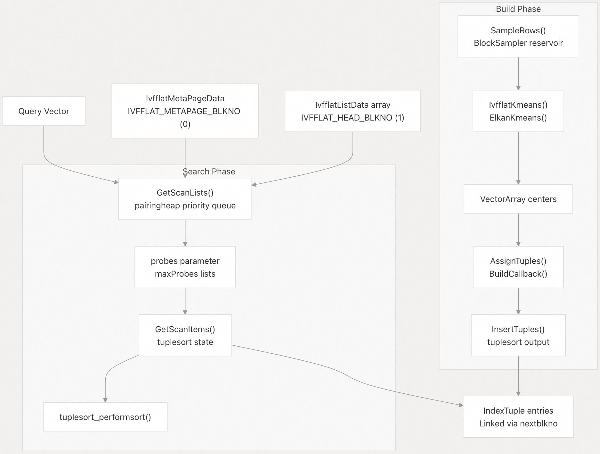
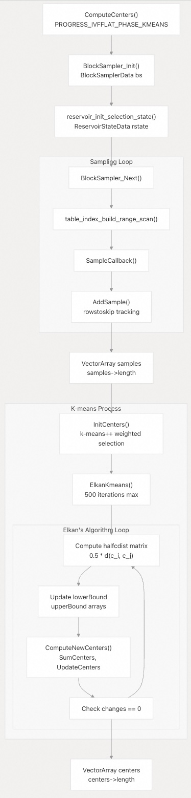
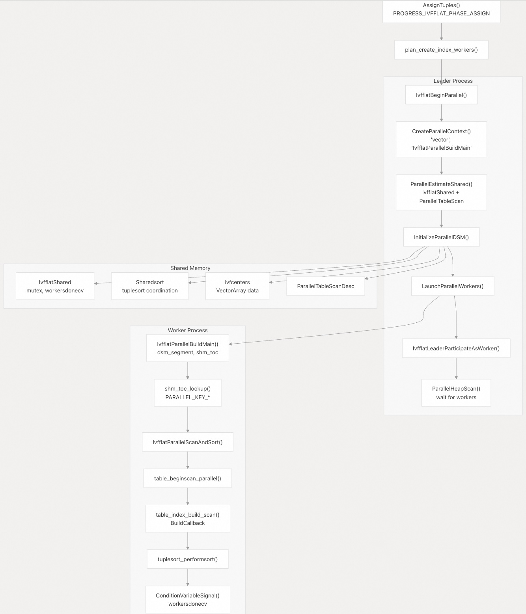
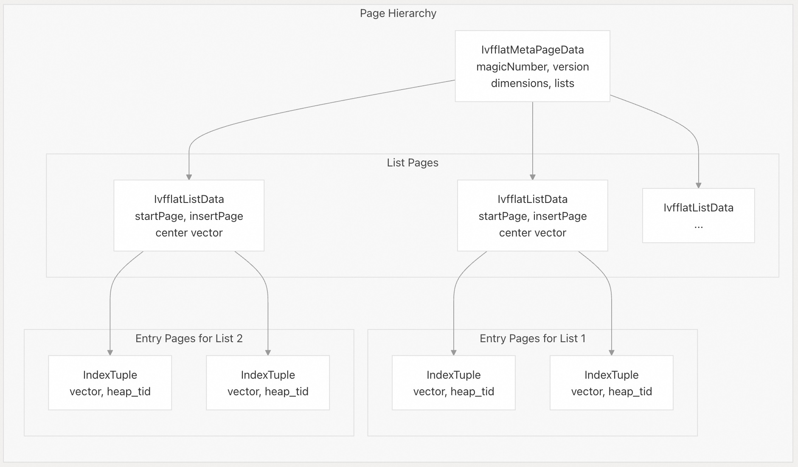
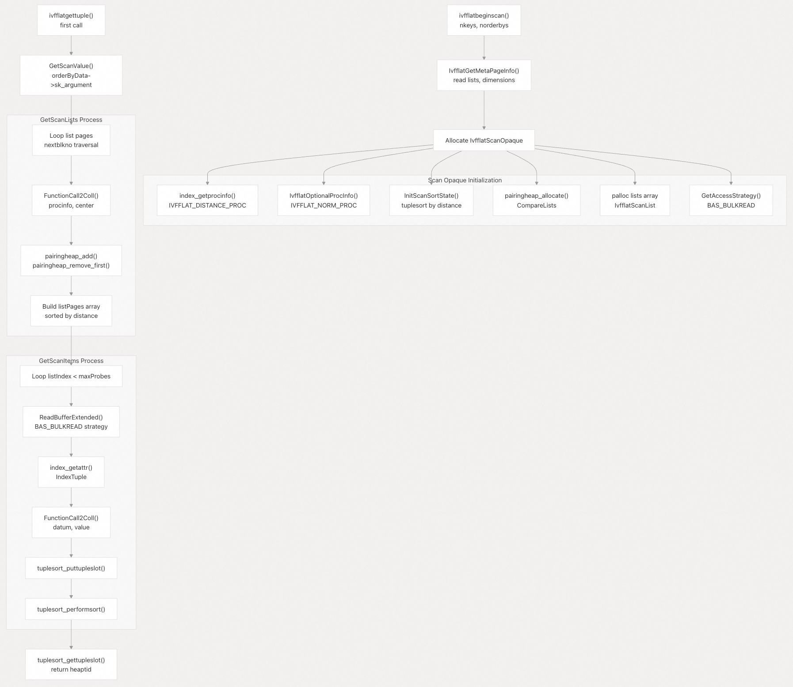
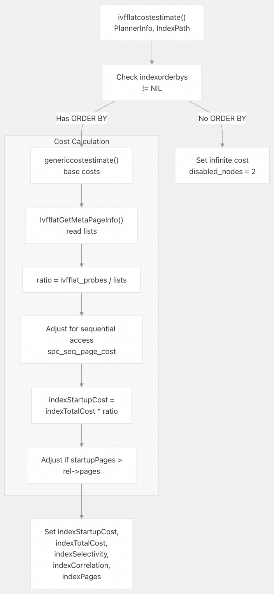
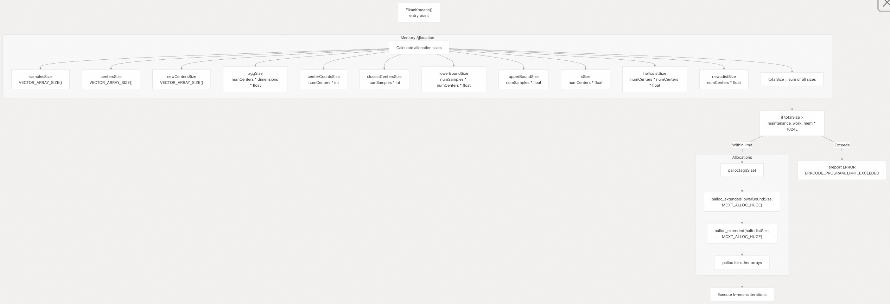
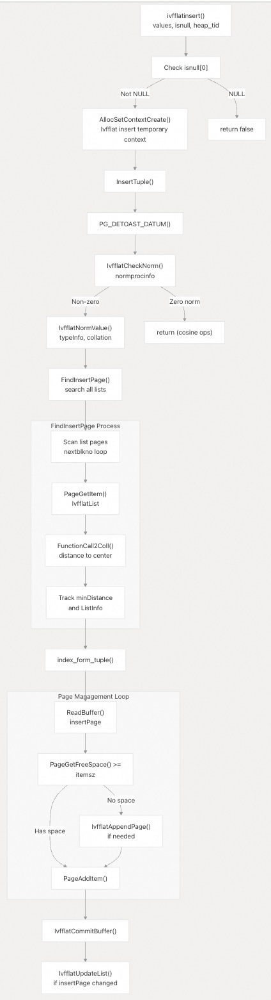

## pgvector 源码学习: 4.2 IVFFlat 索引 (IVFFlat Index)  
                                                                  
### 作者                                                                  
digoal                                                                  
                                                                  
### 日期                                                                  
2025-11-04                                                                  
                                                                  
### 标签                                                                  
pgvector , 源码学习                                                                  
                                                                  
----                                                                  
                                                                  
## 背景                                                                  
**IVFFlat (Inverted File Flat，倒排文件平面)** 是 pgvector 中一种基于聚类的**近似最近邻 (Approximate Nearest Neighbor, ANN)** 索引方法。它使用 **k-均值聚类 (k-means clustering)** 将向量划分到不同的**列表 (lists)** 中，并通过在查询时仅探测（**probing**）一部分列表来实现快速的相似性搜索。  
  
## 概述与架构 (Overview and Architecture)  
  
IVFFlat 使用**倒排文件结构 (inverted file structure)**，其中向量在索引构建过程中被划分到聚类（称为 "**列表**"）。每个列表包含靠近一个计算出的**聚类中心 (cluster center)** 的向量。在搜索过程中，系统只检查最有希望的列表，与**穷举扫描 (exhaustive scanning)** 相比，这极大地减少了搜索空间。  
  
该实现使用了 [`src/ivfflat.h`](https://github.com/pgvector/pgvector/blob/d823c445/src/ivfflat.h) 中定义的三个关键数据结构：  
  
| 结构 (Structure) | 用途 (Purpose) | 关键字段 (Key Fields) |  
| :--- | :--- | :--- |  
| `IvfflatMetaPageData` | 索引元数据 (Index metadata) | `magicNumber`、`version`、`dimensions`、`lists` |  
| `IvfflatListData` | 聚类信息 (Cluster information) | `startPage`、`insertPage`、`center` (Vector) |  
| `IvfflatPageOpaqueData` | 页面链接 (Page linking) | 用于链表遍历的 `nextblkno` |  
  
    
  
**IVFFlat 索引结构与代码实体的处理流程**  
  
索引处理器（**Index Handler**）通过 `ivfflathandler()` 注册，该函数返回一个定义所有访问方法操作的 **`IndexAmRoutine` (索引访问方法例程)** 结构。  
  
来源:  
[`src/ivfflat.h` 222-256](https://github.com/pgvector/pgvector/blob/d823c445/src/ivfflat.h#L222-L256)  
[`src/ivfflat.c` 178-255](https://github.com/pgvector/pgvector/blob/d823c445/src/ivfflat.c#L178-L255)  
[`src/ivfbuild.c` 117-135](https://github.com/pgvector/pgvector/blob/d823c445/src/ivfbuild.c#L117-L135)  
[`src/ivfscan.c` 36-107](https://github.com/pgvector/pgvector/blob/d823c445/src/ivfscan.c#L36-L107)  
  
## 索引构建流程 (Index Building Process)  
  
### 采样与 K-means 聚类 (Sampling and K-means Clustering)  
  
索引构建首先从表中采样（**sampling**）向量来计算聚类中心。采样过程使用**水塘采样 (Reservoir sampling)**（通过 `BlockSampler` 和 `ReservoirStateData`）来选择一个具有代表性的向量子集。  
  
采样目标是 `lists * 50` 个样本（最少 10,000 个），以确保聚类质量。`table_index_build_range_scan()` 会为每个采样到的行调用 `SampleCallback()` 函数。  
  
    
  
**使用 Elkan 算法的 K-means 聚类过程**  
  
K-means 的实现使用了以下几种优化：  
  
1.  **k-means++ 初始化 (k-means++ initialization)** (`InitCenters()`): 使用加权概率分布选择初始中心，以提高聚类质量。  
2.  **Elkan 算法 (Elkan's algorithm)** (`ElkanKmeans()`): 使用**三角不等式 (triangle inequality)** 以及 `lowerBound` 和 `upperBound` 数组来减少距离计算。  
3.  **距离矩阵缓存**: 维护用于**中心间距离 (inter-center distances)** 的 `halfcdist[i][j]` 矩阵。  
4.  **提前终止 (Early termination)**: 在 `changes == 0` 时检查收敛。  
  
该算法根据**运算符类 (operator class)** 使用专门的距离函数：  
  
  * `vector_l2_ops` 使用 **L2 距离 (L2 distance)**（`IVFFLAT_KMEANS_DISTANCE_PROC`）  
  * **内积 (inner product)** 和**余弦 (cosine)** 使用**角度距离 (Angular distance)**（`IVFFLAT_KMEANS_NORM_PROC`）  
  
来源:  
[`src/ivfbuild.c` 402-441](https://github.com/pgvector/pgvector/blob/d823c445/src/ivfbuild.c#L402-L441)  
[`src/ivfkmeans.c` 17-89](https://github.com/pgvector/pgvector/blob/d823c445/src/ivfkmeans.c#L17-L89)  
[`src/ivfkmeans.c` 258-494](https://github.com/pgvector/pgvector/blob/d823c445/src/ivfkmeans.c#L258-L494)  
[`src/ivfkmeans.c` 356-493](https://github.com/pgvector/pgvector/blob/d823c445/src/ivfkmeans.c#L356-L493)  
  
### 并行索引构建 (Parallel Index Building)  
  
IVFFlat 支持**并行索引构建 (Parallel index building)**，以提高大型数据集上的性能。并行实现协调多个**工作进程 (workers)** 来扫描**堆 (heap)** 并排序**元组 (tuples)**。并行工作进程的数量由 `plan_create_index_workers()` 确定。  
  
    
  
**使用共享内存的并行构建协调**  
  
| 组件 (Component) | 功能 (Function) | 用途 (Purpose) |  
| :--- | :--- | :--- |  
| Leader Process (领导进程) | `IvfflatBeginParallel()` | 分配**共享内存 (Shared Memory)**，启动工作进程 |  
| Worker Processes (工作进程) | `IvfflatParallelBuildMain()` | 并行工作进程的入口点 |  
| Shared Memory (共享内存) | `IvfflatShared` | 通过 `mutex` 和 `workersdonecv` 协调状态 |  
| Tuple Sorting (元组排序) | `InitBuildSortState()` | 创建协调的**元组排序状态 (Tuplesortstate)** |  
| Synchronization (同步) | `ParallelTableScanFromIvfflatShared()` | 访问并行扫描描述符的宏 |  
  
并行实现使用了四个共享内存键（**shared memory keys**）：  
  
  * `PARALLEL_KEY_IVFFLAT_SHARED`: 主要协调结构  
  * `PARALLEL_KEY_TUPLESORT`: 共享的元组排序状态  
  * `PARALLEL_KEY_IVFFLAT_CENTERS`: 聚类中心数组  
  * `PARALLEL_KEY_QUERY_TEXT`: 调试查询字符串  
  
工作进程按分配的**列表编号 (list number)**（排序描述符中的第一列）对元组进行排序，以便在加载阶段进行高效的**顺序插入 (sequential insertion)**。  
  
来源:  
[`src/ivfbuild.c` 677-734](https://github.com/pgvector/pgvector/blob/d823c445/src/ivfbuild.c#L677-L734)  
[`src/ivfbuild.c` 784-923](https://github.com/pgvector/pgvector/blob/d823c445/src/ivfbuild.c#L784-L923)  
[`src/ivfbuild.c` 581-611](https://github.com/pgvector/pgvector/blob/d823c445/src/ivfbuild.c#L581-L611)  
[`src/ivfflat.h` 125-161](https://github.com/pgvector/pgvector/blob/d823c445/src/ivfflat.h#L125-L161)  
[`src/ivfflat.h` 34-37](https://github.com/pgvector/pgvector/blob/d823c445/src/ivfflat.h#L34-L37)  
  
### 页面结构创建 (Page Structure Creation)  
  
在 k-均值聚类之后，构建过程创建索引页面结构：  
  
1.  **元数据页 (Metapage)**（`IVFFLAT_METAPAGE_BLKNO`）：包含索引元数据  
2.  **列表页 (List Pages)**（`IVFFLAT_HEAD_BLKNO`）：存储聚类中心和指针  
3.  **条目页 (Entry Pages)**：包含按列表组织的实际向量元组  
  
    
  
**IVFFlat 索引页面组织**  
  
来源:  
[`src/ivfbuild.c` 447-467](https://github.com/pgvector/pgvector/blob/d823c445/src/ivfbuild.c#L447-L467)  
[`src/ivfbuild.c` 472-517](https://github.com/pgvector/pgvector/blob/d823c445/src/ivfbuild.c#L472-L517)  
[`src/ivfflat.h` 222-248](https://github.com/pgvector/pgvector/blob/d823c445/src/ivfflat.h#L222-L248)  
  
## 索引扫描 (Index Scanning)  
  
### 列表选择与探测 (List Selection and Probing)  
  
在索引扫描期间，IVFFlat 首先识别**最接近查询向量 (query vector)** 的列表，然后仅搜索**可配置数量 (configurable number)** 的这些列表（由 **`ivfflat.probes`** 参数控制）。  
  
| 参数 (Parameter) | 用途 (Purpose) | 默认值 (Default) | 范围 (Range) |  
| :--- | :--- | :--- | :--- |  
| `ivfflat.probes` | 要搜索的列表数 (Number of lists to search) | 1 | 1 到 lists |  
| `ivfflat.iterative_scan` | 启用**迭代扫描模式 (iterative scanning mode)** | off | off, relaxed\_order |  
| `ivfflat.max_probes` | 迭代扫描的最大探针数 (Maximum probes) | 32768 | 1 到 32768 |  
  
扫描过程实现了一个**优先队列 (priority queue)**（使用 **`pairingheap` (配对堆)**）来高效地选择最接近的列表：  
  
   
  
**使用代码实体的索引扫描过程流程**  
  
`IvfflatScanOpaque` 结构维护扫描状态，包括：  
  
  * `listQueue`：用于选择最接近列表的配对堆  
  * `listPages`：选定列表的 `BlockNumber` 数组  
  * `sortstate`：用于按距离排序结果的**元组排序状态**  
  * `bas`：用于高效批量读取的**缓冲区访问策略 (BufferAccessStrategy)**  
  
`CompareLists()` 函数在配对堆中根据 `distance` 字段对 `IvfflatScanList` 节点进行排序。  
  
来源:  
[`src/ivfscan.c` 18-31](https://github.com/pgvector/pgvector/blob/d823c445/src/ivfscan.c#L18-L31)  
[`src/ivfscan.c` 36-107](https://github.com/pgvector/pgvector/blob/d823c445/src/ivfscan.c#L36-L107)  
[`src/ivfscan.c` 112-176](https://github.com/pgvector/pgvector/blob/d823c445/src/ivfscan.c#L112-L176)  
[`src/ivfscan.c` 241-314](https://github.com/pgvector/pgvector/blob/d823c445/src/ivfscan.c#L241-L314)  
[`src/ivfflat.h` 250-287](https://github.com/pgvector/pgvector/blob/d823c445/src/ivfflat.h#L250-L287)  
  
### 迭代扫描 (Iterative Scanning)  
  
IVFFlat 支持**迭代扫描模式 (iterative scanning modes)**，以在初始探针数不足时提高**召回率 (recall)**。`ivfflat.iterative_scan` 参数支持逐步扩展搜索：  
  
  * **Off**: 固定数量的探针  
  * **Relaxed Order (宽松顺序)**: 如果初始结果耗尽，则增加额外的探针  
  
来源:  
[`src/ivfflat.h` 88-92](https://github.com/pgvector/pgvector/blob/d823c445/src/ivfflat.h#L88-L92)  
[`src/ivfscan.c` 257-260](https://github.com/pgvector/pgvector/blob/d823c445/src/ivfscan.c#L257-L260)  
[`src/ivfscan.c` 375-381](https://github.com/pgvector/pgvector/blob/d823c445/src/ivfscan.c#L375-L381)  
  
## 配置与参数 (Configuration and Parameters)  
  
### 索引选项 (Index Options)  
  
IVFFlat 索引支持在构建时定义在 `IvfflatOptions` 中的以下选项：  
  
| 选项 (Option) | 描述 (Description) | 默认值 (Default) | 范围 (Range) | 常量 (Constant) |  
| :--- | :--- | :--- | :--- | :--- |  
| `lists` | 聚类中心的数量 (Number of cluster centers) | 100 | 1 到 32768 | `IVFFLAT_DEFAULT_LISTS`、`IVFFLAT_MIN_LISTS`、`IVFFLAT_MAX_LISTS` |  
  
这些选项通过 `ivfflatoptions()` 使用 `build_reloptions()` 框架进行解析。  
  
示例:  
  
```sql  
CREATE INDEX ON items USING ivfflat (embedding vector_l2_ops) WITH (lists = 1000);  
```  
  
### 运行时参数 (Runtime Parameters)  
  
运行时参数是在 `IvfflatInit()` 中使用 `DefineCustomIntVariable()` 和 `DefineCustomEnumVariable()` 定义的：  
  
| GUC 参数 (GUC Parameter) | 用途 (Purpose) | 默认值 (Default) | 范围 (Range) | 常量 (Constant) |  
| :--- | :--- | :--- | :--- | :--- |  
| `ivfflat.probes` | 每次查询要搜索的列表数 (Lists to search per query) | 1 | 1 到 32768 | `IVFFLAT_DEFAULT_PROBES` |  
| `ivfflat.iterative_scan` | 启用**自适应探测 (adaptive probing)** | off | off, relaxed\_order | `IVFFLAT_ITERATIVE_SCAN_OFF`、`IVFFLAT_ITERATIVE_SCAN_RELAXED` |  
| `ivfflat.max_probes` | 迭代扫描的最大探针数 (Maximum probes) | 32768 | 1 到 32768 | `IVFFLAT_MAX_LISTS` |  
  
`ivfflat.probes` 参数控制**速度-召回率权衡 (speed-recall tradeoff)**：  
  
  * 较高的值通过搜索更多列表来提高**召回率 (recall)**  
  * 较低的值通过搜索较少列表来提高**速度 (speed)**  
  * 推荐的起始值：索引的 `sqrt(lists)`  
  
来源:  
[`src/ivfflat.c` 34-54](https://github.com/pgvector/pgvector/blob/d823c445/src/ivfflat.c#L34-L54)  
[`src/ivfflat.c` 151-162](https://github.com/pgvector/pgvector/blob/d823c445/src/ivfflat.c#L151-L162)  
[`src/ivfflat.h` 41-46](https://github.com/pgvector/pgvector/blob/d823c445/src/ivfflat.h#L41-L46)  
[`src/ivfflat.h` 112-116](https://github.com/pgvector/pgvector/blob/d823c445/src/ivfflat.h#L112-L116)  
  
## 成本估算 (Cost Estimation)  
  
IVFFlat 通过 `ivfflatcostestimate()` 实现**自定义成本估算 (custom cost estimation)**，以帮助查询规划器决定何时使用该索引。  
  
   
  
**成本估算流程**  
  
成本估算考虑了以下因素：  
  
  * **探测比例 (Probe ratio)**：只扫描索引的一部分（`ivfflat_probes / lists`）  
  * **顺序访问 (Sequential access)**：扫描的一部分使用**顺序 I/O 模式 (sequential I/O patterns)**（50% 调整）  
  * **TOAST 开销 (TOAST overhead)**：当 TOAST 导致页面超出关系大小时调整成本  
  * **无 ORDER BY 惩罚**：当索引无法使用时返回**无限成本 (infinite cost)**  
  
`sequentialRatio` 值为 0.5，反映了一半的页面成本应使用**顺序页面成本 (sequential page cost)** 而不是**随机页面成本 (random page cost)**。 为什么这么设置? 我的理解: 同一个中心点下面的多个page虽然是链表形式逻辑上串起来的, 但在物理分布上可能也有一定的连续性, 只不过不像堆表存储那么连续.    
  
来源:  
[`src/ivfflat.c` 78-146](https://github.com/pgvector/pgvector/blob/d823c445/src/ivfflat.c#L78-L146)  
  
## 内存管理与优化 (Memory Management and Optimization)  
  
### 构建内存要求 (Build Memory Requirements)  
  
K-means 算法对大型数据集需要大量内存。在 `ElkanKmeans()` 中，内存使用会根据 `maintenance_work_mem` 进行验证：  
  
   
  
**K-means 算法的内存布局和验证**  
  
最大的内存组件是：  
  
  * `lowerBound`：O(numSamples \* numCenters) - 用于 Elkan 算法的**下界距离 (lower bound distances)**  
  * `halfcdist`：O(numCenters²) - 用于三角不等式的 **中心间半距离 (half distances between centers)**  
  * `samples`：O(numSamples \* dimensions) - 采样向量  
  
该算法对大型数组使用带有 `MCXT_ALLOC_HUGE` 标志的 `palloc_extended()`，以支持超过 1GB 的分配。  
  
来源:  
[`src/ivfkmeans.c` 277-299](https://github.com/pgvector/pgvector/blob/d823c445/src/ivfkmeans.c#L277-L299)  
[`src/ivfkmeans.c` 310-327](https://github.com/pgvector/pgvector/blob/d823c445/src/ivfkmeans.c#L310-L327)  
  
### 向量类型支持 (Vector Type Support)  
  
IVFFlat 通过 `IvfflatTypeInfo` 接口支持多种向量类型：  
  
| 类型 (Type) | 最大维度 (Max Dimensions) | 中心更新函数 (Center Update Function) |  
| :--- | :--- | :--- |  
| `vector` | 2000 | `VectorUpdateCenter()` |  
| `halfvec` | 4000 | `HalfvecUpdateCenter()` |  
| `bit` | 64000 | `BitUpdateCenter()` |  
  
来源:  
[`src/ivfutils.c` 328-377](https://github.com/pgvector/pgvector/blob/d823c445/src/ivfutils.c#L328-L377)  
[`src/ivfflat.h` 162-169](https://github.com/pgvector/pgvector/blob/d823c445/src/ivfflat.h#L162-L169)  
  
## 维护操作 (Maintenance Operations)  
  
### 元组插入 (Tuple Insertion)  
  
新元组通过找到**最接近的聚类中心 (closest cluster center)** 并将其添加到相应的列表中来插入。插入过程由 `ivfflatinsert()` 处理：  
  
   
  
**元组插入流程**  
  
插入步骤包括：  
  
1.  **归一化 (Normalization)**：如果定义了 `IVFFLAT_NORM_PROC`（用于**余弦距离 (cosine distance)**），则应用 `IvfflatNormValue()`  
2.  **列表选择 (List Selection)**：`FindInsertPage()` 扫描所有列表页以找到最接近的中心  
3.  **页面管理 (Page Management)**：遵循 `insertPage` 链，如果需要，通过 `IvfflatNewBuffer()` 创建新页面  
4.  **列表更新 (List Update)**：如果 `insertPage` 指针发生变化，则调用 `IvfflatUpdateList()` 进行更新  
  
该算法在创建新页面时使用 `LockRelationForExtension()` 来防止**并发扩展冲突 (concurrent extension conflicts)** 。  
  
来源:  
[`src/ivfinsert.c` 14-62](https://github.com/pgvector/pgvector/blob/d823c445/src/ivfinsert.c#L14-L62)  
[`src/ivfinsert.c` 67-176](https://github.com/pgvector/pgvector/blob/d823c445/src/ivfinsert.c#L67-L176)  
[`src/ivfinsert.c` 181-214](https://github.com/pgvector/pgvector/blob/d823c445/src/ivfinsert.c#L181-L214)  
  
### 清理操作 (Vacuum Operations)  
  
IVFFlat 支持**批量删除 (bulk delete)** 和**清理 (vacuum cleanup)** 操作：  
  
  * **批量删除**： `ivfflatbulkdelete()` 删除符合回调标准的元组  
  * **清理**： `ivfflatvacuumcleanup()` 在清理操作后更新索引统计信息  
  
清理过程通过将 `insertPage` 指针更新到第一个有空闲空间的页面来维护列表结构的 **完整性 (integrity)** 。  
  
来源:  
[`src/ivfvacuum.c` 15-140](https://github.com/pgvector/pgvector/blob/d823c445/src/ivfvacuum.c#L15-L140)  
[`src/ivfvacuum.c` 145-161](https://github.com/pgvector/pgvector/blob/d823c445/src/ivfvacuum.c#L145-L161)  
      
#### [期望 PostgreSQL|开源PolarDB 增加什么功能?](https://github.com/digoal/blog/issues/76 "269ac3d1c492e938c0191101c7238216")
  
  
#### [PolarDB 开源数据库](https://openpolardb.com/home "57258f76c37864c6e6d23383d05714ea")
  
  
#### [PolarDB 学习图谱](https://www.aliyun.com/database/openpolardb/activity "8642f60e04ed0c814bf9cb9677976bd4")
  
  
#### [PostgreSQL 解决方案集合](../201706/20170601_02.md "40cff096e9ed7122c512b35d8561d9c8")
  
  
#### [德哥 / digoal's Github - 公益是一辈子的事.](https://github.com/digoal/blog/blob/master/README.md "22709685feb7cab07d30f30387f0a9ae")
  
  
#### [About 德哥](https://github.com/digoal/blog/blob/master/me/readme.md "a37735981e7704886ffd590565582dd0")
  
  

  
