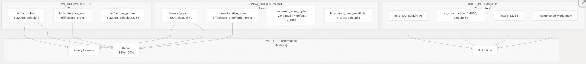
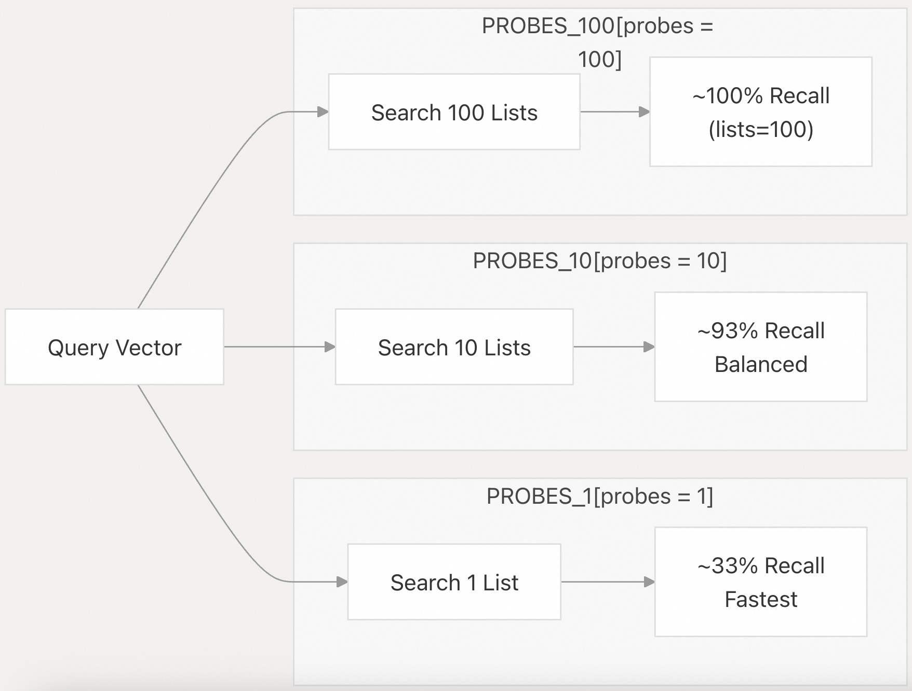
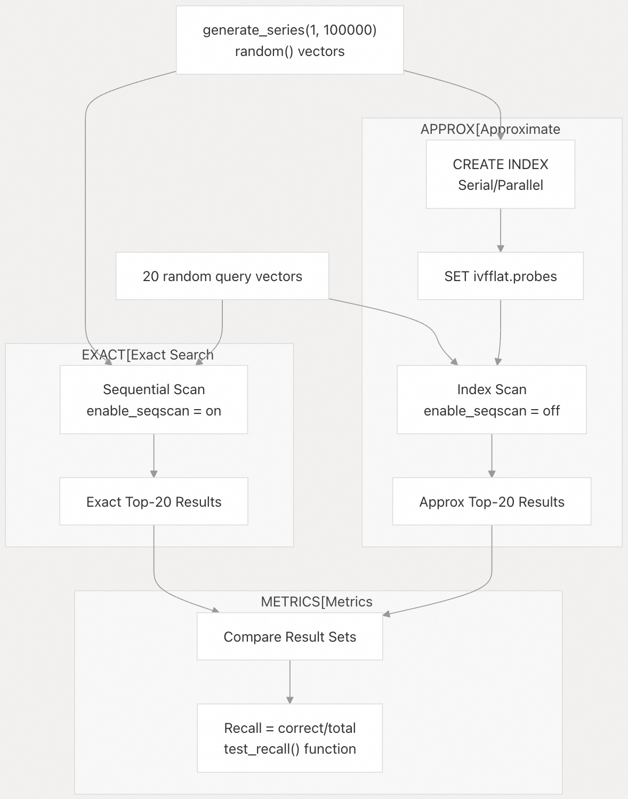
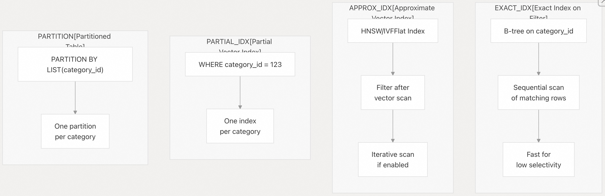

## pgvector 源码学习: 4.3 索引性能与调优 (`Index Performance and Tuning`)  
                                                                    
### 作者                                                                    
digoal                                                                    
                                                                    
### 日期                                                                    
2025-11-04                                                                    
                                                                    
### 标签                                                                    
pgvector , 源码学习                                                                    
                                                                    
----                                                                    
                                                                    
## 背景                                                                    
本文介绍 `pgvector` 的**近似最近邻** (`approximate nearest neighbor`, **ANN**) 索引的性能优化技术和配置参数。它重点介绍了 `HNSW` 索引和 `IVFFlat` 索引在查询速度 (`query speed`) 和召回精度 (`recall accuracy`, **Recall**) 之间的权衡取舍，以及针对不同工作负载的实用调优策略。  
  
## 性能基础 (`Performance Fundamentals`)  
  
`pgvector` 索引实现了**近似最近邻** (`ANN`) 搜索，以牺牲召回精度 (`recall accuracy`) 来换取查询速度 (`query speed`)。关键的性能考量因素包括：  
  
  * **Recall** (`召回率`): 返回真实最近邻居的百分比（通过测试套件 `test suite` 衡量）。  
  * **Query Latency** (`查询延迟`): 执行相似性搜索查询所需的时间。  
  * **Index Build Time** (`索引构建时间`): 构造索引所需的时间（受 `maintenance_work_mem` 影响）。  
  * **Memory Usage** (`内存使用量`): 查询和构建期间的 `RAM` 消耗。  
  * **Throughput** (`吞吐量`): 支持的并发查询数量。  
  
### 召回率与速度的权衡 (`Recall vs Speed Tradeoff`)  
  
近似最近邻搜索 (`Approximate nearest neighbor search`) 从根本上是在精度和速度之间进行权衡。`GUC` (`Grand Unified Configuration`) 参数控制着这种权衡。  
  
  
  
来源:  
[`README.md` 259-277](https://github.com/pgvector/pgvector/blob/d823c445/README.md#L259-L277) [`README.md` 376-391](https://github.com/pgvector/pgvector/blob/d823c445/README.md#L376-L391) [`test/expected/hnsw_vector.out` 164-201](https://github.com/pgvector/pgvector/blob/d823c445/test/expected/hnsw_vector.out#L164-L201) [`test/expected/ivfflat_vector.out` 146-175](https://github.com/pgvector/pgvector/blob/d823c445/test/expected/ivfflat_vector.out#L146-L175)  
  
## HNSW 性能调优 (`HNSW Performance Tuning`)  
  
`HNSW` 索引构建了**层次化可导航小世界图** (`hierarchical navigable small world graphs`)。性能取决于构建时的索引结构参数 (`build-time index structure parameters`) 和查询时的搜索参数 (`query-time search parameters`)。  
  
### 构建时参数 (`Build-Time Parameters`)  
  
参数在 `CREATE INDEX` 语句的 `WITH` 子句中指定：  
  
| Parameter (参数) | Range (范围) | Default (默认值) | Description (描述) | Impact (影响) |  
| :--- | :--- | :--- | :--- | :--- |  
| `m` | 2-100 | 16 | Max connections per layer (`每层最大连接数`) | Higher = better recall, larger index (`更高 = 更好的召回率，更大的索引`) |  
| `ef_construction` | 4-1000 | 64 | Dynamic candidate list size (`动态候选列表大小`) | Higher = better recall, slower builds (`更高 = 更好的召回率，更慢的构建速度`) |  
  
**验证约束** (`Validation Constraint`): `ef_construction >= 2 * m`  
  
该约束由 [`test/expected/hnsw_vector.out` 162-163](https://github.com/pgvector/pgvector/blob/d823c445/test/expected/hnsw_vector.out#L162-L163) 强制执行。  
  
```  
CREATE INDEX ON t USING hnsw (val vector_l2_ops) WITH (m = 16, ef_construction = 31);  
ERROR:  ef_construction must be greater than or equal to 2 * m  
```  
  
#### 索引构建内存管理 (`Index Build Memory Management`)  
  
当图 (`graph`) 能够适应 `maintenance_work_mem` 时，`HNSW` 的构建速度会显著加快。  
  
```  
-- Check current setting  
SHOW maintenance_work_mem;  
  
-- Set for large index builds (e.g., 8GB)  
SET maintenance_work_mem = '8GB';  
  
CREATE INDEX ON vectors USING hnsw (embedding vector_l2_ops)  
WITH (m = 16, ef_construction = 64);  
```  
  
当图超出 `maintenance_work_mem` 时，会显示通知：  
  
```  
NOTICE:  hnsw graph no longer fits into maintenance_work_mem after 100000 tuples  
DETAIL:  Building will take significantly more time.  
HINT:  Increase maintenance_work_mem to speed up builds.  
```  
  
**警告** (`Warning`): 不要将 `maintenance_work_mem` 设置得过高，以免耗尽系统内存 (`system memory`)。  
  
### 查询时 GUC 参数 (`Query-Time GUC Parameters`)  
  
#### hnsw.ef\_search  
  
控制搜索期间**动态候选列表** (`dynamic candidate list`) 的大小。有效范围：1-1000，默认值：40。  
  
```  
-- Low latency configuration  
SET hnsw.ef_search = 10;  
  
-- Default balanced configuration    
SET hnsw.ef_search = 40;  
  
-- High recall configuration  
SET hnsw.ef_search = 200;  
  
-- Per-query setting  
BEGIN;  
SET LOCAL hnsw.ef_search = 100;  
SELECT * FROM vectors ORDER BY embedding <-> '[1,2,3]' LIMIT 5;  
COMMIT;  
```  
  
参数验证由 [`test/expected/hnsw_vector.out` 170-173](https://github.com/pgvector/pgvector/blob/d823c445/test/expected/hnsw_vector.out#L170-L173) 强制执行。  
  
```  
SET hnsw.ef_search = 0;  
ERROR:  0 is outside the valid range for parameter "hnsw.ef_search" (1 .. 1000)  
```  
  
#### hnsw.iterative\_scan  
  
启用**迭代索引扫描** (`iterative index scanning`) 来处理带**过滤器** (`filters`) 的查询（在 0.8.0 版本中引入）。有效值：`off`、`relaxed_order`、`strict_order`。  
  
  * `off` (默认值): Standard single-pass graph traversal (`标准单次遍历图`)  
  * `relaxed_order`: Scan more of the index automatically, results may be slightly out of order (`自动扫描更多索引，结果可能略微乱序`)  
  * `strict_order`: Scan more of the index automatically, maintains strict distance ordering (`自动扫描更多索引，保持严格的距离排序`)  
  
```  
-- Enable strict ordering for filtered queries  
SET hnsw.iterative_scan = strict_order;  
SELECT * FROM vectors   
WHERE category_id = 123   
ORDER BY embedding <-> '[1,2,3]' LIMIT 5;  
  
-- Enable relaxed ordering for better recall  
SET hnsw.iterative_scan = relaxed_order;  
SELECT * FROM vectors   
WHERE category_id = 123   
ORDER BY embedding <-> '[1,2,3]' LIMIT 5;  
```  
  
在 `relaxed_order` 模式下，可以使用**物化公共表表达式** (`materialized CTE`) 来实现严格排序。  
  
```  
WITH relaxed_results AS MATERIALIZED (  
    SELECT id, embedding <-> '[1,2,3]' AS distance   
    FROM vectors WHERE category_id = 123   
    ORDER BY distance LIMIT 5  
) SELECT * FROM relaxed_results ORDER BY distance + 0;  
```  
  
#### hnsw.max\_scan\_tuples  
  
迭代扫描 (`iterative scans`) 期间访问的最大**元组** (`tuples`) 数量。有效范围：1-2147483647，默认值：20000。  
  
```  
SET hnsw.max_scan_tuples = 50000;  -- Scan more tuples if needed  
```  
  
此限制是近似值，不影响初始扫描 (`initial scan`)。  
  
#### hnsw.scan\_mem\_multiplier  
  
扫描操作 (`scan operations`) 的内存乘数，作为 `work_mem` 的倍数。有效范围：1-1000，默认值：1。  
  
```  
SET hnsw.scan_mem_multiplier = 2;  -- Use 2x work_mem for scans  
```  
  
如果增加 `hnsw.max_scan_tuples` 未能提高召回率 (`recall`)，则增加此参数。  
  
### 并行索引构建 (`Parallel Index Builds`)  
  
`HNSW` 支持**并行索引构建** (`parallel index construction`)。  
  
```  
-- Enable parallel workers (default: 2)  
SET max_parallel_maintenance_workers = 7;  -- 7 workers plus leader  
  
-- May need to increase total worker limit  
SET max_parallel_workers = 8;  -- Default limit  
  
CREATE INDEX ON vectors USING hnsw (embedding vector_l2_ops);  
```  
  
### 索引构建进度监控 (`Index Build Progress Monitoring`)  
  
PostgreSQL 12+ 通过 `pg_stat_progress_create_index` 支持进度监控：  
  
```  
SELECT phase,   
       round(100.0 * blocks_done / nullif(blocks_total, 0), 1) AS "%"  
FROM pg_stat_progress_create_index;  
```  
  
`HNSW` 阶段 (`phases`):  
  
1.  `initializing` (`初始化`)  
2.  `loading tuples` (`加载元组`)  
  
来源:  
[`README.md` 255-316](https://github.com/pgvector/pgvector/blob/d823c445/README.md#L255-L316) [`README.md` 289-303](https://github.com/pgvector/pgvector/blob/d823c445/README.md#L289-L303) [`README.md` 307-316](https://github.com/pgvector/pgvector/blob/d823c445/README.md#L307-L316) [`README.md` 318-323](https://github.com/pgvector/pgvector/blob/d823c445/README.md#L318-L323) [`README.md` 452-456](https://github.com/pgvector/pgvector/blob/d823c445/README.md#L452-L456) [`README.md` 476-498](https://github.com/pgvector/pgvector/blob/d823c445/README.md#L476-L498) [`README.md` 514-530](https://github.com/pgvector/pgvector/blob/d823c445/README.md#L514-L530) [`test/expected/hnsw_vector.out` 148-201](https://github.com/pgvector/pgvector/blob/d823c445/test/expected/hnsw_vector.out#L148-L201) [`test/sql/hnsw_vector.sql` 90-117](https://github.com/pgvector/pgvector/blob/d823c445/test/sql/hnsw_vector.sql#L90-L117)  
  
## IVFFlat 性能调优 (`IVFFlat Performance Tuning`)  
  
`IVFFlat` 索引使用**倒排文件索引** (`inverted file indexing`) 和 `k-means` 聚类 (`clustering`) 将向量划分到**列表** (`lists`) 中。查询性能取决于列表数量和探测 (`probe`) 设置。  
  
### 构建时参数 (`Build-Time Parameters`)  
  
`lists` 参数控制 `k-means` 聚类**粒度** (`granularity`)：  
  
| Parameter (参数) | Range (范围) | Recommended (建议值) | Description (描述) |  
| :--- | :--- | :--- | :--- |  
| `lists` | 1-32768 | `rows/1000` (≤1M) <br> `sqrt(rows)` (\>1M) | Number of k-means cluster centroids (`k-means 聚类中心点数量`) |  
  
```  
-- For 100k rows  
CREATE INDEX ON vectors USING ivfflat (embedding vector_l2_ops)   
WITH (lists = 100);  
  
-- For 1M+ rows  
CREATE INDEX ON vectors USING ivfflat (embedding vector_l2_ops)   
WITH (lists = 1000);  
```  
  
**关键** (`Critical`): 务必在表中有数据*之后*创建索引。`IVFFlat` 需要**训练数据** (`training data`) 进行 `k-means` 聚类。在数据不足的情况下创建会触发警告：  
  
```  
NOTICE:  ivfflat index created with little data  
DETAIL:  This will cause low recall.  
HINT:  Drop the index until the table has more data.  
```  
  
参数验证由 [`test/expected/ivfflat_vector.out` 140-145](https://github.com/pgvector/pgvector/blob/d823c445/test/expected/ivfflat_vector.out#L140-L145) 强制执行。  
  
```  
CREATE INDEX ON t USING ivfflat (val vector_l2_ops) WITH (lists = 0);  
ERROR:  value 0 out of bounds for option "lists"  
DETAIL:  Valid values are between "1" and "32768".  
```  
  
### 查询时 GUC 参数 (`Query-Time GUC Parameters`)  
  
#### ivfflat.probes  
  
要搜索的**聚类列表** (`cluster lists`) 数量。有效范围：1-32768，默认值：1。这是 `IVFFlat` 的主要召回率/速度控制参数。  
  
召回率与探测数 (`Probes`) 的对比（来自测试套件 `test suite`）  
  
  
  
召回率百分比由 [`test/t/032_ivfflat_halfvec_build_recall.pl` 108-120](https://github.com/pgvector/pgvector/blob/d823c445/test/t/032_ivfflat_halfvec_build_recall.pl#L108-L120) 衡量。  
  
```  
test_recall(1, 0.33, $operator);   # 33% recall with 1 probe  
test_recall(10, 0.93, $operator);  # 93% recall with 10 probes  
test_recall(100, 1.00, $operator); # 100% recall when probes=lists  
```  
  
配置示例：  
  
```  
-- Low latency, lower recall  
SET ivfflat.probes = 1;  -- Default  
  
-- Recommended starting point: sqrt(lists)  
SET ivfflat.probes = 10;  
  
-- High recall (approaches exact search)  
SET ivfflat.probes = 100;  
  
-- Per-query setting  
BEGIN;  
SET LOCAL ivfflat.probes = 10;  
SELECT * FROM vectors ORDER BY embedding <-> '[1,2,3]' LIMIT 5;  
COMMIT;  
```  
  
当 `probes` 等于 `lists` 时，**规划器** (`planner`) 可能会选择**顺序扫描** (`sequential scan`)。 因为要扫描所有lists, 不如全表扫描来的快.    
  
#### ivfflat.iterative\_scan  
  
启用**迭代探测** (`iterative probing`) 来处理带过滤器的查询（在 0.8.0 版本中引入）。有效值：`off`、`relaxed_order`。  
  
  * `off` (默认值): Search specified number of probes (`搜索指定数量的探测`)  
  * `relaxed_order`: Automatically search additional probes until `LIMIT` is satisfied (`自动搜索额外的探测，直到满足 LIMIT 条件`)  
  
```  
SET ivfflat.iterative_scan = relaxed_order;  
SELECT * FROM vectors   
WHERE category_id = 123   
ORDER BY embedding <-> '[1,2,3]' LIMIT 5;  
```  
  
迭代扫描 (`Iterative scanning`) 一直持续到达到 `ivfflat.max_probes` 或找到足够的结果为止。  
  
#### ivfflat.max\_probes  
  
迭代扫描 (`iterative scans`) 的最大探测数。有效范围：1-32768，默认值：32768。  
  
```  
SET ivfflat.max_probes = 100;  -- Stop after 100 probes max  
```  
  
如果 `ivfflat.max_probes < ivfflat.probes`，则使用 `ivfflat.probes` 的值。  
  
### 并行索引构建 (`Parallel Index Builds`)  
  
`IVFFlat` 支持**并行 k-means 聚类** (`parallel k-means clustering`) 和索引构建。  
  
```  
SET max_parallel_maintenance_workers = 7;  -- Plus leader  
SET min_parallel_table_scan_size = 1;      -- Enable parallelism  
  
CREATE INDEX ON vectors USING ivfflat (embedding vector_l2_ops)  
WITH (lists = 100);  
```  
  
并行构建由 [`test/t/032_ivfflat_halfvec_build_recall.pl` 124-131](https://github.com/pgvector/pgvector/blob/d823c445/test/t/032_ivfflat_halfvec_build_recall.pl#L124-L131) 验证。  
  
```  
my ($ret, $stdout, $stderr) = $node->psql("postgres", qq(  
    SET client_min_messages = DEBUG;  
    SET min_parallel_table_scan_size = 1;  
    CREATE INDEX idx ON tst USING ivfflat (v $opclass);  
));  
is($ret, 0, $stderr);  
like($stderr, qr/using \d+ parallel workers/);  
```  
  
### 索引构建进度监控 (`Index Build Progress Monitoring`)  
  
PostgreSQL 12+ 支持进度监控：  
  
```  
SELECT phase,   
       round(100.0 * tuples_done / nullif(tuples_total, 0), 1) AS "%"  
FROM pg_stat_progress_create_index;  
```  
  
`IVFFlat` 阶段 (`phases`):  
  
1.  `initializing` (`初始化`)  
2.  `performing k-means` (`执行 k-means`)  
3.  `assigning tuples` (`分配元组`)  
4.  `loading tuples` (`加载元组`)  
  
注意：`%` 列仅在 `loading tuples` 阶段填充。  
  
来源:  
[`README.md` 330-391](https://github.com/pgvector/pgvector/blob/d823c445/README.md#L330-L391) [`README.md` 334-338](https://github.com/pgvector/pgvector/blob/d823c445/README.md#L334-L338) [`README.md` 376-391](https://github.com/pgvector/pgvector/blob/d823c445/README.md#L376-L391) [`README.md` 394-402](https://github.com/pgvector/pgvector/blob/d823c445/README.md#L394-L402) [`README.md` 404-418](https://github.com/pgvector/pgvector/blob/d823c445/README.md#L404-L418) [`README.md` 470-508](https://github.com/pgvector/pgvector/blob/d823c445/README.md#L470-L508) [`README.md` 532-541](https://github.com/pgvector/pgvector/blob/d823c445/README.md#L532-L541) [`test/expected/ivfflat_vector.out` 28-31](https://github.com/pgvector/pgvector/blob/d823c445/test/expected/ivfflat_vector.out#L28-L31) [`test/expected/ivfflat_vector.out` 85-124](https://github.com/pgvector/pgvector/blob/d823c445/test/expected/ivfflat_vector.out#L85-L124) [`test/expected/ivfflat_vector.out` 140-175](https://github.com/pgvector/pgvector/blob/d823c445/test/expected/ivfflat_vector.out#L140-L175) [`test/t/032_ivfflat_halfvec_build_recall.pl` 14-51](https://github.com/pgvector/pgvector/blob/d823c445/test/t/032_ivfflat_halfvec_build_recall.pl#L14-L51) [`test/t/032_ivfflat_halfvec_build_recall.pl` 108-120](https://github.com/pgvector/pgvector/blob/d823c445/test/t/032_ivfflat_halfvec_build_recall.pl#L108-L120) [`test/t/032_ivfflat_halfvec_build_recall.pl` 124-131](https://github.com/pgvector/pgvector/blob/d823c445/test/t/032_ivfflat_halfvec_build_recall.pl#L124-L131)  
  
## 性能监控与测试 (`Performance Monitoring and Testing`)  
  
### 查询计划分析 (`Query Plan Analysis`)  
  
使用 `EXPLAIN ANALYZE` 来验证索引使用情况并测量执行时间：  
  
```  
SET enable_seqscan = off;  
SET ivfflat.probes = 10;  
  
EXPLAIN (ANALYZE, BUFFERS)   
SELECT * FROM vectors   
ORDER BY embedding <-> '[1,2,3]'   
LIMIT 20;  
```  
  
预期的计划应显示：  
  
```  
Index Scan using idx on vectors  
```  
  
如果改为使用**顺序扫描** (`sequential scan`)，则可能是表太小，或者索引不支持当前的查询模式（需要 `ORDER BY` + `LIMIT`）。  
  
为了进行测试而**强制使用索引** (`force index usage`)：  
  
```  
BEGIN;  
SET LOCAL enable_seqscan = off;  
SELECT * FROM vectors ORDER BY embedding <-> '[1,2,3]' LIMIT 5;  
COMMIT;  
```  
  
### 召回率测试方法论 (`Recall Testing Methodology`)  
  
测试套件 (`test suite`) 通过将近似索引结果 (`approximate index results`) 与精确的顺序扫描结果 (`exact sequential scan results`) 进行比较来衡量召回率 (`recall`)。  
  
召回率测试框架（来自 `test/t/032_ivfflat_halfvec_build_recall.pl`）  
  
  
  
召回率测试实现示例，来自 [`test/t/032_ivfflat_halfvec_build_recall.pl` 14-51](https://github.com/pgvector/pgvector/blob/d823c445/test/t/032_ivfflat_halfvec_build_recall.pl#L14-L51)：  
  
```  
sub test_recall {  
    my ($probes, $min, $operator) = @_;  
    my $correct = 0;  
    my $total = 0;  
  
    # Verify index is used  
    my $explain = $node->safe_psql("postgres", qq(  
        SET enable_seqscan = off;  
        SET ivfflat.probes = $probes;  
        EXPLAIN ANALYZE SELECT i FROM tst ORDER BY v $operator '$queries[0]' LIMIT $limit;  
    ));  
    like($explain, qr/Index Scan using idx on tst/);  
  
    # Test all queries  
    for my $i (0 .. $#queries) {  
        my $actual = $node->safe_psql("postgres", qq(  
            SET enable_seqscan = off;  
            SET ivfflat.probes = $probes;  
            SELECT i FROM tst ORDER BY v $operator '$queries[$i]' LIMIT $limit;  
        ));  
        my @actual_ids = split("\n", $actual);  
        my @expected_ids = split("\n", $expected[$i]);  
        my %expected_set = map { $_ => 1 } @expected_ids;  
  
        foreach (@actual_ids) {  
            if (exists($expected_set{$_})) {  
                $correct++;  
            }  
        }  
        $total += $limit;  
    }  
  
    cmp_ok($correct / $total, ">=", $min, $operator);  
}  
```  
  
基于 `SQL` 的召回率测试：  
  
```  
-- 这里应该缺少了设置enable_indexscan=off, enable_bitmapscan=off  
-- Step 1: Get exact results (ground truth)  
CREATE TEMP TABLE exact_results AS  
WITH top AS (  
    SELECT embedding <-> '[1,2,3]' AS distance   
    FROM vectors   
    ORDER BY distance LIMIT 20  
)  
SELECT id FROM vectors   
WHERE (embedding <-> '[1,2,3]') <= (SELECT MAX(distance) FROM top);  
  
-- Step 2: Get approximate results  
SET enable_seqscan = off;  
SET ivfflat.probes = 10;  
  
CREATE TEMP TABLE approx_results AS  
SELECT id FROM vectors   
ORDER BY embedding <-> '[1,2,3]' LIMIT 20;  
  
-- Step 3: Calculate recall  
SELECT COUNT(*) * 100.0 / 20 AS recall_percentage  
FROM approx_results a  
JOIN exact_results e ON a.id = e.id;  
```  
  
### 100% 召回率验证 (`100% Recall Verification`)  
  
测试套件验证了对现有向量的查询会返回精确匹配 (`exact matches`)。来自 [`test/t/005_ivfflat_query_recall.pl` 31-42](https://github.com/pgvector/pgvector/blob/d823c445/test/t/005_ivfflat_query_recall.pl#L31-L42)：  
  
```  
# Test 100% recall - query for exact vectors in the table  
for (1 .. 20) {  
    my $id = int(rand() * 100000);  
    my $query = $node->safe_psql("postgres", "SELECT v FROM tst WHERE i = $id;");  
    my $res = $node->safe_psql("postgres", qq(  
        SET enable_seqscan = off;  
        SELECT v FROM tst ORDER BY v <-> '$query' LIMIT 1;  
    ));  
    is($res, $query);  # Should return exact match  
}  
```  
  
### 监控查询性能 (`Monitoring Query Performance`)  
  
使用 `pg_stat_statements` 来跟踪查询性能：  
  
```  
CREATE EXTENSION pg_stat_statements;  
  
-- Most time-consuming queries  
SELECT query,   
       calls,   
       ROUND((total_plan_time + total_exec_time) / calls) AS avg_time_ms,  
       ROUND((total_plan_time + total_exec_time) / 60000) AS total_time_min  
FROM pg_stat_statements   
ORDER BY total_plan_time + total_exec_time DESC   
LIMIT 20;  
```  
  
来源:  
[`README.md` 696-702](https://github.com/pgvector/pgvector/blob/d823c445/README.md#L696-L702) [`README.md` 735-758](https://github.com/pgvector/pgvector/blob/d823c445/README.md#L735-L758) [`test/t/032_ivfflat_halfvec_build_recall.pl` 14-51](https://github.com/pgvector/pgvector/blob/d823c445/test/t/032_ivfflat_halfvec_build_recall.pl#L14-L51) [`test/t/005_ivfflat_query_recall.pl` 31-42](https://github.com/pgvector/pgvector/blob/d823c445/test/t/005_ivfflat_query_recall.pl#L31-L42)  
  
## 索引选择与调优指南 (`Index Selection and Tuning Guidelines`)  
  
### HNSW 与 IVFFlat 决策矩阵 (`Decision Matrix`)  
  
| Criterion (标准) | HNSW | IVFFlat |  
| :--- | :--- | :--- |  
| Recall (召回率) | Better speed-recall tradeoff (`更好的速度-召回率权衡`) | Lower recall at same speed (`相同速度下召回率较低`) |  
| Build Time (构建时间) | Slower, memory-intensive (`较慢，内存密集型`) | Faster, requires training data (`较快，需要训练数据`) |  
| Build Requirements (构建要求) | Can build on empty table (`可以在空表上构建`) | Needs data for k-means (`需要数据进行 k-means 聚类`) |  
| Query Performance (查询性能) | Better for high recall (`更适合高召回率`) | Better for speed-first (`更适合速度优先`) |  
| Memory Usage (内存使用) | Higher during build (`构建期间更高`) | Lower overall (`总体较低`) |  
| Index Size (索引大小) | Larger on disk (`磁盘上更大`) | Smaller on disk (`磁盘上更小`) |  
| Vector Types (向量类型) | All 4 types supported (`支持所有 4 种类型`) | No `sparsevec` support (`不支持 sparsevec`) |  
| Distance Metrics (距离指标) | All 6 metrics (`所有 6 种指标`) | L2, IP, cosine, Hamming only (`仅支持 L2, IP, cosine, Hamming`) |  
  
### 何时使用 HNSW  
  
推荐用于：  
  
  * **高召回率要求** (`High recall requirements`)（需要 \>95% 的召回率）  
  * **复杂过滤查询** (`Complex filtering queries`)（能很好地利用迭代扫描）  
  * **高维向量** (`High-dimensional vectors`)（能有效处理 \>100 维）  
  * **稀疏向量** (`Sparse vectors`)（唯一支持 `sparsevec` 的索引类型）  
  * **所有距离指标** (`All distance metrics`)（L1, Hamming, Jaccard 需要 HNSW）  
  * **增量数据加载** (`Incremental data loading`)（无需重新训练）  
  
**生产环境 HNSW 配置** (`Production HNSW Configuration`):  
  
```  
-- Index creation with balanced parameters  
CREATE INDEX idx_vectors_hnsw ON vectors   
USING hnsw (embedding vector_l2_ops)  
WITH (m = 16, ef_construction = 64);  
  
-- Query configuration for high recall  
SET hnsw.ef_search = 100;  
  
-- For filtered queries  
SET hnsw.iterative_scan = relaxed_order;  
SET hnsw.max_scan_tuples = 50000;  
```  
  
### 何时使用 IVFFlat  
  
推荐用于：  
  
  * **大型数据集** (`Large datasets`)（\>1M 向量，受益于分区）  
  * **批量加载** (`Batch loading`)（索引前数据已可用）  
  * **速度优先应用** (`Speed-first applications`)（召回率牺牲可接受）  
  * **低维向量** (`Lower dimensional vectors`)（\<100 维）  
  * **内存受限构建** (`Memory-constrained builds`)（内存占用较小）  
  * **可预测的查询模式** (`Predictable query patterns`)（可以调优 `lists` 和 `probes`）  
  
**生产环境 IVFFlat 配置** (`Production IVFFlat Configuration`):  
  
```  
-- For 1M rows: sqrt(1000000) = 1000 lists  
CREATE INDEX idx_vectors_ivf ON vectors   
USING ivfflat (embedding vector_l2_ops)  
WITH (lists = 1000);  
  
-- Query configuration: sqrt(1000) = ~31 probes  
SET ivfflat.probes = 31;  
  
-- For filtered queries  
SET ivfflat.iterative_scan = relaxed_order;  
```  
  
### 针对过滤查询的迭代扫描 (`Iterative Scans for Filtered Queries`)  
  
从 0.8.0 版本开始，迭代扫描 (`iterative scans`) 会自动处理过滤：  
  
```  
-- Without iterative scans (older behavior)  
-- If hnsw.ef_search = 40 and 10% of rows match filter,  
-- only ~4 results returned on average  
  
-- With iterative scans (0.8.0+)  
SET hnsw.iterative_scan = relaxed_order;  
SELECT * FROM vectors   
WHERE category_id = 123   
ORDER BY embedding <-> '[1,2,3]'   
LIMIT 20;  -- Automatically scans more until 20 results found  
```  
  
过滤策略对比：  
  
  
  
来源:  
[`README.md` 204-207](https://github.com/pgvector/pgvector/blob/d823c445/README.md#L204-L207) [`README.md` 330-332](https://github.com/pgvector/pgvector/blob/d823c445/README.md#L330-L332) [`README.md` 420-469](https://github.com/pgvector/pgvector/blob/d823c445/README.md#L420-L469) [`README.md` 470-508](https://github.com/pgvector/pgvector/blob/d823c445/README.md#L470-L508) [`CHANGELOG.md` 6-8](https://github.com/pgvector/pgvector/blob/d823c445/CHANGELOG.md#L6-L8)  
  
### 维度限制与解决方案 (`Dimension Limits and Workarounds`)  
  
向量类型的维度限制：  
  
| Type (类型) | Index Type (索引类型) | Max Dimensions (最大维度) |  
| :--- | :--- | :--- |  
| `vector` | HNSW, IVFFlat | 2,000 |  
| `halfvec` | HNSW, IVFFlat | 4,000 |  
| `bit` | HNSW, IVFFlat | 64,000 |  
| `sparsevec` | HNSW only | 1,000 non-zero elements (`非零元素`) |  
  
对于更高的维度，可以使用：  
  
1.  **半精度索引** (`Half-precision indexing`)（最高 4,000 维）  
2.  **二值量化** (`Binary quantization`)（最高 64,000 维）  
3.  **降维** (`Dimensionality reduction`)（如 PCA 等）  
  
半精度索引示例：  
  
```  
CREATE INDEX ON vectors   
USING hnsw ((embedding::halfvec(1536)) halfvec_l2_ops);  
  
SELECT * FROM vectors   
ORDER BY embedding::halfvec(1536) <-> '[...]'::halfvec(1536)   
LIMIT 5;  
```  
  
来源:  
[`README.md` 248-254](https://github.com/pgvector/pgvector/blob/d823c445/README.md#L248-L254) [`README.md` 368-373](https://github.com/pgvector/pgvector/blob/d823c445/README.md#L368-L373) [`README.md` 550-562](https://github.com/pgvector/pgvector/blob/d823c445/README.md#L550-L562) [`README.md` 813-815](https://github.com/pgvector/pgvector/blob/d823c445/README.md#L813-L815)  
  
## 数据质量考量 (`Data Quality Considerations`)  
  
### 索引警告 (`Index Warnings`)  
  
`IVFFlat` 索引可能会对小型数据集产生警告：  
  
```  
NOTICE:  ivfflat index created with little data  
DETAIL:  This will cause low recall.  
HINT:  Drop the index until the table has more data.  
```  
  
当向量数量相对于列表数量不足时，就会发生这种情况，导致**聚类质量** (`clustering quality`) 较差。  
  
### 向量分布 (`Vector Distribution`)  
  
两种索引类型在以下情况下性能更佳：  
  
  * **在向量空间中分布良好** (`Well-distributed vectors`) 的向量  
  * **相对于维度而言足够的数据量** (`Sufficient data volume`)  
  * **用于余弦相似度** (`cosine similarity`) **的归一化向量** (`Normalized vectors`)  
  * **用于内积** (`inner product`) **的一致向量幅度** (`Consistent vector magnitudes`)  
  
来源:  
[`test/expected/ivfflat_vector.out` 28-31](https://github.com/pgvector/pgvector/blob/d823c445/test/expected/ivfflat_vector.out#L28-L31) [`test/expected/ivfflat_vector.out` 113-116](https://github.com/pgvector/pgvector/blob/d823c445/test/expected/ivfflat_vector.out#L113-L116)  
  
# 附录: `hnsw.scan_mem_multiplier` 和 `hnsw.max_scan_tuples` 如何控制迭代扫描的召回率?  
为什么提升 hnsw.scan_mem_multiplier 可以提升召回?  hnsw.scan_mem_multiplier 和 hnsw.max_scan_tuples 分别是如何控制召回的?  
  
关于 HNSW 索引中的 `hnsw.scan_mem_multiplier` 参数如何影响召回率, 以及它与 `hnsw.max_scan_tuples` 的区别。   
  
## 为什么提升 `hnsw.scan_mem_multiplier` 可以提升召回率  
  
`hnsw.scan_mem_multiplier` 控制迭代扫描使用的最大内存, 作为 `work_mem` 的倍数, 默认值为 1。    
  
在迭代扫描过程中, 系统需要在内存中维护已访问的元组信息(visited set)和候选列表(discarded heap)。 这些数据结构会随着扫描的进行而增长,消耗内存。   
  
当内存使用超过限制时, 即使还没有达到 `hnsw.max_scan_tuples` 限制, 扫描也会停止继续迭代。  这意味着如果内存限制过低, 系统可能无法充分利用 `hnsw.max_scan_tuples` 允许的扫描范围。  
  
提升 `hnsw.scan_mem_multiplier` 允许系统在内存中保存更多的扫描状态, 从而能够继续迭代扫描更多的索引元组, 提高找到满足条件的向量的机会, 进而提升召回率。   
  
## 两个参数如何分别控制召回率  
  
### `hnsw.scan_mem_multiplier`  
  
`hnsw.scan_mem_multiplier` 通过控制内存限制来间接控制召回率。 最大内存计算公式为:  
  
```  
maxMemory = work_mem * hnsw_scan_mem_multiplier * 1024 + 256  
```  
  
**在扫描循环中, 系统会检查临时上下文的内存使用量。 如果超过 `maxMemory`, 即使还有更多元组可以扫描, 迭代也会停止。**    
  
这个参数特别重要的场景是: 当您增加了 `hnsw.max_scan_tuples` 但召回率没有改善时, 很可能是因为内存限制先达到了。   
  
### `hnsw.max_scan_tuples`  
  
`hnsw.max_scan_tuples` 通过限制访问的元组总数来控制召回率。 默认值为 20,000。   
  
在扫描循环中,系统会累计访问的元组数(`so->tuples`)。 当达到 `hnsw_max_scan_tuples` 限制时, 扫描会停止继续迭代, 即使内存还有余量。  
  
这个参数是一个"硬限制", 防止在大型索引上进行过度扫描, 因为扫描大量索引是昂贵的操作。   
  
### 两者的关系  
  
在迭代扫描的实现中,这两个限制是"或"的关系 - 任何一个达到限制都会停止迭代:    
  
```c  
if (so->tuples >= hnsw_max_scan_tuples ||   
    MemoryContextMemAllocated(so->tmpCtx, false) > so->maxMemory)  
```  
  
因此,要获得最佳召回率,两个参数都需要适当设置。   
  
## Notes  
  
- `hnsw.scan_mem_multiplier` 的有效范围是 1 到 1000, 与 PostgreSQL 的 `hash_mem_multiplier` 参数范围相同    
- 迭代扫描使用专门的临时内存上下文(`tmpCtx`), 其最大分配大小设置为 256KB, 比默认值更小, 以便在达到 `work_mem` 限制前能扫描更多元组    
- 这两个参数都只在启用迭代扫描时生效(`hnsw.iterative_scan` 设置为 `relaxed_order` 或 `strict_order`)    
  
    
#### [期望 PostgreSQL|开源PolarDB 增加什么功能?](https://github.com/digoal/blog/issues/76 "269ac3d1c492e938c0191101c7238216")
  
  
#### [PolarDB 开源数据库](https://openpolardb.com/home "57258f76c37864c6e6d23383d05714ea")
  
  
#### [PolarDB 学习图谱](https://www.aliyun.com/database/openpolardb/activity "8642f60e04ed0c814bf9cb9677976bd4")
  
  
#### [PostgreSQL 解决方案集合](../201706/20170601_02.md "40cff096e9ed7122c512b35d8561d9c8")
  
  
#### [德哥 / digoal's Github - 公益是一辈子的事.](https://github.com/digoal/blog/blob/master/README.md "22709685feb7cab07d30f30387f0a9ae")
  
  
#### [About 德哥](https://github.com/digoal/blog/blob/master/me/readme.md "a37735981e7704886ffd590565582dd0")
  
  

  
