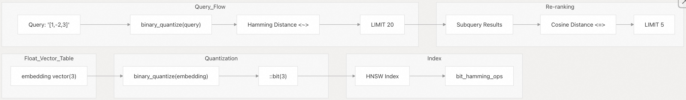
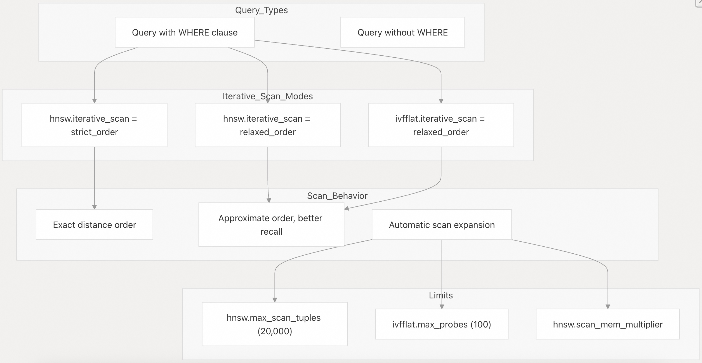
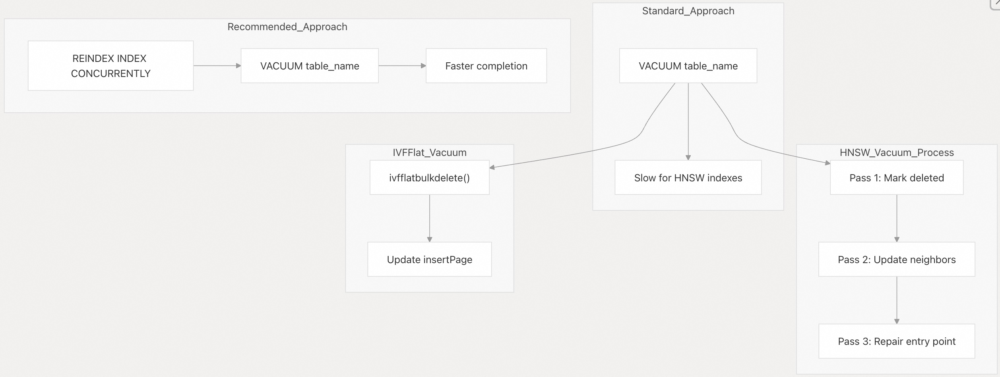
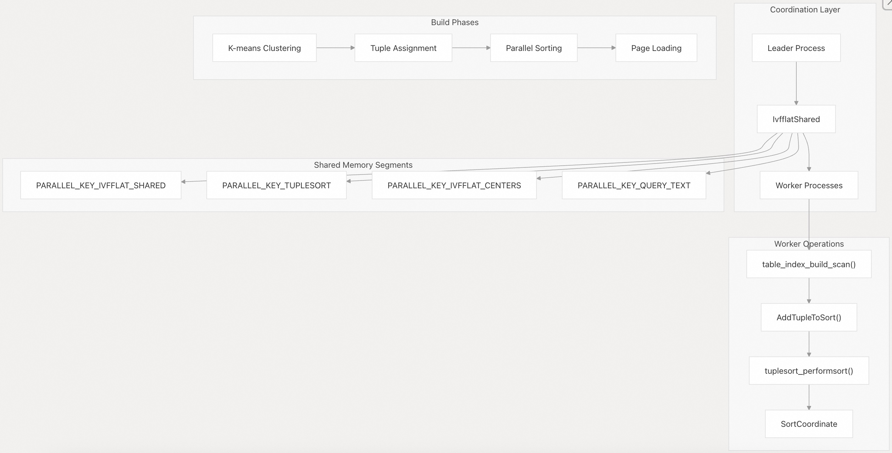
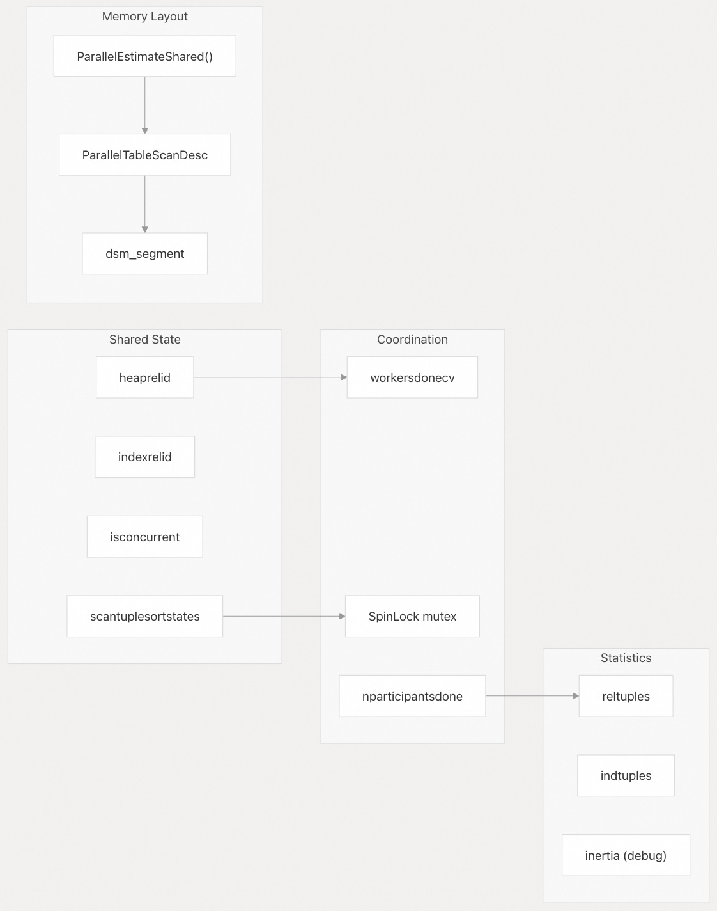
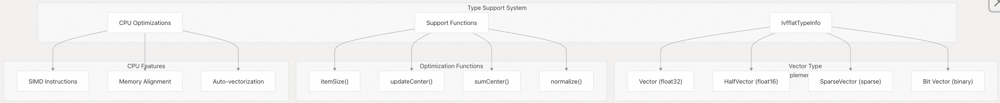
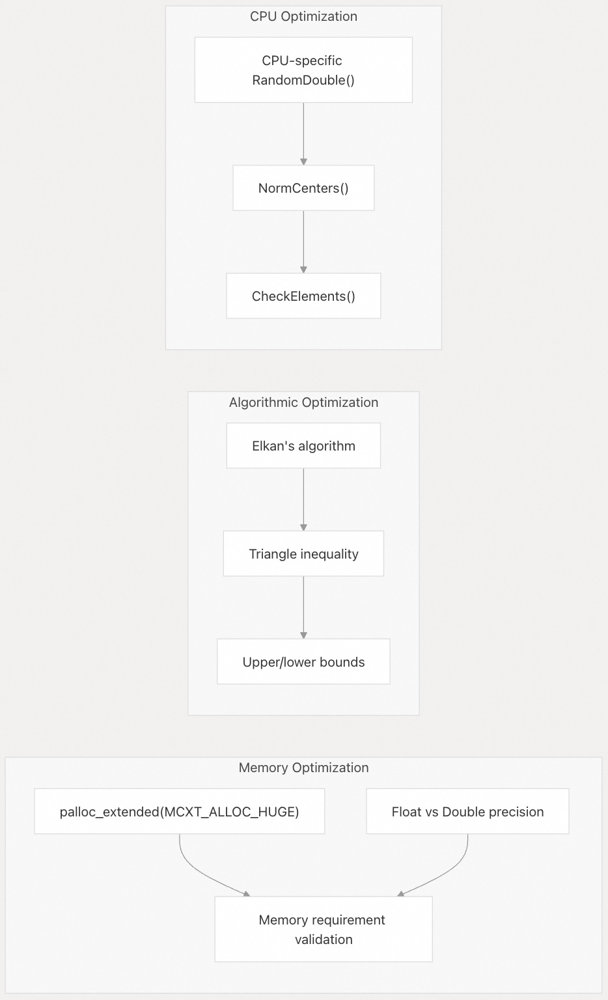

## pgvector 源码学习: 6 高级主题（Advanced Topics）  
                                                                      
### 作者                                                                      
digoal                                                                      
                                                                      
### 日期                                                                      
2025-11-04                                                                      
                                                                      
### 标签                                                                      
pgvector , 源码学习                                                                      
                                                                      
----                                                                      
                                                                      
## 背景                                                                      
本文介绍 pgvector 的高级功能（advanced features）和用于生产部署的优化技术（optimization techniques）。  
  
本文涵盖的高级主题包括用于过滤查询（filtered queries）的迭代索引扫描（iterative index scans）和半精度索引技术（half-precision indexing techniques）。  
  
## 二值量化与重排（Binary Quantization and Re-ranking）  
  
二值量化（Binary quantization）将浮点向量（float vectors）转换为二进制表示（binary representations），将内存使用量减少多达 32 倍，但会牺牲召回率（recall）。当与使用原始向量进行重排（re-ranking）结合使用时，此技术是有效的。  
  
### 使用表达式索引（Expression Indexing）进行二值量化  
  
    
  
**使用重排的二值量化（Binary Quantization with Re-ranking）**  
  
`binary_quantize` 函数将向量转换为二进制表示。表达式索引（Expression indexing）在量化值（quantized values）上创建索引，并且两阶段查询（two-stage query）在用原始向量进行重排之前，使用汉明距离（Hamming distance）检索候选结果。  
  
使用表达式索引创建索引：  
  
```sql  
CREATE INDEX ON items USING hnsw ((binary_quantize(embedding)::bit(3)) bit_hamming_ops);  
```  
  
使用原始向量重排(re-ranking)进行查询：  
  
```sql  
SELECT * FROM (  
    SELECT * FROM items ORDER BY binary_quantize(embedding)::bit(3) <~> binary_quantize('[1,-2,3]') LIMIT 20  
) ORDER BY embedding <=> '[1,-2,3]' LIMIT 5;  
```  
  
这种两阶段方法平衡了速度（二进制搜索, binary search）和准确性（浮点重排, float re-ranking）。最初的 `LIMIT` 应该大于最终的 `LIMIT`，以弥补量化误差（quantization errors）。  
  
来源:  
[`README.md` 581-601](https://github.com/pgvector/pgvector/blob/d823c445/README.md#L581-L601)  
[`src/vector.c` 708-742](https://github.com/pgvector/pgvector/blob/d823c445/src/vector.c#L708-L742)  
[`src/halfvec.c` 607-641](https://github.com/pgvector/pgvector/blob/d823c445/src/halfvec.c#L607-L641)  
  
-----  
  
## 迭代索引扫描（Iterative Index Scans）  
  
从 0.8.0 版本开始，pgvector 支持迭代索引扫描（iterative index scans）来解决使用近似索引（approximate indexes）进行过滤的问题。当 `WHERE` 子句过滤结果时，初始索引扫描（initial index scan）可能不会返回足够的匹配项。迭代扫描（Iterative scans）会自动继续扫描，直到找到足够的结果。  
  
### 排序模式（Ordering Modes）  
  
    
  
**迭代扫描模式和限制（Iterative Scan Modes and Limits）**  
  
两种排序模式（ordering modes）控制着结果排序（result ordering）和召回率（recall）之间的权衡：  
  
| 模式（Mode） | 保证（Guarantee） | 用例（Use Case） |  
| :--- | :--- | :--- |  
| `strict_order` | 结果完全按距离排序 | 需要精确排序的应用 |  
| `relaxed_order` | 结果可能略微乱序 | 更好的召回率，使用 CTE 进行严格排序 |  
  
配置示例：  
  
```sql  
SET hnsw.iterative_scan = strict_order;  
SET hnsw.max_scan_tuples = 20000;  
```  
  
在宽松排序（relaxed ordering）下，使用物化 CTE（materialized CTE）也可以获得严格排序（strict ordering）：  
  
```sql  
WITH relaxed_results AS MATERIALIZED (  
    SELECT id, embedding <-> '[1,2,3]' AS distance   
    FROM items WHERE category_id = 123   
    ORDER BY distance LIMIT 5  
) SELECT * FROM relaxed_results ORDER BY distance + 0;  
```  
  
在 Postgres 17+ 中，`+ 0` 可防止优化器（optimizer）移除外部排序（outer sort）。  
  
来源:  
[`README.md` 470-508](https://github.com/pgvector/pgvector/blob/d823c445/README.md#L470-L508)  
[`src/hnswscan.c` 1-50](https://github.com/pgvector/pgvector/blob/d823c445/src/hnswscan.c#L1-L50)  
[`src/ivfflat.c` 1-50](https://github.com/pgvector/pgvector/blob/d823c445/src/ivfflat.c#L1-L50)  
  
-----  
  
## 半精度索引（Half-Precision Indexing）  
  
半精度索引（Half-precision indexing）通过将向量存储为 `halfvec`（16 位浮点数, 16-bit floats）而不是 `vector`（32 位浮点数, 32-bit floats），将索引大小（index size）减少 50%。该技术在创建索引时使用表达式索引（expression indexing）来转换（cast）向量。  
  
### 表达式索引模式（Expression Indexing Pattern）  
  
    
  
**半精度索引流程（Half-Precision Indexing Flow）**  
  
在 `vector` 列上创建半精度索引：  
  
```sql  
CREATE INDEX ON items USING hnsw ((embedding::halfvec(3)) halfvec_l2_ops);  
```  
  
使用相同的表达式进行查询：  
  
```sql  
SELECT * FROM items ORDER BY embedding::halfvec(3) <-> '[1,2,3]' LIMIT 5;  
```  
  
在索引创建和查询之间，转换表达式（cast expression）必须完全匹配。该技术在以下情况下最为有效：  
  
  * 索引大小（Index size）是一个限制因素  
  * 可接受轻微的精度损失（precision loss）  
  * 原始向量（original vectors）保持全精度（full precision）用于结果排序  
  
对于维度（dimensions）超过 2,000 的向量，半精度索引可以在 HNSW 索引上支持高达 4,000 个维度。  
  
来源:  
[`README.md` 550-562](https://github.com/pgvector/pgvector/blob/d823c445/README.md#L550-L562)  
[`src/halfvec.c` 1-100](https://github.com/pgvector/pgvector/blob/d823c445/src/halfvec.c#L1-L100)  
[`src/hnswbuild.c` 1-50](https://github.com/pgvector/pgvector/blob/d823c445/src/hnswbuild.c#L1-L50)  
  
-----  
  
## VACUUM 与索引维护（Index Maintenance）  
  
`VACUUM` 对于 pgvector 索引特别重要，尤其是 HNSW。HNSW 的 `VACUUM` 过程可能非常耗时，推荐的策略是在 `VACUUM` 之前执行 `REINDEX` 以获得更好的性能。  
  
### VACUUM 性能策略（VACUUM Performance Strategy）  
  
    
  
**pgvector 索引的 VACUUM 策略**  
  
对于 HNSW 索引，建议采用 `REINDEX` 优先的策略：  
  
```sql  
REINDEX INDEX CONCURRENTLY index_name;  
VACUUM table_name;  
```  
  
HNSW 的 `VACUUM` 实现执行三次传递（three passes）以维护图连接（graph connectivity），这对于大型索引来说可能非常耗时。`REINDEX` 会重建整个索引，之后 `VACUUM` 会快速完成。  
  
对于 IVFFlat 索引，标准的 `VACUUM` 更高效，因为它只更新列表元数据（list metadata），而没有复杂的图维护。  
  
| 索引类型（Index Type） | VACUUM 复杂度（Complexity） | REINDEX 策略（Strategy） |  
| :--- | :--- | :--- |  
| HNSW | 三次传递过程（3-pass process） | 建议在 VACUUM 之前执行 |  
| IVFFlat | 单次传递（Single-pass） | 可选 |  
  
来源:  
[`README.md` 726-733](https://github.com/pgvector/pgvector/blob/d823c445/README.md#L726-L733)  
[`src/hnswvacuum.c` 1-200](https://github.com/pgvector/pgvector/blob/d823c445/src/hnswvacuum.c#L1-L200)  
[`src/ivfvacuum.c` 15-140](https://github.com/pgvector/pgvector/blob/d823c445/src/ivfvacuum.c#L15-L140)  
  
-----  
  
## 并行索引构建（Parallel Index Building）  
  
pgvector 使用 PostgreSQL 的并行工作器框架（parallel worker framework）为 IVFFlat 索引实现了复杂的并行索引构建（parallel index building）。该系统通过共享内存（shared memory）和分布式排序（distributed sorting）来协调多个工作器（workers）。  
  
### 并行构建架构（Parallel Build Architecture）  
  
    
  
**IVFFlat 并行构建协调**  
  
`IvfflatBeginParallel` 函数设置了包含构建状态（build state）、排序协调（sort coordination）和预计算中心点（precomputed centers）的共享内存段（shared memory segments）。工作器执行 `IvfflatParallelScanAndSort` 以独立处理表分区（table partitions）。  
  
来源:  
[`src/ivfbuild.c` 785-923](https://github.com/pgvector/pgvector/blob/d823c445/src/ivfbuild.c#L785-L923)  
[`src/ivfbuild.c` 616-671](https://github.com/pgvector/pgvector/blob/d823c445/src/ivfbuild.c#L616-L671)  
[`src/ivfbuild.c` 676-734](https://github.com/pgvector/pgvector/blob/d823c445/src/ivfbuild.c#L676-L734)  
  
### 共享内存管理（Shared Memory Management）  
  
并行构建系统管理着**多个共享内存段**（shared memory segments）：  
  
    
  
**共享内存协调结构**  
  
`IvfflatShared` 结构使用条件变量（condition variables）和自旋锁（spinlocks）来协调工作器进度。统计信息以原子方式（atomically）累积，并且表扫描描述符（table scan descriptor）支持并行堆扫描（parallel heap scanning）。  
  
来源:  
[`src/ivfflat.h` 125-147](https://github.com/pgvector/pgvector/blob/d823c445/src/ivfflat.h#L125-L147)  
[`src/ivfbuild.c` 755-822](https://github.com/pgvector/pgvector/blob/d823c445/src/ivfbuild.c#L755-L822)  
[`src/ivfbuild.c` 852-881](https://github.com/pgvector/pgvector/blob/d823c445/src/ivfbuild.c#L852-L881)  
  
### 工作进程实现（Worker Process Implementation）  
  
每个工作进程（worker process）都运行 `IvfflatParallelBuildMain` 并带有独立的排序状态（sorting state）：  
  
```  
static void IvfflatParallelScanAndSort(  
    IvfflatSpool *ivfspool,  
    IvfflatShared *ivfshared,   
    Sharedsort *sharedsort,  
    char *ivfcenters,  
    int sortmem,  
    bool progress  
)  
```  
  
工作器创建自己的 `SortCoordinate` 和 `Tuplesortstate`，处理其部分的堆扫描（heap scan），并通过共享排序基础结构（shared sort infrastructure）进行同步。  
  
工作器通过 `ConditionVariableSignal(&ivfshared->workersdonecv)` 发出完成信号，并使用自旋锁保护（spinlock protection）在共享状态中累积统计信息。  
  
来源:  
[`src/ivfbuild.c` 616-671](https://github.com/pgvector/pgvector/blob/d823c445/src/ivfbuild.c#L616-L671)  
[`src/ivfbuild.c` 648-665](https://github.com/pgvector/pgvector/blob/d823c445/src/ivfbuild.c#L648-L665)  
  
### 性能优化（Performance Optimization）  
  
并行构建系统包含多种优化策略：  
  
| 策略（Strategy） | 实现（Implementation） | 益处（Benefit） |  
| :--- | :--- | :--- |  
| 内存分配（Memory Distribution） | `sortmem = maintenance_work_mem / scantuplesortstates` | 平衡的内存使用 |  
| 领导者参与（Leader Participation） | `IvfflatLeaderParticipateAsWorker` | 最大化并行度（parallelism） |  
| 中心点共享（Center Sharing） | 共享内存中的预计算中心点 | 避免重复工作 |  
| 进度报告（Progress Reporting） | 特定于工作器的进度跟踪 | 更好的监控 |  
  
如果并行工作器启动失败，系统会自动回退（falls back）到顺序处理（sequential processing），确保在资源受限环境中的鲁棒性（robustness）。  
  
来源:  
[`src/ivfbuild.c` 764-781](https://github.com/pgvector/pgvector/blob/d823c445/src/ivfbuild.c#L764-L781)  
[`src/ivfbuild.c` 905-908](https://github.com/pgvector/pgvector/blob/d823c445/src/ivfbuild.c#L905-L908)  
[`src/ivfbuild.c` 936-942](https://github.com/pgvector/pgvector/blob/d823c445/src/ivfbuild.c#L936-L942)  
  
-----  
  
## CPU 优化与调度（CPU Optimization and Dispatching）  
  
pgvector 实现了特定于 CPU 的优化（CPU-specific optimizations）和运行时特性检测（runtime feature detection），以在不同硬件架构上最大化性能。该系统使用特定类型优化（type-specific optimizations）和高效的数据表示（data representations）。  
  
### 类型信息和优化框架（Type Information and Optimization Framework）  
  
    
  
**CPU 优化架构**  
  
`IvfflatTypeInfo` 结构提供了特定类型优化钩子（type-specific optimization hooks）。每种向量类型（vector type）都实现了针对内存布局（memory layout）、算术运算（arithmetic operations）和 CPU 特性利用率（CPU feature utilization）的优化函数。  
  
来源:  
[`src/ivfutils.c` 328-377](https://github.com/pgvector/pgvector/blob/d823c445/src/ivfutils.c#L328-L377)  
[`src/ivfutils.c` 236-323](https://github.com/pgvector/pgvector/blob/d823c445/src/ivfutils.c#L236-L323)  
  
### 内存对齐和 SIMD 优化（Memory Alignment and SIMD Optimization）  
  
该系统确保了 SIMD 操作的正确内存对齐（memory alignment）：  
  
```  
static Size VectorItemSize(int dimensions) {  
    return VECTOR_SIZE(dimensions);  
}  
  
static void VectorUpdateCenter(Pointer v, int dimensions, float *x) {  
    Vector *vec = (Vector *) v;  
    SET_VARSIZE(vec, VECTOR_SIZE(dimensions));  
    vec->dim = dimensions;  
      
    /* Auto-vectorized loop */  
    for (int i = 0; i < dimensions; i++)  
        vec->x[i] = x[i];  
}  
```  
  
`VectorArrayInit` 函数使用 `MAXALIGN` 来确保 SIMD 指令的正确对齐（proper alignment），防止在向量化操作（vectorized operations）期间出现未定义行为（undefined behavior）。  
  
来源:  
[`src/ivfutils.c` 236-264](https://github.com/pgvector/pgvector/blob/d823c445/src/ivfutils.c#L236-L264)  
[`src/ivfutils.c` 20-21](https://github.com/pgvector/pgvector/blob/d823c445/src/ivfutils.c#L20-L21)  
  
### 特定类型优化（Type-Specific Optimizations）  
  
不同的向量类型实现了专门的优化策略：  
  
| 向量类型（Vector Type） | 优化策略（Optimization Strategy） | 实现（Implementation） |  
| :--- | :--- | :--- |  
| `vector` | 直接 float32 SIMD | 带有自动向量化（auto-vectorization）的 `VectorSumCenter` |  
| `halfvec` | 半精度转换（Half-precision conversion） | 在 aarch64 上优化的 `HalfvecSumCenter` |  
| `sparsevec` | 跳过零值 | 距离函数中的稀疏算法（Sparse algorithms） |  
| `bit` | 位操作（Bit manipulation） | 针对二进制数据的高效位操作 |  
  
半精度实现包括针对 ARM 架构的特定优化：  
  
```  
static void HalfvecSumCenter(Pointer v, float *x) {  
    HalfVector *vec = (HalfVector *) v;  
    int dim = vec->dim;  
      
    /* Auto-vectorized on aarch64 */  
    for (int i = 0; i < dim; i++)  
        x[i] += HalfToFloat4(vec->x[i]);  
}  
```  
  
来源:  
[`src/ivfutils.c` 294-323](https://github.com/pgvector/pgvector/blob/d823c445/src/ivfutils.c#L294-L323)  
[`src/ivfutils.c` 266-276](https://github.com/pgvector/pgvector/blob/d823c445/src/ivfutils.c#L266-L276)  
  
### K-means 优化与内存管理（K-means Optimization and Memory Management）  
k-means 聚类（k-means clustering）的实现包括**先进的优化技术**：  
  
    
  
**K-means CPU 和内存优化**  
  
k-means 实现对大型数组使用 `MCXT_ALLOC_HUGE`，并使用带有三角不等式优化（triangle inequality optimizations）的 Elkan 算法（Elkan's algorithm）。特定于 CPU 的随机数生成（random number generation）在不同架构上提供更好的性能。  
  
来源:  
[`src/ivfkmeans.c` 258-327](https://github.com/pgvector/pgvector/blob/d823c445/src/ivfkmeans.c#L258-L327)  
[`src/ivfkmeans.c` 310-320](https://github.com/pgvector/pgvector/blob/d823c445/src/ivfkmeans.c#L310-L320)  
[`src/ivfflat.h` 73-81](https://github.com/pgvector/pgvector/blob/d823c445/src/ivfflat.h#L73-L81)  
  
### 运行时特性检测（Runtime Feature Detection）  
  
pgvector 适应不同的 PostgreSQL 版本和 CPU 架构：  
  
```  
#if PG_VERSION_NUM >= 150000  
#define RandomDouble() pg_prng_double(&pg_global_prng_state)  
#define RandomInt() pg_prng_uint32(&pg_global_prng_state)  
#else  
#define RandomDouble() (((double) random()) / MAX_RANDOM_VALUE)  
#define RandomInt() random()  
#endif  
```  
  
这种条件编译（conditional compilation）确保了在保持兼容性的同时，在不同的 PostgreSQL 版本上获得最佳的随机数生成性能。  
  
来源:  
[`src/ivfflat.h` 73-81](https://github.com/pgvector/pgvector/blob/d823c445/src/ivfflat.h#L73-L81)  
[`src/ivfkmeans.c` 75-76](https://github.com/pgvector/pgvector/blob/d823c445/src/ivfkmeans.c#L75-L76)  
  
-----  
  
## 故障排除与调试（Troubleshooting and Debugging）  
  
### 内存诊断（Memory Diagnostics）  
  
构建系统通过条件编译标志（conditional compilation flags）提供内存使用跟踪：  
  
```  
#ifdef HNSW_MEMORY  
elog(INFO, "memory: %zu MB", buildstate->graph->memoryUsed / (1024 * 1024));  
#endif  
```  
  
内存耗尽（Memory exhaustion）会触发从内存中（in-memory）到磁盘上（on-disk）阶段的自动转换，并向用户通知性能影响。  
  
来源:  
[`src/hnswbuild.c` 293-295](https://github.com/pgvector/pgvector/blob/d823c445/src/hnswbuild.c#L293-L295)  
[`src/hnswbuild.c` 522-525](https://github.com/pgvector/pgvector/blob/d823c445/src/hnswbuild.c#L522-L525)  
  
### 索引验证（Index Validation）  
  
该系统包括多种验证机制（validation mechanisms）：  
  
  * **魔术数字检查**（Magic Number Checks）：在访问时验证索引完整性（index integrity）  
  * **版本兼容性**（Version Compatibility）：确保一致的元组版本（tuple versions）  
  * **维度验证**（Dimension Validation）：强制执行特定类型限制  
  * **范数验证**（Norm Validation）：检查距离函数中的零向量（zero vectors）  
  
这些检查有助于及早发现损坏和配置问题。  
  
来源:  
[`src/hnswutils.c` 304-305](https://github.com/pgvector/pgvector/blob/d823c445/src/hnswutils.c#L304-L305)  
[`src/ivfutils.c` 173-174](https://github.com/pgvector/pgvector/blob/d823c445/src/ivfutils.c#L173-L174)  
[`src/ivfkmeans.c` 527-543](https://github.com/pgvector/pgvector/blob/d823c445/src/ivfkmeans.c#L527-L543)  
  
### 性能监控（Performance Monitoring）  
  
用于监控索引性能的关键指标：  
  
  * 构建阶段转换（内存中 vs 磁盘上）  
  * 内存上下文使用（Memory context usage）和重置  
  * 入口点上的锁争用（Lock contention）  
  * Vacuum 修复频率  
  * 搜索迭代计数  
  
系统会记录内存耗尽等重大事件，并在长时间操作期间提供进度报告。  
  
来源:  
[`src/hnswbuild.c` 522-526](https://github.com/pgvector/pgvector/blob/d823c445/src/hnswbuild.c#L522-L526)  
[`src/ivfbuild.c` 260-262](https://github.com/pgvector/pgvector/blob/d823c445/src/ivfbuild.c#L260-L262)  
[`src/hnswvacuum.c` 56](https://github.com/pgvector/pgvector/blob/d823c445/src/hnswvacuum.c#L56-L56)  
      
#### [期望 PostgreSQL|开源PolarDB 增加什么功能?](https://github.com/digoal/blog/issues/76 "269ac3d1c492e938c0191101c7238216")
  
  
#### [PolarDB 开源数据库](https://openpolardb.com/home "57258f76c37864c6e6d23383d05714ea")
  
  
#### [PolarDB 学习图谱](https://www.aliyun.com/database/openpolardb/activity "8642f60e04ed0c814bf9cb9677976bd4")
  
  
#### [PostgreSQL 解决方案集合](../201706/20170601_02.md "40cff096e9ed7122c512b35d8561d9c8")
  
  
#### [德哥 / digoal's Github - 公益是一辈子的事.](https://github.com/digoal/blog/blob/master/README.md "22709685feb7cab07d30f30387f0a9ae")
  
  
#### [About 德哥](https://github.com/digoal/blog/blob/master/me/readme.md "a37735981e7704886ffd590565582dd0")
  
  

  
