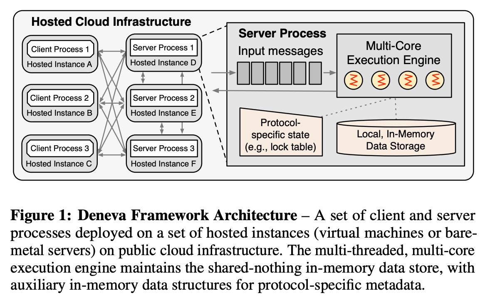
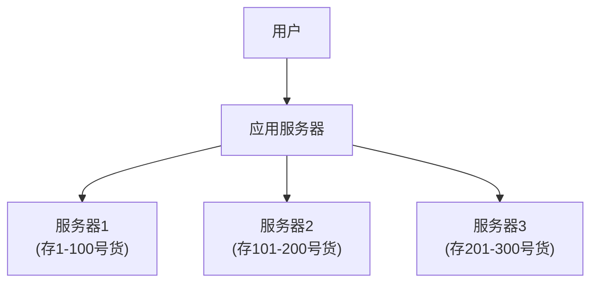
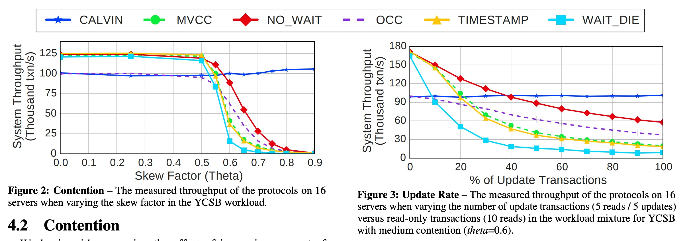
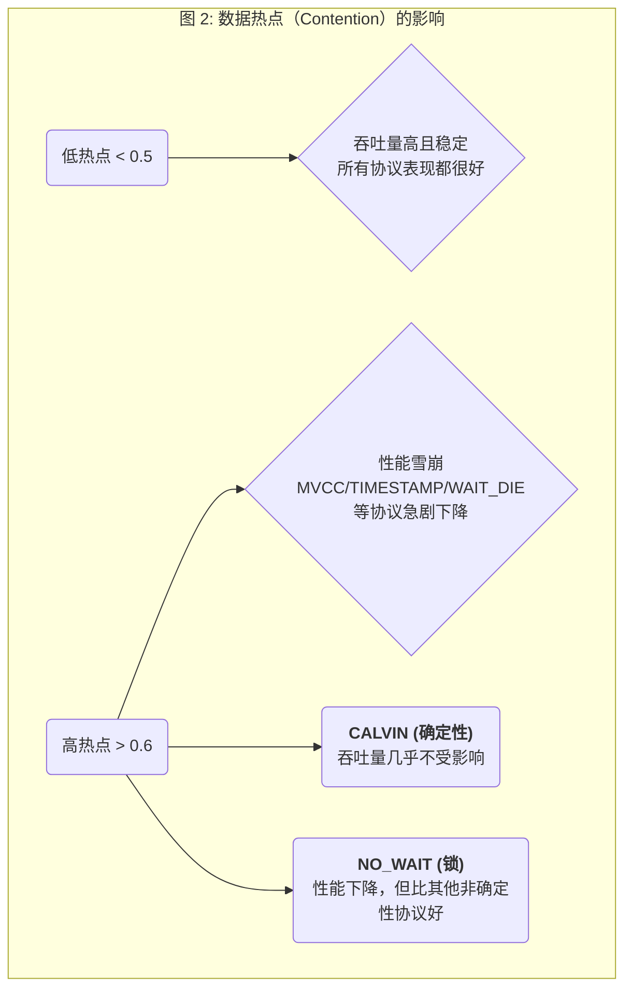
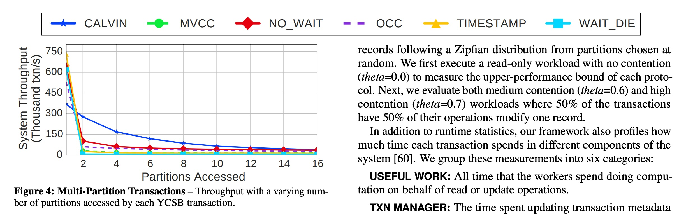
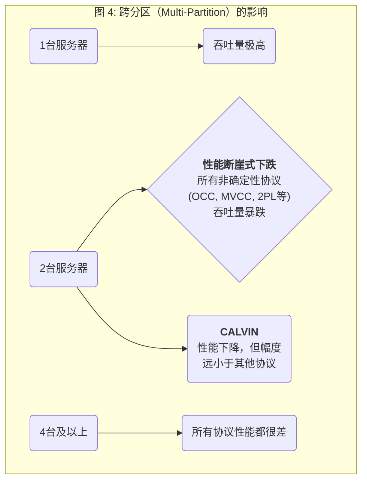
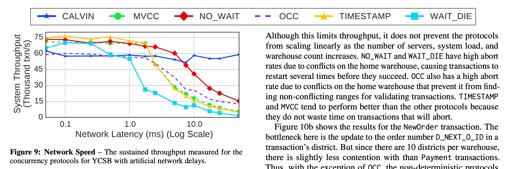
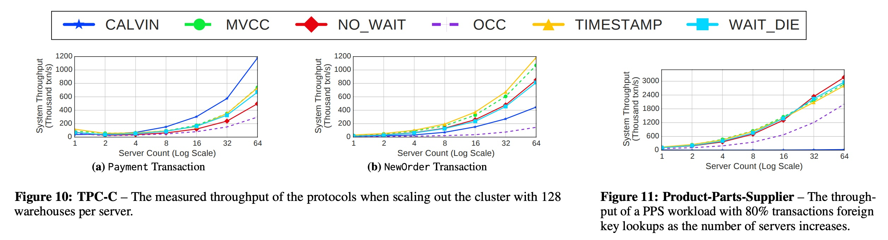

## AI论文解读 | An Evaluation of Distributed Concurrency Control
        
### 作者        
digoal        
        
### 日期        
2025-11-05        
        
### 标签        
PostgreSQL , PolarDB , DuckDB , AI , 论文解读        
        
----        
        
## 背景  
      
https://dl.acm.org/doi/pdf/10.14778/3055540.3055548        
  
提示:          
```          
读懂《An Evaluation of Distributed Concurrency Control》这篇论文需要提前掌握哪些基础知识, 请使用中文通熟易懂的讲解这些基础知识, 可以引用论文中的图、表或使用Markdown支持的图形(text,mermaid等)增加解释性. 
  
使用中文通熟易懂的解读《An Evaluation of Distributed Concurrency Control》这篇论文, 其中的关键内容请着重讲解, 可以引用论文中的图、表或使用Markdown支持的图形(text,mermaid等)增加解释性. 
  
提取《An Evaluation of Distributed Concurrency Control》这篇论文中的重要术语, 使用中文对这些术语进行通熟易懂的讲解, 可以引用论文中的图、表或使用Markdown支持的图形(text,mermaid等)增加解释性. 
```     
  
## 1 前置知识 
  
你好！这篇论文《An Evaluation of Distributed Concurrency Control》（分布式并发控制评估）是一篇非常经典的系统性评测论文。它深入探讨了在现代分布式数据库中，不同的事务并发控制方法到底表现如何。

要彻底读懂这篇论文，你需要一些数据库系统和分布式系统的基础知识。我来为你通俗易懂地讲解一下这些“前置知识点”。

-----

### 1\. 核心概念：数据库事务 (ACID)

在讨论“并发控制”之前，你首先要明白它控制的是什么：**事务 (Transaction)**。

你可以把事务想象成一个“工作单元”，它包含了一系列数据库操作（比如读取、写入数据）。这个工作单元必须是“要么全做完，要么全不做”的。

**例如**：银行转账。你从A账户转100元到B账户。
这个事务包含两个操作：

1.  A账户减100元。
2.  B账户加100元。

你绝不希望只发生了第1步（A被扣钱了），而第2步没发生（B没收到钱）。

为了保证这种操作的正确性，事务必须具有四个特性，合称 **ACID**：

  * **A - Atomicity (原子性):** 事务是原子的，要么全部成功，要么全部失败（回滚到初始状态）。
  * **C - Consistency (一致性):** 事务执行前后，数据库都处于“正确”的状态。比如，转账前后，A和B的总金额不变。
  * **I - Isolation (隔离性):** 这是本篇论文的核心。当多个事务同时运行时，它们不应该互相干扰。一个事务的执行不应该看到另一个事务“做到一半”的中间状态。
  * **D - Durability (持久性):** 事务一旦提交（完成），它对数据的更改就是永久的，即使系统崩溃也不会丢失。

这篇论文主要关注的就是 **I (隔离性)**。

### 2\. 为什么是“分布式”数据库？

论文开篇就提到，现在的数据量和查询量已经超出了单个服务器的处理能力 。

**怎么办？**
答案是：**分区 (Partitioning)**，也就是“分片”或“Sharding” 。

如下图（可类比论文中的图1），我们把数据分散到多台服务器上，每台服务器只负责一小部分数据。这就像一个大仓库的货太多，你开了好几个分仓库。





[图片来源: 论文图1  展示了类似的架构, 称为 "Shared-Nothing" (无共享) 架构, 每台服务器  都有自己的内存和数据 。]

  * **好处：** 如果一个事务只需要访问“服务器1”的数据，它就可以在那台服务器上独立完成，互不干扰，系统总吞吐量（处理能力）大大提高 。
  * **难题：** 如果一个事务需要**同时**访问“服务器1”和“服务器2”的数据（比如从10号货架拿东西，再存到150号货架），这就成了 **“跨分区事务” (Multi-Partition Transaction, MPT)** 。

这篇论文明确指出，正是这种跨分区事务限制了系统的扩展性和性能 。

### 3\. 关键难题：并发控制 (Concurrency Control)

现在，我们把“事务”和“分布式”组合起来看。

**并发控制 (Concurrency Control)** 就是一套规则，用来管理多个事务同时访问共享数据，同时又要保证 **隔离性**。

这篇论文追求的是最高隔离级别：**可串行化 (Serializable)** 。

  * **可串行化**：这是一种“完美”的隔离。它保证并发执行一群事务的结果，**等同于** 按照“某个顺序”一个一个排队执行它们的结果 。
  * **为什么难？** 既要保证“完美隔离”，又要让事务“并发”（一起跑），而不是真的“排队”（性能太差），这就是并发控制协议要解决的矛盾。

### 4\. 主流的并发控制“流派”

这篇论文评估了六种协议 ，它们基本代表了并发控制的几个主流“流派”（论文第3节详细介绍了它们）：

#### 流派一：悲观锁 (Pessimistic Locking)

  * **核心思想：** “先下手为强，先拿锁再说”。
  * **代表：** **两阶段锁定 (Two-Phase Locking, 2PL)** 。
  * **工作方式：**
    1.  事务要读写数据前，必须先获取该数据的“锁”。
    2.  读数据加“共享锁”（大家都能读），写数据加“排他锁”（只有我能写，别人读都不行）。
    3.  事务在完成所有操作之前，只能加锁（增长阶段），不能放锁 。
    4.  提交时，一次性释放所有锁（缩减阶段）。
  * **问题：** 可能会导致 **死锁 (Deadlock)** （A锁了1，要等2；B锁了2，要等1，互相卡住）。
  * **论文中的变种：**
      * **NO\_WAIT (不等待):** 拿不到锁就立刻失败（Abort），然后重试 。
      * **WAIT\_DIE (等待-死亡):** 老的事务（时间戳小）可以等；年轻的事务（时间戳大）拿不到锁，就得“死”（Abort）。

#### 流派二：时间戳排序 (Timestamp Ordering)

  * **核心思想：** “按辈分（时间戳）排队”。
  * **代表：** **TIMESTAMP**  和 **MVCC (多版本并发控制)** 。
  * **工作方式：**
      * 每个事务启动时，都会被分配一个唯一的时间戳 。
      * 所有操作都按时间戳顺序执行。如果一个“年轻”的事务想修改一个“年老”的事务已经读过的数据，它就会被拒绝（Abort）。
      * **MVCC (多版本)** 是其高级版：写操作不直接覆盖旧数据，而是创建一个“新版本”的数据 。这样，读操作可以去读它该读的“旧版本”，写操作可以安心写“新版本”，读写互不阻塞，性能很好 。

#### 流派三：乐观并发控制 (Optimistic - OCC)

  * **核心思想：** “先干活，提交时再检查”。它乐观地假设事务之间冲突很少 。
  * **代表：** **OCC** (基于 MaaT 协议) 。
  * **工作方式：**
    1.  **执行：** 事务自由读写，但所有修改都先写在自己的“小本本”（私有空间）上 。
    2.  **验证 (Validation)：** 事务准备提交时，系统会检查，在它执行期间，有没有其他“已提交”的事务修改了它读过的数据 。
    3.  **提交/中止：** 如果验证通过（没冲突），就把“小本本”上的修改正式写入数据库；如果验证失败（有冲突），就丢弃“小本本”，事务失败 。

#### 流派四：确定性协议 (Deterministic)

  * **核心思想：** “一切按剧本走”。
  * **代表：** **CALVIN** 。
  * **工作方式：**
    1.  它要求事务在执行前，必须**提前声明**它要读写哪些数据（即 Read/Write Set）。
    2.  有一个专门的 **“定序器” (Sequencer)**，像导演一样，先把所有事务排好一个全局唯一的顺序 。
    3.  所有服务器都严格按照这个“剧本”（顺序）来执行事务 。
  * **好处：** 因为顺序是提前定好的，执行时就不会有锁冲突，也不需要下面要讲的“两阶段提交”，延迟很低 。
  * **坏处：** 如果事务不能提前声明读写集（比如，事务的下一步操作依赖于上一步的读取结果），这个协议就很难用，需要昂贵的“侦察”步骤 。

### 5\. 分布式事务的“大管家”：两阶段提交 (2PC)

对于跨分区事务（MPT），如何保证 **原子性**（所有服务器要么都提交，要么都回滚）？

答案是 **两阶段提交 (Two-Phase Commit, 2PC)** 。

  * **协调者 (Coordinator):** 事务的发起节点 。
  * **参与者 (Participants):** 其他所有涉及的服务器 。

**工作方式：**

1.  **准备阶段 (Prepare Phase):**
      * 协调者问所有参与者：“你们能提交吗？” 。
      * 参与者执行事务，但**不真正提交**。如果能完成，就回复“准备好了”；如果不能，就回复“否” 。
2.  **提交阶段 (Commit Phase):**
      * **情况一：** 如果协调者**收到所有**参与者的“准备好了”，它就广播“全部提交！” 。参与者收到后，正式提交事务。
      * **情况二：** 如果协调者**有任何一个**没收到，或者收到“否”，它就广播“全部中止！” 。所有参与者回滚事务。

**2PC是分布式系统的主要性能瓶颈之一** ，因为它需要多轮网络通信，并且在第1阶段结束后，参与者会“锁住”资源等待协调者的最终决定 。

### 6\. 如何衡量“好坏”：性能基准

论文中用了大量图表（如图2-11）来对比性能，你需要理解它们衡量的指标：   

  * **吞吐量 (Throughput):** 系统每秒能完成多少事务（Txn/s）。越高越好 。
  * **延迟 (Latency):** 完成一个事务所需要的时间。越低越好。
  * **可扩展性 (Scalability):** 当增加服务器数量时（比如从8台加到16台），吞吐量能否随之线性增长 。

以及它们测试的“场景”（工作负载 Workloads ）：

  * **YCSB** ：一个简单的基准测试，用来模拟不同读写比例和数据访问的“热度”。
  * **数据倾斜 (Skew / Contention)** ：这是个关键变量。如果所有事务都访问同一个“热点”数据（高Contention），并发控制的压力就极大。
  * **TPC-C** ：模拟一个更真实的仓库订单处理系统，事务逻辑更复杂。

-----

### 总结：你需要掌握的知识图谱

要读懂这篇论文，你需要带着以下问题：

1.  **为什么需要并发控制？** (为了ACID中的**隔离性**)。
2.  **为什么并发控制在分布式下更难？** (因为有**分区**和**跨分区事务MPT**)。
3.  **如何保证MPT的原子性？** (通过 **2PC**，但它很慢)。
4.  **论文比较的是什么？** 是四种解决隔离性问题的“流派”：
      * **2PL** (悲观锁)
      * **MVCC/TS** (时间戳/多版本)
      * **OCC** (乐观锁)
      * **CALVIN** (确定性)
5.  **如何评判它们？** 看它们在不同**数据倾斜** (Contention) 和**跨分区**比例下，**吞吐量**和**可扩展性**的表现。

掌握了这些基础知识后，你再去看论文中的图表和分析，就会非常清晰了。你会看到作者是如何通过实验，揭示这些协议在不同场景下的性能瓶颈（比如2PL在高冲突下不行，CALVIN在特定负载下很强，但2PC是普遍的瓶颈等）。
  
## 2 解读论文 
  
这是一篇非常出色的数据库评测论文，它清晰地揭示了为什么“分布式事务”是现代数据库系统扩展性的一大难题。

我来为你用最通俗易懂的方式，结合论文中的图表，解读这篇论文的核心内容。

### 论文的核心目标：一场公平的“PK”

随着数据量暴增，我们不得不把数据分散（分区）到多台服务器上 。当一个操作（事务）只需要访问一台服务器时，一切都很快 ；但只要一个事务需要**跨服务器**操作，性能就可能急剧下降 。

市面上有很多解决这个问题的“并发控制协议”，比如锁（Locking）、时间戳（Timestamp）、乐观（OCC）等，每种都说自己好 。

**这篇论文的核心目的**：就是搭建一个**绝对公平**的测试平台（名叫 Deneva），把这些主流协议拉到同一个“擂台”上，用相同的标准（ workload）进行一场“苹果对苹果”的比较 ，看看谁是“真英雄”，谁在“吹牛”。

-----

### 参赛选手（六大协议）

论文评估了六种协议，它们基本代表了四大学派 ：

1.  **悲观锁 (2PL - Two-Phase Locking)** 

      * **理念**：“先下手为强”。事务在操作数据前必须先“加锁”。
      * **变种1 (NO\_WAIT)**：拿不到锁？立刻失败（Abort），然后重试 。
      * **变种2 (WAIT\_DIE)**：“论资排辈”。老事务可以等新事务释放锁；新事务如果遇到老事务的锁，就必须“去死”（Abort）。

2.  **时间戳 (Timestamp Ordering)**

      * **理念**：“按时间戳排队”。
      * **变种1 (TIMESTAMP)**：每个事务有个时间戳，必须按顺序处理 。
      * **变种2 (MVCC - 多版本)**：读写分离。写操作会创建数据的新版本，读操作去读旧版本，互不干扰 。

3.  **乐观锁 (OCC - Optimistic)** 

      * **理念**：“先干活，提交时再检查”。它假设冲突很少，事务只在自己的“小本本”上修改，到提交时才检查别人动过它的数据没有。如果没动，就提交；如果动了，就失败重试 。

4.  **确定性 (Deterministic)**

      * **理念**：“一切按剧本走”。
      * **变种1 (CALVIN)**：这是个“异类”。它要求事务在执行前，必须先声明要读写哪些数据 。然后一个“全局定序器”会像导演一样，先把所有事务的执行顺序（剧本）排好 。所有服务器严格按这个剧本演，因为顺序已定，所以执行时不再需要复杂的协调。

-----

### 隐藏的“大反派”：两阶段提交 (2PC)

除了 CALVIN，其他所有协议在处理“跨服务器”的**更新事务**时，都必须使用一个叫 **“两阶段提交” (2PC)** 的技术来保证原子性（要么都成功，要么都失败）。

2PC 是性能的主要杀手，因为它需要多轮网络通信来“投票”和“确认”。

-----

### 关键发现：性能到底差在哪？

作者通过各种实验（调整数据热度、读写比例、跨分区比例），得出了几个核心结论：

#### 发现一：数据“热点”是非确定性协议的噩梦 (图 2)

**“数据热点”** （论文中叫 Contention 或 Skew）指的是大量事务集中访问极少数的几条数据。

**图 2 解读**：    

  * **X轴**：数据倾斜度 (Skew Factor)。0.0 表示数据访问很均匀；0.9 表示所有人都集中访问极少数“热点”数据。
  * **Y轴**：系统吞吐量（越高越好）。




  * **结论**：在低冲突时，大家表现都很好 。一旦出现数据“热点”，所有需要“等待”或“排队”的协议（如 MVCC, WAIT\_DIE）性能都会雪崩 。
  * **CALVIN** 像个“怪才”，由于它提前排好了剧本，根本不在乎热点，性能几乎不受影响 。
  * **NO\_WAIT** 表现突出，它“快刀斩乱麻”，发现冲突就立刻失败重试，在高冲突下反而比那些“拖拖拉拉”的协议（如 WAIT\_DIE）效率更高 。

#### 发现二：从“单机”到“跨服务器”的性能悬崖 (图 4)

**“跨分区事务”** （Multi-Partition Transaction）指的是一个事务需要访问多台服务器。

**图 4 解读**：  

  * **X轴**：一个事务访问的服务器（分区）数量。
  * **Y轴**：系统吞吐量。




  * **结论**：这是论文中最惊人的发现之一。对于除 CALVIN 外的所有协议，**性能的灾难发生在从 1 台服务器变为 2 台时** 。
  * **为什么？** 因为从 1 到 2，触发了万恶的 **2PC (两阶段提交)** 。这证明了 2PC 和网络通信是导致性能下降的元凶。

#### 发现三：网络延迟是 2PC 协议的“紧箍咒” (图 9)

如果服务器不在一个机房，而在不同城市（WAN，广域网），网络延迟会变高。

**图 9 解读**：    

  * **X轴**：网络延迟（毫秒，对数坐标）。

  * **Y轴**：系统吞吐量。

  * **结论**：随着网络延迟增加（哪怕只是从1ms增加到10ms），所有使用 2PC 的协议（NO\_WAIT, OCC, MVCC等）性能再次暴跌 。

  * 而 **CALVIN** 在这个特定测试中（YCSB），因为不需要 2PC，所以完全不受网络延迟影响，稳如一条直线 。

#### 发现四：CALVIN 的“阿喀琉斯之踵” (图 11)

看了前面，你可能觉得 CALVIN 是“YYDS”（永远的神）。但它有一个致命弱点：**它要求事务提前知道自己要读写什么** 。

如果事务逻辑很复杂，比如“我要先查 A，根据 A 的结果，再去查 B”，CALVIN 就傻眼了。它必须先跑一个昂贵的“侦察” (Reconnaissance) 步骤去猜 B 是什么 。

**图 11 (PPS 负载) 解读**：    
在一个包含这种“外键查询”的 PPS 负载中 ：

  * **所有其他协议**（NO\_WAIT, MVCC 等）都表现出良好的**可扩展性**（随着服务器增多，吞吐量线性增长）。

  * **CALVIN** 的吞吐量**彻底“躺平”** ，在所有服务器规模上都是一条几乎为 0 的直线 。

  * **结论**：CALVIN 的“确定性”是一把双刃剑。在简单的（如 YCSB）高冲突负载下，它无敌；但在复杂、依赖查询结果的真实负载（如 PPS）下，它会因为“侦察”和“剧本失效”（侦察的数据被别人改了）而彻底崩溃 。

-----

### 论文的最终结论

1.  **没有银弹**：不存在“最好”的协议。所有协议在可扩展性上都面临严峻的挑战 。
2.  **两大瓶颈**：分布式事务的真正瓶颈是：
      * **数据热点 (Contention)** 
      * **提交协议 (2PC)** 
3.  **不同场景的选择**：
      * **高热点、简单事务**：CALVIN（确定性）是最好的选择 。
      * **高更新率、中等热点**：NO\_WAIT（不等待锁）表现最佳 。
      * **复杂事务（如外键查询）** ：CALVIN 表现最差 ，其他协议（如 NO\_WAIT, MVCC）反而能很好地扩展 。

最终，作者们认为，要真正实现可扩展的分布式事务，未来必须要在三个方向努力：**更好的网络硬件**、**更智能的数据建模**（从应用层面避免跨分区），以及**新的编程模型**（不再强求完美的序列化）。
  
## 3 术语 
  
这篇论文《An Evaluation of Distributed Concurrency Control》是一篇经典的“横向评测”论文。它通过一个自研的公平测试框架（Deneva），对当今主流的分布式事务并发控制协议进行了一场“大比武”。

以下是解读这篇论文必须掌握的重要术语，我将用通俗易懂的中文为您讲解：

---

### 1. 核心场景与问题

#### 🔹 OLTP (联机事务处理)
* **通俗讲解**：指的是那些需要快速、高频次处理的“小事务” 。最典型的例子就是电商下单、银行转账或抢票 。
* **论文中的意义**：这是本文所有协议的目标应用场景 。

#### 🔹 Partitioning (分区 / 分片)
* **通俗讲解**：因为数据量太大，一台服务器存不下或处理不过来，所以就把数据“切”成很多片，分散到不同的服务器上 。这篇论文的 Deneva 框架就是一个“无共享”（Shared-Nothing）系统，每台服务器只管自己的那一“片”数据 。
* **论文中的意义**：分区是实现高吞吐量的基础 ，但它也带来了下一个难题。

#### 🔹 MPT (Multi-Partition Transaction - 跨分区事务)
* **通俗讲解**：指的是一个事务需要访问（读取或修改） **多台**服务器上的数据 。比如，一个银行转账，A 账户在服务器1，B 账户在服务器2，这个转账就是一个 MPT。
* **论文中的意义**：**这是论文要解决的核心难题**。作者指出，正是 MPT 限制了系统的扩展性和性能 。
* **相关图表**：**图 4 (Figure 4)**  非常震撼地展示了 MPT 的代价。所有协议（除了 CALVIN）在事务从访问1个分区变成访问2个分区时，吞吐量（性能）都出现了“断崖式”下跌 。    

#### 🔹 Concurrency Control (并发控制)
* **通俗讲解**：“并发”就是很多事务同时在跑。“控制”就是管理这些事务，确保它们在同时访问共享数据时不会出错（比如数据算错了、丢失了更新）。
* **论文中的意义**：这是本文的主题 。数据库管理系统 (DBMS) 通过并发控制协议来获取最大的并行性，同时保证数据的正确性 。

#### 🔹 Serializable (可串行化)
* **通俗讲解**：这是并发控制的“最高理想” 。它向应用保证，不管有多少事务在并发执行，最终的结果**等同于**把这些事务一个一个排队（按某种顺序）执行的结果 。
* **论文中的意义**：本文只研究和评估那些能提供“可串行化”保证的协议 。

---

### 2. 参赛的并发控制协议（“流派”）

这篇论文评估了六种协议，可以归为以下几大“流派”：

#### 🔹 Two-Phase Locking (2PL - 两阶段锁定)
* **通俗讲解**：这是一个“悲观”的协议 。它认为冲突很可能发生，所以事务在操作数据前，必须先“加锁” 。
* **论文中的变种**：
    * **NO_WAIT (不等待)**：如果拿不到锁，事务**立刻失败**并中止 (Abort) 。这避免了死锁 。
    * **WAIT_DIE (等待-死亡)**：试图减少不必要的失败。它使用时间戳来决定谁该等 。如果是“老”事务（时间戳小）遇到“新”事务的锁，它可以等 。反之，“新”事务必须“死”（Abort）。

#### 🔹 Timestamp Ordering (TS - 时间戳排序)
* **通俗讲解**：依赖时间戳来排序事务 。它通过中止那些“插队”（时间戳顺序不对）的事务来避免死锁 。
* **MVCC (多版本并发控制)**：这是时间戳的一种高级形式。它不直接覆盖数据，而是为数据保留**多个“版本”** （副本）。
    * **好处**：读操作（Read）可以去读旧版本，写操作（Write）可以创建新版本，读和写互不阻塞，冲突大大减少 。

#### 🔹 Optimistic (OCC - 乐观并发控制)
* **通俗讲解**：这是一个“乐观”的协议 。它假设冲突很少发生。
    1.  **执行**：事务先在自己的“小本本”（私有空间）上随意读写，不加锁 。
    2.  **验证**：当事务要提交时，它必须去检查在它执行期间，有没有其他事务修改了它“看”过或“写”过的数据 。
    3.  **提交/中止**：如果验证通过（没冲突），就正式提交；如果失败，就中止 (Abort) 。

#### 🔹 Deterministic (确定性协议) / CALVIN
* **通俗讲解**：这是一个“异类”，它采取“确定性调度” 。
    1.  **“排剧本”** ：它要求事务在执行前，必须**提前声明**要读写哪些数据 。
    2.  **“定序”** ：一个全局的“定序器”(Sequencer) 会像导演一样，先把所有事务的执行顺序排成一个唯一的“剧本” 。
    3.  **“演戏”** ：所有服务器都严格按照这个“剧本”顺序执行。
* **好处**：因为剧本是提前定好的，执行时**没有冲突**，也**不需要 2PC**（见下文）。
* **坏处**：如果事务的逻辑很复杂（比如，下一步操作依赖上一步的读取结果），“排剧本”就变得极其困难和昂贵 。**图 11 (Figure 11)** 就展示了 CALVIN 在这种复杂负载下性能“躺平”的灾难性后果 。     

---

### 3. 关键的“性能杀手”

#### 🔹 Two-Phase Commit (2PC - 两阶段提交)
* **通俗讲解**：这是解决“原子性”问题的协议，确保 MPT 在所有服务器上“要么都成功，要么都失败” 。
    1.  **准备阶段（投票）** ：协调者问所有参与者：“你们能提交吗？” 。
    2.  **提交阶段（拍板）** ：如果所有人都说“能”，协调者就说“大家提交！”；只要有一个人说“不能”，协调者就说“大家回滚！” 。
* **论文中的意义**：**这是分布式事务的主要性能瓶颈之一** 。除了 CALVIN，其他所有协议在 MPT 更新时都必须用它 。它需要多轮网络通信，并且在通信期间必须“锁住”资源 。

#### 🔹 Contention / Skew (数据冲突 / 倾斜)
* **通俗讲解**：“Contention”指的是多个事务试图同时访问**同一个数据** 。“Skew”（倾斜）是导致这种冲突的原因，比如秒杀场景下，所有人都去抢同一个商品，这就是“高倾斜”或“高冲突” 。
* **论文中的意义**：这是衡量协议性能的关键变量。
* **相关图表**：**图 2 (Figure 2)**  完美地展示了这一点。     
    * 在**低冲突** (Theta < 0.5) 时，所有协议性能都很好 。
    * 在**高冲突** (Theta > 0.6) 时，大部分协议（如 MVCC, WAIT_DIE）的性能都“雪崩”了 。
    * 此时，**CALVIN**（确定性）和 **NO_WAIT**（锁）表现最好 。

---

### 4. 衡量指标

* **Throughput (吞吐量)**：衡量性能的核心指标。指的是系统**每秒能成功完成多少个事务** (txn/s) 。
* **Workload (工作负载)**：指用来测试的“考卷”。
    * **YCSB**：一个简单的“考卷”，可以方便地调整读写比例和数据倾斜度（Contention）。
    * **TPC-C**：一个模拟真实仓库订单系统的“复杂考卷” 。
    * **PPS**：一个有“外键查询”（依赖型查询）的“考卷”，专门用来测试 CALVIN 的短板 。
  
## 参考        
         
https://dl.acm.org/doi/pdf/10.14778/3055540.3055548    
        
<b> 以上内容基于DeepSeek、Qwen、Gemini及诸多AI生成, 轻微人工调整, 感谢杭州深度求索人工智能、阿里云、Google等公司. </b>        
        
<b> AI 生成的内容请自行辨别正确性, 当然也多了些许踩坑的乐趣, 毕竟冒险是每个男人的天性.  </b>        
    
#### [期望 PostgreSQL|开源PolarDB 增加什么功能?](https://github.com/digoal/blog/issues/76 "269ac3d1c492e938c0191101c7238216")
  
  
#### [PolarDB 开源数据库](https://openpolardb.com/home "57258f76c37864c6e6d23383d05714ea")
  
  
#### [PolarDB 学习图谱](https://www.aliyun.com/database/openpolardb/activity "8642f60e04ed0c814bf9cb9677976bd4")
  
  
#### [PostgreSQL 解决方案集合](../201706/20170601_02.md "40cff096e9ed7122c512b35d8561d9c8")
  
  
#### [德哥 / digoal's Github - 公益是一辈子的事.](https://github.com/digoal/blog/blob/master/README.md "22709685feb7cab07d30f30387f0a9ae")
  
  
#### [About 德哥](https://github.com/digoal/blog/blob/master/me/readme.md "a37735981e7704886ffd590565582dd0")
  
  

  
