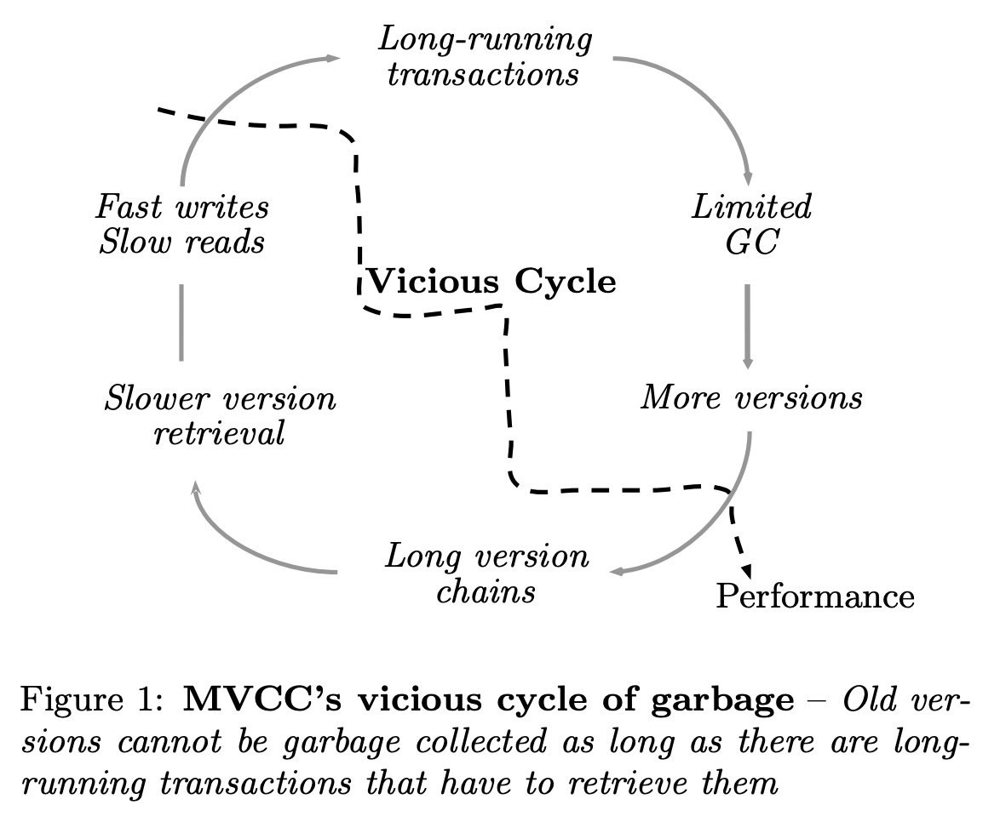
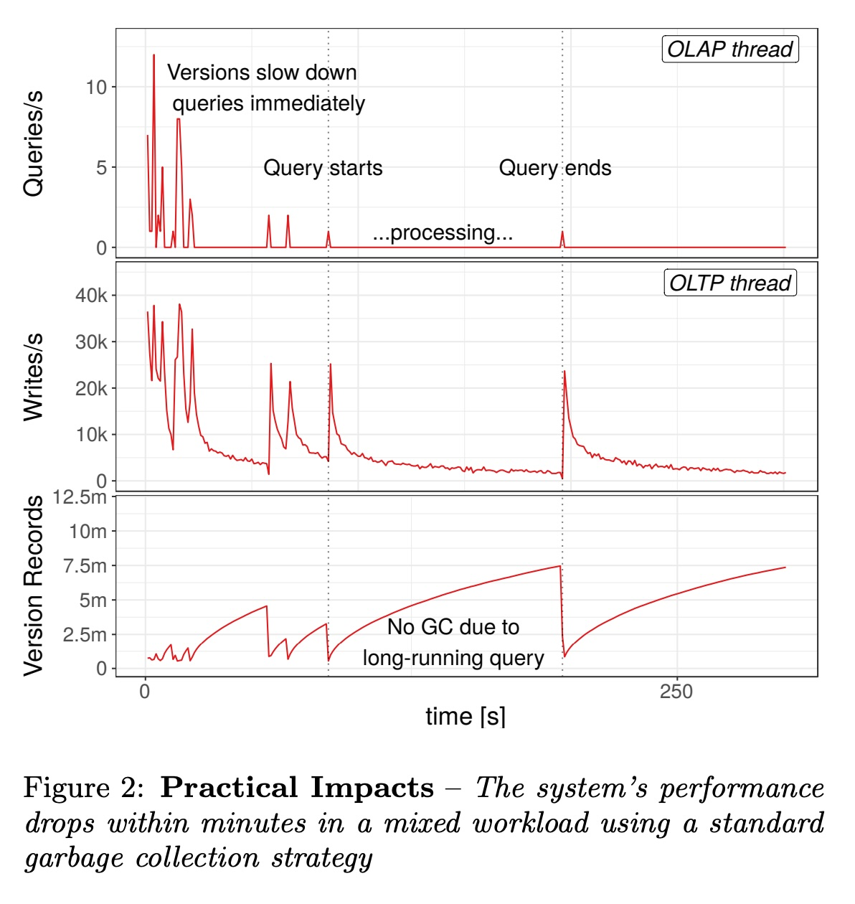
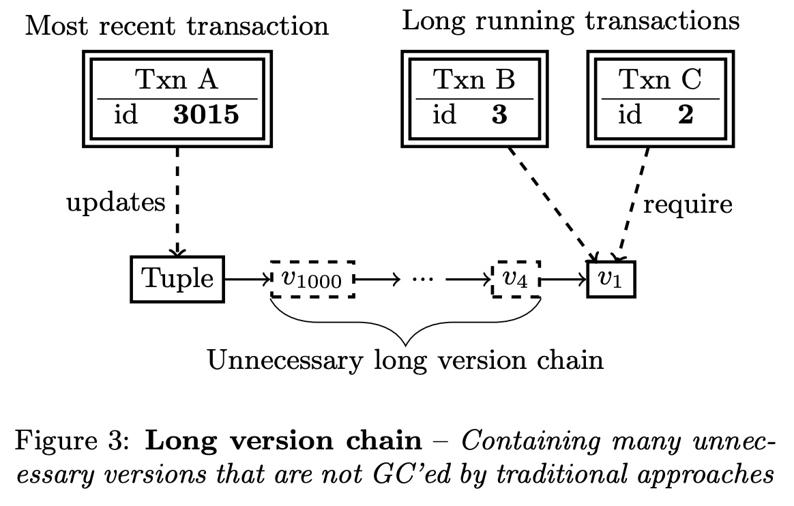
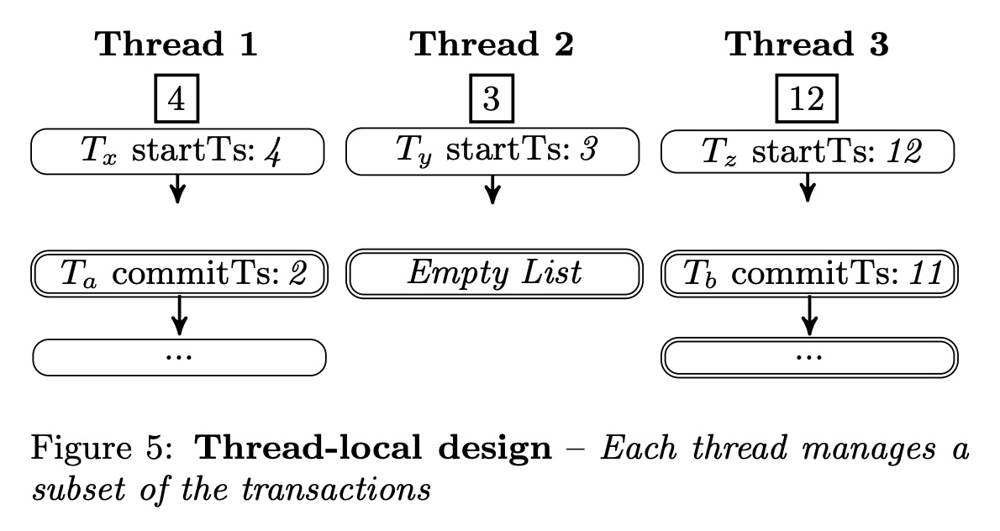
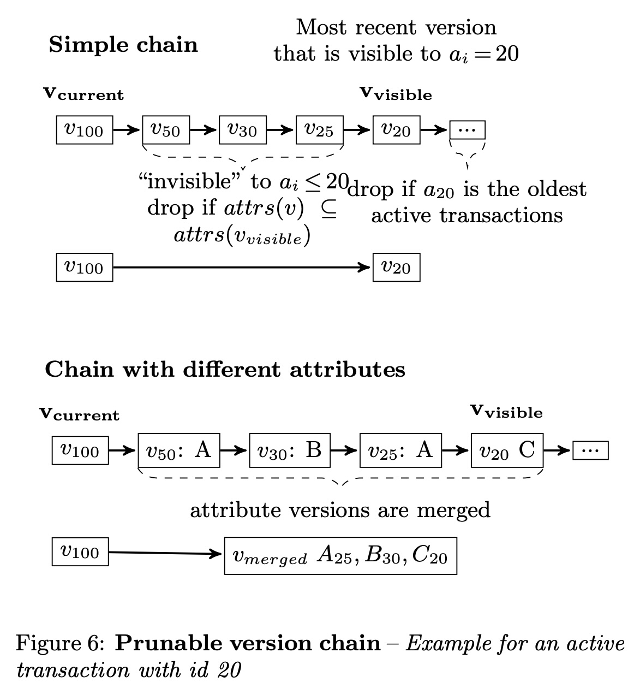
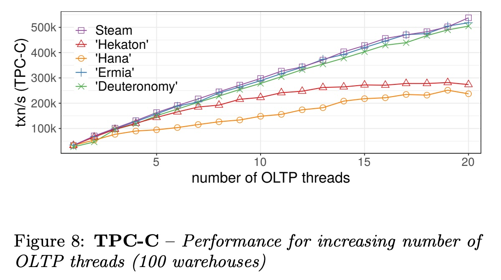
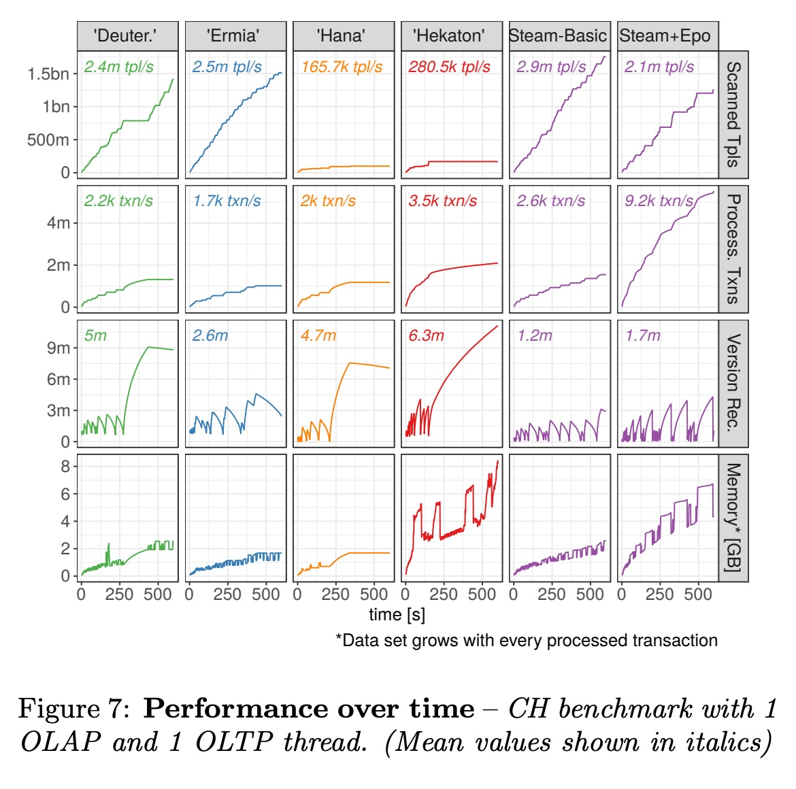
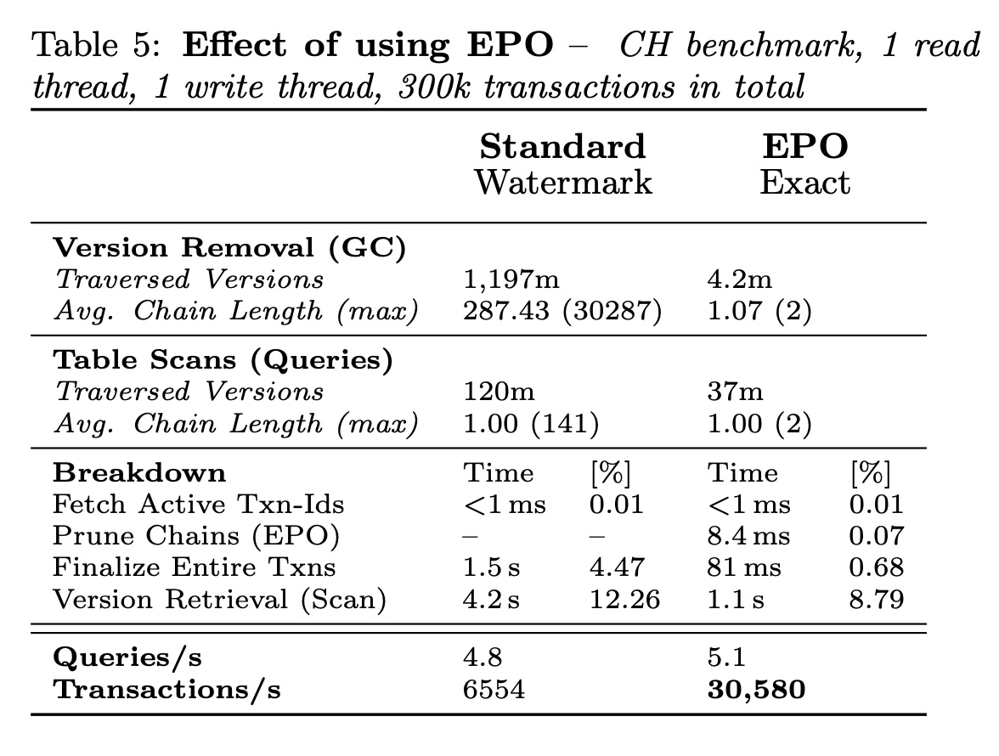
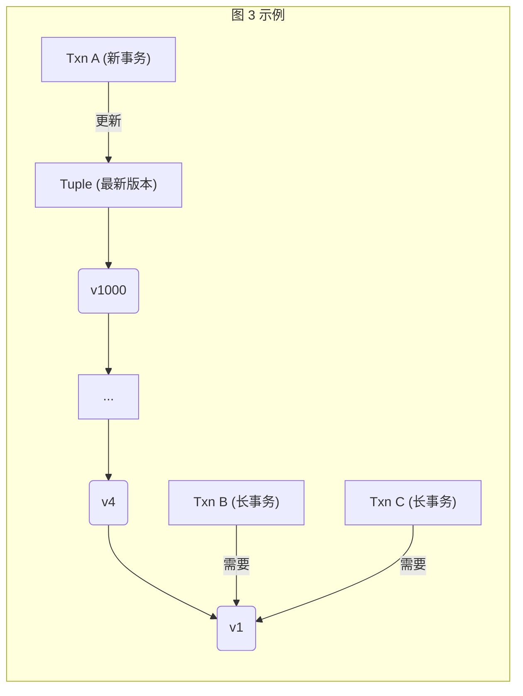

## AI论文解读 | Scalable Garbage Collection for In-Memory MVCC Systems
        
### 作者        
digoal        
        
### 日期        
2025-11-05        
        
### 标签        
PostgreSQL , PolarDB , DuckDB , AI , 论文解读        
        
----        
        
## 背景  
      
https://dl.acm.org/doi/pdf/10.14778/3364324.3364328        
  
提示:          
```          
读懂《Scalable Garbage Collection for In-Memory MVCC Systems》这篇论文需要提前掌握哪些基础知识, 请使用中文通熟易懂的讲解这些基础知识, 可以引用论文中的图、表或使用Markdown支持的图形(text,mermaid等)增加解释性. 
  
使用中文通熟易懂的解读《Scalable Garbage Collection for In-Memory MVCC Systems》这篇论文, 其中的关键内容请着重讲解, 可以引用论文中的图、表或使用Markdown支持的图形(text,mermaid等)增加解释性. 
  
提取《Scalable Garbage Collection for In-Memory MVCC Systems》这篇论文中的重要术语, 使用中文对这些术语进行通熟易懂的讲解, 可以引用论文中的图、表或使用Markdown支持的图形(text,mermaid等)增加解释性. 
```     
  
## 1 前置知识 
  
要读懂这篇《Scalable Garbage Collection for In-Memory MVCC Systems》论文，您需要先掌握一些关于数据库管理系统（DBMS）的基础知识。这篇论文主要探讨的是一个高性能数据库中的“垃圾回收”问题。

通俗地说，这篇论文在解决一个什么问题呢？
想象一下，一个繁忙的在线商城（比如淘宝或亚马逊）在“双十一”期间，数据库系统需要同时做两件完全不同的事：
1.  **处理交易 (OLTP):** 每秒钟有成千上万的人在下单、付款。这些是**短促、快速的写入**操作。
2.  **数据分析 (OLAP):** 老板在后台不停地刷新一个“实时战报”大屏，想看过去1小时的销售总额。这是一个**漫长、复杂的读取**操作。

这篇论文的核心，就是研究如何让这两件事同时高效运行，而不会互相“卡死”。它重点关注的是在这个过程中产生的“数据垃圾”是如何拖慢整个系统的，并提出了一个更聪明的“打扫”方法。

以下是您需要了解的核心基础知识：

---

### 1. 数据库事务与并发控制 (Transaction & Concurrency Control)

* **事务 (Transaction):** 简单来说，就是一个“要么全做，要么全不做”的操作包。比如“转账”，必须包含“A账户减钱”和“B账户加钱”两个步骤，这两个步骤必须同时成功或同时失败。这是保证数据一致性的基础。
* **并发 (Concurrency):** 指的是数据库在同一时间接待“多个客户”（即多个事务）。比如A在买东西，B在查订单，C在看报表。
* **并发控制 (Concurrency Control):** 当多个“客户”同时操作数据时，必须有一种机制来防止他们互相干扰，比如A和B同时抢购最后一件商品。并发控制就是要确保数据不错乱，最常见的属性是 **“隔离性” (Isolation)**。

### 2. 核心概念：什么是 MVCC？ (Multi-Version Concurrency Control)

这是理解这篇论文**最关键**的概念。

**MVCC（多版本并发控制）** 是一种主流的并发控制技术。它解决并发问题的方法非常巧妙： **“写”不覆盖，“读”不阻塞。**

* **传统方法（如“锁”）：** 当A在修改某行数据时（比如修改库存），会把这行“锁”住。此时B想读取这行数据，就必须排队等着A改完、解锁。如果A的操作很慢，B就会被卡住。
* **MVCC 的方法：** 当A修改库存时，它**不会在旧数据上直接修改**，而是**创建一个新版本**的数据 。
    * 旧版本（库存100）被保留。
    * 新版本（库存99）被创建。

这样一来：
* **写者 (Writer, 如A)：** 愉快地在“新版本”上工作 。
* **读者 (Reader, 如B)：** 也不用等待。如果B在A修改*之前*就开始查询了，B会被导向去读取“旧版本”（库存100）。

这就好比用 Git 或 SVN 来管理代码：你提交 (commit) 了一个新版本，但旧的版本历史依然存在。不同的开发者可以检出 (checkout) 不同的版本来工作，互不干扰。

### 3. 混合负载：OLTP 与 OLAP (HTAP)

如开头所说，数据库需要处理两种截然不同的工作 ：

* **OLTP (Online Transaction Processing, 联机事务处理):**
    * **特点：** 短、快、简单。
    * **例子：** 下单、付款、查库存。
    * **对 MVCC 的影响：** 频繁创建**新版本**的数据。
* **OLAP (Online Analytical Processing, 联机分析处理):**
    * **特点：** 长、慢、复杂。
    * **例子：** 统计过去1个月的销售额、分析用户购买习惯。
    * **对 MVCC 的影响：** 需要读取**非常旧**的数据版本（因为它需要一个“一致的快照”来看这1个月的全部数据）。

这篇论文的背景是 **HTAP (Hybrid Transactional/Analytical Processing)**，也就是一个系统要同时处理这两种负载 。

### 4. MVCC 的“垃圾”与“垃圾回收” (MVCC's "Garbage" & "GC")

这是论文要解决的核心问题。

* **什么是“垃圾” (Garbage)？**
    在 MVCC 中，随着数据不断被修改，系统里会堆积大量的“旧版本” 。当一个旧版本（比如v1） **确定** 再也不会有任何事务（包括那个很慢的OLAP查询）需要读取它时，它就成了“垃圾” 。

* **为什么“垃圾”是坏事？**
    1.  **占用内存：** 这篇论文讨论的是“In-Memory”（内存）数据库，内存寸土寸金。
    2.  **拖慢读取：** 当一个事务需要某个数据时，它可能要从最新版本开始，沿着一个“版本链”（Version Chain）一路找下去，直到找到它需要的那个旧版本。如果这个链条因为堆满了垃圾而变得非常长（比如 `v100 -> v99 -> ... -> v2 -> v1`），查询就会变得奇慢无比 。

* **什么是“垃圾回收” (GC)？**
    GC 就是数据库系统里的一种“保洁”机制，它的工作就是找出并**清理**掉这些不再需要的旧版本 。

### 5. 性能瓶颈：“恶性循环” (The "Vicious Cycle")

这是论文的出发点。论文的 **Figure 1** 完美地解释了为什么在 HTAP 负载下，传统的 GC 会崩溃。

  

这个“恶性循环”是这样发生的 ：

1.  **启动慢查询 (Long-running transactions)** 
    一个OLAP分析任务（比如“统计1小时数据”）开始了。这个任务声明：“我需要看到1小时前那个时间点的数据快照”。
2.  **GC被限制 (Limited GC)** 
    “保洁工”(GC) 一看，"哦，有个慢查询还需要那些很旧的版本，那我暂时不能删它们" 。
3.  **版本堆积 (More versions / Fast writes)** 
    与此同时，OLTP 交易（“双十一”下单）还在疯狂涌入，每秒都在产生成千上万的**新版本**。
4.  **版本链变长 (Long version chains)** 
    由于 GC 不能清理，旧版本越堆越多，导致数据的“版本链”变得极长。
5.  **查询更慢 (Slower version retrieval / Slow reads)** 
    那个慢查询（OLAP）在读取数据时，发现自己要遍历一个超级长的版本链才能找到它想要的旧数据，于是它变得**更慢了**。
6.  **循环加剧**
    因为它变得更慢，所以它“霸占”旧版本的时间也更长，导致 GC 被限制的时间也更长，堆积的版本更多……系统性能雪崩 。

### 6. 可伸缩性与同步 (Scalability & Synchronization)

* **可伸缩性 (Scalable):** 指的是“大力出奇迹”的能力。当你的服务器从8核升级到64核时，你希望数据库的性能也能相应地提升（比如8倍）。
* **瓶颈（同步）：** 很多传统的 GC 方法在“打扫”时，需要一个“全局锁”（Global Mutex/Latch）。这就好像一个保洁团队，在打扫前必须所有人先开会同步一下“哪些能扔，哪些不能扔”。在64核的机器上，64个“工人”（线程）可能大部分时间都在排队等这个会开完，而不是在干活。这就是“全局争用”（Contention）。

---

### 总结：你需要看懂什么

当您阅读这篇论文时，您会看到作者提出了一个名为 **"Steam"** 的新 GC 方案 。

带着以上的基础知识，您就能理解 "Steam" 试图解决的核心问题：
* 它如何**打破 Figure 1 的恶性循环**？（提示：它采用了一种更“精确”和“积极”的清理方式，叫 Eager Pruning，即不等慢查询结束，就先把“版本链”中间那些肯定用不到的版本给清理掉）。    
* 它如何实现**可伸缩性**？（提示：它避免了“全局锁”，采用了“线程本地”（Thread-Local）的设计，让每个工人（线程）自己管好自己的一亩三分地，不需要频繁开大会）。

希望这份指南对您有所帮助！您希望我更详细地解释 MVCC 的工作原理，或是那个“恶性循环”吗？
  
## 2 解读论文 
  
这是一篇关于数据库“垃圾回收”（Garbage Collection, GC）的非常重要的论文。它解决了一个在现代数据库中普遍存在且极为棘手的性能瓶颈问题。

用一句话总结这篇论文：
**这篇论文提出了一个名为 "Steam" 的新型垃圾回收器，它通过“积极地、精准地”在数据被写入时就“顺手”清理掉无用数据，并采用无锁（latch-free）设计，从而解决了传统GC在处理混合型业务（HTAP）时，因长时间分析任务（长事务）卡住所导致的“恶性循环”和性能雪崩问题。**

为了彻底理解它，我们来分解一下这篇论文的关键内容：

---

### 1. 核心问题：MVCC 的“恶性循环” (Vicious Cycle)

要读懂这篇论文，首先要理解什么是 **MVCC（多版本并发控制）** 。

* **MVCC 是什么？**
    想象一下你和同事在编辑同一份在线文档。当你开始编辑时，系统不会让你“锁定”整个文档，而是为你创建了一个“版本”。当你保存时，你就创建了一个“新版本” 。其他人可以同时在他们自己的“旧版本”上阅读，互不干扰 。这就是MVCC，它的核心思想是 **“写操作不阻塞读操作”** 。

* **“垃圾”是怎么来的？**
    随着不断地更新（保存新版本），系统里会堆积大量“旧版本” 。当一个“旧版本”确定再也不会被任何事务所需要时，它就成了“垃圾数据”（Garbage），需要被回收（GC）以释放内存 。

* **“恶性循环”是什么？ (论文的出发点)**
    这篇论文的核心洞察在 **Figure 1**  中得到了完美展示。这个问题在 **HTAP（混合事务和分析处理）** 负载下尤为突出 ——也就是系统需要**同时**处理：    
    1.  **OLTP：** 大量、短促的交易（如：电商下单）。
    2.  **OLAP：** 少量、漫长的分析（如：老板在看本季度的销售报表）。

    

    这个“恶性循环”是这样发生的 ：

    1.  **[启动] 长时间运行的事务 (Long-running transactions)**
        一个OLAP报表查询开始了 。它需要一个“一致性的快照”，比如说，它需要看到1小时前的数据状态。
    2.  **[导致] 有限的 GC (Limited GC)**
        “垃圾回收器”（GC）发现这个OLAP查询还“活着”，它可能会需要那些很旧的数据版本，因此GC**不能**清理这些旧版本 。
    3.  **[导致] 更多的版本 (More versions)**
        与此同时，OLTP（电商下单）还在疯狂写入，每秒都在产生成千上万的**新版本** 。
    4.  **[导致] 更长的版本链 (Long version chains)**
        由于GC被阻塞，旧版本无法清理，导致数据上的“版本链”变得极长（比如一个库存数据被改了1万次，就有1万个版本串在一起）。
    5.  **[导致] 更慢的版本检索 (Slower version retrieval)**
        那个OLAP查询在读取数据时，被迫要遍历这个超级长的版本链才能找到它想要的那个“1小时前”的旧版本 。
    6.  **[导致] 查询更慢，循环加剧**
        这导致OLAP查询变得**更慢** ，它“活着”的时间更长，于是它阻塞GC的时间也更长……系统性能就这样陷入了恶性循环，最终崩溃 。

    论文的 **Figure 2**  在真实系统中复现了这一灾难：   
    * `OLAP thread`（顶部图）：查询（Queries/s）很快就降到0，表示被卡住了 。
    * `Version Records`（底部图）：版本记录数呈现出“**鲨鱼鳍**”形状 。在OLAP查询期间（No GC due to long-running query ），版本（垃圾）疯狂堆积；OLAP查询一结束，GC开始疯狂清理，导致系统卡顿（表现为 `OLTP thread` 的写入也掉底）。

---

### 2. 传统GC为何失效：粗糙的“水位线” (High Watermark)

传统GC（包括文中的 HyPer、Hekaton 等）之所以会陷入恶性循环，是因为它们大多采用一种“高水位线”(High Watermark) 的方式来判断垃圾 。

* **什么是“高水位线”？**
    这个“水位线”就是**当前所有“活着”的事务中，启动最早的那个事务的ID** 。GC只能清理那些**早于**这个“水位线”的旧版本 。
* **问题在哪？**
    一旦那个OLAP（长事务）启动，这个“水位线”就**卡住不动了** 。
* **Figure 3**  完美展示了这个缺陷：    
    * 假设系统里有三个事务：`Txn A` (最新的写入, id 3015) , `Txn B` (id 3) , `Txn C` (id 2, **最老的事务**) 。
    * `Txn C` 需要版本 `v1` 。`Txn B` 需要版本 `v4` 。
    * 由于最老的 `Txn C` 存在，“高水位线”就被卡在 `id=2`。
    * GC只能清理 `v1` 之前的数据（如果有的话）。
    * `Txn A` 此时写入了第1000个版本 `v1000` 。
    * **关键缺陷**：从 `v4` 到 `v1000` 之间的所有版本（比如 `v5` 到 `v999`），**实际上已经没有任何事务需要了**，它们是“不必要的长版本链” (Unnecessary long version chain) 。
    * 但传统GC因为“水位线”卡在 `id=2`，所以**无法清理**它们 。这就是它“粗糙” (coarse-grained)  的地方。

---

### 3. 解决方案：“Steam” GC

为了解决上述所有问题，论文提出了 **Steam** 。Steam有两大关键创新：

#### 关键创新一：可伸缩的同步机制（解决扩展性瓶颈）

* **问题：** 传统GC需要一个“全局事务列表”来查找谁是最老的事务 。在高并发下（比如64核CPU），所有线程（Worker）都要去抢一个“全局锁”(Global Mutex) 来操作这个列表，导致严重排队和争抢 。
* **Steam的方案：线程本地化 (Thread-Local)** 
    Steam完全取消了全局列表 。
    * 如 **Figure 5**  所示，每个线程（Thread 1, 2, 3）只维护**自己**的“活动事务列表” 。    
    * 每个线程把自己本地的“最早事务ID”（Local Minimum）暴露出来（比如 Thread 1 是 4, Thread 2 是 3, Thread 3 是 12）。
    * 当一个线程需要知道“全局最早ID”（即水位线）时，它只需要去**读取**所有其他线程暴露的那个ID（4, 3, 12），然后取最小值（3）即可 。
    * 这个过程**不需要任何锁** (latch-free) ，扩展性极强。

#### 关键创新二：积极的版本修剪 (EPO - Eager Pruning) (解决恶性循环)

这是 Steam 的“杀手锏”，它彻底解决了“高水位线”的粗糙问题 。

* **EPO 是什么？**
    Steam 不再只看那个“最老的ID”，而是会定期获取一个**包含“所有”活动事务ID的列表**（比如 `[id=2, id=3]`）。
* **何时清理？——“积极地”(Eagerly)**
    它不是等垃圾堆积如山了再启动一个后台线程去扫  (HANA的做法)，而是在**每次“写入”新版本时**（即版本链要变长时），就“顺手”清理一下 。
* **如何清理？——“精准地”(Precisely)**
    在写入新版本（如 `v1001`）时，它会拿着那个活动列表 `[id=2, id=3]` 回溯版本链，然后**把所有不在这个列表里（即任何活动事务都不需要）的“中间版本”给摘除掉** 。
* **Figure 6**  解释了这个过程：    
    * 假设现在只有一个活动事务 `ai`，它的ID是 20 。
    * 版本链是 `v100 -> v50 -> v30 -> v25 -> v20`。
    * 算法发现 `ai=20` 需要的是 `v20` 。
    * 那么 `v50`, `v30`, `v25` 这几个版本对于 `ai` 来说是“不可见的”(invisible) 。
    * EPO会**直接把这三个版本从链上摘除**，让 `v100` 直接指向 `v20` 。
* **效果：**
    1.  **几乎“免费”：** 这个清理工作是“捎带手”做的 (piggybacking) 。因为写入新版本时，线程**本来就锁住**了这条链，所以清理工作不会产生额外的锁争用 。
    2.  **打破循环：** 版本链**永远不会变长** 。它的最大长度被限制在“活动事务的数量”，而不是“更新的总次数” 。
    3.  **拯救读取：** 当那个OLAP（长事务）来读取时，它面对的是一条被“修剪”得干干净净的短链，检索速度极快。

---

### 4. 实验效果：Steam 到底有多强？

论文通过实验数据证明了 Steam 的压倒性优势：

1.  **可伸缩性 (Figure 8, TPC-C)**     
    * 在纯OLTP（只有短事务）的场景下，Steam（绿色方块）的性能随着线程数增加（1到20核）几乎是线性增长的 。
    * 而 'Hana' (橙色) 因为全局锁很快就上不去了 。'Hekaton' (红色) 也因为后台GC的协调而受限 。
    * **证明：** 关键创新一（线程本地）是有效的。

2.  **混合负载 (Figure 7, CH Benchmark)**     
    * 这是对“恶性循环”的终极考验。
    * 看 `Processed Txns`（处理的事务数）这一行：`Steam+Epo`（即开启了EPO）每秒处理 **9.2k** 事务 。
    * 第二名的 `Steam-Basic`（没开EPO）只有 2.6k 。其他系统（'Hekaton', 'Hana'）更是惨不忍睹（280.5 t/s, 185.7 t/s）。
    * 再看 `Version Rec.`（版本记录数）这一行：'Hekaton' 和 'Hana' 的“鲨鱼鳍”都冲到了 8-9 百万 。而 `Steam+Epo` 的版本数被完美压制在 1.7m 左右 ，并且清理（下降沿）极其迅速 。
    * **证明：** 关键创新二（EPO）彻底打破了“恶性循环”。
 
3.  **EPO 效果的“双重对比” (Table 5)**     
    这可能是最震撼的数据。作者对比了 **只用 Steam**（但不开EPO，即传统水位线）和 **Steam+EPO** 的区别：
    * **最大版本链长度：** 30,287（不开EPO） vs. **2**（开了EPO）。EPO把一条三万多版本的链缩短到了只有2个版本！
    * **总GC耗时：** 1.5 秒（不开EPO） vs. **81 毫秒**（开了EPO）。
    * **惊人结论：** 看似更“彻底”、更“积极”的清理（EPO），实际花费的**总时间反而更少** 。因为它从根源上阻止了垃圾的堆积。
    * **最终性能（吞吐率）：** 6,554 txn/s（不开EPO） vs. **30,580 txn/s**（开了EPO）。性能提升了近5倍 。

### 总结

这篇论文的贡献是巨大的。它精准地指出了 MVCC 数据库在 HTAP 负载下的核心痛点 —— **“长事务阻塞导致版本堆积”的恶性循环** —— 并提出了一套完整且高效的解决方案 Steam：
1.  **用“线程本地化”设计  解决了可伸缩性问题。**
2.  **用“积极精准修剪”(EPO)  解决了恶性循环问题。**

它证明了 GC 不是一个可以事后弥补的“保洁”工作，而是一个必须深度集成到事务处理流程中的核心组件 。

希望这份解读对您有帮助！您是否想了解更多关于EPO（积极修剪）的具体算法细节？
  
## 3 术语 
  
根据这篇论文《Scalable Garbage Collection for In-Memory MVCC Systems》, 以下是其中一些核心术语的通俗易懂的中文讲解。

-----

### 1\. MVCC (Multi-Version Concurrency Control) - 多版本并发控制

**通俗讲解：**
想象一下你和同事在同时编辑一篇共享文档。

  * **没有 MVCC (例如, 锁定)：** 当你开始编辑时, 文档被“锁定”, 你的同事必须等你保存并退出后才能打开。这很慢, 而且效率低下。
  * **有了 MVCC：** 当你开始编辑时, 系统会为你创建一个文档的“快照” (snapshot) 。与此同时, 你的同事更新了这篇文档, 系统不会修改你正在看的内容, 而是会**创建一个新版本** 。

MVCC 的核心思想是“读”和“写”互不阻塞 。读取者 (读者) 看到的是他们开始时的数据快照, 而写入者 (作者) 则创建新版本的数据。

**带来的问题：** 这种机制会产生大量的“旧版本” (outdated tuple versions) 。这些旧版本最终需要被清理, 这就是“垃圾回收” (GC) 的工作。

-----

### 2\. HTAP (Hybrid Transaction and Analytical Processing) - 混合事务和分析处理

**通俗讲解：**
HTAP 指的是数据库需要同时处理两种截然不同的工作负载 ：

  * **OLTP (联机事务处理)：** 短小、快速的事务。例如, 网上购物下单、银行转账。这要求“快写” (Fast writes) 。
  * **OLAP (联机分析处理)：** 庞大、复杂的查询。例如, 生成本季度的销售总报告、分析用户行为。这通常是“慢读” (Slow reads)  或 **“长事务” (Long-running transactions)** 。

**带来的问题：** 在 HTAP 场景下, 一个长事务 (OLAP 报告) 正在运行时, 大量的短事务 (OLTP 订单) 仍在快速产生新版本。这对垃圾回收 (GC) 造成了巨大挑战 。

-----

### 3\. Version Chain (版本链)

**通俗讲解：**
当数据库中的某一行数据 (称为 "Tuple") 被反复更新时, MVCC 会将其所有的旧版本链接在一起, 形成一个“版本链” 。

论文中的图 3  很好地展示了这一点：    



  * 最新的事务 (Txn A) 访问最新的数据 。
  * 而很早启动的长事务 (Txn B 和 Txn C) 则需要访问非常旧的版本 (v1) 。
  * 为了找到 `v1`, 事务 B 和 C 必须从最新的版本开始, 沿着链条一路回溯, 遍历整条链 。

-----

### 4\. The Vicious Cycle (恶性循环)

**通俗讲解：**
这是论文的核心论点, 描述了 MVCC 系统在 HTAP 负载下如何陷入性能崩溃 。

我们可以使用论文中的**图 1**  来解释这个循环：    

1.  **长事务 (Long-running transactions)** ：一个 OLAP 分析查询（慢读）开始了。
2.  **受限的 GC (Limited GC)** ：垃圾回收器 (GC) 不敢删除旧版本, 因为这个长事务“可能”会需要它们 。
3.  **更多版本 (More versions)** ：在长事务运行期间, OLTP 事务（快写）仍在疯狂地产生新版本 。
4.  **长版本链 (Long version chains)** ：由于 GC 无法清理, 版本链变得越来越长 。
5.  **版本检索变慢 (Slower version retrieval)** ：长事务 (OLAP) 为了找到它需要的那个旧版本, 必须遍历这条超长的链, 导致它变得**更慢** 。
6.  **循环加强**：因为长事务变得更慢了, 它会**更久**地阻止 GC 清理 (回到步骤 2), 导致版本链**更长** (回到步骤 4), 系统性能最终崩溃 。

-----

### 5\. High Watermark (高水位线)

**通俗讲解：**
这是一种传统、简单但“粗粒度” (coarse-grained)  的 GC 策略。

  * **工作方式：** GC 会记录当前所有活动事务中, **启动时间最早的那个事务**。这个最早的时间戳就是“高水位线” 。
  * **清理规则：** GC 认为, 任何在“高水位线” **之前** 提交的版本都是安全的垃圾, 可以被回收 。
  * **带来的问题：** 只要有一个长事务在运行, 这个“高水位线”就无法前进, 导致**所有** GC 工作都被卡住 。

-----

### 6\. In-between versions (中间版本)

**通俗讲解：**
“高水位线”策略最大的问题, 就是它无法清理“中间版本” 。

回到 **图 3** 的例子 ：`Tuple -> v1000 -> ... -> v4 -> v1`    

  * 长事务 B 和 C 需要 `v1` 。
  * “高水位线”被定在 `v1` 之前, 保护了 `v1`。
  * 但是, 这也导致了 `v4`、`v5` ... 一直到 `v1000` 这些版本**也全被保留了** 。
  * 事实上, **没有任何事务需要** `v4` 到 `v1000` 这些版本。它们就是“不必要的中间版本” (unnecessary in-between versions) , 它们白白占用了内存, 并拖慢了需要 `v1` 的事务 。

-----

### 7\. EPO (Eager Pruning of Obsolete Versions) - 积极版本修剪

**通俗讲解：**
这是本论文提出的核心解决方案, 一种更“细粒度” (fine-grained)  的 GC 方法。

  * **工作方式：** EPO 不再只看“最早的”那个事务 (高水位线), 而是会维护一个**所有**活动事务的列表 。
  * **修剪时机：** 它不是等待后台线程来清理, 而是在**每次更新、插入新版本时**, 就“积极地” (Eagerly) 检查版本链 。
  * **修剪规则：** 它会遍历版本链, 凡是发现不在任何一个活动事务“需要列表”上的“中间版本”, 就立刻将其从链中删除 (修剪) 。

**论文中的图 6**  展示了 EPO 的效果：    

> **原始链：** `v100 -> v50 -> v30 -> v25 -> v20`  
>  
> 假设当前唯一的长事务只需要 `v20` 。  
>  
> **EPO 操作：** EPO 会在添加 `v100` (或更晚版本) 时检查该链, 发现 `v50`, `v30`, `v25` 对所有活动事务都“不可见” (invisible) 。  
>  
> **结果：** 它会立刻将这些中间版本删除, 版本链被瞬间压缩为：`v100 -> v20` 。  

通过这种方式, EPO 确保了版本链**永远不会**变得比活动事务的数量更长, 从根本上解决了“恶性循环”。

-----

### 8\. Thread-local (线程本地)

**通俗讲解：**
这是论文提出的用于提升 GC **可扩展性** (scalability) 的关键技术。

  * **传统问题：** 传统的 GC 必须使用一个“全局事务列表” (global transaction lists)  和“全局锁” (global mutex)  来确定“高水位线”。在多核 CPU 上, 所有线程都去抢这把锁, 导致严重的性能瓶颈 。
  * **Steam 的方案 (Thread-local)：** 如 **图 5**  所示, Steam 让每个 CPU 核心 (线程) 只管理自己的“本地事务列表” 。    
  * **好处：** 线程之间不需要昂贵的全局同步 。每个线程只需要暴露它自己的“本地最早时间戳” (如 4, 3, 12) 。其他线程只需读取这些值即可算出全局最早时间, 避免了全局锁, 从而实现了高可扩展性 。
  
## 参考        
         
https://dl.acm.org/doi/pdf/10.14778/3364324.3364328    
        
<b> 以上内容基于DeepSeek、Qwen、Gemini及诸多AI生成, 轻微人工调整, 感谢杭州深度求索人工智能、阿里云、Google等公司. </b>        
        
<b> AI 生成的内容请自行辨别正确性, 当然也多了些许踩坑的乐趣, 毕竟冒险是每个男人的天性.  </b>        
    
#### [期望 PostgreSQL|开源PolarDB 增加什么功能?](https://github.com/digoal/blog/issues/76 "269ac3d1c492e938c0191101c7238216")
  
  
#### [PolarDB 开源数据库](https://openpolardb.com/home "57258f76c37864c6e6d23383d05714ea")
  
  
#### [PolarDB 学习图谱](https://www.aliyun.com/database/openpolardb/activity "8642f60e04ed0c814bf9cb9677976bd4")
  
  
#### [PostgreSQL 解决方案集合](../201706/20170601_02.md "40cff096e9ed7122c512b35d8561d9c8")
  
  
#### [德哥 / digoal's Github - 公益是一辈子的事.](https://github.com/digoal/blog/blob/master/README.md "22709685feb7cab07d30f30387f0a9ae")
  
  
#### [About 德哥](https://github.com/digoal/blog/blob/master/me/readme.md "a37735981e7704886ffd590565582dd0")
  
  

  
