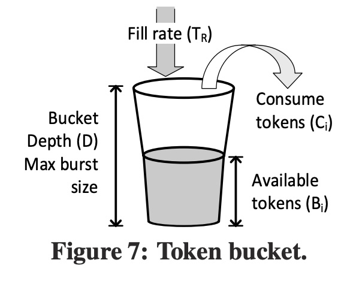
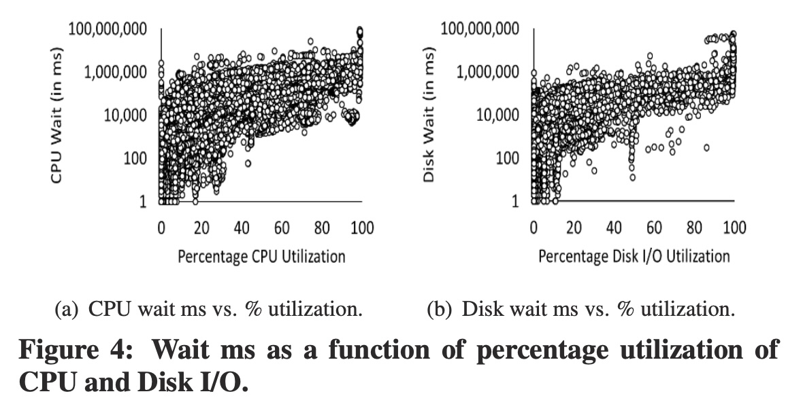
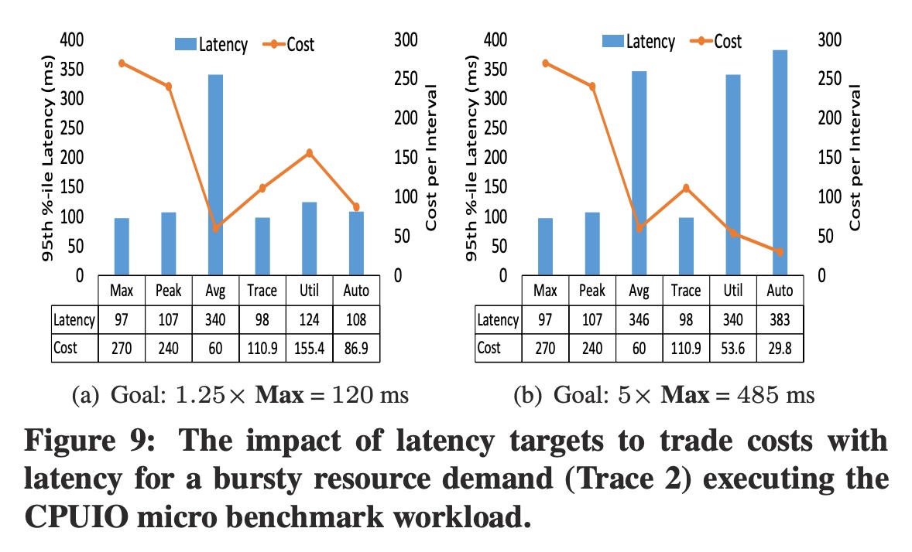
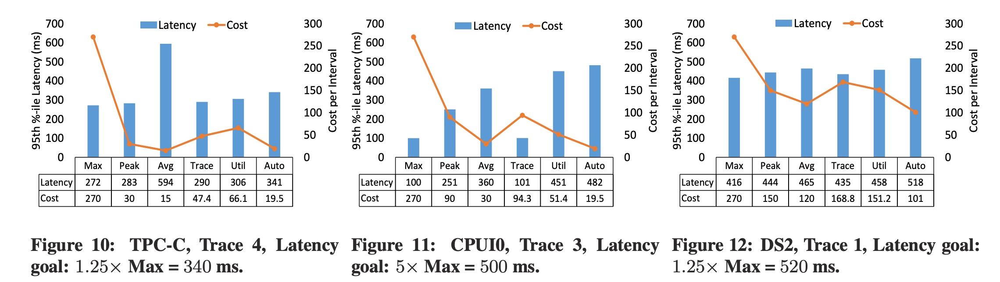
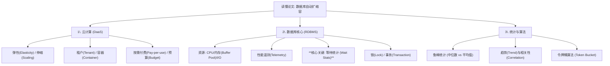
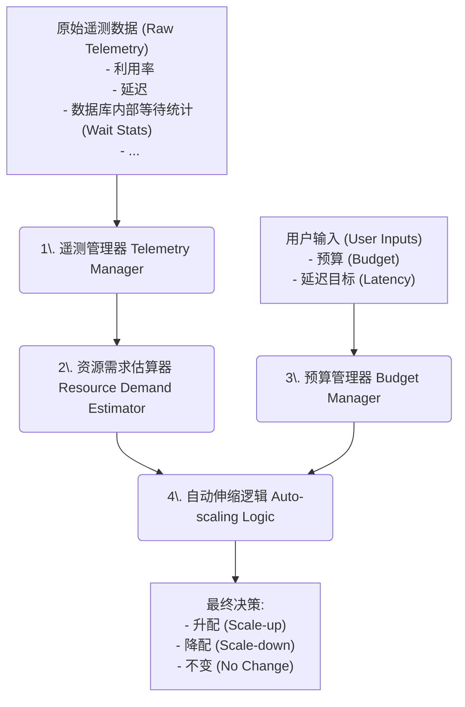
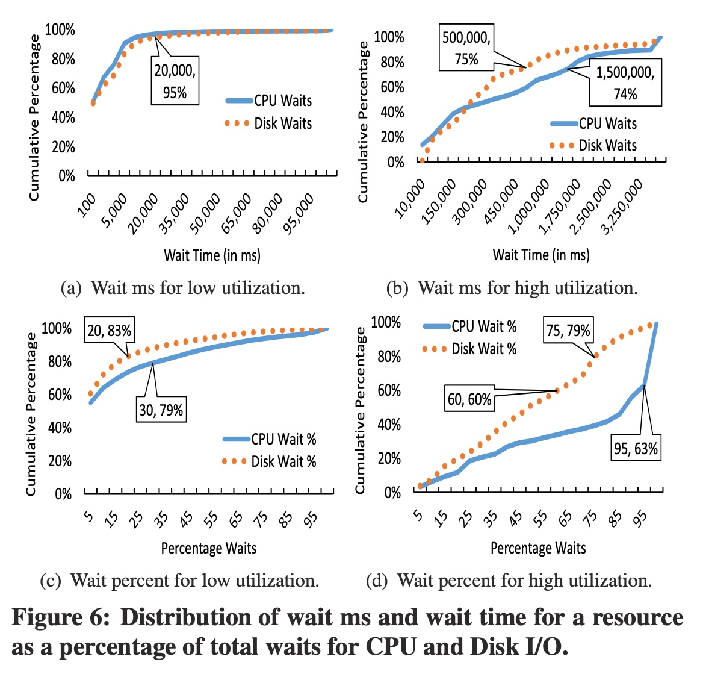
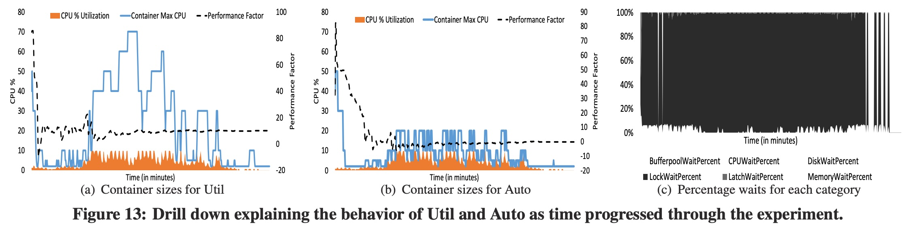
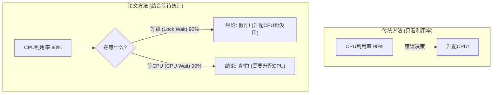

## AI论文解读 | Automated Demand-driven Resource Scaling in Relational Database-as-a-Service
        
### 作者        
digoal        
        
### 日期        
2025-11-05        
        
### 标签        
PostgreSQL , PolarDB , DuckDB , AI , 论文解读        
        
----        
        
## 背景  
      
https://dl.acm.org/doi/pdf/10.1145/2882903.2903733        
  
提示:          
```          
读懂《Automated Demand-driven Resource Scaling in Relational Database-as-a-Service》这篇论文需要提前掌握哪些基础知识, 请使用中文通熟易懂的讲解这些基础知识, 可以引用论文中的图、表或使用Markdown支持的图形(text,mermaid等)增加解释性. 
  
使用中文通熟易懂的解读《Automated Demand-driven Resource Scaling in Relational Database-as-a-Service》这篇论文, 其中的关键内容请着重讲解, 可以引用论文中的图、表或使用Markdown支持的图形(text,mermaid等)增加解释性. 
  
提取《Automated Demand-driven Resource Scaling in Relational Database-as-a-Service》这篇论文中的重要术语, 使用中文对这些术语进行通熟易懂的讲解, 可以引用论文中的图、表或使用Markdown支持的图形(text,mermaid等)增加解释性. 
```     
  
## 1 前置知识 
  
这是一篇非常经典的关于云数据库弹性伸缩的论文。要完全读懂它，你需要一些跨领域的知识，但别担心，我会用最通俗易懂的语言为你讲解。

简单来说，这篇论文在解决一个核心问题：**云数据库（DaaS）应该如何“自动挡”地调整服务器配置（比如CPU、内存），才能既让用户的程序跑得快，又让用户花钱最少？** 

以下是你需要提前掌握的基础知识：

### 1\. ☁️ 核心概念：云计算与 "数据库即服务" (DaaS)

想象一下，你不用自己买电脑主机，而是从云服务商那里“租”一台。

  * **“即服务” (as-a-Service):** 你按时付费，服务商保证这台电脑（服务）能用。这篇论文里，你租的是一个“数据库服务”（DaaS） 。
  * **租户 (Tenant):** 就是你，使用服务的客户 。
  * **资源容器 (Resource Container):** 这是服务商给你的“套餐” 。比如“套餐A”提供1核CPU、2GB内存；“套餐B”提供2核CPU、4GB内存。套餐B更贵 。
  * **弹性 (Elasticity):** 云计算最大的好处。你可以随时把“套餐A”换成“套餐B”（这叫**Scale-Up，纵向扩展**），或者换回来（Scale-Down） 。

**这篇论文要解决的痛点：**
你（租户）必须自己决定何时换套餐 。这太难了！

  * 选了“套餐B”（大配置），但你平时只用到了10%的性能，这叫**过度配置 (Over-provisioning)**，纯属浪费钱 。
  * 选了“套餐A”（小配置），但访问高峰期来了，数据库卡爆，这叫**配置不足 (Under-provisioning)**，影响业务 。

这篇论文的目标，就是做一个“智能的自动换挡系统”，代替你来做这个“升降套餐”的决定 。

### 2\. 🗄️ 关键知识：数据库 (RDBMS) 是如何工作的？

这是理解这篇论文**最最关键**的部分。论文的核心论点是：**只看“资源利用率”来决定是否升配，是远远不够的！** 

我用一个 **“厨房配菜”** 的例子来解释：

  * **数据库系统** = 1个厨师（CPU）。
  * **任务** = 100个炒菜订单（Queries）。
  * **资源利用率 (Utilization)** = 厨师有多忙。

**传统自动伸缩（错误的做法）：**
系统发现“CPU利用率95%”（厨师忙得团团转），于是立刻决定“升配”——再加一个厨师（Scale-Up CPU）。

**这篇论文的洞察（正确思路）：**
厨师真的很忙吗？还是他在“**等待**”？
系统应该分析 **“等待统计” (Wait Statistics)** 。

我们去厨房后台一看，发现厨师虽然满头大汗（高利用率），但他90%的时间都在**等待**，比如：

1.  **等待I/O (磁盘读写):** “等仓库送土豆过来！”（数据库在等磁盘把数据读到内存）。
2.  **等待锁 (Lock):** “等另一个厨师用完那口唯一的炒锅！”（数据库在等另一个任务释放对某行数据的锁定）。
3.  **等待内存 (Memory):** "等桌子（内存）腾出地方放新菜！" 

**结论：**
如果厨师是在“等土豆”（I/O瓶颈），你再加一个厨师（CPU）根本没用！ 这就是传统方法的**致命缺陷**。

这篇论文的系统（叫"Auto"）会智能地分析这些“等待信号”，找出真正的瓶颈 。

### 3\. 📊 必备常识：统计学与算法

别担心，不是复杂的数学，而是几个基本思想。

  * **“鲁棒” (Robust) 的统计：**
    系统在收集“厨师忙不忙”这类数据时，会遇到“噪音” 。比如，突然来了一个超级大单，导致CPU瞬间100%，但马上又恢复了。

      * **平均值 (Average):** 很容易被这个“超级大单”（异常值）带偏 。
      * **中位数 (Median):** 更“鲁棒”，它会忽略这种极端情况，告诉你“平常”有多忙 。
        论文的系统大量使用中位数这类鲁棒统计，来避免被“噪音”误导 。

  * **“令牌桶” (Token Bucket) 算法：**
    这是用来管理“**预算 (Budget)**”的 。

      * 用户可以设定：“我这个月数据库总花费不能超过100元。” 
      * 系统要决定：这100元怎么在30天里“智能”地花？
      * **令牌桶**  就像一个存钱罐（见论文图7 ）：    
        1.  系统每天（或每小时）自动往罐里放2元钱（**Fill rate**，基础预算）。
        2.  罐子最多只能装30元（**Bucket Depth**，应对突发情况的最大额度）。
        3.  平时低谷期，只花1元，罐里就会攒下钱 。
        4.  高峰期来了，系统发现需要“升配”到5元的套餐，它一看罐里有钱，就敢花这个钱，保证了性能 。
        5.  如果罐子空了，系统就算知道升配能提速，也会为了“不超预算”而忍住不升配 。

### 4\. 📈 如何看懂论文中的图表？

掌握了以上知识，你就能看懂论文里的图了。

**关键图表：Figure 4 **    
这张图是论文的**核心论据**。

  * **它在说什么？** 它把“资源利用率”（横轴）和“等待时间”（纵轴）画在了一起。
  * **怎么看？**
      * 看横轴（Utilization）在80%\~100%（即高利用率）的地方。
      * 你会发现对应的“等待时间”（纵轴） **非常分散** 。
      * 有些点的等待时间很低（比如100ms），有些则高得离谱（比如1,000,000ms）。
  * **图的结论（Aha\! Moment）：**
    这证明了 **“高利用率 ≠ 高等待（高需求）”** 。光看利用率（横轴）你根本猜不到它到底需不需要升配（因为纵轴的值不确定）。**因此，必须同时看“等待时间”这个信号！**

**结果图：Figure 9, 10, 11, 12**      
这些图是“比武大会”的结果。

  * **比什么？** 论文的方案（**Auto**） vs. 传统方案（比如**Util**，只看利用率） vs. 静态方案（比如**Peak**，一直用最高配置）。
  * **怎么看？**
      * **柱状图（Latency，延迟）：** 越低越好（代表程序跑得快）。
      * **折线图（Cost，成本）：** 越低越好（代表花钱少）。
  * **结论：**
    你会发现，**Auto** 方案（蓝绿色的柱子）总是能在“延迟”（柱子）和“成本”（折线）之间取得最佳平衡。它通常和“一直用最高配置”（Peak）的延迟差不多（柱子一样低），但成本（折线）却低得多 。

### 总结：你需要的基础知识地图

为了帮你梳理，我用代码画一个知识地图：



希望这个解释能帮你轻松读懂这篇论文！

你希望我详细解释一下他们是如何使用“等待统计”来构建“决策逻辑”（Decision Logic）的吗？
  
## 2 解读论文 
  
这是一篇关于 **云数据库（DaaS）** 如何实现“**智能自动挡**”的经典论文。

想象一下，你从云服务商那里租了一个数据库。你该租多大的服务器呢？

  * **租个小的 (S号)**：便宜，但万一“双十一”来了，网站瞬间卡死，这叫**配置不足 (Under-provisioning)** 。
  * **租个大的 (XL号)**：保险，但“双十一”一年才一次，剩下364天服务器都在“摸鱼”，你却在付全款，这叫**过度配置 (Over-provisioning)** 。

云的“弹性” 本应让你能随时换“S号”和“XL号”，但这“换挡”的活儿（称为**自动伸缩 Auto-scaling**），目前太“傻”了 。

这篇论文的核心工作，就是解决这个“傻”的问题，**打造一个真正智能、省钱、又高效的数据库“自动换挡”系统** 。

-----

### 论文的“灵魂拷问”：忙，真的等于需要更多资源吗？

这是理解本论文的**最关键概念**。

目前“傻”的自动伸缩系统，逻辑很简单：

> “我检测到你服务器的CPU利用率 (Utilization) 达到90%了，你一定很忙！我赶紧给你升个配（Scale-up）！” 

**论文作者反驳**：“大错特错！**利用率高 ≠ 真实需求高**。” 

我举一个厨房的例子：

  * **场景A（高需求）** ：厨师（CPU）忙得满头大汗，因为订单（Queries）实在太多了。这时你再加一个厨师，出菜速度立刻翻倍。
  * **场景B（假忙碌）** ：厨师（CPU）也忙得满头大汗，但你仔细一看，他90%的时间都在**等待**：“等仓库送土豆（等磁盘I/O）”、“等唯一的炒锅（等应用锁Lock）” 。

在**场景B**中，你再加一个厨师（升配CPU） **根本没用** ！他来了也得一起等 。

这篇论文的**核心洞察**就是：我们必须区分“真忙”还是“假忙”。不能只看“利用率”，而必须深入数据库内部，去分析它到底在“**等待**”什么。

### 论文的核心论据：一张图“打脸”传统方法

请看论文的 **Figure 4**。这张图是本文最有力的证据：

  

  * **横轴 (X轴)**：资源利用率 (Percentage CPU/Disk I/O Utilization) 。
  * **纵轴 (Y轴)**：资源等待时间 (CPU/Disk Wait) 。

**看图说话**：
请看横轴 80%\~100% 的区域（即“高利用率”）。你会发现，对应的“等待时间”（纵轴） **极其分散** 。

  * 有些点的等待时间很低（如 1,000 ms），说明“虽然忙，但等得不久，问题不大”。
  * 有些点的等待时间高得离谱（如 1,000,000 ms），说明“忙，而且已经等到天荒地老了，必须升配！”

**结论**：**只看“高利用率”这一个信号，你根本无法判断是否需要升配** 。这就是为什么基于利用率的自动伸缩对数据库*无效* 。

-----

### 论文的解决方案：代号“Auto”的智能系统

作者团队在 Azure SQL 数据库上原型化了他们的解决方案（代号“Auto”） 。这个系统不再是“一根筋”，而是像个经验丰富的老“DBA”（数据库管理员），会“望、闻、问、切”。

它的智能主要来自三个组件 ：



#### 1\. 遥测管理器 (Telemetry Manager)：稳健的“感官”

这个组件负责收集所有信号 。它有两个特点：

  * **收集的“多”** ：不只看CPU/内存，它会深入数据库内部，收集几百种“等待统计” 。比如，是在等I/O？等CPU？还是等锁？。
  * **处理的“稳”** ：它不用“平均值”，因为平均值很容易被一两个极端“毛刺”带偏 。它用“**中位数 (Median)**”等统计方法，这让它对噪音的判断更“**鲁棒 (Robust)**” 。

#### 2\. 资源需求估算器 (Resource Demand Estimator)：智慧的“大脑”

这是系统的核心。它负责回答：“到底是真的需要更多资源，还是假忙？”

它使用一套基于**领域知识（即数据库内部原理）的决策逻辑（Decision Logic）** 。作者提到，他们试过机器学习（ML），但发现ML容易“过拟合”——在一个 workload 上学得很好，换个新的就“傻眼” 。而DaaS平台必须能应对*任意* SQL workload，所以基于专家规则的系统更可靠、更可解释 。

**一个简化的决策规则示例** ：

  * **IF** (利用率 **HIGH**) **AND** (等待时间 **HIGH**) **AND** (在所有等待中，CPU等待占比 **SIGNIFICANT**)

  * **THEN** → **High CPU Demand** (“真忙，快加CPU！”)

  * **IF** (利用率 **HIGH**) **AND** (等待时间 **HIGH**) **AND** (在所有等待中，**Lock**等待占比 **SIGNIFICANT**)

  * **THEN** → **No CPU Demand** (“假忙，加CPU没用！这是程序写的烂，有锁冲突！”) 

> **如何定义“HIGH”？**  
> 作者们分析了*数千个*生产环境数据库的遥测数据，画出了像 **Figure 6** 这样的分布图，用统计学的方法（如 75% 百分位）来科学地定义阈值 。     

#### 3\. 预算管理器 (Budget Manager)：精明的“钱包”

这是最贴近用户的功能。用户可以直接设定：“我这个月预算就1000块” 。

系统必须在“性能”和“预算”间做权衡。它使用了一种叫“**令牌桶 (Token Bucket)**”的经典算法（见 Figure 7） 。     

  * **令牌桶**：一个“存钱罐”。
  * **固定速率 (Fill rate)**：系统每天给你“打”30块钱（ $1000 \div 30$ 天）进存钱罐 。
  * **桶深度 (Depth)**：存钱罐的上限。
  * **决策**：
      * 低谷期：只花了10块，剩下20块存起来。
      * 高峰期：需要升配到100块的套餐。系统一看，存钱罐里有（昨天剩的+今天刚打的）120块， **够！** 于是果断升配，保证了性能。
      * 如果存钱罐空了，即使系统知道升配能提速，也会为了“不超预算”而“忍住” 。

-----

### 实验结果：“Auto”方案 vs “Util”方案

作者进行了一系列实验，对比了他们的 **`Auto`** 方案和传统的“**`Util`**”（只看利用率）方案 。

#### 关键战役1：成本与延迟 (Figure 9)

   

  * **柱状图 (Latency)**：延迟，越低越好。
  * **折线图 (Cost)**：成本，越低越好。

**结论 (Fig 9a)**：当延迟目标比较严格时（120ms），`Auto` 方案（最右侧）的**成本（88.8）远低于 `Util` 方案（155.4），同时延迟（108）还略好 。`Auto` 完胜！**

**结论 (Fig 9b)**：当延迟目标放宽时（485ms），`Auto` 方案会*自动*选择更便宜的配置，成本降到了 **25.8**，而 `Util` 方案依然需要 **53.6** 。这证明 `Auto` 能智能地利用用户的“延迟容忍度”来省钱。

#### 关键战役2：揭秘为什么 `Util` 输了 (Figure 13)

    

这是一个“钻取”分析，解释了为什么 `Util` 那么贵。

  * **图 (a) `Util` 方案**：`Util` 看到延迟高了，就拼命“升配”（看 Container Max CPU 那条线），有时都升到了70%，成本巨高 。
  * **图 (b) `Auto` 方案**：`Auto` 几乎全程保持在 10%-20% 的低配，非常省钱 。
  * **图 (c) 真相**：看这个 workload 的等待统计，**90%以上都是 `LockWaitPercent`（锁等待）！** 。

**真相大白**：
`Util` 方案（“傻”）看到延迟高，以为是CPU不够，疯狂加CPU，结果钱花了，延迟没改善（因为都在等锁）。
`Auto` 方案（“智能”）一看“等待统计”，**立刻明白这是“锁冲突”（场景B），不是CPU问题** 。它知道加CPU也没用，所以干脆不加，只维持最小资源，既满足了延迟目标，又省了大笔钱 。

-----

### 总结：这篇论文的价值

这篇论文彻底改变了云数据库的“游戏规则”。

**它实现了一个飞跃**：从让用户“猜”资源（CPU、内存、IOPS），**升级**到让用户只关心他们真正关心的东西：

1.  **“我这个月花多少钱？” (Budget)**
2.  **“我的程序跑多快？” (Query Latency)**

这大大提高了云数据库的抽象级别和易用性 。你不再需要是一个“DBA”，也能用好云数据库。这就是这篇论文的伟大之处。
  
## 3 术语 
  
好的，这篇论文是云数据库（DaaS）弹性伸缩领域的经典之作。它探讨了如何构建一个“智能自动挡”系统，让数据库的“套餐”（资源容器）既能满足性能需求，又能为客户（租户）省钱。

以下是这篇论文中最重要的术语及其通俗易懂的讲解。

### 1\. 核心概念与背景

#### 🔸 DaaS (Database-as-a-Service)

  * **中文：** 数据库即服务 。
  * **通俗讲解：** 这就像你“拎包入住”一个数据库。你不需要关心服务器硬件、安装、打补丁等杂事，云服务商（如亚马逊、微软 、谷歌）会帮你全部搞定。你只需要按时（如按小时）付费使用即可 。

#### 🔸 Tenant (租户)

  * **中文：** 租户 。
  * **通俗讲解：** 就是使用DaaS服务的客户或应用程序 。

#### 🔸 Resource Container (资源容器)

  * **中文：** 资源容器 。
  * **通俗讲解：** 云服务商提供给租户的“套餐” 。这个套餐保证了固定的资源量，比如“1核CPU、2GB内存、100 IOPS（磁盘读写次数）” 。

#### 🔸 Elasticity (弹性)

  * **中文：** 弹性 。
  * **通俗讲解：** 云计算的核心魅力之一。它允许租户随时更改他们的“套餐”大小（例如从“S号套餐”升级到“M号套餐”），以应对工作负载（访问量）的变化，并实现按需付费 。

#### 🔸 Scale-up vs. Scale-out (纵向扩展 vs. 横向扩展)

  * **Scale-up (纵向扩展)：** 把你当前的“S号”机器换成“M号”机器（即增加*单个*容器的资源）。这是本文关注的重点 。
  * **Scale-out (横向扩展)：** 增加*更多*的“S号”机器（即增加容器的数量）。

### 2\. 核心问题与挑战

#### 🔸 Resource Utilization (资源利用率)

  * **中文：** 资源利用率 。
  * **通俗讲解：** 衡量你的资源（如CPU、磁盘）有多“忙”。比如“CPU利用率90%”。
  * **论文的洞察：** 这是本文**最关键**的挑战。传统方法主要依赖这个指标 ，认为“高利用率 = 资源不足”。但论文指出，**高利用率不一定意味着真的需要更多资源** 。也许是其他原因（比如程序Bug、等锁）导致CPU空转。

#### 🔸 Demand Estimation (需求估算)

  * **中文：** 需求估算 。
  * **通俗讲解：** 准确“猜出”租户的工作负载*真正*需要多少资源 。这是最难的地方，因为“真实需求”无法被直接测量 。你看到的“利用率”只是“表象”。

#### 🔸 Wait Statistics (等待统计)

  * **中文：** 等待统计 。
  * **通俗讲解：** （**本文最重要的信号**）这就像一个“侦探”，能告诉你数据库请求（Query）在执行时，时间都花在“等什么”上面 。
  * **举例：** 一个厨师（CPU）看起来满头大汗（利用率100%），但他可能90%的时间都在：
      * **等I/O**：“等仓库送土豆”（等磁盘读数据）。
      * **等Locks**：“等另一个厨师用完那口唯一的炒锅”（等锁）。
      * **真正在计算**：真正在炒菜（这才是CPU需求）。
  * **论文发现（见图4）：** 利用率和等待时间是“弱相关”的 。高利用率（如80%）时，等待时间可能很短（说明没问题），也可能很长（说明问题很大）。    

  


### 3\. 解决方案的关键术语

#### 🔸 Telemetry (遥测)

  * **中文：** 遥测 。
  * **通俗讲解：** 从数据库引擎内部自动收集上来的海量监控数据，包括利用率、等待统计、延迟等 。这是系统决策的“数据源”。

#### 🔸 Robust Signals (鲁棒信号)

  * **中文：** 鲁棒（或“稳健”）信号 。
  * **通俗讲解：** 遥测数据里经常有“噪音”或“毛刺”（即短暂的极端值）。系统必须能抵抗这些噪音。
  * **方法：** 论文使用“**中位数 (Median)**” 来代替“**平均值 (Mean)**”，因为中位数不容易被一两个极端值带偏，统计学上称为“高崩溃点 (Breakdown point)” 。

#### 🔸 Decision Logic (决策逻辑)

  * **中文：** 决策逻辑 。
  * **通俗讲解：** 系统的“大脑”。它不是一个简单的“IF-THEN”规则，而是利用数据库领域知识，精心设计的一套“规则树” 。它会结合*多个*信号（如利用率、等待、趋势）来共同判断是“真忙”还是“假忙” 。

#### 🔸 Thresholds (阈值)

  * **中文：** 阈值 。
  * **通俗讲解：** 定义“高”或“低”的界限。比如“CPU利用率 \> 80%”算“高” 。
  * **论文的创新：** 阈值不是拍脑袋定的。作者们分析了*数千个*真实租户的遥测数据 ，通过统计分布（见图6） 来科学地确定不同情况下的阈值（例如，高利用率下的“等待时间”阈值，和低利用率下的完全不同）。     

#### 🔸 Ballooning (气球技术)

  * **中文：** 气球技术 。
  * **通俗讲解：** 一种探测“内存”是否过多的巧妙技术。
  * **原理：** 数据库（为了缓存）天生就会把内存“吃满” ，所以看“内存利用率”没用。为了判断内存是否可以减少（降配），系统会像“慢慢挤压气球”一样，*逐渐*减少分配给租户的内存 ，同时密切观察磁盘I/O是否因此剧增（因为缓存变小，数据需要从磁盘读了）。如果I/O没怎么变，说明内存确实“过剩”了 。

### 4\. 用户的“约束”旋钮

论文的解决方案不是一个“黑匣子”，它允许用户通过设置高级目标来“指挥”系统 。

#### 🔸 Budget (预算)

  * **中文：** 预算 。
  * **通俗讲解：** 租户设置的“钱”的上限 。比如“我这个月最多花1000元” 。这是一个硬约束 。

#### 🔸 Latency Goals (延迟目标)

  * **中文：** 延迟目标 。
  * **通俗讲解：** 租户设置的“性能”目标 。比如“我95%的查询必须在100毫秒内完成” 。
  * **智能决策：** 这个目标非常有用。如果系统发现当前延迟（如50ms）已经*远好于*目标（100ms），那么即使估算出有更高的资源需求，系统也*不会*升配，而是会优先为租户省钱 。

#### 🔸 Token Bucket (令牌桶)

  * **中文：** 令牌桶 。
  * **通俗讲解：** 一种巧妙管理“预算”的算法，灵感来自计算机网络 。
  * **类比（见图7）：** 就像一个“存钱罐”。    
    1.  **罐子 (Bucket)：** 代表你的预算盈余。
    2.  **固定加水 (Fill rate)：** 系统每天（或每小时）固定给你“存”30块钱（即你的平均预算）。
    3.  **决策：**
          * **低谷期（省钱）：** 你今天只花了10块，罐子里就攒下了20块。
          * **高峰期（花钱）：** 突然来了大流量，需要升配到100块的套餐。系统一看，罐子里有（之前攒的+今天刚存的）120块，**够用！** 于是系统就敢“奢侈”一把，临时升配，保证了性能，同时确保这个月的总花费不会超标 。
  
## 参考        
         
https://dl.acm.org/doi/pdf/10.1145/2882903.2903733    
        
<b> 以上内容基于DeepSeek、Qwen、Gemini及诸多AI生成, 轻微人工调整, 感谢杭州深度求索人工智能、阿里云、Google等公司. </b>        
        
<b> AI 生成的内容请自行辨别正确性, 当然也多了些许踩坑的乐趣, 毕竟冒险是每个男人的天性.  </b>        
    
#### [期望 PostgreSQL|开源PolarDB 增加什么功能?](https://github.com/digoal/blog/issues/76 "269ac3d1c492e938c0191101c7238216")
  
  
#### [PolarDB 开源数据库](https://openpolardb.com/home "57258f76c37864c6e6d23383d05714ea")
  
  
#### [PolarDB 学习图谱](https://www.aliyun.com/database/openpolardb/activity "8642f60e04ed0c814bf9cb9677976bd4")
  
  
#### [PostgreSQL 解决方案集合](../201706/20170601_02.md "40cff096e9ed7122c512b35d8561d9c8")
  
  
#### [德哥 / digoal's Github - 公益是一辈子的事.](https://github.com/digoal/blog/blob/master/README.md "22709685feb7cab07d30f30387f0a9ae")
  
  
#### [About 德哥](https://github.com/digoal/blog/blob/master/me/readme.md "a37735981e7704886ffd590565582dd0")
  
  

  
