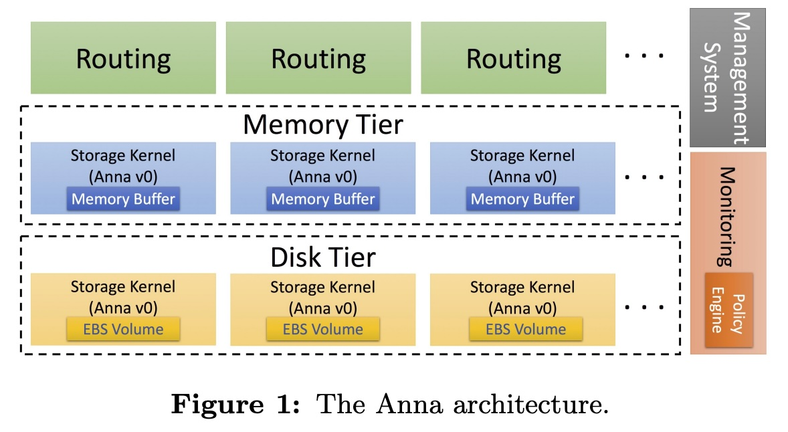
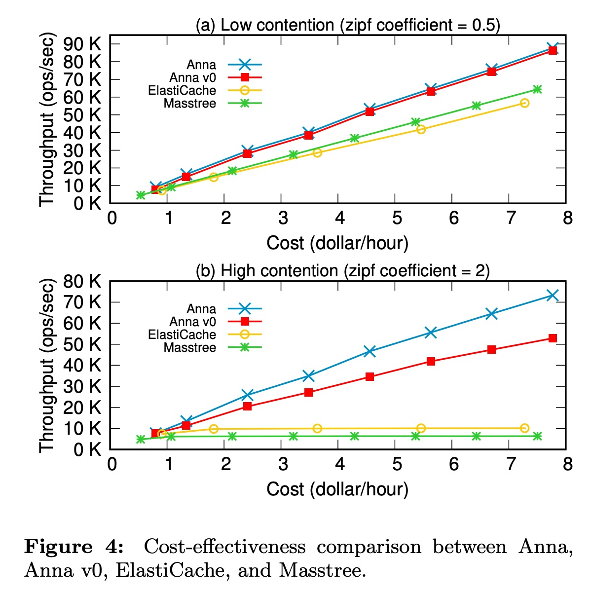
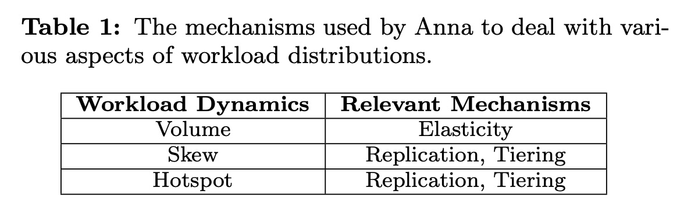
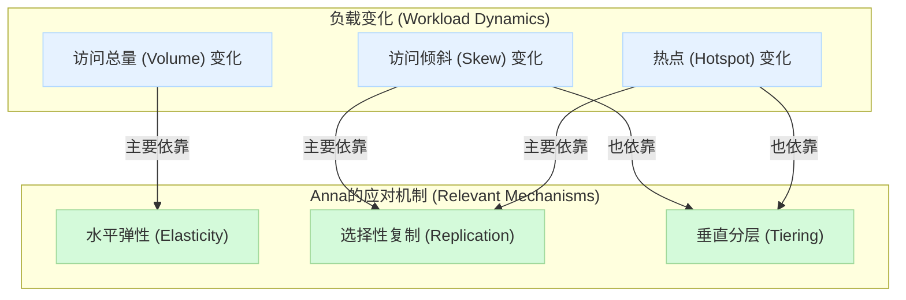
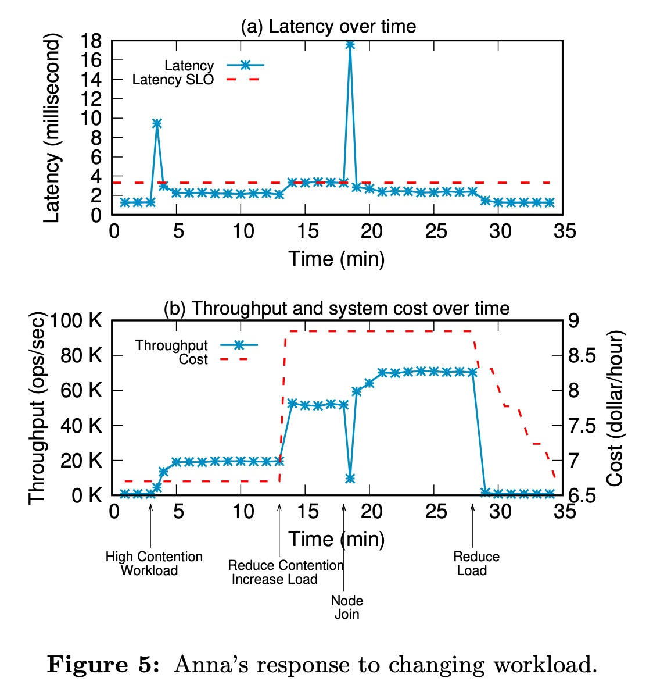
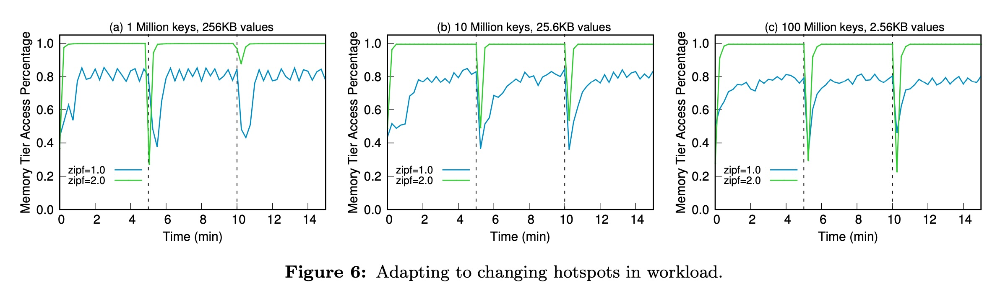
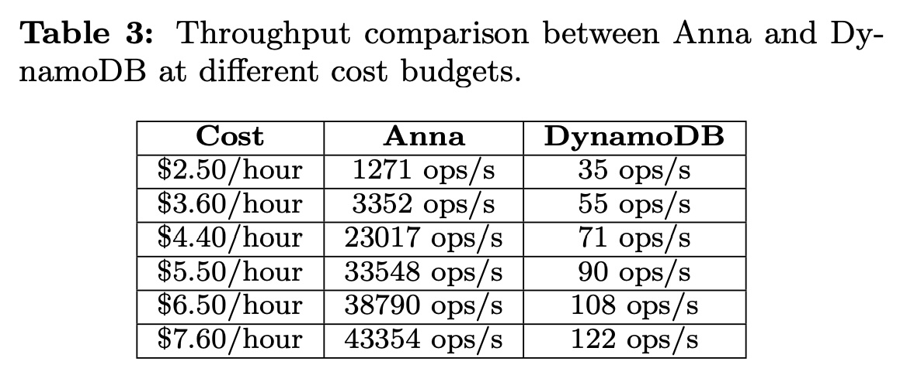

## AI论文解读 | Autoscaling Tiered Cloud Storage in Anna
        
### 作者        
digoal        
        
### 日期        
2025-11-05        
        
### 标签        
PostgreSQL , PolarDB , DuckDB , AI , 论文解读        
        
----        
        
## 背景  
      
https://dl.acm.org/doi/pdf/10.14778/3311880.3311881        
  
提示:          
```          
读懂《Autoscaling Tiered Cloud Storage in Anna》这篇论文需要提前掌握哪些基础知识, 请使用中文通熟易懂的讲解这些基础知识, 可以引用论文中的图、表或使用Markdown支持的图形(text,mermaid等)增加解释性. 
  
使用中文通熟易懂的解读《Autoscaling Tiered Cloud Storage in Anna》这篇论文, 其中的关键内容请着重讲解, 可以引用论文中的图、表或使用Markdown支持的图形(text,mermaid等)增加解释性. 
  
提取《Autoscaling Tiered Cloud Storage in Anna》这篇论文中的重要术语, 使用中文对这些术语进行通熟易懂的讲解, 可以引用论文中的图、表或使用Markdown支持的图形(text,mermaid等)增加解释性. 
```     
  
## 1 前置知识 
  
要读懂《Autoscaling Tiered Cloud Storage in Anna》这篇论文 ，你需要对**分布式系统**、**数据库存储**和**云计算**这三个领域的基础知识有一些了解。

这篇论文的核心是介绍一个名为 “Anna” 的智能存储系统 。你可以把 Anna 想象成一个“超级网盘”，它不仅能存储海量数据（作为键值存储 KVS ），还能根据数据被访问的热度，自动地在“昂贵且快”的存储（如内存）和“便宜且慢”的存储（如硬盘）之间移动数据 。同时，它还能在访问量暴增时自动“加派人手”（增加服务器节点），在访问量下降时自动“裁员”（减少节点），从而在**成本**、**速度**和**可靠性**之间找到最佳平衡点 。

以下是你需要提前掌握的基础知识，我会尽量用通俗的语言解释：

-----

### 📚 1. 核心概念：分布式键值存储 (KVS)

  * **键值存储 (Key-Value Store, KVS):** 这是最简单的一种数据库。你可以把它理解为一个超级巨大的“字典”（Python里的 `dict`）。你给它一个“键”（Key，比如"user\_123"），它就能帮你存储或取出一个“值”（Value，比如"用户的个人信息"）。这篇论文里的 Anna 就是一个分布式的 KVS 。
  * **分布式 (Distributed):** 意思是这个“字典”大到一台机器装不下，所以它被分散（Partition/Shard）存储在成百上千台服务器上。
  * **云服务商的 KVS 示例:** 论文中反复提到了亚马逊(AWS)的存储服务，了解它们有助于理解 Anna 要解决的问题：
      * **ElastiCache**: 类似“内存”，非常快，但非常贵，而且断电数据就没了。
      * **DynamoDB**: 类似“高性能硬盘”，速度不错，数据存在硬盘上，按需付费。
      * **S3**  和 **Glacier**: 类似“仓库”和“地下冷库”，巨便宜，但取数据很慢。

### 🏔️ 2. 核心问题：存储的“分层”与“弹性”

  * **数据“冷热” (Hot/Cold Data):** 想象一下，你手机相册里上周拍的照片（热数据）可能天天看，但五年前的照片（冷数据）可能一年才翻一次 。对系统来说，把“热数据”放在昂贵的内存里（访问快），把“冷数据”放在便宜的硬盘上（访问慢）是最划算的 。

  * **存储分层 (Tiered Storage):** 这就是 Anna 架构的核心。它至少有两层 ：

    1.  **内存层 (Memory Tier):** 快速、昂贵 。
    2.  **磁盘层 (Disk Tier / EBS Tier):** 慢速、便宜 。

    Anna 会自动监测数据热度，在这些层之间“推广”（promote）热数据和“降级”（demote）冷数据 。论文中的**图1**  清晰地展示了这个架构：   

    ```mermaid
    graph TD
        subgraph "用户请求 (Client Request)"
            direction TB
            R[Routing / 路由]
        end

        subgraph Anna 存储系统
            direction TB
            M["Memory Tier / 内存层<br>(存储热数据)"]
            D["Disk Tier / 磁盘层<br>(存储冷数据)"]
            R --> M
            R --> D
            M <--> D
        end

        subgraph "管理系统 (Management)"
            direction TB
            P["Policy Engine / 策略引擎<br>(决定数据冷热、何时扩缩容)"]
            MO[Monitoring / 监控]
        end
        
        MO --> P
        P -- "数据移动" --> M
        P -- "数据移动" --> D
        P -- "弹性伸缩" --> M
        P -- "弹性伸缩" --> D
    ```

      * **水平弹性 (Horizontal Elasticity):** 这是“自动伸缩”(Autoscaling) 的核心 。
          * **Scale-out (扩容):** 当访问量（论文称 "Volume" ）激增时，系统自动增加新的服务器节点来分担压力 。
          * **Scale-in (缩容):** 当访问量下降时，系统自动移除多余的节点以省钱 。

### ⚙️ 3. 关键技术：架构与算法

  * **分区 (Partitioning) 与一致性哈希 (Consistent Hashing):**
      * 当系统里有几百台服务器时，怎么决定哪个“键”存到哪台机器上？这就是分区。
      * **一致性哈希**  是一种高级算法。它能保证当“增加”或“减少”一台服务器时（即弹性伸缩时），只需要移动最少量的数据。论文中提到的“哈希环”(Hash Ring)  就是这个概念的实现。
  * **复制 (Replication):**
      * 为了防止一台服务器挂了导致数据丢失（即“容错” Fault Tolerance ），系统会把一份数据复制多份（比如3份），存在不同的机器上。
      * **多主复制 (Multi-Master Replication):** 这是 Anna 的一个关键特性 。很多系统（如 Redis）是“单主”的，即3个副本里只有1个“主”能写，其他“从”只能读。而 Anna 是“多主”的 ，意味着**所有副本都能同时处理读和写请求**。这让它速度更快，但也带来了一个新问题：
  * **一致性模型 (Consistency Models):**
      * **强一致性 (Strong Consistency):** 比如银行转账。你写入一笔钱，下个瞬间你（在任何地方）查到的余额必须是最新值。这很安全，但系统会很慢（因为要等所有副本都确认）。
      * **最终一致性 (Eventual Consistency):** Anna 和 DynamoDB 采用的就是这种 。你发了一条朋友圈，你朋友可能要过几秒钟才能刷到。系统不保证所有副本数据“立刻”统一，只保证“最终”会变的一样。这牺牲了一点点即时性，换来了极高的性能和可用性。
      * **CRDTs / Lattices ( lattices ):** 为了解决“最终一致性”下两个副本数据冲突的问题（比如你和朋友同时修改了同一个文档），Anna 使用了一种叫“Lattice”  的数学结构（类似 CRDTs）。它能让系统在没有“协调”的情况下（coordination-free ），自动合并(merge)这些冲突的修改，比如“最后写入的为准”(Last-Writer-Wins) 。
  * **选择性复制 (Selective Replication):** 这是 Anna 超越其前身 (Anna v0) 的地方 。
      * **Anna v0 的问题:** 粗暴地把 *所有* 数据都复制很多份，导致浪费了大量存储空间和网络流量 。
      * **Anna 的改进:** 只把“热数据”复制很多份（分散到更多机器上来处理高并发访问），而“冷数据”只复制最少的份数（比如3份来保证容错）。

### 📊 4. 衡量标准：性能与负载

  * **SLO (服务等级目标):** 你对系统的要求 。Anna 的策略引擎(Policy Engine)  就是为了平衡这些目标：
    1.  **延迟 (Latency):** 访问数据要多快？（比如平均 5ms 内 ）
    2.  **成本 (Cost):** 每小时最多花多少钱？（比如 $5/hour ）
    3.  **容错 (Fault Tolerance):** 最多允许坏几台机器？（比如 k=2，即允许坏2台 ）
  * **负载倾斜 (Workload Skew):** 访问是否平均 。
      * **低倾斜 (Low Contention):** 访问很均匀，大家访问的数据都差不多。
      * **高倾斜 (High Skew / High Contention):** 访问很不均匀，90% 的请求都集中在 1% 的“热点”数据上（比如“微博热搜”）。
  * **Zipfian 分布 (Zipfian Distribution):** 在学术界，这是一个用来**模拟“热点”访问**的数学模型 。论文在评估性能时（如 **图4** ）会说 "zipf coefficient = 2" ，这意思就是“一个高度倾斜的热点负载”，用来测试 Anna 的“选择性复制”功能是否有效。    

-----

### 总结：你需要掌握的知识点

1.  **什么是 KVS** (如 Redis, DynamoDB)。
2.  **为什么存储要分层** (内存 vs. 硬盘，热数据 vs. 冷数据) 。
3.  **什么是弹性伸缩** (自动加减服务器) 。
4.  **什么是分区** 和 **一致性哈希** (数据如何分散到多台机器) 。
5.  **什么是复制** (多主 vs. 单主) 。
6.  **什么是最终一致性** (与强一致性的区别) 。
7.  **什么是负载倾斜** (Zipfian 分布，热点访问) 。

掌握了这些，你就能明白 Anna 试图解决的核心问题：**如何打造一个能自动感知“热点”和“负载”，并自动在“内存/硬盘分层”和“服务器数量”之间做出调整的，既快、又省钱、还可靠的分布式存储系统。**

如果需要我为你详细解释其中任何一个概念，请随时提问！
  
## 2 解读论文 
  
这是一篇关于 **“Anna”** 的论文，它介绍了一个“既聪明又省钱”的云存储系统 。

你可以把 **Anna** 想象成一个超级智能的“云仓库管理员”。在它出现之前，你（开发者）使用云存储时很纠结：

1.  **贵的仓库（如内存/ElastiCache）** ：存取速度飞快，但价格昂贵，容量也小 。
2.  **便宜的仓库（如硬盘/S3/Glacier）** ：容量巨大，价格低廉，但存取速度很慢 。

大多数应用的数据都有“冷热”之分 。比如，你刚发布的照片（热数据）访问的人很多，而一年前的照片（冷数据）几乎无人问津。传统上，开发者需要自己写复杂的代码，手动判断数据冷热，再决定是放贵仓库还是便宜仓库，非常麻烦 。

这篇论文的核心，就是介绍 Anna 如何**自动**解决这个麻烦，实现一个**高效率、低成本、可自动伸缩**的存储服务 。

-----

### 🔑 1. 论文要解决的两大“拦路虎”

Anna 的设计旨在克服当前云存储系统的两大障碍 ：

  * **成本-性能障碍 (Cost-Performance Barriers):** 开发者被迫在昂贵的“高性能”和便宜的“低性能”之间做选择 。理想状态下，数据应该根据热度在不同层级的存储间自动流动 ，但现实是开发者必须手动“拼凑”这些服务 。
  * **静态部署障碍 (Static Deployment Barriers):** 绝大多数云存储服务（尤其是高性能的） **不具备真正的弹性** 。比如 AWS ElastiCache，它“惊人地缺乏弹性” ，需要管理员手动增减实例 。这意味着，面对突发的流量高峰（比如热搜），系统要么因为来不及扩容而崩溃，要么为了应对峰值而长期“养着”昂贵的资源，造成浪费。

-----

### 💡 2. Anna 的三大核心机制

为了解决上述问题，Anna 引入了三个关键机制 ：

1.  **垂直分层 (Vertical Tiering):**

      * **这是什么？** 将存储分为不同“层级”，比如论文中实现的“内存层”（快而贵）和“磁盘层”（慢而便宜） 。
      * **解决什么？** 解决“成本-性能”障碍。Anna 会监控数据，自动把热数据“提升”到内存层以加快访问，把冷数据“降级”到磁盘层以节省成本 。

2.  **水平弹性 (Horizontal Elasticity):**

      * **这是什么？** 每一层存储都可以自动增加（Scale-out）或减少（Scale-in）服务器节点 。
      * **解决什么？** 解决“静态部署”障碍。当总的访问 **“量” (Volume)** 增加时，Anna 会自动加机器来分摊压力 ；当访问量下降时，自动减机器以省钱 。

3.  **多主选择性复制 (Multi-master Selective Replication):**

      * **这是什么？** 这是 Anna 最聪明的机制之一。当系统发现某个数据（某个 Key） **“特别热” (Hot Keys)** 时，它不会像老系统（Anna v0）那样把所有数据都复制 ，而是 **“选择性地”只把这个热数据复制多份** ，分散到不同的服务器上 。
      * **解决什么？** 专门解决 **“负载倾斜” (Skew)** 问题 。想象一下“微博热搜”，99% 的流量都涌向了同一个词条。如果只靠一台机器（或一个副本），它肯定会崩溃。Anna 会立刻把这个词条复制到 10 台、20 台机器上，让这些机器“雨露均沾”地分担访问压力 。

这三大机制的协同关系，可以用下面这张图（基于论文中的 Table 1）来概括 ：    



-----

### 🏗️ 3. Anna 的系统架构

Anna 的架构如 **Figure 1** 所示 ，它由几个关键组件构成：   

  * **存储层 (Storage Tiers):**
      * **内存层 (Memory Tier):** 使用 AWS EC2 实例的内存 。
      * **磁盘层 (Disk Tier):** 使用 AWS 的 EBS 卷（一种网络硬盘） 。
      * **存储内核 (Storage Kernel):** 无论内存还是磁盘，它们内部运行的都是“Anna v0” 。这是一个 **“无协调”(Coordination-free)** 的系统，使用一种叫做 **Lattice** 的数据结构来保证“最终一致性” 。这使得它在读写时不需要互相“加锁”等待，速度极快 。
  * **管理系统 (Management System):**
      * **监控 (Monitoring):** 负责收集统计数据，比如每个 Key 的访问频率、每个节点的存储占用等 。
      * **策略引擎 (Policy Engine):** 这是 Anna 的 **“大脑”** 。它分析监控数据，并根据预设的“服务等级目标”（SLOs）来做出决策 。
  * **路由服务 (Routing Service):** 这是一个“无状态”的 API 接口 。客户端（你的应用）向它询问“Key A 在哪里？”，它会告诉客户端 Key A 目前（根据冷热）在哪些服务器上 。

> **架构亮点：元数据管理**  
>  
> 传统系统通常需要一个“主节点”(Master Node) 或 Zookeeper 这样的服务来管理元数据（比如哪个节点存了哪些数据） 。Anna 的设计非常巧妙：**它把元数据（如哈希环、Key的复制信息）也作为普通数据，直接存在 Anna 自己的存储内核里** 。  
>  
> 这意味着元数据天生就享受了 Anna 存储内核的高性能、容错和一致性 ，并且让监控、策略引擎等“大脑”组件可以 **“无状态”** 运行 。无状态的组件可以随意宕机和重启，大大简化了系统设计。  

-----

### 🧠 4. “大脑”：策略引擎如何工作

Anna 的“大脑”（Policy Engine）是实现“自动”(Auto) 的关键。管理员只需设定目标（SLOs） ：

  * **延迟目标 (L\_obj):** 比如，平均访问延迟必须低于 2.5ms 。
  * **成本预算 (B):** 比如，每小时花费不能超过 $5 。
  * **容错等级 (k):** 比如，k=2，意味着允许 2 个副本同时失效 。

策略引擎会不断监控系统，并执行一系列“启发式”规则（Heuristics）来平衡这些目标：

1.  **数据迁移 (Data Movement):**
      * 如果一个 Key 的访问频率超过阈值 P，并且它只在磁盘上，就把它“提升”一个副本到内存层 。
      * 如果一个 Key 的访问频率低于阈值 D，并且它在内存中有副本，就把所有副本“降级”到磁盘层 。
2.  **热点复制 (Hot-Key Replication):**
      * 如果一个内存层的 Key 访问频率超过阈值 H（比如高于平均值的 3 个标准差）。
      * 系统会计算一个理想的复制因子 $R_{M\_ideal}$ 。
      * **优先跨节点复制**（因为网络带宽是瓶颈），如果节点数不够了，再**跨核（线程）复制** 。
3.  **弹性伸缩 (Elasticity):**
      * **加节点：** 如果一个层的**存储**快满了（ 例如超过 $S_{upper}$ ），就加节点。如果**计算**（CPU/网络）不够用了，并且平均延迟**高于** SLO 的 75% ，也加节点。
      * **减节点：** 如果平均延迟**低于** SLO 的 50%，并且计算占用率很低 ，就尝试移除节点以省钱。

-----

### 📊 5. 实验亮点：Anna 到底有多强？

#### 亮点一：选择性复制 vs. 传统 KVS (Figure 4)

  

这是论文的核心对比。在 **“高倾斜” (High contention)** 负载下（即存在明显的热点），Anna 的优势尽显 。

  * **ElastiCache 和 Masstree:** 无法处理热点，它们的吞吐量很快就达到了瓶颈（横线） 。
  * **Anna v0 (老版):** 因为它复制了“所有”数据，冷数据带来的“Gossip”（副本间同步）开销拖慢了系统 。
  * **Anna (新版):** **实现了完美的线性扩展** 。你花多少钱（Cost），它就给你多少吞吐量（Throughput）。这完全归功于**选择性复制**，它只复制热点数据，既分散了压力，又没有额外开销 。

#### 亮点二：Anna 的“自动驾驶” (Figure 5)

  

这个实验展示了 Anna 在动态负载下的“自动驾驶”能力 。

1.  **[3分钟时]:** 启动“高倾斜”负载 。延迟（蓝线）立即飙升。Anna 迅速检测到，开始“选择性复制”热点，延迟很快回落到 SLO（红虚线）以下 。
2.  **[13分钟时]:** 负载 **“量”增加 4 倍** ，同时倾斜度降低 。Anna 发现所有节点都很忙，延迟再次触及 SLO 上限 。
3.  **[13-18分钟]:** Anna 决定 **“水平弹性”** —— 增加 4 个新节点 。系统成本（红虚线）随之上升 。
4.  **[18分钟时]:** 新节点加入 。吞吐量（蓝星线）立即翻倍，延迟也降了下来。
5.  **[28分钟时]:** 负载降低。Anna 检测到资源空闲，**移除节点以省钱**，成本下降 。

#### 亮点三：应对“热点转移” (Figure 6)

  

这个实验展示了 Anna 的“垂直分层”能力。实验在第 0、5、10 分钟时切换不同的热点数据 。

Y 轴是“内存层访问百分比”（即缓存命中率） 。

  * **绿色曲线（高倾斜）:** 每次热点切换（如第 5 分钟），命中率瞬间降到 0（因为新热点还在磁盘里）。但 Anna 反应极快，**在 10 秒内就检测到了新热点**，并将其“提升”到内存，命中率迅速恢复到 100% 。

#### 亮点四：吊打 DynamoDB (Table 3)

  

在“成本效率”（即花同样的钱能办多少事）上，Anna 与 AWS DynamoDB 进行了对比 。

**结果：Anna 实现了 36 倍到 355 倍的效率提升** 。
例如，在 $4.40/小时 的预算下 ：

  * DynamoDB: 71 ops/s
  * **Anna: 23,017 ops/s**

-----

### 💬 6. 总结

《Autoscaling Tiered Cloud Storage in Anna》展示了一个全新的云存储设计点 。

它不是一个简单的 KVS，而是一个集成了**垂直分层**（省钱）、**水平弹性**（应对流量）和**选择性复制**（攻克热点）三大机制的**智能调度系统** 。它用一个统一的 API，为开发者提供了“鱼与熊掌兼得”的可能：在满足严苛延迟目标的同时，实现比现有商业或研究系统高出几个数量级的成本效率 。
  
## 3 术语 
  
以下是《Autoscaling Tiered Cloud Storage in Anna》论文中的一些重要术语，以及（A|）通俗易懂的中文讲解：

### 1\. KVS (Key-Value Store / 键值存储)

  * **通俗讲解:** 这是最基础的一种数据库 。你可以把它想象成一个“超级字典”。你给它一个“键”（Key，比如：`user_123`），它就能帮你存或取一个“值”（Value，比如：`{"name": "张三", "age": 30}`）。Anna 系统本质上就是一个高性能的、分布式的 KVS。
  * **相关术语:** ElastiCache, DynamoDB 。这些是亚马逊 AWS 提供的 KVS 服务，论文将 Anna 与它们进行了对比。

### 2\. Tiered Storage (分层存储) / Vertical Tiering (垂直分层)

  * **通俗讲解:** 指的是系统同时使用多种不同“档次”的存储介质，并把它们组成一个“层级” 。就像一个书桌，常用的东西放桌面（快/贵/小），不常用的放抽屉（慢/便宜/大）。

  * **Anna 中的应用:** Anna 至少使用了两个层级：

      * **内存层 (Memory Tier):** 速度极快，但价格昂贵。用来放“热数据” 。
      * **磁盘层 (Disk Tier / EBS Tier):** 速度较慢，但价格便宜。用来放“冷数据” 。

  * **图解 (源自论文 Figure 1):** Anna 的架构清晰地展示了这种分层。    

    ```mermaid
    graph TD
        subgraph Anna 架构
            R[Routing / 路由]
            subgraph Management [管理系统]
                Mon[Monitoring / 监控]
                PE[Policy Engine / 策略引擎]
            end
            subgraph MT["Memory Tier / 内存层 (热)"]
                SK1[Storage Kernel]
                SK2[Storage Kernel]
                SK3[...]
            end
            subgraph DT["Disk Tier / 磁盘层 (冷)"]
                SK4[Storage Kernel]
                SK5[Storage Kernel]
                SK6[...]
            end
            R --> MT
            R --> DT
            MT <--> DT
            Mon --> PE
            PE -- "决策" --> MT
            PE -- "决策" --> DT
        end
    ```

### 3\. Autoscaling (自动伸缩)

  * **通俗讲解:** 指系统能够根据负载（访问量）的变化，**自动**增加或减少资源（比如服务器节点）。这是现代云服务的核心特性之一 。
  * **Anna 中的应用:** Anna 的“自动”体现在三个方面，这三个也是论文的核心机制：

| 机制 (Mechanism) | 中文讲解 | 解决的问题 (Workload Dynamics) |
| :--- | :--- | :--- |
| **Horizontal Elasticity** | **水平弹性** | 自动**增加或减少服务器节点**，以应对整体访问 **“量” (Volume)** 的变化 。 |
| **Selective Replication** | **选择性复制** | 自动**为“热数据”创建更多副本**，以应对访问 **“倾斜” (Skew)** 。 |
| **Vertical Tiering** | **垂直分层** | 自动**在“内存”和“磁盘”间移动数据**，以应对 **“热点” (Hotspot)** 变化 。 |

  * **表格来源:** 上述表格是对论文中 **Table 1** 的总结和讲解 。    

### 4\. Skewness (倾斜度) & Hot Keys (热键)

  * **通俗讲解:** “Skewness” 指的是访问分布“不均匀”。在大多数应用中，只有极少数数据（比如：微博热搜、爆款商品）会被绝大多数用户访问，这种现象就是“高倾斜度” (High Skew) 。
  * **热键 (Hot Keys):** 那些被频繁访问的“少数数据”，就叫做“热键” 。
  * **Zipfian Distribution:** 这是论文实验中用来**模拟**这种“高倾斜”访问的数学模型 。系数 (coefficient) 越高，意味着热点越集中。

### 5\. Multi-Master Selective Replication (多主选择性复制)

  * **通俗讲解:** 这是 Anna 最关键的创新之一。
      * **Replication (复制):** 为了安全（容错）和性能（分流），数据通常会被复制多份。
      * **Selective (选择性):** 传统系统（如 Anna v0）会把“所有”数据都复制相同份数，这很浪费 。Anna 只“选择性”地为“热键”复制很多份，而“冷键”只复制几份 。
      * **Multi-Master (多主):** 很多系统是“单主”的（只有“主”副本能写）。Anna 是“多主”的，意味着**所有副本都能处理读写请求**，这大大提高了性能 。

### 6\. Policy Engine (策略引擎)

  * **通俗讲解:** 这是 Anna 的 **“大脑”** 。
  * **工作内容:** 它会持续“监控”(Monitoring) 系统的各项指标（如：每个键的访问频率、CPU 占用、延迟等），然后根据管理员设定的“目标”（见下一个术语 SLOs），**自动做出决策**（Action）。
  * **决策示例 (源自 Figure 3):**    
      * “A 键太热了，触发**热键复制 (Hot-Key Replication)**” 。
      * “B 键没人访问了，触发**数据迁移 (Data Movement)**，把它从内存降级到磁盘” 。
      * “所有机器的 CPU 都 80% 了，触发**弹性 (Elasticity)**，加两台服务器” 。

### 7\. SLOs (Service-Level Objectives / 服务等级目标)

  * **通俗讲解:** 这是管理员给 Anna 下达的“KPI”或“目标” 。Policy Engine（大脑）会想尽一切办法（在机制 1, 2, 3 中选择）来达成这些目标。
  * **Anna 支持的 SLOs:**
    1.  **延迟 (Latency):** 比如，“平均访问延迟必须低于 2.5 毫秒” 。
    2.  **成本 (Cost):** 比如，“整个系统每小时花费不得超过 10 美元” 。
    3.  **容错 (Fault Tolerance):** 比如，“k=2”，意味着系统必须能**容忍 2 个节点同时宕机**而数据不丢失（即至少保持 k+1=3 个副本）。

### 8\. Coordination-Free (无协调) & Lattices (格)

  * **通俗讲解:** 这是 Anna 性能极高的底层“秘诀”，源自其前身 Anna v0 。
  * **Coordination-Free (无协调):** 传统数据库在修改数据时需要“加锁”(Locking) 或“协商”(Consensus)，确保数据一致，但这很慢 。Anna 的“无协调”设计意味着，不同服务器在处理数据时**不需要互相等待或协商** 。
  * **Lattices (格):** “无协调”会带来一个问题：如果两个副本同时被修改，数据“冲突”了怎么办？Anna 使用了一种叫做 Lattices 的数学结构（一种 CRDT）来**自动合并**这些冲突 。例如，最简单的合并策略是“LWW”(Last-Writer-Wins)，即“谁最后写入，就以谁为准” 。
  
## 参考        
         
https://dl.acm.org/doi/pdf/10.14778/3311880.3311881    
        
<b> 以上内容基于DeepSeek、Qwen、Gemini及诸多AI生成, 轻微人工调整, 感谢杭州深度求索人工智能、阿里云、Google等公司. </b>        
        
<b> AI 生成的内容请自行辨别正确性, 当然也多了些许踩坑的乐趣, 毕竟冒险是每个男人的天性.  </b>        
    
#### [期望 PostgreSQL|开源PolarDB 增加什么功能?](https://github.com/digoal/blog/issues/76 "269ac3d1c492e938c0191101c7238216")
  
  
#### [PolarDB 开源数据库](https://openpolardb.com/home "57258f76c37864c6e6d23383d05714ea")
  
  
#### [PolarDB 学习图谱](https://www.aliyun.com/database/openpolardb/activity "8642f60e04ed0c814bf9cb9677976bd4")
  
  
#### [PostgreSQL 解决方案集合](../201706/20170601_02.md "40cff096e9ed7122c512b35d8561d9c8")
  
  
#### [德哥 / digoal's Github - 公益是一辈子的事.](https://github.com/digoal/blog/blob/master/README.md "22709685feb7cab07d30f30387f0a9ae")
  
  
#### [About 德哥](https://github.com/digoal/blog/blob/master/me/readme.md "a37735981e7704886ffd590565582dd0")
  
  

  
