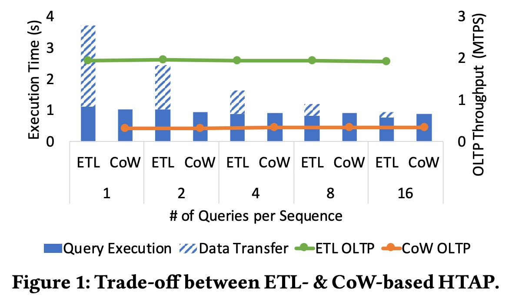
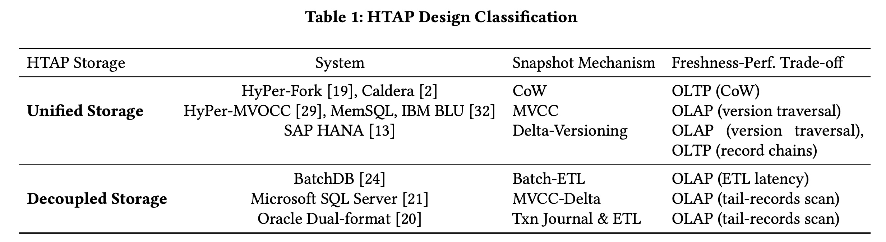
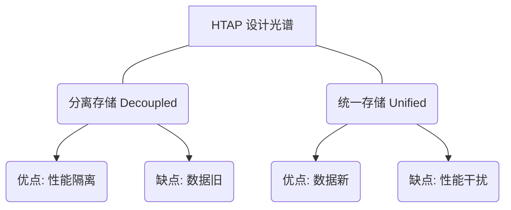
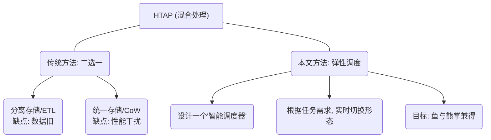
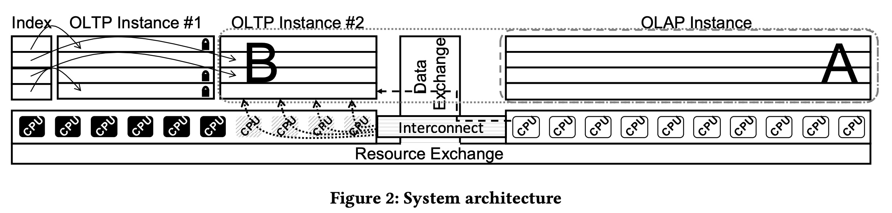
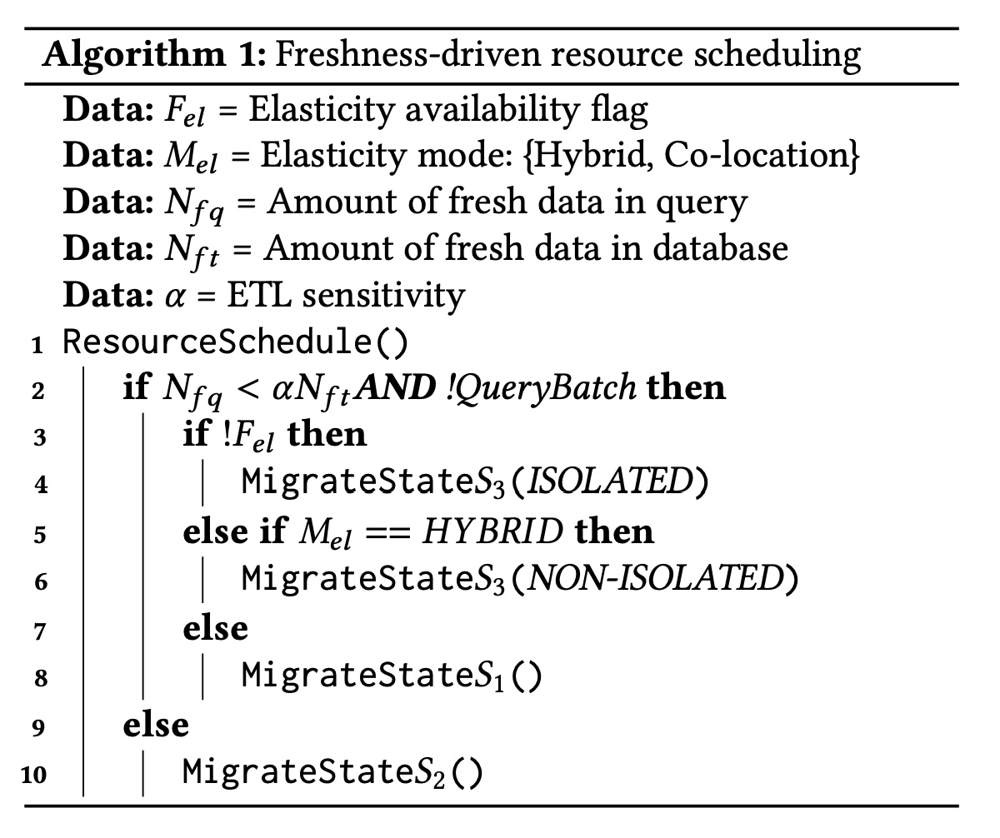
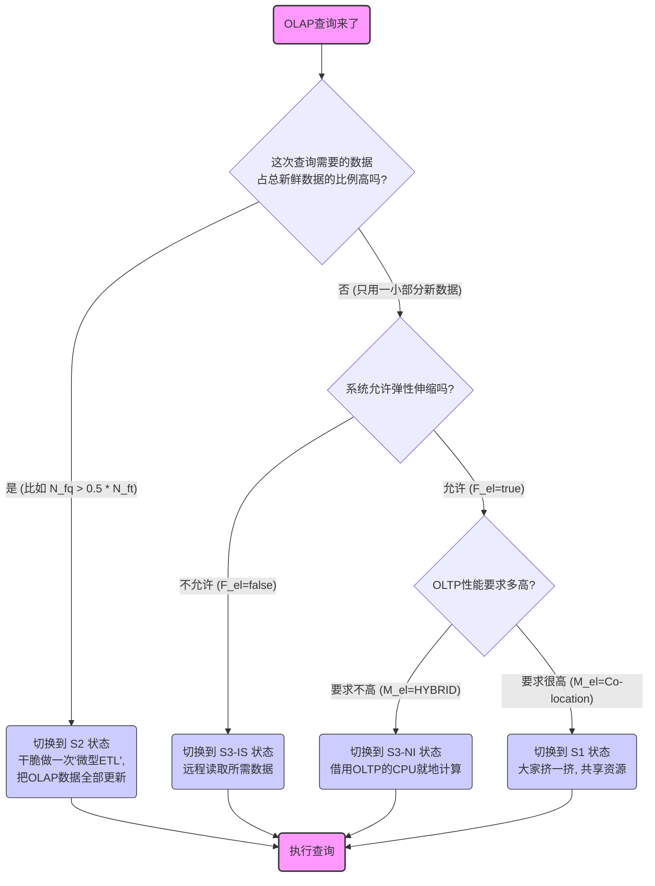
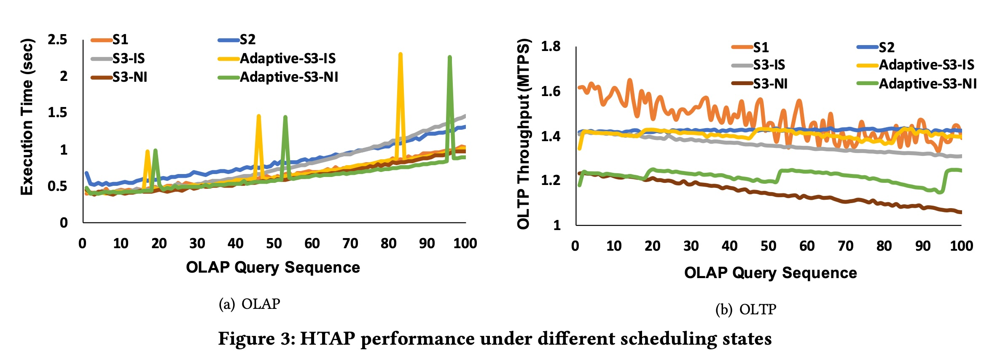
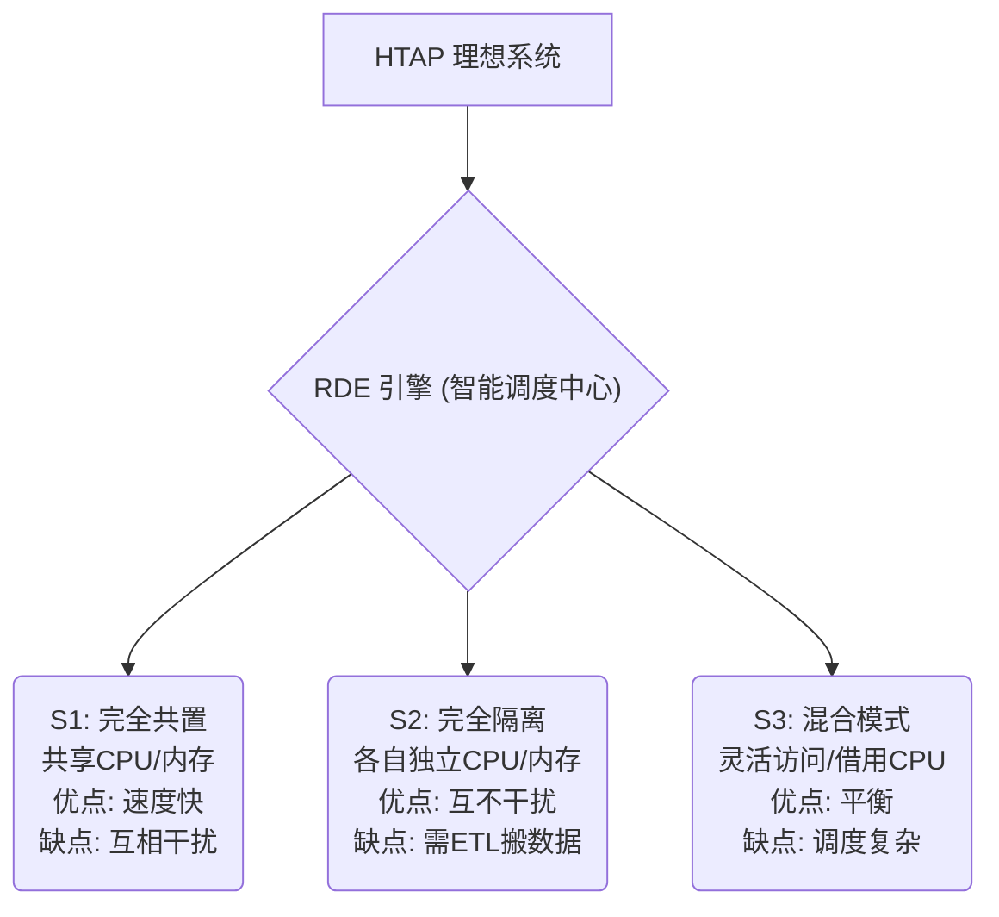

## AI论文解读 | Adaptive HTAP through Elastic Resource Scheduling
        
### 作者        
digoal        
        
### 日期        
2025-11-05        
        
### 标签        
PostgreSQL , PolarDB , DuckDB , AI , 论文解读        
        
----        
        
## 背景  
      
https://dl.acm.org/doi/pdf/10.1145/3318464.3389783        
  
提示:          
```          
读懂《Adaptive HTAP through Elastic Resource Scheduling》这篇论文需要提前掌握哪些基础知识, 请使用中文通熟易懂的讲解这些基础知识, 可以引用论文中的图、表或使用Markdown支持的图形(text,mermaid等)增加解释性. 
  
使用中文通熟易懂的解读《Adaptive HTAP through Elastic Resource Scheduling》这篇论文, 其中的关键内容请着重讲解, 可以引用论文中的图、表或使用Markdown支持的图形(text,mermaid等)增加解释性. 
  
提取《Adaptive HTAP through Elastic Resource Scheduling》这篇论文中的重要术语, 使用中文对这些术语进行通熟易懂的讲解, 可以引用论文中的图、表或使用Markdown支持的图形(text,mermaid等)增加解释性. 
```     
  
## 1 前置知识 
  
要读懂这篇名为《通过弹性资源调度实现自适应HTAP》的论文 ，你需要提前掌握几个数据库和系统架构方面的核心概念。

简单来说，这篇论文在解决一个核心问题：**如何让一个数据库系统既能快速处理像“下单”这样的高频交易，又能同时（几乎实时地）对这些新数据进行复杂的“报表分析”，而且两者互不拖后腿？** 

论文的答案是： **“动态调整”** 。与其设计一套“写死”的系统，不如做一个“弹性”系统，能根据当前的任务需求，实时地在不同工作模式间切换，动态分配CPU和内存资源 。

以下是你需要了解的基础知识，我会用尽量通俗的方式来讲解：

### 1\. 基础中的基础：OLTP vs. OLAP

这是理解 HTAP 概念的基石。数据库的“工作”主要分为两大类：

  * **OLTP (Online Transaction Processing, 联机事务处理):**

      * **通俗理解：** 处理“交易”或“事务”。
      * **例子：** 网上购物下订单、银行转账、抢票。
      * **特点：** 读写都很多、操作快、涉及数据量小（比如只修改订单表的一行）、高并发（成千上万的人同时操作）。

  * **OLAP (Online Analytical Processing, 联机分析处理):**

      * **通俗理解：** 进行“分析”或“出报表”。
      * **例子：** 分析“本季度所有商品的销售总额”、“过去一个月全国各省的订单量对比”。
      * **特点：** 主要是读、操作慢、涉及数据量巨大（扫描几亿条记录）、并发低（通常是分析师在用）。

你可以通过下表快速对比：

| 特性 | OLTP (事务处理) | OLAP (分析处理) |
| :--- | :--- | :--- |
| **目标** | 快速完成业务操作 | 辅助决策、数据洞察 |
| **操作** | 频繁的增、删、改、查 | 复杂的查询、聚合（如SUM, AVG） |
| **数据量** | 每次操作几行或几十行 | 每次查询几百万或几十亿行 |
| **例子** | “用户A 向用户B 转账100元” | “统计所有用户近一年的转账总额” |

-----

### 2\. 核心概念：HTAP (混合事务/分析处理)

  * **HTAP (Hybrid Transactional/Analytical Processing)** 就是想把 OLTP 和 OLAP 这两种水火不容的任务，放在**一套系统**里同时搞定 。
  * **为什么这么做？** 传统上，公司会用一个数据库（OLTP库）处理交易，然后在半夜把数据抽出来，加载到另一个专门的“数据仓库”（OLAP库）里供第二天分析。
  * **问题是：** “半夜”才同步，意味着分析师看到的**永远是昨天的数据**。如果老板想看“此时此刻”的销售情况，传统架构就傻眼了。
  * HTAP 的目标就是实现 **“实时分析”** ，即对“**新鲜出炉**”的（fresh data）进行分析 。

-----

### 3\. 核心矛盾：“数据新鲜度”与“性能权衡”

这篇论文的核心就是围绕这个矛盾展开的。

  * **数据新鲜度 (Data Freshness):** 指分析系统（OLAP）里的数据，跟交易系统（OLTP）的最新数据有多大延迟 。HTAP 追求极高的新鲜度。
  * **核心权衡 (Trade-off):** 论文第一页就说“天下没有免费的午餐” (There is no free lunch) 。你想让分析变得更快、数据更新鲜，就必然会牺牲“交易”的性能，反之亦然。

论文中的 **Figure 1**  完美地展示了这种权衡。它对比了两种极端的设计：    

  * **ETL 方式 (蓝色/条纹柱)：** 这是一种“分离”策略。分析前，先把数据从 OLTP 库“搬”到 OLAP 库。
      * **OLTP 性能 (绿线 )：** 非常稳定（不受影响）。
      * **OLAP 性能 (柱子高度)：** 很差。因为“数据传输”(Data Transfer)  本身就很花时间（条纹部分很高），导致总执行时间很长 。
  * **CoW 方式 (Copy-on-Write)：** 这是一种“统一”策略。分析和交易在同一份数据上跑。
      * **OLTP 性能 (橙线 )：** 很差。因为 OLTP 在写数据时，总要先“复制一份”给 OLAP 用，导致 OLTP 吞吐量下降 。
      * **OLAP 性能 (柱子高度)：** 很好。查询执行本身很快，而且没有数据传输的开销 。

-----

### 4\. 两种主流 HTAP 架构（论文中的“设计光谱”）

Figure 1 中的 ETL 和 CoW，其实代表了 HTAP 的两大类设计，这在论文的 **Table 1**  中有详细分类。你需要理解这两种架构：    

  * **1. Decoupled Storage (分离存储)**:

      * **对应：** Figure 1 中的 ETL 方式。
      * **做法：** OLTP 和 OLAP 各有各的存储系统 。数据需要通过 ETL（抽取、转换、加载）过程从 OLTP 搬到 OLAP 。
      * **优点：** 两个系统物理隔离，互不干扰 。
      * **缺点：** **数据新鲜度差** 。OLAP 性能受限于 ETL 的延迟。

  * **2. Unified Storage (统一存储)**:

      * **对应：** Figure 1 中的 CoW 方式。
      * **做法：** OLTP 和 OLAP 在同一个系统、同一份数据上工作 。通过快照（Snapshotting）或多版本（MVCC）技术来保证一致性 。
      * **优点：** **数据新鲜度极高**（几乎为0延迟）。
      * **缺点：** **性能干扰严重** 。要么 OLTP 拖累 OLAP，要么 OLAP 拖累 OLTP 。




-----

### 5\. 论文的核心贡献：弹性资源调度 (Elastic Scheduling)

理解了上述的“两难困境”后，你就能看懂这篇论文的精妙之处了。

作者说：**我们为什么非要在“分离”和“统一”之间二选一呢？**

论文的**核心思想**是：我们设计一个“**自适应**”  系统，它可以根据当前 OLAP 查询的需求，**动态地在“分离”和“统一”这两种状态之间平滑切换** 。

  * **实现方式：** 通过一个“**RDE 引擎**”（资源和数据交换引擎） 。
  * **RDE 的作用：** 像一个“交通调度员”，它管理着所有的 CPU 和内存资源 。
  * **三个系统状态** ：
    1.  **$S_1$ (Co-located, 共置)：** 类似“统一存储”，OLTP 和 OLAP 共享资源。
    2.  **$S_2$ (Isolated, 隔离)：** 类似“分离存储”，OLTP 和 OLAP 各用各的资源，数据需要“搬运”。
    3.  **$S_3$ (Hybrid, 混合)：** 介于两者之间，OLAP 只访问它需要的“那部分”新数据。

当一个分析（OLAP）请求过来时，RDE 会根据这个请求要多“新”的数据、要读多少数据，来动态决定系统应该切换到 $S_1$ , $S_2$ , 还是 $S_3$ 状态 ，并“弹性地”分配 CPU 资源 。

-----

### 6\. (进阶) 硬件知识：NUMA 架构

论文中多次提到 "socket" (CPU插槽)  和 "NUMA" 。

  * **NUMA (Non-Uniform Memory Access, 非一致性内存访问):** \* **通俗理解：** 在现代大型服务器上，通常不止一个 CPU（比如有2个或4个“插槽”）。每个 CPU 都有自己“亲近”的内存（本地内存），访问这些内存非常快。
      * 但是，一个 CPU 也可以访问插在*另一个* CPU 旁边的内存（远程内存），只是速度会**慢很多**（因为要跨CPU通信）。
  * **为什么重要：** 这篇论文的“弹性调度”就是基于 NUMA 架构的。
      * **隔离状态 ( $S_2$ )：** 可能就是把 OLTP 放在1号CPU插槽，把 OLAP 放在2号CPU插槽 。它们互不干扰，但 OLAP 读数据时需要“跨CPU”访问，有开销 。
      * **共置状态 ( $S_1$ )：** 可能就是让 OLTP 和 OLAP 都在1号CPU插槽上运行，共享它的CPU核心和内存 。

### 总结

要读懂这篇论文，你需要先搞清楚：

1.  **OLTP** 和 **OLAP** 的根本区别。
2.  **HTAP** 想要“鱼与熊掌兼得”（交易性能 + 实时分析）。
3.  这个目标导致了“**性能 vs. 新鲜度**”的核心矛盾（参考 Figure 1 ）。    
4.  这个矛盾具体体现在“**统一存储**”（数据新，但干扰大）和“**分离存储**”（无干扰，但数据旧）两种架构上（参考 Table 1 ）。   

然后你就能明白，这篇论文的创新点在于 **不“站队”** ，而是设计了一个“**弹性调度器**”（RDE 引擎 ），让系统能根据任务需求，在不同的架构状态（ $S_1, S_2, S_3$ ）之间**动态切换**，从而在多变的 workload 下找到最佳平衡点 。

希望这些解释能帮助你理解！
  
## 2 解读论文 
  
好的，这是一篇信息量很大的论文，我们来用通俗易懂的方式把它“拆开”解读一下。

这篇论文的核心，一句话概括就是：**为了让数据库既能快速处理交易（OLTP），又能实时分析数据（OLAP），作者设计了一套“智能调度系统”，让数据库能像“变形金刚”一样，根据任务需求实时调整自己的架构和资源。**

-----

### 1\. 核心问题：数据库的“人格分裂”

首先，我们要理解数据库系统面临的一个经典难题。一个数据库系统通常要干两种截然相反的活：

  * **OLTP (联机事务处理):** 就像是银行柜员或电商网站的“下单”按钮 。它要求**快、准、狠**，每次只处理一小笔数据（比如一笔订单、一次转账），但要求极高并发（成千上万的人同时操作） 。
  * **OLAP (联机分析处理):** 就像是银行的“季度报表”分析师 。它要求**看得全、算得深**，一次要扫描海量历史数据（比如“本季度所有商品的总销售额”） ，计算复杂，但并发要求不高。

**核心矛盾**：OLTP 像短跑，OLAP 像马拉松。你让一个系统同时扮演好两个角色，它们就会互相“打架”，导致性能双双下降 。

-----

### 2\. 传统解决方案（“二选一”的困境）

传统上，为了解决这个矛盾，有两种主流方法，但都不完美。论文开篇的 **Figure 1**  就生动地展示了这两种方法的权衡：    

[图1：ETL 和 CoW 两种 HTAP 策略的权衡]

  * **方法一：ETL (分离存储)**

      * **做法：** 简单粗暴，用两套系统。一个 OLTP 数据库（处理交易），一个 OLAP 仓库（做分析）。每天半夜通过 ETL（数据抽取、转换、加载）过程把数据从 OLTP 库“搬”到 OLAP 仓库 。
      * **优点：** 两个系统物理隔离，互不干扰。OLTP 吞吐量（绿线）非常稳定 。
      * **缺点：** **数据不新鲜**！分析师看到的永远是昨天的数据。而且 Figure 1  显示，ETL 方案（蓝色柱）的总执行时间很长，因为它包含了“数据传输”（Data Transfer，条纹部分）的巨大开销 。

  * **方法二：CoW (统一存储)**

      * **做法：** 用一套系统。OLTP 和 OLAP 在同一份数据上跑。当 OLTP 要修改数据时，它会先“复制一份”（Copy-on-Write, CoW），保证 OLAP 分析师能读到一致的旧快照。
      * **优点：** **数据非常新鲜**！OLAP 查询（CoW 柱的纯色部分）执行很快 。
      * **缺点：** **严重干扰 OLTP**！因为 OLTP 每次写入都可能要复制页面，这极大地拖慢了它的速度 。你看 Figure 1  里的 CoW OLTP 吞吐量（橙线），性能就下降了。

**小结：** 传统方法要么牺牲数据新鲜度（ETL），要么牺牲交易性能（CoW）。

-----

### 3\. 本文的“变形金刚”方案：自适应HTAP

这篇论文的作者说：我们全都要！我们既要数据新鲜度，也要高性能。

他们的核心思想是 **“自适应” (Adaptive)** 和 **“弹性” (Elastic)** 。

他们不采用“写死”的架构，而是把 HTAP 视为一个**资源调度问题** 。他们设计了一个“智能调度层”，可以根据当前分析任务的需求，动态地在“分离”和“统一”这两种模式之间灵活切换。



-----

### 4\. 关键设计：三大引擎与三种状态

为了实现这个“变形金刚”系统，作者设计了三个关键组件（如 Figure 2 所示）：    

1.  **OLTP 引擎：** 专心处理交易 。
2.  **OLAP 引擎：** 专心执行分析 。
3.  **RDE 引擎 (资源和数据交换引擎)：** 这是**论文的核心** 。它像一个“交警”和“搬运工”的结合体，负责：
      * **资源调度：** 决定把哪些 CPU 核心分配给 OLTP，哪些分配给 OLAP 。
      * **数据交换：** 决定 OLAP 如何去读取 OLTP 产生的“新鲜数据” 。

这个 RDE 引擎通过调配资源，可以让整个系统在**三种关键状态 (S1, S2, S3)** 之间切换 ：

  * **状态 S1：Co-located (完全共置)**

      * **形态：** 类似于“统一存储” 。OLTP 和 OLAP 在同一个 CPU 插槽（物理硬件）上运行，共享内存和 CPU 。
      * **数据访问：** OLAP 直接读取 OLTP 内存中的数据快照 。
      * **优点：** 数据访问最快，新鲜度最高。
      * **缺点：** 硬件资源（内存带宽、CPU缓存）竞争激烈，互相干扰 。

  * **状态 S2：Isolated (完全隔离)**

      * **形态：** 类似于“分离存储”或传统的 ETL 。OLTP 和 OLAP 运行在不同的 CPU 插槽上，硬件资源完全隔离 。
      * **数据访问：** 当 OLAP 需要分析时，RDE 引擎会把“新鲜数据”从 OLTP 的内存**拷贝**到 OLAP 的内存中（就像一次微型 ETL）。
      * **优点：** 两个引擎互不干扰 。
      * **缺点：** 数据拷贝需要时间，OLAP 的响应会变慢（包含了数据传输延迟）。

  * **状态 S3：Hybrid (混合状态)**

      * **形态：** 这是最有意思的状态，介于 S1 和 S2 之间 。
      * **数据访问：** OLAP 默认在自己的硬件上跑，但它**只访问**它需要的“那部分”新鲜数据 。它可以选择：
        1.  **远程读取 (S3-IS)：** 跨 CPU 远程去读 OLTP 内存中的数据（有一定开销，但比 S2 的完全拷贝快）。
        2.  **借用 CPU (S3-NI)：** 临时从 OLTP 那里“借”几个 CPU 核心，在 OLTP 的“地盘”上就地完成计算（比如聚合），只把计算结果传回给 OLAP 。
      * **优点：** 非常灵活！在隔离和性能之间找到了精妙的平衡。

-----

### 5\. 智能调度：系统如何做决策？

系统怎么知道何时该用 S1、S2 还是 S3 呢？ 答案是 **Algorithm 1 (算法1)** 。   

这个算法是一个基于“数据新鲜度”的调度策略 。你可以把它想象成一个“决策树”：



*（注：`N_fq` 是查询需要的新鲜数据量, `N_ft` 是数据库总的新鲜数据量 ）*

这个算法的核心是：

1.  如果一个查询要用到大部分新数据，那还不如直接切换到 S2 状态，做一次彻底的数据同步（ETL），这样对后续查询也有好处 。
2.  如果只用一小部分新数据，那就优先用 S3（混合模式）。在 S3 中，又优先选 S3-NI（借 CPU），因为它在本地计算完再传结果，效率最高 。
3.  如果连 S3-NI 都不允许（比如 OLTP 性能要求极高，一个 CPU 都不肯借），那就用 S1（共置）或 S3-IS（远程读）。

-----

### 6\. 实验结果：真的有用吗？

论文的 **Figure 3**  展示了最终效果：    

[图3：HTAP 在不同调度状态下的性能]

  * **OLAP 性能 (左图 a)：**

      * **最差的：** `S2`（蓝线）。因为它每次查询都要搞一次 ETL，成本太高，执行时间最长。
      * **最好的：** `S3-NI`（橙线）和 `S1`（灰线）。因为它们的数据访问效率最高。
      * **“自适应”(Adaptive) 的效果：** 你会看到 `Adaptive-S3-IS`（黄线）和 `Adaptive-S3-NI`（绿线）。它们刚开始和普通线差不多，但**随着时间的推移（查询序列增多），它们的性能（执行时间）增长得更慢** 。这意味着“自适应”策略的长期收益非常高，论文提到性能提升高达 50% 。

  * **OLTP 性能 (右图 b)：**

      * `S1`（黄线）和 `S3-NI`（橙线）对 OLTP 性能影响最大，因为它们抢占了 OLTP 的 CPU 资源 。
      * `S2`（蓝线）和 `S3-IS`（灰线）对 OLTP 几乎没影响 。
      * “自适应”策略（`Adaptive` 线）会在性能和新鲜度之间做权衡，确保 OLTP 的性能只在“可控范围”内轻微下降 。

### 总结

这篇论文的贡献在于，它打破了 HTAP 系统“非黑即白”的传统设计，提出了一种**高度灵活、自适应的弹性调度框架** 。它允许系统在运行时动态地“变形”，在“完全隔离”和“完全共享”的光谱之间自由移动，从而根据实时的工作负载，智能地平衡“数据新鲜度”和“系统性能”这对核心矛盾。
  
## 3 术语 
  
这篇论文探讨了一种“自适应”的数据库系统设计，旨在解决一个数据库领域的经典难题。以下是理解这篇论文所需的核心术语及其通俗讲解：

-----

### 1\. 基础概念：OLTP vs. OLAP

要理解这篇论文，首先必须清楚数据库要处理的两种截然相反的工作负载：

  * **OLTP (Online Transaction Processing, 联机事务处理)**

      * **通俗讲解：** 想象一下电商网站的“下单”操作或银行的“转账”操作 。
      * **特点：** 涉及高频率、小批量的“事务”，比如插入一条新订单、更新一下账户余额。它要求响应速度极快、并发量极高。

  * **OLAP (Online Analytical Processing, 联机分析处理)**

      * **通俗讲解：** 想象一下“生成本季度销售总额报表”或“分析过去一年用户购买趋势” 。
      * **特点：** 涉及低频率、超大量的“分析”。它需要扫描海量数据并进行复杂计算，对实时性要求不高，但一次查询可能要跑几分钟甚至几小时。

### 2\. 核心问题：HTAP 及其挑战

  * **HTAP (Hybrid Transactional/Analytical Processing, 混合事务/分析处理)**

      * **通俗讲解：** 这是一种“鱼与熊掌兼得”的理想系统。它希望**在同一套系统**里，既能高速处理 OLTP 事务，又能对这些**刚刚产生的新数据**（fresh data）进行 OLAP 分析 。
      * **挑战：** OLTP（短跑）和 OLAP（马拉松）的需求是冲突的。强行放在一起，它们会“打架”，导致性能双双下降 。

  * **Data Freshness (数据新鲜度)**

      * **通俗讲解：** 指 OLAP 分析所用的数据，距离 OLTP 产生的最新数据有多“新” 。
      * **举例：** 传统的分析（见下文 ETL）可能只能分析“昨天”的数据（新鲜度低）。HTAP 的目标是分析“上一秒”的数据（新鲜度高）。

### 3\. 两种极端：论文的出发点 (Figure 1)

论文的 **Figure 1**  展示了两种传统的 HTAP 实现方式及其“权衡”：    

  * **ETL (Extract, Transform, Load, 抽取-转换-加载)**

      * **通俗讲解：** 传统的“分离”方案。一套 OLTP 系统，一套 OLAP 系统。在半夜时，通过 ETL 过程把数据从 OLTP 库“搬运”到 OLAP 库 。
      * **权衡 (见 Figure 1)：**
          * **好处：** OLTP 性能（绿线）完全不受影响，非常稳定 。
          * **坏处：** OLAP（蓝色柱）的“数据传输”（Data Transfer，条纹部分）开销巨大，导致总时间很长 ，且数据新鲜度极低（只能分析昨天的）。

  * **CoW (Copy-on-Write, 写时复制)**

      * **通俗讲解：** 一种“统一”方案。OLTP 和 OLAP 在同一份数据上工作。当 OLTP 要修改数据时，它会先“复制”一份数据页，让 OLAP 去读旧的、一致的快照 。
      * **权衡 (见 Figure 1)：**
          * **好处：** OLAP（CoW 柱）执行很快，没有数据传输开销 ，数据新鲜度极高。
          * **坏处：** OLTP 性能（橙线）急剧下降 ，因为它每次写入都可能要做昂贵的“复制”动作。

### 4\. 论文的解决方案：自适应“变形金刚”

这篇论文的**核心贡献**是提出了一种“弹性”和“自适应”的架构，不再“二选一”，而是根据需求动态切换。

  * **Elastic Resource Scheduling (弹性资源调度)**

      * **通俗讲解：** 这不是一套“写死”的系统，而是将 HTAP 视为一个**调度问题** 。系统可以在运行时（runtime）通过弹性的资源管理（如增删 CPU）来动态调整其架构 。

  * **RDE (Resource and Data Exchange) Engine (资源和数据交换引擎)**

      * **通俗讲解：** 这是论文设计的“**智能调度中心**”或“大管家” 。
      * **作用：** RDE 引擎负责管理系统的 CPU 和内存资源 。它会根据当前的 OLAP 查询需求，决定给 OLTP 和 OLAP 分配多少资源，以及决定它们该以何种方式“交换数据” 。

  * **系统状态 (S1, S2, S3)**

      * **通俗讲解：** RDE 引擎通过调度，可以让系统在三种“形态”之间切换 。




  * **$S_1$ (Co-located, 共置状态)：**

      * **形态：** 类似于 CoW 方案。OLTP 和 OLAP 在同一个 CPU 插槽上（物理硬件）运行，共享内存和 CPU 。
      * **数据访问：** OLAP 直接访问 OLTP 的内存快照 。

  * **$S_2$ (Isolated, 隔离状态)：**

      * **形态：** 类似于 ETL 方案。OLTP 和 OLAP 运行在不同的 CPU 插槽上，硬件资源完全隔离 。
      * **数据访问：** RDE 引擎会执行一次“微型 ETL”，在 OLAP 查询开始前，把需要的新鲜数据从 OLTP 侧**拷贝**到 OLAP 侧 。

  * **$S_3$ (Hybrid, 混合状态)：**

      * **形态：** **这是最灵活的状态**。OLAP 默认在自己的硬件上，但它只访问它需要的“那部分”新鲜数据 。
      * **数据访问：** OLAP 可以“远程读取” OLTP 内存中的数据，或者更智能地：临时从 OLTP 那里“**借**”几个 CPU 核心，在 OLTP 的地盘上“就地计算”（如聚合），只把计算结果传回来 。

### 5\. 调度的“大脑”：Algorithm 1

  

  * **Algorithm 1 (调度算法 1)**
      * **通俗讲解：** 这是 RDE 引擎做决策的“规则手册” 。它告诉系统何时该切换到 S1、S2 还是 S3。
      * **决策依据：** 核心是 **"Freshness-rate" (新鲜度比率)** 。
      * **核心逻辑 (见 Algorithm 1)：**
        1.  RDE 检查：这次 OLAP 查询需要的新鲜数据量（ $N_{fq}$ ），占数据库总新鲜数据量（ $N_{ft}$ ） 的比例是多少？
        2.  **如果比例很高**（例如 $N_{fq} > \alpha \cdot N_{ft}$ ， $\alpha$ 是一个阈值）：
              * **决策：** 切换到 **$S_2$ (隔离)** 状态 。
              * **原因：** 反正你都要大部分新数据了，干脆做一次彻底的“微型 ETL”，把 OLAP 库完全更新。这样虽然这次慢了点，但对后续的查询有好处 。
        3.  **如果比例很低**（只用一小部分新数据）：
              * **决策：** 切换到 **$S_3$ (混合)** 或 **$S_1$ (共置)** 状态 。
              * **原因：** 没必要“大动干戈”做 ETL，用更灵活的 S1 或 S3 模式去“拿”那一小部分数据，对 OLTP 的干扰更小，效率也更高 。
  
## 参考        
         
https://dl.acm.org/doi/pdf/10.1145/3318464.3389783    
        
<b> 以上内容基于DeepSeek、Qwen、Gemini及诸多AI生成, 轻微人工调整, 感谢杭州深度求索人工智能、阿里云、Google等公司. </b>        
        
<b> AI 生成的内容请自行辨别正确性, 当然也多了些许踩坑的乐趣, 毕竟冒险是每个男人的天性.  </b>        
    
#### [期望 PostgreSQL|开源PolarDB 增加什么功能?](https://github.com/digoal/blog/issues/76 "269ac3d1c492e938c0191101c7238216")
  
  
#### [PolarDB 开源数据库](https://openpolardb.com/home "57258f76c37864c6e6d23383d05714ea")
  
  
#### [PolarDB 学习图谱](https://www.aliyun.com/database/openpolardb/activity "8642f60e04ed0c814bf9cb9677976bd4")
  
  
#### [PostgreSQL 解决方案集合](../201706/20170601_02.md "40cff096e9ed7122c512b35d8561d9c8")
  
  
#### [德哥 / digoal's Github - 公益是一辈子的事.](https://github.com/digoal/blog/blob/master/README.md "22709685feb7cab07d30f30387f0a9ae")
  
  
#### [About 德哥](https://github.com/digoal/blog/blob/master/me/readme.md "a37735981e7704886ffd590565582dd0")
  
  

  
