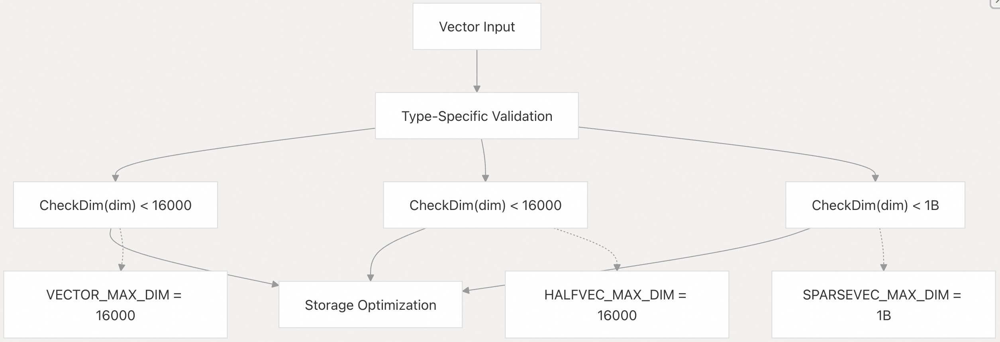
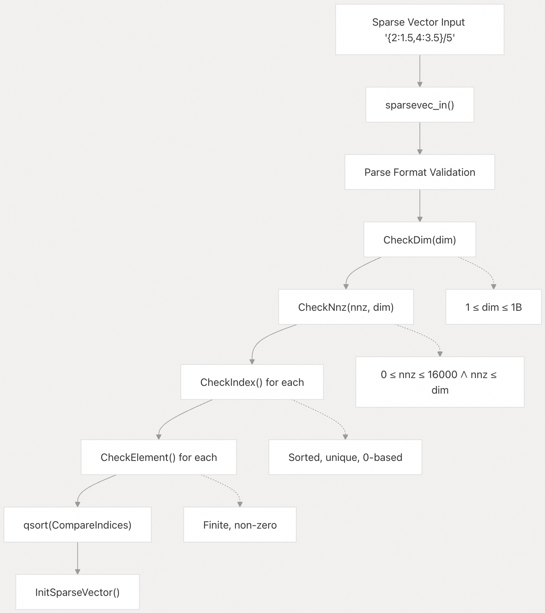
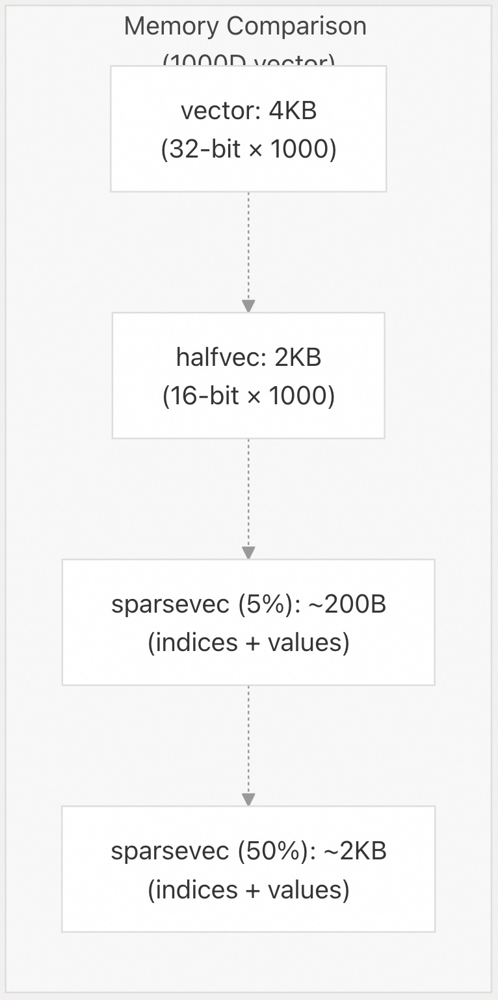
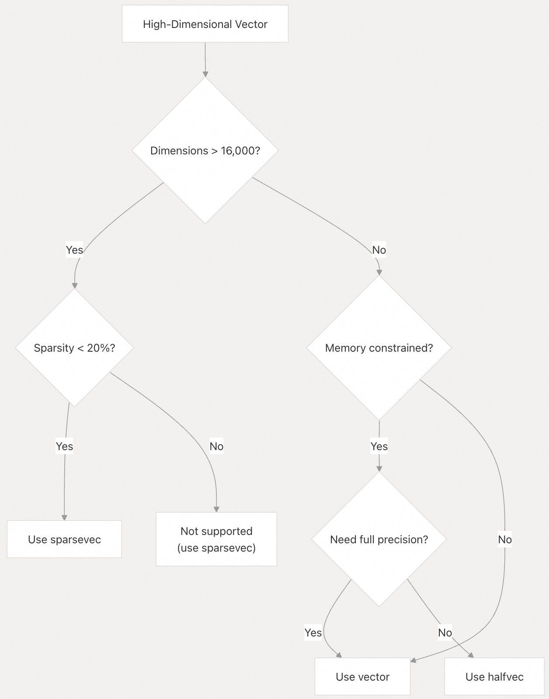
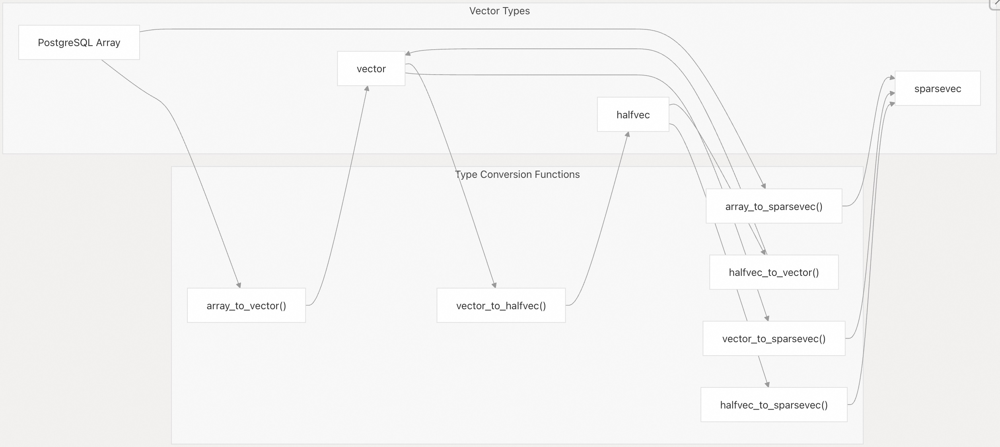
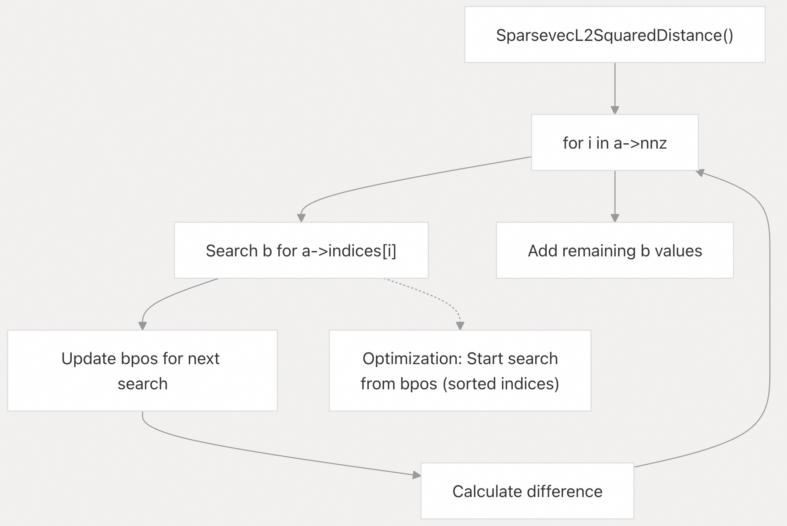

## pgvector 源码学习: 6.1 处理大型向量（Working with Large Vectors）  
  
### 作者  
digoal  
  
### 日期  
2025-11-05  
  
### 标签  
pgvector , 源码学习  
  
----  
  
## 背景  
本文介绍 `pgvector` 中处理**高维向量**（high-dimensional vectors）的策略，包括**维度限制**（dimension limits）、**稀疏表示**（sparse representations）和**内存优化技术**（memory optimization techniques）。  
  
## 了解维度限制（Understanding Dimension Limits）  
  
`pgvector` 根据**向量类型**（vector type）支持不同的最大维度，每种类型都针对不同的**用例**（use cases）和**内存限制**（memory constraints）进行了优化。  
  
### 按类型划分的维度约束（Dimension Constraints by Type）  
  
| 向量类型 (Vector Type) | 最大维度 (Maximum Dimensions) | 元素大小 (Element Size) | 用例 (Use Case) |  
| :--- | :--- | :--- | :--- |  
| `vector` | 16,000 | 32位浮点数 (32-bit float) | 标准**密集向量** (Standard dense vectors) |  
| `halfvec` | 16,000 | 16位浮点数 (16-bit float) | **内存优化** (Memory-optimized) 的密集向量 |  
| `sparsevec` | 1,000,000,000 | 32位浮点数 (32-bit float) | **高维稀疏数据** (High-dimensional sparse data) |  
| `bit` | 64,000 | 1 位 (1 bit) | **二进制量化向量** (Binary quantized vectors) |  
  
这些维度限制在代码库的多个层面得到执行（enforced）：  
  
    
  
**来源（Sources）:**  
[`src/vector.h` 4](https://github.com/pgvector/pgvector/blob/d823c445/src/vector.h#L4-L4)  
[`src/halfvec.h` 53](https://github.com/pgvector/pgvector/blob/d823c445/src/halfvec.h#L53-L53)  
[`src/sparsevec.h` 4](https://github.com/pgvector/pgvector/blob/d823c445/src/sparsevec.h#L4-L4)  
[`src/sparsevec.c` 54-65](https://github.com/pgvector/pgvector/blob/d823c445/src/sparsevec.c#L54-L65)  
  
## 针对大型维度的稀疏向量架构（Sparse Vector Architecture for Large Dimensions）  
  
对于维度超过 16,000 或包含许多零值（zero values）的向量，`sparsevec` 提供了一种高效的**压缩表示**（compressed representation），它仅存储**非零元素**（non-zero elements）。  
  
### 内部内存布局（Internal Memory Layout）  
  
    
  
**来源（Sources）:**  
[`src/sparsevec.h` 15-22](https://github.com/pgvector/pgvector/blob/d823c445/src/sparsevec.h#L15-L22)  
[`src/sparsevec.h` 26-36](https://github.com/pgvector/pgvector/blob/d823c445/src/sparsevec.h#L26-L36)  
  
### 稀疏向量创建和验证（Sparse Vector Creation and Validation）  
  
稀疏向量的实现包含了全面的**验证**（validation）以维护**数据完整性**（data integrity）：  
  
    
  
**来源（Sources）:**  
[`src/sparsevec.c` 54-87](https://github.com/pgvector/pgvector/blob/d823c445/src/sparsevec.c#L54-L87)  
[`src/sparsevec.c` 92-116](https://github.com/pgvector/pgvector/blob/d823c445/src/sparsevec.c#L92-L116)  
[`src/sparsevec.c` 187-389](https://github.com/pgvector/pgvector/blob/d823c445/src/sparsevec.c#L187-L389)  
  
## 内存优化策略（Memory Optimization Strategies）  
  
### 密集与稀疏内存使用对比（Dense vs Sparse Memory Usage）  
  
**密集表示**（Dense）和**稀疏表示**（Sparse）之间的选择取决于**稀疏比率**（sparsity ratio）和**维度计数**（dimension count）：  
  
| 场景 (Scenario) | 密集内存 (Dense Memory) | 稀疏内存 (Sparse Memory) | 建议 (Recommendation) |  
| :--- | :--- | :--- | :--- |  
| 1000维 (D), 5% 稀疏 | 4KB | \~200B + 开销 (overhead) | 使用 `sparsevec` |  
| 1000维 (D), 50% 稀疏 | 4KB | \~2KB + 开销 (overhead) | 使用 `vector` |  
| 100,000维 (D), 1% 稀疏 | 400KB | \~4KB + 开销 (overhead) | 使用 `sparsevec` |  
| 100,000维 (D), 20% 稀疏 | 400KB | \~80KB + 开销 (overhead) | 使用 `sparsevec` |  
  
### 半精度优化（Half-Precision Optimization）  
  
对于内存受限的**密集向量**（dense vectors），`halfvec` 提供了 50% 的**内存缩减**（memory reduction）：  
  
    
  
**来源（Sources）:**  
[`src/halfvec.h` 55](https://github.com/pgvector/pgvector/blob/d823c445/src/halfvec.h#L55-L55)  
[`src/vector.h` 6](https://github.com/pgvector/pgvector/blob/d823c445/src/vector.h#L6-L6)  
[`src/sparsevec.h` 26-30](https://github.com/pgvector/pgvector/blob/d823c445/src/sparsevec.h#L26-L30)  
  
## 向量类型选择逻辑（Vector Type Selection Logic）  
  
### 大型向量的决策树（Decision Tree for Large Vectors）  
  
    
  
**来源（Sources）:**  
[`src/sparsevec.c` 598-605](https://github.com/pgvector/pgvector/blob/d823c445/src/sparsevec.c#L598-L605)  
[`src/sparsevec.c` 641-648](https://github.com/pgvector/pgvector/blob/d823c445/src/sparsevec.c#L641-L648)  
  
## 向量类型之间的转换（Conversion Between Vector Types）  
  
`pgvector` 提供了**向量类型**（vector types）之间的**无缝转换**（seamless conversion），以针对不同的**用例**（use cases）进行优化：  
  
### 转换函数映射（Conversion Function Mapping）  
  
    
  
**来源（Sources）:**  
[`src/sparsevec.c` 586-624](https://github.com/pgvector/pgvector/blob/d823c445/src/sparsevec.c#L586-L624)  
[`src/sparsevec.c` 629-667](https://github.com/pgvector/pgvector/blob/d823c445/src/sparsevec.c#L629-L667)  
[`src/sparsevec.c` 672-798](https://github.com/pgvector/pgvector/blob/d823c445/src/sparsevec.c#L672-L798)  
  
## 性能特征（Performance Characteristics）  
  
### 距离计算复杂度（Distance Computation Complexity）  
  
稀疏向量的实现通过利用**排序索引结构**（sorted index structure）来优化**距离计算**（distance calculations）：  
  
| 操作 (Operation) | 密集 O(n) (Dense O(n)) | 稀疏 O(nnz₁ + nnz₂) (Sparse O(nnz₁ + nnz₂)) | 优化 (Optimization) |  
| :--- | :--- | :--- | :--- |  
| L2 距离 (L2 Distance) | O(n) | O(nnz₁ + nnz₂) | 跳过零值比较 (Skip zero comparisons) |  
| 内积 (Inner Product) | O(n) | O(min(nnz₁, nnz₂)) | 提前终止 (Early termination) |  
| 余弦距离 (Cosine Distance) | O(n) | O(nnz₁ + nnz₂) | 单独的**范数计算** (Separate norm calculation) |  
  
### 稀疏距离算法结构（Sparse Distance Algorithm Structure）  
  
   
  
**来源（Sources）:**  
[`src/sparsevec.c` 804-846](https://github.com/pgvector/pgvector/blob/d823c445/src/sparsevec.c#L804-L846)  
[`src/sparsevec.c` 882-913](https://github.com/pgvector/pgvector/blob/d823c445/src/sparsevec.c#L882-L913)  
  
## 大型向量的最佳实践（Best Practices for Large Vectors）  
  
### 1\. 根据用例选择合适的类型（Choose Appropriate Type Based on Use Case）  
  
  * **来自神经网络的嵌入**（Embeddings from neural networks）（≤16K 维度）：使用 `vector` 获取**全精度**（full precision），或使用 `halfvec` 进行**内存优化**（memory optimization）。  
  * **TF-IDF** 或 **BoW 向量**（Bag-of-Words vectors）（\>16K 维度，稀疏）：使用 `sparsevec`。  
  * **二进制特征**（Binary features）或**量化嵌入**（quantized embeddings）：使用 `bit` 向量。  
  
### 2\. 利用稀疏向量的特性（Leverage Sparse Vector Features）  
  
  * 仅存储**非零元素**（non-zero elements）以最小化**内存使用**（memory usage）。  
  * 利用跳过零计算的**优化距离函数**（optimized distance functions）。  
  * 在**预处理**（preprocessing）时使用**数组转稀疏**（array-to-sparse）转换函数：`array_to_sparsevec()`。  
  
### 3\. 大型向量的索引策略（Index Strategy for Large Vectors）  
  
对于超出典型**索引限制**（index limits）的稀疏向量，请考虑：  
  
  * 使用带有合适 `ef_construction` 和 `m` 参数的 **HNSW 索引**（HNSW indexes）。  
  * 对于极**高维稀疏数据**（very high-dimensional sparse data），**IVFFlat** 可能效果较差。  
  * 对于**小结果集**（small result sets），**顺序扫描**（Sequential scans）可能具有竞争力（competitive）。  
  
**来源（Sources）:**  
[`src/sparsevec.c` 138-151](https://github.com/pgvector/pgvector/blob/d823c445/src/sparsevec.c#L138-L151)  
[`test/sql/cast.sql` 41-82](https://github.com/pgvector/pgvector/blob/d823c445/test/sql/cast.sql#L41-L82)  
[`test/expected/cast.out` 143-278](https://github.com/pgvector/pgvector/blob/d823c445/test/expected/cast.out#L143-L278)  
    
#### [期望 PostgreSQL|开源PolarDB 增加什么功能?](https://github.com/digoal/blog/issues/76 "269ac3d1c492e938c0191101c7238216")
  
  
#### [PolarDB 开源数据库](https://openpolardb.com/home "57258f76c37864c6e6d23383d05714ea")
  
  
#### [PolarDB 学习图谱](https://www.aliyun.com/database/openpolardb/activity "8642f60e04ed0c814bf9cb9677976bd4")
  
  
#### [PostgreSQL 解决方案集合](../201706/20170601_02.md "40cff096e9ed7122c512b35d8561d9c8")
  
  
#### [德哥 / digoal's Github - 公益是一辈子的事.](https://github.com/digoal/blog/blob/master/README.md "22709685feb7cab07d30f30387f0a9ae")
  
  
#### [About 德哥](https://github.com/digoal/blog/blob/master/me/readme.md "a37735981e7704886ffd590565582dd0")
  
  

  
