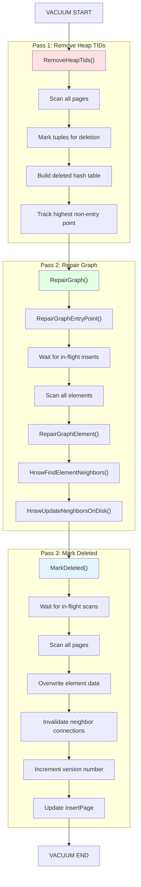
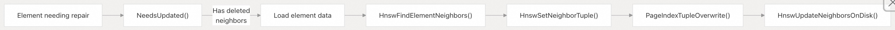
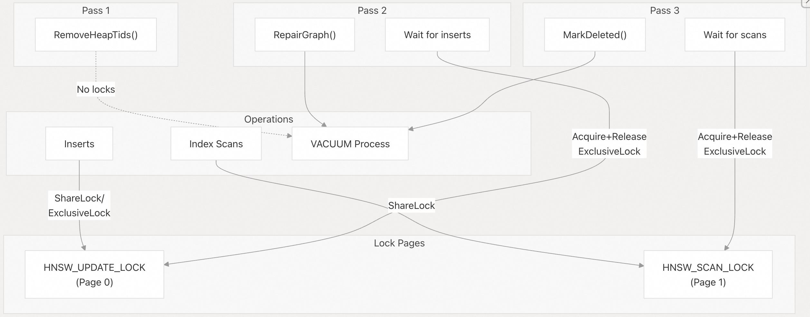

## pgvector 源码学习: 6.2 VACUUM 与索引维护 (Index Maintenance)  
    
### 作者    
digoal    
    
### 日期    
2025-11-05    
    
### 标签    
pgvector , 源码学习    
    
----    
    
## 背景    
本文介绍 `pgvector` 索引的 `VACUUM` 操作和索引维护 (Index Maintenance) 策略。它涵盖了针对 `HNSW` 索引的专门三阶段 (`3-pass`) `VACUUM` 过程、更简单的 `IVFFlat` `VACUUM` 方法，以及何时使用 `REINDEX` 代替 `VACUUM` 进行维护。  
  
## VACUUM 操作概述 (Overview of VACUUM Operations)  
  
如果你对PG的垃圾回收还不是很了解, 可先看看这两篇文章, 为什么回收过程中需要在在内存中存储dead tuple ctid?  
- [《PostgreSQL 垃圾回收参数优化之 - maintenance_work_mem , autovacuum_work_mem》](../201902/20190226_01.md)    
- [《PostgreSQL 17 preview - 使用TidStore数据结构存储dead tupleids, 提升vacuum效率, 为什么PG单表不建议超过8.9亿条记录?》](../202404/20240402_02.md)    
  
PostgreSQL 的 `VACUUM` 过程会从表和索引中删除**死亡元组** (`dead tuples`)。对于 `pgvector` 而言，`VACUUM` 必须应对维护基于图的**近似最近邻** (`approximate nearest neighbor`, **ANN**) 索引的独特挑战，同时还要保持搜索质量 (`search quality`)。  
  
### 索引类型和 VACUUM 行为 (Index Types and Vacuum Behavior)  
  
| 索引类型 (`Index Type`) | VACUUM 策略 (`Vacuum Strategy`) | 复杂度 (`Complexity`) | 主要挑战 (`Key Challenge`) |  
| :--- | :--- | :--- | :--- |  
| `HNSW` | 三阶段 (`3-pass`) 过程 | 高 | 维护图连接性 (`Maintaining graph connectivity`) |  
| `IVFFlat` | 批量删除 (`Bulk delete`) | 中 | 清理倒排列表 (`Cleaning inverted lists`) |  
  
**来源:** [`src/hnswvacuum.c` 1-659](https://github.com/pgvector/pgvector/blob/d823c445/src/hnswvacuum.c#L1-L659) [`README.md` 726-733](https://github.com/pgvector/pgvector/blob/d823c445/README.md#L726-L733)  
  
## HNSW VACUUM：三阶段过程 (3-Pass Process)  
  
`HNSW` 索引使用**多层图结构** (`multi-layer graph structure`)，其中元素通过边 (`edges`) 连接。删除元素需要仔细修复这些连接以维持搜索质量 (`search quality`)。`VACUUM` 过程使用三个不同的阶段 (`passes`) 来安全地实现这一目标。  
  

  
**来源:** [`src/hnswvacuum.c` 617-637](https://github.com/pgvector/pgvector/blob/d823c445/src/hnswvacuum.c#L617-L637)  
  
### 第 1 阶段: 移除堆元组 ID (Pass 1: Remove Heap TIDs)  
  
第一阶段识别哪些索引条目引用了已删除的**堆元组** (`heap tuples`)，并为修复过程准备数据结构 (`data structures`)。  
  
**函数:** `RemoveHeapTids()` 位于 [`src/hnswvacuum.c` 26-136](https://github.com/pgvector/pgvector/blob/d823c445/src/hnswvacuum.c#L26-L136)  
  
**过程:**  
  
1.  扫描从 `HNSW_HEAD_BLKNO` 开始的所有元素页 (`element pages`)  
2.  对于每个元素元组 (`element tuple`)，遍历其**堆元组 ID** (`heap TIDs`)（每个元素最多 `HNSW_HEAPTIDS` 个）  
3.  调用回调函数 (`callback function`) 检查每个堆元组 ID 是否应被删除  
4.  移除已删除的堆元组 ID 并压缩数组 (`compacts the array`)  
5.  使用其索引元组 ID (`index TIDs`) 为所有已删除的元素构建一个**哈希表** (`hash table`) (`tidhash`)  
6.  跟踪最高层级非入口点 (`non-entry point`) 元素以供后续使用  
  
**关键数据结构:**  
  
  * `HnswVacuumState.deleted`: **哈希表** (`Hash table`) 存储所有已删除元素的 `ItemPointerData`  
  * `HnswVacuumState.highestPoint`: 不是入口点的最高层级元素  
  * `HnswElementTuple.heaptids[HNSW_HEAPTIDS]`: 数组存储每个元素最多 10 个堆元组 ID (`heap TIDs`)  
  
```  
// From HnswVacuumState structure  
struct HnswVacuumState {  
    tidhash_hash *deleted;          // Hash of deleted element TIDs  
    HnswElementData highestPoint;   // Highest non-entry element  
    // ... other fields  
}  
```  
  
**来源:** [`src/hnswvacuum.c` 26-136](https://github.com/pgvector/pgvector/blob/d823c445/src/hnswvacuum.c#L26-L136) [`src/hnsw.h` 385-408](https://github.com/pgvector/pgvector/blob/d823c445/src/hnsw.h#L385-L408)  
  
### 第 2 阶段: 修复图 (Pass 2: Repair Graph)  
  
第二阶段通过为与已删除元素有连接的元素找到新邻居来修复图结构 (`graph structure`)。这是最复杂和最耗时的阶段 (`pass`)。  
  
**函数:** `RepairGraph()` 位于 [`src/hnswvacuum.c` 322-435](https://github.com/pgvector/pgvector/blob/d823c445/src/hnswvacuum.c#L322-L435)  
  
**锁定策略 (Locking Strategy):**  
  
1.  以**排他模式** (`exclusive mode`) 获取并立即释放 `HNSW_UPDATE_LOCK`，以等待**正在进行的插入** (`in-flight inserts`)  
2.  这确保了在此时间点之前的插入可能拥有即将被删除的邻居  
3.  此时间点之后的插入将不会引用已删除的元素  
  
**入口点修复 (Entry Point Repair):** `RepairGraphEntryPoint()` 位于 [`src/hnswvacuum.c` 238-320](https://github.com/pgvector/pgvector/blob/d823c445/src/hnswvacuum.c#L238-L320)  
  
  * 如果入口点被删除，则用 `highestPoint` 替换它  
  * 如果入口点需要修复，则使用 `highestPoint` 作为搜索起点  
  * 必要时使用 `HNSW_UPDATE_ENTRY_ALWAYS` 强制更新入口点  
  
**元素修复 (Element Repair):** `RepairGraphElement()` 位于 [`src/hnswvacuum.c` 186-236](https://github.com/pgvector/pgvector/blob/d823c445/src/hnswvacuum.c#L186-L236)  
  
1.  调用 `HnswFindElementNeighbors()` 查找新邻居，跳过元素自身  
2.  创建一个具有修复连接的新 `HnswNeighborTuple`  
3.  使用 `PageIndexTupleOverwrite()` 覆盖旧的邻居元组  
4.  调用 `HnswUpdateNeighborsOnDisk()` 更新**双向连接** (`bidirectional connections`)  
  
**邻居信息更新流程(Neighbor Update Process):**    
  
  
  
**确定是否需要修复 (Determining if Repair is Needed):** `NeedsUpdated()` 位于 [`src/hnswvacuum.c` 141-182](https://github.com/pgvector/pgvector/blob/d823c445/src/hnswvacuum.c#L141-L182)  
  
  * 它的任何邻居都在 `deleted` 哈希表 (`hash table`) 中  
  * 第 0 层 (`Layer 0`) 未满（表明在插入过程中有候选元素被删除）  
  
**来源:** [`src/hnswvacuum.c` 141-435](https://github.com/pgvector/pgvector/blob/d823c445/src/hnswvacuum.c#L141-L435) [`src/hnswinsert.c` 539-574](https://github.com/pgvector/pgvector/blob/d823c445/src/hnswinsert.c#L539-L574)  
  
### 第 3 阶段: 标记为删除 (Pass 3: Mark Deleted)  
  
最后阶段将元素标记为已删除 (`Mark Deleted`)，并回收其空间供将来插入。此阶段必须等待所有**正在进行的扫描** (`in-flight scans`) 完成，以避免返回已删除的元组 (`deleted tuples`)。  
  
**函数:** `MarkDeleted()` 位于 [`src/hnswvacuum.c` 437-569](https://github.com/pgvector/pgvector/blob/d823c445/src/hnswvacuum.c#L437-L569)  
  
**锁定策略 (Locking Strategy):**  
  
1.  以**排他模式** (`exclusive mode`) 获取并释放 `HNSW_SCAN_LOCK`  
2.  确保在此时间点之前的扫描可能包含即将被删除的元组  
3.  此时间点之后的扫描将不会看到已删除的元素（图已修复）  
  
**删除过程 (Deletion Process):**  
  
1.  扫描从 `HNSW_HEAD_BLKNO` 开始的所有页面  
2.  对于每个没有有效堆元组 ID (`heap TIDs`) 的元素:  
      * 设置 `etup->deleted = 1`  
      * 将**向量数据** (`vector data`) 清零: `MemSet(&etup->data, 0, VARSIZE_ANY(&etup->data))`  
      * 使所有邻居连接**失效** (`Invalidates`)  
      * 递增**版本号** (`version number`)（在 15 处**回绕** (`wraps`)）  
3.  跟踪第一个包含空闲空间 (`free space`) 的页面作为 `insertPage`  
4.  使用新的 `insertPage` 更新**元页面** (`metapage`) 以供将来插入  
  
**版本编号 (Version Numbering):**  
  
  * 版本字段防止在**迭代扫描** (`iterative scans`) 期间出现不正确的读取:  
  * 存储在 `HnswElementTuple.version` 和 `HnswNeighborTuple.version` 中  
  * 在删除时递增: `etup->version++`  
  * 在 15 处**回绕** (`Wraps`) 以保留未来的位使用  
  * 由 `HnswLoadNeighborTids()` 用于检测**过时读取** (`stale reads`)  
  
```  
// Version check in HnswLoadNeighborTids  
if (ntup->version != element->version || ntup->count != expected)  
    return false;  // Tuple changed, abort  
```  
  
**来源:** [`src/hnswvacuum.c` 437-569](https://github.com/pgvector/pgvector/blob/d823c445/src/hnswvacuum.c#L437-L569) [`src/hnswutils.c` 750-780](https://github.com/pgvector/pgvector/blob/d823c445/src/hnswutils.c#L750-L780)  
  
### VACUUM 入口点 (Vacuum Entry Points)  
  
`VACUUM` 过程是通过 PostgreSQL 的标准 `VACUUM` 接口启动的:  
  
  * **`hnswbulkdelete()`** 位于 [`src/hnswvacuum.c` 617-637](https://github.com/pgvector/pgvector/blob/d823c445/src/hnswvacuum.c#L617-L637)  
      * 在 `VACUUM` 期间调用以删除元组  
      * 初始化 `HnswVacuumState`  
      * 执行所有三个阶段  
      * 返回包含统计信息的 `IndexBulkDeleteResult`  
  * **`hnswvacuumcleanup()`** 位于 [`src/hnswvacuum.c` 642-658](https://github.com/pgvector/pgvector/blob/d823c445/src/hnswvacuum.c#L642-L658)  
      * 在批量删除 (`bulk delete`) 后调用以完成清理 (`cleanup`)  
      * 更新 `num_pages` 统计信息 (`statistic`)  
      * 如果没有更改（未调用 `ambulkdelete`），则返回 `NULL`  
  
**来源:** [`src/hnswvacuum.c` 617-658](https://github.com/pgvector/pgvector/blob/d823c445/src/hnswvacuum.c#L617-L658)  
  
## IVFFlat VACUUM 过程 (IVFFlat Vacuum Process)  
  
`IVFFlat` 使用更简单的 `VACUUM` 方法，因为它不维护复杂的图结构 (`graph structure`)。元素是基于 **k 均值聚类** (`k-means clustering`) 组织到**倒排列表** (`inverted lists`) 中的。  
  
**批量删除 (Bulk Delete):** `ivfbulkdelete()`  
  
1.  扫描所有列表页 (`list pages`)  
2.  对于每个元组，检查堆元组 ID (`heap TID`) 是否应被删除  
3.  从元组中移除已删除的堆元组 ID  
4.  当所有堆元组 ID 都被移除时，将元组标记为已删除  
5.  不需要图修复（列表是独立的）  
  
**清理 (Cleanup):** `ivfvacuumcleanup()`  
  
  * 更新统计信息  
  * 不需要复杂的修复阶段 (`repair phase`)  
  
**来源:** `README` 上下文表明 `IVFFlat` 具有更简单的“批量删除 (`Bulk delete`)、`VACUUM` 清理 (`Vacuum cleanup`)”  
  
## VACUUM 性能考量 (Vacuum Performance Considerations)  
  
### VACUUM 对比 REINDEX (VACUUM vs REINDEX)  
  
对于 `HNSW` 索引，`VACUUM` 可能很慢，因为它必须修复图连接 (`graph connections`)。`README` 建议先进行**重新索引** (`reindexing`):  
  
```  
REINDEX INDEX CONCURRENTLY index_name;  
VACUUM table_name;  
```  
  
**为什么先 REINDEX:**  
  
  * `REINDEX` 从头开始**重建** (`rebuilds`) 整个索引  
  * 新索引没有已删除的元组 (`deleted tuples`)，因此 `VACUUM` 很快完成  
  * `CONCURRENTLY` 选项允许在重建期间继续查询  
  * 对于大量删除的索引，组合方法更快  
  
**何时使用 (When to Use Each):**  
  
| 操作 (`Operation`) | 使用时机 (`Use When`) | 速度 (`Speed`) | 停机时间 (`Downtime`) |  
| :--- | :--- | :--- | :--- |  
| 仅 `VACUUM` | 少量删除（\< 10%） | 慢 | 无 (`None`) |  
| `REINDEX CONCURRENTLY` | 大量删除（\> 20%） | 快 | 无 (`None`) |  
| `REINDEX` | 维护窗口可用 | 最快 | 是 (`Yes`) |  
  
**来源:** [`README.md` 726-733](https://github.com/pgvector/pgvector/blob/d823c445/README.md#L726-L733)  
  
### 内存和缓冲区策略 (Memory and Buffer Strategy)  
  
`VACUUM` 过程使用了几种**内存优化技术** (`memory optimization techniques`):  
  
**缓冲区访问策略 (Buffer Access Strategy):**  
  
```  
vacuumstate->bas = GetAccessStrategy(BAS_BULKREAD);  
```  
  
原理参考:   
- [《PostgreSQL 大表扫描策略 - BAS_BULKREAD , synchronize_seqscans , ring buffer 代替 buffer pool》](../201804/20180414_02.md)    
- [《PostgreSQL 18 preview - 调整 BAS_BULKREAD 算法适配 并发IO请求 和 合并IO大小》](../202504/20250408_10.md)    
  
  * 对**顺序页面扫描** (`sequential page scans`) 使用 `BAS_BULKREAD` 策略  
  * 防止 `VACUUM` **污染** (`polluting`) **共享缓冲区缓存** (`shared buffer cache`)  
  * 在 `HnswVacuumState` 中定义，位于 [`src/hnsw.h` 402]()  
  
**内存上下文 (Memory Context):**  
  
```  
vacuumstate->tmpCtx = AllocSetContextCreate(  
    CurrentMemoryContext,  
    "Hnsw vacuum temporary context",  
    ALLOCSET_DEFAULT_SIZES  
);  
```  
  
  * 用于临时分配 (`temporary allocations`) 的单独上下文 (`context`)  
  * 处理完每个页面后**重置** (`Reset`) 以防止内存增长 (`memory growth`)  
  * 用于第 2 阶段修复，位于 [`src/hnswvacuum.c` 354-433](https://github.com/pgvector/pgvector/blob/d823c445/src/hnswvacuum.c#L354-L433)  
  
**延迟点 (Delay Points):**  
  
```  
vacuum_delay_point();  
```  
  
  * 在页面操作之间调用以**限制 I/O** (`throttle I/O`)  
  * 遵守 `vacuum_cost_delay` 及相关设置  
  * 防止 `VACUUM` **压倒** (`overwhelming`) I/O 系统  
  
**来源:** [`src/hnswvacuum.c` 574-612](https://github.com/pgvector/pgvector/blob/d823c445/src/hnswvacuum.c#L574-L612) [`src/hnsw.h` 385-408](https://github.com/pgvector/pgvector/blob/d823c445/src/hnsw.h#L385-L408)  
  
### 并行 VACUUM (Parallel VACUUM)  
  
PostgreSQL 支持某些操作的**并行 `VACUUM`** (`parallel vacuum`)。对于 `HNSW`:  
  
  * 第 1 阶段 (`RemoveHeapTIDs`) 可以使用**并行工作者** (`parallel workers`) 进行扫描  
  * 第 2 阶段 (`RepairGraph`) 由于依赖关系而本质上是**顺序的** (`sequential`)  
  * 第 3 阶段 (`MarkDeleted`) 需要排他锁 (`exclusive locks`)，从而限制了并行性 (`parallelism`)  
  
**来源:** 从 `VACUUM` 结构和 PostgreSQL 并行 `VACUUM` 模式推断  
  
## 锁定和并发 (Locking and Concurrency)  
  
`HNSW VACUUM` 使用**页面级锁** (`page-level locks`) 来与插入 (`inserts`) 和扫描 (`scans`) 协调，而不会不必要地阻塞它们。  
  
### 锁类型和目的 (Lock Types and Purposes)  
  
  
  
| 锁 (`Lock`) | 页面 (`Page`) | 目的 (`Purpose`) | 使用者 (`Used By`) |  
| :--- | :--- | :--- | :--- |  
| `HNSW_UPDATE_LOCK` | 0 | 协调插入和入口点更新 | 插入 (`Inserts`)、第 2 阶段 (`Pass 2`) |  
| `HNSW_SCAN_LOCK` | 1 | 协调扫描与元组删除 | 扫描 (`Scans`)、第 3 阶段 (`Pass 3`) |  
  
**为何使用页面锁:**  
  
  * 对页面编号 0 和 1 使用 `LockPage()` 和 `UnlockPage()`  
  * 页面锁不干扰**缓冲区锁** (`buffer locks`) 或常规读取  
  * 允许**细粒度协调** (`fine-grained coordination`)，而不阻塞大多数操作  
  
**来源:** [`src/hnswvacuum.c` 260-315](https://github.com/pgvector/pgvector/blob/d823c445/src/hnswvacuum.c#L260-L315) [`src/hnswvacuum.c` 336-337](https://github.com/pgvector/pgvector/blob/d823c445/src/hnswvacuum.c#L336-L337) [`src/hnswvacuum.c` 453-454](https://github.com/pgvector/pgvector/blob/d823c445/src/hnswvacuum.c#L453-L454) [`src/hnswinsert.c` 704-721](https://github.com/pgvector/pgvector/blob/d823c445/src/hnswinsert.c#L704-L721) [`src/hnswscan.c` 213-218](https://github.com/pgvector/pgvector/blob/d823c445/src/hnswscan.c#L213-L218)  
  
### 插入协调 (第 2 阶段) (Insert Coordination (Pass 2))  
  
在修复图之前，`VACUUM` 必须确保没有正在进行的插入 (`inserts`) 操作可能创建与即将被删除的元素的连接:  
  
```  
// Wait for in-flight inserts to complete  
LockPage(index, HNSW_UPDATE_LOCK, ExclusiveLock);  
UnlockPage(index, HNSW_UPDATE_LOCK, ExclusiveLock);  
```  
  
Timeline:  
  
1.  插入操作以**共享锁** (`ShareLock`) 或**排他锁** (`ExclusiveLock`) 模式获取 `HNSW_UPDATE_LOCK`  
2.  第 2 阶段获取排他锁，等待所有插入完成  
3.  第 2 阶段立即释放锁  
4.  此时间点之后的新插入将不会引用已删除的元素（第 1 阶段已完成）  
  
**来源:** [`src/hnswvacuum.c` 332-337](https://github.com/pgvector/pgvector/blob/d823c445/src/hnswvacuum.c#L332-L337) [`src/hnswinsert.c` 704](https://github.com/pgvector/pgvector/blob/d823c445/src/hnswinsert.c#L704-L704)  
  
### 扫描协调 (第 3 阶段) (Scan Coordination (Pass 3))  
  
在将元组标记为已删除之前，`VACUUM` 必须等待扫描完成，以避免返回已删除的数据:  
  
```  
// Wait for index scans to complete  
LockPage(index, HNSW_SCAN_LOCK, ExclusiveLock);  
UnlockPage(index, HNSW_SCAN_LOCK, ExclusiveLock);  
```  
  
Timeline:  
  
1.  扫描操作以共享锁模式获取 `HNSW_SCAN_LOCK`  
2.  第 3 阶段获取排他锁，等待扫描完成  
3.  第 3 阶段立即释放锁  
4.  此时间点之后的新扫描将不会看到已删除的元组（图已修复）  
  
**来源:** [`src/hnswvacuum.c` 448-454](https://github.com/pgvector/pgvector/blob/d823c445/src/hnswvacuum.c#L448-L454) [`src/hnswscan.c` 213-218](https://github.com/pgvector/pgvector/blob/d823c445/src/hnswscan.c#L213-L218)  
  
### 缓冲区级锁定 (Buffer-Level Locking)  
  
除了页面锁之外，`VACUUM` 在页面修改期间还使用**缓冲区锁** (`buffer locks`):  
  
  * 第 1 阶段 (`RemoveHeapTIDs`)  
  
  ```  
  LockBuffer(buf, BUFFER_LOCK_EXCLUSIVE);  
  // Modify heap TID array  
  GenericXLogFinish(state);  
  ```  
  
  * 第 3 阶段 (`MarkDeleted`)  
  
  ```  
  LockBufferForCleanup(buf);  // Stronger than EXCLUSIVE  
  // Mark tuples as deleted  
  GenericXLogFinish(state);  
  ```  
  
`LockBufferForCleanup()` 提供了最强的锁级别，这是**回收空间** (`reclaim space`) 的 `ambulkdelete` 操作所必需的。它确保没有其他后端**钉住** (`pinned`) 该页面。  
  
**来源:** [`src/hnswvacuum.c` 59](https://github.com/pgvector/pgvector/blob/d823c445/src/hnswvacuum.c#L59-L59) [`src/hnswvacuum.c` 474](https://github.com/pgvector/pgvector/blob/d823c445/src/hnswvacuum.c#L474-L474)  
  
## 监控和统计信息 (Monitoring and Statistics)  
  
`VACUUM` 完成后，可以通过 `IndexBulkDeleteResult` 获取**统计信息** (`statistics`):  
  
**关键统计信息 (Key Statistics):**  
  
| 字段 (`Field`) | 描述 (`Description`) | 设置位置 (`Set In`) |  
| :--- | :--- | :--- |  
| `num_pages` | 索引中的总页数 | `hnswvacuumcleanup` |  
| `tuples_removed` | 已删除的堆元组 ID (`Heap TIDs`) | 第 1 阶段 (`Pass 1`) |  
| `num_index_tuples` | 剩余的索引元组 (`index tuples`) | 第 1 阶段 (`Pass 1`) |  
  
`VACUUM` 过程在执行期间更新这些计数器 (`counters`)。  
  
```  
stats->tuples_removed++;      // When heap TID deleted  
stats->num_index_tuples++;    // When heap TID kept  
```  
  
**来源:** [`src/hnswvacuum.c` 86-92](https://github.com/pgvector/pgvector/blob/d823c445/src/hnswvacuum.c#L86-L92) [`src/hnswvacuum.c` 655](https://github.com/pgvector/pgvector/blob/d823c445/src/hnswvacuum.c#L655-L655)  
  
## 最佳实践 (Best Practices)  
  
### 何时运行 VACUUM (When to Run VACUUM)  
  
**在以下情况下运行 VACUUM:**  
  
  * 许多行已被删除（\> 表的 10%）  
  * 在**批量 DELETE** 操作之后  
  * 检测到**表膨胀** (`Table bloat`)  
  * 查询性能下降 (`Query performance degrades`)  
  
**在以下情况下跳过 VACUUM 并使用 REINDEX:**  
  
  * 大量删除（\> 表的 20%）  
  * 怀疑**索引损坏** (`Index corruption`)  
  * **主版本升级** (`Major version upgrade`)  
  * **重大模式更改** (`Significant schema changes`)  
  
### VACUUM 配置 (VACUUM Configuration)  
  
PostgreSQL 的**自动清理** (`autovacuum`) 将处理日常维护。  
  
```  
-- Increase autovacuum threshold for large tables  
ALTER TABLE items SET (  
    autovacuum_vacuum_scale_factor = 0.1,  
    autovacuum_vacuum_threshold = 10000  
);  
```  
  
或者通过监控表膨胀或索引膨胀率 ( [《别找了, 这才是最好的膨胀检查SQL》](../202502/20250221_01.md)   ) , 适当的时候触发手工回收垃圾:  
  
```  
-- Standard vacuum  
VACUUM VERBOSE table_name;  
  
-- Vacuum specific index (via table)  
VACUUM (VERBOSE, INDEX_CLEANUP ON) table_name;  
  
-- Full vacuum (more aggressive, requires lock)  
VACUUM FULL table_name;  
```  
  
**来源:** PostgreSQL 文档模式和 [`README.md` 726-733](https://github.com/pgvector/pgvector/blob/d823c445/README.md#L726-L733)  
  
### 空间回收 (Space Reclamation)  
  
已删除的元组被标记，但空间不会立即回收 (`reclaimed`)。`insertPage` 指针跟踪第一个包含**空闲空间** (`free space`) 的页面:  
  
**重用策略 (Reuse Strategy):**  
  
1.  第 3 阶段跟踪第一个包含已删除元组的页面  
2.  更新**元页面** (`metapage`) 中的 `metap->insertPage`  
3.  未来的插入通过 `GetInsertPage()` 首先检查此页面  
4.  已删除的空间通过 `HnswFreeOffset()` 重用  
  
**手动空间回收 (Manual Space Reclamation):**  
  
  * 如果空间重用不足:  
    ```sql  
    -- Rebuild index to reclaim all space  
    REINDEX INDEX CONCURRENTLY index_name;  
    ```  
  
**来源:** [`src/hnswvacuum.c` 498-554](https://github.com/pgvector/pgvector/blob/d823c445/src/hnswvacuum.c#L498-L554) [`src/hnswinsert.c` 15-33](https://github.com/pgvector/pgvector/blob/d823c445/src/hnswinsert.c#L15-L33) [`src/hnswinsert.c` 38-110](https://github.com/pgvector/pgvector/blob/d823c445/src/hnswinsert.c#L38-L110)  
  
  
# 附录: hnsw索引`HnswElementTuple`中的版本号  
您询问的是在 VACUUM 和索引维护相关代码中"Increments the version number (wraps at 15)"这句话里的"15"是什么意思。   
  
这个"15"是版本号的最大值。 在 HNSW 索引的 vacuum 操作中, 当标记元素为已删除时, 代码会递增版本号(`etup->version++`), 如果版本号超过 15, 就会重置为 1(`if (etup->version > 15) etup->version = 1`)。    
  
这个版本号存储在 `HnswElementTuple` 结构体的 `version` 字段中, 该字段是 `uint8` 类型(8位无符号整数)。 虽然 `uint8` 理论上可以存储 0-255 的值, 但代码选择只使用 1-15 这个范围, 保留了一些位用于未来使用, 正如注释所说"Reserve some bits for future use"。    
  
版本号的作用是避免迭代扫描时的不正确读取。当元素和其邻居元组被标记为删除时, 它们会被赋予相同的版本号。 在插入操作重用已删除空间时, 新元组也会继承这个版本号。   
  
## Notes  
  
版本号机制确保了在并发操作中, 如果一个扫描操作读取到的元素和邻居元组版本号不匹配, 就能检测到数据不一致的情况。通过在 1-15 范围内循环使用版本号, 既满足了版本追踪的需求, 又为未来可能的扩展预留了 `uint8` 类型中的其他位。  
  
    
#### [期望 PostgreSQL|开源PolarDB 增加什么功能?](https://github.com/digoal/blog/issues/76 "269ac3d1c492e938c0191101c7238216")
  
  
#### [PolarDB 开源数据库](https://openpolardb.com/home "57258f76c37864c6e6d23383d05714ea")
  
  
#### [PolarDB 学习图谱](https://www.aliyun.com/database/openpolardb/activity "8642f60e04ed0c814bf9cb9677976bd4")
  
  
#### [PostgreSQL 解决方案集合](../201706/20170601_02.md "40cff096e9ed7122c512b35d8561d9c8")
  
  
#### [德哥 / digoal's Github - 公益是一辈子的事.](https://github.com/digoal/blog/blob/master/README.md "22709685feb7cab07d30f30387f0a9ae")
  
  
#### [About 德哥](https://github.com/digoal/blog/blob/master/me/readme.md "a37735981e7704886ffd590565582dd0")
  
  

  
