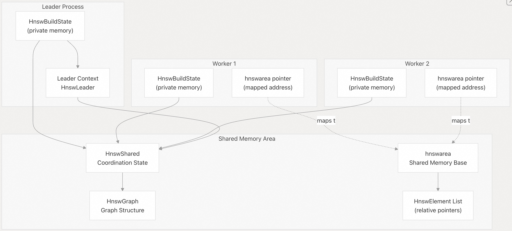
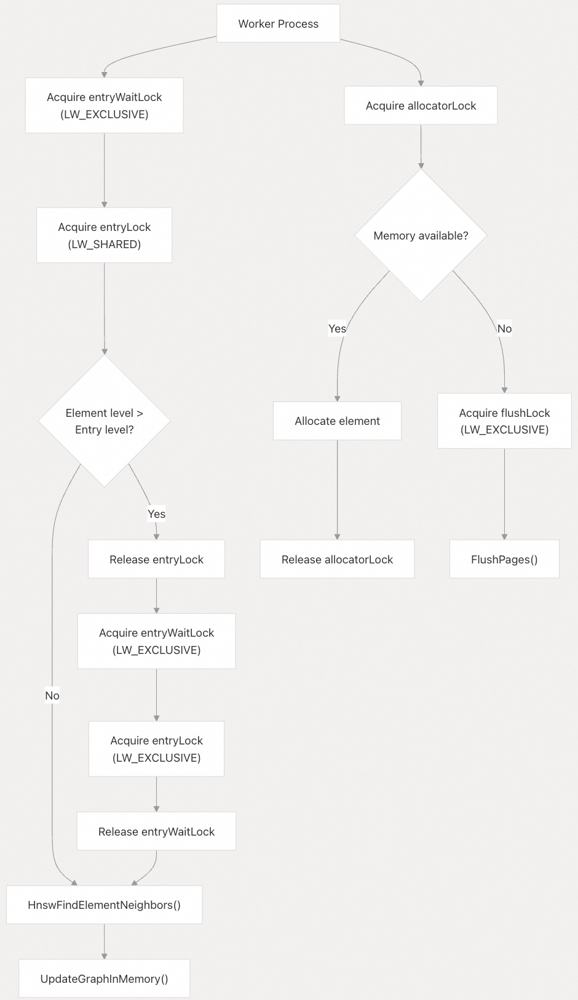
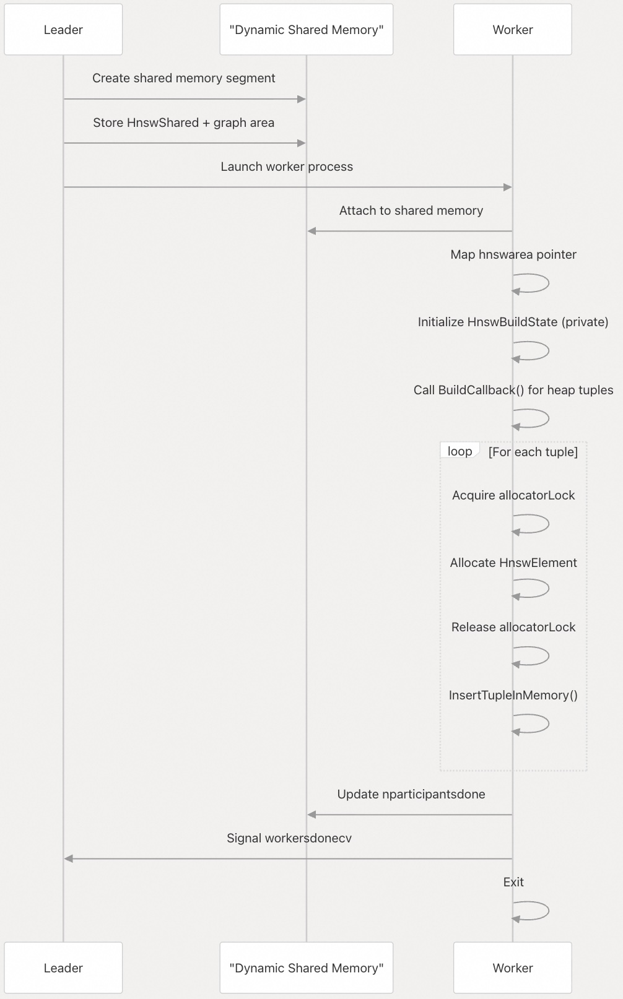
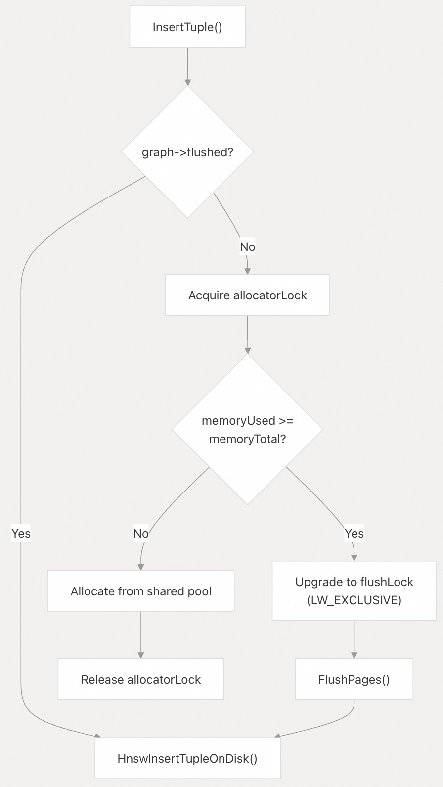
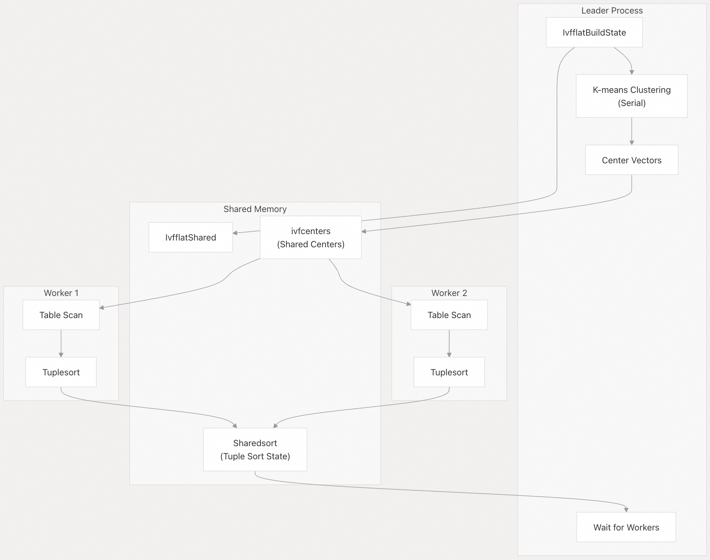
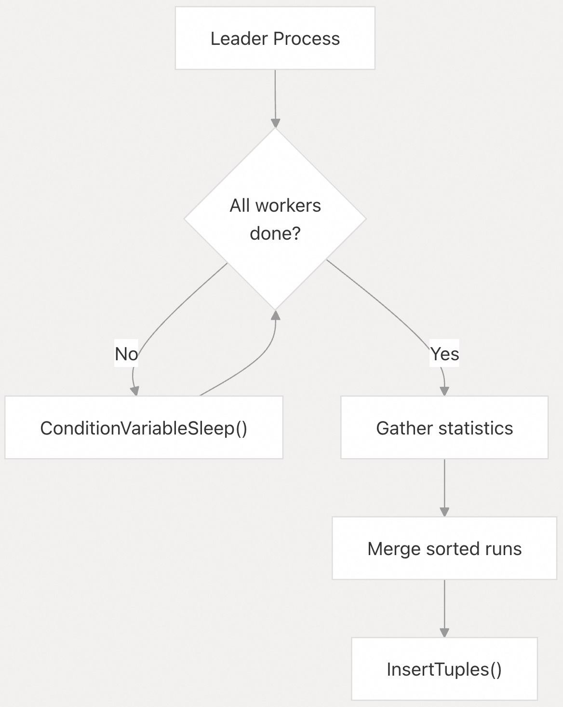

## pgvector 源码学习: 6.3 并行索引构建（Parallel Index Building）  
      
### 作者      
digoal      
      
### 日期      
2025-11-05      
      
### 标签      
pgvector , 源码学习      
      
----      
      
## 背景      
本文介绍 `pgvector` 如何为 `HNSW`（分层导航小世界）和 `IVFFlat` 索引类型并行构建索引。并行索引构建（Parallel index building）允许多个工作进程（worker processes）协作创建索引，从而显著减少大型数据集的构建时间。  
  
强制开启并行, 设置并行度的方法请参考:  
- [《PostgreSQL 11 并行计算算法，参数，强制并行度设置》](../201812/20181218_01.md)    
  
## 概览（Overview）  
  
从 `pgvector` 0.5.0 版本开始，`IVFFlat` 索引支持并行构建；从 0.6.0 版本开始，`HNSW` 索引支持并行构建。并行构建利用 PostgreSQL 的并行索引构建基础设施（parallel index build infrastructure），允许多个工作进程（worker processes）并发地扫描表并构建索引。  
  
| 索引类型（Index Type） | 添加并行支持的版本 | 并行化阶段（Parallelized Phases） |  
| :--- | :--- | :--- |  
| IVFFlat | v0.5.0 | 表扫描（Table scan）、元组排序（tuple sorting） |  
| HNSW | v0.6.0 | 表扫描（Table scan）、内存图结构构建（in-memory graph construction） |  
  
来源: [`CHANGELOG.md` 66-86](https://github.com/pgvector/pgvector/blob/d823c445/CHANGELOG.md#L66-L86) [`README.md` 307-315](https://github.com/pgvector/pgvector/blob/d823c445/README.md#L307-L315) [`README.md` 395-401](https://github.com/pgvector/pgvector/blob/d823c445/README.md#L395-L401)  
  
## 配置参数（Configuration Parameters）  
  
并行索引构建由标准的 PostgreSQL 参数控制：  
  
```  
-- Set number of parallel workers (2 by default, plus 1 leader)  
SET max_parallel_maintenance_workers = 7;  
  
-- May need to increase for large number of workers (8 by default)  
SET max_parallel_workers = 8;  
  
-- HNSW: Increase to fit graph in memory  
SET maintenance_work_mem = '8GB';  
```  
  
| 参数名称 | 默认值 | 描述 |  
| :--- | :--- | :--- |  
| `max_parallel_maintenance_workers` | 2 | 并行索引构建可用的最大工作进程数 |  
| `maintenance_work_mem` | 64MB | 用于并行构建的共享内存大小（HNSW）或用于排序和 k-均值的内存大小（IVFFlat） |  
  
实际使用的工作进程（worker）数量取决于表大小、可用工作进程数以及 `parallel_workers` 存储参数。领导进程（leader process）也参与构建(可通过参数控制)，因此 7 个工作进程意味着总共有 8 个进程。  
  
来源: [`README.md` 307-316](https://github.com/pgvector/pgvector/blob/d823c445/README.md#L307-L316) [`README.md` 395-401](https://github.com/pgvector/pgvector/blob/d823c445/README.md#L395-L401)  
  
## HNSW 并行索引构建（HNSW Parallel Index Building）  
  
### 架构概览（Architecture Overview）  
  
`HNSW` 并行构建主要在内存阶段（in-memory phase）进行，图结构（graph）在完全构建于共享内存（shared memory）中后，再被刷新到磁盘。每个工作进程（worker）扫描堆表（heap table）的一部分，并将向量插入到共享图结构中。  
  
  
  
**图表: HNSW 并行构建架构**  
  
共享内存区域在每个工作进程（worker process）中映射到不同的虚拟地址，因此需要使用相对指针（relative pointers）（从 `hnswarea` 的偏移量），而不是绝对指针。  
  
来源: [`src/hnswbuild.c` 1-36](https://github.com/pgvector/pgvector/blob/d823c445/src/hnswbuild.c#L1-L36) [`src/hnsw.h` 210-239](https://github.com/pgvector/pgvector/blob/d823c445/src/hnsw.h#L210-L239)  
  
### 共享内存结构（Shared Memory Structures）  
  
核心共享结构用于协调并行图结构（graph）的构建：  
  
**HnswShared 结构** [`src/hnsw.h` 210-227](https://github.com/pgvector/pgvector/blob/d823c445/src/hnsw.h#L210-L227)  
  
```  
typedef struct HnswShared  
{  
    /* Immutable state */  
    Oid heaprelid;  
    Oid indexrelid;  
    bool isconcurrent;  
      
    /* Worker progress */  
    ConditionVariable workersdonecv;  
      
    /* Mutex for mutable state */  
    slock_t mutex;  
      
    /* Mutable state */  
    int nparticipantsdone;  
    double reltuples;  
    HnswGraph graphData;  
} HnswShared;  
```  
  
**HnswGraph 结构** [`src/hnsw.h` 188-208](https://github.com/pgvector/pgvector/blob/d823c445/src/hnsw.h#L188-L208)  
  
```  
typedef struct HnswGraph  
{  
    /* Graph state */  
    slock_t lock;              // Protects head pointer  
    HnswElementPtr head;       // Linked list of elements  
    double indtuples;  
      
    /* Entry state */  
    LWLock entryLock;          // Protects entry point  
    LWLock entryWaitLock;      // Wait queue for entry updates  
    HnswElementPtr entryPoint;  
      
    /* Allocations state */  
    LWLock allocatorLock;      // Protects memory allocation  
    Size memoryUsed;  
    Size memoryTotal;  
      
    /* Flushed state */  
    LWLock flushLock;          // Coordinates memory->disk transition  
    bool flushed;  
} HnswGraph;  
```  
  
来源: [`src/hnsw.h` 188-227](https://github.com/pgvector/pgvector/blob/d823c445/src/hnsw.h#L188-L227)  
  
### 工作进程协调和锁定（Worker Coordination and Locking）  
  
  
  
**图表: HNSW 工作进程同步流程**  
  
关键锁定机制：  
  
1.  **元素级锁（Element-level locks）**：每个 `HnswElement` 都有一个 `LWLock`（轻量级锁），用于保护其邻居列表（neighbor lists）和堆元组 ID（heap TIDs）[`src/hnsw.h` 153](https://github.com/pgvector/pgvector/blob/d823c445/src/hnsw.h#L153-L153)  
2.  **入口点锁（Entry point locks）**：两级锁定（`entryLock` 和 `entryWaitLock`）用于防止在入口点可能发生变化时出现并发更新 [`src/hnswbuild.c` 430-467](https://github.com/pgvector/pgvector/blob/d823c445/src/hnswbuild.c#L430-L467)  
3.  **分配器锁（Allocator lock）**：协调内存分配，并在内存耗尽时触发页面刷新（page flushing） [`src/hnswbuild.c` 507-529](https://github.com/pgvector/pgvector/blob/d823c445/src/hnswbuild.c#L507-L529)  
4.  **刷新锁（Flush lock）**：防止在内存到磁盘的转换过程中进行插入操作 [`src/hnswbuild.c` 481-500](https://github.com/pgvector/pgvector/blob/d823c445/src/hnswbuild.c#L481-L500)  
  
来源: [`src/hnswbuild.c` 396-467](https://github.com/pgvector/pgvector/blob/d823c445/src/hnswbuild.c#L396-L467) [`src/hnsw.h` 138-154](https://github.com/pgvector/pgvector/blob/d823c445/src/hnsw.h#L138-L154)  
  
### 工作进程入口点（Worker Entry Point）  
  
工作进程通过 `HnswParallelBuildMain()` 启动 [`src/hnswbuild.c` 1034-1116](https://github.com/pgvector/pgvector/blob/d823c445/src/hnswbuild.c#L1034-L1116)：  
  
  
  
**图表: 工作进程生命周期**  
  
工作进程的主函数：  
  
1.  通过 `DSM`（动态共享内存，Dynamic Shared Memory）附加到共享内存 [`src/hnswbuild.c` 1046-1060](https://github.com/pgvector/pgvector/blob/d823c445/src/hnswbuild.c#L1046-L1060)  
2.  映射 `hnswarea` 基指针，用于相对指针（relative pointer）的计算 [`src/hnswbuild.c` 1062-1065](https://github.com/pgvector/pgvector/blob/d823c445/src/hnswbuild.c#L1062-L1065)  
3.  通过 `table_beginscan_parallel()` 执行并行表扫描 [`src/hnswbuild.c` 1084-1087](https://github.com/pgvector/pgvector/blob/d823c445/src/hnswbuild.c#L1084-L1087)  
4.  构建图结构的本地部分 [`src/hnswbuild.c` 1088-1089](https://github.com/pgvector/pgvector/blob/d823c445/src/hnswbuild.c#L1088-L1089)  
5.  发出完成信号 [`src/hnswbuild.c` 1101-1114](https://github.com/pgvector/pgvector/blob/d823c445/src/hnswbuild.c#L1101-L1114)  
  
来源: [`src/hnswbuild.c` 1034-1116](https://github.com/pgvector/pgvector/blob/d823c445/src/hnswbuild.c#L1034-L1116)  
  
### 内存管理（Memory Management）  
  
`HNSW` 并行构建从一个由 `maintenance_work_mem` 确定大小的共享内存池中分配图元素：  
  
**内存分配流程** [`src/hnswbuild.c` 507-529](https://github.com/pgvector/pgvector/blob/d823c445/src/hnswbuild.c#L507-L529)  
  
  
  
**图表: HNSW 内存分配与刷新**  
  
当内存耗尽时，单个工作进程会将整个内存中的图结构刷新到磁盘 [`src/hnswbuild.c` 290-303](https://github.com/pgvector/pgvector/blob/d823c445/src/hnswbuild.c#L290-L303)，后续的插入操作将在磁盘上进行 [`src/hnswbuild.c` 496-500](https://github.com/pgvector/pgvector/blob/d823c445/src/hnswbuild.c#L496-L500)。发生这种情况时，会向用户显示通知 [`src/hnswbuild.c` 521-524](https://github.com/pgvector/pgvector/blob/d823c445/src/hnswbuild.c#L521-L524)。  
  
来源: [`src/hnswbuild.c` 472-529](https://github.com/pgvector/pgvector/blob/d823c445/src/hnswbuild.c#L472-L529) [`src/hnswbuild.c` 290-303](https://github.com/pgvector/pgvector/blob/d823c445/src/hnswbuild.c#L290-L303)  
  
### 相对指针（Relative Pointers）  
  
由于共享内存（shared memory）在每个工作进程中映射到不同的虚拟地址，因此图结构使用存储为从 `hnswarea` 偏移量的**相对指针**（relative pointers）：  
  
**指针宏** [`src/hnsw.h` 100-108](https://github.com/pgvector/pgvector/blob/d823c445/src/hnsw.h#L100-L108)  
  
```  
#define HnswPtrAccess(base, hp) \  
    ((base) == NULL ? (hp).ptr : relptr_access(base, (hp).relptr))  
  
#define HnswPtrStore(base, hp, value) \  
    ((base) == NULL ? (void) ((hp).ptr = (value)) : \  
                      (void) relptr_store(base, (hp).relptr, value))  
```  
  
当 `base` (`hnswarea`) 为 `NULL` 时，使用常规指针（非并行构建）。否则，使用 `relptr_access()` 和 `relptr_store()` 来使用相对指针。  
  
来源: [`src/hnsw.h` 100-108](https://github.com/pgvector/pgvector/blob/d823c445/src/hnsw.h#L100-L108) [`src/hnswbuild.c` 12-19](https://github.com/pgvector/pgvector/blob/d823c445/src/hnswbuild.c#L12-L19)  
  
## IVFFlat 并行索引构建（IVFFlat Parallel Index Building）  
  
### 架构概览（Architecture Overview）  
  
`IVFFlat` 并行构建与 `HNSW` 不同，它使用了 PostgreSQL 的元组排序基础设施（tuple sorting infrastructure）。工作进程（worker）串行地（在领导进程上）执行 k-均值聚类（k-means clustering），然后并行化表扫描（table scan）并将元组（tuples）排序到列表中。  
  
  
  
**图表: IVFFlat 并行构建架构**  
  
来源: [`src/ivfbuild.c` 616-660](https://github.com/pgvector/pgvector/blob/d823c445/src/ivfbuild.c#L616-L660)  
  
### 构建阶段（Build Phases）  
  
`IVFFlat` 并行构建经历不同的阶段：  
  
| 阶段（Phase） | 描述（Description） | 是否并行化？ |  
| :--- | :--- | :--- |  
| 1. 采样（Sampling） | 为 k-均值（k-means）进行水塘采样（Reservoir sample） | 否（仅限领导进程） |  
| 2. K-均值（K-means） | 使用 Elkan 算法计算聚类中心 | 否（仅限领导进程） |  
| 3. 分配（Assignment） | 扫描堆（heap）并将元组分配到最近的中心 | 是（并行扫描） |  
| 4. 排序（Sorting） | 按列表 ID 对元组进行排序 | 是（并行元组排序 `parallel tuplesort`） |  
| 5. 加载（Loading） | 将排序后的元组插入到索引页面 | 否（仅限领导进程） |  
  
**进度报告** [`src/ivfbuild.c` 408-418](https://github.com/pgvector/pgvector/blob/d823c445/src/ivfbuild.c#L408-L418)：  
  
  * `PROGRESS_IVFFLAT_PHASE_KMEANS`（阶段 2）  
  * `PROGRESS_IVFFLAT_PHASE_ASSIGN`（阶段 3）  
  * `PROGRESS_IVFFLAT_PHASE_LOAD`（阶段 5）  
  
来源: [`src/ivfbuild.c` 117-135](https://github.com/pgvector/pgvector/blob/d823c445/src/ivfbuild.c#L117-L135) [`src/ivfbuild.c` 401-441](https://github.com/pgvector/pgvector/blob/d823c445/src/ivfbuild.c#L401-L441) [`README.md` 411-418](https://github.com/pgvector/pgvector/blob/d823c445/README.md#L411-L418)  
  
### 共享状态（Shared State）  
  
**IvfflatShared 结构** [`src/ivfflat.h` 125-147](https://github.com/pgvector/pgvector/blob/d823c445/src/ivfflat.h#L125-L147)  
  
```  
typedef struct IvfflatShared  
{  
    /* Immutable state */  
    Oid heaprelid;  
    Oid indexrelid;  
    bool isconcurrent;  
    int scantuplesortstates;  
      
    /* Worker coordination */  
    ConditionVariable workersdonecv;  
    slock_t mutex;  
      
    /* Mutable state */  
    int nparticipantsdone;  
    double reltuples;  
    double indtuples;  
} IvfflatShared;  
```  
  
**IvfflatLeader 结构** [`src/ivfflat.h` 152-160](https://github.com/pgvector/pgvector/blob/d823c445/src/ivfflat.h#L152-L160)  
  
```  
typedef struct IvfflatLeader  
{  
    ParallelContext *pcxt;  
    int nparticipanttuplesorts;  
    IvfflatShared *ivfshared;  
    Sharedsort *sharedsort;     // Parallel tuplesort coordination  
    Snapshot snapshot;  
    char *ivfcenters;           // Shared cluster centers  
} IvfflatLeader;  
```  
  
来源: [`src/ivfflat.h` 125-160](https://github.com/pgvector/pgvector/blob/d823c445/src/ivfflat.h#L125-L160)  
  
### 并行扫描和排序（Parallel Scan and Sort）  
  
工作进程执行 `IvfflatParallelScanAndSort()` [`src/ivfbuild.c` 616-660](https://github.com/pgvector/pgvector/blob/d823c445/src/ivfbuild.c#L616-L660)：  
  
  
  
**图表: IVFFlat 工作进程执行流程**  
  
关键函数：  
  
  * **`BuildCallback()`** [`src/ivfbuild.c` 201-223](https://github.com/pgvector/pgvector/blob/d823c445/src/ivfbuild.c#L201-L223)：对每个堆元组（heap tuple）调用，计算最近的中心并添加到排序中  
  * **`AddTupleToSort()`** [`src/ivfbuild.c` 140-198](https://github.com/pgvector/pgvector/blob/d823c445/src/ivfbuild.c#L140-L198)：找到最小距离的中心并创建虚拟元组（virtual tuple）用于排序  
  * **`tuplesort_performsort()`** [`src/ivfbuild.c` 646](https://github.com/pgvector/pgvector/blob/d823c445/src/ivfbuild.c#L646-L646)：执行元组的本地排序  
  
来源: [`src/ivfbuild.c` 616-660](https://github.com/pgvector/pgvector/blob/d823c445/src/ivfbuild.c#L616-L660) [`src/ivfbuild.c` 140-223](https://github.com/pgvector/pgvector/blob/d823c445/src/ivfbuild.c#L140-L223)  
  
### 领导进程协调（Leader Coordination）  
  
领导进程在 `ParallelHeapScan()` 中等待工作进程 [`src/ivfbuild.c` 582-611](https://github.com/pgvector/pgvector/blob/d823c445/src/ivfbuild.c#L582-L611)：  
  
  
  
**图表: 领导进程等待与合并过程**  
  
领导进程：  
  
1.  在 `ivfshared->nparticipantsdone` 上自旋以检查完成情况 [`src/ivfbuild.c` 590-601](https://github.com/pgvector/pgvector/blob/d823c445/src/ivfbuild.c#L590-L601)  
2.  聚合元组计数和统计信息 [`src/ivfbuild.c` 594-598](https://github.com/pgvector/pgvector/blob/d823c445/src/ivfbuild.c#L594-L598)  
3.  通过 `tuplesort_performsort()` 合并并行元组排序（parallel tuplesort）运行结果 [`src/ivfbuild.c` 809-812](https://github.com/pgvector/pgvector/blob/d823c445/src/ivfbuild.c#L809-L812)  
4.  顺序地将元组插入到索引页面 [`src/ivfbuild.c` 251-309](https://github.com/pgvector/pgvector/blob/d823c445/src/ivfbuild.c#L251-L309)  
  
来源: [`src/ivfbuild.c` 582-611](https://github.com/pgvector/pgvector/blob/d823c445/src/ivfbuild.c#L582-L611) [`src/ivfbuild.c` 803-812](https://github.com/pgvector/pgvector/blob/d823c445/src/ivfbuild.c#L803-L812)  
  
## 进度监控（Progress Monitoring）  
  
两种索引类型都通过 PostgreSQL 的索引构建进度报告机制来报告进度：  
  
**HNSW 进度阶段** [`src/hnsw.h` 56-58](https://github.com/pgvector/pgvector/blob/d823c445/src/hnsw.h#L56-L58)  
  
```  
SELECT phase,   
       round(100.0 * blocks_done / nullif(blocks_total, 0), 1) AS "%"  
FROM pg_stat_progress_create_index;  
```  
  
| 阶段 ID | 阶段名称（Phase Name） | 描述（Description） |  
| :--- | :--- | :--- |  
| 1 | `initializing` | 设置并行工作进程 |  
| 2 | `loading tuples` | 将向量插入到图结构中 |  
  
**IVFFlat 进度阶段** [`src/ivfflat.h` 47-51](https://github.com/pgvector/pgvector/blob/d823c445/src/ivfflat.h#L47-L51)  
  
| 阶段 ID | 阶段名称（Phase Name） | 描述（Description） |  
| :--- | :--- | :--- |  
| 1 | `initializing` | 设置并行工作进程 |  
| 2 | `performing k-means` | 计算聚类中心（串行） |  
| 3 | `assigning tuples` | 并行扫描和排序（后台） |  
| 4 | `loading tuples` | 插入排序后的元组 |  
  
`IVFFlat` 只有 `loading tuples` 阶段会显示完成百分比 [`README.md` 418](https://github.com/pgvector/pgvector/blob/d823c445/README.md#L418-L418)  
  
来源: [`README.md` 317-323](https://github.com/pgvector/pgvector/blob/d823c445/README.md#L317-L323) [`README.md` 403-418](https://github.com/pgvector/pgvector/blob/d823c445/README.md#L403-L418) [`src/hnsw.h` 56-58](https://github.com/pgvector/pgvector/blob/d823c445/src/hnsw.h#L56-L58) [`src/ivfflat.h` 47-51](https://github.com/pgvector/pgvector/blob/d823c445/src/ivfflat.h#L47-L51)  
  
## 性能考量（Performance Considerations）  
  
### 工作进程数量选择（Worker Count Selection）  
  
最佳的工作进程数量取决于：  
  
1.  **表大小（Table size）**：PostgreSQL 会根据表大小自动限制工作进程数量  
2.  **CPU 核心数**：工作进程数量超过 CPU 核心数会带来收益递减  
3.  **内存（Memory）**：`HNSW` 需要 `maintenance_work_mem` 用于共享图结构  
4.  **I/O 容量**：工作进程在扫描过程中会竞争磁盘带宽  
  
**典型配置**：  
  
```  
-- Small datasets (< 1M vectors)  
SET max_parallel_maintenance_workers = 2;  
  
-- Medium datasets (1M - 10M vectors)    
SET max_parallel_maintenance_workers = 4;  
  
-- Large datasets (> 10M vectors)  
SET max_parallel_maintenance_workers = 8;  
SET max_parallel_workers = 10;  
```  
  
来源: [`README.md` 307-316](https://github.com/pgvector/pgvector/blob/d823c445/README.md#L307-L316) [`README.md` 395-401](https://github.com/pgvector/pgvector/blob/d823c445/README.md#L395-L401)  
  
### 内存要求（Memory Requirements）  
  
**HNSW**：图结构必须能够放入 `maintenance_work_mem` 中才能保持在内存（in-memory）中。超出时，构建会切换到较慢的磁盘模式（on-disk mode）[`src/hnswbuild.c` 513-524](https://github.com/pgvector/pgvector/blob/d823c445/src/hnswbuild.c#L513-L524)  
  
所需近似内存：  
  
```  
memory ≈ num_vectors × (base_size + m × 2 × pointer_size)  
```  
  
其中：  
  
  * `base_size` ≈ 120 字节（元素元数据 + 值）  
  * `m` = 最大连接参数（默认 16）  
  * `pointer_size` = 8 字节（相对指针 `relative pointer`）  
  
**IVFFlat**：内存要求在 k-均值（k-means）之前进行检查 [`src/ivfkmeans.c` 290-299](https://github.com/pgvector/pgvector/blob/d823c445/src/ivfkmeans.c#L290-L299)。需要以下空间：  
  
  * 采样数组  
  * 中心点数组  
  * 工作缓冲区（下限、上限等）  
  
来源: [`src/hnswbuild.c` 513-529](https://github.com/pgvector/pgvector/blob/d823c445/src/hnswbuild.c#L513-L529) [`src/ivfkmeans.c` 276-299](https://github.com/pgvector/pgvector/blob/d823c445/src/ivfkmeans.c#L276-L299)  
  
### 锁开销（Locking Overhead）  
  
`HNSW` 并行构建会产生以下锁开销（locking overhead）：  
  
1.  **元素锁（Element locks）**：在更新邻居时持有 [`src/hnswbuild.c` 378-393](https://github.com/pgvector/pgvector/blob/d823c445/src/hnswbuild.c#L378-L393)  
2.  **入口锁争用（Entry lock contention）**：对于高层级元素尤其高 [`src/hnswbuild.c` 436-466](https://github.com/pgvector/pgvector/blob/d823c445/src/hnswbuild.c#L436-L466)  
3.  **分配器锁（Allocator lock）**：每次分配时短暂持有 [`src/hnswbuild.c` 507-529](https://github.com/pgvector/pgvector/blob/d823c445/src/hnswbuild.c#L507-L529)  
  
通过优化，锁争用在 v0.6.2 和 v0.7.4 版本中得到减少 [`CHANGELOG.md` 52-54](https://github.com/pgvector/pgvector/blob/d823c445/CHANGELOG.md#L52-L54) [`CHANGELOG.md` 15-18](https://github.com/pgvector/pgvector/blob/d823c445/CHANGELOG.md#L15-L18)  
  
`IVFFlat` 的锁开销最小（在扫描/排序阶段，工作进程独立操作，仅在统计信息更新时使用自旋锁 `spinlock`）。  
  
来源: [`src/hnswbuild.c` 378-393](https://github.com/pgvector/pgvector/blob/d823c445/src/hnswbuild.c#L378-L393) [`CHANGELOG.md` 15-18](https://github.com/pgvector/pgvector/blob/d823c445/CHANGELOG.md#L15-L18) [`CHANGELOG.md` 52-54](https://github.com/pgvector/pgvector/blob/d823c445/CHANGELOG.md#L52-L54)  
  
### 并发构建（Concurrent Builds）  
  
并行构建通过设置 `isconcurrent` 标志来支持并发索引创建（`CREATE INDEX CONCURRENTLY`）[`src/hnsw.h` 215](https://github.com/pgvector/pgvector/blob/d823c445/src/hnsw.h#L215-L215) [`src/ivfflat.h` 130](https://github.com/pgvector/pgvector/blob/d823c445/src/ivfflat.h#L130-L130)。这允许在构建期间修改表，但会增加构建时间。  
  
```  
-- Allow writes during build  
CREATE INDEX CONCURRENTLY ON items USING hnsw (embedding vector_l2_ops);  
```  
  
来源: [`src/hnsw.h` 215](https://github.com/pgvector/pgvector/blob/d823c445/src/hnsw.h#L215-L215) [`src/ivfflat.h` 130](https://github.com/pgvector/pgvector/blob/d823c445/src/ivfflat.h#L130-L130) [`README.md` 690-694](https://github.com/pgvector/pgvector/blob/d823c445/README.md#L690-L694)  
      
#### [期望 PostgreSQL|开源PolarDB 增加什么功能?](https://github.com/digoal/blog/issues/76 "269ac3d1c492e938c0191101c7238216")
  
  
#### [PolarDB 开源数据库](https://openpolardb.com/home "57258f76c37864c6e6d23383d05714ea")
  
  
#### [PolarDB 学习图谱](https://www.aliyun.com/database/openpolardb/activity "8642f60e04ed0c814bf9cb9677976bd4")
  
  
#### [PostgreSQL 解决方案集合](../201706/20170601_02.md "40cff096e9ed7122c512b35d8561d9c8")
  
  
#### [德哥 / digoal's Github - 公益是一辈子的事.](https://github.com/digoal/blog/blob/master/README.md "22709685feb7cab07d30f30387f0a9ae")
  
  
#### [About 德哥](https://github.com/digoal/blog/blob/master/me/readme.md "a37735981e7704886ffd590565582dd0")
  
  

  
