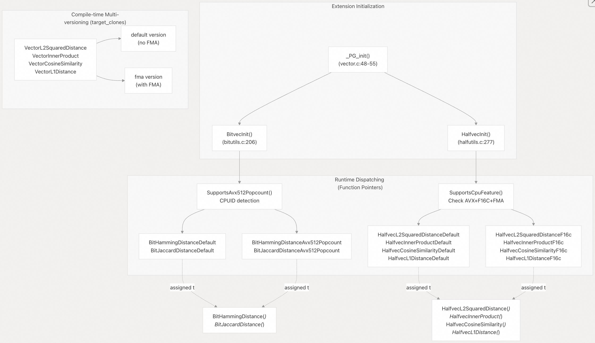
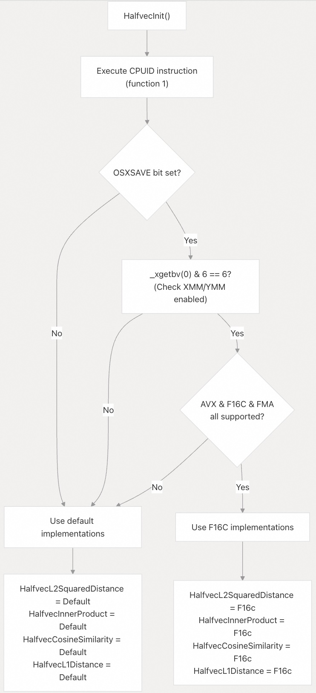
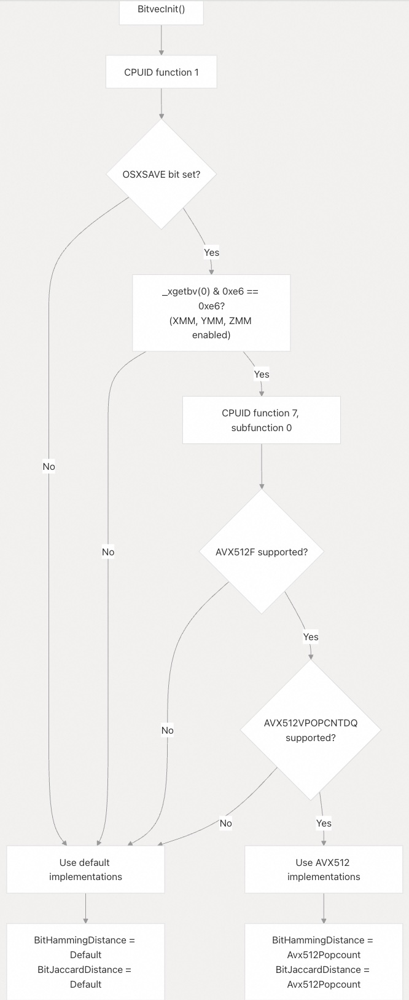
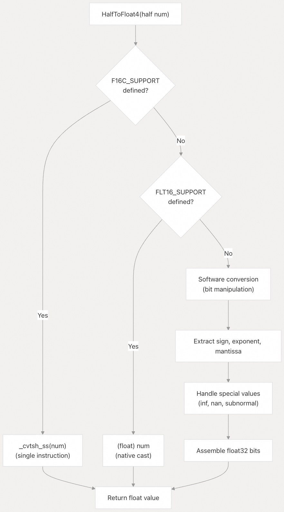
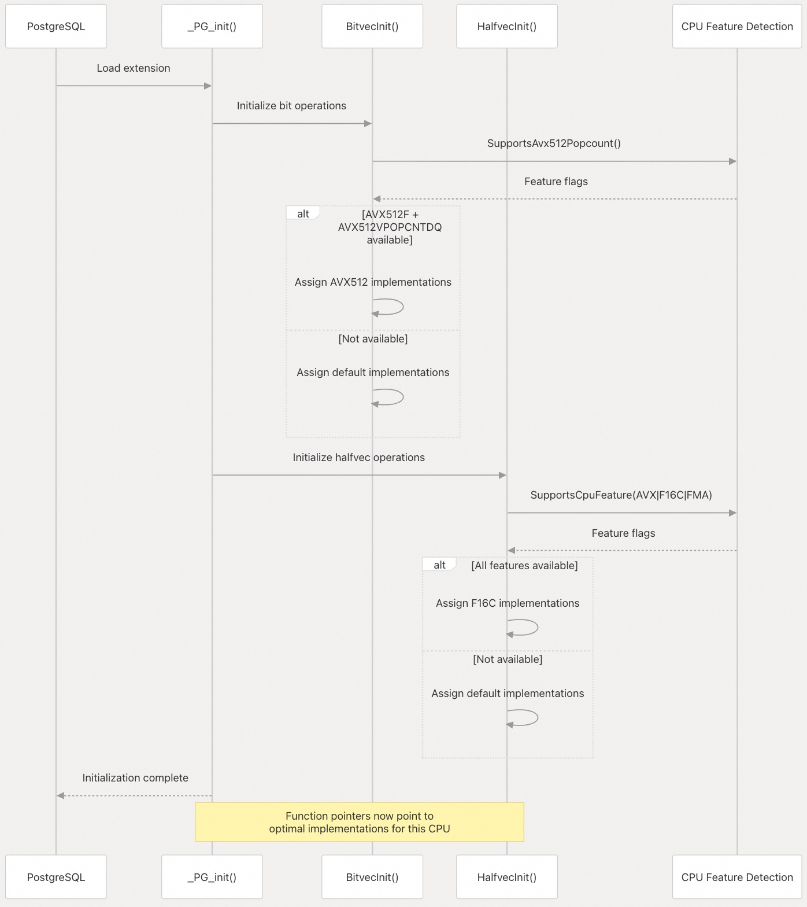

## pgvector 源码学习: 6.4 CPU 优化与调度  
        
### 作者        
digoal        
        
### 日期        
2025-11-05        
        
### 标签        
pgvector , 源码学习        
        
----     
        
## 背景        
本文介绍 `pgvector` 如何利用现代 **CPU features**（CPU 特性）来优化向量距离计算，它通过 **runtime CPU feature detection**（运行时 CPU 特性检测）和 **automatic code dispatching**（自动代码调度）实现。系统会在 **extension initialization time**（扩展初始化时）根据可用的 **CPU instructions**（CPU 指令）选择最高效的实现。  
  
## 概览  
  
`pgvector` 采用两种互补的策略来优化在不同 **CPU architectures**（CPU 架构）上的性能：  
  
1.  **Runtime Dispatching**（运行时调度）: 对于 **half-precision**（半精度）向量类型 `halfvec` 和 **bit vector operations**（位向量操作），系统会在初始化时检测 **CPU features**（CPU 特性），并使用 **function pointers**（函数指针）选择优化的实现。  
2.  **Compile-time Multi-versioning**（编译时多版本）: 对于 **full-precision**（全精度）向量类型 `vector` 的操作，**GCC's** `target_clones` **attribute**（GCC 的 `target_clones` 属性）会生成函数的多个版本，并由编译器自动调度。  
  
| Extension (扩展) | Purpose (目的) | Vector Types (向量类型) | Operations (操作) |  
| :--- | :--- | :--- | :--- |  
| **F16C** | **Half-precision conversion** (半精度转换) | `halfvec` | Convert between **FP16** and **FP32** formats (在 **FP16** 和 **FP32** 格式之间转换) |  
| **FMA** | **Fused multiply-add** (融合乘加) | `vector`, `halfvec` | Optimize **dot products** (点积) and **L2 distance** (L2 距离) (优化点积和 L2 距离) |  
| **AVX** | **256-bit SIMD** (256 位 SIMD) | `halfvec` | Process 8 half-precision values simultaneously (同时处理 8 个半精度值) |  
| **AVX512F** | **512-bit SIMD** (512 位 SIMD) | `bit` | Process 64 bytes (512 bits) simultaneously (同时处理 64 字节/512 位) |  
| **AVX512VPOPCNTDQ** | **Population count** (群体计数/POPCNT) | `bit` | Fast **Hamming distance** (汉明距离) calculation (快速汉明距离计算) |  
| **POPCNT** | **Population count** (群体计数/POPCNT) | `bit` | Fast **bit counting** (位计数) (fallback/备用方案) |  
  
来源:  
[`src/halfutils.c` 1-299](https://github.com/pgvector/pgvector/blob/d823c445/src/halfutils.c#L1-L299)  
[`src/bitutils.c` 1-223](https://github.com/pgvector/pgvector/blob/d823c445/src/bitutils.c#L1-L223)  
[`src/vector.c` 32-36](https://github.com/pgvector/pgvector/blob/d823c445/src/vector.c#L32-L36)  
  
## 调度架构(Dispatching Architecture)  
  
  
  
来源:  
[`src/vector.c` 48-55](https://github.com/pgvector/pgvector/blob/d823c445/src/vector.c#L48-L55)  
[`src/halfutils.c` 277-298](https://github.com/pgvector/pgvector/blob/d823c445/src/halfutils.c#L277-L298)  
[`src/bitutils.c` 206-222](https://github.com/pgvector/pgvector/blob/d823c445/src/bitutils.c#L206-L222)  
  
## 运行时调度: 半向量操作(Runtime Dispatching: Half Vector Operations)  
  
### CPU 特性检测(CPU Feature Detection)  
  
半向量操作使用 **runtime CPU feature detection**（运行时 CPU 特性检测）来选择优化的实现。检测会检查对 **AVX**、**F16C** 和 **FMA** 的支持：  
  
  
  
来源:  
[`src/halfutils.c` 252-298](https://github.com/pgvector/pgvector/blob/d823c445/src/halfutils.c#L252-L298)  
[`src/halfutils.h` 13-16](https://github.com/pgvector/pgvector/blob/d823c445/src/halfutils.h#L13-L16)  
  
### 函数指针声明(Function Pointer Declarations)  
  
系统使用在初始化期间分配的全局 **function pointers**（函数指针）：  
  
| Function Pointer (函数指针) | Signature (签名) | Purpose (目的) |  
| :--- | :--- | :--- |  
| `HalfvecL2SquaredDistance` | `float (*)(int dim, half *ax, half *bx)` | **Squared Euclidean distance** (平方欧几里得距离) |  
| `HalfvecInnerProduct` | `float (*)(int dim, half *ax, half *bx)` | **Dot product** (点积/内积) |  
| `HalfvecCosineSimilarity` | `double (*)(int dim, half *ax, half *bx)` | **Cosine similarity** (余弦相似度) |  
| `HalfvecL1Distance` | `float (*)(int dim, half *ax, half *bx)` | **Manhattan distance** (曼哈顿距离/L1 距离) |  
  
来源:  
[`src/halfutils.h` 13-16](https://github.com/pgvector/pgvector/blob/d823c445/src/halfutils.h#L13-L16)  
[`src/halfutils.c` 22-25](https://github.com/pgvector/pgvector/blob/d823c445/src/halfutils.c#L22-L25)  
  
### F16C SIMD 实现(F16C SIMD Implementation)  
  
**F16C 优化**的实现使用 **AVX intrinsics**（AVX 内联函数）同时处理 8 个半精度值：  
  
**Key operations** (关键操作):  
  
  * `_mm_loadu_si128()`: Load 128 bits (8 half values) **unaligned** (加载 128 位/8 个半精度值，未对齐)  
  * `_mm256_cvtph_ps()`: Convert 8 **FP16** to 8 **FP32** using **F16C** (使用 **F16C** 将 8 个 **FP16** 转换为 8 个 **FP32**)  
  * `_mm256_fmadd_ps()`: **Fused multiply-add** (融合乘加) on 8 **FP32** values (对 8 个 **FP32** 值执行融合乘加)  
  * `_mm256_storeu_ps()`: Store results for **horizontal reduction** (存储结果以进行水平归约)  
  
**Example L2 Distance computation** (L2 距离计算示例) (每次迭代处理 8 个维度):  
  
```  
for (i = 0; i < count; i += 8)  
{  
    Load 8 half values from ax[i:i+8] (从 ax[i:i+8] 加载 8 个半精度值)  
    Load 8 half values from bx[i:i+8] (从 bx[i:i+8] 加载 8 个半精度值)  
    Convert both to 8 float32 values (将两者都转换为 8 个 float32 值)  
    diff = ax_float - bx_float  
    distance += diff * diff  (using FMA / 使用 FMA)  
}  
Horizontal sum of 8 accumulated values (对 8 个累加值进行水平求和)  
Process remaining dimensions with scalar code (使用标量代码处理剩余维度)  
```  
  
来源:  
[`src/halfutils.c` 44-76](https://github.com/pgvector/pgvector/blob/d823c445/src/halfutils.c#L44-L76)  
[`src/halfutils.c` 92-119](https://github.com/pgvector/pgvector/blob/d823c445/src/halfutils.c#L92-L119)  
[`src/halfutils.c` 145-192](https://github.com/pgvector/pgvector/blob/d823c445/src/halfutils.c#L145-L192)  
  
### 条件编译指令(Conditional Compilation Directives)  
  
**F16C** 的实现基于以下 **Conditional Compilation Directives**（条件编译指令）进行条件编译：  
  
| Macro (宏) | Condition (条件) | Source (来源) |  
| :--- | :--- | :--- |  
| `HALFVEC_DISPATCH` | Defined when **runtime dispatching** (运行时调度) is enabled (启用时定义) | **Build system** (构建系统) |  
| `TARGET_F16C` | `__attribute__((target("avx,f16c,fma")))` on **GCC**/**Clang**, empty on **MSVC** (在 **GCC**/**Clang** 上使用 `__attribute__((target("avx,f16c,fma")))`，在 **MSVC** 上为空) | [`src/halfutils.c` 16-19](https://github.com/pgvector/pgvector/blob/d823c445/src/halfutils.c#L16-L19) |  
| `TARGET_XSAVE` | `__attribute__((target("xsave")))` for **XGETBV access** (**XGETBV 访问**) | [`src/halfutils.c` 248-250](https://github.com/pgvector/pgvector/blob/d823c445/src/halfutils.c#L248-L250) |  
  
来源:  
[`src/halfutils.c` 6-20](https://github.com/pgvector/pgvector/blob/d823c445/src/halfutils.c#L6-L20)  
[`src/halfutils.c` 240-274](https://github.com/pgvector/pgvector/blob/d823c445/src/halfutils.c#L240-L274)  
  
## 运行时调度: 位向量操作(Runtime Dispatching: Bit Vector Operations)  
  
### AVX512 检测(AVX512 Detection)  
  
位向量操作检测对 **AVX512F** 和 **AVX512VPOPCNTDQ** 的支持：  
  
  
  
来源:  
[`src/bitutils.c` 171-222](https://github.com/pgvector/pgvector/blob/d823c445/src/bitutils.c#L171-L222)  
  
### 函数指针声明(Function Pointer Declarations)  
  
| Function Pointer (函数指针) | Signature (签名) | Purpose (目的) |  
| :--- | :--- | :--- |  
| `BitHammingDistance` | `uint64 (*)(uint32 bytes, unsigned char *ax, unsigned char *bx, uint64 distance)` | **XOR** (异或) + **population count** (群体计数) |  
| `BitJaccardDistance` | `double (*)(uint32 bytes, unsigned char *ax, unsigned char *bx, uint64 ab, uint64 aa, uint64 bb)` | **Jaccard distance** (Jaccard 距离) calculation (计算) |  
  
来源:  
[`src/bitutils.h` 11-12](https://github.com/pgvector/pgvector/blob/d823c445/src/bitutils.h#L11-L12)  
[`src/bitutils.c` 44-45](https://github.com/pgvector/pgvector/blob/d823c445/src/bitutils.c#L44-L45)  
  
### AVX512 SIMD 实现(AVX512 SIMD Implementation)  
  
**AVX512** 实现每次迭代处理 64 字节（512 位）：  
  
**Key operations** (关键操作):  
  
  * `_mm512_loadu_si512()`: Load 512 bits **unaligned** (加载 512 位，未对齐)  
  * `_mm512_xor_si512()`: **XOR** (异或) two 512-bit vectors (两个 512 位向量)  
  * `_mm512_popcnt_epi64()`: **Population count** (群体计数) on 8×64-bit lanes (对 8×64 位通道执行群体计数)  
  * `_mm512_reduce_add_epi64()`: **Horizontal sum** (水平求和) of 8 64-bit values (8 个 64 位值)  
  
**Hamming distance computation** (汉明距离计算):  
  
```  
for each 64-byte chunk: (对于每个 64 字节块:)  
    Load 512 bits from ax (从 ax 加载 512 位)  
    Load 512 bits from bx (从 bx 加载 512 位)  
    XOR the vectors (对向量进行异或)  
    POPCNT each 64-bit lane (8 counts) (对每个 64 位通道进行 POPCNT/8 个计数)  
    Accumulate 8 counts (累加 8 个计数)  
Horizontal sum (水平求和)  
Process remaining bytes with default implementation (使用默认实现处理剩余字节)  
```  
  
来源:  
[`src/bitutils.c` 74-93](https://github.com/pgvector/pgvector/blob/d823c445/src/bitutils.c#L74-L93)  
[`src/bitutils.c` 132-157](https://github.com/pgvector/pgvector/blob/d823c445/src/bitutils.c#L132-L157)  
  
### POPCNT 的 Target Clones(Target Clones for POPCNT)  
  
默认的位实现使用 **GCC's** `target_clones` **attribute** 来进行 **POPCNT**（群体计数）优化：  
  
```  
#define BIT_TARGET_CLONES __attribute__((target_clones("default", "popcnt")))  
```  
  
这会生成 `BitHammingDistanceDefault` 和 `BitJaccardDistanceDefault` 的两个版本：  
  
  * `default`: Uses **lookup table** (查找表) `pg_number_of_ones[]`  
  * `popcnt`: Uses **CPU POPCNT instruction** (CPU POPCNT 指令)  
  
来源:  
[`src/bitutils.c` 28-32](https://github.com/pgvector/pgvector/blob/d823c445/src/bitutils.c#L28-L32)  
[`src/bitutils.c` 47-71](https://github.com/pgvector/pgvector/blob/d823c445/src/bitutils.c#L47-L71)  
  
## 编译时多版本: 向量操作(Compile-time Multi-versioning: Vector Operations)  
  
### Target Clones 属性(Target Clones Attribute)  
  
**Full-precision vector operations**（全精度向量操作）使用 **GCC's** `target_clones` 来生成多个函数版本：  
  
```  
#if defined(USE_TARGET_CLONES) && !defined(__FMA__)  
#define VECTOR_TARGET_CLONES __attribute__((target_clones("default", "fma")))  
#else  
#define VECTOR_TARGET_CLONES  
#endif  
```  
  
该属性应用于距离函数：  
  
| Function (函数) | Lines (行) | Purpose (目的) |  
| :--- | :--- | :--- |  
| `VectorL2SquaredDistance` | [`src/vector.c` 549-563](https://github.com/pgvector/pgvector/blob/d823c445/src/vector.c#L549-L563) | **L2 squared distance** (L2 平方距离) |  
| `VectorInnerProduct` | [`src/vector.c` 596-606](https://github.com/pgvector/pgvector/blob/d823c445/src/vector.c#L596-L606) | **Dot product** (点积/内积) |  
| `VectorCosineSimilarity` | [`src/vector.c` 638-655](https://github.com/pgvector/pgvector/blob/d823c445/src/vector.c#L638-L655) | **Cosine similarity** (余弦相似度) |  
| `VectorL1Distance` | [`src/vector.c` 714-724](https://github.com/pgvector/pgvector/blob/d823c445/src/vector.c#L714-L724) | **Manhattan distance** (曼哈顿距离/L1 距离) |  
  
来源:  
[`src/vector.c` 32-36](https://github.com/pgvector/pgvector/blob/d823c445/src/vector.c#L32-L36)  
[`src/vector.c` 549-724](https://github.com/pgvector/pgvector/blob/d823c445/src/vector.c#L549-L724)  
  
### FMA 优化(FMA Optimization)  
  
**FMA**（**Fused Multiply-Add**，融合乘加）指令将乘法和加法组合在一个操作中，具有更高的精度和 **throughput**（吞吐量）：  
  
**Without FMA** (没有 FMA):  
  
```  
for (i = 0; i < dim; i++)  
    distance += ax[i] * bx[i];  // Two operations: mul, add (两个操作: 乘, 加)  
```  
  
**With FMA** (有 FMA):  
  
```  
for (i = 0; i < dim; i++)  
    distance = fma(ax[i], bx[i], distance);  // Single FMA operation (单个 FMA 操作)  
```  
  
编译器会自动 **vectorizes**（向量化）这些循环，并根据 **CPU capabilities**（CPU 能力）在 **runtime**（运行时）选择合适的版本。  
  
来源:  
[`src/vector.c` 549-606](https://github.com/pgvector/pgvector/blob/d823c445/src/vector.c#L549-L606)  
  
### 自动向量化注释(Auto-vectorization Comments)  
  
代码中包含 `/* Auto-vectorized */` 注释，用于指示 **GCC**/**Clang** 优化为 **SIMD instructions**（SIMD 指令）的循环：  
  
```  
VECTOR_TARGET_CLONES static float  
VectorL2SquaredDistance(int dim, float *ax, float *bx)  
{  
    float distance = 0.0;  
      
    /* Auto-vectorized */  
    for (int i = 0; i < dim; i++)  
    {  
        float diff = ax[i] - bx[i];  
        distance += diff * diff;  
    }  
      
    return distance;  
}  
```  
  
来源:  
[`src/vector.c` 549-563](https://github.com/pgvector/pgvector/blob/d823c445/src/vector.c#L549-L563)  
[`src/halfvec.c` 696-702](https://github.com/pgvector/pgvector/blob/d823c445/src/halfvec.c#L696-L702)  
  
## 半精度转换优化(Half-Precision Conversion Optimization)  
  
### 内联转换函数(Inline Conversion Functions)  
  
`HalfToFloat4()` 和 `Float4ToHalf()` 函数是关键的 **hot paths**（热路径），具有多种实现策略：  
  
  
  
来源:  
[`src/halfutils.h` 62-141](https://github.com/pgvector/pgvector/blob/d823c445/src/halfutils.h#L62-L141)  
[`src/halfutils.h` 146-261](https://github.com/pgvector/pgvector/blob/d823c445/src/halfutils.h#L146-L261)  
  
### 转换实现比较(Conversion Implementation Comparison)  
  
| Implementation (实现) | Condition (条件) | Performance (性能) | Code Location (代码位置) |  
| :--- | :--- | :--- | :--- |  
| **F16C Intrinsic** (**F16C 内联函数**) | `F16C_SUPPORT` defined (已定义) | Fastest (1 instruction) (最快/1 条指令) | [`src/halfutils.h` 65-66](https://github.com/pgvector/pgvector/blob/d823c445/src/halfutils.h#L65-L66) [`src/halfutils.h` 149-150](https://github.com/pgvector/pgvector/blob/d823c445/src/halfutils.h#L149-L150) |  
| **Native Cast** (原生类型转换) | `FLT16_SUPPORT` defined (已定义) | Fast (compiler-generated) (快/编译器生成) | [`src/halfutils.h` 67-68](https://github.com/pgvector/pgvector/blob/d823c445/src/halfutils.h#L67-L68) [`src/halfutils.h` 151-152](https://github.com/pgvector/pgvector/blob/d823c445/src/halfutils.h#L151-L152) |  
| **Software** (软件实现) | Neither defined (两者均未定义) | Slower (50+ instructions) (较慢/50+ 条指令) | [`src/halfutils.h` 69-140](https://github.com/pgvector/pgvector/blob/d823c445/src/halfutils.h#L69-L140) [`src/halfutils.h` 153-238](https://github.com/pgvector/pgvector/blob/d823c445/src/halfutils.h#L153-L238) |  
  
**软件实现**处理以下特殊情况：  
  
  * **Sign bit extraction and positioning** (符号位提取和定位)  
  * **Exponent bias conversion** (FP16: -15, FP32: -127) (指数偏差转换)  
  * **Mantissa scaling** (尾数缩放)  
  * Special cases: **infinity** (无穷大), **NaN** (非数字), **subnormal numbers** (非规范化数)  
  * **Rounding** (舍入) for FP32→FP16 conversion  
  
来源:  
[`src/halfutils.h` 59-263](https://github.com/pgvector/pgvector/blob/d823c445/src/halfutils.h#L59-L263)  
  
## 构建时特性检测(Build-time Feature Detection)  
  
### 条件编译宏(Conditional Compilation Macros)  
  
**Build system**（构建系统）定义 **macros**（宏）来启用/禁用优化：  
  
| Macro (宏) | Purpose (目的) | Set By (设置者) |  
| :--- | :--- | :--- |  
| `USE_DISPATCH` | Enable **runtime dispatching** (运行时调度) on **x86\_64** (在 **x86\_64** 上启用) | [Makefile](https://github.com/pgvector/pgvector/blob/d823c445/Makefile) |  
| `USE_TARGET_CLONES` | Enable **GCC** `target_clones` (启用 **GCC** `target_clones`) | [Makefile](https://github.com/pgvector/pgvector/blob/d823c445/Makefile) |  
| `F16C_SUPPORT` | **F16C intrinsics** (F16C 内联函数) available at **compile time** (在编译时可用) | [Makefile](https://github.com/pgvector/pgvector/blob/d823c445/Makefile) |  
| `FLT16_SUPPORT` | **Native** `_Float16` **type** (原生 `_Float16` 类型) available (可用) | **Compiler detection** (编译器检测) |  
| `HALFVEC_DISPATCH` | **Runtime half vector dispatching** (运行时半向量调度) | [`src/halfutils.c` 6](https://github.com/pgvector/pgvector/blob/d823c445/src/halfutils.c#L6-L6) |  
| `BIT_DISPATCH` | **Runtime bit vector dispatching** (运行时位向量调度) | [`src/bitutils.c` 7-9](https://github.com/pgvector/pgvector/blob/d823c445/src/bitutils.c#L7-L9) |  
  
来源:  
[`src/halfutils.c` 6-20](https://github.com/pgvector/pgvector/blob/d823c445/src/halfutils.c#L6-L20)  
[`src/bitutils.c` 7-9](https://github.com/pgvector/pgvector/blob/d823c445/src/bitutils.c#L7-L9)  
[`src/vector.c` 32-36](https://github.com/pgvector/pgvector/blob/d823c445/src/vector.c#L32-L36)  
  
### 平台特定编译(Platform-specific Compilation)  
  
**CPUID Access** (**CPUID 访问**):  
  
  * **GCC**/**Clang**: `__get_cpuid()` from `<cpuid.h>` when `USE__GET_CPUID` defined  
  * **MSVC**: `__cpuid()` from `<intrin.h>`  
  
**Target Attributes** (**目标属性**):  
  
  * **GCC**/**Clang**: `__attribute__((target(...)))`  
  * **MSVC**: **Empty macro** (空宏) (**MSVC** allows **intrinsics** (内联函数) without attributes)  
  
来源:  
[`src/halfutils.c` 9-13](https://github.com/pgvector/pgvector/blob/d823c445/src/halfutils.c#L9-L13)  
[`src/bitutils.c` 14-18](https://github.com/pgvector/pgvector/blob/d823c445/src/bitutils.c#L14-L18)  
  
## 性能特征(Performance Characteristics)  
  
### 优化带来的加速(Speedup from Optimizations)  
  
这些优化提供了显著的性能提升：  
  
| Operation (操作) | Type (类型) | Default (默认) | Optimized (优化后) | Speedup Factor (加速倍数) |  
| :--- | :--- | :--- | :--- | :--- |  
| **L2 Distance** (**L2 距离**) | `halfvec` | **Scalar loop** (标量循环) | **F16C** + **FMA** (8-wide/8 宽) | \~6-8× |  
| **Inner Product** (**内积**) | `halfvec` | **Scalar loop** (标量循环) | **F16C** + **FMA** (8-wide/8 宽) | \~6-8× |  
| **Cosine Similarity** (**余弦相似度**) | `halfvec` | **Scalar loop** (标量循环) | **F16C** + **FMA** (8-wide/8 宽) | \~6-8× |  
| **Hamming Distance** (**汉明距离**) | `bit` | **POPCNT** (8-byte/8 字节) | **AVX512 POPCNT** (64-byte/64 字节) | \~4-6× |  
| **L2 Distance** (**L2 距离**) | `vector` | **No FMA** (无 FMA) | **With FMA** (有 FMA) | \~1.5-2× |  
  
来源:  
[`src/halfutils.c` 27-238](https://github.com/pgvector/pgvector/blob/d823c445/src/halfutils.c#L27-L238)  
[`src/bitutils.c` 47-157](https://github.com/pgvector/pgvector/blob/d823c445/src/bitutils.c#L47-L157)  
  
### 吞吐量分析(Throughput Analysis)  
  
**Half Vector Operations (F16C)** (半向量操作 - F16C):  
  
  * Loads 8 **FP16** values (128 bits) (加载 8 个 **FP16** 值/128 位)  
  * Converts to 8 **FP32** values in parallel (并行转换为 8 个 **FP32** 值)  
  * Processes 8 dimensions per **inner loop iteration** (每次内循环迭代处理 8 个维度)  
  * **Remainder** (剩余部分) handled with **scalar code** (标量代码处理)  
  
**Bit Vector Operations (AVX512)** (位向量操作 - AVX512):  
  
  * Processes 512 bits (64 bytes) per iteration (每次迭代处理 512 位/64 字节)  
  * 8×64-bit **POPCNT** operations in parallel (并行执行 8×64 位 **POPCNT** 操作)  
  * **Remainder** (剩余部分) handled by **default implementation** (默认实现处理)  
  
来源:  
[`src/halfutils.c` 44-76](https://github.com/pgvector/pgvector/blob/d823c445/src/halfutils.c#L44-L76)  
[`src/bitutils.c` 74-93](https://github.com/pgvector/pgvector/blob/d823c445/src/bitutils.c#L74-L93)  
  
## 扩展初始化流程(Extension Initialization Flow)  
  
  
  
来源:  
[`src/vector.c` 48-55](https://github.com/pgvector/pgvector/blob/d823c445/src/vector.c#L48-L55)  
[`src/halfutils.c` 277-298](https://github.com/pgvector/pgvector/blob/d823c445/src/halfutils.c#L277-L298)  
[`src/bitutils.c` 206-222](https://github.com/pgvector/pgvector/blob/d823c445/src/bitutils.c#L206-L222)  
  
## 代码组织(Code Organization)  
  
### 关键源文件(Key Source Files)  
  
| File (文件) | Lines (行) | Purpose (目的) |  
| :--- | :--- | :--- |  
| [`src/vector.c` 32-36](https://github.com/pgvector/pgvector/blob/d823c445/src/vector.c#L32-L36) | 5 | `VECTOR_TARGET_CLONES` **macro** (宏) definition (定义) |  
| [`src/vector.c` 549-724](https://github.com/pgvector/pgvector/blob/d823c445/src/vector.c#L549-L724) | 175 | **Vector distance functions** (向量距离函数) with **target\_clones** |  
| [`src/halfutils.h` 1-264](https://github.com/pgvector/pgvector/blob/d823c445/src/halfutils.h#L1-L264) | 264 | **Half conversion inline functions** (半精度转换内联函数) and **declarations** (声明) |  
| [`src/halfutils.c` 1-299](https://github.com/pgvector/pgvector/blob/d823c445/src/halfutils.c#L1-L299) | 299 | **Half vector runtime dispatching** (半向量运行时调度) and **F16C implementations** (F16C 实现) |  
| [`src/bitutils.h` 1-17](https://github.com/pgvector/pgvector/blob/d823c445/src/bitutils.h#L1-L17) | 17 | **Bit operation function pointer declarations** (位操作函数指针声明) |  
| [`src/bitutils.c` 1-223](https://github.com/pgvector/pgvector/blob/d823c445/src/bitutils.c#L1-L223) | 223 | **Bit vector runtime dispatching** (位向量运行时调度) and **AVX512 implementations** (AVX512 实现) |  
  
来源:  
[`src/vector.c` 1-1322](https://github.com/pgvector/pgvector/blob/d823c445/src/vector.c#L1-L1322)  
[`src/halfutils.c` 1-299](https://github.com/pgvector/pgvector/blob/d823c445/src/halfutils.c#L1-L299)  
[`src/halfutils.h` 1-264](https://github.com/pgvector/pgvector/blob/d823c445/src/halfutils.h#L1-L264)  
[`src/bitutils.c` 1-223](https://github.com/pgvector/pgvector/blob/d823c445/src/bitutils.c#L1-L223)  
[`src/bitutils.h` 1-17](https://github.com/pgvector/pgvector/blob/d823c445/src/bitutils.h#L1-L17)  
  
### 函数命名约定(Function Naming Conventions)  
  
**Runtime Dispatched Functions** (运行时调度的函数):  
  
  * `{Type}{Operation}Default`: **Portable C implementation** (可移植 C 实现)  
  * `{Type}{Operation}F16c`: **F16C**/**AVX optimized implementation** (F16C/AVX 优化实现)  
  * `{Type}{Operation}Avx512Popcount`: **AVX512 optimized implementation** (AVX512 优化实现)  
  
Examples (示例):  
  
  * `HalfvecL2SquaredDistanceDefault` vs `HalfvecL2SquaredDistanceF16c`  
  * `BitHammingDistanceDefault` vs `BitHammingDistanceAvx512Popcount`  
  
**Target Clones Functions** (`Target Clones` 函数):  
  
  * **Standard function name** (标准函数名) (e.g., `VectorL2SquaredDistance`)  
  * **Compiler** (编译器) generates `{name}.default` and `{name}.fma` variants (生成变体)  
  * **IFUNC resolver** (IFUNC 解析器) selects at **runtime** (运行时)  
  
来源:  
[`src/halfutils.c` 27-238](https://github.com/pgvector/pgvector/blob/d823c445/src/halfutils.c#L27-L238)  
[`src/bitutils.c` 47-157](https://github.com/pgvector/pgvector/blob/d823c445/src/bitutils.c#L47-L157)  
[`src/vector.c` 549-724](https://github.com/pgvector/pgvector/blob/d823c445/src/vector.c#L549-L724)  
      
#### [期望 PostgreSQL|开源PolarDB 增加什么功能?](https://github.com/digoal/blog/issues/76 "269ac3d1c492e938c0191101c7238216")
  
  
#### [PolarDB 开源数据库](https://openpolardb.com/home "57258f76c37864c6e6d23383d05714ea")
  
  
#### [PolarDB 学习图谱](https://www.aliyun.com/database/openpolardb/activity "8642f60e04ed0c814bf9cb9677976bd4")
  
  
#### [PostgreSQL 解决方案集合](../201706/20170601_02.md "40cff096e9ed7122c512b35d8561d9c8")
  
  
#### [德哥 / digoal's Github - 公益是一辈子的事.](https://github.com/digoal/blog/blob/master/README.md "22709685feb7cab07d30f30387f0a9ae")
  
  
#### [About 德哥](https://github.com/digoal/blog/blob/master/me/readme.md "a37735981e7704886ffd590565582dd0")
  
  

  
