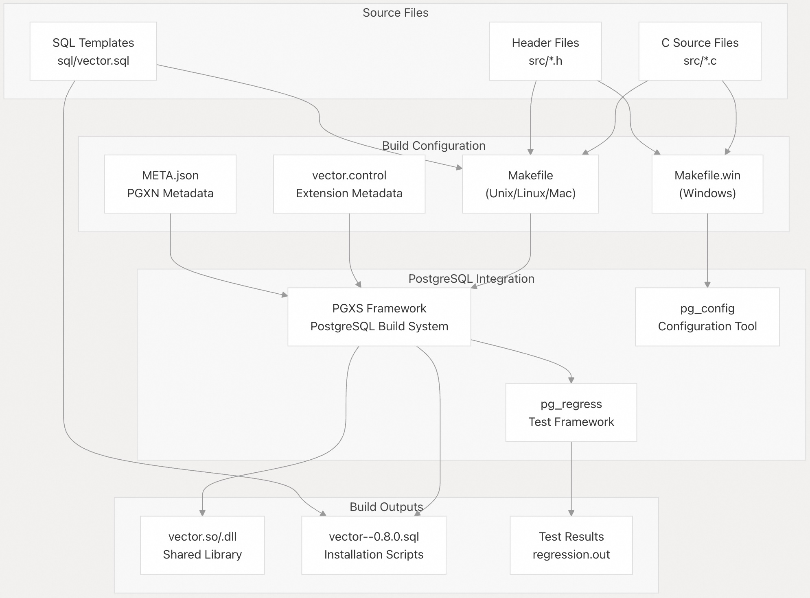
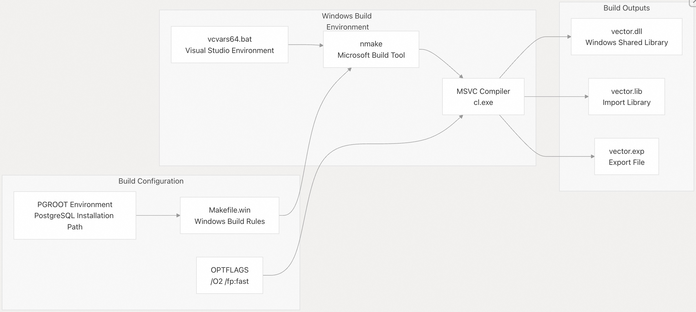
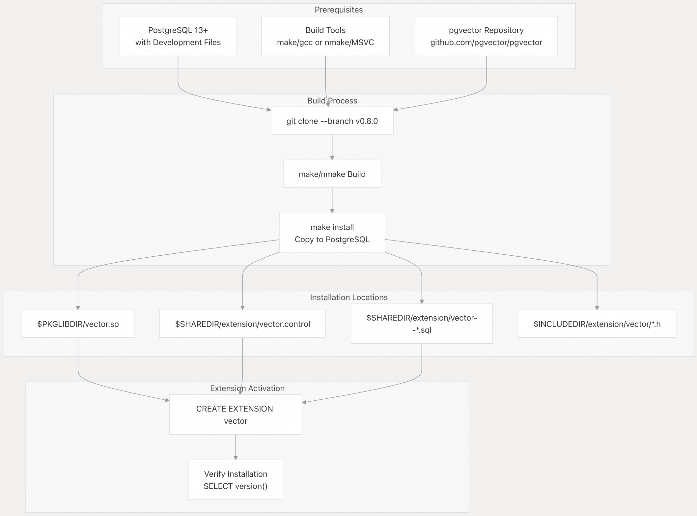
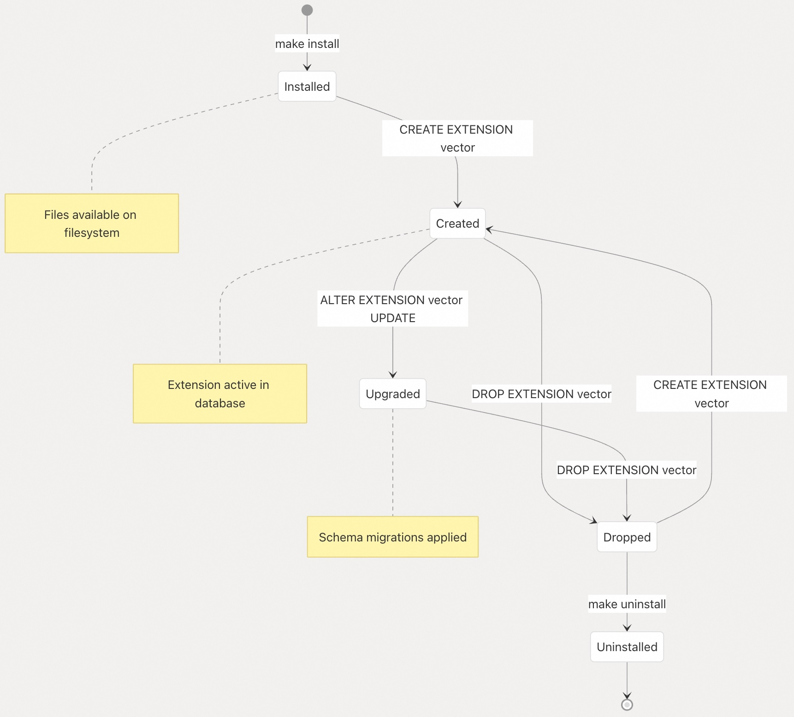

## pgvector 源码学习: 7 安装与部署 (Installation and Deployment) 及编译优化项   
            
### 作者            
digoal            
            
### 日期            
2025-11-05            
            
### 标签            
pgvector , 源码学习            
            
----         
            
## 背景            
本文介绍 **pgvector** 完整的安装与部署过程，包括从源代码编译、容器部署、包管理以及扩展生命周期管理。它着重于构建系统、部署流程和在 **PostgreSQL** 环境中运行 **pgvector** 的操作方面。    
    
## **构建系统架构** (**Build System Architecture**)    
    
**pgvector** 使用 **PostgreSQL** 的 **PGXS**（**PostgreSQL Extension Building Infrastructure**，PostgreSQL扩展构建基础设施）框架进行跨平台编译。构建系统由与 **PostgreSQL** 开发工具集成的平台特定 **Makefile** 文件组成。    
    
## **构建系统组件** (**Build System Components**)    
    
    
    
构建系统通过平台特定的构建过程，将 C 语言源文件和 **SQL** 模板转换为兼容 **PostgreSQL** 的扩展工件（**extension artifacts**）。    
    
**来源:**    
[`Makefile` 1-85](https://github.com/pgvector/pgvector/blob/d823c445/Makefile#L1-L85)    
[`Makefile.win` 1-75](https://github.com/pgvector/pgvector/blob/d823c445/Makefile.win#L1-L75)    
[`vector.control` 1-5](https://github.com/pgvector/pgvector/blob/d823c445/vector.control#L1-L5)    
[`META.json` 1-50](https://github.com/pgvector/pgvector/blob/d823c445/META.json#L1-L50)    
    
### **Unix/Linux/Mac 构建过程** (**Unix/Linux/Mac Build Process**)    
    
主要构建系统使用集成 **PGXS** 的 `make`。构建过程包括优化标志（**optimization flags**）和自动向量化（**auto-vectorization**）支持：    
    
| 组件 (**Component**) | 用途 (**Purpose**) | 关键文件 (**Key Files**) |    
| :--- | :--- | :--- |    
| `OBJS` | 所有 C 语言源文件的编译对象文件（**Compiled object files**） | [`Makefile` 7](https://github.com/pgvector/pgvector/blob/d823c445/Makefile#L7-L7) |    
| `OPTFLAGS` | 平台特定的优化设置（**Platform-specific optimization settings**） | [`Makefile` 15-28](https://github.com/pgvector/pgvector/blob/d823c445/Makefile#L15-L28) |    
| `PG_CFLAGS` | 包含向量化（**vectorization**）的编译器标志（**Compiler flags**） | [`Makefile` 33](https://github.com/pgvector/pgvector/blob/d823c445/Makefile#L33-L33) |    
| `DATA_built` | 生成的 **SQL** 安装脚本（**Generated SQL installation scripts**） | [`Makefile` 6](https://github.com/pgvector/pgvector/blob/d823c445/Makefile#L6-L6) |    
    
构建系统会自动检测平台能力并调整优化标志。例如，**Mac ARM** 系统由于兼容性问题会禁用 `-march=native`，而 **PowerPC** 系统则会完全跳过原生优化（**native optimization**）。    
    
**来源:**    
[`Makefile` 15-33](https://github.com/pgvector/pgvector/blob/d823c445/Makefile#L15-L33)    
    
### **Windows 构建过程** (**Windows Build Process**)    
    
**Windows** 构建使用 `nmake` 并集成 **Visual Studio** 编译器：    
    
    
    
**Windows** 构建需要 `PGROOT` 环境变量指向 **PostgreSQL** 安装目录，并使用针对 **MSVC** 优化的不同编译器优化标志。    
    
**来源:**    
[`Makefile.win` 24-48](https://github.com/pgvector/pgvector/blob/d823c445/Makefile.win#L24-L48)    
[`.github/workflows/build.yml` 84-98](https://github.com/pgvector/pgvector/blob/d823c445/.github/workflows/build.yml#L84-L98)    
    
## **安装方法** (**Installation Methods**)    
    
**pgvector** 支持多种安装方法，具体取决于目标环境和要求。    
    
### **源代码编译安装** (**Source Compilation Installation**)    
    
直接源代码编译可对构建选项和优化设置提供最大的控制权：    
    
## **安装流程** (**Installation Workflow**)    
    
    
    
安装过程将文件放置在标准的 **PostgreSQL** 目录中，使扩展系统能够定位和加载 **pgvector** 组件。    
    
**来源:**    
[`README.md` 16-50](https://github.com/pgvector/pgvector/blob/d823c445/README.md#L16-L50)    
[`Makefile` 46-48](https://github.com/pgvector/pgvector/blob/d823c445/Makefile#L46-L48)    
[`Makefile.win` 53-58](https://github.com/pgvector/pgvector/blob/d823c445/Makefile.win#L53-L58)    
    
### **容器部署** (**Container Deployment**)    
    
**Docker** 部署使用多阶段构建（**multi-stage builds**）来创建优化的容器镜像（**container images**）：    
    
| 构建阶段 (**Build Stage**) | 用途 (**Purpose**) | 关键组件 (**Key Components**) |    
| :--- | :--- | :--- |    
| 基础镜像 (**Base Image**) | `postgres:$PG_MAJOR-$DEBIAN_CODENAME` | [`Dockerfile` 5](https://github.com/pgvector/pgvector/blob/d823c445/Dockerfile#L5-L5) |    
| 构建依赖项 (**Build Dependencies**) | `build-essential postgresql-server-dev` | [`Dockerfile` 12](https://github.com/pgvector/pgvector/blob/d823c445/Dockerfile#L12-L12) |    
| 编译 (**Compilation**) | `make OPTFLAGS=""` for portability (为可移植性禁用优化) | [`Dockerfile` 15](https://github.com/pgvector/pgvector/blob/d823c445/Dockerfile#L15-L15) |    
| 清理 (**Cleanup**) | 移除构建工具和临时文件 | [`Dockerfile` 20-23](https://github.com/pgvector/pgvector/blob/d823c445/Dockerfile#L20-L23) |    
    
**Docker** 构建过程通过禁用原生优化标志（**native optimization flags**）来创建可移植的二进制文件，以确保跨不同硬件平台的兼容性。    
    
**来源:**    
[`Dockerfile` 1-24](https://github.com/pgvector/pgvector/blob/d823c445/Dockerfile#L1-L24)    
[`README.md` 1136-1165](https://github.com/pgvector/pgvector/blob/d823c445/README.md#L1136-L1165)    
    
### **包管理器集成** (**Package Manager Integration**)    
    
**pgvector** 通过标准化元数据格式与多个包管理系统集成：    
    
  * **PGXN**: 使用 [`META.json`]() 进行扩展注册表（**extension registry**）集成    
  * **Homebrew**: macOS 包管理和配方定义（**formula definitions**）    
  * **APT/Yum**: Linux 发行版包仓库    
  * **conda-forge**: 跨平台包管理    
    
**来源:**    
[`META.json` 1-50](https://github.com/pgvector/pgvector/blob/d823c445/META.json#L1-L50)    
[`README.md` 32](https://github.com/pgvector/pgvector/blob/d823c445/README.md#L32-L32)    
    
## **扩展管理生命周期** (**Extension Management Lifecycle**)    
    
**PostgreSQL** 扩展遵循由扩展系统管理的特定生命周期：    
    
## **扩展生命周期** (**Extension Lifecycle**)    
    
    
    
扩展系统通过版本化的 **SQL** 脚本管理模式更新（**schema updates**），并维护依赖关系跟踪（**dependency tracking**），以确保安全升级和移除。    
    
**来源:**    
[`vector.control` 1-5](https://github.com/pgvector/pgvector/blob/d823c445/vector.control#L1-L5)    
[`sql/vector--0.2.0--0.2.1.sql` 1-20](https://github.com/pgvector/pgvector/blob/d823c445/sql/vector--0.2.0--0.2.1.sql#L1-L20)    
    
## **持续集成管道** (**Continuous Integration Pipeline**)    
    
**CI/CD** 管道（**pipeline**）确保了跨多个平台和 **PostgreSQL** 版本的兼容性：    
    
### **CI/CD 矩阵测试** (**CI/CD Matrix Testing**)    
    
| 平台 (**Platform**) | PostgreSQL 版本 (**PostgreSQL Versions**) | 架构 (**Architecture**) | 特别注意事项 (**Special Considerations**) |    
| :--- | :--- | :--- | :--- |    
| Ubuntu | 13, 14, 15, 16, 17, 18, 19 | x86\_64, ARM64 | 标准测试矩阵（**Standard test matrix**） |    
| macOS | 14, 17 | x86\_64, ARM64 | Homebrew Postgres 集成 |    
| Windows | 14 | x86\_64 | MSVC 工具链（**toolchain**） |    
| Debian i386 | 15 | i386 | 32 位兼容性 |    
| Valgrind | 17 | x86\_64 | 内存泄漏检测（**Memory leak detection**） |    
    
**CI** 管道通过 **Valgrind** 集成验证构建、运行回归测试（**regression tests**）并执行内存安全检查。    
    
**来源:**    
[`.github/workflows/build.yml` 4-136](https://github.com/pgvector/pgvector/blob/d823c445/.github/workflows/build.yml#L4-L136)    
    
### **构建验证过程** (**Build Validation Process**)    
    
测试基础设施包括多个验证层：    
    
1.  **编译测试** (**Compilation Tests**): 验证跨平台和编译器的构建    
2.  **回归测试** (**Regression Tests**): 通过 `pg_regress` 进行基于 **SQL** 的功能测试    
3.  **TAP 测试** (**TAP Tests**): 基于 **Perl** 的集成测试    
4.  **内存安全** (**Memory Safety**): **Valgrind** 和 **AddressSanitizer** 验证    
5.  **静态分析** (**Static Analysis**): **Clang** 静态分析器集成    
    
**来源:**    
[`.github/workflows/build.yml` 31-43](https://github.com/pgvector/pgvector/blob/d823c445/.github/workflows/build.yml#L31-L43)    
[`Makefile` 58-60](https://github.com/pgvector/pgvector/blob/d823c445/Makefile#L58-L60)    
    
## **配置管理** (**Configuration Management**)    
    
**pgvector** 安装包括几个配置接触点（**configuration touchpoints**）：    
    
### **扩展配置文件** (**Extension Configuration Files**)    
    
| 文件 (**File**) | 用途 (**Purpose**) | 位置 (**Location**) |    
| :--- | :--- | :--- |    
| `vector.control` | 扩展元数据和依赖关系（**Extension metadata and dependencies**） | `$SHAREDIR/extension/` |    
| `vector--*.sql` | 版本特定的模式定义（**Version-specific schema definitions**） | `$SHAREDIR/extension/` |    
| 头文件 (**Header files**) | C 语言开发集成 | `$INCLUDEDIR/extension/vector/` |    
    
### **构建时配置** (**Build-Time Configuration**)    
    
构建行为可以通过环境变量和 `make` 参数进行自定义：    
    
  * `PG_CONFIG`: 指定 **PostgreSQL** 安装路径，用于多版本系统    
  * `OPTFLAGS`: 覆盖优化设置以提高可移植性（**portability**）    
  * `PG_CFLAGS`: 额外的编译器标志，用于调试或性能分析（**profiling**）    
    
**来源:**    
[`README.md` 1064-1074](https://github.com/pgvector/pgvector/blob/d823c445/README.md#L1064-L1074)    
[`Makefile` 14-15](https://github.com/pgvector/pgvector/blob/d823c445/Makefile#L14-L15)    
    
## **安装问题排查** (**Troubleshooting Installation Issues**)    
    
常见的安装问题及其解决方案：    
    
### **构建环境问题** (**Build Environment Issues**)    
    
| 问题 (**Problem**) | 原因 (**Cause**) | 解决方案 (**Solution**) |    
| :--- | :--- | :--- |    
| `postgres.h: No such file` | 缺少开发头文件（**Missing development headers**） | 安装 `postgresql-server-dev-*` 包 |    
| `no such sysroot directory` | Mac 上 **Postgres** 安装损坏 | 重新安装 **PostgreSQL** |    
| `Illegal instruction` errors | 不可移植的优化标志（**Non-portable optimization flags**） | 使用 `OPTFLAGS=""` 重建 |    
| 访问被拒绝 (**Access denied**) (Windows) | 权限不足（**Insufficient privileges**） | 以管理员身份运行 |    
    
### **版本兼容性** (**Version Compatibility**)    
    
**pgvector** 支持 **PostgreSQL 13+**，并通过 `pg_config` 进行自动版本检测。多版本环境需要显式配置 `PG_CONFIG` 环境变量。    
    
**来源:**    
[`README.md` 1086-1133](https://github.com/pgvector/pgvector/blob/d823c445/README.md#L1086-L1133)    
[`META.json` 14-17](https://github.com/pgvector/pgvector/blob/d823c445/META.json#L14-L17)    
    
## **部署最佳实践** (**Deployment Best Practices**)    
    
### **生产部署注意事项** (**Production Deployment Considerations**)    
    
1.  **索引创建** (**Index Creation**): 使用 `CONCURRENTLY` 创建索引，以避免阻塞写入    
2.  **内存配置** (**Memory Configuration**): 确保 `maintenance_work_mem` 足够用于索引构建    
3.  **监控** (**Monitoring**): 集成 `pg_stat_statements` 进行性能跟踪    
4.  **备份策略** (**Backup Strategy**): 验证扩展与备份/恢复过程的兼容性    
    
### **性能优化** (**Performance Optimization**)    
    
构建时优化可以显著影响运行时性能：    
    
  * **原生优化** (**Native Optimization**): 使用默认 `OPTFLAGS` 以在目标硬件上获得最佳性能    
  * **向量化** (**Vectorization**): 通过编译器标志启用自动向量化    
  * **平台特定** (**Platform-Specific**): 尽可能利用 **CPU** 特定优化    
    
构建系统会根据目标平台自动启用适当的优化，同时为专用部署场景提供覆盖机制。    
    
**来源:**    
[`README.md` 686-694](https://github.com/pgvector/pgvector/blob/d823c445/README.md#L686-L694)    
[`Makefile` 30-33](https://github.com/pgvector/pgvector/blob/d823c445/Makefile#L30-L33)    
      
# 附录1: 如何在 x86 Linux 环境中通过编译器标志启用自动向量化以获得最佳性能。  
  
## 自动向量化配置  
  
pgvector 在 `Makefile` 中已经配置了自动向量化支持。    
  
对于 x86 Linux 环境, 最优设置包括:  
  
1. **`-march=native`**: 针对当前 CPU 架构优化,这是默认设置    
  
2. **`-ftree-vectorize`**: 启用 GCC 的自动向量化(Clang 默认在 `-O2` 及以上级别启用)    
  
3. **浮点数优化标志**:  
   - `-fassociative-math`: 允许重新关联浮点运算  
   - `-fno-signed-zeros`: 忽略有符号零  
   - `-fno-trapping-math`: 假设浮点运算不会产生陷阱    
  
## 编译命令  
  
使用默认配置编译(推荐用于生产环境):  
```sh  
make  
make install  
```  
  
这将自动应用所有优化标志。   
  
## 调试向量化  
  
如果需要验证自动向量化是否生效,可以启用编译器的向量化报告:  
  
**GCC**:  
```sh  
make clean && PG_CFLAGS="-fopt-info-vec" make  
```    
  
**Clang**:  
```sh  
make clean && PG_CFLAGS="-Rpass=loop-vectorize -Rpass-analysis=loop-vectorize" make  
```    
  
## 可移植性考虑  
  
如果需要在不同的 x86 机器上运行编译后的扩展, 应该禁用 `-march=native`:  
```sh  
make OPTFLAGS=""  
```    
  
这会牺牲一些性能, 但可以避免在不同 CPU 上出现 "Illegal instruction" 错误。   
  
## Notes  
  
代码中的许多关键函数已经标记为可自动向量化,例如距离计算函数中的循环。  这些循环会被编译器自动转换为 SIMD 指令(如 SSE、AVX)以提高性能。   
  
对于 x86-64 Linux, pgvector 还实现了 CPU 特性检测和函数分发机制, 可以在运行时选择最优的实现(如 F16C、AVX512)。    
  
# 附录2: 除了自动向量化之外, 还有哪些编译指令可以优化 pgvector 的性能  
  
## 额外的性能优化编译指令  
  
### 1. 调试和开发相关标志  
  
**断言检查** (`-DUSE_ASSERT_CHECKING`):  
```sh  
make clean && PG_CFLAGS="-DUSE_ASSERT_CHECKING" make && make install  
```   
  
这个标志启用运行时断言检查, 用于开发和调试, 但会降低性能, 不建议在生产环境使用。   
  
**基准测试** (`-DIVFFLAT_BENCH`):  
```sh  
make clean && PG_CFLAGS="-DIVFFLAT_BENCH" make && make install  
```    
  
启用 IVFFlat 索引的性能基准测试功能。   
  
**内存使用监控** (`-DHNSW_MEMORY -DIVFFLAT_MEMORY`):  
```sh  
make clean && PG_CFLAGS="-DHNSW_MEMORY -DIVFFLAT_MEMORY" make && make install  
```    
  
显示 HNSW 和 IVFFlat 索引构建时的内存使用情况。   
  
**K-means 调试** (`-DIVFFLAT_KMEANS_DEBUG`):  
```sh  
make clean && PG_CFLAGS="-DIVFFLAT_KMEANS_DEBUG" make && make install  
```    
  
### 2. 编译器警告和代码质量  
  
CI 构建中使用的严格编译标志:  
```  
-Wall -Wextra -Werror -Wno-unused-parameter -Wno-sign-compare  
```    
  
这些标志确保代码质量,但 `-Werror` 会将警告视为错误,可能影响编译成功率。   
  
### 3. Windows 平台优化  
  
对于 Windows (MSVC), 使用以下优化标志:  
- `/O2`: 最大化速度优化  
- `/fp:fast`: 快速浮点运算模式    
  
**MSVC 向量化报告**:  
```  
PG_CFLAGS = $(PG_CFLAGS) /Qvec-report:2  
```    
  
### 4. 平台特定的架构优化  
  
**x86-64 架构标志** (Windows):  
可以通过 `OPTFLAGS` 设置 `/arch` 标志来针对特定 CPU 架构优化。    
  
### 5. CPU 特性分发机制  
  
pgvector 在 x86-64 Linux 上实现了运行时 CPU 特性检测, 自动选择最优实现:  
  
- **F16C**: 半精度浮点转换指令  
- **AVX512**: 高级向量扩展 512 位  
- **POPCNT**: 人口计数指令    
  
这些特性通过 `target_clones` 属性和内联汇编实现, 无需额外编译标志。   
  
### 6. 静态分析工具  
  
**Clang Static Analyzer**:  
```sh  
make clean && $(brew --prefix llvm@20)/bin/scan-build --status-bugs make  
```    
  
用于检测潜在的代码缺陷, 不影响运行时性能。   
  
## Notes  
  
- 生产环境建议使用默认的优化标志 (`-march=native -ftree-vectorize -fassociative-math -fno-signed-zeros -fno-trapping-math`), 这些已经在 `Makefile` 中配置好。   
- 调试标志 (`-DUSE_ASSERT_CHECKING` 等) 会显著降低性能, 仅用于开发和问题排查。   
- 对于需要跨机器部署的场景, 使用 `make OPTFLAGS=""` 禁用 `-march=native` 以确保可移植性。   
      
#### [期望 PostgreSQL|开源PolarDB 增加什么功能?](https://github.com/digoal/blog/issues/76 "269ac3d1c492e938c0191101c7238216")
  
  
#### [PolarDB 开源数据库](https://openpolardb.com/home "57258f76c37864c6e6d23383d05714ea")
  
  
#### [PolarDB 学习图谱](https://www.aliyun.com/database/openpolardb/activity "8642f60e04ed0c814bf9cb9677976bd4")
  
  
#### [PostgreSQL 解决方案集合](../201706/20170601_02.md "40cff096e9ed7122c512b35d8561d9c8")
  
  
#### [德哥 / digoal's Github - 公益是一辈子的事.](https://github.com/digoal/blog/blob/master/README.md "22709685feb7cab07d30f30387f0a9ae")
  
  
#### [About 德哥](https://github.com/digoal/blog/blob/master/me/readme.md "a37735981e7704886ffd590565582dd0")
  
  

  
