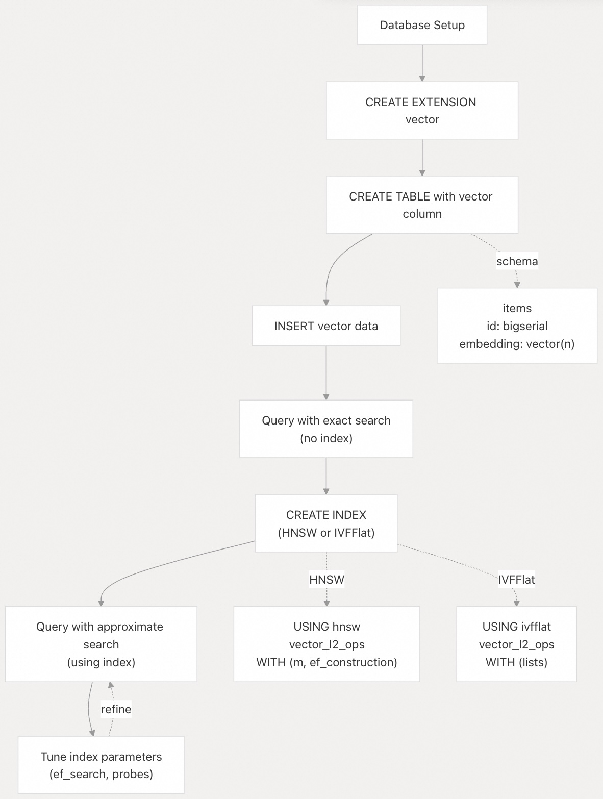
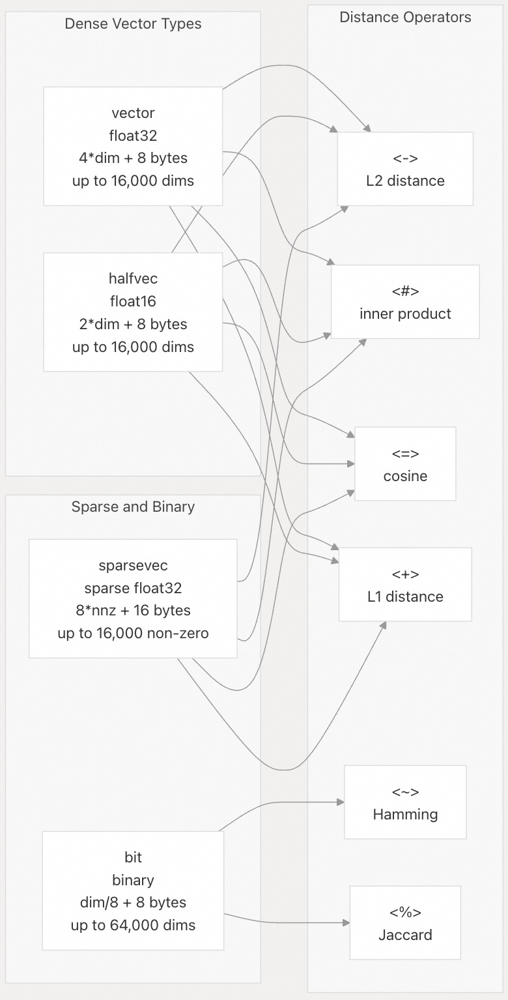
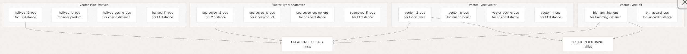
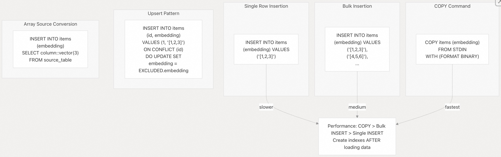

## pgvector 源码学习: 5 使用示例 (Usage Examples)   
              
### 作者              
digoal              
              
### 日期              
2025-11-05              
              
### 标签              
pgvector , 源码学习              
              
----           
              
## 背景              
本文介绍一下使用 **pgvector** 执行常见**向量相似性搜索** (vector similarity search) 任务的实用示例。这些示例演示了如何创建**向量表** (vector tables)、插入数据、执行**距离计算** (distance calculations)、创建**索引** (indexes) 以及使用 SQL 执行**相似性查询** (similarity queries)。  
  
## 快速入门工作流程 (Quick Start Workflow)  
  
下图说明了在 PostgreSQL 数据库中使用 pgvector 的典型工作流程：  
  
    
  
来源: [`README.md` 51-79](https://github.com/pgvector/pgvector/blob/d823c445/README.md#L51-L79) [`README.md` 81-126](https://github.com/pgvector/pgvector/blob/d823c445/README.md#L81-L126) [`README.md` 193-418](https://github.com/pgvector/pgvector/blob/d823c445/README.md#L193-L418)  
  
## 最小示例 (Minimal Example)  
  
此示例演示了从**扩展创建** (extension creation) 到**最近邻搜索** (nearest neighbor search) 的完整工作流程：  
  
### 步骤 1: 启用扩展 (Enable the Extension)  
  
```sql  
CREATE EXTENSION vector;  
```  
  
执行此命令后，`vector` **类型** (type) 和所有相关**函数** (functions) 即可在数据库中使用。  
  
来源: [`README.md` 51-57](https://github.com/pgvector/pgvector/blob/d823c445/README.md#L51-L57)  
  
### 步骤 2: 创建带有向量列的表 (Create a Table with Vector Column)  
  
```sql  
CREATE TABLE items (  
    id bigserial PRIMARY KEY,  
    embedding vector(3)  
);  
```  
  
`vector(3)` 类型指定了一个 **3 维向量** (3-dimensional vector)。每个向量存储 `4 * 3 + 8 = 20` 字节（**单精度浮点数** (single-precision floats) 加上**头部** (header)）。  
  
来源: [`README.md` 59-63](https://github.com/pgvector/pgvector/blob/d823c445/README.md#L59-L63) [`README.md` 942-944](https://github.com/pgvector/pgvector/blob/d823c445/README.md#L942-L944)  
  
### 步骤 3: 插入向量数据 (Insert Vector Data)  
  
```sql  
INSERT INTO items (embedding) VALUES   
    ('[1,2,3]'),   
    ('[4,5,6]'),  
    ('[7,8,9]');  
```  
  
向量可以指定为**数组表示法** (array notation) 中的文本字符串。它们也可以通过**隐式转换** (implicit casts) 从 `int4[]`、`real[]`、`double precision[]` 或 `numeric[]` 类型的数组中插入。  
  
来源: [`README.md` 65-69](https://github.com/pgvector/pgvector/blob/d823c445/README.md#L65-L69) [`README.md` 98-107](https://github.com/pgvector/pgvector/blob/d823c445/README.md#L98-L107)  
  
### 步骤 4: 查询最近邻 (Query Nearest Neighbors)  
  
```sql  
SELECT * FROM items   
ORDER BY embedding <-> '[3,1,2]'   
LIMIT 5;  
```  
  
**`<->` 运算符** (operator) 计算 **L2 (欧几里得) 距离** (L2 (Euclidean) distance)。在没有索引的情况下，这将对所有行执行**精确顺序扫描** (exact sequential scan)。  
  
来源: [`README.md` 71-78](https://github.com/pgvector/pgvector/blob/d823c445/README.md#L71-L78) [`README.md` 130-144](https://github.com/pgvector/pgvector/blob/d823c445/README.md#L130-L144)  
  
## 距离运算符和函数 (Distance Operators and Functions)  
  
下表显示了所有支持的**距离运算符** (distance operators) 及其对应的函数调用：  
  
| 运算符 (Operator) | 距离类型 (Distance Type) | 函数 (Function) | 用例 (Use Case) |  
| :--- | :--- | :--- | :--- |  
| `<->` | **L2 (欧几里得) 距离** (L2 (Euclidean) distance) | `l2_distance(a, b)` | 一般相似性 (General similarity)，**空间数据** (spatial data) |  
| `<#>` | **负内积** (Negative inner product) | `inner_product(a, b) * -1` | **嵌入** (Embeddings)（乘以 -1 获得实际值） |  
| `<=>` | **余弦距离** (Cosine distance) | `cosine_distance(a, b)` | **归一化嵌入** (Normalized embeddings)，**文本相似性** (text similarity) |  
| `<+>` | **L1 (曼哈顿) 距离** (L1 (Manhattan) distance) | `l1_distance(a, b)` | **稀疏特征** (Sparse features)，某些 ML 模型 (ML models) |  
| `<~>` | **汉明距离** (Hamming distance) | `hamming_distance(a, b)` | 仅适用于**二进制向量** (Binary vectors) |  
| `<%>` | **Jaccard 距离** (Jaccard distance) | `jaccard_distance(a, b)` | 仅适用于二进制向量 (Binary vectors) |  
  
### 距离计算示例 (Distance Calculation Examples)  
  
```  
-- L2 distance between two vectors  
SELECT embedding <-> '[3,1,2]' AS distance   
FROM items;  
  
-- Inner product (note: returns negative value)  
SELECT (embedding <#> '[3,1,2]') * -1 AS inner_product   
FROM items;  
  
-- Cosine similarity (1 - cosine distance)  
SELECT 1 - (embedding <=> '[3,1,2]') AS cosine_similarity   
FROM items;  
```  
  
**注意：** `<#>` 运算符返回**负内积** (*negative* inner product)，因为 PostgreSQL 仅支持索引扫描的**升序** (ascending order)。要获得实际的**内积** (inner product)，请乘以 -1。  
  
来源: [`README.md` 136-177](https://github.com/pgvector/pgvector/blob/d823c445/README.md#L136-L177) [`README.md` 946-971](https://github.com/pgvector/pgvector/blob/d823c445/README.md#L946-L971)  
  
## 向量类型比较 (Vector Type Comparison)  
  
下图显示了不同**向量类型** (vector types) 如何与适当的距离运算符一起使用：  
  
    
  
来源: [`README.md` 136-144](https://github.com/pgvector/pgvector/blob/d823c445/README.md#L136-L144) [`README.md` 942-1059](https://github.com/pgvector/pgvector/blob/d823c445/README.md#L942-L1059)  
  
## 基本索引创建 (Basic Index Creation)  
  
### HNSW 索引示例 (HNSW Index Example)  
  
```sql  
-- Create HNSW index for L2 distance  
CREATE INDEX ON items USING hnsw (embedding vector_l2_ops);  
  
-- Query using the index  
SELECT * FROM items   
ORDER BY embedding <-> '[3,1,2]'   
LIMIT 5;  
```  
  
**HNSW** (**分层可导航小世界** (Hierarchical Navigable Small World)) 构建了一个**分层图结构** (hierarchical graph structure)，它比 **IVFFlat** 提供了更好的**召回率-速度权衡** (recall-speed tradeoff)，但使用了更多的内存并且**构建时间** (build times) 更慢。它可以在空表上创建。  
  
来源: [`README.md` 204-246](https://github.com/pgvector/pgvector/blob/d823c445/README.md#L204-L246)  
  
### IVFFlat 索引示例 (IVFFlat Index Example)  
  
```sql  
-- Insert sufficient data first (IVFFlat requires training data)  
-- CREATE INDEX after data is loaded  
  
-- Create IVFFlat index with 100 lists  
CREATE INDEX ON items USING ivfflat (embedding vector_l2_ops)   
WITH (lists = 100);  
  
-- Set number of probes for querying  
SET ivfflat.probes = 10;  
  
-- Query using the index  
SELECT * FROM items   
ORDER BY embedding <-> '[3,1,2]'   
LIMIT 5;  
```  
  
**IVFFlat** (**倒排文件和平面** (Inverted File and Flat)) 使用 **k-均值聚类** (k-means clustering) 来**划分向量空间** (partition the vector space)。对于多达 100 万行的**推荐列表数** (recommended number of lists) 为 `rows / 1000`，对于更大的数据集为 `sqrt(rows)`。  
  
来源: [`README.md` 330-391](https://github.com/pgvector/pgvector/blob/d823c445/README.md#L330-L391)  
  
## 运算符类选择 (Operator Class Selection)  
  
创建索引时，每个距离函数都需要一个相应的**运算符类** (operator class)：  
  
    
  
| 距离类型 (Distance Type) | 运算符类 (Operator Class) | 支持的索引方法 (Supported Index Method) |  
| :--- | :--- | :--- |  
| L2 距离 (L2 distance) | `vector_l2_ops` | `hnsw`, `ivfflat` |  
| 负内积 (Negative inner product) | `vector_ip_ops` | `hnsw`, `ivfflat` |  
| 余弦距离 (Cosine distance) | `vector_cosine_ops` | `hnsw`, `ivfflat` |  
| L1 距离 (L1 distance) | `vector_l1_ops` | `hnsw`,`ivfflat` |  
| 汉明距离 (Hamming distance) | `bit_hamming_ops` | `hnsw`,`ivfflat` |  
| Jaccard 距离 (Jaccard distance) | `bit_jaccard_ops` | `ivfflat` |  
  
来源: [`README.md` 210-246](https://github.com/pgvector/pgvector/blob/d823c445/README.md#L210-L246) [`README.md` 342-366](https://github.com/pgvector/pgvector/blob/d823c445/README.md#L342-L366)  
  
## 使用不同的向量类型 (Working with Different Vector Types)  
  
### 半精度向量 (Half-Precision Vectors)  
  
```sql  
-- Create table with half-precision vectors (50% storage savings)  
CREATE TABLE items_half (  
    id bigserial PRIMARY KEY,  
    embedding halfvec(3)  
);  
  
INSERT INTO items_half (embedding) VALUES   
    ('[1,2,3]'),   
    ('[4,5,6]');  
  
-- Create index  
CREATE INDEX ON items_half USING hnsw (embedding halfvec_l2_ops);  
  
-- Query  
SELECT * FROM items_half   
ORDER BY embedding <-> '[3,1,2]'   
LIMIT 5;  
```  
  
`halfvec` **类型** 使用 16 位**浮点数** (floating point numbers)（**IEEE 754 binary16**），与 `vector` 相比，**存储空间** (storage) 减少了 50%，同时在许多用例中保持了可接受的**精度** (precision)。  
  
来源: [`README.md` 542-562](https://github.com/pgvector/pgvector/blob/d823c445/README.md#L542-L562) [`README.md` 980-1017](https://github.com/pgvector/pgvector/blob/d823c445/README.md#L980-L1017)  
  
### 稀疏向量 (Sparse Vectors)  
  
```sql  
-- Create table with sparse vectors  
CREATE TABLE items_sparse (  
    id bigserial PRIMARY KEY,  
    embedding sparsevec(5)  
);  
  
-- Insert sparse vectors using {index:value}/dimensions format  
-- Indices start at 1 like SQL arrays  
INSERT INTO items_sparse (embedding) VALUES   
    ('{1:1,3:2,5:3}/5'),  -- only positions 1, 3, 5 have non-zero values  
    ('{1:4,3:5,5:6}/5');  
  
-- Create HNSW index (IVFFlat not supported for sparsevec)  
CREATE INDEX ON items_sparse USING hnsw (embedding sparsevec_l2_ops);  
  
-- Query  
SELECT * FROM items_sparse   
ORDER BY embedding <-> '{1:3,3:1,5:2}/5'   
LIMIT 5;  
```  
  
**稀疏向量** (Sparse vectors) 仅存储**非零元素** (non-zero elements)，使用 `8 * 非零元素 + 16` 字节。它们非常适合具有许多零的**高维向量** (high-dimensional vectors)。  
  
来源: [`README.md` 603-623](https://github.com/pgvector/pgvector/blob/d823c445/README.md#L603-L623) [`README.md` 1036-1059](https://github.com/pgvector/pgvector/blob/d823c445/README.md#L1036-L1059)  
  
### 二进制向量 (Binary Vectors)  
  
```sql  
-- Create table with binary vectors  
CREATE TABLE items_binary (  
    id bigserial PRIMARY KEY,  
    embedding bit(8)  
);  
  
-- Insert binary vectors  
INSERT INTO items_binary (embedding) VALUES   
    ('00001111'),   
    ('10101010');  
  
-- Create index for Hamming distance  
CREATE INDEX ON items_binary USING hnsw (embedding bit_hamming_ops);  
  
-- Query by Hamming distance  
SELECT * FROM items_binary   
ORDER BY embedding <~> '11110000'   
LIMIT 5;  
  
-- Query by Jaccard distance  
SELECT * FROM items_binary   
ORDER BY embedding <%> '11110000'   
LIMIT 5;  
```  
  
**二进制向量** (Binary vectors) 每**维度** (dimension) 使用 1 位，提供**极致压缩** (extreme compression)。**汉明距离** (Hamming distance) 计算不同位的数量，而 **Jaccard 距离** (Jaccard distance) 衡量**集合相似性** (set similarity)。  
  
来源: [`README.md` 564-580](https://github.com/pgvector/pgvector/blob/d823c445/README.md#L564-L580) [`README.md` 1018-1035](https://github.com/pgvector/pgvector/blob/d823c445/README.md#L1018-L1035)  
  
## 数据加载模式 (Data Loading Patterns)  
  
下图显示了加载向量数据的不同模式：  
  
    
  
来源: [`README.md` 98-126](https://github.com/pgvector/pgvector/blob/d823c445/README.md#L98-L126) [`README.md` 676-685](https://github.com/pgvector/pgvector/blob/d823c445/README.md#L676-L685)  
  
### 用于批量加载的 COPY 示例 (COPY Example for Bulk Loading)  
  
```sql  
-- Use COPY for best performance when loading large datasets  
COPY items (embedding) FROM STDIN WITH (FORMAT BINARY);  
```  
  
为了获得**最佳性能** (optimal performance)：  
  
1.  使用带有**二进制格式** (binary format) 的 `COPY` 进行**批量加载** (bulk loading)  
2.  在加载**初始数据** (initial data) *之后*创建索引  
3.  对于中等大小的**批次** (batches)，使用带有**多行** (multiple rows) 的 `INSERT ... VALUES`  
4.  对于**单个记录** (individual records)，使用单个 `INSERT` 语句  
  
来源: [`README.md` 103-107](https://github.com/pgvector/pgvector/blob/d823c445/README.md#L103-L107) [`README.md` 676-685](https://github.com/pgvector/pgvector/blob/d823c445/README.md#L676-L685)  
  
## 聚合操作 (Aggregate Operations)  
  
```sql  
-- Average vectors across all rows  
SELECT AVG(embedding) FROM items;  
  
-- Average vectors by category  
SELECT category_id, AVG(embedding)   
FROM items   
GROUP BY category_id;  
  
-- Sum vectors  
SELECT SUM(embedding) FROM items;  
```  
  
`AVG` 和 `SUM` **聚合函数** (aggregate functions) 适用于 `vector` 和 `halfvec` 类型。它们对于计算**质心** (centroids) 或**组合表示** (combined representations) 非常有用。  
  
来源: [`README.md` 179-191](https://github.com/pgvector/pgvector/blob/d823c445/README.md#L179-L191) [`README.md` 973-979](https://github.com/pgvector/pgvector/blob/d823c445/README.md#L973-L979) [`README.md` 1011-1017](https://github.com/pgvector/pgvector/blob/d823c445/README.md#L1011-L1017)  
  
## 表达式索引模式 (Expression Indexing Patterns)  
  
### 半精度索引 (Half-Precision Indexing)  
  
```sql  
-- Store full precision, index at half precision for smaller index size  
CREATE INDEX ON items USING hnsw   
    ((embedding::halfvec(3)) halfvec_l2_ops);  
  
-- Query must use the same cast  
SELECT * FROM items   
ORDER BY embedding::halfvec(3) <-> '[1,2,3]'   
LIMIT 5;  
```  
  
这会将**索引大小** (index size) 减少 50%，同时为**原始向量** (original vectors) 保留**全精度存储** (full-precision storage)。  
  
来源: [`README.md` 550-562](https://github.com/pgvector/pgvector/blob/d823c445/README.md#L550-L562)  
  
### 二进制量化 (Binary Quantization)  
  
```sql  
-- Create index on binary quantized vectors  
CREATE INDEX ON items USING hnsw   
    ((binary_quantize(embedding)::bit(3)) bit_hamming_ops);  
  
-- Two-stage query: approximate search then re-rank  
SELECT * FROM (  
    SELECT * FROM items   
    ORDER BY binary_quantize(embedding)::bit(3) <~> binary_quantize('[1,-2,3]')   
    LIMIT 20  
) ORDER BY embedding <=> '[1,-2,3]'   
LIMIT 5;  
```  
  
`binary_quantize` **函数** 通过**零阈值** (thresholding at zero) 将**浮点向量** (float vectors) 转换为**二进制** (binary)。**重新排序模式** (re-ranking pattern) 通过使用**紧凑二进制索引** (compact binary index) 进行过滤，然后按**原始向量** (original vectors) 排序，从而提供更好的**召回率** (recall)。  
  
来源: [`README.md` 582-601](https://github.com/pgvector/pgvector/blob/d823c445/README.md#L582-L601) [`README.md` 963](https://github.com/pgvector/pgvector/blob/d823c445/README.md#L963-L963)  
  
### 子向量索引 (Subvector Indexing)  
  
```sql  
-- Index only part of a vector  
CREATE INDEX ON items USING hnsw   
    ((subvector(embedding, 1, 3)::vector(3)) vector_cosine_ops);  
  
-- Query the subvector  
SELECT * FROM items   
ORDER BY subvector(embedding, 1, 3)::vector(3) <=>   
         subvector('[1,2,3,4,5]'::vector, 1, 3)   
LIMIT 5;  
  
-- Re-rank by full vectors  
SELECT * FROM (  
    SELECT * FROM items   
    ORDER BY subvector(embedding, 1, 3)::vector(3) <=>   
             subvector('[1,2,3,4,5]'::vector, 1, 3)   
    LIMIT 20  
) ORDER BY embedding <=> '[1,2,3,4,5]'   
LIMIT 5;  
```  
  
`subvector(vector, start, length)` 函数**提取** (extracts) 向量的一部分。通过索引**子向量** (subvectors) 并**重新排序** (re-ranking)，这可以对**超出正常限制** (beyond normal limits) 的高维向量进行索引。  
  
来源: [`README.md` 636-656](https://github.com/pgvector/pgvector/blob/d823c445/README.md#L636-L656) [`README.md` 969](https://github.com/pgvector/pgvector/blob/d823c445/README.md#L969-L969)  
  
## 查询优化工作流程 (Query Optimization Workflow)  
  
    
  
来源: [`README.md` 420-508](https://github.com/pgvector/pgvector/blob/d823c445/README.md#L420-L508) [`README.md` 876-909](https://github.com/pgvector/pgvector/blob/d823c445/README.md#L876-L909)  
  
## 监控和调试 (Monitoring and Debugging)  
  
### 使用 EXPLAIN ANALYZE (Using EXPLAIN ANALYZE)  
  
```sql  
EXPLAIN ANALYZE SELECT * FROM items ORDER BY embedding <-> '[3,4,5]' LIMIT 5;  
```  
  
这会显示是否正在使用**索引** (index) 以及**实际执行时间** (actual execution time)。  
  
来源: [`README.md` 698-702](https://github.com/pgvector/pgvector/blob/d823c445/README.md#L698-L702)  
  
### 强制使用索引 (Forcing Index Usage)  
  
```sql  
-- Disable sequential scan to force index usage  
BEGIN;  
SET LOCAL enable_seqscan = off;  
SELECT * FROM items ORDER BY embedding <-> '[3,1,2]' LIMIT 5;  
COMMIT;  
```  
  
来源: [`README.md` 889-895](https://github.com/pgvector/pgvector/blob/d823c445/README.md#L889-L895)  
  
### 比较精确搜索与近似搜索 (Comparing Exact vs Approximate Search)  
  
```sql  
-- Disable index scan for exact search (baseline)  
BEGIN;  
SET LOCAL enable_indexscan = off;  
SELECT * FROM items ORDER BY embedding <-> '[3,1,2]' LIMIT 5;  
COMMIT;  
  
-- Compare with approximate search results to measure recall  
```  
  
这对于测量**近似索引** (approximate indexes) 的**召回率** (recall) 非常有用。  
  
来源: [`README.md` 752-758](https://github.com/pgvector/pgvector/blob/d823c445/README.md#L752-L758)  
  
### 监控索引构建进度 (Monitoring Index Build Progress)  
  
```sql  
-- Monitor HNSW index build  
SELECT phase,   
       round(100.0 * blocks_done / nullif(blocks_total, 0), 1) AS "%"   
FROM pg_stat_progress_create_index;  
  
-- Monitor IVFFlat index build  
SELECT phase,   
       round(100.0 * tuples_done / nullif(tuples_total, 0), 1) AS "%"   
FROM pg_stat_progress_create_index;  
```  
  
**HNSW 阶段** (phases): `initializing` (**初始化**)，`loading tuples` (**加载元组**)  
  
**IVFFlat 阶段** (phases): `initializing` (**初始化**)，`performing k-means` (**执行 k-均值**)，`assigning tuples` (**分配元组**)，`loading tuples` (**加载元组**)  
  
来源: [`README.md` 317-329](https://github.com/pgvector/pgvector/blob/d823c445/README.md#L317-L329) [`README.md` 403-418](https://github.com/pgvector/pgvector/blob/d823c445/README.md#L403-L418)  
  
## 常见模式总结 (Common Patterns Summary)  
  
| 模式 (Pattern) | 用例 (Use Case) | 示例 (Example) |  
| :--- | :--- | :--- |  
| **精确搜索** (Exact search) | **小数据集** (Small datasets)，需要**完美召回率** (perfect recall) | **顺序扫描** (Sequential scan)，无索引 |  
| **HNSW 索引** (HNSW index) | 最佳**召回率-速度权衡** (recall-speed tradeoff)，**多样化查询** (diverse queries) | `CREATE INDEX USING hnsw` |  
| **IVFFlat 索引** (IVFFlat index) | 更快的**构建速度** (Faster builds)，更低的**内存** (memory) | `CREATE INDEX USING ivfflat` |  
| **半精度** (Half-precision) | 节省 50% **存储空间/索引大小** (storage/index size) | `halfvec(n)` 类型 |  
| **二进制量化** (Binary quantization) | 节省 96% **存储空间** (storage)，**快速过滤** (fast filtering) | `binary_quantize()` + **重新排序** (re-rank) |  
| **稀疏向量** (Sparse vectors) | **高维度** (High dimensions)，许多零 | `sparsevec` 类型 |  
| **过滤查询** (Filtered queries) | 结合**相似性** (similarity) + **条件** (conditions) | `WHERE` **子句** (clause) + **迭代扫描** (iterative scan) |  
| **重新排序** (Re-ranking) | 通过**紧凑索引** (compact index) 获得更好的**召回率** (recall) | **两阶段查询模式** (Two-stage query pattern) |  
  
来源: [`README.md` 1-1338](https://github.com/pgvector/pgvector/blob/d823c445/README.md#L1-L1338)  
     
# 附录: pgvector 扩展中不同向量类型对应的所有 operator class (操作符类) 以及它们支持的索引方法。  
  
## 向量类型与 Operator Class 对照表  
  
pgvector 支持 4 种向量类型,每种类型都有对应的 operator class,支持不同的索引方法和距离度量:   
  
### 1. vector 类型  
  
**HNSW 索引支持的 operator class:**  
- `vector_l2_ops` - L2 距离 (欧几里得距离)    
- `vector_ip_ops` - 内积距离    
- `vector_cosine_ops` - 余弦距离    
- `vector_l1_ops` - L1 距离 (曼哈顿距离)    
  
**IVFFlat 索引支持的 operator class:**  
- `vector_l2_ops` - L2 距离    
- `vector_ip_ops` - 内积距离    
- `vector_cosine_ops` - 余弦距离    
  
### 2. halfvec 类型  
  
**HNSW 索引支持的 operator class:**  
- `halfvec_l2_ops` - L2 距离    
- `halfvec_ip_ops` - 内积距离    
- `halfvec_cosine_ops` - 余弦距离    
- `halfvec_l1_ops` - L1 距离    
  
**IVFFlat 索引支持的 operator class:**  
- `halfvec_l2_ops` - L2 距离    
- `halfvec_ip_ops` - 内积距离    
- `halfvec_cosine_ops` - 余弦距离    
  
### 3. bit 类型  
  
**HNSW 索引支持的 operator class:**  
- `bit_hamming_ops` - 汉明距离    
- `bit_jaccard_ops` - Jaccard 距离    
  
**IVFFlat 索引支持的 operator class:**  
- `bit_hamming_ops` - 汉明距离    
  
### 4. sparsevec 类型  
  
**仅支持 HNSW 索引:**  
- `sparsevec_l2_ops` - L2 距离    
- `sparsevec_ip_ops` - 内积距离    
- `sparsevec_cosine_ops` - 余弦距离    
- `sparsevec_l1_ops` - L1 距离    
  
## 索引方法总结  
  
pgvector 提供两种索引方法:   
  
1. **HNSW** - 支持所有 4 种向量类型和所有距离度量    
2. **IVFFlat** - 仅支持 `vector`、`halfvec` 和 `bit` 类型,不支持 `sparsevec`    
  
## Notes  
  
- `sparsevec` 类型只能使用 HNSW 索引,不支持 IVFFlat   
- `bit` 类型的 Jaccard 距离只能使用 HNSW 索引   
- L1 距离 (taxicab/曼哈顿距离) 只能使用 HNSW 索引,IVFFlat 不支持   
- 所有类型都支持 btree 索引用于相等性比较,但这不是向量相似度搜索索引    
    
#### [期望 PostgreSQL|开源PolarDB 增加什么功能?](https://github.com/digoal/blog/issues/76 "269ac3d1c492e938c0191101c7238216")
  
  
#### [PolarDB 开源数据库](https://openpolardb.com/home "57258f76c37864c6e6d23383d05714ea")
  
  
#### [PolarDB 学习图谱](https://www.aliyun.com/database/openpolardb/activity "8642f60e04ed0c814bf9cb9677976bd4")
  
  
#### [PostgreSQL 解决方案集合](../201706/20170601_02.md "40cff096e9ed7122c512b35d8561d9c8")
  
  
#### [德哥 / digoal's Github - 公益是一辈子的事.](https://github.com/digoal/blog/blob/master/README.md "22709685feb7cab07d30f30387f0a9ae")
  
  
#### [About 德哥](https://github.com/digoal/blog/blob/master/me/readme.md "a37735981e7704886ffd590565582dd0")
  
  

  
