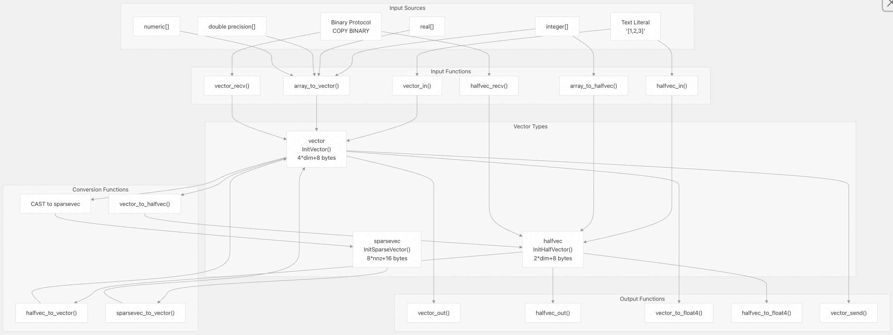
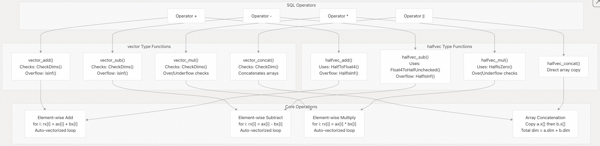
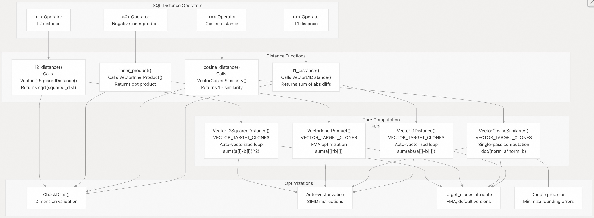
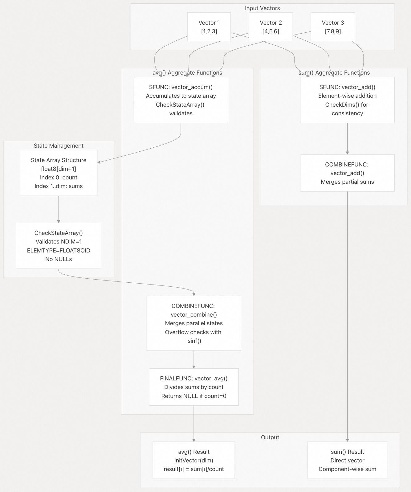

## pgvector 源码学习: 5.1 基本向量操作（Basic Vector Operations）    
                
### 作者                
digoal                
                
### 日期                
2025-11-05                
                
### 标签                
pgvector , 源码学习                
                
----             
                
## 背景                
本文介绍 `pgvector` 中提供的**基本向量操作**（Basic Vector Operations），涵盖了向量创建（vector creation）、算术运算（arithmetic）、距离计算（distance calculations）和实用函数（utility functions）。这些示例展示了大多数向量处理任务所需的核心功能。  
  
-----  
  
## 向量创建和输入/输出（Vector Creation and Input/Output）  
  
### 从文本字面量（Text Literals）创建向量  
```  
-- Create vectors from text representation  
SELECT '[1,2,3]'::vector;                             -- Basic text format  
SELECT '[1.5, -2.3, 0.0]'::vector;                    -- With decimals and negatives  
SELECT '[1,2,3]'::vector(3);                          -- With explicit dimensions  
  
-- Create halfvec (half-precision)  
SELECT '[1,2,3]'::halfvec;                            -- 16-bit floats  
SELECT '[1,2,3]'::halfvec(3);                         -- With explicit dimensions  
  
-- Create sparsevec (sparse representation)  
SELECT '{1:1.0,3:2.0,5:3.0}/5'::sparsevec;           -- {index:value,...}/dimensions  
```  
  
对于 `vector` 类型，文本格式由 `vector_in()` 函数解析；对于 `halfvec` 类型，由 `halfvec_in()` 函数解析；其他类型也有类似的函数。这些函数使用 `strtof()` 解析浮点值（floating-point values），并验证元素是有限的（即非 `NaN` 或 `Infinity`）。  
  
### 从 PostgreSQL 数组（Arrays）创建向量  
  
```  
-- Convert from different array types  
SELECT ARRAY[1.0, 2.0, 3.0]::real[]::vector;         -- float4[]  
SELECT ARRAY[1.0, 2.0, 3.0]::double precision[]::vector;  -- float8[]  
SELECT ARRAY[1, 2, 3]::integer[]::vector;             -- int4[]  
SELECT ARRAY[1.0, 2.0, 3.0]::numeric[]::vector;       -- numeric[]  
  
-- Same conversions work for halfvec  
SELECT ARRAY[1.0, 2.0, 3.0]::real[]::halfvec;  
SELECT ARRAY[1, 2, 3]::integer[]::halfvec;  
  
-- And sparsevec  
SELECT ARRAY[1.0, 0.0, 2.0]::real[]::sparsevec;  
```  
  
### 向量类型转换（Vector Type Conversions）  
  
```  
-- Convert between vector types (bidirectional)  
SELECT '[1,2,3]'::vector::halfvec;                    -- vector to halfvec  
SELECT '[1,2,3]'::halfvec::vector;                    -- halfvec to vector    
SELECT '[1,2,3]'::vector::sparsevec;                  -- vector to sparsevec  
SELECT '{1:1,3:2}/3'::sparsevec::vector;              -- sparsevec to vector  
  
-- Convert to PostgreSQL arrays for export  
SELECT '[1,2,3]'::vector::real[];                     -- vector to float4[]  
SELECT '[1,2,3]'::halfvec::real[];                    -- halfvec to float4[]  
```  
  
**向量输入/输出和转换流程（Vector Input/Output and Conversion Flow）**  
  
  
  
来源:  
[`src/vector.c` 165-270](https://github.com/pgvector/pgvector/blob/d823c445/src/vector.c#L165-L270) (vector\_in), [`src/vector.c` 432-501](https://github.com/pgvector/pgvector/blob/d823c445/src/vector.c#L432-L501) (array\_to\_vector), [`src/vector.c` 363-392](https://github.com/pgvector/pgvector/blob/d823c445/src/vector.c#L363-L392) (vector\_recv), [`src/vector.c` 506-525](https://github.com/pgvector/pgvector/blob/d823c445/src/vector.c#L506-L525) (vector\_to\_float4), [`src/vector.c` 278-315](https://github.com/pgvector/pgvector/blob/d823c445/src/vector.c#L278-L315) (vector\_out), [`src/vector.c` 530-547](https://github.com/pgvector/pgvector/blob/d823c445/src/vector.c#L530-L547) (halfvec\_to\_vector), [`src/halfvec.c` 165-271](https://github.com/pgvector/pgvector/blob/d823c445/src/halfvec.c#L165-L271) (halfvec\_in), [`src/halfvec.c` 425-494](https://github.com/pgvector/pgvector/blob/d823c445/src/halfvec.c#L425-L494) (array\_to\_halfvec)  
  
-----  
  
## 插入向量到表（Inserting Vectors into Tables）  
  
### 基本的表创建和插入（Basic Table Creation and Insertion）  
  
```  
-- Create table with vector column  
CREATE TABLE items (id bigserial PRIMARY KEY, embedding vector(3));  
  
-- Insert vectors using text format  
INSERT INTO items (embedding) VALUES ('[1,2,3]'), ('[4,5,6]');  
  
-- Insert from arrays  
INSERT INTO items (embedding)   
VALUES   
  (ARRAY[1.0, 2.0, 3.0]::vector),  
  (ARRAY[4.0, 5.0, 6.0]::vector);  
  
-- Insert with explicit casting  
INSERT INTO items (embedding) VALUES ('[7,8,9]'::vector(3));  
```  
  
### 使用 COPY 进行批量加载（Bulk Loading with COPY）  
  
```  
-- Load vectors efficiently using COPY with binary format  
COPY items (embedding) FROM STDIN WITH (FORMAT BINARY);  
```  
  
二进制格式（binary format）使用 `vector_recv()`，这对**批量加载**（bulk loading）更高效。每个向量被编码为：`int16 dim`、`int16 unused`，后跟 `dim` 个 `float4` 值。  
  
### Upsert 操作（Upsert Operations）  
  
```  
-- Upsert (insert or update) vectors  
INSERT INTO items (id, embedding)   
VALUES   
  (1, '[1,2,3]'),   
  (2, '[4,5,6]')  
ON CONFLICT (id) DO UPDATE SET embedding = EXCLUDED.embedding;  
  
-- Update existing vectors  
UPDATE items SET embedding = '[1,2,3]' WHERE id = 1;  
  
-- Delete vectors  
DELETE FROM items WHERE id = 1;  
```  
  
### 使用不同向量类型（Working with Different Vector Types）  
  
```  
-- Create tables for different vector types  
CREATE TABLE half_items (id bigserial PRIMARY KEY, embedding halfvec(3));  
CREATE TABLE sparse_items (id bigserial PRIMARY KEY, embedding sparsevec(5));  
  
-- Insert halfvec  
INSERT INTO half_items (embedding)   
VALUES ('[1,2,3]'::halfvec), ('[4,5,6]'::halfvec);  
  
-- Insert sparsevec (only non-zero values stored)  
INSERT INTO sparse_items (embedding)   
VALUES ('{1:1.0,3:2.0,5:3.0}/5'), ('{2:4.0,4:5.0}/5');  
```  
  
来源:  
[`README.md` 59-127](https://github.com/pgvector/pgvector/blob/d823c445/README.md#L59-L127), [`src/vector.c` 363-392](https://github.com/pgvector/pgvector/blob/d823c445/src/vector.c#L363-L392) (vector\_recv for COPY BINARY), [`src/vector.c` 118-130](https://github.com/pgvector/pgvector/blob/d823c445/src/vector.c#L118-L130) (InitVector allocation)  
  
-----  
  
## 基本算术操作（Basic Arithmetic Operations）  
  
### 向量加法和减法（Vector Addition and Subtraction）  
  
```  
-- Vector addition  
SELECT '[1,2,3]'::vector + '[4,5,6]'::vector;         -- Result: [5,7,9]  
  
-- Vector subtraction    
SELECT '[4,5,6]'::vector - '[1,2,3]'::vector;         -- Result: [3,3,3]  
  
-- Works with halfvec too  
SELECT '[1,2,3]'::halfvec + '[4,5,6]'::halfvec;  
SELECT '[4,5,6]'::halfvec - '[1,2,3]'::halfvec;  
```  
  
### 逐元素操作（Element-wise Operations）  
  
```  
-- Element-wise multiplication  
SELECT '[2,3,4]'::vector * '[1,2,3]'::vector;         -- Result: [2,6,12]  
  
-- Vector concatenation  
SELECT '[1,2]'::vector || '[3,4]'::vector;            -- Result: [1,2,3,4]  
SELECT '[1,2]'::halfvec || '[3,4]'::halfvec;          -- Result: [1,2,3,4]  
```  
  
**算术操作实现流程（Arithmetic Operations Implementation Flow）**  
  
  
  
来源:  
[`src/vector.c` 813-841](https://github.com/pgvector/pgvector/blob/d823c445/src/vector.c#L813-L841) (vector\_add), [`src/vector.c` 846-874](https://github.com/pgvector/pgvector/blob/d823c445/src/vector.c#L846-L874) (vector\_sub), [`src/vector.c` 879-910](https://github.com/pgvector/pgvector/blob/d823c445/src/vector.c#L879-L910) (vector\_mul), [`src/vector.c` 915-936](https://github.com/pgvector/pgvector/blob/d823c445/src/vector.c#L915-L936) (vector\_concat), [`src/halfvec.c` 749-783](https://github.com/pgvector/pgvector/blob/d823c445/src/halfvec.c#L749-L783) (halfvec\_add), [`src/halfvec.c` 788-822](https://github.com/pgvector/pgvector/blob/d823c445/src/halfvec.c#L788-L822) (halfvec\_sub), [`src/halfvec.c` 827-864](https://github.com/pgvector/pgvector/blob/d823c445/src/halfvec.c#L827-L864) (halfvec\_mul), [`src/halfvec.c` 869-888](https://github.com/pgvector/pgvector/blob/d823c445/src/halfvec.c#L869-L888) (halfvec\_concat)  
  
-----  
  
## 向量属性和实用工具（Vector Properties and Utilities）  
  
### 维度和范数（Dimensions and Norms）  
  
```  
-- Get vector dimensions  
SELECT vector_dims('[1,2,3,4]'::vector);              -- Result: 4  
SELECT vector_dims('[1,2,3]'::halfvec);               -- Result: 3  
  
-- Calculate L2 norm (Euclidean length)  
SELECT vector_norm('[3,4]'::vector);                  -- Result: 5.0  
SELECT l2_norm('[3,4]'::halfvec);                     -- Result: 5.0  
SELECT l2_norm('{1:1,2:3}/2'::sparsevec);             -- Result: sqrt(10)  
```  
  
`vector_norm()` 函数计算**欧几里得范数**（Euclidean norm），即 `sqrt(sum(x[i]^2))`。该实现使用**双精度累加**（double-precision accumulation）来最小化舍入误差（rounding errors）。  
  
### 向量归一化（Vector Normalization）  
  
```  
-- L2 normalization (unit vector)  
SELECT l2_normalize('[3,4]'::vector);                 -- Result: [0.6,0.8]  
SELECT l2_normalize('[3,4]'::halfvec);                -- Result: [0.6,0.8]  
SELECT l2_normalize('{1:1,2:3}/2'::sparsevec);        -- Normalized sparse vector  
  
-- Verify normalization produces unit vector  
SELECT vector_norm(l2_normalize('[3,4]'::vector));    -- Result: 1.0  
```  
  
`l2_normalize()` 函数首先计算 **L2 范数**（L2 norm），然后用每个元素除以它。对于零向量（范数 = 0），它返回一个零向量。归一化后，它使用 `isinf()` 检查每个元素是否溢出（overflow）。  
  
### 子向量（Subvectors）  
  
```  
-- Extract subvector (start_index, count)  
-- Note: indexing starts at 1 (like SQL substring)  
SELECT subvector('[1,2,3,4,5]'::vector, 2, 3);       -- Result: [2,3,4]  
SELECT subvector('[1,2,3,4,5]'::halfvec, 1, 2);      -- Result: [1,2]  
SELECT subvector('[1,2,3,4,5]'::vector, 3, 10);      -- Result: [3,4,5] (truncated to end)  
  
-- Use in expression indexing for partial vectors  
CREATE INDEX ON items USING hnsw ((subvector(embedding, 1, 128)::vector(128)) vector_l2_ops);  
```  
  
  
`subvector()` 函数验证 `count` 至少为 1，并且起始位置（start position）在界限内（within bounds）。如果 `start + count` 超过向量维度（vector dimension），结果将被截断到向量末尾。  
  
来源:  
[`src/vector.c` 744-751](https://github.com/pgvector/pgvector/blob/d823c445/src/vector.c#L744-L751) (vector\_dims), [`src/vector.c` 756-769](https://github.com/pgvector/pgvector/blob/d823c445/src/vector.c#L756-L769) (vector\_norm with double precision accumulation), [`src/vector.c` 774-808](https://github.com/pgvector/pgvector/blob/d823c445/src/vector.c#L774-L808) (l2\_normalize with overflow checks), [`src/vector.c` 972-1014](https://github.com/pgvector/pgvector/blob/d823c445/src/vector.c#L972-L1014) (subvector), [`src/halfvec.c` 676-683](https://github.com/pgvector/pgvector/blob/d823c445/src/halfvec.c#L676-L683) (halfvec\_vector\_dims), [`src/halfvec.c` 688-705](https://github.com/pgvector/pgvector/blob/d823c445/src/halfvec.c#L688-L705) (halfvec\_l2\_norm), [`src/halfvec.c` 710-744](https://github.com/pgvector/pgvector/blob/d823c445/src/halfvec.c#L710-L744) (halfvec\_l2\_normalize), [`src/halfvec.c` 924-966](https://github.com/pgvector/pgvector/blob/d823c445/src/halfvec.c#L924-L966) (halfvec\_subvector)  
  
-----  
  
## 距离计算（Distance Calculations）  
  
### L2 (欧几里得) 距离（L2 (Euclidean) Distance）  
  
```  
-- L2 distance using function  
SELECT l2_distance('[1,2]'::vector, '[4,6]'::vector); -- Result: 5.0  
  
-- L2 distance using operator  
SELECT '[1,2]'::vector <-> '[4,6]'::vector;           -- Result: 5.0  
  
-- Works with halfvec and sparsevec  
SELECT '[1,2]'::halfvec <-> '[4,6]'::halfvec;  
SELECT '{1:1,2:2}/2'::sparsevec <-> '{1:4,2:6}/2'::sparsevec;  
```  
  
L2 距离计算公式为 `sqrt(sum((a[i] - b[i])^2))`。该实现首先使用 `VectorL2SquaredDistance()`（**自动向量化循环**，auto-vectorized loop）计算平方距离，然后求平方根。对于 `halfvec`，它在可用时使用带有 **F16C 优化**（optimizations）的 `HalfvecL2SquaredDistance()`。  
  
### 内积（Inner Product）  
  
```  
-- Inner product (dot product)  
SELECT inner_product('[1,2]'::vector, '[3,4]'::vector); -- Result: 11.0  
  
-- Negative inner product (for ORDER BY compatibility)  
SELECT '[1,2]'::vector <#> '[3,4]'::vector;             -- Result: -11.0  
  
-- To get actual inner product from operator  
SELECT (embedding <#> '[3,1,2]'::vector) * -1 AS inner_product FROM items;  
```  
  
**内积**（inner product）计算公式为 `sum(a[i] * b[i])`。运算符 `<#>` 返回的是***负***内积（*negative* inner product），因为 PostgreSQL 仅支持**升序索引扫描**（ascending order index scans）。该实现使用 `VectorInnerProduct()`，它是**自动向量化**（auto-vectorized）的，并且在用适当的标志编译时可以使用 **FMA**（融合乘加，fused multiply-add）指令。  
  
### 余弦距离（Cosine Distance）  
  
```  
-- Cosine distance  
SELECT cosine_distance('[1,0]'::vector, '[0,1]'::vector); -- Result: 1.0 (orthogonal)  
SELECT '[1,0]'::vector <=> '[0,1]'::vector;               -- Same using operator  
  
-- Cosine similarity (1 - cosine distance)  
SELECT 1 - (embedding <=> '[3,1,2]'::vector) AS cosine_similarity FROM items;  
  
-- Works with normalized vectors for efficiency  
SELECT '[0.6,0.8]'::vector <=> '[0.8,0.6]'::vector;  
```  
  
**余弦距离**（Cosine distance）计算公式为 `1 - similarity`，其中相似度（similarity）为 `sum(a[i]*b[i]) / (norm(a) * norm(b))`。该实现使用 `VectorCosineSimilarity()`，它在**单次通过**（single pass）中计算点积（dot product）和两个范数（norms）。为处理浮点精度问题，结果被**钳制**（clamped）到 `[-1, 1]`。  
  
### L1 (曼哈顿) 距离（L1 (Manhattan) Distance）  
  
```  
-- L1 distance (taxicab distance)  
SELECT l1_distance('[1,2]'::vector, '[4,6]'::vector);   -- Result: 7.0  
SELECT '[1,2]'::vector <+> '[4,6]'::vector;             -- Same using operator  
  
-- Useful for high-dimensional spaces  
SELECT l1_distance('[1,2,3,4]'::vector, '[2,3,4,5]'::vector); -- Result: 4.0  
```  
  
**L1 距离**计算公式为 `sum(abs(a[i] - b[i]))`。该实现使用带有 `fabsf()` 的自动向量化循环（auto-vectorized loop）的 `VectorL1Distance()`。  
  
### 距离函数性能（Distance Function Performance）  
  
所有距离函数都包含通过 `CheckDims()` 进行的**维度检查**（dimension checking），以确保向量具有匹配的维度（matching dimensions）。这些实现使用了：  
  
  * **自动向量化（Auto-vectorization）**: 编译器自动为 SIMD 向量化循环  
  * **目标克隆（Target clones）** (在支持的平台上): 编译出针对不同 CPU 特性（FMA, AVX, 等）的多个版本  
  * **双精度累加（Double precision accumulation）**: 减少聚合中的舍入误差  
  
**距离计算实现（Distance Calculation Implementation）**  
  
  
  
来源:  
[`src/vector.c` 550-563](https://github.com/pgvector/pgvector/blob/d823c445/src/vector.c#L550-L563) (VectorL2SquaredDistance with target\_clones), [`src/vector.c` 568-578](https://github.com/pgvector/pgvector/blob/d823c445/src/vector.c#L568-L578) (l2\_distance), [`src/vector.c` 596-606](https://github.com/pgvector/pgvector/blob/d823c445/src/vector.c#L596-L606) (VectorInnerProduct with target\_clones), [`src/vector.c` 611-621](https://github.com/pgvector/pgvector/blob/d823c445/src/vector.c#L611-L621) (inner\_product), [`src/vector.c` 626-636](https://github.com/pgvector/pgvector/blob/d823c445/src/vector.c#L626-L636) (vector\_negative\_inner\_product), [`src/vector.c` 638-655](https://github.com/pgvector/pgvector/blob/d823c445/src/vector.c#L638-L655) (VectorCosineSimilarity), [`src/vector.c` 660-685](https://github.com/pgvector/pgvector/blob/d823c445/src/vector.c#L660-L685) (cosine\_distance with clamping), [`src/vector.c` 714-724](https://github.com/pgvector/pgvector/blob/d823c445/src/vector.c#L714-L724) (VectorL1Distance), [`src/vector.c` 729-739](https://github.com/pgvector/pgvector/blob/d823c445/src/vector.c#L729-L739) (l1\_distance)  
  
-----  
  
## 二进制量化（Binary Quantization）  
  
### 将向量转换为位向量（Converting Vectors to Bit Vectors）  
  
```  
-- Binary quantization (positive values become 1, others become 0)  
SELECT binary_quantize('[1,-2,3,-4,0]'::vector);      -- Result: B'10100'  
SELECT binary_quantize('[1,-2,3,-4,0]'::halfvec);     -- Same result  
  
-- Hamming distance between bit vectors  
SELECT hamming_distance(B'101', B'110');              -- Result: 2.0  
SELECT B'101' <~> B'110';                              -- Same using operator  
  
-- Jaccard distance between bit vectors    
SELECT jaccard_distance(B'101', B'110');              -- Result: 0.5  
SELECT B'101' <%> B'110';                              -- Same using operator  
```  
  
来源:  
[`src/vector.c` 941-967](https://github.com/pgvector/pgvector/blob/d823c445/src/vector.c#L941-L967), [`src/halfvec.c` 893-919](https://github.com/pgvector/pgvector/blob/d823c445/src/halfvec.c#L893-L919)  
  
-----  
  
## 聚合操作（Aggregation Operations）  
  
### 向量平均值和总和（Vector Averages and Sums）  
```  
-- Create test data  
CREATE TABLE embeddings (id int, vec vector(3));  
INSERT INTO embeddings VALUES   
    (1, '[1,2,3]'),   
    (2, '[4,5,6]'),   
    (3, '[7,8,9]');  
  
-- Calculate average vector  
SELECT avg(vec) FROM embeddings;                       -- Result: [4,5,6]  
  
-- Calculate sum vector    
SELECT sum(vec) FROM embeddings;                       -- Result: [12,15,18]  
  
-- Works with halfvec too  
CREATE TABLE half_embeddings (id int, vec halfvec(3));  
INSERT INTO half_embeddings VALUES   
    (1, '[1,2,3]'::halfvec),   
    (2, '[4,5,6]'::halfvec);  
  
SELECT avg(vec) FROM half_embeddings;                  -- Result: [2.5,3.5,4.5]  
SELECT sum(vec) FROM half_embeddings;                  -- Result: [5,7,9]  
```  
  
### 分组聚合（Grouped Aggregations）  
  
```  
-- Average vectors by category  
SELECT category_id, avg(embedding)   
FROM items   
GROUP BY category_id;  
  
-- Sum vectors with filtering  
SELECT sum(embedding)   
FROM items   
WHERE created_at > '2024-01-01';  
```  
  
### 聚合实现细节（Aggregation Implementation Details）  
  
`avg()` **聚合**（aggregate）使用**三函数方法**（three-function approach）：  
  
1.  **状态函数（State function）**（`vector_accum`）: 将向量累加（Accumulates vectors）到一个 `double precision[]` 状态数组（state array）中，其中第一个元素是计数（count），其余元素是分量和（component sums）。  
2.  **组合函数（Combine function）**（`vector_combine`）: 合并部分聚合（partial aggregates），用于**并行聚合**（parallel aggregation）。  
3.  **最终函数（Final function）**（`vector_avg`）: 将累加的和除以计数，以产生最终的平均向量（average vector）。  
  
更多聚合相关的原理可参考:   
- [《PostgreSQL 10 自定义并行计算聚合函数的原理与实践 - (含array_agg合并多个数组为单个一元数组的例子)》](../201801/20180119_04.md)    
- [《PostgreSQL 多个数组聚合为一维数组加速(array_agg)》](../201802/20180208_02.md)    
- [《PostgreSQL Oracle 兼容性之 - 自定义并行聚合函数 PARALLEL_ENABLE AGGREGATE》](../201803/20180312_03.md)    
- [《Greenplum支持人为多阶段聚合的方法 - 直连segment(PGOPTIONS='-c gp_session_role=utility') Or gp_dist_random('gp_id') Or 多阶段聚合 prefunc》](../201806/20180624_02.md)    
- [《Postgres-XC customized aggregate introduction》](../201305/20130502_01.md)      
- [《PostgreSQL aggregate function customize》](../201212/20121218_02.md)      
  
`sum()` 聚合更简单，使用 `vector_add()` 作为状态函数和组合函数，直接累加逐分量（component-wise）的和。  
  
两种聚合都包含使用 `isinf()` 进行**溢出检查**（overflow checking），以检测累加值何时超出可表示范围。  
  
**向量聚合架构（Vector Aggregation Architecture）**  
  
  
  
来源:  
[`src/vector.c` 1137-1193](https://github.com/pgvector/pgvector/blob/d823c445/src/vector.c#L1137-L1193) (vector\_accum state function), [`src/vector.c` 1198-1264](https://github.com/pgvector/pgvector/blob/d823c445/src/vector.c#L1198-L1264) (vector\_combine for parallel aggregation), [`src/vector.c` 1269-1298](https://github.com/pgvector/pgvector/blob/d823c445/src/vector.c#L1269-L1298) (vector\_avg final function), [`src/vector.c` 151-160](https://github.com/pgvector/pgvector/blob/d823c445/src/vector.c#L151-L160) (CheckStateArray validation), [`src/vector.c` 813-841](https://github.com/pgvector/pgvector/blob/d823c445/src/vector.c#L813-L841) (vector\_add used by sum), [`sql/vector--0.3.2--0.4.0.sql` 7-23](https://github.com/pgvector/pgvector/blob/d823c445/sql/vector--0.3.2--0.4.0.sql#L7-L23) (avg aggregate definition), [`sql/vector--0.4.4--0.5.0.sql` 15-20](https://github.com/pgvector/pgvector/blob/d823c445/sql/vector--0.4.4--0.5.0.sql#L15-L20) (sum aggregate definition)  
  
-----  
  
## 比较操作（Comparison Operations）  
  
### 向量相等性和排序（Vector Equality and Ordering）  
  
```  
-- Vector comparison (lexicographic order)  
SELECT '[1,2,3]'::vector = '[1,2,3]'::vector;         -- true  
SELECT '[1,2,3]'::vector < '[1,2,4]'::vector;         -- true  
SELECT '[1,2]'::vector < '[1,2,3]'::vector;           -- true (shorter vector is less)  
  
-- Comparison with halfvec  
SELECT '[1,2,3]'::halfvec = '[1,2,3]'::halfvec;       -- true  
SELECT '[1,2,3]'::halfvec <> '[1,2,4]'::halfvec;      -- true  
  
-- Comparison with sparsevec  
SELECT '{1,3}/2'::sparsevec = '{1,3}/2'::sparsevec;   -- true  
SELECT '{1,2}/2'::sparsevec < '{1,3}/2'::sparsevec;   -- true  
```  
  
### 在 ORDER BY 中使用向量  
```  
-- Vectors can be sorted and used in ORDER BY  
SELECT vec FROM embeddings ORDER BY vec;  
SELECT vec FROM embeddings ORDER BY vec DESC;  
  
-- Can also sort by vector similarity  
SELECT id, vec FROM embeddings   
ORDER BY vec <-> '[1,1,1]'::vector   
LIMIT 3;  
```  
  
来源:  
[`src/vector.c` 1019-1132](https://github.com/pgvector/pgvector/blob/d823c445/src/vector.c#L1019-L1132), [`src/halfvec.c` 971-1084](https://github.com/pgvector/pgvector/blob/d823c445/src/halfvec.c#L971-L1084)  
  
-----  
  
## 总结（Summary）  
  
最后总结一下 `pgvector` 中的**基本向量操作**（vector operations）：  
  
| 操作类别（Operation Category） | 函数/运算符（Functions/Operators） | 支持的数据类型（Data Types Supported） |  
| :--- | :--- | :--- |  
| **创建（Creation）** | `array_to_vector()`, text casting | `vector`, `halfvec`, `sparsevec` |  
| **算术（Arithmetic）** | `+`, `-`, `*`, `||` | `vector`, `halfvec` |  
| **属性（Properties）** | `vector_dims()`, `vector_norm()`, `l2_norm()` | `vector`, `halfvec`, `sparsevec` |  
| **实用工具（Utilities）** | `l2_normalize()`, `subvector()` | `vector`, `halfvec`, `sparsevec` |  
| **距离（Distances）** | `<->`, `<#>`, `<=>`, `<+>` | `vector`, `halfvec`, `sparsevec` |  
| **量化（Quantization）** | `binary_quantize()`, `<~>`, `<%>` | `vector`, `halfvec` → `bit` |  
| **聚合（Aggregation）** | `avg()`, `sum()` | `vector`, `halfvec` |  
| **比较（Comparison）** | `=`, `<>`, `<`, `<=`, `>`, `>=` | `vector`, `halfvec`, `sparsevec` |  
  
这些操作构成了 `pgvector` 中**向量处理工作流**（vector processing workflows）的基础。  
      
#### [期望 PostgreSQL|开源PolarDB 增加什么功能?](https://github.com/digoal/blog/issues/76 "269ac3d1c492e938c0191101c7238216")
  
  
#### [PolarDB 开源数据库](https://openpolardb.com/home "57258f76c37864c6e6d23383d05714ea")
  
  
#### [PolarDB 学习图谱](https://www.aliyun.com/database/openpolardb/activity "8642f60e04ed0c814bf9cb9677976bd4")
  
  
#### [PostgreSQL 解决方案集合](../201706/20170601_02.md "40cff096e9ed7122c512b35d8561d9c8")
  
  
#### [德哥 / digoal's Github - 公益是一辈子的事.](https://github.com/digoal/blog/blob/master/README.md "22709685feb7cab07d30f30387f0a9ae")
  
  
#### [About 德哥](https://github.com/digoal/blog/blob/master/me/readme.md "a37735981e7704886ffd590565582dd0")
  
  

  
