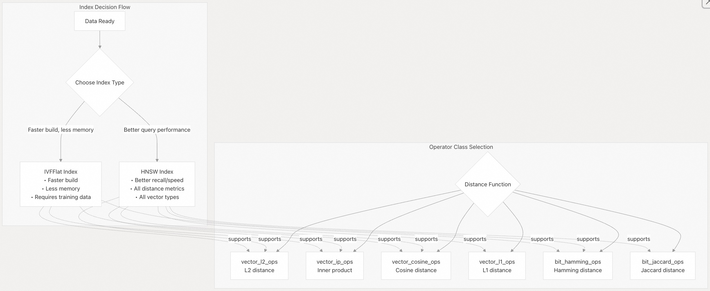
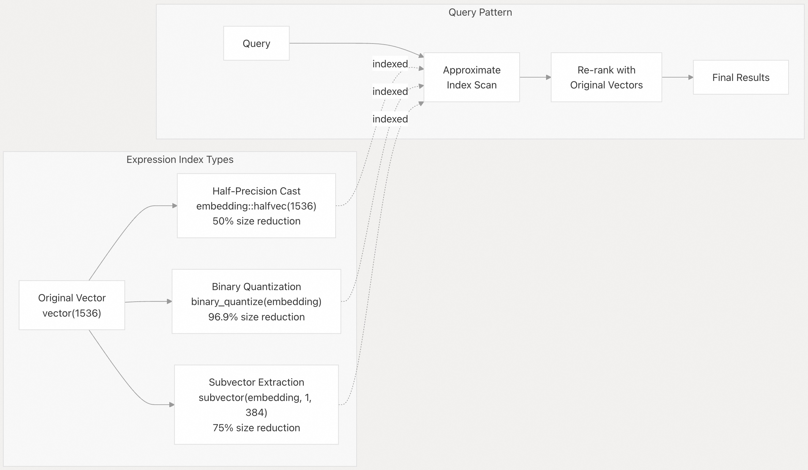

## pgvector 源码学习: 5.2 创建和使用索引  
                  
### 作者                  
digoal                  
                  
### 日期                  
2025-11-05                  
                  
### 标签                  
pgvector , 源码学习                  
                  
----               
                  
## 背景                  
本文介绍在 **pgvector** 中创建和使用 **HNSW**（分层可导航小世界）和 **IVFFlat**（倒排文件平面）索引的实用分步指南。演示常见索引场景和查询模式的 **SQL** 语法。  
  
## 索引概述  
  
默认情况下，**pgvector** 使用**精确最近邻搜索**（*exact nearest neighbor search*），具有**完美召回率**（*perfect recall*）。添加索引可启用**近似最近邻搜索**（**ANN**，*approximate nearest neighbor search*），它**牺牲部分召回率以换取速度**（*trades some recall for speed*）。添加索引后，查询结果可能会有所不同。  
  
**pgvector** 支持两种索引类型：  
  
  * **HNSW**：**多层图结构**（*Multi-layer graph structure*），查询性能更优，但构建速度较慢且内存使用量更高。  
  * **IVFFlat**：**基于聚类的结构**（*Clustering-based structure*），构建速度更快，内存使用量更低，但查询性能较低。  
  
  
  
**来源:**  
[`README.md` 193-203](https://github.com/pgvector/pgvector/blob/d823c445/README.md#L193-L203)  
[`README.md` 204-206](https://github.com/pgvector/pgvector/blob/d823c445/README.md#L204-L206)  
[`README.md` 330-332](https://github.com/pgvector/pgvector/blob/d823c445/README.md#L330-L332)  
  
## 创建 HNSW 索引  
  
### 基本 HNSW 索引创建  
  
**HNSW** 索引可以在空表或已填充的表上创建。每个距离函数都需要一个特定的**操作符类**（*operator class*）。  
  
```  
CREATE TABLE items (id bigserial PRIMARY KEY, embedding vector(384));  
```  
  
| 距离类型 | SQL 示例 | 操作符类（Operator Class） |  
| :--- | :--- | :--- |  
| **L2 距离**（*Euclidean*，欧几里得） | `CREATE INDEX ON items USING hnsw (embedding vector_l2_ops);` | `vector_l2_ops` |  
| **内积**（*Inner Product*） | `CREATE INDEX ON items USING hnsw (embedding vector_ip_ops);` | `vector_ip_ops` |  
| **余弦距离**（*Cosine Distance*） | `CREATE INDEX ON items USING hnsw (embedding vector_cosine_ops);` | `vector_cosine_ops` |  
| **L1 距离**（*Manhattan/Taxicab*，曼哈顿/出租车几何） | `CREATE INDEX ON items USING hnsw (embedding vector_l1_ops);` | `vector_l1_ops` |  
  
**来源:**  
[`README.md` 210-234](https://github.com/pgvector/pgvector/blob/d823c445/README.md#L210-L234)  
[`test/sql/hnsw_vector.sql` 5-7](https://github.com/pgvector/pgvector/blob/d823c445/test/sql/hnsw_vector.sql#L5-L7)  
[`test/sql/hnsw_vector.sql` 22-24](https://github.com/pgvector/pgvector/blob/d823c445/test/sql/hnsw_vector.sql#L22-L24)  
  
### 用于位向量（Bit Vectors）的 HNSW 索引  
  
**二值向量**（*Binary vectors*）使用不同的操作符类来计算**汉明距离**（*Hamming distance*）和 **Jaccard 距离**。  
  
```  
CREATE TABLE image_hashes (id bigserial PRIMARY KEY, hash bit(256));  
```  
  
| 距离类型 | SQL 示例 | 操作符类（Operator Class） |  
| :--- | :--- | :--- |  
| **汉明距离** | `CREATE INDEX ON items USING hnsw (embedding bit_hamming_ops);` | `bit_hamming_ops` |  
| **Jaccard 距离** | `CREATE INDEX ON items USING hnsw (embedding bit_jaccard_ops);` | `bit_jaccard_ops` |  
  
**来源:**  
[`README.md` 236-246](https://github.com/pgvector/pgvector/blob/d823c445/README.md#L236-L246)  
[`README.md` 564-577](https://github.com/pgvector/pgvector/blob/d823c445/README.md#L564-L577)  
  
### HNSW 索引选项  
  
**HNSW** 支持两个影响**召回率**（*recall*）和性能的**构建时参数**（*build-time parameters*）。  
  
```  
CREATE INDEX ON items USING hnsw (embedding vector_l2_ops)   
    WITH (m = 16, ef_construction = 64);  
```      
  
| 参数（Parameter） | 有效范围（Valid Range） | 默认值（Default） | 描述（Description） |  
| :--- | :--- | :--- | :--- |  
| `m` | 2-100 | 16 | **每层最大连接数**（*Max connections per layer*） |  
| `ef_construction` | 4-1000 | 64 | **用于构建的动态候选列表大小**（*Dynamic candidate list size for construction*） |  
  
**约束**（*Constraint*）：`ef_construction` 必须 ≥ 2 × `m`。  
  
更高的 `ef_construction` 值会提高召回率，但代价是索引构建和插入速度变慢。默认值适用于大多数用例。  
  
**来源:**  
[`README.md` 255-266](https://github.com/pgvector/pgvector/blob/d823c445/README.md#L255-L266)  
[`test/sql/hnsw_vector.sql` 92-97](https://github.com/pgvector/pgvector/blob/d823c445/test/sql/hnsw_vector.sql#L92-L97)  
[`test/expected/hnsw_vector.out` 150-163](https://github.com/pgvector/pgvector/blob/d823c445/test/expected/hnsw_vector.out#L150-L163)  
  
### HNSW 的向量类型兼容性  
  
不同的**向量类型**（*Vector Type*）需要相应的**操作符类**（*Operator Class*）。  
  
| 向量类型（Vector Type） | 操作符类后缀（Operator Class Suffix） | 最大维度（Max Dimensions） | 示例（Example） |  
| :--- | :--- | :--- | :--- |  
| `vector` | `vector_*_ops` | 2,000 | `vector_l2_ops` |  
| `halfvec` | `halfvec_*_ops` | 4,000 | `halfvec_l2_ops` |  
| `sparsevec` | `sparsevec_*_ops` | 1,000 **非零**（*non-zero*）维度 | `sparsevec_l2_ops` |  
| `bit` | `bit_*_ops` | 64,000 | `bit_hamming_ops` |  
  
**示例:**  
  
```sql  
-- Half-precision vectors  
CREATE TABLE items_half (embedding halfvec(768));  
CREATE INDEX ON items_half USING hnsw (embedding halfvec_l2_ops);  
  
-- Sparse vectors  
CREATE TABLE items_sparse (embedding sparsevec(10000));  
CREATE INDEX ON items_sparse USING hnsw (embedding sparsevec_l2_ops);  
```  
  
**来源:**  
[`README.md` 248-253](https://github.com/pgvector/pgvector/blob/d823c445/README.md#L248-L253)  
[`README.md` 216](https://github.com/pgvector/pgvector/blob/d823c445/README.md#L216-L216)  
  
## 创建 IVFFlat 索引  
  
### 基本 IVFFlat 索引创建  
  
**IVFFlat** 使用 **k-均值聚类**（*k-means clustering*），因此建议在索引创建之前，表应包含具有代表性的数据。  
  
**推荐的列表（Lists）数量：**  
  
  * 多达 100 万行：`rows / 1000`  
  * 超过 100 万行：`sqrt(rows)`  
  
```  
CREATE TABLE items (id bigserial PRIMARY KEY, embedding vector(384));  
-- Load data first  
INSERT INTO items (embedding) VALUES ...;  
  
-- Create index with appropriate list count  
```  
  
| 距离类型 | SQL 示例 | 操作符类（Operator Class） |  
| :--- | :--- | :--- |  
| **L2 距离** | `CREATE INDEX ON items USING ivfflat (embedding vector_l2_ops) WITH (lists = 100);` | `vector_l2_ops` |  
| **内积** | `CREATE INDEX ON items USING ivfflat (embedding vector_ip_ops) WITH (lists = 100);` | `vector_ip_ops` |  
| **余弦距离** | `CREATE INDEX ON items USING ivfflat (embedding vector_cosine_ops) WITH (lists = 100);` | `vector_cosine_ops` |  
  
**来源:**  
[`README.md` 334-359](https://github.com/pgvector/pgvector/blob/d823c445/README.md#L334-L359)  
[`test/sql/ivfflat_vector.sql` 5-7](https://github.com/pgvector/pgvector/blob/d823c445/test/sql/ivfflat_vector.sql#L5-L7)  
  
### 用于位向量的 IVFFlat 索引  
  
```  
CREATE TABLE binary_vectors (id bigserial PRIMARY KEY, embedding bit(512));  
```  
  
| 距离类型 | SQL 示例 | 操作符类（Operator Class） |  
| :--- | :--- | :--- |  
| **汉明距离** | `CREATE INDEX ON items USING ivfflat (embedding bit_hamming_ops) WITH (lists = 100);` | `bit_hamming_ops` |  
  
**注意：** **IVFFlat** 不支持 **Jaccard 距离**、**L1 距离**或**稀疏向量**（*sparse vectors*）。  
  
**来源:**  
[`README.md` 362-366](https://github.com/pgvector/pgvector/blob/d823c445/README.md#L362-L366)  
  
### IVFFlat 索引选项  
  
**IVFFlat** 有一个构建时参数：**聚类数**（*number of clusters*）。  
  
```  
CREATE INDEX ON items USING ivfflat (embedding vector_l2_ops) WITH (lists = 1000);  
```  
  
| 参数（Parameter） | 有效范围（Valid Range） | 描述（Description） |  
| :--- | :--- | :--- |  
| `lists` | 1-32768 | **k-均值聚类数**（*Number of k-means clusters*） |  
  
**警告：** 如果相对于数据大小创建了太多列表的索引，将导致低召回率。如果发生这种情况，请删除索引，直到表中有更多数据为止。  
  
**来源:**  
[`README.md` 345](https://github.com/pgvector/pgvector/blob/d823c445/README.md#L345-L345)  
[`test/expected/ivfflat_vector.out` 140-145](https://github.com/pgvector/pgvector/blob/d823c445/test/expected/ivfflat_vector.out#L140-L145)  
  
### IVFFlat 的向量类型兼容性  
  
| 向量类型（Vector Type） | 操作符类后缀（Operator Class Suffix） | 最大维度（Max Dimensions） | 示例（Example） |  
| :--- | :--- | :--- | :--- |  
| `vector` | `vector_*_ops` | 2,000 | `vector_l2_ops` |  
| `halfvec` | `halfvec_*_ops` | 4,000 | `halfvec_l2_ops` |  
| `bit` | `bit_*_ops` | 64,000 | `bit_hamming_ops` |  
  
**示例:**  
  
```sql  
CREATE TABLE items_half (embedding halfvec(1536));  
  
-- 使用 halfvec 类型创建 IVFFlat 索引  
CREATE INDEX ON items_half USING ivfflat (embedding halfvec_l2_ops) WITH (lists = 200);  
```  
  
**来源:**  
[`README.md` 368-372](https://github.com/pgvector/pgvector/blob/d823c445/README.md#L368-L372)  
[`README.md` 348](https://github.com/pgvector/pgvector/blob/d823c445/README.md#L348-L348)  
  
## 使用索引进行查询  
  
### 基本最近邻查询  
  
查询必须包含带有**距离操作符**（*distance operator*）的 `ORDER BY` 和 `LIMIT` 才能使用索引。  
  
```sql  
-- Uses HNSW or IVFFlat index on vector_l2_ops  
SELECT * FROM items ORDER BY embedding <-> '[0.1, 0.2, 0.3]' LIMIT 10;  
  
-- Uses index on vector_ip_ops  
SELECT * FROM items ORDER BY embedding <#> '[0.1, 0.2, 0.3]' LIMIT 10;  
  
-- Uses index on vector_cosine_ops  
SELECT * FROM items ORDER BY embedding <=> '[0.1, 0.2, 0.3]' LIMIT 10;  
```  
  
**距离操作符（Distance Operators）：**  
  
| 操作符（Operator） | 距离函数（Distance Function） | 操作符类（Operator Class） |  
| :--- | :--- | :--- |  
| `<->` | L2 (欧几里得) | `*_l2_ops` |  
| `<#>` | 负内积（*Negative inner product*） | `*_ip_ops` |  
| `<=>` | 余弦（*Cosine*） | `*_cosine_ops` |  
| `<+>` | L1 (曼哈顿) | `*_l1_ops` |  
| `<~>` | 汉明（*Hamming*） | `bit_hamming_ops` |  
| `<%>` | Jaccard | `bit_jaccard_ops` |  
  
**来源:**  
[`README.md` 130-144](https://github.com/pgvector/pgvector/blob/d823c445/README.md#L130-L144)  
[`test/sql/hnsw_vector.sql` 11-12](https://github.com/pgvector/pgvector/blob/d823c445/test/sql/hnsw_vector.sql#L11-L12)  
  
### 查询配置  
  
#### HNSW 查询选项  
  
`hnsw.ef_search` 参数控制搜索期间的**动态候选列表大小**（*dynamic candidate list size*）。  
  
```  
-- Default is 40  
SET hnsw.ef_search = 100;  
SELECT * FROM items ORDER BY embedding <-> '[0.1, 0.2, 0.3]' LIMIT 10;  
```  
  
**对于单次查询设置：**  
  
```sql  
BEGIN;  
SET LOCAL hnsw.ef_search = 100;  
SELECT * FROM items ORDER BY embedding <-> '[0.1, 0.2, 0.3]' LIMIT 10;  
COMMIT;  
```  
  
更高的值会提高**召回率**（*recall*），但代价是查询速度变慢。  
  
**来源:**  
[`README.md` 268-285](https://github.com/pgvector/pgvector/blob/d823c445/README.md#L268-L285)  
  
#### IVFFlat 查询选项  
  
`ivfflat.probes` 参数控制搜索多少个**聚类列表**（*cluster lists*）。  
  
```  
-- Default is 1  
SET ivfflat.probes = 10;  
SELECT * FROM items ORDER BY embedding <-> '[0.1, 0.2, 0.3]' LIMIT 10;  
```  
  
**推荐起始值：** `sqrt(lists)`  
  
将 `ivfflat.probes` 设置等于 `lists` 会执行**精确搜索**（*exact search*）（此时查询规划器将不会使用索引）。  
  
**来源:**  
[`README.md` 374-391](https://github.com/pgvector/pgvector/blob/d823c445/README.md#L374-L391)  
[`README.md` 338](https://github.com/pgvector/pgvector/blob/d823c445/README.md#L338-L338)  
  
## 高级索引技术  
  
### 表达式索引（Expression Indexing）  
  
**表达式索引**允许对转换后的向量数据创建索引，这对于减小索引大小或启用专业查询模式很有用。  
  
  
  
```sql  
-- 索引二进制量化（binary quantization）结果  
CREATE INDEX ON items USING hnsw (vector_to_bit(embedding) bit_hamming_ops);  
```  
  
**来源:**  
[`README.md` 551-656](https://github.com/pgvector/pgvector/blob/d823c445/README.md#L551-L656)  
  
### 半精度索引（Half-Precision Indexing）  
  
以**半精度**（*half precision*）对向量进行索引以创建更小的索引。  
  
```sql  
CREATE TABLE items (id bigserial PRIMARY KEY, embedding vector(1536));  
  
-- Create half-precision index using expression  
CREATE INDEX ON items USING hnsw ((embedding::halfvec(1536)) halfvec_l2_ops);  
  
-- Query using the same cast  
SELECT * FROM items   
ORDER BY embedding::halfvec(1536) <-> '[...]'   
LIMIT 5;  
```  
  
这会将索引大小减少 50%，同时对大多数**嵌入**（*embeddings*）的召回率影响很小。  
  
**来源:**  
[`README.md` 550-562](https://github.com/pgvector/pgvector/blob/d823c445/README.md#L550-L562)  
  
### 二值量化（Binary Quantization）  
  
使用**二值量化**进行极限压缩，配合**重新排序**（*re-ranking*）模式。  
  
```sql  
CREATE TABLE items (id bigserial PRIMARY KEY, embedding vector(1536));  
  
-- Create binary quantized index  
CREATE INDEX ON items USING hnsw   
    ((binary_quantize(embedding)::bit(1536)) bit_hamming_ops);  
  
-- Query with re-ranking  
-- 使用原始向量重新排序以获得更高的准确性  
SELECT * FROM (  
    SELECT * FROM items   
    -- 先使用二进制量化进行索引检索, 提速.  
    ORDER BY binary_quantize(embedding)::bit(1536) <~> binary_quantize('[...]')   
    LIMIT 20  
)   
ORDER BY embedding <=> '[...]'   
LIMIT 5;  
```  
  
**来源:**  
[`README.md` 581-601](https://github.com/pgvector/pgvector/blob/d823c445/README.md#L581-L601)  
  
### 子向量索引（Subvector Indexing）  
  
对**维度子集**（*subset of dimensions*）创建索引，以实现更快的近似搜索。  
  
采用原始向量进行rerank, 提升返回结果的准确性.   
  
```sql  
CREATE TABLE items (id bigserial PRIMARY KEY, embedding vector(1024));  
  
-- Index first 256 dimensions  
CREATE INDEX ON items USING hnsw   
    ((subvector(embedding, 1, 256)::vector(256)) vector_cosine_ops);  
  
-- Query with re-ranking  
SELECT * FROM (  
    SELECT * FROM items   
    ORDER BY subvector(embedding, 1, 256)::vector(256) <=>   
             subvector('[...]'::vector, 1, 256)   
    LIMIT 20  
)   
ORDER BY embedding <=> '[...]'   
LIMIT 5;  
```  
  
**来源:**  
[`README.md` 636-656](https://github.com/pgvector/pgvector/blob/d823c445/README.md#L636-L656)  
  
### 部分索引（Partial Indexing）  
  
使用 `WHERE` 子句对数据的特定子集创建索引。  
  
```sql  
-- Index only vectors for a specific category  
CREATE INDEX ON items USING hnsw (embedding vector_l2_ops)   
WHERE (category_id = 123);  
  
-- Query the indexed subset  
SELECT * FROM items   
WHERE category_id = 123   
ORDER BY embedding <-> '[...]'   
LIMIT 5;  
```  
  
**具有部分索引的多个类别：**  
  
```sql  
CREATE INDEX ON items USING hnsw (embedding vector_l2_ops) WHERE (category_id = 1);  
CREATE INDEX ON items USING hnsw (embedding vector_l2_ops) WHERE (category_id = 2);  
CREATE INDEX ON items USING hnsw (embedding vector_l2_ops) WHERE (category_id = 3);  
```  
  
以上场景也可以使用分区表达到类似效果.   
  
当按少数不同的值进行筛选时，部分索引是高效的。  
  
**来源:**  
[`README.md` 458-462](https://github.com/pgvector/pgvector/blob/d823c445/README.md#L458-L462)  
  
### 可变维度索引（Indexes on Variable Dimensions）  
  
将具有不同维度的向量存储在同一列中，但为每个维度创建单独的索引。  
  
通常不建议应用这么设计, 比较混乱.    
  
```sql  
CREATE TABLE embeddings (  
    model_id bigint,   
    item_id bigint,   
    embedding vector,   
    PRIMARY KEY (model_id, item_id)  
);  
  
-- Partial index for 384-dimensional vectors  
CREATE INDEX ON embeddings USING hnsw   
    ((embedding::vector(384)) vector_l2_ops)   
WHERE (model_id = 1);  
  
-- Partial index for 768-dimensional vectors  
CREATE INDEX ON embeddings USING hnsw   
    ((embedding::vector(768)) vector_l2_ops)   
WHERE (model_id = 2);  
  
-- Query specific model  
SELECT * FROM embeddings   
WHERE model_id = 1   
ORDER BY embedding::vector(384) <-> '[...]'   
LIMIT 5;  
```  
  
**来源:**  
[`README.md` 818-835](https://github.com/pgvector/pgvector/blob/d823c445/README.md#L818-L835)  
  
## 索引构建优化  
  
### 内存配置  
  
当图结构适合 `maintenance_work_mem` 时，**HNSW** 构建速度会显著加快。  
  
```sql  
-- Check current setting  
SHOW maintenance_work_mem;  
  
-- Increase for index build  
-- 增加可用于索引构建的内存  
SET maintenance_work_mem = '8GB';  
CREATE INDEX ON items USING hnsw (embedding vector_l2_ops);  
```  
  
当图结构超出可用内存时，会出现通知：  
  
```  
NOTICE: hnsw graph no longer fits into maintenance_work_mem after 100000 tuples  
DETAIL: Building will take significantly more time.  
HINT: Increase maintenance_work_mem to speed up builds.  
```  
  
**来源:**  
[`README.md` 287-303](https://github.com/pgvector/pgvector/blob/d823c445/README.md#L287-L303)  
  
### 并行索引构建（Parallel Index Builds）  
  
**HNSW** 和 **IVFFlat** 都支持**并行索引构建**。  
  
```sql  
-- 允许 PostgreSQL 使用多个 CPU 核心  
-- Increase parallel workers (default is 2)  
SET max_parallel_maintenance_workers = 7;  -- plus leader = 8 workers  -- 当enable leader participart parallel时  
  
-- For large worker counts, may need to increase global limit  
SET max_parallel_workers = 16;  
  
CREATE INDEX ON items USING hnsw (embedding vector_l2_ops);  
```  
  
**来源:**  
[`README.md` 307-313](https://github.com/pgvector/pgvector/blob/d823c445/README.md#L307-L313)  
[`README.md` 395-401](https://github.com/pgvector/pgvector/blob/d823c445/README.md#L395-L401)  
  
### 并发索引创建（Concurrent Index Creation）  
  
在生产环境中，**并发创建索引**（*create indexes concurrently*）以避免阻塞写入操作。  
  
```sql  
CREATE INDEX CONCURRENTLY ON items USING hnsw (embedding vector_l2_ops);  
```  
  
**来源:**  
[`README.md` 690-694](https://github.com/pgvector/pgvector/blob/d823c445/README.md#L690-L694)  
  
### 构建时序建议  
  
为了获得最佳索引构建性能：  
  
1.  首先**加载数据**（*Load data first*）。  
2.  配置 `maintenance_work_mem`。  
3.  在批量加载完成后**创建索引**（*Create indexes*）。  
  
```  
-- 1. Create table  
CREATE TABLE items (id bigserial PRIMARY KEY, embedding vector(384));  
  
-- 2. Bulk load data  
COPY items (embedding) FROM STDIN WITH (FORMAT BINARY);  
  
-- 3. Configure memory  
SET maintenance_work_mem = '8GB';  
  
-- 4. Create index  
CREATE INDEX ON items USING hnsw (embedding vector_l2_ops);  
```  
  
**来源:**  
[`README.md` 305](https://github.com/pgvector/pgvector/blob/d823c445/README.md#L305-L305)  
[`README.md` 683-685](https://github.com/pgvector/pgvector/blob/d823c445/README.md#L683-L685)  
  
## 监控索引进度  
  
**PostgreSQL** 提供了索引构建的进度报告。  
  
```sql  
SELECT * FROM pg_stat_progress_create_index;  
  
-- OR  
  
-- Check indexing progress  
SELECT phase,   
       round(100.0 * blocks_done / nullif(blocks_total, 0), 1) AS "%"   
FROM pg_stat_progress_create_index;  
```  
  
**HNSW 阶段（Phases）：**  
  
1.  `initializing`（初始化）  
2.  `loading tuples`（加载元组）  
  
**IVFFlat 阶段（Phases）：**  
  
1.  `initializing`（初始化）  
2.  `performing k-means`（执行 k-均值）  
3.  `assigning tuples`（分配元组）  
4.  `loading tuples`（加载元组）  
  
**注意：** 对于 **IVFFlat**，`%` 列仅在 `loading tuples` 阶段填充。  
  
**来源:**  
[`README.md` 317-328](https://github.com/pgvector/pgvector/blob/d823c445/README.md#L317-L328)  
[`README.md` 403-418](https://github.com/pgvector/pgvector/blob/d823c445/README.md#L403-L418)  
  
## 验证索引使用情况  
  
### 检查查询计划（Check Query Plan）  
  
使用 **EXPLAIN** 来验证是否使用了索引。  
  
```sql  
EXPLAIN ANALYZE   
SELECT * FROM items   
ORDER BY embedding <-> '[0.1, 0.2, 0.3]'   
LIMIT 5;  
```  
  
在输出中查找 `Index Scan using <index_name>` 。  
  
**强制使用索引进行测试：**  
  
```sql  
BEGIN;  
SET LOCAL enable_seqscan = off;  
SELECT * FROM items ORDER BY embedding <-> '[0.1, 0.2, 0.3]' LIMIT 5;  
COMMIT;  
```  
  
**来源:**  
[`README.md` 698-702](https://github.com/pgvector/pgvector/blob/d823c445/README.md#L698-L702)  
[`README.md` 888-895](https://github.com/pgvector/pgvector/blob/d823c445/README.md#L888-L895)  
  
### 索引大小（Index Size）  
  
检查索引的大小：  
  
```sql  
SELECT pg_size_pretty(pg_relation_size('index_name'));  
```  
  
**来源:**  
[`README.md` 866-872](https://github.com/pgvector/pgvector/blob/d823c445/README.md#L866-L872)  
  
## 操作符类总结  
  
下表总结了索引类型和向量类型之间的**操作符类**（*Operator Class*）可用性：  
  
| 距离（Distance） | 操作符（Operator） | `vector` | `halfvec` | `sparsevec` | `bit` | HNSW | IVFFlat |  
| :--- | :--- | :--- | :--- | :--- | :--- | :--- | :--- |  
| L2 | `<->` | ✓ | ✓ | ✓ | - | ✓ | ✓ |  
| 内积（Inner Product） | `<#>` | ✓ | ✓ | ✓ | - | ✓ | ✓ |  
| 余弦（Cosine） | `<=>` | ✓ | ✓ | ✓ | - | ✓ | ✓ |  
| L1 | `<+>` | ✓ | ✓ | ✓ | - | ✓ | - |  
| 汉明（Hamming） | `<~>` | - | - | - | ✓ | ✓ | ✓ |  
| Jaccard | `<%>` | - | - | - | ✓ | ✓ | - |  
  
**来源:**  
[`README.md` 199-202](https://github.com/pgvector/pgvector/blob/d823c445/README.md#L199-L202)  
[`README.md` 248-253](https://github.com/pgvector/pgvector/blob/d823c445/README.md#L248-L253)  
[`README.md` 368-372](https://github.com/pgvector/pgvector/blob/d823c445/README.md#L368-L372)  
      
#### [期望 PostgreSQL|开源PolarDB 增加什么功能?](https://github.com/digoal/blog/issues/76 "269ac3d1c492e938c0191101c7238216")
  
  
#### [PolarDB 开源数据库](https://openpolardb.com/home "57258f76c37864c6e6d23383d05714ea")
  
  
#### [PolarDB 学习图谱](https://www.aliyun.com/database/openpolardb/activity "8642f60e04ed0c814bf9cb9677976bd4")
  
  
#### [PostgreSQL 解决方案集合](../201706/20170601_02.md "40cff096e9ed7122c512b35d8561d9c8")
  
  
#### [德哥 / digoal's Github - 公益是一辈子的事.](https://github.com/digoal/blog/blob/master/README.md "22709685feb7cab07d30f30387f0a9ae")
  
  
#### [About 德哥](https://github.com/digoal/blog/blob/master/me/readme.md "a37735981e7704886ffd590565582dd0")
  
  

  
