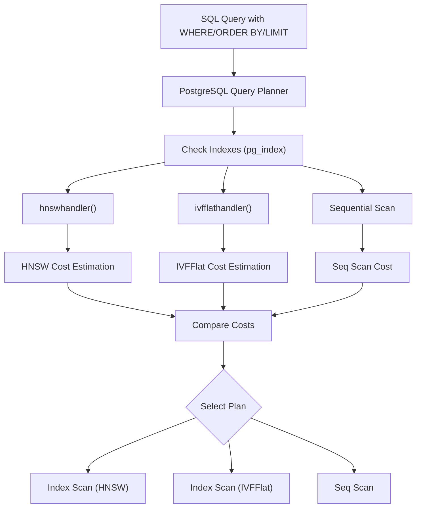
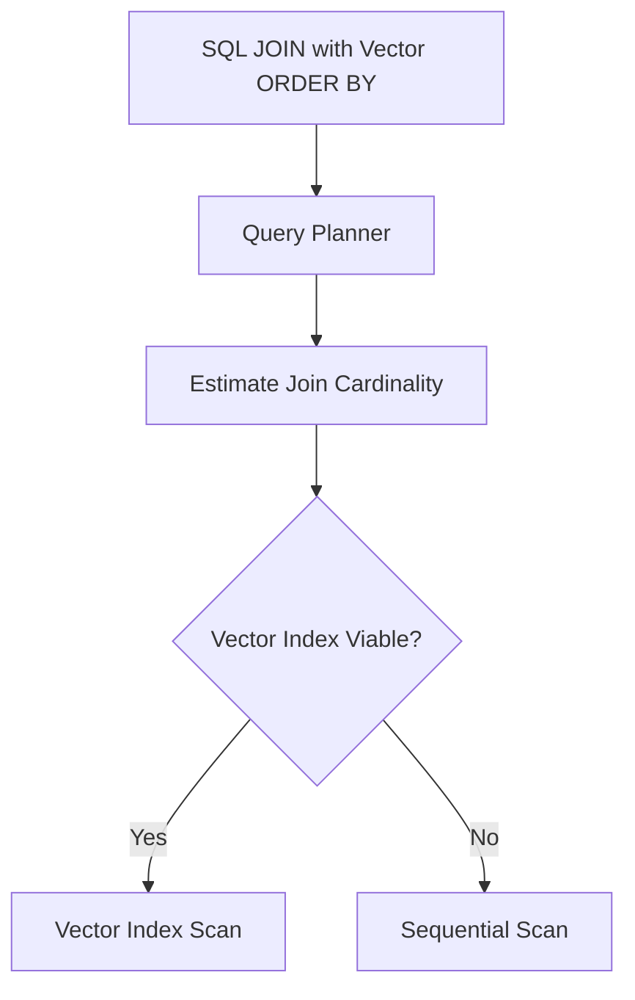
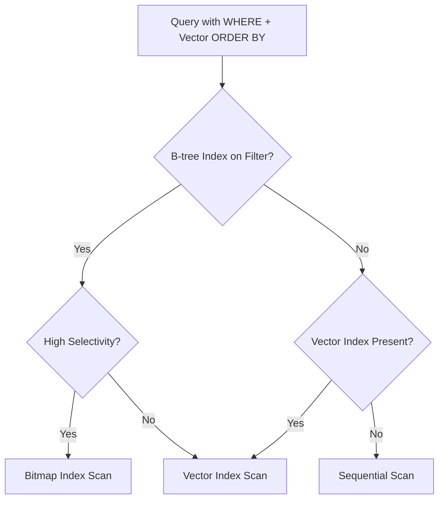
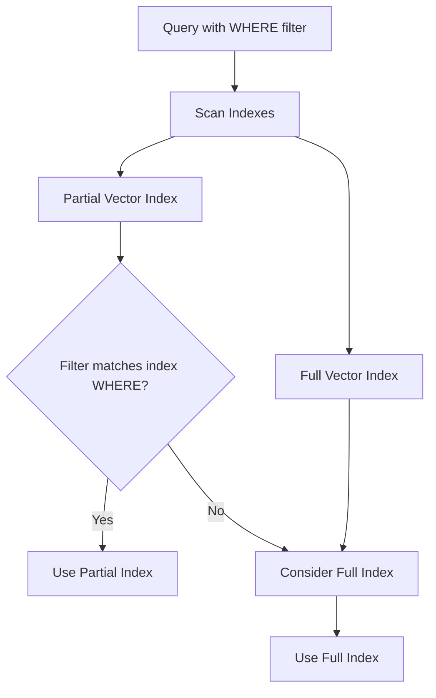
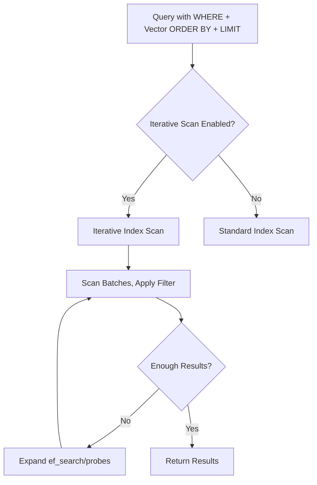

## pgvector 源码学习: 5.3 过滤和复杂查询（Filtering and Complex Queries）  
                    
### 作者                    
digoal                    
                    
### 日期                    
2025-11-05                    
                    
### 标签                    
pgvector , 源码学习                    
                    
----                 
                    
## 背景                    
本文介绍如何在 **pgvector** 中将**向量相似度搜索**（Vector Similarity Search）与 **SQL 过滤**（SQL Filtering）、**多列查询**（Multi-column Queries）和**迭代索引扫描**（Iterative Index Scans）结合使用。它涵盖了**向量索引**（Vector Indexes）与 `WHERE` 子句之间的交互、**查询结构**（Query Structure）对**索引使用**（Index Usage）的影响，以及**过滤查询**（Filtered Queries）的**迭代扫描**（Iterative Scans）配置。  
  
来源: [`README.md` 420-541](https://github.com/pgvector/pgvector/blob/d823c445/README.md#L420-L541)  
  
## 查询规划和索引访问方法选择（Query Planning and Index Access Method Selection）  
  
**PostgreSQL** 的**查询规划器**（Query Planner）集成了 **pgvector** 的**索引访问方法**（Index Access Methods）（`hnswhandler()`、`ivfflathandler()`），用于为涉及**向量相似度**（Vector Similarity）和**过滤器**（Filters）的查询选择**最优执行计划**（Optimal Execution Plan）。规划器使用**成本估算函数**（Cost Estimation Functions）来评估**过滤器**的**选择性**（Selectivity）、`ORDER BY` 和 `LIMIT` 的存在，以及可用**索引**（Indexes）的特性。  
  

  
来源: [`README.md` 420-441](https://github.com/pgvector/pgvector/blob/d823c445/README.md#L420-L441)  
  
## 使用 WHERE 子句进行过滤（Filtering with WHERE Clauses）  
  
**向量相似度查询**（Vector Similarity Queries）可以与标准的 **SQL 过滤器**（SQL Filters）结合。规划器选择**索引**（Index）还是**顺序扫描**（Sequential Scan）取决于**过滤器选择性**（Filter Selectivity）：  
  
  * **高选择性过滤器**（High Selectivity Filters，移除大多数行）：规划器倾向于**顺序扫描**（Sequential Scan）。  
  * **低选择性过滤器**（Low Selectivity Filters，保留大多数行）：规划器倾向于**向量索引扫描**（Vector Index Scan）。  
  
### 表格：过滤器选择性和索引使用（Filter Selectivity and Index Usage）  
  
感觉不够直观, 个人认为向量搜索只要支持索引排序+limit就还不错.   
  
| 过滤模式（Filter Pattern） | **HNSW** 行为（Behavior） | **IVFFlat** 行为（Behavior） | 引用（Reference） |  
| :--- | :--- | :--- | :--- |  
| **高选择性相等**（High Selectivity Equality） | **顺序扫描**（Seq Scan） | **索引扫描**（Index Scan，次优 suboptimal） | [`README.md` 424-426](https://github.com/pgvector/pgvector/blob/d823c445/README.md#L424-L426) |  
| **低选择性不等**（Low Selectivity Inequality） | **索引扫描**（Index Scan） | **索引扫描**（Index Scan） | [`README.md` 428-430](https://github.com/pgvector/pgvector/blob/d823c445/README.md#L428-L430) |  
| **高选择性比较**（High Selectivity Comparison） | **顺序扫描**（Seq Scan） | **索引扫描**（Index Scan，次优 suboptimal） | [`README.md` 434-436](https://github.com/pgvector/pgvector/blob/d823c445/README.md#L434-L436) |  
| `LIKE` 模式，无匹配 | **顺序扫描**（Seq Scan） | **顺序扫描**（Seq Scan） | [`README.md` 436-438](https://github.com/pgvector/pgvector/blob/d823c445/README.md#L436-L438)  
  
来源: [`README.md` 420-441](https://github.com/pgvector/pgvector/blob/d823c445/README.md#L420-L441)  
  
## 基于距离的过滤和查询结构（Distance-Based Filtering and Query Structure）  
  
**向量索引**（Vector Indexes）仅在查询中同时包含对**支持的距离运算符**（Supported Distance Operator）的 `ORDER BY` 和 `LIMIT` 时才会被使用。如果两者缺一，则使用**顺序扫描**（Sequential Scan）。  
  
### 支持的距离运算符（Supported Distance Operators）  
  
| 运算符（Operator） | 描述（Description） | 索引支持（Index Support） |  
| :--- | :--- | :--- |  
| `<->` | **L2**（**欧几里得距离** Euclidean Distance） | **HNSW**, **IVFFlat** |  
| `<#>` | **内积**（Inner Product） | **HNSW**, **IVFFlat** |  
| `<=>` | **余弦距离**（Cosine Distance） | **HNSW**, **IVFFlat** |  
| `<+>` | **L1**（**曼哈顿距离** Manhattan Distance） | **HNSW**, **IVFFlat** |  
  
### 表格：查询结构和索引使用（Query Structure and Index Usage）  
  
| 查询模式（Query Pattern） | 使用索引？（Index Used?） | 引用（Reference） |  
| :--- | :--- | :--- |  
| `ORDER BY <distance> LIMIT` | 是（Yes） | [`README.md` 153-155](https://github.com/pgvector/pgvector/blob/d823c445/README.md#L153-L155) |  
| `WHERE <distance> < value ORDER BY <distance> LIMIT` | 是（Yes） | [`README.md` 153-155](https://github.com/pgvector/pgvector/blob/d823c445/README.md#L153-L155) |  
| `WHERE <distance> < value`（没有 `ORDER BY`/`LIMIT`） | 否（No）（**顺序扫描** Seq Scan） | [`README.md` 153-155](https://github.com/pgvector/pgvector/blob/d823c445/README.md#L153-L155)  
  

  
来源: [`README.md` 153-155](https://github.com/pgvector/pgvector/blob/d823c445/README.md#L153-L155)  
  
## 连接和多列查询（Joins and Multi-Column Queries）  
  
**向量相似度搜索**（Vector Similarity Search）可以与 **连接**（Joins）和**附加过滤器**（Additional Filters）结合使用。规划器会考虑**连接选择性**（Join Selectivity），如果连接不会过多地减少**候选集**（Candidate Set），则可以使用**向量索引**（Vector Indexes）。  
  
  * 如果连接或过滤器是**高选择性**（Highly Selective）的，可能会选择**顺序扫描**（Sequential Scan）。  
  * 如果连接不是**高选择性**的，则使用**向量索引**（Vector Index）。  
  

  
来源: [`README.md` 420-441](https://github.com/pgvector/pgvector/blob/d823c445/README.md#L420-L441)  
  
## 结合使用向量和属性索引（Combining Vector and Attribute Indexes）  
  
对于同时包含**向量相似度**（Vector Similarity）和**属性过滤器**（Attribute Filters）的查询，**PostgreSQL** 可以将**过滤器列**（Filter Columns）上的 **B-tree 索引** 与**向量索引**（Vector Indexes）结合使用。对于**高选择性过滤器**（Highly Selective Filters），可能会使用**属性索引**（Attribute Index）上的**位图索引扫描**（Bitmap Index Scan）。  
  
### 表格：过滤向量查询的索引选择（Index Selection for Filtered Vector Queries）  
  
| 存在的索引（Indexes Present） | 过滤器选择性（Filter Selectivity） | 使用的计划（Plan Used） |  
| :--- | :--- | :--- |  
| **向量**（Vector） + **B-tree** | **高**（High） | **位图索引扫描**（Bitmap Index Scan） |  
| **向量**（Vector） + **B-tree** | **低**（Low） | **向量索引扫描**（Vector Index Scan） |  
| 仅**向量**（Vector Only） | **低**（Low） | **向量索引扫描**（Vector Index Scan） |  
| 无（None） | 任意（Any） | **顺序扫描**（Sequential Scan） |  
  

  
来源: [`README.md` 430-432](https://github.com/pgvector/pgvector/blob/d823c445/README.md#L430-L432)  
  
## 部分向量索引（Partial Vector Indexes）  
  
可以为具有**一致过滤谓词**（Consistent Filter Predicates）的查询创建**部分索引**（Partial Indexes），从而减小**索引大小**（Index Size）并提高针对这些查询的**扫描速度**（Scan Speed）。  
  
  * 使用匹配过滤器的 `WHERE` 子句创建**部分向量索引**（Partial Vector Index）。  
  * 匹配**部分索引条件**（Partial Index Condition）的查询将使用**部分索引**。  
  

  
来源: [`README.md` 460-462](https://github.com/pgvector/pgvector/blob/d823c445/README.md#L460-L462)  
  
## 针对过滤查询的迭代索引扫描（Iterative Index Scans for Filtered Queries）  
  
使用**近似索引**（Approximate Indexes）（**HNSW** 或 **IVFFlat**）时，**过滤**（Filtering）是在**索引扫描**（Index Scan）之后应用的。如果**过滤器**（Filter）具有**选择性**（Selective），则结果数量可能少于预期。**迭代索引扫描**（Iterative Index Scans）通过扫描更多的索引部分直到找到足够的结果来解决这个问题。  
  
### 配置参数（Configuration Parameters）  
  
| 参数（Parameter） | 访问方法（Access Method） | 描述（Description） |  
| :--- | :--- | :--- |  
| `hnsw.ef_search` | **HNSW** | **搜索候选列表大小**（Search Candidate List Size） |  
| `ivfflat.probes` | **IVFFlat** | **要搜索的列表数量**（Number of Lists to Search） |  
| `hnsw.iterative_scan` | **HNSW** | **启用迭代扫描模式**（Enable Iterative Scan Mode） |  
| `ivfflat.iterative_scan` | **IVFFlat** | **启用迭代扫描模式**（Enable Iterative Scan Mode） |  
| `hnsw.max_scan_tuples` | **HNSW** | **最大访问元组数**（Max Tuples to Visit） |  
| `hnsw.scan_mem_multiplier` | **HNSW** | **扫描内存乘数**（Memory Multiplier for Scan） |  
| `ivfflat.max_probes` | **IVFFlat** | **最大探查次数**（Max Number of Probes） |  
  

  
来源: [`README.md` 470-541](https://github.com/pgvector/pgvector/blob/d823c445/README.md#L470-L541)  
  
## 性能监控和调试（Performance Monitoring and Debugging）  
  
### 使用 EXPLAIN ANALYZE  
  
监控**查询执行计划**（Query Execution Plans）以了解**索引使用**（Index Usage）：  
  
```  
-- Check if vector index is used  
EXPLAIN ANALYZE   
SELECT i FROM embeddings   
WHERE category = 'electronics'  
ORDER BY embedding <-> '[1,2,3]'   
LIMIT 20;  
  
-- Look for these patterns:  
-- "Index Scan using vector_idx" - Vector index used  
-- "Seq Scan on embeddings" - Sequential scan used    
-- "Bitmap Index Scan" - Attribute index used  
```  
  
### 查询计划解释（Query Plan Interpretation）  
  
了解**执行计划**中的关键指标有助于优化**查询性能**（Query Performance）：  
  
  * `“Index Scan using [vector_index]”`：**向量索引**（Vector Index）正在被有效使用  
  * `“Seq Scan”`：由于**高过滤器选择性**（High Filter Selectivity）而选择了**顺序扫描**（Sequential Scan）  
  * `“Bitmap Index Scan on [attr_index]”`：**属性索引**（Attribute Index）用于**过滤**（Filtering）  
  * `“Bitmap Heap Scan”`：**属性索引**和**向量索引**的组合使用  
  
来源: [`test/t/017_hnsw_filtering.pl` 41-126](https://github.com/pgvector/pgvector/blob/d823c445/test/t/017_hnsw_filtering.pl#L41-L126) [`test/t/009_ivfflat_filtering.pl` 36-112](https://github.com/pgvector/pgvector/blob/d823c445/test/t/009_ivfflat_filtering.pl#L36-L112)  
      
#### [期望 PostgreSQL|开源PolarDB 增加什么功能?](https://github.com/digoal/blog/issues/76 "269ac3d1c492e938c0191101c7238216")
  
  
#### [PolarDB 开源数据库](https://openpolardb.com/home "57258f76c37864c6e6d23383d05714ea")
  
  
#### [PolarDB 学习图谱](https://www.aliyun.com/database/openpolardb/activity "8642f60e04ed0c814bf9cb9677976bd4")
  
  
#### [PostgreSQL 解决方案集合](../201706/20170601_02.md "40cff096e9ed7122c512b35d8561d9c8")
  
  
#### [德哥 / digoal's Github - 公益是一辈子的事.](https://github.com/digoal/blog/blob/master/README.md "22709685feb7cab07d30f30387f0a9ae")
  
  
#### [About 德哥](https://github.com/digoal/blog/blob/master/me/readme.md "a37735981e7704886ffd590565582dd0")
  
  

  
