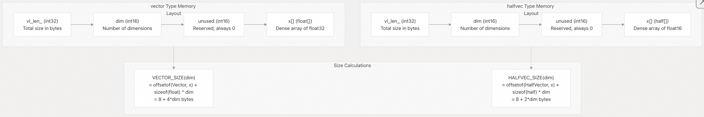
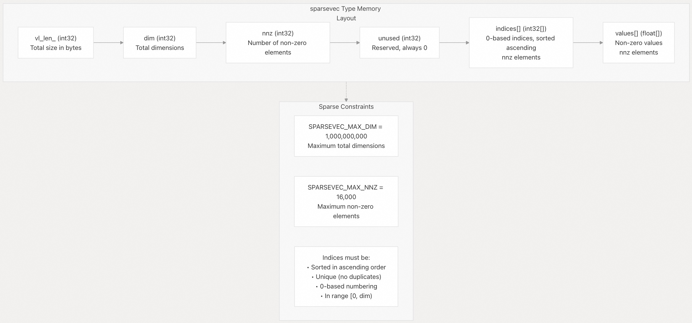
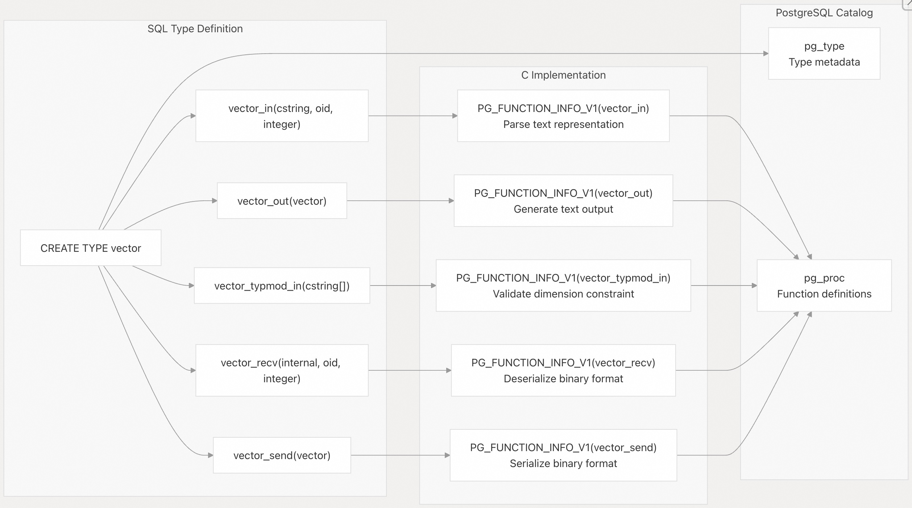
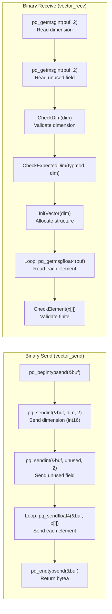
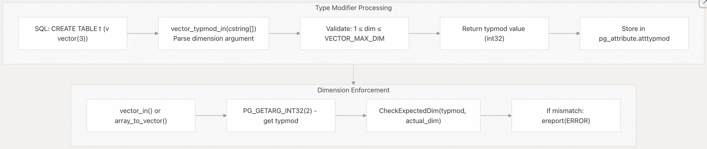
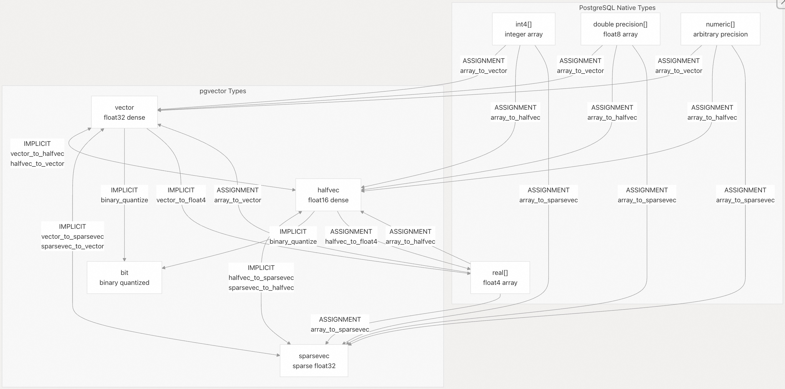
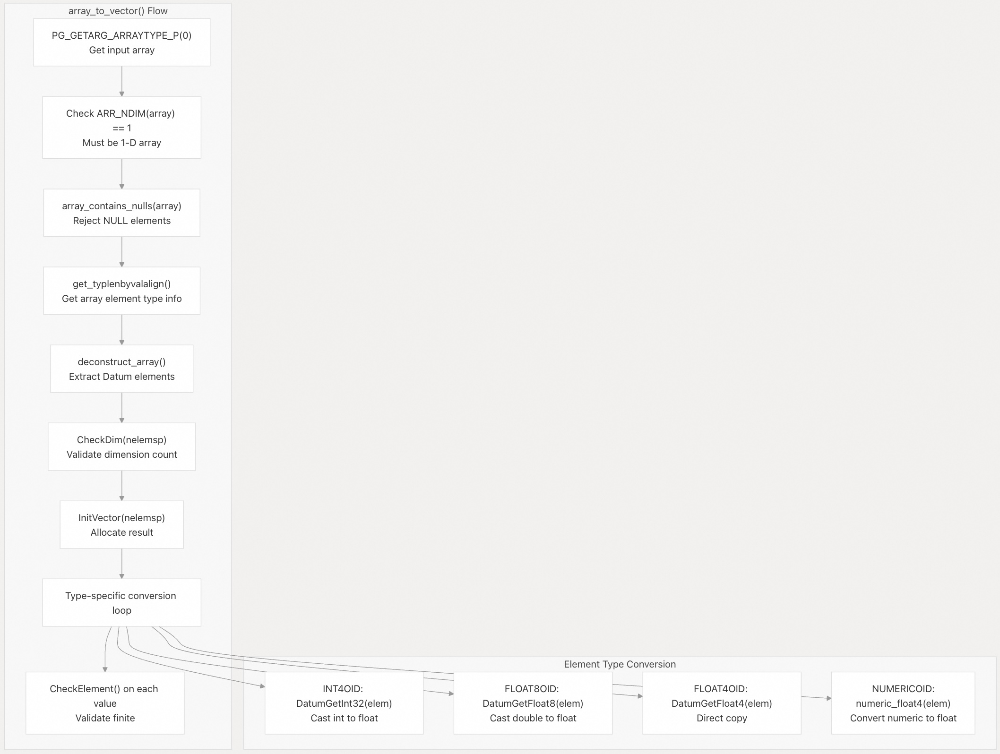
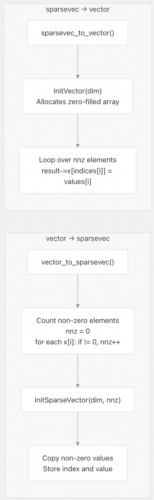
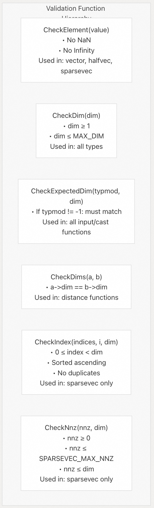

## pgvector 源码学习: 9 类型系统架构 (Type System Architecture)    
                      
### 作者                      
digoal                      
                      
### 日期                      
2025-11-05                      
                      
### 标签                      
pgvector , 源码学习                      
                      
----                   
                      
## 背景                      
本文对 `pgvector` 的内部**类型系统架构 (type system architecture)** 进行了技术深入解析，涵盖了**内存布局 (memory layouts)**、**PostgreSQL 类型注册 (type registration)**、**输入/输出函数 (input/output functions)**、**类型修饰符 (type modifiers)** 以及**类型转换系统 (cast system)**。  
  
## 概述 (Overview)  
  
`pgvector` 实现了四种自定义的 **PostgreSQL 数据类型 (data types)**，每种都通过 PostgreSQL 的**可扩展类型系统 (extensible type system)** 进行注册。其实现遵循 PostgreSQL 的 `varlena` (**可变长度 (variable-length)**) 约定，并提供了完整的 **I/O**、**二进制序列化 (binary serialization)**、**类型修改 (type modification)** 和**类型转换 (casting)** 基础设施。  
  
所有四种类型都通过以下方式集成到 PostgreSQL 的类型系统中：  
  
  * 用于 **SQL 字面量 (SQL literals)** 的**文本输入/输出函数 (Text input/output functions)**  
  * 用于**协议序列化 (protocol serialization)** 的**二进制发送/接收函数 (Binary send/receive functions)**  
  * 用于**维度约束 (dimension constraints)** 的**类型修饰符函数 (Type modifier functions)**  
  * 用于**类型互操作性 (type interoperability)** 的**类型转换函数 (Cast functions)**  
  * 确保**数据完整性 (data integrity)** 的**验证函数 (Validation functions)**  
  
**来源:**  
[`src/vector.c` 1-50](https://github.com/pgvector/pgvector/blob/d823c445/src/vector.c#L1-L50) [`src/halfvec.c` 1-50](https://github.com/pgvector/pgvector/blob/d823c445/src/halfvec.c#L1-L50) [`src/sparsevec.c` 1-50](https://github.com/pgvector/pgvector/blob/d823c445/src/sparsevec.c#L1-L50) [`sql/vector.sql` 1-50](https://github.com/pgvector/pgvector/blob/d823c445/sql/vector.sql#L1-L50)  
  
## 内存布局与存储格式 (Memory Layout and Storage Format)  
  
### 密集向量类型 (Dense Vector Types)  
  
`vector` 和 `halfvec` 都使用一个简单的**密集数组表示 (dense array representation)**，并带有 **PostgreSQL `varlena` 头部 (header)**：  
  
  
  
| 类型 (Type) | 头部大小 (Header Size) | 元素大小 (Element Size) | 最大维度 (Max Dimensions) | 总大小公式 (Total Size Formula) |  
| :--- | :--- | :--- | :--- | :--- |  
| `vector` | 8 字节 (bytes) | 4 字节 (float32) | 16,000 | `8 + 4×dim` |  
| `halfvec` | 8 字节 (bytes) | 2 字节 (float16) | 16,000 | `8 + 2×dim` |  
  
`unused` 字段保留供将来使用，并且必须始终为零。它提供**对齐填充 (alignment padding)** 和**扩展能力 (extension capability)**。  
  
**来源:**  
[`src/vector.h` 1-31](https://github.com/pgvector/pgvector/blob/d823c445/src/vector.h#L1-L31) [`src/halfvec.h` 1-70](https://github.com/pgvector/pgvector/blob/d823c445/src/halfvec.h#L1-L70)  
  
### 稀疏向量类型 (Sparse Vector Type)  
  
`sparsevec` 类型使用**压缩稀疏行 (compressed sparse row, CSR) 格式**，其中**索引 (indices)** 存储在**值 (values)** 之前：  
  
  
  
**稀疏向量布局 (Sparse Vector Layout)：**  
  
  * **头部 (Header)**: 16 字节 (`vl_len_`, `dim`, `nnz`, `unused`)  
  * **索引数组 (Indices array)**: `nnz × 4` 字节 (`int32` 数组)  
  * **值数组 (Values array)**: `nnz × 4` 字节 (`float` 数组)  
  * **总大小 (Total size)**: `16 + 8×nnz` 字节  
  
宏 `SPARSEVEC_SIZE(nnz)` 计算总大小，而 `SPARSEVEC_VALUES(x)` 通过计算偏移量越过索引数组来返回指向值数组的**指针 (pointer)**。  
  
**来源:**  
[`src/sparsevec.h` 1-41](https://github.com/pgvector/pgvector/blob/d823c445/src/sparsevec.h#L1-L41) [`src/sparsevec.c` 138-151](https://github.com/pgvector/pgvector/blob/d823c445/src/sparsevec.c#L138-L151)  
  
### 位向量类型 (Bit Vector Type)  
  
**位向量 (Bit vectors)** 使用 PostgreSQL 内置的 `varbit` 类型（**可变长度位字符串 (variable-length bit string)**），并通过 `binary_quantize()` 函数创建，而不是拥有单独的**类型定义 (type definition)**。它们为每个**维度 (dimension)** 存储一位 (bit)，从而提供了极高的**压缩率 (compression)**。  
  
**来源:**  
[`src/vector.c` 941-967](https://github.com/pgvector/pgvector/blob/d823c445/src/vector.c#L941-L967) [`sql/vector.sql` 55-56](https://github.com/pgvector/pgvector/blob/d823c445/sql/vector.sql#L55-L56)  
  
## PostgreSQL 类型注册 (Type Registration with PostgreSQL)  
  
### 注册流程 (Registration Flow)  
  
  
  
每种类型都在 [`sql/vector.sql`](https://github.com/pgvector/pgvector/blob/d823c445/sql/vector.sql) 中注册，并带有五个必需的函数：  
  
| 函数 (Function) | 目的 (Purpose) | C 实现 (C Implementation) |  
| :--- | :--- | :--- |  
| `*_in` | 解析**文本字面量 (text literals)** | `vector_in()`、`halfvec_in()`、`sparsevec_in()` |  
| `*_out` | 生成**文本输出 (text output)** | `vector_out()`、`halfvec_out()`、`sparsevec_out()` |  
| `*_typmod_in` | 解析**类型修饰符 (type modifiers)** | `vector_typmod_in()`、`halfvec_typmod_in()`、`sparsevec_typmod_in()` |  
| `*_recv` | **反序列化二进制 (Deserialize binary)** | `vector_recv()`、`halfvec_recv()`、`sparsevec_recv()` |  
| `*_send` | **序列化二进制 (Serialize binary)** | `vector_send()`、`halfvec_send()`、`sparsevec_send()` |  
  
所有类型都使用 `STORAGE = external`，以便在数据超过 PostgreSQL 的 **TOAST 阈值 (TOAST threshold)** 时，将其**行外存储 (out-of-line)**。  
  
**来源:**  
[`sql/vector.sql` 4-30](https://github.com/pgvector/pgvector/blob/d823c445/sql/vector.sql#L4-L30) [`sql/vector.sql` 336-360](https://github.com/pgvector/pgvector/blob/d823c445/sql/vector.sql#L336-L360) [`sql/vector.sql` 693-717](https://github.com/pgvector/pgvector/blob/d823c445/sql/vector.sql#L693-L717)  
  
## 输入/输出系统 (Input/Output System)  
  
### 文本格式解析 (Text Format Parsing)  

```mermaid  
graph TB  
    subgraph VectorInput["vector Text Input: '[1.5,2.0,3.5]'"]
        VParse1["vector_in(cstring, oid, typmod)"]  
        VParse2["Skip whitespace, check for '['"]  
        VParse3["Loop: strtof() to parse float"]  
        VParse4["CheckElement() - validate finite"]  
        VParse5["CheckDim() - validate 1 ≤ dim ≤ 16000"]  
        VParse6["CheckExpectedDim(typmod, dim)"]  
        VParse7["InitVector(dim) - allocate"]  
        VParse8["Copy parsed values to result->x[]"]  
          
        VParse1 --> VParse2 --> VParse3 --> VParse4 --> VParse5  
        VParse5 --> VParse6 --> VParse7 --> VParse8  
    end  
      
    subgraph SparseInput["sparsevec Text Input: '{1:1.5,3:3.5}/5'"]
        SParse1["sparsevec_in(cstring, oid, typmod)"]  
        SParse2["Parse pairs: strtol(index), strtof(value)"]  
        SParse3["Skip zero values"]  
        SParse4["qsort() by index"]  
        SParse5["CheckIndex() - validate sorted, unique, in-range"]  
        SParse6["InitSparseVector(dim, nnz) - allocate"]  
        SParse7["Copy indices and values"]  
          
        SParse1 --> SParse2 --> SParse3 --> SParse4 --> SParse5  
        SParse5 --> SParse6 --> SParse7  
    end  
```  
  

  
**向量输入 (Vector Input)** ([`src/vector.c` 165-270](https://github.com/pgvector/pgvector/blob/d823c445/src/vector.c#L165-L270)):  
  
  * 解析格式: `[value1,value2,...]`  
  * 使用 `strtof()` 进行**浮点数解析 (float parsing)**（避免**二次舍入 (double-rounding)**）  
  * 使用 `CheckElement()` 验证每个**元素 (element)**（无 **NaN** (非数字)，无 **Infinity** (无穷大)）  
  * 使用 `CheckDim()` 和 `CheckExpectedDim()` 验证**维度计数 (dimension count)**  
  
**稀疏向量输入 (Sparse Vector Input)** ([`src/sparsevec.c` 187-389](https://github.com/pgvector/pgvector/blob/d823c445/src/sparsevec.c#L187-L389)):  
  
  * 解析格式: `{index1:value1,index2:value2,...}/dimensions`  
  * 文本中使用**基于 1 的编号 (1-based numbering)**（内部转换为**基于 0 的 (0-based)**）  
  * 自动过滤**零值 (zero values)**  
  * 使用 `qsort()` 和 `CompareIndices()` 对**索引 (indices)** 进行排序  
  * 验证索引是**唯一 (unique)** 的、**已排序 (sorted)** 的且**在范围内 (in-range)**  
  
**半向量输入 (Half Vector Input)** ([`src/halfvec.c` 165-271](https://github.com/pgvector/pgvector/blob/d823c445/src/halfvec.c#L165-L271)):  
  
  * 与 `vector` 相同的文本格式: `[value1,value2,...]`  
  * 使用 `Float4ToHalfUnchecked()` 将**浮点数 (float)** 转换为**半精度 (half-precision)**  
  * 额外的**范围检查 (range checking)** 以防止半精度**溢出 (overflow)**  
  
**来源:**  
[`src/vector.c` 165-270](https://github.com/pgvector/pgvector/blob/d823c445/src/vector.c#L165-L270) [`src/sparsevec.c` 187-389](https://github.com/pgvector/pgvector/blob/d823c445/src/sparsevec.c#L187-L389) [`src/halfvec.c` 165-271](https://github.com/pgvector/pgvector/blob/d823c445/src/halfvec.c#L165-L271)  
  
### 二进制序列化 (Binary Serialization)  
  
**二进制发送/接收函数 (Binary send/receive functions)** 使用 PostgreSQL 的 `StringInfo` **缓冲区 API (buffer API)**，并确保**平台无关的字节顺序 (platform-independent byte ordering)**：  
  

  
**`vector` 的二进制格式 (Binary Format for vector)：**  
  
  * 2 字节: 维度 (`int16`)  
  * 2 字节: `unused` 字段 (始终为 0)  
  * dim × 4 字节: **浮点数值 (float values)**  
  
**`sparsevec` 的二进制格式 (Binary Format for sparsevec)：**  
  
  * 4 字节: 维度 (`int32`)  
  * 4 字节: `nnz` (**非零元素数量 (number of non-zero elements)**) (`int32`)  
  * 4 字节: `unused` 字段 (始终为 0)  
  * `nnz` × 4 字节: 索引 (`int32[]`, 基于 0)  
  * `nnz` × 4 字节: 值 (`float[]`)  
  
半向量使用自定义的 `pq_getmsghalf()` 和 `pq_sendhalf()` 辅助函数来**序列化 (serialize)** 16 位的**半精度值 (half-precision values)**。  
  
**来源:**  
[`src/vector.c` 363-411](https://github.com/pgvector/pgvector/blob/d823c445/src/vector.c#L363-L411) [`src/sparsevec.c` 492-565](https://github.com/pgvector/pgvector/blob/d823c445/src/sparsevec.c#L492-L565) [`src/halfvec.c` 28-55](https://github.com/pgvector/pgvector/blob/d823c445/src/halfvec.c#L28-L55)  
  
## 类型修饰符与验证 (Type Modifiers and Validation)  
  
**类型修饰符 (Type modifiers)** 允许用户在类型级别指定**维度约束 (dimension constraints)**（例如 `vector(3)`、`halfvec(128)`）：  
  
  
  
**类型修饰符函数 (Type Modifier Functions)：**  
  
| 函数 (Function) | 验证逻辑 (Validation Logic) | 无效时的错误 (Error on Invalid) |  
| :--- | :--- | :--- |  
| `vector_typmod_in()` | `1 ≤ dim ≤ 16000` | `ERRCODE_INVALID_PARAMETER_VALUE` (**无效参数值错误码**) |  
| `halfvec_typmod_in()` | `1 ≤ dim ≤ 16000` | `ERRCODE_INVALID_PARAMETER_VALUE` |  
| `sparsevec_typmod_in()` | `1 ≤ dim ≤ 1,000,000,000` | `ERRCODE_INVALID_PARAMETER_VALUE` |  
  
**维度验证辅助函数 (Dimension Validation Helpers)：**  
  
  * `CheckDim(int dim)` - 验证**维度 (dimension)** 是否在有效范围内  
  * `CheckExpectedDim(int32 typmod, int dim)` - 强制执行类型修饰符约束  
  * `CheckDims(Type *a, Type *b)` - 确保两个向量具有**匹配的维度 (matching dimensions)**  
  
这些函数在以下过程中被调用：  
  
  * 输入函数 (`vector_in`、`halfvec_in`、`sparsevec_in`)  
  * 二进制接收 (`vector_recv`、`halfvec_recv`、`sparsevec_recv`)  
  * 类型转换函数 (`array_to_vector`、`halfvec_to_vector` 等)  
  * **距离函数 (Distance functions)**（确保**操作数 (operands)** 兼容）  
  
**来源:**  
[`src/vector.c` 72-96](https://github.com/pgvector/pgvector/blob/d823c445/src/vector.c#L72-L96) [`src/halfvec.c` 72-96](https://github.com/pgvector/pgvector/blob/d823c445/src/halfvec.c#L72-L96) [`src/sparsevec.c` 42-87](https://github.com/pgvector/pgvector/blob/d823c445/src/sparsevec.c#L42-L87) [`src/vector.c` 332-358](https://github.com/pgvector/pgvector/blob/d823c445/src/vector.c#L332-L358)  
  
## 类型转换系统与类型转换 (Cast System and Type Conversions)  
  
**Cast Graph**  
  
  
  
### 类型转换类别 (Cast Categories)  
  
**隐式转换 (IMPLICIT casts)**（自动发生，无需显式转换）：  
  
  * `vector` ↔ `halfvec`  
  * `vector` ↔ `sparsevec`  
  * `halfvec` ↔ `sparsevec`  
  * `vector` → `real[]`  
  * `vector` → `bit`（通过 `binary_quantize`）  
  * `halfvec` → `bit`（通过 `binary_quantize`）  
  
**赋值转换 (ASSIGNMENT casts)**（允许在赋值操作中进行，但在表达式中需要**显式转换 (explicit cast)**）：  
  
  * `int4[]` → `vector`, `halfvec`, `sparsevec`  
  * `real[]` → `vector`, `halfvec`, `sparsevec`  
  * `double precision[]` → `vector`, `halfvec`, `sparsevec`  
  * `numeric[]` → `vector`, `halfvec`, `sparsevec`  
  * `halfvec` → `real[]`  
  
**来源:**  
[`sql/vector.sql` 154-170](https://github.com/pgvector/pgvector/blob/d823c445/sql/vector.sql#L154-L170) [`sql/vector.sql` 490-512](https://github.com/pgvector/pgvector/blob/d823c445/sql/vector.sql#L490-L512) [`sql/vector.sql` 862-886](https://github.com/pgvector/pgvector/blob/d823c445/sql/vector.sql#L862-L886)  
  
### 数组转换实现 (Array Conversion Implementation)  
  
`array_to_vector()` 系列函数处理从 PostgreSQL **数组 (arrays)** 进行的转换：  
  
  
  
**数组到向量转换 (Array to Vector Conversion)** ([`src/vector.c` 432-501](https://github.com/pgvector/pgvector/blob/d823c445/src/vector.c#L432-L501)):  
  
  * 接受 `int4[]`、`real[]`、`double precision[]`、`numeric[]`  
  * 使用 `deconstruct_array()` 来提取元素  
  * 对每个元素执行**特定类型的转换 (type-specific conversion)**  
  * 验证所有元素都是**有限 (finite)** 的（无 NaN，无 Infinity）  
  
**数组到稀疏向量 (Array to Sparse Vector)** ([`src/sparsevec.c` 672-798](https://github.com/pgvector/pgvector/blob/d823c445/src/sparsevec.c#L672-L798)):  
  
  * 在第一次**遍历 (pass)** 中计算**非零元素 (non-zero elements)** 的数量  
  * 根据 `nnz` 计数分配**稀疏结构 (sparse structure)**  
  * 仅存储非零值及其索引  
  * 对 MSVC `/fp:fast` 模式进行特殊处理，以检测 NaN/Infinity  
  
**来源:**  
[`src/vector.c` 432-501](https://github.com/pgvector/pgvector/blob/d823c445/src/vector.c#L432-L501) [`src/sparsevec.c` 672-798](https://github.com/pgvector/pgvector/blob/d823c445/src/sparsevec.c#L672-L798) [`src/halfvec.c` 425-494](https://github.com/pgvector/pgvector/blob/d823c445/src/halfvec.c#L425-L494)  
  
### 密集-稀疏转换 (Dense-Sparse Conversions)  
  
  
  
**密集到稀疏 (Dense to Sparse)** ([`src/sparsevec.c` 586-624](https://github.com/pgvector/pgvector/blob/d823c445/src/sparsevec.c#L586-L624)):  
  
  * 第一次遍历：计算非零元素的数量  
  * 使用**精确的 `nnz` 计数 (exact nnz count)** 分配稀疏结构  
  * 第二次遍历：复制索引和值  
  
**稀疏到密集 (Sparse to Dense)** ([`src/vector.c` 1303-1321](https://github.com/pgvector/pgvector/blob/d823c445/src/vector.c#L1303-L1321)):  
  
  * 分配**密集向量 (dense vector)**（由 `palloc0` **初始化为零 (initialized to zeros)**）  
  * 使用索引将**稀疏值分散 (Scatter sparse values)** 到密集数组中  
  
**半精度到稀疏 (Half to Sparse)** ([`src/sparsevec.c` 629-667](https://github.com/pgvector/pgvector/blob/d823c445/src/sparsevec.c#L629-L667)):  
  
  * 使用 `HalfIsZero()` 检测**零半精度值 (zero half-precision values)**  
  * 在复制过程中使用 `HalfToFloat4()` 将半精度转换为**浮点数 (float)**  
  
**来源:**  
[`src/sparsevec.c` 586-624](https://github.com/pgvector/pgvector/blob/d823c445/src/sparsevec.c#L586-L624) [`src/vector.c` 1303-1321](https://github.com/pgvector/pgvector/blob/d823c445/src/vector.c#L1303-L1321) [`src/sparsevec.c` 629-667](https://github.com/pgvector/pgvector/blob/d823c445/src/sparsevec.c#L629-L667)  
  
## 内部辅助函数与宏 (Internal Helper Functions and Macros)  
  
### 内存分配辅助函数 (Memory Allocation Helpers)  
  
每种类型都提供一个**初始化函数 (initialization function)**，用于分配和初始化结构：  
  
| 函数 (Function) | 实现 (Implementation) | 用法 (Usage) |  
| :--- | :--- | :--- |  
| `InitVector(dim)` | `palloc0(VECTOR_SIZE(dim))` `SET_VARSIZE()` | [`src/vector.c` 118-130](https://github.com/pgvector/pgvector/blob/d823c445/src/vector.c#L118-L130) |  
| `InitHalfVector(dim)` | `palloc0(HALFVEC_SIZE(dim))` `SET_VARSIZE()` | [`src/halfvec.c` 118-130](https://github.com/pgvector/pgvector/blob/d823c445/src/halfvec.c#L118-L130) |  
| `InitSparseVector(dim, nnz)` | `palloc0(SPARSEVEC_SIZE(nnz))` `SET_VARSIZE()` | [`src/sparsevec.c` 138-151](https://github.com/pgvector/pgvector/blob/d823c445/src/sparsevec.c#L138-L151) |  
  
所有函数都使用 `palloc0()` 进行**零初始化分配 (zero-initialized allocation)**，并使用 `SET_VARSIZE()` 设置 **`varlena` 头部 (varlena header)**。  
  
### Datum 提取宏 (Datum Extraction Macros)  
  
```  
// Vector type  
#define DatumGetVector(x)       ((Vector *) PG_DETOAST_DATUM(x))  
#define PG_GETARG_VECTOR_P(x)   DatumGetVector(PG_GETARG_DATUM(x))  
#define PG_RETURN_VECTOR_P(x)   PG_RETURN_POINTER(x)  
  
// HalfVector type  
#define DatumGetHalfVector(x)   ((HalfVector *) PG_DETOAST_DATUM(x))  
#define PG_GETARG_HALFVEC_P(x)  DatumGetHalfVector(PG_GETARG_DATUM(x))  
#define PG_RETURN_HALFVEC_P(x)  PG_RETURN_POINTER(x)  
  
// SparseVector type  
#define DatumGetSparseVector(x)     ((SparseVector *) PG_DETOAST_DATUM(x))  
#define PG_GETARG_SPARSEVEC_P(x)    DatumGetSparseVector(PG_GETARG_DATUM(x))  
#define PG_RETURN_SPARSEVEC_P(x)    PG_RETURN_POINTER(x)  
```  
  
这些**宏 (macros)** 自动处理 PostgreSQL 的 **Datum 类型** 和 **TOAST**（**超大属性存储技术 (The Oversized-Attribute Storage Technique)**）**解压缩 (decompression)**。  
  
**来源:**  
[`src/vector.h` 6-9](https://github.com/pgvector/pgvector/blob/d823c445/src/vector.h#L6-L9) [`src/halfvec.h` 56-58](https://github.com/pgvector/pgvector/blob/d823c445/src/halfvec.h#L56-L58) [`src/sparsevec.h` 7-9](https://github.com/pgvector/pgvector/blob/d823c445/src/sparsevec.h#L7-L9)  
  
### 稀疏向量值访问 (Sparse Vector Value Access)  
  
由于稀疏向量值存储在索引数组之后，一个辅助函数会计算**值指针 (values pointer)**：  
  
```  
static inline float *  
SPARSEVEC_VALUES(SparseVector * x)  
{  
    return (float *) (((char *) x) + offsetof(SparseVector, indices) +   
                      (x->nnz * sizeof(int32)));  
}  
```  
  
这种**指针运算 (pointer arithmetic)** 跳过头部和索引，以到达值数组。  
  
**来源:**  
[`src/sparsevec.h` 32-36](https://github.com/pgvector/pgvector/blob/d823c445/src/sparsevec.h#L32-L36)  
  
### 验证函数 (Validation Functions)  
  
  
  
所有**验证函数 (validation functions)** 都使用 `ereport(ERROR, ...)` 来引发带有相应**错误码 (error codes)** 的 **PostgreSQL 异常 (exceptions)**：  
  
  * `ERRCODE_DATA_EXCEPTION`（**数据异常错误码**）- 无效的数据值  
  * `ERRCODE_PROGRAM_LIMIT_EXCEEDED`（**程序限制超出错误码**）- 维度限制超出  
  * `ERRCODE_INVALID_PARAMETER_VALUE`（**无效参数值错误码**）- 无效的类型修饰符  
  
**来源:**  
[`src/vector.c` 60-113](https://github.com/pgvector/pgvector/blob/d823c445/src/vector.c#L60-L113) [`src/halfvec.c` 60-113](https://github.com/pgvector/pgvector/blob/d823c445/src/halfvec.c#L60-L113) [`src/sparsevec.c` 29-116](https://github.com/pgvector/pgvector/blob/d823c445/src/sparsevec.c#L29-L116)  
  
### 半精度实用工具 (Half-Precision Utilities)  
  
`halfvec` 类型使用一个单独的**实用工具层 (utility layer)**，用于**半精度浮点数转换 (half-precision float conversions)**：  
  
**转换函数 (Conversion Functions)：**  
  
  * `Float4ToHalf(float)` - 将 **float32** 转换为**半精度 (half)**，带有**范围检查 (range checking)**  
  * `Float4ToHalfUnchecked(float)` - 转换时**不进行溢出检查 (overflow checks)**  
  * `HalfToFloat4(half)` - 将半精度转换为 float32  
  * `HalfIsNan(half)` - 检查 **NaN** (非数字)  
  * `HalfIsInf(half)` - 检查**无穷大 (infinity)**  
  * `HalfIsZero(half)` - 检查**零值 (zero value)**  
  
**平台调度 (Platform Dispatch)：**  
  
系统使用**运行时 CPU 检测 (runtime CPU detection)** 来选择**优化的实现 (optimized implementations)**：  
  
  * **F16C 支持**: 在带有 F16C 的 x86-64 上使用**硬件指令 (hardware instructions)**  
  * **FLT16 支持**: 在可用时使用编译器的原生 `_Float16` 类型  
  * **回退 (Fallback)**: 使用**位操作 (bit manipulation)** 的**软件实现 (Software implementation)**  
  
**来源:**  
[`src/halfvec.h` 38-51](https://github.com/pgvector/pgvector/blob/d823c445/src/halfvec.h#L38-L51) [`src/halfutils.h`](https://github.com/pgvector/pgvector/blob/d823c445/src/halfutils.h) [`src/halfutils.c`](https://github.com/pgvector/pgvector/blob/d823c445/src/halfutils.c)  
  
## 总结 (Summary)  
  
`pgvector` 的**类型系统架构 (type system architecture)** 展示了清晰的**关注点分离 (separation of concerns)**：  
  
1.  **内存布局 (Memory Layout)**: 紧凑的 **`varlena` 结构 (varlena structures)** 和**特定于类型的优化 (type-specific optimizations)**  
2.  **PostgreSQL 集成 (PostgreSQL Integration)**: 完整的 I/O、二进制序列化和类型修饰符支持  
3.  **验证 (Validation)**: 在每个**入口点 (entry point)** 进行**全面检查 (Comprehensive checking)**  
4.  **类型安全 (Type Safety)**: **维度检查 (Dimension checking)** 和**元素验证 (element validation)** 可防止无效数据  
5.  **互操作性 (Interoperability)**: **丰富的类型转换系统 (Rich cast system)** 实现了类型之间的**无缝转换 (seamless conversions)**  
  
该架构遵循 PostgreSQL 约定，同时增加了**领域特定的优化 (domain-specific optimizations)**，例如**稀疏存储 (sparse storage)** 和**半精度支持 (half-precision support)**。所有**公共 API (public APIs)** 均通过**SQL 函数定义 (SQL function definitions)** 公开，这些定义委托给通过 `PG_FUNCTION_INFO_V1` 注册的 C 实现。  
  
**来源:**  
[`src/vector.c` 1-1322](https://github.com/pgvector/pgvector/blob/d823c445/src/vector.c#L1-L1322) [`src/halfvec.c` 1-1364](https://github.com/pgvector/pgvector/blob/d823c445/src/halfvec.c#L1-L1364) [`src/sparsevec.c` 1-1257](https://github.com/pgvector/pgvector/blob/d823c445/src/sparsevec.c#L1-L1257) [`sql/vector.sql` 1-1000](https://github.com/pgvector/pgvector/blob/d823c445/sql/vector.sql#L1-L1000)  
    
#### [期望 PostgreSQL|开源PolarDB 增加什么功能?](https://github.com/digoal/blog/issues/76 "269ac3d1c492e938c0191101c7238216")
  
  
#### [PolarDB 开源数据库](https://openpolardb.com/home "57258f76c37864c6e6d23383d05714ea")
  
  
#### [PolarDB 学习图谱](https://www.aliyun.com/database/openpolardb/activity "8642f60e04ed0c814bf9cb9677976bd4")
  
  
#### [PostgreSQL 解决方案集合](../201706/20170601_02.md "40cff096e9ed7122c512b35d8561d9c8")
  
  
#### [德哥 / digoal's Github - 公益是一辈子的事.](https://github.com/digoal/blog/blob/master/README.md "22709685feb7cab07d30f30387f0a9ae")
  
  
#### [About 德哥](https://github.com/digoal/blog/blob/master/me/readme.md "a37735981e7704886ffd590565582dd0")
  
  

  
