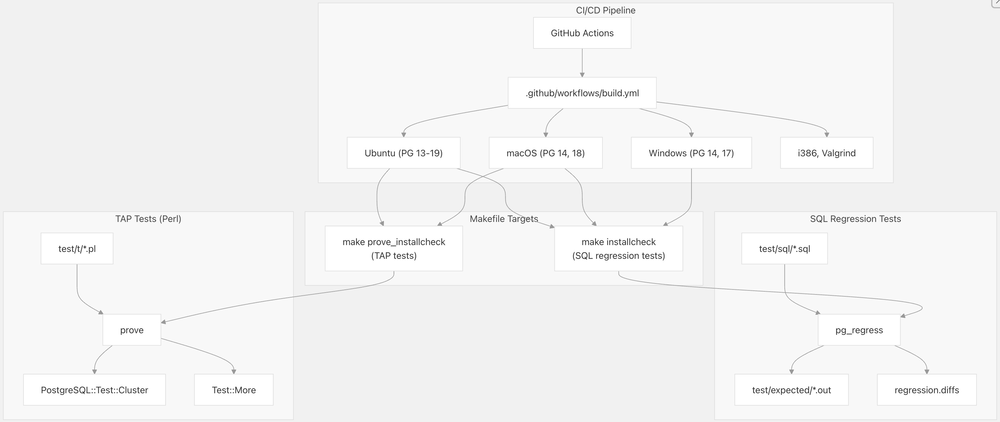
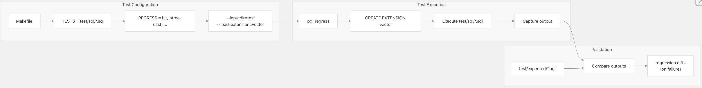
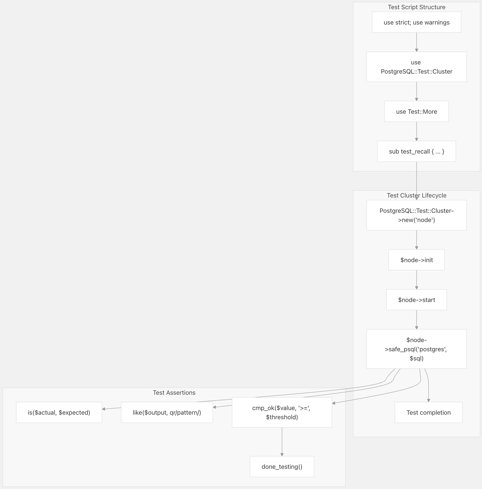
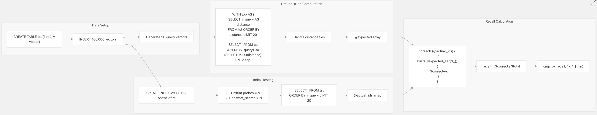
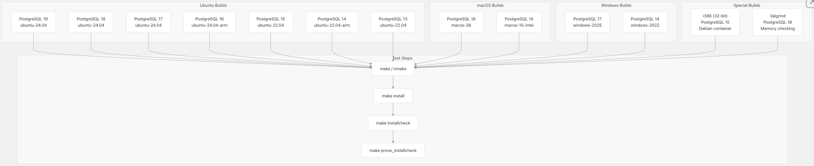
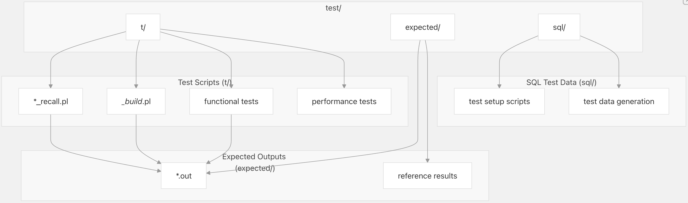

## pgvector 源码学习: 8 测试与质量保证 (Testing and Quality Assurance)   
                                                                        
### 作者                                                                        
digoal                                                                        
                                                                        
### 日期                                                                        
2025-11-05                                                                        
                                                                        
### 标签                                                                        
pgvector , 源码学习                                                                        
                                                                        
----                                                                        
                                                                        
## 背景    
本文介绍 **pgvector** 中使用的全面 **测试基础设施 (testing infrastructure)** 和 **质量保证 (QA)** 流程。该 **测试套件 (test suite)** 确保了不同 **向量数据类型 (vector data types)**、**距离度量 (distance metrics)** 和 **索引方法 (indexing methods)** 之间的正确 **功能性 (functionality)**、**性能特征 (performance characteristics)** 和 **索引召回准确性 (index recall accuracy)**。  
  
## 测试基础设施概览 (Testing Infrastructure Overview)  
  
**pgvector** 采用双策略测试方法，结合了 **SQL 回归测试 (SQL regression tests)** 和 **TAP（测试一切协议）测试 (TAP (Test Anything Protocol) tests)**。该系统通过声明性 **SQL** 脚本验证 **功能正确性 (functional correctness)**，并通过基于 **Perl** 的 **TAP 测试** 验证复杂的 **召回场景 (recall scenarios)**。  
  
### 测试框架架构 (Test Framework Architecture)  
  
系统示意图，展示了测试基础设施组件：  
  
    
  
该测试基础设施与 **PostgreSQL** 的标准测试框架集成：`pg_regress` 用于 **SQL 回归测试**，`prove` 用于 **TAP 测试**。两个 **测试套件 (test suites)** 都在 **CI/CD 管道 (CI/CD pipeline)** 中跨多个平台和 **PostgreSQL** 版本运行。  
  
来源:  
[`Makefile` 10-12](https://github.com/pgvector/pgvector/blob/d823c445/Makefile#L10-L12) [`Makefile` 37](https://github.com/pgvector/pgvector/blob/d823c445/Makefile#L37-L37) [`Makefile` 43](https://github.com/pgvector/pgvector/blob/d823c445/Makefile#L43-L43) [`Makefile` 58-60](https://github.com/pgvector/pgvector/blob/d823c445/Makefile#L58-L60) [`./github/workflows/build.yml` 1-144](https://github.com/pgvector/pgvector/blob/d823c445/.github/workflows/build.yml#L1-L144)  
  
## SQL 回归测试 (SQL Regression Tests)  
  
SQL回归测试流程：  
  
    
  
**SQL 回归测试** 通过声明性的 **SQL** 脚本验证 **类型操作 (type operations)**、**运算符 (operators)**、**距离函数 (distance functions)** 和 **索引行为 (index behavior)**。该测试框架将 **实际输出 (actual output)** 与 **预期输出文件 (expected output files)** 进行比较。  
  
### 使用 pg\_regress 执行测试  
  
`pg_regress` 框架自动加载该 **扩展 (extension)**，执行每个 **SQL** 测试文件，并将输出与 `test/expected/` 中的 **参考文件 (reference files)** 进行比较。  
  
来源:  
[`Makefile` 10-12](https://github.com/pgvector/pgvector/blob/d823c445/Makefile#L10-L12) [`Makefile.win` 8-9](https://github.com/pgvector/pgvector/blob/d823c445/Makefile.win#L8-L9)  
  
### 测试覆盖范围 (Test Coverage Areas)  
  
| 测试文件 (Test File) | 覆盖范围 (Coverage Area) |  
| :--- | :--- |  
| `vector_type.sql` | 向量类型 I/O、操作、算术、**类型转换 (casts)** |  
| `halfvec.sql` | **半精度向量类型 (half-precision vector type)** 及转换 |  
| `sparsevec.sql` | **稀疏向量类型 (sparse vector type)** 及操作 |  
| `bit.sql` | **位向量类型 (Bit vector type)** 及 **汉明 (Hamming)/杰卡德 (Jaccard) 距离** |  
| `hnsw_vector.sql` | 使用 **L2**、**内积 (inner product)**、**余弦 (cosine)**、**L1** 的 **HNSW 索引** |  
| `hnsw_halfvec.sql` | 使用 **半精度向量 (half-precision vectors)** 的 **HNSW 索引** |  
| `hnsw_sparsevec.sql` | 使用 **稀疏向量 (sparse vectors)** 的 **HNSW 索引** |  
| `hnsw_bit.sql` | 使用 **位向量 (bit vectors)** 的 **HNSW 索引** |  
| `ivfflat_vector.sql` | 使用 **L2**、**内积**、**余弦** 的 **IVFFlat 索引** |  
| `ivfflat_halfvec.sql` | 使用 **半精度向量** 的 **IVFFlat 索引** |  
| `ivfflat_bit.sql` | 使用 **位向量** 的 **IVFFlat 索引** |  
| `btree.sql` | 向量类型的 **B-tree 索引 (B-tree indexing)** |  
| `cast.sql` | 向量类型之间的 **类型转换 (Type casting)** |  
| `copy.sql` | 包含向量类型的 **COPY** 命令 |  
  
### 示例测试结构 (Example Test Structure)  
  
**HNSW** 向量测试（`hnsw_vector.sql`）展示了典型的测试结构：  
  
```  
SET enable_seqscan = off;  
  
-- L2 distance operator  
CREATE TABLE t (val vector(3));  
INSERT INTO t (val) VALUES ('[0,0,0]'), ('[1,2,3]'), ('[1,1,1]'), (NULL);  
CREATE INDEX ON t USING hnsw (val vector_l2_ops);  
INSERT INTO t (val) VALUES ('[1,2,4]');  
SELECT * FROM t ORDER BY val <-> '[3,3,3]';  
```  
  
预期输出存储在 `test/expected/hnsw_vector.out` 中：  
  
```  
   val     
---------  
 [1,2,3]  
 [1,2,4]  
 [1,1,1]  
 [0,0,0]  
(4 rows)  
```  
  
测试验证：  
  
  * **索引创建 (Index creation)**：使用不同的 **运算符类 (operator classes)**（**L2**、**内积**、**余弦**、**L1**）  
  * **索引后插入 (Post-index insertion)**：确保 **动态更新 (dynamic updates)** 正确工作  
  * **NULL 处理 (NULL handling)**：测试向量列中的 **NULL** 值  
  * **参数验证 (Parameter validation)**：测试 **无效参数值 (invalid parameter values)** 是否触发错误  
  * **迭代扫描 (Iterative scans)**：测试 `hnsw.iterative_scan` 和 `hnsw.ef_search` 设置  
  * **未记录日志的表 (Unlogged tables)**：确保索引适用于 **未记录日志的表**  
  
来源:  
[`test/sql/hnsw_vector.sql` 1-118](https://github.com/pgvector/pgvector/blob/d823c445/test/sql/hnsw_vector.sql#L1-L118) [`test/expected/hnsw_vector.out` 1-202](https://github.com/pgvector/pgvector/blob/d823c445/test/expected/hnsw_vector.out#L1-L202)  
  
### IVFFlat 测试覆盖范围 (IVFFlat Test Coverage)  
  
**IVFFlat** **测试套件**（`ivfflat_vector.sql`）验证：  
  
```  
CREATE TABLE t (val vector(3));  
INSERT INTO t (val) VALUES ('[0,0,0]'), ('[1,2,3]'), ('[1,1,1]'), (NULL);  
CREATE INDEX ON t USING ivfflat (val vector_l2_ops) WITH (lists = 1);  
SELECT * FROM t ORDER BY val <-> '[3,3,3]';  
```  
  
关键测试场景：  
  
  * **列表参数 (List parameter)**：测试用于 **聚类 (clustering)** 的不同 `lists` 值  
  * **迭代扫描**：测试带有 `max_probes` 的 `ivfflat.iterative_scan`  
  * **探针参数 (Probes parameter)**：验证 `ivfflat.probes` 设置  
  * **参数边界 (Parameter bounds)**：测试无效参数值 (0, 32769)  
  
来源:  
[`test/sql/ivfflat_vector.sql` 1-100](https://github.com/pgvector/pgvector/blob/d823c445/test/sql/ivfflat_vector.sql#L1-L100) [`test/expected/ivfflat_vector.out` 1-176](https://github.com/pgvector/pgvector/blob/d823c445/test/expected/ivfflat_vector.out#L1-L176)  
  
## TAP 测试（基于 Perl 的测试）(TAP Tests (Perl-based Testing))  
  
**TAP（测试一切协议）测试** 使用带有 `PostgreSQL::Test::Cluster` 的 **Perl** 脚本来验证复杂的场景，例如 **召回百分比 (recall percentages)**、**并行构建 (parallel builds)** 和 **动态更新 (dynamic updates)**。  
  
### TAP 测试框架 (TAP Test Framework)  
  
TAP测试执行架构：  
  
    
  
**TAP 测试** 为每次测试运行创建 **隔离的 PostgreSQL 实例 (isolated PostgreSQL instances)**，从而实现 **并行执行 (parallel execution)** 而不会相互干扰。  
  
来源:  
[`test/t/032_ivfflat_halfvec_build_recall.pl` 1-6](https://github.com/pgvector/pgvector/blob/d823c445/test/t/032_ivfflat_halfvec_build_recall.pl#L1-L6) [`test/t/005_ivfflat_query_recall.pl` 1-10](https://github.com/pgvector/pgvector/blob/d823c445/test/t/005_ivfflat_query_recall.pl#L1-L10)  
  
## 召回测试方法论 (Recall Testing Methodology)  
  
**召回测试 (Recall testing)** 验证 **近似最近邻 (ANN) 索引 (approximate nearest neighbor (ANN) indexes)** 与精确的 **暴力搜索 (brute-force searches)** 相比，返回了足够准确的结果。这对于确保 **ANN 索引** 的实际效用至关重要。  
  
### 召回测试流程 (Recall Test Process)  
  
召回验证工作流程：  
  
    
  
**召回计算 (recall calculation)** 通过包含 **top-K 结果** 的 **最大距离阈值 (maximum distance threshold)** 内的所有向量，来正确处理 **距离平局 (distance ties)**。  
  
来源:  
[`test/t/032_ivfflat_halfvec_build_recall.pl` 14-51](https://github.com/pgvector/pgvector/blob/d823c445/test/t/032_ivfflat_halfvec_build_recall.pl#L14-L51) [`test/t/032_ivfflat_halfvec_build_recall.pl` 86-96](https://github.com/pgvector/pgvector/blob/d823c445/test/t/032_ivfflat_halfvec_build_recall.pl#L86-L96)  
  
### IVFFlat 召回测试 (IVFFlat Recall Tests)  
  
**IVFFlat 召回测试** 使用 **同一性查询 (identity queries)** 和 **召回百分比测试** 来验证 **倒排文件平面索引 (inverted file flat indexes)**：  
  
**IVFFlat 查询召回测试**（`005_ivfflat_query_recall.pl`）：  
  
  * **数据集 (Dataset)**：100,000 个维度为 3 的向量  
  * **测试方法 (Test Method)**：**同一性查询**（查询数据集中的向量）  
  * **预期召回率 (Expected Recall)**：所有 **运算符** 均为 100%  
  * **已测试运算符 (Operators Tested)**：`<->`（**L2 距离**）、`<#>`（**内积**）、`<=>`（**余弦距离**）  
  
```  
# Test 100% recall with identity queries  
for (1 .. 20) {  
    my $id = int(rand() * 100000);  
    my $query = $node->safe_psql("postgres", "SELECT v FROM tst WHERE i = $id;");  
    my $res = $node->safe_psql("postgres", qq(  
        SET enable_seqscan = off;  
        SELECT v FROM tst ORDER BY v <-> '$query' LIMIT 1;  
    ));  
    is($res, $query);  # Expect exact match  
}  
```  
  
**IVFFlat HalfVec 构建召回测试**（`032_ivfflat_halfvec_build_recall.pl`）：  
  
  * **数据集**：100,000 个维度为 10 的 `halfvec` **（半精度向量）**  
  * **查询集 (Query Set)**：20 个随机查询向量  
  * **召回阈值 (Recall Thresholds)**：  
      * **L2 距离 (L2 distance)**：`probes=1` 时 ≥33%，`probes=10` 时 ≥93%，`probes=100` 时 100%  
      * **余弦距离 (Cosine distance)**：`probes=1` 时 ≥33%，`probes=10` 时 ≥93%，`probes=100` 时 ≥98%  
  * **构建验证 (Build Validation)**：测试 **串行 (serial)** 和 **并行构建 (parallel builds)**  
  
**IVFFlat Bit 构建召回测试**（`035_ivfflat_bit_build_recall.pl`）：  
  
  * **数据集**：100,000 个维度为 52 的 `bit` **（位向量）**  
  * **召回阈值**：  
      * **汉明距离 (Hamming distance)**：`probes=1` 时 ≥8%，`probes=10` 时 ≥50%，`probes=100` 时 100%  
  * **构建验证**：通过 **工作进程计数验证 (worker count verification)** 测试 **串行** 和 **并行构建**  
  
来源:  
[`test/t/005_ivfflat_query_recall.pl` 20-42](https://github.com/pgvector/pgvector/blob/d823c445/test/t/005_ivfflat_query_recall.pl#L20-L42) [`test/t/032_ivfflat_halfvec_build_recall.pl` 76-152](https://github.com/pgvector/pgvector/blob/d823c445/test/t/032_ivfflat_halfvec_build_recall.pl#L76-L152) [`test/t/035_ivfflat_bit_build_recall.pl` 72-126](https://github.com/pgvector/pgvector/blob/d823c445/test/t/035_ivfflat_bit_build_recall.pl#L72-L126)  
  
### 并行构建测试 (Parallel Build Testing)  
  
**IVFFlat** 和 **HNSW 召回测试** 都验证 **并行索引构建 (parallel index building)**：  
  
**串行构建配置 (Serial Build Configuration)**：  
  
```  
SET max_parallel_maintenance_workers = 0;  
CREATE INDEX idx ON tst USING ivfflat (v vector_l2_ops);  
```  
  
**并行构建配置 (Parallel Build Configuration)**：  
  
```  
SET client_min_messages = DEBUG;  
SET min_parallel_table_scan_size = 1;  
CREATE INDEX idx ON tst USING ivfflat (v vector_l2_ops);  
```  
  
该测试通过检查 `stderr` 中的 **工作进程计数 (worker count)** 来验证 **并行执行 (parallel execution)**：  
  
```  
my ($ret, $stdout, $stderr) = $node->psql("postgres", qq(  
    SET client_min_messages = DEBUG;  
    SET min_parallel_table_scan_size = 1;  
    CREATE INDEX idx ON tst USING ivfflat (v halfvec_l2_ops);  
));  
is($ret, 0, $stderr);  
like($stderr, qr/using \d+ parallel workers/);  
```  
  
对 **串行** 和 **并行构建** 都进行测试，以确保无论 **构建策略 (build strategy)** 如何，都能保持 **召回质量 (recall quality)**。  
  
来源:  
[`test/t/032_ivfflat_halfvec_build_recall.pl` 99-131](https://github.com/pgvector/pgvector/blob/d823c445/test/t/032_ivfflat_halfvec_build_recall.pl#L99-L131) [`test/t/035_ivfflat_bit_build_recall.pl` 95-116](https://github.com/pgvector/pgvector/blob/d823c445/test/t/035_ivfflat_bit_build_recall.pl#L95-L116)  
  
## 测试执行 (Test Execution)  
  
### 本地测试执行 (Local Test Execution)  
  
**测试套件** 在 `Makefile` 中提供了多个 **执行目标 (execution targets)**：  
  
**SQL 回归测试**：  
  
```  
# Run all SQL regression tests  
make installcheck  
  
# On failure, view differences  
cat regression.diffs  
```  
  
**TAP 测试**：  
  
```  
# Run all TAP tests  
make prove_installcheck  
  
# Run specific TAP test  
prove test/t/005_ivfflat_query_recall.pl  
  
# Run with verbose output  
prove -v test/t/032_ivfflat_halfvec_build_recall.pl  
```  
  
`Makefile` 中的 `REGRESS` 变量定义了哪些 **SQL 测试** 运行：  
  
```  
REGRESS = $(patsubst test/sql/%.sql,%,$(TESTS))  
```  
  
`prove_installcheck` 目标使用 **PostgreSQL** 的测试基础设施：  
  
```  
prove_installcheck:  
    rm -rf $(CURDIR)/tmp_check  
    cd $(srcdir) && TESTDIR='$(CURDIR)' PATH="$(bindir):$$PATH" \
        PGPORT='6$(DEF_PGPORT)' PG_REGRESS='$(top_builddir)/src/test/regress/pg_regress' \
        $(PROVE) $(PG_PROVE_FLAGS) $(PROVE_FLAGS) $(if $(PROVE_TESTS),$(PROVE_TESTS),test/t/*.pl)  
```  
  
来源:  
[`Makefile` 10-12](https://github.com/pgvector/pgvector/blob/d823c445/Makefile#L10-L12) [`Makefile` 37](https://github.com/pgvector/pgvector/blob/d823c445/Makefile#L37-L37) [`Makefile` 58-60](https://github.com/pgvector/pgvector/blob/d823c445/Makefile#L58-L60)  
  
### Windows 测试执行 (Windows Test Execution)  
  
**Windows** 使用带有 `nmake` 的单独 `Makefile`：  
  
```  
REM Build and test on Windows  
nmake /F Makefile.win  
nmake /F Makefile.win install  
nmake /F Makefile.win installcheck  
```  
  
**Windows** 的 `Makefile` 明确列出了测试名称：  
  
```  
REGRESS = bit btree cast copy halfvec hnsw_bit hnsw_halfvec hnsw_sparsevec hnsw_vector \
          ivfflat_bit ivfflat_halfvec ivfflat_vector sparsevec vector_type  
```  
  
来源:  
[`Makefile.win` 8-9](https://github.com/pgvector/pgvector/blob/d823c445/Makefile.win#L8-L9) [`Makefile.win` 64](https://github.com/pgvector/pgvector/blob/d823c445/Makefile.win#L64-L64)  
  
## CI/CD 管道 (CI/CD Pipeline)  
  
**GitHub Actions 工作流 (GitHub Actions workflow)**（`./github/workflows/build.yml`）在每次推送 (push) 和拉取请求 (pull request) 时，跨多个平台和 **PostgreSQL** 版本运行全面的测试。  
  
### 多平台测试矩阵 (Multi-Platform Testing Matrix)  
  
CI/CD 测试矩阵：  
  
    
  
**CI 管道 (CI pipeline)** 在 **Ubuntu** 上测试 7 个 **PostgreSQL** 版本，在 **macOS** 上测试 2 个，在 **Windows** 上测试 2 个，以及用于 **32 位架构 (32-bit architecture)** 和 **内存验证 (memory validation)** 的专业构建。  
  
来源:  
[`./github/workflows/build.yml` 4-144](https://github.com/pgvector/pgvector/blob/d823c445/.github/workflows/build.yml#L4-L144)  
  
### Ubuntu 构建配置 (Ubuntu Build Configuration)  
  
**Ubuntu 构建 (Ubuntu builds)** 使用严格的 **编译器警告 (compiler warnings)** 来及早发现问题：  
  
```  
- run: make  
  env:  
    PG_CFLAGS: -DUSE_ASSERT_CHECKING -Wall -Wextra -Werror -Wno-unused-parameter -Wno-sign-compare  
```  
  
构建过程：  
  
1.  **检出 (Checkout)**：`actions/checkout@v5`  
2.  **设置 PostgreSQL (Setup PostgreSQL)**：`ankane/setup-postgres@v1`  
3.  **编译 (Compile)**：启用 **断言检查 (assertion checking)** 的 `make`  
4.  **安装 (Install)**：`sudo make install`  
5.  **SQL 测试**：`make installcheck`  
6.  **TAP 测试**：`make prove_installcheck`（需要 `libipc-run-perl`）  
  
在 **测试失败 (test failure)** 时，**工作流** 会显示差异：  
  
```  
- if: ${{ failure() }}  
  run: cat regression.diffs  
```  
  
来源:  
[`./github/workflows/build.yml` 25-43](https://github.com/pgvector/pgvector/blob/d823c445/.github/workflows/build.yml#L25-L43)  
  
### macOS 构建配置 (macOS Build Configuration)  
  
**macOS 构建 (macOS builds)** 包含额外的 **静态分析 (static analysis)**：  
  
```  
- run: make clean && $(brew --prefix llvm@$LLVM_VERSION)/bin/scan-build --status-bugs make  
  env:  
    LLVM_VERSION: ${{ matrix.os == 'macos-26' && 20 || 18 }}  
    PG_CFLAGS: -DUSE_ASSERT_CHECKING  
```  
  
`scan-build` 工具执行 **静态分析** 以检测潜在错误。该构建使用 **Homebrew** 安装的 **PostgreSQL**，这需要特殊的 **TAP 测试** 设置：  
  
```  
- run: |  
    brew install cpanm  
    cpanm --notest IPC::Run  
    wget -q https://github.com/postgres/postgres/archive/refs/tags/$TAG.tar.gz  
    tar xf $TAG.tar.gz  
    mv postgres-$TAG postgres  
- run: make prove_installcheck PROVE_FLAGS="-I ./postgres/src/test/perl -I ./test/perl"  
```  
  
来源:  
[`./github/workflows/build.yml` 44-82](https://github.com/pgvector/pgvector/blob/d823c445/.github/workflows/build.yml#L44-L82)  
  
### Windows 构建配置 (Windows Build Configuration)  
  
**Windows 构建** 使用 **MSVC** 和 `nmake`：  
  
```  
call "C:\Program Files\Microsoft Visual Studio\2022\Enterprise\VC\Auxiliary\Build\vcvars64.bat" && ^  
nmake /NOLOGO /F Makefile.win && ^  
nmake /NOLOGO /F Makefile.win install && ^  
nmake /NOLOGO /F Makefile.win installcheck && ^  
nmake /NOLOGO /F Makefile.win clean && ^  
nmake /NOLOGO /F Makefile.win uninstall  
```  
  
**Windows 构建** 验证完整的 **安装 (installation)** 和 **卸载周期 (uninstallation cycles)**。  
  
来源:  
[`./github/workflows/build.yml` 99-106](https://github.com/pgvector/pgvector/blob/d823c445/.github/workflows/build.yml#L99-L106)  
  
### 特殊构建配置 (Special Build Configurations)  
  
**i386（32 位）构建 (i386 (32-bit) Build)**：  
  
使用 **Debian 12 容器 (Debian 12 container)** 测试 **32 位兼容性 (32-bit compatibility)**：  
  
```  
- run: apt-get update && apt-get install -y build-essential git libipc-run-perl postgresql-15 postgresql-server-dev-15 sudo  
- run: service postgresql start  
- run: |  
    make  
    make install  
    sudo -u postgres make installcheck  
    sudo -u postgres make prove_installcheck  
```  
  
**Valgrind 构建 (Valgrind Build)**：  
  
测试 **内存泄漏 (memory leaks)** 和 **未定义行为 (undefined behavior)**：  
  
```  
- uses: ankane/setup-postgres-valgrind@v1  
  with:  
    postgres-version: 18  
    check-ub: yes  
- run: make OPTFLAGS=""  
- run: make installcheck  
```  
  
**Valgrind 构建** 禁用 **优化 (optimizations)**（`OPTFLAGS=""`），以获得更好的 **调试信息 (debugging information)**。  
  
来源:  
[`./github/workflows/build.yml` 109-144](https://github.com/pgvector/pgvector/blob/d823c445/.github/workflows/build.yml#L109-L144)  
  
## 质量保证指标 (Quality Assurance Metrics)  
  
### 测试覆盖总结 (Test Coverage Summary)  
  
| 类别 (Category) | 测试文件 (Test Files) | 覆盖范围 (Coverage) |  
| :--- | :--- | :--- |  
| 向量类型 (Vector Types) | `vector_type.sql`, `halfvec.sql`, `sparsevec.sql`, `bit.sql` | 4 种类型全部覆盖 |  
| HNSW 索引 (HNSW Indexes) | `hnsw_vector.sql`, `hnsw_halfvec.sql`, `hnsw_sparsevec.sql`, `hnsw_bit.sql` | 所有类型 × 6 种**度量 (metrics)** |  
| IVFFlat 索引 (IVFFlat Indexes) | `ivfflat_vector.sql`, `ivfflat_halfvec.sql`, `ivfflat_bit.sql` | 支持的组合 |  
| 召回测试 (Recall Tests) | `005_ivfflat_query_recall.pl`, `032_ivfflat_halfvec_build_recall.pl`, `035_ivfflat_bit_build_recall.pl` | **ANN 准确性 (ANN accuracy)** |  
| 类型操作 (Type Operations) | `cast.sql`, `copy.sql`, `btree.sql` | **类型系统集成 (Type system integration)** |  
  
### 召回质量目标 (Recall Quality Targets)  
  
**TAP 测试** 强制执行 **最小召回阈值 (minimum recall thresholds)** 以确保 **ANN 索引质量 (ANN index quality)**：  
  
**IVFFlat 召回目标 (IVFFlat Recall Targets)**：  
  
| 向量类型 (Vector Type) | 距离 (Distance) | probes=1 | probes=10 | probes=100 |  
| :--- | :--- | :--- | :--- | :--- |  
| `halfvec` | **L2** | ≥33% | ≥93% | 100% |  
| `halfvec` | **余弦 (Cosine)** | ≥33% | ≥93% | ≥98% |  
| `bit` | **汉明 (Hamming)** | ≥8% | ≥50% | 100% |  
  
**IVFFlat 同一性查询 (IVFFlat Identity Queries)**：  
当查询数据集中存在的向量时，所有 **运算符**（`<->`、`<#>`、`<=>`）均达到 100% 的 **召回率 (recall)**。  
  
### 编译器警告策略 (Compiler Warning Policy)  
  
所有平台都使用 **严格警告 (strict warnings)** 进行构建，以捕获潜在问题：  
  
**GCC/Clang：**  
  
```  
-DUSE_ASSERT_CHECKING -Wall -Wextra -Werror -Wno-unused-parameter -Wno-sign-compare  
```  
  
**MSVC：**  
  
```  
/O2 /fp:fast  
```  
  
`-Werror` 标志将所有 **警告 (warnings)** 视为 **错误 (errors)**，从而阻止带有 **警告** 的代码被合并。  
  
来源:  
[`./github/workflows/build.yml` 33](https://github.com/pgvector/pgvector/blob/d823c445/.github/workflows/build.yml#L33-L33) [`./github/workflows/build.yml` 62](https://github.com/pgvector/pgvector/blob/d823c445/.github/workflows/build.yml#L62-L62) [`Makefile.win` 17](https://github.com/pgvector/pgvector/blob/d823c445/Makefile.win#L17-L17)  
  
## 测试组织 (Test Organization)  
  
### 测试文件结构 (Test File Structure)  
  
    
  
**测试组织 (Test organization)** 遵循 **PostgreSQL 扩展测试约定 (PostgreSQL extension testing conventions)**，清晰地分离了 **测试脚本 (test scripts)**、**预期输出 (expected outputs)** 和 **测试数据 (test data)**。  
  
### 持续集成 (Continuous Integration)  
  
**CI 管道** 验证：  
  
1.  **跨平台构建 (Cross-Platform Builds)**：**Linux**、**macOS**、**Windows** 兼容性  
2.  **PostgreSQL 版本支持 (PostgreSQL Version Support)**：多个 **PostgreSQL** 主要版本  
3.  **编译器兼容性 (Compiler Compatibility)**：**GCC**、**Clang**、**MSVC** 测试  
4.  **扩展安装 (Extension Installation)**：正确的 **扩展加载 (extension loading)** 和 **功能性**  
  
**质量保证** 通过每次 **代码更改 (code change)** 上的 **自动化测试 (automated testing)** 来强制执行，确保在开发过程的早期捕获到 **性能退化 (performance regressions)** 和 **功能问题 (functional issues)**。  
  
来源:  
[`test/t/020_hnsw_bit_build_recall.pl` 1-138](https://github.com/pgvector/pgvector/blob/d823c445/test/t/020_hnsw_bit_build_recall.pl#L1-L138) [`test/t/005_ivfflat_query_recall.pl` 1-45](https://github.com/pgvector/pgvector/blob/d823c445/test/t/005_ivfflat_query_recall.pl#L1-L45)  
  
# 附录1: 为什么 hnsw 索引方法返回近似值?  
  
## HNSW 返回近似值的原因  
  
HNSW(Hierarchical Navigable Small World)索引是一种**近似最近邻(ANN)搜索算法**,它通过在速度和召回率之间进行权衡来提供快速的查询性能。    
  
与精确最近邻搜索不同, HNSW 不会遍历所有向量来找到真正的最近邻, 而是使用多层图结构来快速导航到近似的最近邻。   
  
### 近似性的具体表现  
  
1. **动态候选列表限制**: HNSW 使用一个动态候选列表(由 `hnsw.ef_search` 参数控制, 默认值为 40)来限制搜索范围。  这意味着查询结果受到这个列表大小的限制, 可能无法返回所有真正的最近邻。   
  
2. **图结构导航**: HNSW 通过在多层图中导航来查找邻居, 而不是检查每个向量。这种启发式搜索方法可能会错过一些真正的最近邻。   
  
### 调整近似程度  
  
您可以通过调整参数来改善召回率(但会降低速度):    
  
- 增加 `hnsw.ef_search` 值可以提高召回率, 但会降低查询速度。    
- 在索引构建时增加 `ef_construction` 参数可以提高索引质量。    
  
### 测试验证  
  
pgvector 的测试套件验证了 HNSW 的近似性质。例如, 测试会比较精确结果和近似结果, 并检查召回率是否达到最低阈值(通常为 97-99%)。    
  
## Notes  
  
如果您需要完美的召回率, 可以不创建索引, pgvector 会执行精确的最近邻搜索。 但对于大型数据集, 这会非常慢。HNSW 索引的设计目标就是在可接受的召回率损失下提供显著的速度提升。   
  
从版本 0.8.0 开始, 您还可以启用迭代索引扫描(`hnsw.iterative_scan`)来自动扫描更多索引以获得更多结果。    
  
# 附录2: 为什么 ivfflat 索引方法返回近似值?  
  
## IVFFlat 返回近似值的原因  
  
IVFFlat(Inverted File Flat)索引是一种**基于聚类的近似最近邻(ANN)搜索算法**, 它通过只搜索部分聚类列表来提供快速的查询性能, 而不是扫描所有向量。   
  
### 工作原理  
  
IVFFlat 使用 k-means 聚类将向量划分到多个列表(lists)中。在查询时, 它只搜索与查询向量最接近的部分列表, 而不是检查所有向量。   
  
具体来说, 在索引构建阶段, 每个向量会被分配到距离其最近的聚类中心:    
  
在查询时, 系统通过 `ivfflat.probes` 参数控制搜索多少个列表。 默认值为 1, 意味着只搜索 1 个最接近的列表。   
  
### 近似性的具体表现  
  
1. **列表搜索限制**: 由于只搜索部分列表(由 `ivfflat.probes` 控制), 真正的最近邻可能在未被搜索的列表中。    
  
2. **召回率与探测数的关系**: 测试数据显示, 使用 1 个探测时召回率约为 33%, 使用 10 个探测时召回率约为 93%。 只有当探测数等于列表总数时才能达到 100% 召回率。   
  
### 调整近似程度  
  
您可以通过以下方式改善召回率:  
  
- **增加探测数**: 设置更高的 `ivfflat.probes` 值可以提高召回率,但会降低查询速度。 推荐的起始值是 `sqrt(lists)`。   
  
- **优化列表数量**: 在索引构建时选择合适的列表数量。对于 100 万行以下的数据, 推荐使用 `rows / 1000`; 对于超过 100 万行的数据, 推荐使用 `sqrt(rows)`。    
  
- **启用迭代扫描**: 从版本 0.8.0 开始, 可以启用 `ivfflat.iterative_scan = relaxed_order` 来自动扫描更多列表直到找到足够的结果。   
  
## Notes  
  
IVFFlat 的一个重要限制是必须在表中有数据后再创建索引,因为它需要训练数据来执行 k-means 聚类。  如果数据量不足,索引质量会很差,导致低召回率。   
  
与 HNSW 相比, IVFFlat 的构建速度更快,内存使用更少,但在相同速度下的召回率较低。  如果需要完美的召回率,可以不创建索引,pgvector 会执行精确的最近邻搜索。   
  
  
  
  
#### [期望 PostgreSQL|开源PolarDB 增加什么功能?](https://github.com/digoal/blog/issues/76 "269ac3d1c492e938c0191101c7238216")
  
  
#### [PolarDB 开源数据库](https://openpolardb.com/home "57258f76c37864c6e6d23383d05714ea")
  
  
#### [PolarDB 学习图谱](https://www.aliyun.com/database/openpolardb/activity "8642f60e04ed0c814bf9cb9677976bd4")
  
  
#### [PostgreSQL 解决方案集合](../201706/20170601_02.md "40cff096e9ed7122c512b35d8561d9c8")
  
  
#### [德哥 / digoal's Github - 公益是一辈子的事.](https://github.com/digoal/blog/blob/master/README.md "22709685feb7cab07d30f30387f0a9ae")
  
  
#### [About 德哥](https://github.com/digoal/blog/blob/master/me/readme.md "a37735981e7704886ffd590565582dd0")
  
  

  
