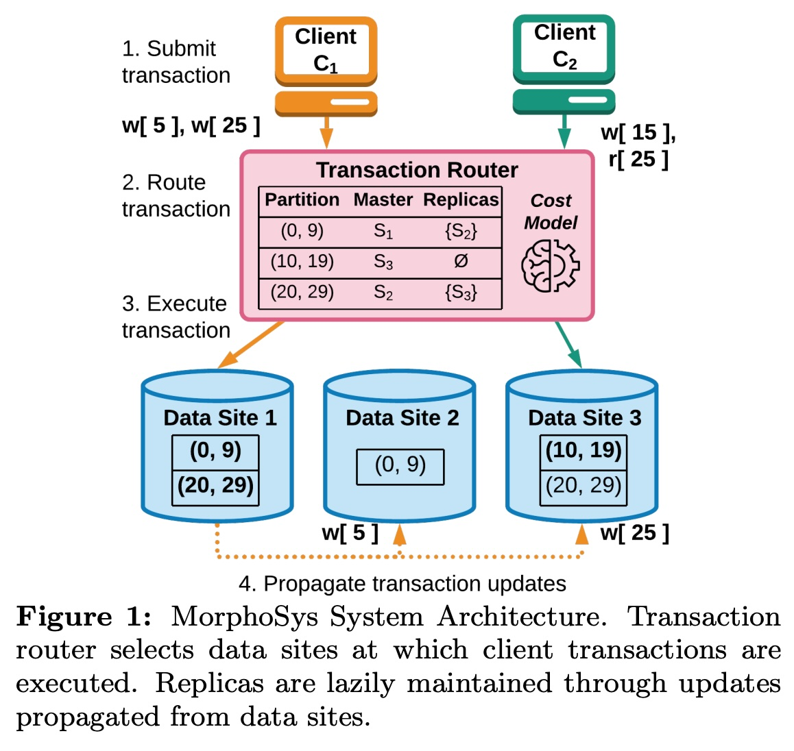
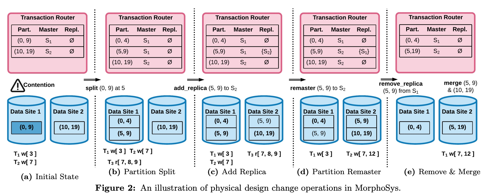
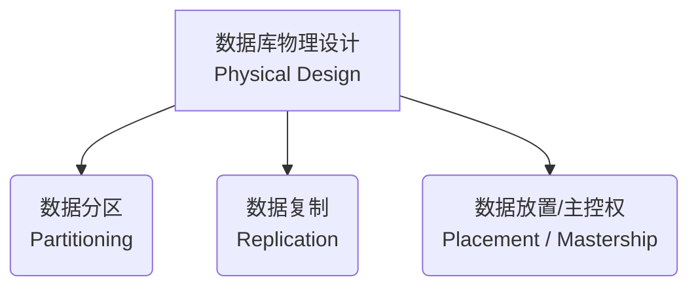
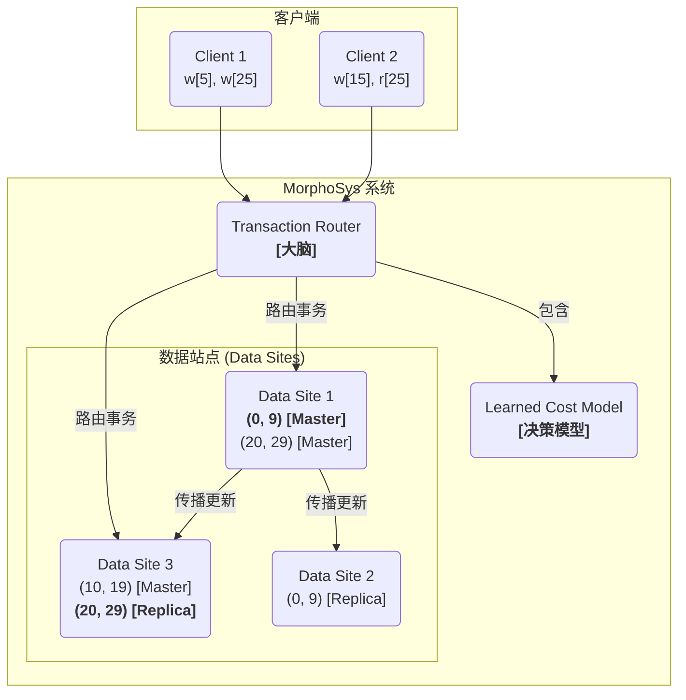
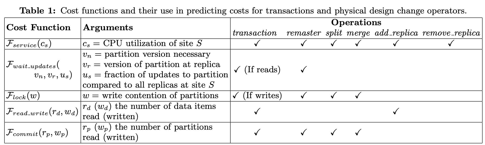
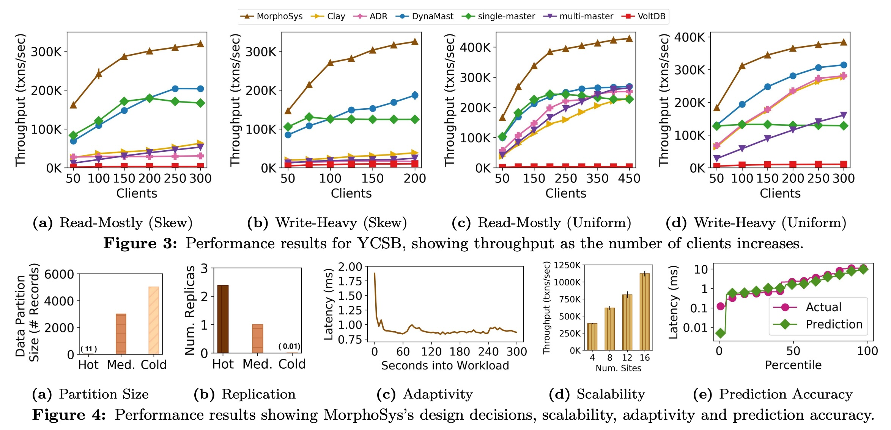
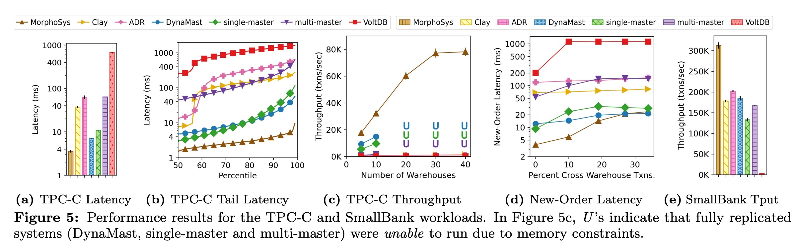

## AI论文解读 | MorphoSys: Automatic Physical Design Metamorphosis for Distributed Database Systems
        
### 作者        
digoal        
        
### 日期        
2025-11-06        
        
### 标签        
PostgreSQL , PolarDB , DuckDB , AI , 论文解读        
        
----        
        
## 背景  
      
https://dl.acm.org/doi/pdf/10.14778/3424573.3424578        
  
提示:          
```          
读懂《MorphoSys: Automatic Physical Design Metamorphosis for Distributed Database Systems》这篇论文需要提前掌握哪些基础知识, 请使用中文通熟易懂的讲解这些基础知识, 可以引用论文中的图、表或使用Markdown支持的图形(text,mermaid等)增加解释性. 
  
使用中文通熟易懂的解读《MorphoSys: Automatic Physical Design Metamorphosis for Distributed Database Systems》这篇论文, 其中的关键内容请着重讲解, 可以引用论文中的图、表或使用Markdown支持的图形(text,mermaid等)增加解释性. 
  
提取《MorphoSys: Automatic Physical Design Metamorphosis for Distributed Database Systems》这篇论文中的重要术语, 使用中文对这些术语进行通熟易懂的讲解, 可以引用论文中的图、表或使用Markdown支持的图形(text,mermaid等)增加解释性. 
```     
  
## 1 前置知识 
  
你好！要完全理解《MorphoSys》这篇论文，你需要对分布式数据库系统的一些核心概念有基本的认识。这篇论文的精髓在于“**自动**”和“**动态**”，它试图解决的是如何让分布式数据库变得像“自动驾驶”一样，能根据“路况”（即工作负载）自动调整自己的“形态”（即物理设计），从而跑得更快。

下面我将用“开图书馆分馆”的例子，来为你通俗易懂地讲解读懂这篇论文所需的基础知识。

### 📚 基础知识一：什么是分布式数据库与物理设计？

想象一下，你的数据（如图书）太多了，一个图书馆（一台计算机）放不下，于是你开了好几个分馆（多台计算机，也叫“节点”或“站点” ）。这就是一个**分布式数据库系统** 。

**“物理设计”（Physical Design）**  就是你作为总馆长，制定的“图书管理章程”。它决定了系统的运行效率 ，主要包含三个核心决策 ：

1.  **数据分区 (Partitioning)** 

      * **是什么？** 就是决定“哪些书放在哪个分馆”。比如，你规定：(A-F)开头的书放1号馆，(G-L)放2号馆，(M-Z)放3号馆。
      * **论文中的体现：** 论文图1中的 `(0, 9)`、`(10, 19)` 就是分区 。MorphoSys能动态地“拆分”或“合并”这些分区（见图2(b)的`split`和图2(e)的`merge`）。       

2.  **数据复制 (Replication)** 

      * **是什么？** 就是决定“哪些热门书需要复印几本，放在别的分馆”。比如，《新华字典》太常用了，你决定1、2、3号馆各放一本“副本”（Replica）。
      * **论文中的体现：** 图1中，分区 `(0, 9)` 在1号馆是“Master”（原版），在2号馆有个副本（Replica）。MorphoSys能动态“添加副本”（`add_replica`）或“删除副本”（`remove_replica`）。

3.  **数据放置与主控权 (Placement / Mastering)** 

      * **是什么？** 对于同一本书（比如《新华字典》），虽然很多分馆都有副本，但必须指定**唯一一个“原版”（Master Copy）** 。如果有人要勘误或在上面做笔记（即“写操作”/“更新”），必须去放“原版”的那个分馆。其他分馆的副本只能看（“读操作”），不能改，它们会“懒惰地”同步原版的更新 。
      * **论文中的体现：** MorphoSys能动态地把“原版”从1号馆转移到2号馆（`remaster`），如图2(d)所示。

你可以用下面这个关系图来理解“物理设计”的三大支柱：



-----

### 🧐 基础知识二：为什么物理设计这么难？（问题所在）

传统的数据库，这个“管理章程”（物理设计）一旦定下来，基本就不变了（即“**静态设计**” ）。但这会带来很大问题：

  * **工作负载变化 (Workload Changes)**: 刚开馆时，(A-F)的书很冷门。过了一阵子，(A-F)的书突然火了（比如成了考研必读），导致1号馆人满为患、不堪重负，而2、3号馆却很空闲。
  * **热点 (Hotspots)**: 即使在(A-F)的书里，也可能只有一本书（比如《安娜·卡列尼娜》）被疯狂访问，导致访问压力全集中在一点。
  * **设计本身的冲突 (Trade-off)**:
      * **复制的取舍**：副本多，读者（读操作）很开心，在哪个分馆都能看 ；但馆长（写操作）很痛苦，每次更新原版，都得通知所有其他分馆更新副本，很慢 。
      * **分区的取舍**：分馆多（分区细），压力分散 ；但如果一个读者要借的两本书（数据）在不同分馆，他就得跑两个地方，协调起来非常“昂贵” 。

**MorphoSys的目标**：就是要做一个“智能总馆长”，它会**动态观察**人流（工作负载），如果发现1号馆人多了，它就**自动**把(A-F)的书拆分成(A-C)和(D-F)两个区（`split`），或者把热门书在其他分馆增加副本（`add_replica`），而且这个过程**不需要你（管理员）插手** 。

-----

### ⚙️ 基础知识三：事务与一致性（系统的运行规则）

数据库不仅仅是存取数据，它还要保证操作的正确性，这就需要“事务”和“并发控制”。

  * **事务 (Transaction)**: 就像一个读者要“借书A”和“还书B”。这两个动作必须“要么都成功，要么都失败”（即**原子性**）。你不能借了A但B没还回去。MorphoSys支持ACID事务 。
  * **并发控制 (Concurrency Control)**: 如何处理“多个读者同时访问”？比如两个人同时想在《新华字典》原版上做笔记（并发写入），或者一个人在做笔记（写）时，另一个人在看（读）。
      * **多版本 (MVCC)**: 为了让读写不冲突，系统采用了“多版本并发控制”（Multi-versioning）。这好比读者A在给第5版《新华字典》做笔记时，读者B来看书，系统会拿一本第4版的《新华字典》（旧快照）给他看。这样A写的操作不会影响B读的操作 。
      * **快照隔离 (Snapshot Isolation)**: 这是一种一致性级别，保证一个事务（比如读者A的借还操作）看到的是它开始时的一个“一致性快照”（比如开馆时的图书状态），不会看到其他“正在进行中”的事务（比如读者B正在还书）造成的一半一半的混乱状态。

-----

### 🤖 基础知识四：单点事务 vs. 多点事务（MorphoSys的核心追求）

这是理解MorphoSys动机的关键。

  * **多点事务 (Multi-site Transaction)**: 读者要借的书A在1号馆，书B在2号馆。他必须先去1号馆锁住A，再去2号馆锁住B，然后通知两个馆“确认借出”，两个馆都回复OK后，才算成功。这个协调过程非常复杂、缓慢，且容易出错（比如1号馆同意了，2号馆网络断了），这就是昂贵的“**两阶段提交**”（2PC）。
  * **单点事务 (Single-site Transaction)**: MorphoSys的核心目标之一，就是**尽可能保证一个事务需要的所有数据都在一个分馆里** 。

> **MorphoSys如何做到？**
> 假设系统发现读者经常同时借书A（在1号馆）和书B（在2号馆）。MorphoSys这位“智能馆长”就会采取行动：
> 1.  它先在1号馆创建了一个B的“副本”（`add_replica`）。
> 2.  然后它把B的“原版”身份（Mastership）从2号馆切换到1号馆（`remaster`）。
>
> 这样一来，A和B的“原版” **都在1号馆了（即“共置”）** 。下次读者再来同时借A和B，只需去1号馆就能完成所有操作。这就把昂贵的“多点事务”变成了高效的“**单点事务**” 。

-----

### 🧠 基础知识五：驱动力——“有学习能力的成本模型”

MorphoSys如何知道何时`split`、何时`remaster`才是“好”的决策？

它内置了一个“大脑”，即“**有学习能力的成本模型**”（Learned Cost Model）。

这个模型会持续观察系统 ，并“学习”执行各种操作（比如一次读取、一次写入、一次`split`分区）大概需要多少时间（成本）。

当一个新事务（比如“借A和B”）来了，这个“大脑”就会在后台快速“推演”（量化预期收益）：

1.  **按现状执行（多点）** ：去1号馆和2号馆，成本是 X 毫秒。
2.  **先改设计再执行**：花 Y 毫秒把B的“原版”移到1号馆（`remaster`），然后在1号馆（单点）执行，成本是 Y + Z 毫秒。
3.  **预测未来**：这个“移动”操作（`remaster`）虽然这次花了Y毫秒，但它能让**未来100个**同样的事务都从X毫秒（多点）降低到Z毫秒（单点）。

通过这种计算 ，MorphoSys会判断出，执行`remaster`这个“物理设计变更”从长远看是划算的，于是它就自动去做了。

### 总结

要读懂这篇论文，你需要带着以下几个问题去看：

1.  **基础（第1-2节）** ：什么是物理设计（分区、复制、主控权）？为什么“静态”的设计不好？
2.  **目标（第3节）** ：MorphoSys的“工具箱”（如图2的五种操作）是如何解决这些问题的？    
3.  **机制（第4节）** ：它如何在“自动调整”的同时，保证事务（ACID）和一致性（SSSI、MVCC）不出错？
4.  **大脑（第5节）** ：它的“成本模型”是如何学习  和决策 ，以追求“单点事务”  和高性能的？

希望这个讲解对你有帮助！

我还可以为你详细解释MorphoSys的“成本模型”（第5节）是如何工作的，或者解释它的“并发控制”机制（第4节）吗？
  
## 2 解读论文 
  
好的，这是一篇非常出色的论文。我来为你详细解读一下《MorphoSys: Automatic Physical Design Metamorphosis for Distributed Database Systems》。

### 论文的“一句话总结”

想象一下，你开了一个超大型的“数据”连锁超市（分布式数据库）。MorphoSys 就像一个“**AI 智能店长**”，它会**实时观察**顾客（工作负载）在哪些货架（数据节点）上拿东西、哪些商品（数据）总是被一起购买、哪个收银台（节点）排队最长。

然后，这位“店长”会**自动**、**实时**地重新摆放货架（数据分区）、决定是否在多个地方摆放热门商品（数据复制），以及指定哪个货架上的商品是“正品”（主控权）。这一切都不需要你（数据库管理员）插手，目的是让顾客流动更顺畅，结账更快（系统性能更高）。

-----

### 1\. 核心问题：为什么需要 MorphoSys？

传统的分布式数据库，一旦建好了，“货架”怎么摆（即“**物理设计**”）基本就定死了 。这个“物理设计”包含三个关键决定 ：

1.  **数据分区 (Partitioning)**：哪些数据放 1 号机，哪些放 2 号机。
2.  **数据复制 (Replication)**：哪些数据需要“复印件”（副本），放在别的机器上。
3.  **数据放置 (Placement)**：哪个“复印件”是“原版”（Master，负责更新），哪个是“副本”（Replica，负责只读）。

**问题在于** ：

  * **负载变化**：如果某个“冷门”数据突然变成了“**热点**”，那台机器就会不堪重负，而其他机器却很空闲。
  * **静态设计的缺陷**：管理员在设计之初，根本**无法预知**未来的访问模式 。
  * **协调成本高**：如果一个事务（比如一笔订单）需要更新 1 号机的数据 A 和 2 号机的数据 B，它就需要一个昂贵的“**分布式事务**”（如 2PC 协议）来协调，这非常慢 。

现有的工具要么是离线的（不能实时适应），要么只能解决上述三个问题中的一个（比如只管复制，不管分区）。

### 2\. 解决方案：MorphoSys 的“变形”能力

MorphoSys 的核心思想是**动态（on-the-fly）和整合（integrated）** 。它会根据实时的**工作负载**，自动、持续地调整其物理设计 。

#### 关键内容一：系统架构 (图 1)
  

MorphoSys 的架构很简单，但很关键 。



  * **客户端 (Clients)**：提交事务请求 。
  * **事务路由器 (Transaction Router)**：这是系统的“**大脑**” 。它不存数据，但它维护着一张“**地图**”，知道所有数据分区、主副本（Master）、副本（Replica）的位置 。
  * **学习成本模型 (Learned Cost Model)**：路由器的“**决策核心**” 。它通过观察历史事务，“学习”执行各种操作（读、写、拆分分区等）的成本 。
  * **数据站点 (Data Sites)**：真正存储数据（主副本和副本）并执行事务的地方 。

#### 关键内容二：核心“工具箱” (图 2)

MorphoSys 的“变形”能力（Metamorphosis）体现在它有**五个可以动态执行**的物理设计变更操作 。

我们用图 2  来说明这个过程：

  

**(a) 初始状态**：

  * Site 1 有分区 `(0, 9)`（Master）。Site 2 有分区 `(10, 19)`（Master）。
  * **问题**：事务 T1（写 w[3]）和 T2（写 w[7]）都访问 `(0, 9)`，导致**锁竞争**（Contention）。

**(b) 操作 1：Split (分区拆分)**

  * **决策**：MorphoSys 检测到 `(0, 9)` 上有热点竞争。
  * **行动**：它将 `(0, 9)` 在“5”这个点**拆分**成两个新分区：`(0, 4)` 和 `(5, 9)` 。
  * **结果**：T1 访问 `(0, 4)`，T2 访问 `(5, 9)`。它们不再互相冲突，竞争消失了 。

**(c) 操作 2：Add Replica (添加副本)**

  * **决策**：Site 1 上的负载很高（T1, T2, T3 都在这）。
  * **行动**：MorphoSys 决定在 Site 2 上为分区 `(5, 9)` **创建一个副本** 。
  * **结果**：只读的事务 T3 (`r[7,8,9]`) 现在可以被路由到 Site 2 执行，实现了**读负载均衡** 。

**(d) 操作 3：Remaster (主控权变更)**

  * **决策**：T2 事务现在要写 `w[7, 12]`。w[7] 在 `(5, 9)`（Master 在 Site 1），w[12] 在 `(10, 19)`（Master 在 Site 2）。这是一个昂贵的**跨站事务** 。
  * **行动**：MorphoSys 的目标是**保证单点事务执行** 。它将分区 `(5, 9)` 的 **Master** 身份从 Site 1 **转移**到 Site 2 。
  * **结果**：现在，`(5, 9)` 和 `(10, 19)` 的 Master 都在 Site 2。T2 事务可以**完全在 Site 2 一个节点上执行**，效率极高 。

**(e) 操作 4 & 5：Remove Replica (删除副本) & Merge (分区合并)**

  * **决策**：Site 1 上的 `(5, 9)` 副本没人访问了（T3 结束了），留着它只会消耗更新资源 。同时，Site 2 上的 `(5, 9)` 和 `(10, 19)` 总是被 T2 一起访问。
  * **行动**：**删除** Site 1 上的副本 。**合并** Site 2 上的 `(5, 9)` 和 `(10, 19)` 为 `(5, 19)` 。
  * **结果**：减少了维护开销和元数据（地图）的复杂度 。

#### 关键内容三：“大脑”如何决策 (第 5 节)

这也许是 MorphoSys 最智能的部分。它如何知道何时该 "Split" 而不是 "Remaster"？答案是那个“**有学习能力的成本模型**” 。

**1. 学习成本（表 1）**    
系统会持续学习 5 种核心成本函数，这些函数通过简单的线性回归模型不断更新 ：

  * `F_service` (服务等待)：CPU 忙吗？
  * `F_wait_updates` (更新等待)：副本数据够新吗？
  * `F_lock` (锁等待)：访问的数据是不是很“热”？
  * `F_read_write` (读写时间)：读/写 N 条数据要多久？
  * `F_commit` (提交时间)：完成事务要多久？

**2. 决策过程（“净收益”计算）**
当一个新事务 T 到达时，事务路由器（大脑）会：

1.  **生成计划**：评估在每个数据站点 S 上执行 T 的可能性 。
      * **计划 A (Site 1)**：需要执行 `remaster(P, S1)` 才能执行 T。
      * **计划 B (Site 2)**：可以直接执行 T。
2.  **计算成本 C(S)**：使用上述成本函数，预测执行这个“计划”（包括设计变更操作 + 事务本身）的**当前成本** 。
3.  **预测收益 E(S)**：系统会从历史库中**采样** ，**模拟**未来的工作负载 。它会问：“如果我执行了计划 A（即 `remaster(P, S1)`），未来的 1000 个事务会比原来快多少？”。
4.  **计算净收益**：系统会计算一个“净收益”：
    `NetBenefit(S) = (λ * E(S)) - C(S)`
    （`λ` 是一个权重，用来平衡“未来收益”和“当前成本”）
5.  **选择**：路由器会选择**净收益最高**的那个计划去执行 。如果所有计划的净收益都是负的（即改变设计得不偿失），它就什么也不做 。

#### 关键内容四：安全地“变形” (第 4 节)

一个大问题是：你总不能在“重新摆货架”（`split`）的时候，把顾客（事务）撞倒吧？

MorphoSys 通过一套新颖的“**并发控制**”和“**更新传播**”机制来解决这个问题 。

  * **分区级锁**：当执行 `split(0, 9)` 时，系统**只会锁定 `(0, 9)` 这个分区** 。其他事务访问 `(10, 19)` **完全不受影响** 。
  * **多版本 (MVCC)**：读操作和写操作使用不同的数据“快照”，互不阻塞 。
  * **高效的 Remaster**：这是它的“神来之笔”。当主控权从 Site 1 转移到 Site 2 时，Site 1 只需要在“更新日志”里写一条“从现在起，Site 2 是 Master”的消息 。Site 2 收到这条消息，处理完所有在它之前的更新后，就自动“升格”为 Master 。这个过程**非常快**，因为它只是一条元数据变更，并且只等待相关分区的更新，而不是等待整个系统的状态 。

### 3\. 实验结果：它真的有效吗？

论文通过一系列实验证明了 MorphoSys 的强大。

  * **适应热点 (图 3a, 3b)**：在“**倾斜**”（有热点）的 YCSB 工作负载下，MorphoSys 的吞吐量（每秒事务数）**高达其他系统的 98 倍** 。因为它会自动将热点数据拆分成非常小的分区（图 4a），极大减少了锁竞争 。   
  * **适应复杂事务 (图 5)**：在 TPC-C（模拟订单）这种复杂负载下，MorphoSys 同样表现最佳 。它会自动学习到“仓库”和“地区”数据应被高度复制 ，从而将平均延迟降低了 50% - 99% 。    
  * **适应性 (图 4c)**：实验模拟了“**热点转移**”（比如 60 秒换一个热点）。可以看到 MorphoSys 的延迟（Latency）在热点刚切换时会短暂上升，但它能**在 20 秒内迅速适应**新的工作负载，将延迟降回最低点 。
  * **开销很低 (图 5e)**：在 SmallBank 这种简单事务负载下，MorphoSys 的性能依然是最好的 。这证明了它所有“自动驾驶”的开销（如模型学习、变更设计）都非常低 。

### 总结

MorphoSys 是一个真正意义上的“**自驾驶**”分布式数据库系统 。

它最大的贡献在于**首次将“分区、复制、主控权”这三个核心物理设计决策整合（integrate）在一起**，通过一个**有学习能力的成本模型（learned cost model）来驱动，实现了动态、自动**的物理设计“变形” 。它证明了，与其让人类管理员去猜测最佳设计，不如让系统自己去学习和适应。
  
## 3 术语 
  
好的，我从《MorphoSys》这篇论文中为你提取了最核心的术语，并用通俗易懂的中文进行讲解。

### 🚀 核心概念：系统与目标

#### 1\. MorphoSys (论文的主角系统)

  * **通俗讲解**：MorphoSys 是论文作者设计和构建的一个“**自驾驶**”分布式数据库系统 。
  * **技术讲解**：它是一个能够**自动并动态地**选择和改变其“物理设计”的分布式数据库系统 。它通过观察工作负载（即用户的访问模式），来决定如何分区、复制和放置数据，而不需要数据库管理员（DBA）手动干预 。

#### 2\. Metamorphosis (变形)

  * **通俗讲解**：这是论文标题中的核心词，意思是“**变形**”。它形象地描述了 MorphoSys 系统的核心能力——像变形金刚一样，根据“战况”（工作负载）实时改变自己的形态（物理设计）。

#### 3\. 物理设计 (Physical Design)

  * **通俗讲解**：想象你在管理一个超大型的连锁图书馆（分布式数据库）。“物理设计”就是你的**图书管理总章程**，它决定了系统的运行效率 。

  * **技术讲解**：这个“章程”主要包含三大决策 ：

    1.  **数据分区 (Data Partitioning)**：决定如何把书（数据）分类上架（分区）。
    2.  **数据复制 (Data Replication)**：决定哪些热门书（数据）需要复印几本（副本）。
    3.  **数据放置/主控权 (Data Placement / Mastering)**：决定哪本书是“原版”（主副本，Master），哪些是“复印件”（副本，Replica），以及它们分别放在哪个分馆（站点）。

    

    ```mermaid
    graph TD
        A[物理设计<br>Physical Design] --> B(1\. 数据分区<br>Data Partitioning);
        A --> C(2\. 数据复制<br>Data Replication);
        A --> D(3\. 数据放置/主控权<br>Data Placement / Mastering);
    ```

#### 4\. 单点事务执行 (Single-site transaction execution)

  * **通俗讲解**：这是 MorphoSys 追求的**核心性能目标**。它希望你办一个业务（事务）时，需要的所有“原版”材料（主副本）都 **在同一个分馆（站点）** 。
  * **技术讲解**：传统的分布式事务需要跨多个站点协调（如 2PC 协议），这非常昂贵且缓慢 。MorphoSys 通过动态调整物理设计（尤其是`remaster`操作），努力将跨站事务转变为高效的单点事务 ，从而避免昂贵的协调成本。

### 🧠 决策中枢：大脑与模型

#### 5\. 事务路由器 (Transaction Router)

  * **通俗讲解**：如图 1 所示，这是 MorphoSys 系统的“**智能总服务台**”或“**大脑**” 。    
  * **技术讲解**：客户端的所有请求（事务）都先发给它 。它维护着整个系统的数据“地图”（即当前的物理设计），并根据“成本模型”做出两大决策 ：
    1.  **路由**：决定把这个事务发给哪个数据站点（Data Site）去执行 。
    2.  **变形**：决定是否以及如何改变物理设计（比如拆分或移动数据）来提高性能 。

#### 6\. 学习成本模型 (Learned Cost Model)

  * **通俗讲解**：这是“总服务台”里的“**决策核心**”，它能**吸取经验，不断学习**。
  * **技术讲解**：MorphoSys 不依赖于固定的规则，而是使用一个基于 workload 观测的“学习成本模型”。它会持续学习执行各种操作（如读、写、加锁、拆分分区）的实际成本（即延迟）。在决策时，它会**预测**一个“变形”操作的 **预期收益（Benefit）和执行成本（Cost）** ，然后选择“净收益”（Net Benefit）最大的方案 。

#### 7\. 热点 (Hot spots)

  * **通俗讲解**：连锁图书馆里某一本（或某一类）书突然火了，导致那个分馆（站点）人满为患，不堪重负。
  * **技术讲解**：指特定数据被高频率访问，导致存储这些数据的站点负载失衡，产生资源（如 CPU 或锁）争用 。MorphoSys 的一个关键任务就是通过“变形”（如`split`或`add_replica`）来缓解热点。

### 🛠️ 变形工具：五大操作

MorphoSys 使用一套“物理设计变更操作”（Physical design change operations）来实现“变形”。论文在**图 2 (Figure 2)** 中清晰地展示了这些操作 ：    

1.  **Split (拆分)**
      * **讲解**：当一个分区（如图 2a 的 `(0, 9)`）因为访问竞争而成为“热点”时 ，系统会自动将其**一分为二**（如图 2b 的 `(0, 4)` 和 `(5, 9)`）。
      * **目的**：分散压力，化解锁竞争 。
2.  **Add Replica (添加副本)**
      * **讲解**：当一个站点的读取压力过大时 ，系统会在另一个站点为某个分区（如 `(5, 9)`） **创建** 一个新的“复印件”（副本）。
      * **目的**：实现**读负载均衡** 。
3.  **Remaster (主控权变更)**
      * **讲解**：这是实现“单点事务”的关键。当一个事务需要更新的两个“原版”在不同站点时（如图 2d 的 `w[7, 12]`），系统会将其中一个分区的“原版”（Master）身份**转移**到另一个站点 。
      * **目的**：将昂贵的“跨站事务”变为高效的“单点事务” 。
4.  **Remove Replica (移除副本)**
      * **讲解**：当一个“复印件”（副本）几乎不再被读取时，留着它只会浪费存储空间和更新资源 。
      * **目的**：节省资源，降低维护成本 。
5.  **Merge (合并)**
      * **讲解**：当两个相邻的分区（如图 2e 的 `(5, 9)` 和 `(10, 19)`）都很“冷清”，但又经常被**一起访问**时，系统会将它们合并成一个大分区 。
      * **目的**：减少需要跟踪和管理的元数据开销 。

### 🔒 运行机制：一致性与并发

#### 8\. 强会话快照隔离 (SSSI)

  * **通俗讲解**：这是一种高级的“事务隔离”规则。它保证：
    1.  **快照隔离 (SI)**：你办业务（事务）时，看到的是你开始那一刻的“数据快照”，不受他人干扰 。
    2.  **强会话 (Strong-session)**：你绝不会看到“时光倒流”。你刚办完的业务（如存钱），在下一个业务（查余额）中一定能看到结果 。
  * **技术讲解**：MorphoSys 提供的 ACID 事务隔离级别 。它通过多版本（MVCC）技术实现，允许读写操作并发执行而不冲突 。

#### 9\. 多版本 (Multi-versioning)

  * **通俗讲解**：数据的“历史版本”会保留一段时间。当你更新数据时，系统不会直接覆盖旧数据，而是创建一个“新版本” 。
  * **技术讲解**：这是实现快照隔离的基础 。读事务可以访问旧版本，写事务创建新版本，两者互不阻塞 。MorphoSys 巧妙地将版本信息和依赖关系维护在**分区级别** ，这使得它的并发控制非常高效。

#### 10\. 更新传播 (Update Propagation)

  * **通俗讲解**：“原版”（Master）更新后，如何通知所有“复印件”（Replica）。
  * **技术讲解**：MorphoSys 使用 **懒惰（lazy）** 传播方式 。主副本的更新被写入一个基于分区的“**重做日志**”（redo log）。副本站点会“**异步**”（asynchronously）地拉取这些更新，并在本地应用 。这种方式开销较低，且通过多版本技术，更新副本时也不会阻塞只读事务 。
  
## 参考        
         
https://dl.acm.org/doi/pdf/10.14778/3424573.3424578    
        
<b> 以上内容基于DeepSeek、Qwen、Gemini及诸多AI生成, 轻微人工调整, 感谢杭州深度求索人工智能、阿里云、Google等公司. </b>        
        
<b> AI 生成的内容请自行辨别正确性, 当然也多了些许踩坑的乐趣, 毕竟冒险是每个男人的天性.  </b>        
    
#### [PolarDB 学习图谱](https://www.aliyun.com/database/openpolardb/activity "8642f60e04ed0c814bf9cb9677976bd4")
  
  
#### [PostgreSQL 解决方案集合](../201706/20170601_02.md "40cff096e9ed7122c512b35d8561d9c8")
  
  
#### [德哥 / digoal's Github - 公益是一辈子的事.](https://github.com/digoal/blog/blob/master/README.md "22709685feb7cab07d30f30387f0a9ae")
  
  
#### [About 德哥](https://github.com/digoal/blog/blob/master/me/readme.md "a37735981e7704886ffd590565582dd0")
  
  

  
