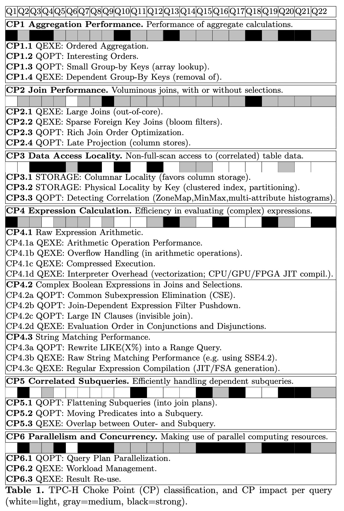
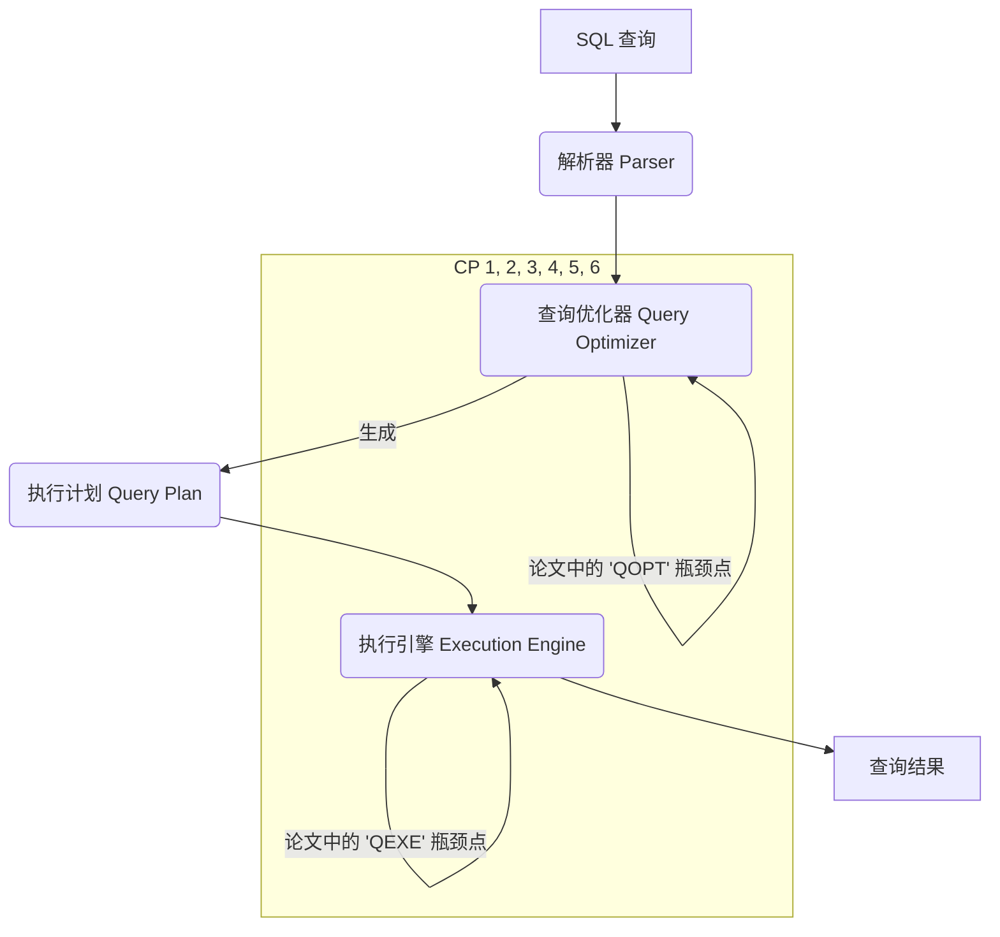
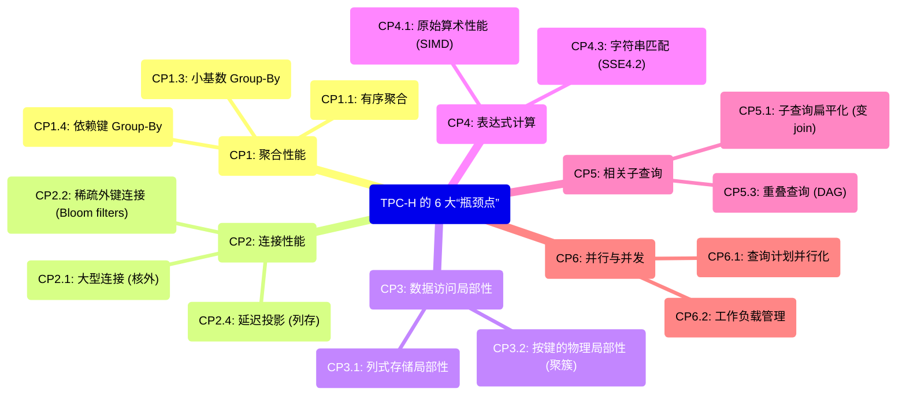

## AI论文解读 | TPC-H Analyzed: Hidden Messages and Lessons Learned from an Influential Benchmark
        
### 作者        
digoal        
        
### 日期        
2025-11-06        
        
### 标签        
PostgreSQL , PolarDB , DuckDB , AI , 论文解读        
        
----        
        
## 背景  
      
https://www.researchgate.net/profile/Peter-Boncz/publication/291257517_TPC-H_Analyzed_Hidden_Messages_and_Lessons_Learned_from_an_Influential_Benchmark/links/5852dbf708ae95fd8e1d749b/TPC-H-Analyzed-Hidden-Messages-and-Lessons-Learned-from-an-Influential-Benchmark.pdff        
  
提示:          
```          
读懂《TPC-H Analyzed: Hidden Messages and Lessons Learned from an Influential Benchmark》这篇论文需要提前掌握哪些基础知识, 请使用中文通熟易懂的讲解这些基础知识, 可以引用论文中的图、表或使用Markdown支持的图形(text,mermaid等)增加解释性. 
  
使用中文通熟易懂的解读《TPC-H Analyzed: Hidden Messages and Lessons Learned from an Influential Benchmark》这篇论文, 其中的关键内容请着重讲解, 可以引用论文中的图、表或使用Markdown支持的图形(text,mermaid等)增加解释性. 
  
提取《TPC-H Analyzed: Hidden Messages and Lessons Learned from an Influential Benchmark》这篇论文中的重要术语, 使用中文对这些术语进行通熟易懂的讲解, 可以引用论文中的图、表或使用Markdown支持的图形(text,mermaid等)增加解释性. 
```     
  
## 1 前置知识 
  
要完全读懂这篇深入分析TPC-H的论文，您需要具备一个“全栈”的知识库，这个知识库涵盖了从上层的SQL查询到下层的CPU硬件执行。

这篇论文的核心是分析**TPC-H**（一个行业标准的数据库“高考”基准测试），并总结出它给数据库系统带来的**28个“Choke Points”（性能瓶颈点）** 。读懂这些“瓶颈点”，是理解本文的关键。

以下是您需要提前掌握的基础知识，我将它们分为四大类：

-----

### 1\. 核心概念：TPC-H 和“Choke Points”

您首先要明白论文在“谈论什么”。

  * **TPC-H 是什么？**

      * 它是一个 **决策支持（Decision Support）** 的基准测试 。想象一下，它不是用来测试数据库处理“每秒10000笔订单”这种（OLTP）场景的，而是用来测试处理“请分析过去5年，所有东北地区、购买了A类和B类商品的VIP客户的平均消费额”这种复杂分析（OLAP）查询的。
      * 它包含一个标准的数据集（模拟一个公司的销售数据）和22个复杂的分析查询（Q1到Q22）。

  * **“Choke Points”（瓶颈点）是什么？**

      * 这是作者提出的核心概念，指的是 **“那些一旦被解决，就能显著提升产品性能的潜在技术挑战”** 。
      * 简单说，TPC-H的22个查询就像22道考题，而这28个“Choke Points”就是这些考题背后真正想考察的“知识点”。

> **如何利用论文中的表格：**  
>  
> 论文中的 **表1 (Table 1)**  是理解全文的“藏宝图”。它列出了所有28个瓶颈点，并将它们归为6大类 。在阅读论文时，您可以随时参照这个表，它清晰地展示了每个“瓶颈点”的分类（比如CP1是聚合，CP2是连接） 和它的性质（是优化器的问题QOPT，还是执行器的问题QEXE等）。  

  

-----

### 2\. 必备知识一：数据库基础 (SQL与关系模型)

这是最基础的门槛，您需要对关系型数据库有“用户级”的理解。

  * **关系模型：** 知道什么是**表 (Table)**、**行 (Row)**、**列 (Column)**。
  * **键 (Keys)：** 理解**主键 (Primary Key)**  和**外键 (Foreign Key)**  的概念，以及它们如何构建表与表之间的关系（如1:N或N:1）。
  * **SQL语言：** 您必须熟悉SQL。当论文提到某个查询（如Q10）时，您需要能脑补出SQL的样子：
      * `GROUP BY`：数据聚合 。论文的CP1（聚合性能） 整个章节都在讨论它。
      * `JOIN`：多表连接 。这是CP2（连接性能） 的核心。
      * `WHERE` / `HAVING`：数据过滤。
      * **子查询 (Subqueries)：** 尤其是**相关子查询 (Correlated Subqueries)** ，这是CP5  的主题。
      * `LIKE`：字符串匹配 。
      * `IN` / `EXISTS` / `NOT EXISTS`：。

-----

### 3\. 必备知识二：数据库系统内核 (重点中的重点)

这是理解本文**最核心**的部分。您需要知道一个SQL查询在数据库内部是如何被“翻译”和“执行”的。

我用一个流程图来展示这个过程，以及论文中的“瓶颈点”主要发生在哪些阶段：



您需要掌握以下几个关键领域的知识：

#### (1) 查询优化器 (Query Optimizer - QOPT)

优化器是数据库的“大脑” 。它的工作是“猜”出一个最高效的执行SQL的方式（即“执行计划”）。论文中带`QOPT`  标记的瓶颈点都与它相关。

  * **连接算法 (Join Algorithms)：** 优化器如何选择连接两个表的方法？
      * **Hash Join（哈希连接）：**  论文中多次提到，这是分析型查询的主流算法。
      * **Index-based Join（索引连接）：**  (如 Nested-Loop Join)。
  * **连接顺序 (Join Order)：**  当3个以上的表JOIN时，先连A和B，再连C？还是先连B和C，再连A？不同的顺序性能差异巨大 。
  * **聚合算法 (Aggregation Algorithms)：** 
      * **Hash Aggregation（哈希聚合）：**  适用于大多数`GROUP BY`。
      * **Ordered Aggregation（有序聚合）：**  当数据本身有序时，这是一种更优的选择。
  * **子查询处理 (Subquery Handling)：** 
      * **去相关 (Decorrelation) / 扁平化 (Flattening)：**  如何把一个嵌套的子查询“拍平”，变成一个更高效的JOIN。

#### (2) 存储与数据访问 (Storage & Data Access)

数据是如何存在磁盘和内存中的？这决定了访问效率。

  * **行存储 vs. 列存储 (Row Store vs. Column Store)：** 
      * **行存：** 传统方式，一行的数据（张三, 男, 20岁）存在一起。
      * **列存：**  分析型数据库的最爱。（张三, 李四, 王五...）、（男, 男, 女...）、（20, 25, 30...）分别存在一起。当查询“所有人的平均年龄”时，列存只需要读取“年龄”这一列，速度极快 。
  * **索引 (Indexes)：**
      * **聚簇索引 (Clustered Index)：**  数据本身就是按某个键排序存储的。
      * **B-Tree 索引：**  常见的索引结构。
  * **数据分区 (Partitioning)：**  把一个大表按规则（如按月份）切成很多小文件。
  * **数据压缩 (Compressed Execution)：**  在不解压数据的情况下直接计算，节省CPU 。

#### (3) 执行引擎 (Execution Engine - QEXE)

优化器制定了“计划”，执行器负责“干活”。论文中带`QEXE`  标记的瓶颈点与它相关。

  * **执行模型：**
      * **火山模型 (Tuple-at-a-time)：**  像流水线一样，每次处理一条数据（一个Tuple）。这种方式在复杂计算中很慢，因为函数调用开销大 。
      * **向量化执行 (Vectorized Execution)：**  每次处理一批数据（一个Vector，如1000条）。这是现代分析型数据库（如VectorWise）提速的关键 。
      * **JIT 编译 (JIT Compilation)：**  将查询计划动态编译成高效的机器码来执行。

-----

### 4\. 必备知识三：计算机体系结构 (硬件)

数据库是跑在硬件上的。论文中的很多“瓶颈点”最终都归结为硬件效率。

  * **内存层次结构 (Memory Hierarchy)：**
      * 你知道**CPU缓存 (CPU Cache)**  和 **RAM (内存)**  之间的速度差异巨大。CP3（数据访问局部性） 整个章节都在讨论如何让数据“命中”缓存。
      * **"Out-of-core" / "Spilling"：**  当数据太大，内存（RAM）放不下时，必须“溢出” (Spill) 到慢速的磁盘上 ，这会带来极大的性能惩罚。
  * **SIMD (单指令多数据流)：**
      * 这是一种CPU技术，可以用一条指令同时对多个数据进行运算（比如同时计算4个加法）。
      * 论文在CP4（表达式计算） 中重点提到了它，例如使用 **SSE4.2**  或 **AVX**  来加速算术  或字符串匹配 。
  * **并行计算 (Parallelism)：** 
      * **多核 (Multi-core)：**  如何在一个服务器的多个CPU核心上并行执行一个查询。
      * **MPP (大规模并行处理)：**  如何在多台服务器（集群）上并行执行查询，这会涉及网络通信 。

-----

### 总结

要读懂这篇文章，您需要扮演一个“数据库内核工程师”的角色。您不仅要懂SQL，更要懂数据库内部为了执行这个SQL，在**优化器、执行器、存储**以及**利用CPU和内存**方面所做的全部努力和取舍。

这篇文章的价值在于，它通过TPC-H这个“考纲”，系统性地为您划出了数据库性能优化的所有“必考题”和“拉分题”。

希望这份知识地图对您有帮助！您想让我详细解释一下某个特定的“瓶颈点”类别吗（例如CP2：连接性能）？
  
## 2 解读论文 
  
这是一篇数据库领域的经典论文，它像一位资深的“出题人”和“阅卷官”，**深入剖析了行业标准数据库“高考”——TPC-H 基准测试——背后隐藏的真正意图** 。

作者认为，TPC-H 之所以如此有影响力，不是因为它模拟的“销售系统”有多真实，而是因为它在22个查询中巧妙地埋藏了**28个“性能瓶颈点”（Choke Points）** 。

> **什么是“性能瓶颈点” (Choke Points)？**
>
> 论文将其定义为：“**那些一旦被解决，就能显著提升（数据库）产品性能的潜在技术挑战**” 。
>
> 简单说，它们就是数据库厂商必须攻克的“必考题”和“拉分题”。

这篇论文的**核心内容**就是对这28个瓶颈点的识别和分类。作者将其归纳为以下**6大类** ，这6大类就是您需要着重理解的关键：



-----

### 关键内容着重讲解

以下是这6大类“瓶颈点”的通俗解读和重点分析：

#### 1\. CP1: 聚合性能 (Aggregation Performance)

这是对 `GROUP BY` 和 `SUM()`、`COUNT()` 等聚合函数效率的考验 。

  * **瓶颈举例 (CP1.3):** Q1 查询 。这个查询需要按 `l_returnflag` 和 `l_linestatus` 分组，但这两个字段总共**只有4种组合** 。

  * **“陷阱”与“正解”:**

      * **陷阱:** 愚蠢的数据库会使用一个通用的、庞大的哈希表 (Hash Table) 来做这个 `GROUP BY` 。
      * **正解:** 聪明的数据库会识别出这只是个“小基数”分组，直接在内存中**使用一个极小的数组 (Array)** 来累加这4个组合的值 。这比操作哈希表快得多。

  * **瓶颈举例 (CP1.4):** Q10 查询 。它要求按客户ID (`c_custkey`)、客户名、地址、电话等一大堆字段分组 。

  * **“陷阱”与“正解”:**

      * **陷阱:** 真的把所有这些字段都作为 `GROUP BY` 的 Key，哈希表会变得巨大且缓慢 。
      * **正解:** 聪明的优化器能利用“主键”信息，**识别出“客户名、地址、电话”都唯一依赖于“客户ID”** 。因此，它只需要按 `c_custkey` 分组，最后再把其他字段“附加上去”即可，极大降低了 CPU 和内存消耗 。

#### 2\. CP2: 连接性能 (Join Performance)

Join（连接）是数据库中最昂贵的操作之一 。

  * **瓶颈举例 (CP2.1):** Q9 查询 。它连接了多个大表，而且没什么过滤条件，导致中间结果集极其庞大 。

  * **“陷阱”与“正解”:**

      * **陷阱:** 数据库试图在内存 (RAM) 中处理这个 Join，但数据太大放不下，导致内存和磁盘之间疯狂交换数据（称为 "Spilling" 或 "Out-of-core"），性能崩溃 。
      * **正解:** 数据库必须具备高效的 **“核外连接” (Out-of-core Join) 算法** 。例如，它会先把两个大表都按 Join 的键值哈希到不同的磁盘文件中（分区），然后再逐个加载这些小文件分区到内存中完成连接 。

  * **瓶颈举例 (CP2.2):** **稀疏外键连接** 。

  * **“陷阱”与“正解”:**

      * **陷阱:** 想象一下，用“全量用户表”（10亿行）去连接“双十一VIP消费表”（100万行）。绝大多数用户（99.9%）在“VIP消费表”中是找不到匹配的 。如果数据库还是老实地拿着10亿用户逐个去哈希表中查找，那CPU就全浪费在“查无此人”上了 。
      * **正解:** 聪明的数据库会使用 **Bloom Filter (布隆过滤器)** 。它会先为“VIP消费表”创建一个极小的“位图索引”。在扫描“全量用户表”时，先用这个过滤器快速判断一下——“这个用户**绝对不**在VIP表里吗？”——如果答案是“是”，就直接跳过该用户，连 Join 查找的动作都省了 。

#### 3\. CP3: 数据访问局部性 (Data Access Locality)

这个词很学术，通俗讲就是：**如何让数据“扎堆”存放，避免 I/O 浪费**。

  * **瓶颈举例 (CP3.1):** **列式存储局部性** 。

  * **“陷阱”与“正解”:**

      * **陷阱:** TPC-H 的所有查询都只关心少数几列（如价格、数量），从不使用 `SELECT *` 。但传统“行存储”数据库会把整行（包括你根本用不上的 `comment` 评论、`address` 地址等大字段）都读入内存，造成巨大 I/O 浪费 。
      * **正解:** **列式存储 (Column Stores)** 在这里有碾压性优势 。它只读取查询真正需要的列（如 `l_extendedprice` 列），完全跳过无关的列，I/O 效率提升百倍 。

  * **瓶颈举例 (CP3.2):** **数据相关性** 。

  * **“陷阱”与“正解”:**

      * **陷阱:** TPC-H 的数据生成器**故意**让 `ORDERS` (订单表) 和 `LINEITEM` (订单项表) 中的日期高度相关（如 `l_shipdate` (发货日) 总是接近 `o_orderdate` (下单日)） 。当查询（如 Q3）要求 `o_orderdate < '1995-03-15'` 且 `l_shipdate > '1995-03-15'` 时 ，愚蠢的数据库不知道这两者的关系，还是会扫描全表。
      * **正解:** 聪明的数据库（或DBA）会利用**聚簇索引 (Clustered Index)**  或**表分区 (Table Partitioning)**  来利用这个“局部性”。例如，如果两个表都按日期分区（如按月分区），当查询只涉及3月份的数据时，数据库**只需要去连接两个表的“3月份”分区**，而忽略掉其他所有月份的数据，实现“分区裁剪” (Partition Pruning)，极大减少了处理范围 。

#### 4\. CP4: 表达式计算 (Expression Calculation)

这是对数据库“数学能力”和“字符串处理能力”的考验 。

  * **瓶颈举例 (CP4.1d, CP4.1a):** Q1 查询 。
  * **“陷阱”与“正解”:**
      * **陷阱:** Q1 几乎不做什么复杂操作，就是扫描 `LINEITEM` 表，然后疯狂计算 `price * (1 - discount) * (1 + tax)` 这样的表达式 。如果数据库使用老式的“一次一行” (Tuple-at-a-time) 的“解释器”模型来执行，CPU 开销会高得惊人 。
      * **正解:** 现代数据库使用 **JIT 编译** (Just-In-Time Compilation) 或 **向量化执行** (Vectorized Execution) 。
          * **JIT:** 像 HyPer 数据库，会把这个计算公式动态编译成高效的机器码，几乎和手写的C语言代码一样快 。
          * **向量化:** 像 VectorWise 数据库，它不是“一次一行”，而是“一次一批”（如1000行）数据来进行计算 。这能更好地利用 CPU 缓存和 **SIMD** 指令（单指令多数据流，如用一条CPU指令同时完成8个乘法），性能提升“几个数量级” 。

#### 5\. CP5: 相关子查询 (Correlated Subqueries)

这是对优化器“智商”的重大考验 。相关子查询（即子查询依赖于外层查询的字段）通常是性能杀手。

  * **瓶颈举例 (CP5.1):** `EXISTS` 或 `IN` 子查询 。

  * **“陷阱”与“正解”:**

      * **陷阱:** 采用“嵌套循环”的方式，即外层表每扫描一行，就去重新执行一次子查询。如果外层表有10亿行，子查询就要执行10亿次，这是灾难。
      * **正解:** 聪明的优化器必须学会 **“子查询扁平化” (Flattening Subqueries)** 或称 **“去相关” (Decorrelation)** 。它会把这个子查询在逻辑上改写成一个 `JOIN` (或 `semi-join`, `anti-join`) 。这样，整个查询就可以被优化器统一处理，例如选择最高效的 Hash Join，性能天差地别。

  * **瓶颈举例 (CP5.3):** Q17 查询 。

  * **“陷阱”与“正解”:**

      * **陷阱:** 在 Q17 这类查询中，外层查询和子查询**共享了几乎相同的表和过滤条件** 。愚蠢的数据库会把这些相同的 Join 和 Scan 执行两遍。
      * **正解:** 顶级的优化器会识别出这种 **“重叠” (Overlap)** 。它会生成一个 **DAG (有向无环图) 形状的执行计划** 。它只计算一次这个“公共部分”，然后把中间结果“分发”给外层查询和子查询两边使用，避免了重复劳动 。

#### 6\. CP6: 并行与并发 (Parallelism and Concurrency)

这是考验数据库如何“榨干”所有硬件（多核CPU、多台机器集群），以及如何“调度”多个并发用户 。

  * **瓶颈举例 (CP6.1):** **查询计划并行化** 。

  * **“陷阱”与“正解”:**

      * **陷阱:** 当一个查询在有 64 核 CPU 的服务器上运行时 ，数据库不知道如何有效拆分任务，或者在拆分后（例如并行 Join），数据交换 (Shuffle) 的成本反而超过了并行的收益。
      * **正解:** 这是数据库领域至今仍在激烈讨论的难题 。一个好的并行执行器需要能高效地在多核之间划分数据和任务，尤其是在执行 Hash Join 时 。在 MPP（多机）架构中，则严重依赖于**表分区 (Table Partitioning)**，确保 Join 的数据尽可能在“本地节点”完成，避免昂贵的网络通信 。

  * **瓶颈举例 (CP6.2):** **工作负载管理** (Workload Management) 。

  * **“陷阱”与“正解”:**

      * **陷阱:** TPC-H 的“吞吐量测试” (Throughput test) 会模拟多个用户同时发起查询 。一个糟糕的调度器可能会让一个“重查询”（如 Q9）“霸占”所有系统资源（CPU、RAM），导致其他 19 个“轻查询”全部“饿死”，造成系统总吞吐量极低 。
      * **正解:** 一个自适应的工作负载管理器，必须在“高并发”和“单查询性能”之间找到平衡 。当系统负载很高时，它可能会**故意降低**每个查询的并行度（例如，每个查询只给1个核），以“串行执行多个查询”的方式，来换取**最高的系统总吞吐量** 。

### 结论

这篇论文的伟大之处在于，它系统性地总结了分析型数据库在过去20年里（甚至在今天）所面临的最核心的技术挑战 。

它告诉我们，TPC-H 这个“考纲”设计得极其出色，它不仅仅是模拟业务，更是在**倒逼数据库技术在聚合、连接、存储、计算、优化和并行这6个核心领域不断进化** 。

希望这个解读对您有帮助。您想让我详细展开讲解这6大瓶颈点中的某一个吗？
  
## 3 术语 
  
根据这篇论文《TPC-H Analyzed: Hidden Messages and Lessons Learned from an Influential Benchmark》，以下是其中一些重要术语的中文讲解。

这篇论文的核心思想是，TPC-H 这个（在当时）已经快20年的基准测试 ，之所以仍然有价值，是因为它内部隐藏了大量值得研究的“技术瓶颈点”（Choke Points） 。作者们识别了28个这样的瓶颈点，并分为6大类 。

-----

### 核心概念

#### 1\. TPC-H (TPC-H 基准测试)

  * **讲解：** TPC-H 是一套公开的、用于衡量数据库系统性能的标准测试。它模拟的是“决策支持”（Decision Support）场景，即公司分析师对大量数据运行复杂查询（Ad-hoc Query）以获取商业洞察 。
  * **通俗理解：** 就像是数据库系统的“高考”或“铁人三项”。它不是测数据库存取一条记录有多快，而是测它在处理“统计过去一年里，A类客户在B地区的平均订单额”这类复杂分析报表时的能力。

#### 2\. Choke Points (技术瓶颈点)

  * **讲解：** 这是本文提出的核心概念，指基准测试中（TPC-H）隐藏的特定技术挑战 。一个数据库系统如果能很好地解决这些“瓶颈点”，其性能将得到显著提升 。
  * **通俗理解：** 就像游戏里的“关卡Boss”。TPC-H 看似只是22个查询，但每个查询都可能暗藏一个或多个“Boss”（即瓶颈点）。比如，某个查询专门考验你的“连接”（Join）性能，另一个专门考验“聚合”（Aggregation）性能。你把这些Boss都打（优化）了，你的数据库就“通关”（性能起飞）了。
  * **论文分类：** 作者将28个瓶颈点归纳为6大类 ：
    1.  聚合性能 (Aggregation Performance) 
    2.  连接性能 (Join Performance) 
    3.  数据访问局部性 (Data Access Locality) 
    4.  表达式计算 (Expression Calculation) 
    5.  相关子查询 (Correlated Subqueries) 
    6.  并行与并发 (Parallelism and Concurrency) 

-----

### 关键技术挑战 (Choke Points 详解)

#### 1\. 聚合性能 (Aggregation Performance)

  * **涉及术语：** 哈希聚合 (Hash Aggregation) vs. 有序聚合 (Ordered Aggregation)
  * **讲解：** TPC-H 的所有查询都涉及聚合（如 `GROUP BY`） 。
      * **哈希聚合：** 是最常用的方法，它使用一个哈希表（像一个分类桶）来存放分组键 。如果分组键特别多，导致哈希表大到放不进CPU缓存甚至内存时，性能会急剧下降 。
      * **有序聚合：** 如果系统发现数据（分组键）已经是排好序的，它就可以跳过哈希表，直接进行聚合计算 。
  * **瓶颈点：** 数据库优化器需要足够“聪明”，能判断何时使用哈希聚合，何时利用数据“有趣的顺序”（Interesting Orders）  来执行更高效的有序聚合。

#### 2\. 连接性能 (Join Performance)

  * **涉及术语：** 连接顺序优化 (Join Order Optimization), 布隆过滤器 (Bloom Filters), 延迟投影 (Late Projection)
  * **讲解：** `JOIN` (连接) 通常是数据库中最昂贵的操作之一 。
      * **连接顺序优化：** 当多张表（如TPC-H中多达8张表）连接时，不同的连接顺序（比如先A连B，再连C；还是先B连C，再连A）导致的性能差异可能是几个数量级 。优化器必须找到一个高效的连接顺序 。
      * **布隆过滤器 (Bloom Filters)：** TPC-H 中很多是“稀疏连接”，即一张大表（N:1 的 N 端）去连接时，大部分数据在另一张表上（1 端）找不到匹配项 。
      * **通俗理解：** 布隆过滤器就像一个“门卫” 。大表的数据在尝试进行昂贵的连接查找前，先问“门卫”：“这个键值（Key）在另一张表里吗？”。“门卫”能以极低的CPU成本，快速过滤掉绝大多数“肯定不在”的键值，极大提升效率 。
      * **延迟投影 (Late Projection)：** 主要用于列存储数据库 。如果一个查询（如 Q5, Q10 ）很晚才用到某些列，那么系统可以先只读取查询必需的列（如 join 键），直到最后数据量已经变得很少（比如聚合后）时，再回过头去拿那些“晚用”的列 。

#### 3\. 数据访问局部性 (Data Access Locality)

  * **涉及术语：** 列存储 (Column Stores), 聚簇索引 (Clustered Index), 表分区 (Table Partitioning)
  * **讲解：** 这个挑战关心的是如何高效读取数据，避免全表扫描 。
      * **列存储 (Column Stores)：** 论文提到 TPC-H 允许使用列存储 。传统数据库是按“行”存储，而列存储是按“列”存储 。
      * **通俗理解（图示）：**
        ```text
        传统 "行存储" (Row Store):
        [记录1: 张三, 20岁, 销售部]
        [记录2: 李四, 30岁, 技术部]
        [记录3: 王五, 25岁, 销售部]

        "列存储" (Column Store):
        [姓名列: 张三, 李四, 王五]
        [年龄列: 20, 30, 25]
        [部门列: 销售部, 技术部, 销售部]
        ```
      * **优势：** TPC-H 这类分析查询，通常只关心少数几列（比如“计算平均年龄”） 。列存储只需读取“年龄列”，而行存储必须读取所有记录（包括姓名、部门），I/O 效率天差地别 。
      * **聚簇索引/分区：** TPC-H 的数据（如订单和日期）具有相关性 。通过在日期列上创建聚簇索引  或按时间进行表分区 ，查询（如 Q3, Q4, Q5 等）就可以只扫描需要的数据范围（如“近三个月”），而不是扫描全表，极大提升效率 。

#### 4\. 表达式计算 (Expression Calculation)

  * **涉及术语：** SIMD, JIT (即时编译)
  * **讲解：** 指 SQL 查询中（如 `WHERE` 或 `SELECT` 子句）算术运算和字符串比较的效率 。
      * **SIMD (单指令多数据流):** TPC-H Q1  需要在海量数据上（99%的 LINEITEM 表）做大量算术题 。
      * **通俗理解：** SIMD 是 CPU 的一种“批量处理”能力 。CPU 不再是“一次算一个加法”，而是利用特殊指令（如 AVX）“一次同时算8个加法” 。
      * **JIT (即时编译):** 传统的数据库是“解释执行”的（tuple-at-a-time），逐条处理数据，非常慢 。JIT (Just-In-Time) 技术则是把这个查询动态编译成高效的机器码，然后再去执行，速度会快几个数量级 。

#### 5\. 相关子查询 (Correlated Subqueries)

  * **涉及术语：** 子查询扁平化 (Flattening Subqueries)
  * **讲解：** TPC-H 中很多查询（如 Q2, Q17, Q21）都包含相关子查询（即嵌套查询，且内部查询依赖外部查询的值） 。
      * **瓶颈点：** 如果数据库“傻傻地”对外部的每一行都执行一次内部子查询（tuple-at-a-time），性能会非常灾难 。
      * **解决方案 (扁平化)：** 优化器应该把这种嵌套查询“拍平”（Flatten），转换成一个等价的 `JOIN` (连接) 。例如，论文提到 Q21 中的 `EXISTS` 和 `NOT EXISTS` 子句，就应该被分别转换成高效的“等值连接”（equi-join）和“反连接”（anti-join）来执行 。

#### 6\. 并行与并发 (Parallelism and Concurrency)

  * **涉及术语：** Power Test (功率测试) vs. Throughput Test (吞吐量测试)
  * **讲解：** TPC-H 包含两种测试模式 。
      * **Power Test (功率测试):** 测量系统“跑完一个查询集（22个查询+2个更新）”的速度 。它使用“几何平均数”（geometric mean）计分，这意味着跑得快的查询和跑得慢的查询同等重要，考验的是系统对所有类型查询的综合优化能力 。
      * **Throughput Test (吞吐量测试):** 测量系统在规定时间内，能“同时处理多少个查询流” 。这更考验系统的**负载管理 (Workload Management)**  和资源分配能力，因为系统不知道下一个查询什么时候来、有多复杂 。

您是否想深入了解某个特定的瓶颈点，例如“列存储”或“JIT编译”？
  
## 参考        
         
https://www.researchgate.net/profile/Peter-Boncz/publication/291257517_TPC-H_Analyzed_Hidden_Messages_and_Lessons_Learned_from_an_Influential_Benchmark/links/5852dbf708ae95fd8e1d749b/TPC-H-Analyzed-Hidden-Messages-and-Lessons-Learned-from-an-Influential-Benchmark.pdff    
        
<b> 以上内容基于DeepSeek、Qwen、Gemini及诸多AI生成, 轻微人工调整, 感谢杭州深度求索人工智能、阿里云、Google等公司. </b>        
        
<b> AI 生成的内容请自行辨别正确性, 当然也多了些许踩坑的乐趣, 毕竟冒险是每个男人的天性.  </b>        
    
#### [PolarDB 学习图谱](https://www.aliyun.com/database/openpolardb/activity "8642f60e04ed0c814bf9cb9677976bd4")
  
  
#### [PostgreSQL 解决方案集合](../201706/20170601_02.md "40cff096e9ed7122c512b35d8561d9c8")
  
  
#### [德哥 / digoal's Github - 公益是一辈子的事.](https://github.com/digoal/blog/blob/master/README.md "22709685feb7cab07d30f30387f0a9ae")
  
  
#### [About 德哥](https://github.com/digoal/blog/blob/master/me/readme.md "a37735981e7704886ffd590565582dd0")
  
  

  
