## AI论文解读 | Quantifying TPC-H Choke Points and Their Optimizations
        
### 作者        
digoal        
        
### 日期        
2025-11-06        
        
### 标签        
PostgreSQL , PolarDB , DuckDB , AI , 论文解读        
        
----        
        
## 背景  
      
https://dl.acm.org/doi/pdf/10.14778/3389133.3389138        
  
提示:          
```          
读懂《Quantifying TPC-H Choke Points and Their Optimizations》这篇论文需要提前掌握哪些基础知识, 请使用中文通熟易懂的讲解这些基础知识, 可以引用论文中的图、表或使用Markdown支持的图形(text,mermaid等)增加解释性. 
  
使用中文通熟易懂的解读《Quantifying TPC-H Choke Points and Their Optimizations》这篇论文, 其中的关键内容请着重讲解, 可以引用论文中的图、表或使用Markdown支持的图形(text,mermaid等)增加解释性. 
  
提取《Quantifying TPC-H Choke Points and Their Optimizations》这篇论文中的重要术语, 使用中文对这些术语进行通熟易懂的讲解, 可以引用论文中的图、表或使用Markdown支持的图形(text,mermaid等)增加解释性. 
```     
  
## 1 前置知识 
  
你好！很高兴为你解读这篇论文。这是一篇非常经典和实用的数据库性能分析论文。

为了透彻理解《量化TPC-H的瓶颈点及其优化》（Quantifying TPC-H Choke Points and Their Optimizations），你最好先掌握一些数据库领域的基础知识。

这篇论文的核心工作是：使用一个名为 **TPC-H** 的“标准考试卷” ，去测试数据库系统（DBMS）在应对复杂查询时的能力 。它找到了几个特别难的“考点”（即 **"Choke Points" 瓶颈点** ），然后逐个分析，如果数据库“复习”（即 **优化**）了这些知识点，它的“考试成绩”（即 **性能**）能提高多少分 。

以下是你需要储备的基础知识：

### 1\. 什么是 OLAP (在线分析处理)？

你需要知道数据库有两种主要的“工作模式”：

  * **OLTP (在线事务处理):** 就像你买火车票或银行转账。特点是：操作简单（增、删、改、查一条记录）、速度极快、高并发。
  * **OLAP (在线分析处理):** 这篇论文的重点 。就像分析师要看“过去5年，所有分店的A类商品在每个季度的总销售额”。特点是：查询极其复杂、涉及海量数据（可能要扫描几亿行）、但查询的并发数不高。

TPC-H 就是一个专门给 OLAP 系统“出难题”的考卷。

### 2\. 什么是数据库基准测试 (Benchmark)？

  * **基准测试 (Benchmark):** 就像“高考”或“托福”。它提供一套标准化的数据集（考纲）和查询（考题），如 TPC-H 。
  * **目的:** 所有人用同一套考卷，就能公平地比较不同数据库（比如 Hyrise, MonetDB, DuckDB ）的性能，看谁跑得更快、更好。

### 3\. SQL 查询的“一生”：从 SQL 到结果

这是理解这篇论文**最核心**的知识。当你敲下一段 SQL 时，数据库内部会经历一个复杂的流程，可以简化为以下几步。这篇论文的“瓶颈点”和“优化”就发生在这个流程中。

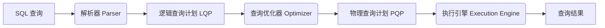

  * **SQL 查询:** 你写的 `SELECT ... FROM ... WHERE ...`。
  * **解析器 (Parser):** 把 SQL 语句“翻译”成数据库能理解的内部结构。
  * **逻辑查询计划 (LQP):**  描述了“**要做什么**”。比如，它会说：“你需要连接A表和B表，然后过滤数据，最后分组”。它不关心“**具体怎么做**”。
  * **查询优化器 (Optimizer):** 这是数据库的“大脑”。同一个 LQP 可以有成百上千种执行方法。比如：
      * 是先连接A和B，再过滤？还是先过滤A和B，再连接？
      * 连接A和B时，是用 `Hash Join` 还是 `Sort-Merge Join`？
      * 优化器的**唯一目标**就是从所有可能的执行计划中，找到一个成本最低（通常是跑得最快）的计划。
  * **物理查询计划 (PQP):**  这是优化器“拍板”后的最终方案，描述了“**具体怎么做**”。
  * **执行引擎 (Execution Engine):** 这是“干活的手脚”。它会调用一系列 **“算子”（Operators）** 来执行 PQP。

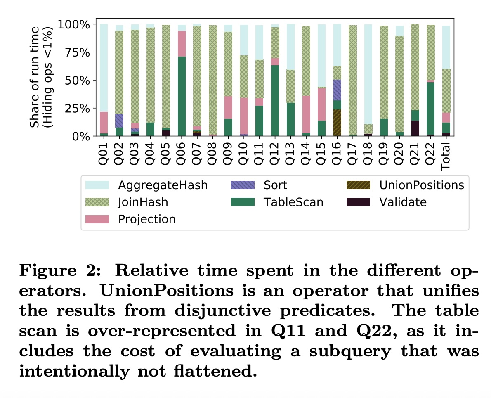  
  
> **关键概念：算子 (Operators)**    
> 算子是执行计划的基本单元。论文的 **Figure 2**  就展示了 Hyrise 系统中各个算子的耗时。你需要知道几个基本算子：  
>  
>   * **TableScan (表扫描):** 负责读取表中的数据。  
>     * **Join (连接):** 负责把两个表按条件拼接在一起（如 `JoinHash` ）。  
>     * **Aggregate (聚合):** 负责 `GROUP BY`、`SUM()`、`AVG()` 等操作（如 `AggregateHash` ）。  
>   * **Projection (投影):** 负责挑选出你 `SELECT` 的那几列。  

### 4\. 什么是“瓶颈点 (Choke Point)”？

“瓶颈点”就是那些能让“优化器”抓破头皮的难题 。如果优化器不够聪明，选错了 PQP，执行效率可能会相差成千上万倍。

这篇论文的核心就是量化这些“瓶颈点”的优化效果。你需要提前了解几个最著名的优化技术：

  * **1. 谓词下推 (Predicate Pushdown)** 

      * **谓词 (Predicate):** 就是你的 `WHERE` 过滤条件。
      * **下推 (Pushdown):** 指的是“**尽可能早地执行过滤**”。
      * **通俗理解：** 假设你要在两个各10亿行的大表（`orders` 和 `lineitem`）中找某个特定日期的交易。你是选择：
          * **傻瓜做法：** 先把两个10亿行的表连接起来（产生一个万亿行的中间结果），*然后再* 找那个特定日期的数据。
          * **优化做法（下推）：** *先* 在 `orders` 表里把特定日期的数据（可能就1000行）筛出来，*再* 去和 `lineitem` 表连接。
      * “谓词下推”是这篇论文中影响最大的优化之一 。

  * **2. 子查询扁平化 (Subquery Flattening)** 

      * **子查询 (Subquery):** `SELECT * FROM A WHERE A.id IN (SELECT B.id FROM B)`。
      * **问题：** 最朴素的执行方法是“循环嵌套”，即：A表有多少行，就执行多少次子查询。如果A表有100万行，子查询就要执行100万次，性能灾难。
      * **扁平化 (Flattening):** 优化器把这个“嵌套查询”改写成一个等价的“扁平”`JOIN` 查询 。`SELECT A.* FROM A JOIN B ON A.id = B.id`。
      * “扁平化”是本文中**最重要、性能提升最夸张**的优化 。

  * **3. 连接顺序 (Join Ordering)** 

      * 当你要连接3个以上的表（A, B, C）时，是 `(A JOIN B) JOIN C` 还是 `(A JOIN C) JOIN B`？
      * 不同的连接顺序，产生的中间结果集大小可能天差地别 ，执行效率自然也不同。优化器需要（通过统计信息）估算哪种顺序最快。

  * **4. 物理存储 (Physical Locality) / 集群 (Clustering)** 

      * 数据在内存或磁盘上的“摆放方式”会严重影响性能。
      * **通俗理解：** 如果 `lineitem` 表是按 `l_shipdate`（发货日期）排序存储的 。当你要查 `WHERE l_shipdate BETWEEN '1995-01-01' AND '1995-01-31'` 时，数据库可以精确定位到数据块的开头，扫描完这个月的数据后就立即停止。
      * 如果数据是乱序的，数据库就不得不扫描**整张表**。
      * 利用这种有序性跳过大部分不相关的数据块，也叫“**分区裁剪 (Partition Pruning)**”。

### 5\. 数据库架构：行存 vs. 列存

最后，了解数据库的存储模型很有帮助。

  * **行式存储 (Row-Store):** (OLTP 常用)
      * 数据一行一行地存：`[Row1: (A, B, C)] [Row2: (A, B, C)]`
      * 适合“查出张三的所有信息”。
  * **列式存储 (Column-Store):** (OLAP 常用)
      * 数据一列一列地存：`[Col A: (R1, R2, ...)] [Col B: (R1, R2, ...)]`
      * **优势：** OLAP 查询（比如 `SUM(Col A)`）只需要读取 A 列，而不需要读取 B、C 列，大大减少了 I/O。
      * 这篇论文使用的 Hyrise 系统就是一个**列式内存数据库** (columnar in-memory DBMS) 。

-----

### 总结

如果你能带着以下几个问题去阅读论文，你将事半功倍：

1.  **“考卷”是什么？** (TPC-H，一个 OLAP 基准测试)
2.  **“考生”是谁？** (Hyrise 数据库 ，以及 DuckDB, MonetDB 等 )
3.  **“考点”是什么？** (即瓶颈点，如子查询 、谓词位置 、连接顺序  等)
4.  **“复习”和“没复习”的“分数”差多少？** (这就是论文的 **“量化”** 工作，最终的“成绩单”汇总在 **Table 3** 中)

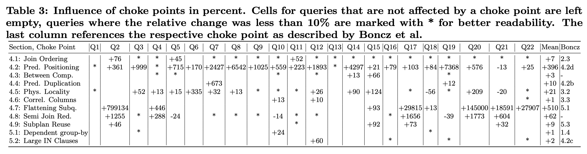  

希望这份基础知识清单对你理解这篇论文有所帮助！
  
## 2 解读论文 
  
这是一篇在数据库领域非常经典且实用的论文。用一句话概括：**这篇论文就像一份详细的“TPC-H 考试（数据库性能测试）复习指南”，它不仅指出了考试中的“必考题”和“拉分题”（即 Choke Points，瓶颈点），还用数据量化了“复习”这些知识点（即 Optimizations，优化）能给你提多少分。**

这篇论文的核心贡献在于“ **量化（Quantifying）** ” 。在此之前，很多数据库专家都知道 TPC-H 中有哪些难题（瓶颈点），但没有人系统地去衡量解决这些难题到底能带来多大的性能提升 。这篇论文填补了这一空白。

下面，我们用通俗易懂的方式来解读这篇论文的核心内容。

### 1\. “考场”和“考生”：TPC-H 和 Hyrise

  * **“考场” (TPC-H):** TPC-H 是一个行业标准的数据库基准测试（Benchmark）。你可以把它想象成数据库界的“高考”，专门测试数据库在处理复杂分析查询（OLAP）时的能力 。这场考试有 22 道大题（Q1 到 Q22）。
  * **“考生” (Hyrise):** 作者们使用他们自己开发的 Hyrise 内存数据库系统来进行测试 。

### 2\. “考点”：什么是查询优化的“瓶颈点”？

在数据库执行一条 SQL 语句之前，它会先通过一个“**查询优化器**”来生成一个高效的“**执行计划**”。这个过程就像你在解一道复杂的应用题时先打草稿，寻找最佳解法。

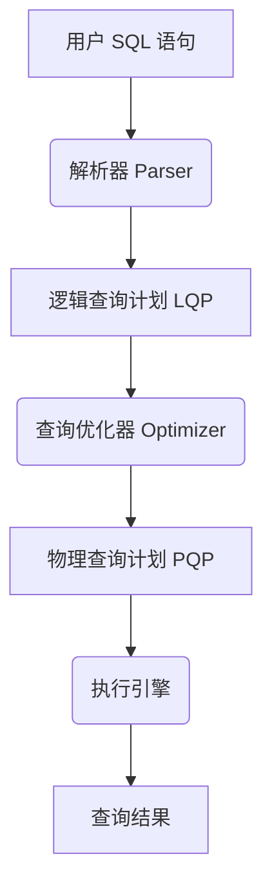

  * **逻辑计划 (LQP):** 描述了“要做什么”，比如“连接A表和B表，然后过滤” 。
  * **物理计划 (PQP):** 描述了“具体怎么做”，比如“用哈希连接（Hash Join）的方式连接A和B” 。

**“瓶颈点 (Choke Points)”**  就是指那些在“打草稿”（优化）过程中特别容易“算错”的地方。如果优化器不够聪明，选了一个很差的执行计划，查询速度可能会慢上成千上万倍。

### 3\. 研究方法：“控制变量法”

作者们想知道每种优化到底值多少分。他们的方法非常直接 ：

1.  拿出一个“满分学霸”（即完整版的 Hyrise 数据库）。
2.  让这个“学霸” **故意忘掉** 一个知识点（比如“禁用子查询扁平化”优化）。
3.  让他用这种“残血”状态再去考 TPC-H。
4.  比较“满分”和“残血”的成绩差异，这个差异就是该知识点（优化）的价值。

### 4\. 关键发现：哪些“复习点”最重要？

这篇论文分析了 11 个瓶颈点 ，我们挑几个最关键的来讲：

#### 发现一：【最重要】子查询扁平化 (Flattening Subqueries)

这是 TPC-H 中**最重要的优化，没有之一** 。

  * **瓶颈点:** TPC-H 中有 6 个查询使用了“相关子查询” 。例如 `SELECT ... FROM A WHERE A.value > (SELECT AVG(B.value) FROM B WHERE B.id = A.id)`。
  * **最笨的执行方式:** 对 A 表的**每一行**，都去执行一遍 B 表的子查询 。如果 A 表有 100 万行，子查询就要被执行 100 万次，性能极差。
  * **优化 (扁平化):** 优化器把这个“嵌套”查询改写成一个等价的 `JOIN`（连接）查询 。这样，A 表和 B 表都只需要被读取一次。
  * **量化结果 (见 Figure 10):** **效果是毁灭性的！** 如图 10 所示，对于 Q2、Q17、Q20 等查询，优化后的性能提升是**几十万倍甚至几百万倍**（注意看 Y 轴的百分比）。

> **Figure 10 节选 (简易图示):**  
>  
> ```  
> Query  | 性能提升 (百分比)  
> -------|----------------------------------  
> Q2     | 799134%    
> Q17    | 29815%     
> Q20    | 145000%    
> ```  
>    
> *(数据来自原图 Figure 10)*  

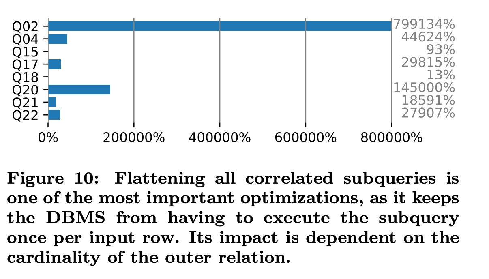  

#### 发现二：【次重要】谓词下推 (Predicate Pushdown)

这是第二重要的优化，核心思想是“**尽早过滤**” 。

  * **瓶颈点:** 假设你要连接两个各有 10 亿行的大表（订单表、商品表），但你只关心“2020年”的数据。
  * **最笨的执行方式:** 先把两个 10 亿行的表做连接（产生一个万亿行的中间结果），**然后**才从这个超级大的结果里筛选出“2020年”的数据。
  * **优化 (谓词下推):** 优化器把 `WHERE year = 2020` 这个过滤条件（即“谓词”） **推到** 连接操作之前。**先**从 10 亿行中各自筛出“2020年”的数据（可能各自只有 100 万行），**再**去连接这两个 100 万行的小表。
  * **量化结果 (见 Figure 5):** 效果依然惊人。在 Q8、Q14、Q19 等查询中，性能提升了**几十倍到上百倍** 。  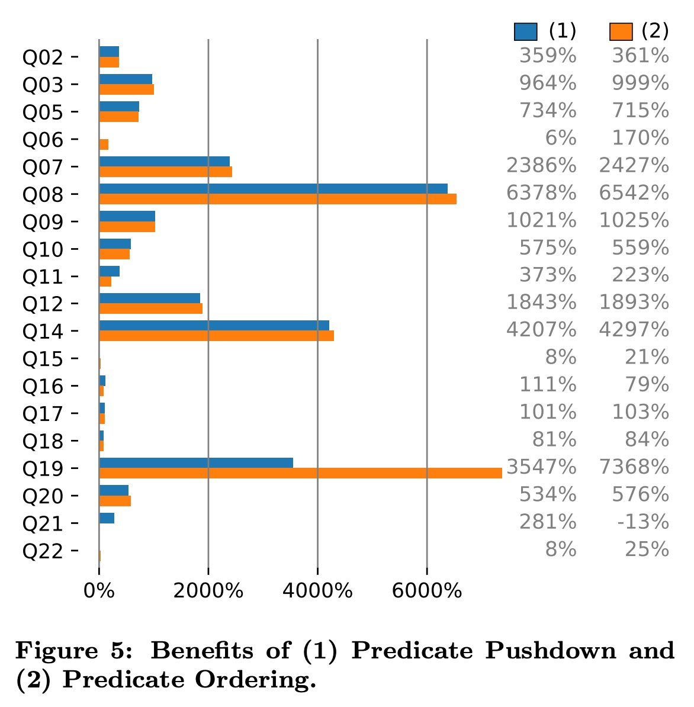  

#### 发现三：【高级技巧】半连接优化 (Semi Join Reduction)

这是一个更精妙的优化，常用于子查询扁平化之后。

  * **瓶颈点:** 以 Q17 为例，它需要计算一个“平均供货量” 。在“扁平化”后，一个天真的计划是：去扫描**整个** `lineitem` 表（6000 万行）来计算平均值 。
  * **优化 (半连接):** 优化器发现，其实我们并不需要**所有**商品的平均值，我们只需要那些在*外层查询*中符合条件的几千个商品的平均值。于是，它增加了一个**半连接 (Semi Join)** 操作，先用外表的几千行数据去过滤 `lineitem` 表，把 6000 万行数据“预筛选”到只有 6 万行 ，**然后再**对这 6 万行数据求平均值。
  * **图 11 (Figure 11) 的直观解释:**  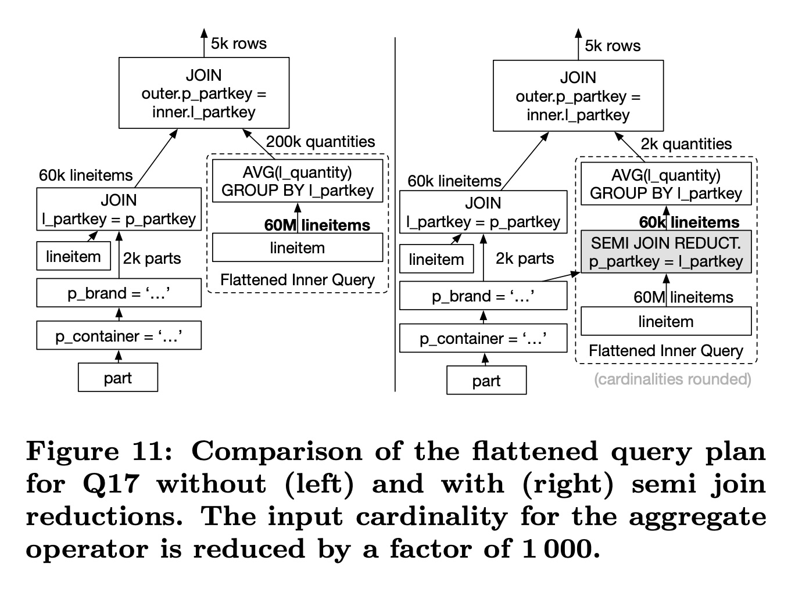  
      * **左图 (未优化):** 对 **60M (6000万)** 行数据做 `AVG()`（聚合）。
      * **右图 (已优化):** 增加一个 `SEMI JOIN REDUCT` ，使得 `AVG()` 只需要在 **60k (6万)** 行数据上执行 。
  * **量化结果 (见 Figure 12):** 仅 Q17 这一项，就获得了 **16 倍 (1632%)** 的性能提升 。 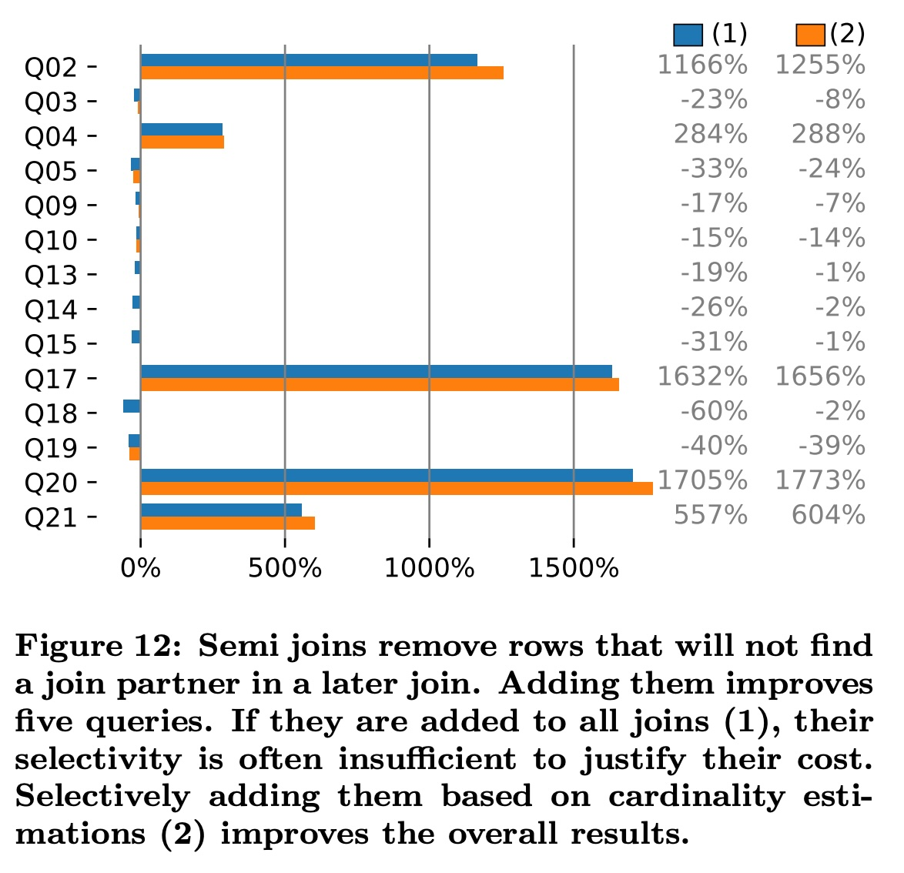  

#### 发现四：【物理层面】数据集群 (Physical Locality)

这个优化不改动查询计划，而是改变数据的“物理存放方式”。

  * **瓶颈点:** TPC-H 的很多查询都涉及日期范围，比如 `WHERE l_shipdate BETWEEN ... AND ...` 。
  * **优化 (集群):** 如果我们在存数据时，就**按照 `l_shipdate`（发货日期）排序**存放 。
  * **量化结果 (见 Figure 8):** 当查询“1995年1月”的数据时，数据库可以直接跳到对应的数据块，读完1月的数据后就停止，而不需要扫描整张表。这种优化（也叫**分区裁剪** ）在 Q6 上带来了**3.35 倍 (335%)** 的性能提升 。  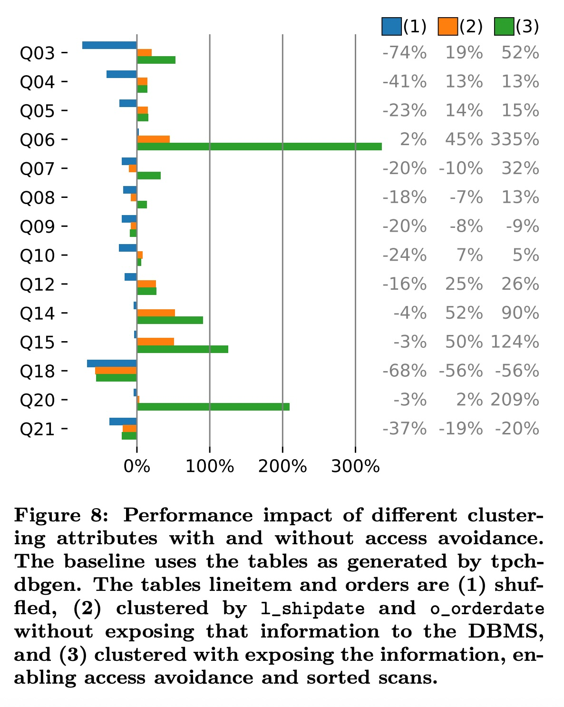  

### 5\. 最终的“复习成绩单” (Table 3)

论文的 **Table 3**  是最终的“成绩单”，它汇总了所有 11 项优化在所有 22 个查询上的性能影响。    

**这份成绩单告诉我们：**

1.  **抓大放小:** 数据库开发者的精力是有限的。他们应该优先实现“**子查询扁平化**”(4.7) 和“**谓词下推**”(4.2)。仅这两项加起来，就带来了近 **30 倍** 的几何平均性能提升 ！
2.  **因题而异:** 并非所有优化都对所有查询有效。比如“**连接顺序**”(4.1)，虽然是数据库优化的经典难题，但在这篇论文中被证明对 TPC-H 的整体影响不大 。
3.  **短板效应:** 有些查询（如 Q1, Q13, Q18）几乎不受这些“逻辑计划”优化的影响 。它们的性能完全依赖于数据库的“**执行引擎**”（比如 `JoinHash`, `AggregateHash` 算子）本身跑得快不快 。

### 总结：这篇论文的价值

这篇论文的伟大之处在于它用**数据**终结了许多关于优化的“猜想”，为数据库开发者提供了一份清晰的“**T-shirt Sizing**”（优先级排序）指南 。

同时，它也提醒了所有做数据库性能比较的人：当你看到 A 数据库在 Q17 上比 B 数据库快 100 倍时，你必须先问一个问题：“**这到底是因为 A 的执行引擎真的很快，还是仅仅因为 A 实现了子查询优化，而 B 没实现？**” 。
  
## 3 术语 
  
好的，这篇论文（《Quantifying TPC-H Choke Points and Their Optimizations》）是一篇非常经典的数据库性能分析文章。为了帮助你理解，我将提取其中最重要的术语，并用通俗易懂的中文进行讲解，同时引用论文中的图表来辅助说明。

-----

### 1\. 基础背景术语

#### TPC-H

  * **讲解：** 这可以被理解为一场数据库界的“高考” 。它是一套公开、标准的“考卷”（即基准测试），专门用来衡量数据库管理系统（DBMS）在处理**分析类**工作（OLAP）时的性能 。TPC-H 包含一套复杂的数据集和 22 个查询（Q1-Q22），这些查询模拟了企业中常见的商业分析问题 。

#### OLAP (Online Analytical Processing)

  * **讲解：** “在线分析处理”。与我们日常用的“订票、转账”（称为 OLTP）不同，OLAP 专注于处理复杂的、数据量大的**分析型**查询 。例如：“统计过去五年，每个季度A类商品在不同区域的总销售额”。

#### Choke Points (瓶颈点)

  * **讲解：** 这是论文的核心。 **“瓶颈点”就是 TPC-H 这套“考卷”里的“拉分题”或“必考的难题”** 。这些是数据库系统为了取得好成绩（高性能）所必须解决的技术挑战 。例如，论文中提到的“相关子查询”就是一个典型的瓶颈点 。

#### Optimizations (优化)

  * **讲解：** 指数据库系统为了高效解决“瓶颈点”而采用的“解题技巧”或“复习策略” 。这篇论文的重点就是**量化**这些“技巧”到底能提多少分 。

-----

### 2\. 数据库内部流程术语

当你向数据库发送一条 SQL 查询时，它内部会经历一个复杂的“思考”过程。

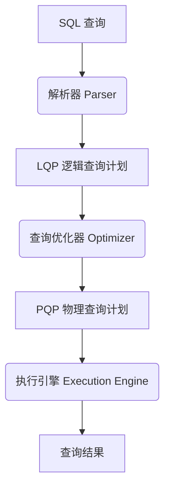

#### LQP (Logical Query Plan)

  * **讲解：** “逻辑查询计划” 。这是数据库“思考”的第一步草稿，描述了“**要做什么**”。它只关心逻辑步骤，比如“先连接A表和B表，然后过滤数据” 。

#### PQP (Physical Query Plan)

  * **讲解：** “物理查询计划” 。这是“思考”后的最终执行方案，描述了“**具体怎么做**” 。例如，LQP 说“连接A和B”，PQP 会决定“使用哈希连接（Hash Join）来连接A和B” 。

#### Operators (算子)

  * **讲解：** “算子”是执行物理计划（PQP）的“具体工具”或“工人”。论文中的 **Figure 2** 就展示了执行 TPC-H 查询时，各种“工人”花费的时间比例。    
  * **常见算子：**
      * **JoinHash (哈希连接):** 负责连接两个表的“工人”。
      * **TableScan (表扫描):** 负责从表中读取数据的“工人”。
      * **AggregateHash (哈希聚合):** 负责处理 `GROUP BY` 或 `SUM()` 等聚合操作的“工人”。

#### Cardinality (基数)

  * **讲解：** 这是一个非常关键的术语，简单说就是“**数据的行数**”或“**数据量**” 。几乎所有优化的核心目的，都是为了**尽早地减少**后续算子需要处理的“基数” 。处理 1000 行数据当然比处理 10 亿行快得多。

-----

### 3\. 核心“瓶颈点”与“优化技巧”

这篇论文的精髓在于量化了以下这些“解题技巧”的价值。

#### 1\. Flattening Subqueries (子查询扁平化)

  * **瓶颈点：** “相关子查询”（Correlated Subqueries）。
  * **讲解：** 这是 TPC-H 中**影响最大**的瓶颈点 。一个“相关子查询”的原始执行方式是：对于外层查询的**每一行**，都要去执行一遍子查询 。如果外层有 100 万行，子查询就要执行 100 万次，这是灾难性的。
  * **优化（扁平化）：** 优化器把这种“嵌套”查询，在逻辑上改写（“扁平化”）成一个更高效的 `JOIN`（连接）查询 。
  * **量化结果：** 正如 **Figure 10** 所示，对于 Q2、Q17、Q20 等查询，这个优化的提升是**成千上万倍**（注意 Y 轴的百分比，例如 Q2 提升了 `799134%`）。    

#### 2\. Predicate Pushdown (谓词下推)

  * **瓶颈点：** 过滤时机太晚。
  * **讲解：** “谓词”就是 `WHERE` 后面的过滤条件。 **“谓词下推”的核心思想是“尽可能早地进行过滤”** 。
  * **举例：** 假设你要连接两张各有 10 亿行的大表，但你只关心其中 `date = '2024-01-01'` 的数据。
      * **笨办法：** 先把两个 10 亿行的表连接起来（产生一个万亿行的中间结果），**然后**才去过滤。
      * **优化办法（下推）：** **先**在两个 10 亿行表上各自完成 `date = '2024-01-01'` 的过滤（可能各自只剩 1000 行），**然后**再去连接这两个 1000 行的小表。
  * **量化结果：** 这是另一个影响巨大的优化 。**Figure 5** 显示，在 Q8、Q14、Q19 等查询上，性能提升了**几十倍到上百倍**（例如 Q8 提升了 `6378%`，Q19 提升了 `3547%`）。    

#### 3\. Semi Join Reduction (半连接规约)

  * **讲解：** 这是一个更高级的“过滤”技巧，通常用在子查询扁平化之后。它的作用是：在执行一个昂贵的操作（比如聚合）之前，先用另一个表的数据“预先筛选”一遍，大幅减少需要处理的数据量 。
  * **图解 (Figure 11)：** 论文中的 **Figure 11** 完美展示了这一点。    
      * **左图 (未优化):** 对 **60M (6000万)** 行的 `lineitem` 表执行 `AVG`（求平均）操作 。
      * **右图 (优化后):** 在求平均之前，增加了一个 `SEMI JOIN REDUCT`（半连接规约）操作 。这个操作先用 `part` 表的 2k (2000) 行数据去过滤 `lineitem` 表，使得 `AVG` 只需要在 **60k (6万)** 行数据上执行，数据量减少了 1000 倍 。
  * **量化结果：** **Figure 12** 显示，这个优化对 Q2, Q17, Q20 等查询有十几倍的提升 。    

#### 4\. Physical Locality / Partition Pruning (物理局部性 / 分区裁剪)

  * **讲解：** 这是一种**物理层面**的优化。如果数据在存储时是按某个键（比如 `l_shipdate` 发货日期）排序和集群的 。
  * **优化（分区裁剪）：** 那么当查询某个日期范围（例如 `WHERE l_shipdate = '1995-01-01'`）时，数据库可以利用数据的“物理局部性”，只扫描存储了该日期的数据块（称为 Partition 或 Chunk），而**跳过（Prune）** 90% 的不相关数据块 。
  * **量化结果：** **Figure 8** 的(3)号柱显示，当启用这种访问避免（Access Avoidance）后，Q6（提升 335%）和 Q20（提升 209%）等查询性能大幅提升 。    

#### 5\. Join Ordering (连接顺序)

  * **讲解：** 当你需要连接三张或更多表（A, B, C）时，是先 `(A join B)` 再 `join C`，还是先 `(B join C)` 再 `join A`，对性能影响极大 。一个坏的连接顺序可能会产生巨大的中间结果集 。
  * **优化：** 优化器会使用算法（如论文中提到的 DPccp 或贪心算法）来估算并选择一个最佳的连接顺序 。
  * **量化结果：** **Figure 4** 显示，这对 Q2、Q5、Q11 等查询有 40%-70% 的提升 。 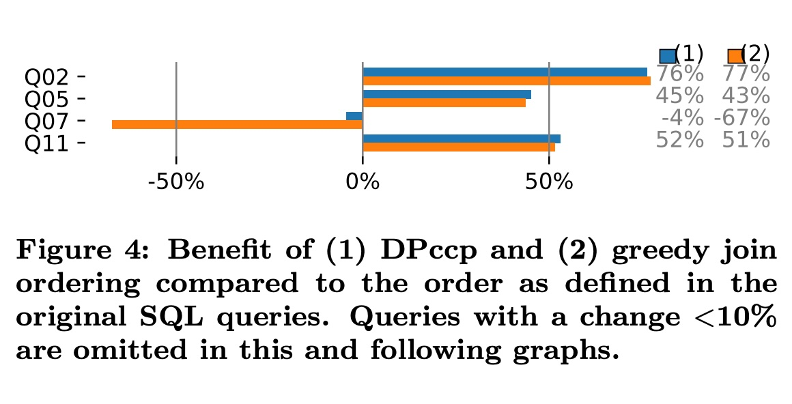  

-----

### 总结 (Table 3)

论文最终的 **Table 3**  是所有术语和优化的“**最终成绩单**”。它告诉我们：    

1.  **子查询扁平化 (4.7)** 和 **谓词下推 (4.2)** 是最重要的优化，平均提升 `510%` 和 `396%` 。
2.  **半连接规约 (4.8)** 和 **物理局部性 (4.5)** 也非常重要 。
3.  有些查询（如 Q1, Q13, Q18）几乎不受这些“逻辑计划”优化的影响，它们的性能更依赖于高效的“**执行引擎**”（即算子本身的速度） 。
  
## 参考        
         
https://dl.acm.org/doi/pdf/10.14778/3389133.3389138    
        
<b> 以上内容基于DeepSeek、Qwen、Gemini及诸多AI生成, 轻微人工调整, 感谢杭州深度求索人工智能、阿里云、Google等公司. </b>        
        
<b> AI 生成的内容请自行辨别正确性, 当然也多了些许踩坑的乐趣, 毕竟冒险是每个男人的天性.  </b>        
    
#### [PolarDB 学习图谱](https://www.aliyun.com/database/openpolardb/activity "8642f60e04ed0c814bf9cb9677976bd4")
  
  
#### [PostgreSQL 解决方案集合](../201706/20170601_02.md "40cff096e9ed7122c512b35d8561d9c8")
  
  
#### [德哥 / digoal's Github - 公益是一辈子的事.](https://github.com/digoal/blog/blob/master/README.md "22709685feb7cab07d30f30387f0a9ae")
  
  
#### [About 德哥](https://github.com/digoal/blog/blob/master/me/readme.md "a37735981e7704886ffd590565582dd0")
  
  

  
