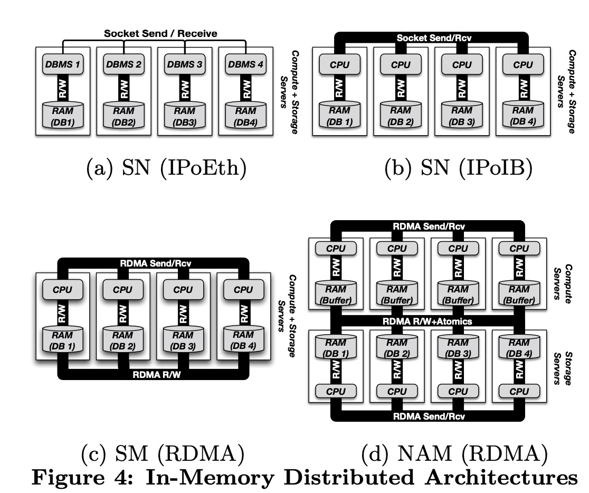
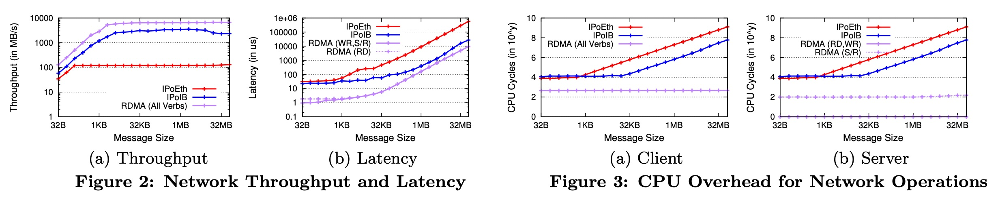
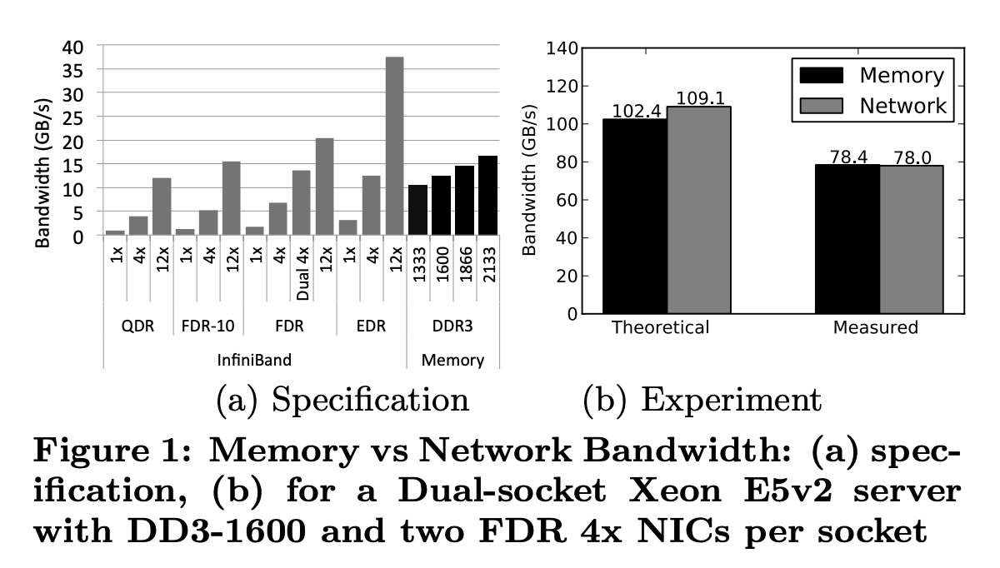
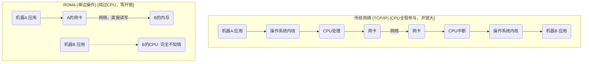
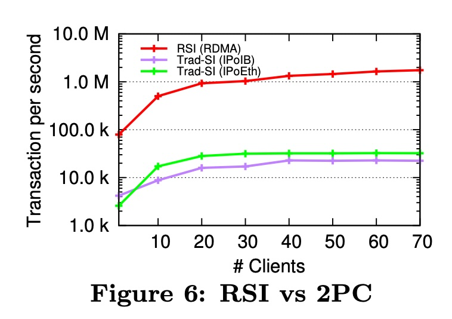
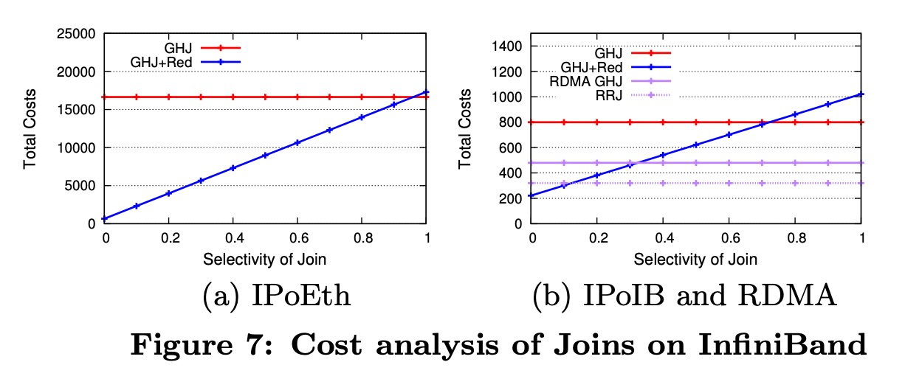
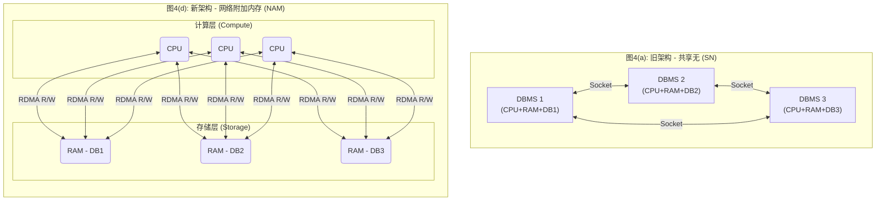

## AI论文解读 | The End of Slow Networks: It’s Time for a Redesign
        
### 作者        
digoal        
        
### 日期        
2025-11-06        
        
### 标签        
PostgreSQL , PolarDB , DuckDB , AI , 论文解读        
        
----        
        
## 背景  
      
https://github.com/lonng/db-papers/blob/main/papers/network/the-end-of-slow-networks:-it's-time-for-a-redesign.pdf        
  
提示:          
```          
读懂《The End of Slow Networks: It’s Time for a Redesign》这篇论文需要提前掌握哪些基础知识, 请使用中文通熟易懂的讲解这些基础知识, 可以引用论文中的图、表或使用Markdown支持的图形(text,mermaid等)增加解释性. 
  
使用中文通熟易懂的解读《The End of Slow Networks: It’s Time for a Redesign》这篇论文, 其中的关键内容请着重讲解, 可以引用论文中的图、表或使用Markdown支持的图形(text,mermaid等)增加解释性. 
  
提取《The End of Slow Networks: It’s Time for a Redesign》这篇论文中的重要术语, 使用中文对这些术语进行通熟易懂的讲解, 可以引用论文中的图、表或使用Markdown支持的图形(text,mermaid等)增加解释性. 
```     
  
## 1 前置知识 
  
你好！这是一篇非常有远见的论文，它预言了网络速度的飞速发展将彻底改变我们设计分布式数据库的方式。

要完全读懂这篇论文，你需要一些跨领域的知识，主要集中在 **数据库、计算机网络、系统架构** 三个方面。

通俗来说，这篇论文的核心思想是：

> 过去，网络太慢了，是系统最大的瓶颈。所以大家设计数据库时，都拼命地 **避免数据跨机器传输**。  
>  
> **但是现在（2015年），网络快得“离谱”** ，甚至快赶上内存了！我们不应该再“躲着”网络，而是应该 **拥抱网络**，设计出能充分利用超高网速的新型数据库架构。  

以下是你需要提前掌握的基础知识，我将尽量用通俗的语言并结合论文中的图表来解释：

### 1. 💻 数据库系统 (DBMS) 基础

这是理解论文“要解决什么问题”的背景。

* **什么是分布式数据库 (Distributed DBMS)？**
    * 简单说，就是数据量太大了，一台机器存不下或算不过来，所以把数据拆分（分区）存到多台机器上，让它们协同工作。
    * **共享无（Shared-Nothing, SN）架构**：这是论文中“旧设计”的代表。就像**图 4(a)** 所示，每个节点（DBMS 1, 2, 3...）都有自己的 CPU、内存（RAM）和数据库（DB），它们之间只通过网络（Socket）通信。这是当时的主流架构，但它假设了网络是“慢”的。    

* **OLTP vs. OLAP (两种典型任务)**
    * 论文的第4节和第5节分别讨论了这两种场景，你必须先理解它们的区别：
    * **OLTP (联机事务处理)**：特点是**大量、短小、快速**的读写。比如：银行转账、电商下订单。它最关心的是 **低延迟（Latency）** 和高并发（每秒能处理多少个事务）。
    * **OLAP (联机分析处理)**：特点是**少量、复杂、海量**的读取。比如：生成季度财报、分析用户购物习惯。它最关心的是 **高吞吐（Throughput）** （总共要花多久算完）。

### 2. 🚀 高性能网络 (RDMA)

这是理解论文“用什么新技术”的关键，**也是最重要的基础知识**。

* **什么是 RDMA (Remote Direct Memory Access)？**
    * **远程直接内存访问**。这是这篇论文的“魔法”所在。
    * **传统网络 (TCP/IP)**：当机器A想给机器B发数据时，流程很繁琐：
        1.  A的CPU：把数据从App复制到操作系统（OS）
        2.  OS：处理数据，加上包头，交给网卡
        3.  B的网卡：收到数据，通知B的CPU
        4.  B的CPU：中断当前工作，处理数据包，从OS复制到App
        * **缺点**：CPU全程深度参与，开销巨大（见**图3**中 IPoEth/IPoIB 的高CPU开销），而且延迟高。    

    * **RDMA**：允许机器A的应用程序 **直接读写** 机器B的内存，**完全绕过了机器B的CPU和操作系统**！
        * **优点**：
            1.  **极低延迟**（见**图2(b)**，RDMA的延迟比IPoIB/IPoEth低几个数量级）。  
            2.  **极高吞吐**（见**图2(a)**，RDMA能跑满带宽）。
            3.  **CPU 零开销**（见**图3(b)**，RDMA (RD,WR) 在服务器端的CPU开销是0）。

* **RDMA 的“单边”与“双边”操作**
    * **双边 (Two-sided)**：如 `SEND/RECEIVE`。需要B的App提前准备好“接收”，B的CPU会参与。
    * **单边 (One-sided)**：如 `READ`, `WRITE`, `Atomic` (原子操作)。A可以直接操作B的内存，B的CPU**完全不知情**。这是RDMA最强大的地方，也是论文中 RSI 协议（第4节）能实现超高性能的原因。

* **InfiniBand (IB)**
    * 你只需要知道这是一种支持RDMA的、**超高速、超低延迟**的网络技术。论文就是用它来证明“网络不再慢”的。

### 3. 🏛️ 系统架构与性能

这是理解论文“如何设计新系统”的基石。

* **系统瓶颈 (Bottleneck) 理论**
    * 一个系统的速度，取决于它最慢的那个组件（木桶效应）。
    * **论文的核心论点**：过去，**网络**是瓶颈。现在，**图1** 用数据显示：InfiniBand EDR (37.5 GB/s) 的带宽已经超过了单根DDR3内存通道 (16.6 GB/s)。    
    * **结论**：瓶颈已经从“网络”转移到了“内存”和“CPU”。

* **新型架构：NAM (Network-Attached Memory)**
    * 基于瓶颈转移的理论，论文在 **图 4(d)** 中提出了NAM架构。    
    * 它将系统**解耦（decoupled）** 为两部分：
        1.  **Compute Servers (计算服务器)**：只有CPU，负责执行逻辑。
        2.  **Storage Servers (存储服务器)**：只有RAM，负责存数据。
    * 计算服务器通过RDMA（图中的 `RDMA R/W`）去**直接读写**存储服务器上的内存。
    * **好处**：这就像一个“内存池”。任何计算节点都可以无差别地访问任何数据，并且可以独立地扩展计算或存储资源。这比“旧”的SN架构（图4a）要灵活和强大得多。

---

### 总结：你需要看懂什么？

为了看懂这篇论文，请你带着这几个问题去阅读：

1.  **图1** 说了什么？（提示：网络和内存带宽谁快？）    
2.  **图2和图3** 说了什么？（提示：RDMA 和传统网络比，在速度和CPU开销上有什么天壤之别？）    
3.  **图4** 中，(a)代表的“旧”架构和 (d)代表的“新”架构，在设计上有什么根本不同？     
4.  为什么RDMA的“单边”操作（尤其是原子操作）对OLTP（第4节）如此重要？
5.  为什么当网络快到和内存差不多时，OLAP（第5节）中那些“企图减少网络流量”的旧算法（如Semi-Join）反而不再是最优的了？

如果你能理解以上这些基础知识，尤其是 **RDMA** 的革命性意义，你就能轻松理解为什么作者会说“是时候重新设计（Redesign）”了。

希望这个解释对你有帮助！你希望我详细解释一下 RDMA 的工作原理，还是 OLTP 和 OLAP 的区别呢？
  
## 2 解读论文 
  
这篇2015年的论文  是一篇极具影响力的“宣言”。它用一句话概括就是： **“别再躲着网络了！网络已经不再是瓶颈，我们必须彻底推翻旧的数据库设计思路。”** 

这篇论文的核心是关于一个“**瓶颈**”的转移。

  * **旧世界（\<2015）** ：CPU 和内存很快，但网络（如1Gbps以太网）又慢、延迟又高。
  * **新世界（\>2015）** ：一种叫 **RDMA** 的网络技术（如 InfiniBand）登场了，它的速度快得“离谱” 。

### 关键证据一：网络“逆袭”了，比内存还快

论文开篇就用 **图1** 甩出了一个颠覆性的事实：    

  * **图1(a) 规格对比**：看最右边的DDR3内存，一根通道的带宽在 10-16 GB/s 之间 。再看左边的 InfiniBand 网络，最新的 EDR (12x) 规格已经达到了 **37.5 GB/s** ！
  * **图1(b) 实验对比**：作者在一个真实的服务器上（配有DDR3-1600内存和FDR 4x网卡）做了测试 。结果发现：
      * 理论上，内存总带宽是 102.4 GB/s，网络总带宽是 109.1 GB/s（两者已经非常接近）。
      * **实测中，网络传输（灰色柱）和内存（黑色柱）的极限都在 78 GB/s 左右** 。

> **通俗解读**：这个实验说明，当程序拼命通过网络发数据时，网卡已经“吃不饱”了，反而是**内存**先撑不住了，没法更快地给网卡“喂”数据 。
> **结论：瓶颈已经从网络转移到了内存。**

-----

### 关键证据二：核心技术 RDMA 的“黑魔法”

为什么新网络这么快？因为它用了一种叫 **RDMA (Remote Direct Memory Access)** 的技术。

我们用一个简单的流程图来对比它和传统网络（TCP/IP）的区别：



RDMA的“黑魔法”在于它的 **“单边”操作** (One-sided Verbs) ：

1.  **极低延迟**：机器A可以直接读写机器B的内存，**完全绕过了B的操作系统** 。
2.  **零CPU开销**：这个操作**不需要B的CPU参与** 。

**图3** 完美地证明了这一点：    

  * **图3(a) 客户端开销**：无论哪种技术，客户端（发送方）CPU总要花点力气（约450个时钟周期）去准备数据 。
  * **图3(b) 服务器端开销**：这是最关键的！
      * IPoEth (以太网) 和 IPoIB (传统IP网络) 的CPU开销（红线和蓝线）非常高，而且随消息增大而线性增长 。
      * **RDMA (RD, WR)** （灰线）的服务器CPU开销**恒定为零**！

**结论：RDMA不仅快，而且还不占用对方服务器的CPU资源。**

-----

### 关键设计：推翻旧架构，拥抱 NAM

既然网络瓶颈消失了，作者认为我们不应该再用**图 4(a)** 那种传统的“共享无”（SN）架构了 。那种架构的核心思想就是“数据本地化”，拼命减少跨网络通信 。    

作者提出了**图 4(d)** 所示的全新架构：**NAM (Network-Attached Memory)** 。

  * **什么是NAM？** 它把系统彻底“解耦”成两部分 ：
    1.  **Compute Servers (计算服务器)**：只负责执行逻辑（跑CPU）。
    2.  **Storage Servers (存储服务器)**：只负责当“内存池”（存RAM）。
  * **如何工作？** 任何一台计算服务器，都可以通过RDMA（图中的 `RDMA R/W`）去**直接读写**任何一台存储服务器的内存，就像访问本地内存一样快，而且还不用消耗存储服务器的CPU 。

-----

### 实践一：OLTP (事务) 性能“爆表”

  * **旧问题**：传统的分布式事务（如2PC，两阶段提交）非常慢，因为它需要在多个节点间发很多小消息来“投票”和“确认”，CPU开销巨大 。

  * **新设计 (RSI 协议)**：基于NAM架构，作者设计了新的 RSI 事务协议 。

      * **核心**：计算节点（客户端）自己当“协调者”（TM）。
      * **关键一步**：它不再需要发消息去“请求锁”，而是直接使用RDMA的 **“原子操作” (Compare-and-Swap)** 。这一条指令，就能在“零CPU开销”的情况下，**同时完成“检查版本号”+“上锁”** 这两步 。
      * **提交**：如果所有锁都成功了，就用 `RDMA WRITE` (同样是零CPU开销) 把新数据写回存储节点 。

  * **结果 (图6)**：    

      * 传统协议 (Trad-SI)，无论是以太网(IPoEth)还是IPoIB，最多只能做到 **32,000** 笔事务/秒 。
      * **RSI (RDMA) 协议，飙升到了 1,800,000 笔事务/秒** 。
      * 性能提升了 **50多倍**，而且扩展性（加更多客户端）近乎线性 。

### 实践二：OLAP (分析) 常识“反转”

  * **旧常识**：做分布式数据分析（如 Join 操作）时，网络太慢，所以必须先在本地用各种算法（如 Bloom filter / Semi-Join）过滤一遍，**减少网络传输的数据量** 。
  * **新现实**：网络现在和内存一样快！你花时间在本地（CPU和内存）做“预过滤”的代价，**可能比直接把数据全发过去还要高**！
  * **图7(a) 慢速网络 (IPoEth)**：    
      * 红线 (GHJ，直接Join) 的代价远高于蓝线 (GHJ+Red，带过滤) 。**旧常识是对的**。
  * **图7(b) 快速网络 (IPoIB / RDMA)**：
      * 看红线 (GHJ) 和蓝线 (GHJ+Red)。只有当过滤效果非常好时（Selectivity \< 0.8），蓝线才有一点点优势 。
      * 再看黄线 (RDMA GHJ) 和紫线 (RRJ, 新算法)。它们几乎不受过滤效果的影响，因为网络成本几乎为0，它们只受内存成本（ $c_{mem}$ ）影响 。
      * **结论**：在高速网络下，与其花CPU和内存去搞“预过滤”，**不如直接把数据通过RDMA“怼”过去**，在远端内存里直接计算，这样反而更快 。

### 总结

这篇论文通过扎实的实验（图1, 2, 3）证明了一个新时代的到来：**网络不再是瓶颈，CPU和内存才是** 。基于这个前提，它提出了一套全新的设计哲学 (NAM架构, 图4) ，并用两个实践案例 (OLTP 和 OLAP) 证明，这种新设计能带来 **数量级（几十倍）** 的性能提升 。

      
  
## 3 术语 
  
好的，这篇论文《The End of Slow Networks: It’s Time for a Redesign》的核心思想是，高速网络（特别是RDMA）的出现，已经从根本上改变了分布式系统的“瓶颈”所在，过去的“慢网络”假设不再成立，因此我们必须重新设计整个数据库架构。

以下是论文中几个最关键的术语，以及它们的通俗讲解：

### 1\. 核心技术：RDMA 与 InfiniBand

#### 1.1 RDMA (Remote Direct Memory Access) - 远程直接内存访问

  * **通俗讲解**：
    这篇论文的**绝对核心**。想象一下，传统网络（TCP/IP）下，机器A给机器B发数据，流程很繁琐 ：

    1.  机器A的CPU把数据交给A的操作系统。
    2.  机器B的网卡收到数据，通知B的CPU。
    3.  B的CPU停下手中的活，处理这个通知，再把数据交给B的应用程序。

    而 **RDMA** 是一种“黑魔法” ：它允许机器A的应用程序**直接**把数据写入机器B的内存中，**完全绕过了机器B的CPU和操作系统** 。

  * **为何重要**：
    RDMA 带来了两个革命性的好处，彻底颠覆了系统设计：

    1.  **极低的延迟 (Latency)**：**图2(b)**  显示，RDMA的延迟（如1微秒）比传统IP网络（IPoIB，20微秒）低了一个数量级 。   
    2.  **远端CPU零开销**：**图3(b)**  清楚地显示，当使用RDMA的读写（RD,WR）时，服务器端（接收方）的CPU开销**几乎为零** 。而传统IP网络（IPoIB/IPoEth）的CPU开销非常高，且随消息变大而飙升 。

#### 1.2 InfiniBand (IB)

  * **通俗讲解**：
    这是一种高性能网络标准，你可以把它理解为一种“超级网线和网卡”，它天生就支持 RDMA 。论文中提到的 FDR 和 EDR 是 InfiniBand 的不同速度等级，FDR 4x 就能提供惊人的带宽 。
  * **为何重要**：
    **图1(a)**  就展示了 InfiniBand EDR (12x) 的带宽（约37.5 GB/s）已经**超过**了当时主流DDR3内存单个通道的带宽（约16.6 GB/s） 。这直接证明了论文的标题：**网络不再慢了，甚至比内存还快**。    

#### 1.3 "单边"操作 (One-sided Verbs)

  * **通俗讲解**：
    这是 RDMA 的精髓。
      * **双边操作 (Two-sided)**：像 `SEND/RECEIVE`。机器A要“发送”，机器B必须提前准备好“接收” 。
      * **单边操作 (One-sided)**：像 `READ`, `WRITE` 和 `Atomics`（原子操作）。机器A可以直接读/写机器B的内存，**机器B的CPU完全不需要知道**这件事 。
  * **为何重要**：
    “单边”操作是实现远端CPU零开销的关键 。论文在第4节提出的RSI协议，就利用了“Compare-and-Swap”（一种原子操作）来实现“无锁”的分布式事务，性能极高 。

### 2\. 关键架构：SN vs. NAM

这篇论文的核心论战就在于架构的演进，**图4**  是全篇的“纲”。    



#### 2.1 共享无 (Shared-Nothing, SN)

  * **通俗讲解**：
    这是**图4(a)**  展示的“旧”架构。每台机器都是一个“自治”的节点，有自己的CPU、内存和数据 。节点之间**只**通过发送消息（Socket）来通信 。
  * **为何重要**：
    SN架构的设计**假设网络是瓶颈**，所以它的核心思想是 **“数据本地化”** ，尽量避免跨节点通信 。论文认为，这个假设现在已经过时了。

#### 2.2 网络附加内存 (Network-Attached Memory, NAM)

  * **通俗讲解**：
    这是**图4(d)**  展示的、论文**提倡**的“新”架构。它把计算和存储**逻辑上分离**了 。
      * **存储节点 (Storage Servers)**：只提供内存（RAM），像一个共享的“远程内存池” 。
      * **计算节点 (Compute Servers)**：只负责计算（CPU）。它们通过RDMA的“单边”操作（RDMA R/W）去**直接读写**任何存储节点上的内存 。
  * **为何重要**：
    NAM架构不再“躲避”网络，而是 **“拥抱”网络** 。它把网络当成了一条超高速的“内存总线”，允许计算节点灵活地访问全量数据，从而实现极高的性能和扩展性 。

### 3\. 关键指标：瓶颈的转移

#### 3.1 瓶颈 (Bottleneck)

  * **通俗讲解**：
    系统中最慢的那个部分，它决定了整个系统的上限（木桶效应）。
  * **为何重要**：
    论文的核心论点就是**瓶颈转移**。
      * **过去**：瓶颈是**网络** 。
      * **现在**：**图1(b)**  的实验证明，当使用高速网络时，实测的网络带宽（78.0 GB/s）和内存带宽（78.4 GB/s）几乎一样 ，瓶颈已经转移到了**内存带宽** 。    

#### 3.2 CPU 开销 (CPU Overhead)

  * **通俗讲解**：
    为了处理网络数据，CPU需要花费多少“精力”。
  * **为何重要**：
    **图3**  表明，传统IP网络（IPoIB）在处理小消息时，CPU开销极大 。而RDMA的开销极低且恒定 ，尤其是服务器端开销为零 。这意味着使用RDMA，CPU可以“解放”出来去做真正的计算，而不是忙于处理网络数据包。    

### 4\. 实践算法：新旧对比

#### 4.1 RSI (RDMA-based SI Protocol)

  * **通俗讲解**：
    论文为OLTP（高并发事务）场景设计的、基于RDMA的新事务协议 。
  * **为何重要**：
    它利用RDMA的**原子操作**（Compare-and-Swap），可以用一个网络往返就完成“验证+锁定”，极大减少了传统2PC（两阶段提交）所需的网络消息和CPU开销 。**图6**  的结果显示，RSI的性能（180万tps）是传统协议（3.2万tps）的**50多倍** 。   

#### 4.2 半连接规约 (Semi-Join Reduction)

  * **通俗讲解**：
    一种“旧”的OLAP（数据分析）优化技术。在做Join（连接）时，先发一个很小的“摘要”（如布隆过滤器）到对方，过滤掉肯定没用的数据，目的是**减少网络传输的数据量** 。
  * **为何重要**：
    论文用**图7**  证明了这个“常识”现在可能是错的：    
      * 在**图7(a)** 的慢速网络（IPoEth）上，使用规约（蓝线）比不使用（红线）代价低得多，优化有效 。
      * 在**图7(b)** 的快速网络（IPoIB）上，两条线的差距很小 。
      * **结论**：当网络和内存一样快时，你花时间在CPU和内存里做“过滤”的代价，可能比直接把数据通过RDMA“怼”过去还要高。这再次印证了“旧设计”已不再适用。
  
## 参考        
         
https://github.com/lonng/db-papers/blob/main/papers/network/the-end-of-slow-networks:-it's-time-for-a-redesign.pdf    
        
<b> 以上内容基于DeepSeek、Qwen、Gemini及诸多AI生成, 轻微人工调整, 感谢杭州深度求索人工智能、阿里云、Google等公司. </b>        
        
<b> AI 生成的内容请自行辨别正确性, 当然也多了些许踩坑的乐趣, 毕竟冒险是每个男人的天性.  </b>        
    
#### [PolarDB 学习图谱](https://www.aliyun.com/database/openpolardb/activity "8642f60e04ed0c814bf9cb9677976bd4")
  
  
#### [PostgreSQL 解决方案集合](../201706/20170601_02.md "40cff096e9ed7122c512b35d8561d9c8")
  
  
#### [德哥 / digoal's Github - 公益是一辈子的事.](https://github.com/digoal/blog/blob/master/README.md "22709685feb7cab07d30f30387f0a9ae")
  
  
#### [About 德哥](https://github.com/digoal/blog/blob/master/me/readme.md "a37735981e7704886ffd590565582dd0")
  
  

  
