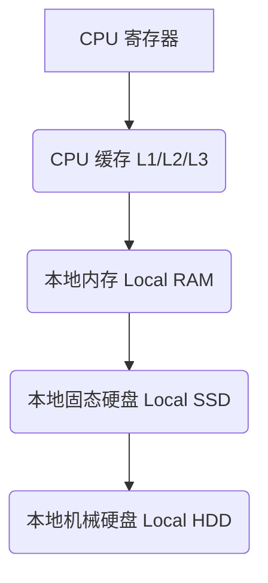
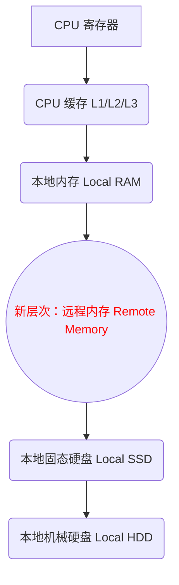
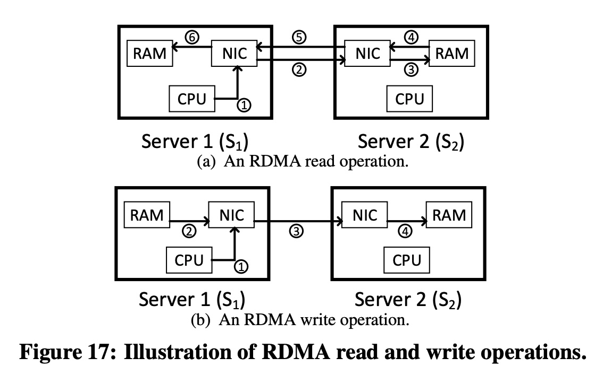
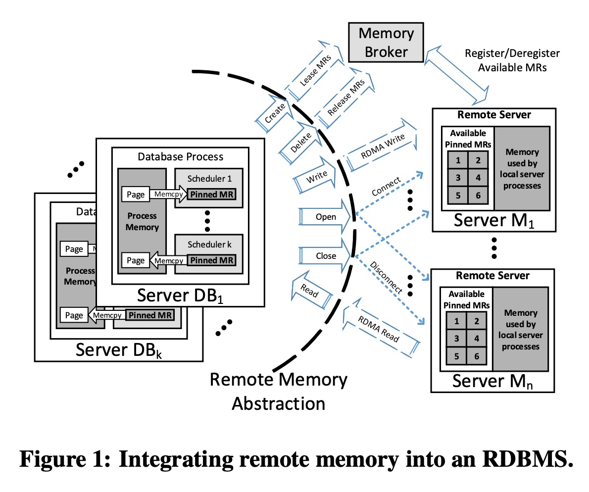
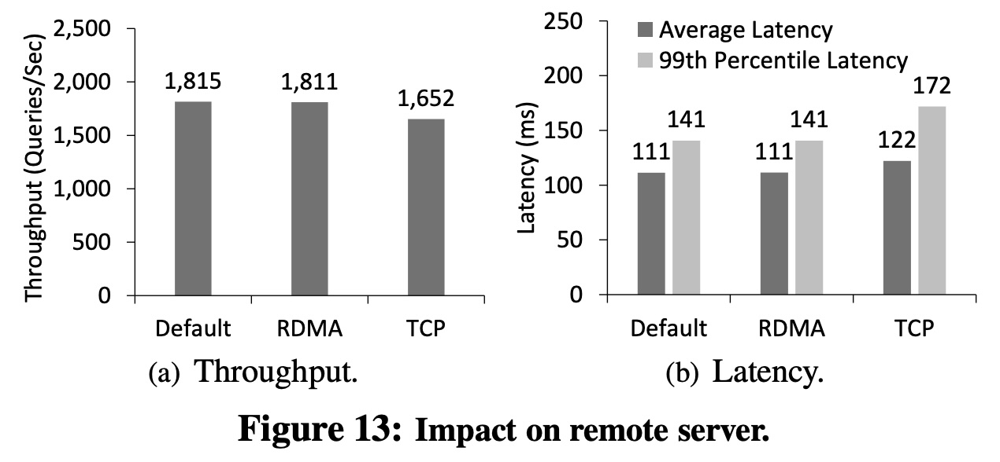
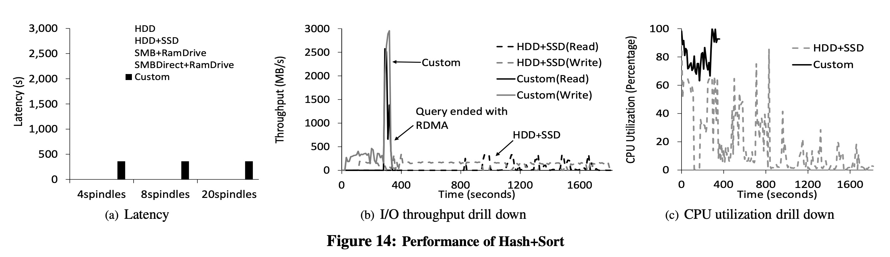
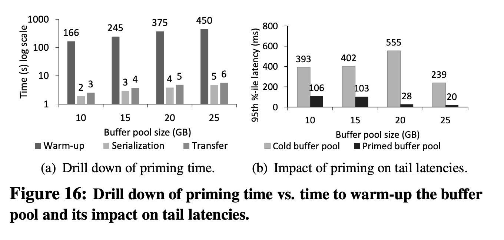
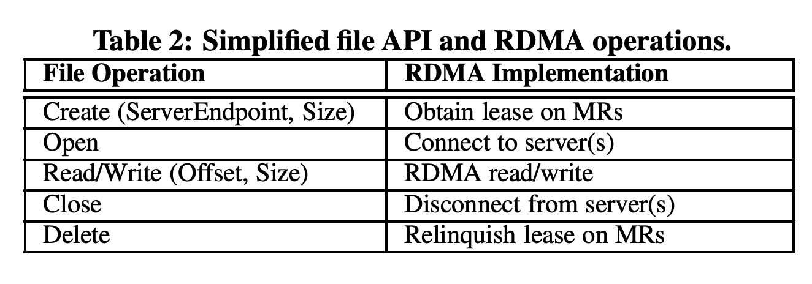
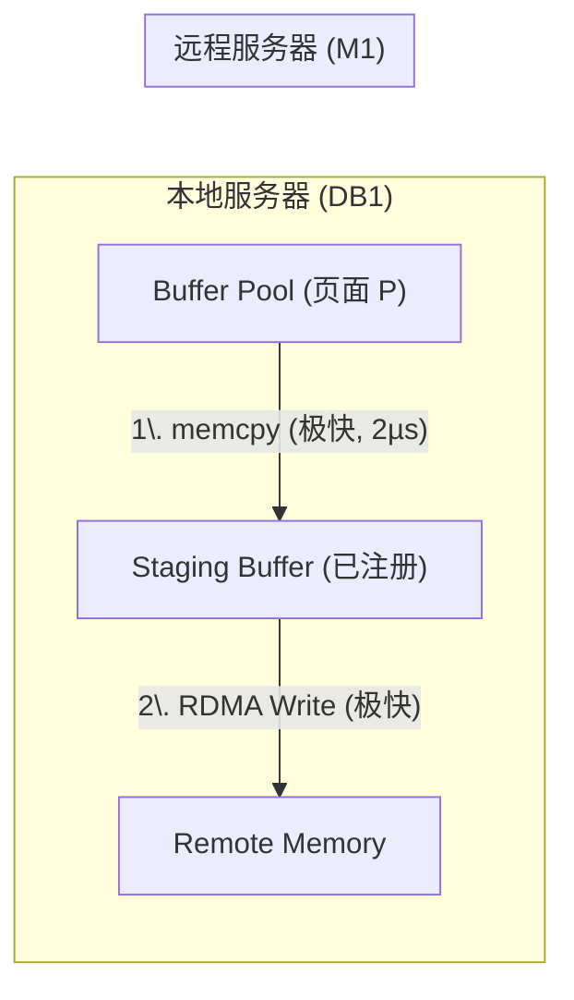
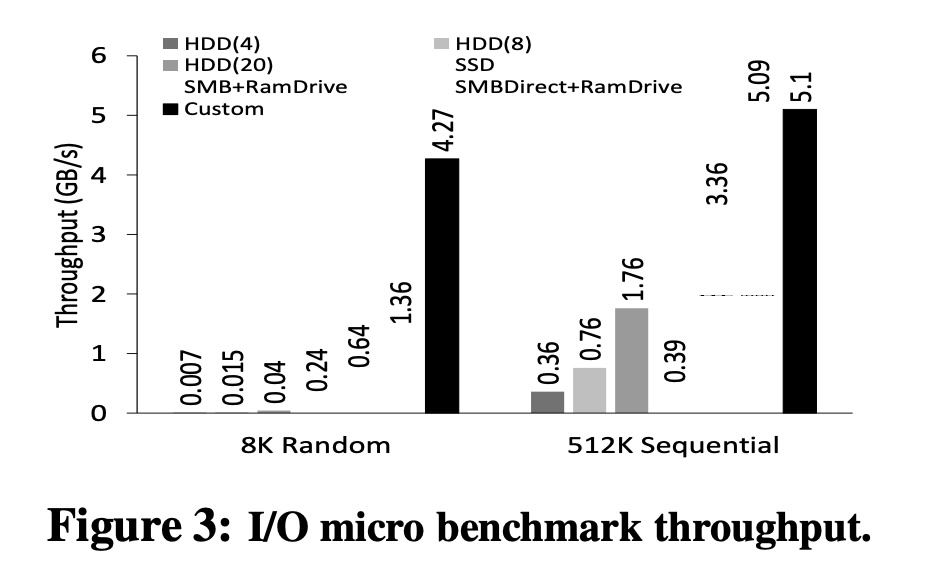

## AI论文解读 | Accelerating Relational Databases by Leveraging Remote Memory and RDMA
        
### 作者        
digoal        
        
### 日期        
2025-11-06        
        
### 标签        
PostgreSQL , PolarDB , DuckDB , AI , 论文解读        
        
----        
        
## 背景  
      
https://dl.acm.org/doi/pdf/10.1145/2882903.2882949        
  
提示:          
```          
读懂《Accelerating Relational Databases by Leveraging Remote Memory and RDMA》这篇论文需要提前掌握哪些基础知识, 请使用中文通熟易懂的讲解这些基础知识, 可以引用论文中的图、表或使用Markdown支持的图形(text,mermaid等)增加解释性. 
  
使用中文通熟易懂的解读《Accelerating Relational Databases by Leveraging Remote Memory and RDMA》这篇论文, 其中的关键内容请着重讲解, 可以引用论文中的图、表或使用Markdown支持的图形(text,mermaid等)增加解释性. 
  
提取《Accelerating Relational Databases by Leveraging Remote Memory and RDMA》这篇论文中的重要术语, 使用中文对这些术语进行通熟易懂的讲解, 可以引用论文中的图、表或使用Markdown支持的图形(text,mermaid等)增加解释性. 
```     
  
## 1 前置知识 
  
要读懂这篇论文《Accelerating Relational Databases by Leveraging Remote Memory and RDMA》，你需要提前了解以下几个核心领域的知识。我会用通俗易懂的方式为你讲解。

这篇论文的核心思想是：**当数据库服务器本地内存不够用时，不立即使用慢速的本地硬盘（SSD/HDD），而是通过高速网络（RDMA）去借用集群中其他“空闲”服务器的内存。**

以下是你需要掌握的基础知识：

### 1\. 关系型数据库 (RDBMS) 与内存管理

这是理解论文“问题”的关键。

  * **什么是 RDBMS？**
      * 就是你可能用过的 MySQL、SQL Server 、Oracle 等。它们用于存储结构化数据（如用户表、订单表）。
  * **为什么 RDBMS 依赖内存？**
      * 数据库的数据主要存在硬盘（磁盘）上，但磁盘访问速度非常慢。
      * 为了加速，RDBMS 会在内存 (RAM) 中开辟一块巨大的缓存区，称为 **缓冲池 (Buffer Pool)** 。
      * 当你查询数据时，RDBMS 会先把数据从磁盘读到缓冲池中。下次再访问同样的数据，就可以直接从内存中读取，速度快几千倍。
  * **内存不足会怎样？(论文要解决的痛点)**
      * 缓冲池大小是有限的 。当缓冲池满了，又有新数据要读进来时，数据库必须“淘汰”掉一些旧的缓存数据 。
      * 如果被淘汰的数据很快又被访问，数据库就必须再去读一次慢速的磁盘，导致性能急剧下降 。
      * 此外，复杂的查询（如排序 Sort、哈希 Hash）会产生大量临时数据 。如果内存不够放，这些临时数据也必须被“溢出”(Spill) 到磁盘上的临时文件（如 SQL Server 中的 TempDB ），这同样非常慢。

### 2\. 计算机存储层次结构 (Memory Hierarchy)

这是理解论文“解决方案”定位的基础。

计算机存储系统像一个金字塔，越往上越快，但越贵、容量越小。



这篇论文的创新之处在于，它在 **"本地内存"** 和 **"本地 SSD"** 之间，增加了一个新的层次：**远程内存 (Remote Memory)** 。



  * **远程内存**：通过网络访问另一台服务器的内存。
  * **速度**：它肯定比本地内存慢（因为要过网络），但论文指出，如果使用 RDMA 技术，它仍然比访问本地 SSD 快得多 。

### 3\. 网络技术：TCP/IP vs. RDMA (核心技术)

这是理解论文“如何实现”的关键。

  * **传统网络 (TCP/IP)**

      * 当你通过网络传输数据时（比如访问网站），数据包需要经过操作系统内核 (OS Kernel) 的层层处理。
      * 在**发送方**，CPU 需要把数据从应用程序复制到操作系统的缓冲区。
      * 在**接收方**，CPU 也被中断，需要把数据从操作系统缓冲区复制到目标应用程序。
      * 这个过程消耗大量的 CPU 资源，并且有较高的延迟 (Latency)。

  * **RDMA (Remote Direct Memory Access)**

      * **远程直接内存访问** 。这是一种“黑科技”网络技术。
      * 它允许一台服务器上的应用程序**直接**读写另一台服务器的内存，而**不需要**两端服务器的 CPU 或操作系统介入 。
      * **关键优势 (如图 17 所示)** ：    
        1.  **内核绕过 (Kernel Bypass)** ：数据传输完全在用户态进行，不经过操作系统内核。
        2.  **CPU 绕过 (CPU Bypass)** ：数据传输由网卡 (NIC) 上的专用硬件处理。特别是**远程服务器的 CPU 完全不参与** ，这意味着“借”内存给别人的服务器不会有性能负担 。
        3.  **零复制 (Zero-Copy)**：数据直接从发送方内存传到接收方内存，无需中间复制。

    > **通俗理解：**

    >   * **TCP/IP** 像寄快递：你需要把包裹交给快递员（CPU/OS），快递员送到中转站，对方中转站再派送给收件人（CPU/OS）。
    >   * **RDMA** 像一条魔法传送带：你（应用程序）直接把物品（数据）放到传送带（RDMA 网卡）上，它就“嗖”一下直接出现在对方的仓库（内存）里，对方的管家（CPU）甚至都不知道这事发生过。

### 4\. 数据中心与集群架构

这是理解论文“应用场景”的背景。

  * **集群 (Cluster)**：现代云服务（如 Azure SQL 数据库 ）不是靠单台超级计算机，而是由成百上千台普通服务器组成的集群。
  * **资源不均衡**：在集群中，资源使用总是不均衡的。在同一时间，服务器 A 可能因为运行复杂查询导致内存“爆满” (Memory Pressure) ，而旁边的服务器 B 可能很空闲，有大量未使用的内存 (Unutilized Memory) 。
  * **内存代理 (Memory Broker)**：论文的系统（如 **图 1**  所示）需要一个“中间人”（内存代理）来协调 。    
      * 空闲的服务器 (M1...Mn) 向代理注册：“我有空闲内存”。
      * 繁忙的服务器 (DB1...DBk) 向代理请求：“我需要内存”。
      * 代理负责“牵线搭桥”，进行内存的分配和租约管理 。

-----

### 总结：你需要具备的知识

要轻松读懂这篇论文，你应该对以下概念有基本了解：

1.  **数据库**：知道什么是“缓冲池”(Buffer Pool)，以及为什么“内存不够”会导致“磁盘 I/O”，从而使数据库变慢。
2.  **存储**：理解“内存 \> SSD \> HDD”的速度差异。
3.  **网络**：明白 RDMA 是一种特殊的网络技术，它最大的特点是“快”（低延迟）和“省”（不耗费远程 CPU）。

有了这些基础，你就能很好地理解论文作者是如何巧妙地利用 RDMA 和集群中空闲的远程内存，为数据库“变”出一个比 SSD 快得多的“二级缓存”，从而实现几倍甚至上百倍的性能提升 。

希望这些解释对你有帮助！你希望我为你深入讲解论文中的某个特定场景（比如缓冲池扩展或 TempDB 溢出）吗？
  
## 2 解读论文 
  
这是一篇发表在数据库顶级会议 SIGMOD 2016 上的经典论文。它的核心思想非常巧妙且实用，我来为你详细解读一下。

### 论文“一句话”核心思想

**当数据库服务器（DB Server）本地内存不够用时，别急着去读慢速的本地磁盘（SSD/HDD），而是通过一种叫 RDMA 的超高速网络技术，去“借用”集群里其他空闲服务器的内存 。**

这就像你家冰箱（本地内存）放不下了，你没有把食物塞进储藏室（本地磁盘），而是发现邻居家（远程服务器）的冰箱（远程内存）空着，于是你搭了条魔法传送带（RDMA），直接把食物放到了邻居家冰箱里。

-----

### 1\. 痛点：数据库的“内存焦虑”

关系型数据库（RDBMS）的性能**极其依赖内存** 。

  * **缓冲池 (Buffer Pool)**：数据库会把最热（最常用）的数据页从磁盘加载到内存中。
  * **临时数据 (TempDB)**：复杂的查询，比如排序 (Sort) 或哈希连接 (Hash Join)，会产生大量临时数据。

**问题来了**：当内存不足时 ：

1.  缓冲池必须淘汰旧的数据页。如果这些数据马上又被访问，就必须从慢速的 SSD/HDD 重新读取，性能急剧下降 。
2.  临时数据必须“溢出”(Spill) 到磁盘上，这同样会带来巨大的 I/O 延迟 。

在云数据中心里，经常出现一种资源不均衡的现象：服务器 A 内存爆满，而服务器 B 却有大量内存空闲 。论文作者盯上的就是这些“空闲内存”。

### 2\. “黑科技”：什么是 RDMA？

RDMA (Remote Direct Memory Access，远程直接内存访问) 是实现这一切的“魔法传送带” 。

与传统的 TCP/IP 网络不同，RDMA 具有三大特点 ：

1.  **超低延迟**：延迟在 10 微秒 (\~10µs) 级别，比访问 SSD 快得多 。
2.  **超高带宽**：可达 56 Gbps 或更高 。
3.  **CPU 旁路 (CPU Bypass)**：这是**最关键**的一点。当服务器 A 读写服务器 B 的内存时，**完全不需要服务器 B 的 CPU 参与** 。

> **通俗理解 CPU 旁路**：  
> * **TCP/IP**：服务器 A 给 B 发数据，B 的 CPU 必须停下手中的活儿，来处理网络请求，把数据收好。这会消耗 B 的算力 。  
> * **RDMA**：服务器 A 直接通过 RDMA 网卡“操作” B 的内存，B 的 CPU 全程“毫不知情”，可以继续做自己的事，性能几乎不受影响 。  
>
> 论文中的 **图 13** 完美证明了这一点：使用 RDMA 时，被“借用”内存的服务器，其本地 workload 性能**几乎不受任何影响** ；而如果使用 TCP，则有 10% 的性能下降 。  

  

-----

### 3\. 关键内容（一）：远程内存的四大应用场景

论文作者设计了四种创新的场景，把远程内存用到了极致 ：

#### 场景 1：扩展缓冲池 (Buffer Pool Extension) 

  * **做法**：当本地缓冲池满了，需要淘汰数据页时，不直接扔掉或写入 SSD，而是把这些数据页通过 RDMA 写入远程内存 。
  * **效果**：下次访问这个“冷”数据时，从远程内存（微秒级）读，远快于从 SSD（毫秒级）读 。

#### 场景 2：溢出临时数据 (Spilling Temporary Data) 

  * **做法**：当 Sort 或 Hash Join 操作的临时数据多到本地内存放不下时，把它们“溢出”到远程内存中 。
  * **效果**：**图 14(a)** 显示，对于 Hash+Sort 查询，使用远程内存（Custom）的速度是使用 SSD 的 **5 倍** 。    

#### 场景 3：内存中语义缓存 (In-Memory Semantic Caching) 

  * **做法**：创建一些“冗余”但“高价值”的数据结构，比如物化视图 (Materialized View) 或特定索引，并把它们“钉”在远程内存中 。
  * **效果**：这些结构完全不占用数据库服务器宝贵的本地内存 。**图 15(a)** 显示，使用这种缓存在远程内存上，查询速度能比在 SSD 上快一个数量级 。    

#### 场景 4：缓冲池预热 (Buffer Pool Priming) 

  * **做法**：在数据库高可用切换（例如，主库 S1 计划内切换到备库 S2）时，S2 启动时是“冷”的（缓冲池为空），性能很差。利用 RDMA，可以瞬间把 S1 的“热”缓冲池内容复制到 S2 。
  * **效果**：**图 16(a)** 显示，通过 RDMA 预热缓冲池的时间（几秒钟），比 S2 自己慢慢“跑热”（几百秒）要快**两个数量级** 。    

-----

### 4\. 关键内容（二）：巧妙的系统设计（三大决策）

为了让这套系统高效且易于集成到 SQL Server 中，作者做了几个关键决策 ：

#### 决策 1：抽象 - “轻量级文件 API”

RDBMS 已经非常擅长处理“文件”了（数据文件、日志文件、临时文件等） 。作者们没有发明一套复杂的新 API，而是巧妙地把远程内存“伪装”成了一个文件 。

  * 数据库（如 SQL Server）以为自己只是在读写一个文件 。
  * 但在这个“文件 API”的底层，`Read()` / `Write()` 操作被替换成了 `RDMA Read()` / `RDMA Write()` 。

如下面**表 2** 所示，文件操作被无缝映射到了 RDMA 操作：    

| 文件操作 (File Operation) | RDMA 实现 (RDMA Implementation) |
| :--- | :--- |
| Create (创建文件) | 获取远程内存（MRs）的租约 |
| Open (打开文件) | 连接到远程服务器 |
| **Read/Write (读/写)** | **RDMA read/write (核心)**  |
| Close (关闭文件) | 断开连接 |
| Delete (删除文件) | 释放租约 |

**好处**：对 SQL Server 引擎的改动极小 (modest changes) 。

#### 决策 2：性能 - “同步”优于“异步”

这一个反直觉但至关重要的优化 。

  * **常规 I/O (磁盘)**：延迟极高（毫秒级）。CPU 绝不能“干等”，所以必须用**异步 (Asynchronous)**，CPU 发出 I/O 请求后就去干别的活 。
  * **RDMA I/O**：延迟极低（\~10 微秒）。
  * **CPU 上下文切换**：CPU 从一个任务切换到另一个任务（比如处理异步 I/O 的完成信号）本身也需要花费几微秒 。

**结论**：如果使用异步，CPU 上下文切换的开销，几乎和 RDMA 操作本身一样长！
因此，作者**反其道而行**，使用**同步 (Synchronous)** 访问：CPU 发出 RDMA 请求后，就“原地空转” (spin) 几微秒，等待它完成 。这反而避免了上下文切换的开销，效率更高 。

#### 决策 3：实现 - 解决“内存碎片”的“Staging Buffer”

RDMA 有个要求：用于传输的内存（MRs）必须是**连续的**，并且要提前“注册” 。

  * **问题**：SQL Server 的缓冲池（Buffer Pool）在物理内存中是**不连续**的 。
  * **笨办法**：每次传一个 8K 数据页时，都“动态注册”一次。但注册操作本身很慢（例如 50µs）。
  * **妙办法（论文方案）** ：在数据库服务器本地，预先申请并注册一块 **连续的** “中转区” (Staging Buffer 或 Pinned MR) 。

当需要把一个 8K 的数据页 P 发送到远程内存时，步骤如下：



这个 `memcpy` (2µs)  远快于动态注册 (50µs) ，完美解决了问题。

-----

### 5\. 惊人的效果：实验数据

论文的实验结果（**图 3**）直观地展示了其性能：

  

观察 **8K Random（8K 随机读）** ：

  * **HDD (20块)**：0.04 GB/s 
  * **SSD**：0.24 GB/s 
  * **SMBDirect+RamDrive** (基于 RDMA 的文件共享)：0.64 GB/s 
  * **Custom (本文方案)**：**4.27 GB/s** 

**结论**：作者的定制化 RDMA 方案，在随机读性能上，比高速 SSD 快了 **17 倍**，比传统的 RDMA 文件共享快了 **6.6 倍** 。

在真实的 TPC 基准测试中，也实现了 3x 到 10x 的吞吐提升，以及 2x 到 100x 的查询延迟降低 。

### 总结

这篇论文是一个“学术界”和“工业界”完美结合的典范。它精准地抓住了数据中心内存资源不均衡的痛点，利用 RDMA 这一硬件特性，通过巧妙的系统设计（文件 API、同步、Staging Buffer），在不对数据库“伤筋动骨”的前提下，实现了巨大的性能飞跃。

希望这个解读对你有帮助！你是否想了解更多关于 RDMA 的工作原理？
  
## 3 术语 
  
好的，我来为你提取并讲解这篇论文《Accelerating Relational Databases by Leveraging Remote Memory and RDMA》中的关键术语。

这篇论文的核心是利用高速网络技术（RDMA）和集群中其他服务器的空闲内存，来给数据库“减负”，解决本地内存不足时的性能瓶K颈。

### 核心技术与背景

#### 1\. RDMA (Remote Direct Memory Access) - 远程直接内存访问

  * **通俗讲解**：
    这是一种“黑科技”网络技术，好比一条“魔法传送带”。

      * **传统网络 (TCP/IP)** 像寄快递：你需要打包（CPU参与），交给快递员（操作系统），对方收到后也要拆包（对方CPU参与）。
      * **RDMA**：你（服务器A）直接把数据放到传送带上，它就“嗖”一下**直接**出现在对方（服务器B）的仓库（内存）里。

  * **论文中的作用**：

      * RDMA 允许一台服务器的内存被另一台服务器直接读写，而**不需要**远程服务器的 CPU 或操作系统（OS）介入 。
      * 它延迟极低（约 10 微秒）且带宽极高（约 56 Gbps）。
      * 最大的好处是，当服务器A“借用”服务器B的内存时，服务器B的 CPU 几乎零开销，不会影响B上正在运行的任务 。

    

    ```mermaid
    graph TD
        subgraph "服务器 A (访问者)"
            CPU_A[CPU] -- 1\. 发起请求 --> NIC_A[RDMA 网卡]
        end
        subgraph "服务器 B (内存提供者)"
            CPU_B["CPU (全程不参与)"]
            MEM_B[远程内存]
            NIC_B[RDMA 网卡]
        end
        NIC_A -- 2\. 网络传输 --> NIC_B
        NIC_B -- 3\. 直接读写 --> MEM_B
        MEM_B -- 4\. 数据返回 --> NIC_B
        NIC_B -- 5\. 网络传回 --> NIC_A
        NIC_A -- 6\. 返回给应用 --> CPU_A
    ```

#### 2\. RDBMS (Relational Database Management System) - 关系型数据库管理系统

  * **通俗讲解**：
    就是我们常用的 MySQL, SQL Server, Oracle 等 。它们用来存储结构化数据（如用户表、订单表）。
  * **论文中的作用**：
    本文的研究对象 。RDBMS 非常依赖内存（RAM）来提升性能 。当内存不够时，性能会急剧下降 。

#### 3\. Buffer Pool (缓冲池)

  * **通俗讲解**：
    数据库的“内存工作台”。数据库从慢速磁盘（SSD/HDD）读取数据后，会把这些数据（称为“页”）放在内存的这块区域 。下次再用时，直接从内存拿，就快多了。
  * **论文中的作用**：
    当这个“工作台”满了，就必须丢掉一些旧数据页，这会导致性能问题 。本文的第一个场景就是扩展这个缓冲池 。

#### 4\. Remote Memory (远程内存)

  * **通俗讲解**：
    “邻居家的空闲冰箱”。在云数据中心集群中，一台服务器（DB1）可能内存爆满，而另一台服务器（M1）可能有大量未使用的内存 。这部分空闲内存就是“远程内存”。

  * **论文中的作用**：
    本文不使用本地 SSD 作为内存不足时的B角，而是使用远程内存 。它在存储体系中增加了一个新层次：

    ```mermaid
    graph TD
        A["本地内存 (Local RAM)"] --> B("<b><font color=red>远程内存 (Remote Memory)</font></b>");
        B --> C[本地 SSD];
        C --> D[本地 HDD];
    ```

    这个新层次的速度介于本地内存和本地 SSD 之间 。

-----

### 论文提出的四大应用场景

论文利用远程内存设计了四个具体场景来加速数据库：

#### 5\. Buffer Pool Extension (BPExt) - 缓冲池扩展

  * **通俗讲解**：
    “工作台放不下了，临时放到隔壁桌（远程内存）”。当本地缓冲池满了，需要淘汰一个数据页时，不把它扔掉，而是通过 RDMA 把它写到远程内存里 。
  * **论文中的作用**：
    如果这个被淘汰的数据页很快又被访问，从远程内存读回来（微秒级），远快于从本地 SSD 读（毫秒级）。

#### 6\. Spilling Temporary Data (溢出临时数据) / TempDB

  * **通俗讲解**：
    “做菜（执行查询）时，砧板（内存）太小，临时切好的菜（临时数据）没地方放”。复杂的查询（如排序 Sort、哈希 Hash）会产生大量临时数据 。内存放不下时，这些数据会“溢出”到磁盘 。
  * **论文中的作用**：
    本文将这些溢出的临时数据（在 SQL Server 中通常写入 TempDB ）转而写入到远程内存 。**图 14(a)** 的实验显示，这比写入 SSD 快 5 倍 。    

#### 7\. Semantic Caching (语义缓存)

  * **通俗讲解**：
    “缓存‘红烧肉’（查询结果），而不是‘生猪肉’（原始数据）”。
  * **论文中的作用**：
    这是一种更高级的缓存，它缓存的是查询表达式的结果，比如物化视图或索引 。论文利用远程内存来“钉住”(pin) 这些缓存结构 ，使它们常驻内存，但不占用数据库服务器宝贵的本地内存 。

#### 8\. Buffer Pool Priming (缓冲池预热)

  * **通俗讲解**：
    “主备切换时，新上岗的A（新主库）直接从刚下班的B（旧主库）那里拿来‘热乎’的工具箱（缓冲池数据），而不是自己冷启动再去仓库（磁盘）一件件拿”。
  * **论文中的作用**：
    在高可用（HA）集群中，主备切换很常见 。新主库启动时缓冲池是“冷”的，性能很差 。本文利用 RDMA 极快的数据传输能力，在切换时（尤其是计划内切换），将旧主库的“热”缓冲池内容迅速复制给新主库 。

-----

### 关键的实现与设计

#### 9\. Lightweight File API (轻量级文件 API)

  * **通俗讲解**：
    一个巧妙的“翻译器”。数据库系统（如 SQL Server）已经非常擅长读写“文件”了 。
  * **论文中的作用**：
    作者没有发明新接口，而是把远程内存“伪装”成了一个文件 。RDBMS 以为自己在读写文件，但这个 API 实际上在底层把 `Read/Write` 操作“翻译”成了 `RDMA Read/Write` 操作 。**表 2** 总结了这种映射：    

| 文件操作 (File Operation) | RDMA 实现 (RDMA Implementation) |
| :--- | :--- |
| Create (创建文件) | 获取远程内存（MRs）的租约  |
| Open (打开文件) | 连接到远程服务器  |
| **Read/Write (读/写)** | **RDMA read/write (核心)**  |
| Close (关闭文件) | 断开连接  |
| Delete (删除文件) | 释放租约  |

#### 10\. Memory Broker (内存代理)

  * **通俗讲解**：
    “内存中介”或“资源调度中心” 。
  * **论文中的作用**：
    如**图 1** 所示，它是一个集群中的组件，负责：     
    1.  **登记**：空闲服务器 (M1, Mn) 向 Broker 报告自己有多少可用内存 。
    2.  **分配**：需要内存的服务器 (DB1, DBk) 向 Broker 发起请求 。
    3.  **租约 (Lease)**：Broker 授予 DB1 一个租约，允许它在一段时间内“独占”M1 的某块内存 。

#### 11\. Synchronous vs. Asynchronous (同步 vs. 异步访问)

  * **通俗讲解**：
    这是一个关键的设计决策，有点反直觉。
      * **异步（传统磁盘）** ：磁盘I/O太慢（毫秒级）。CPU 发出读写请求后，就去干别的活了，等磁盘搞定了再通知它。
      * **同步（本文方案）** ：RDMA 访问太快（微秒级）。如果还用异步，CPU“切换任务”这个动作（上下文切换）本身就要花掉几微秒 ，和 RDMA 访问时间差不多长 。
  * **论文中的作用**：
    作者发现，对于 RDMA 这种超低延迟的 I/O，采用“同步”访问 ，即 CPU 发出请求后就“原地空转” (spin) 等待结果，反而比异步切换更高效 。

#### 12\. Staging Buffer (中转区) / Pinned MR

  * **通俗讲解**：
    “发快递前的专用打包台”。
  * **论文中的作用**：
    RDMA 有个限制：它只能读写“已注册”（Pinned，钉住）的内存区域（MRs）。
      * **问题**：RDBMS 的缓冲池在内存中是动态分配、不连续的 ，很难提前注册。
      * **笨办法**：每次传一个 8K 数据页，都动态注册一次。但这很慢（注册要 50µs）。
      * **论文方案**：在数据库服务器本地，预先申请并注册一小块连续的“中转区” (Staging Buffer) 。
        1.  把 8K 数据页从缓冲池 `memcpy` 到这个中转区（极快，约 2µs）。
        2.  从中转区通过 RDMA 发送到远程内存 。
            这个“先复制再发送”的方案，总时间 (2µs + RDMA) 远快于“动态注册再发送” (50µs + RDMA) 。
  
## 参考        
         
https://dl.acm.org/doi/pdf/10.1145/2882903.2882949    
        
<b> 以上内容基于DeepSeek、Qwen、Gemini及诸多AI生成, 轻微人工调整, 感谢杭州深度求索人工智能、阿里云、Google等公司. </b>        
        
<b> AI 生成的内容请自行辨别正确性, 当然也多了些许踩坑的乐趣, 毕竟冒险是每个男人的天性.  </b>        
    
#### [PolarDB 学习图谱](https://www.aliyun.com/database/openpolardb/activity "8642f60e04ed0c814bf9cb9677976bd4")
  
  
#### [PostgreSQL 解决方案集合](../201706/20170601_02.md "40cff096e9ed7122c512b35d8561d9c8")
  
  
#### [德哥 / digoal's Github - 公益是一辈子的事.](https://github.com/digoal/blog/blob/master/README.md "22709685feb7cab07d30f30387f0a9ae")
  
  
#### [About 德哥](https://github.com/digoal/blog/blob/master/me/readme.md "a37735981e7704886ffd590565582dd0")
  
  

  
