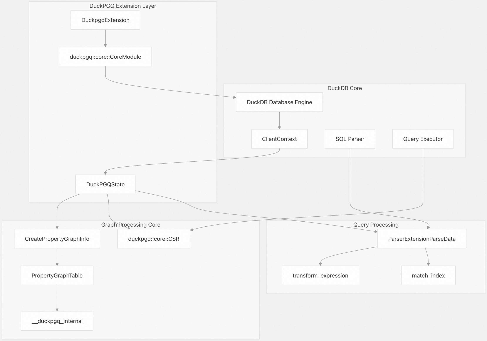
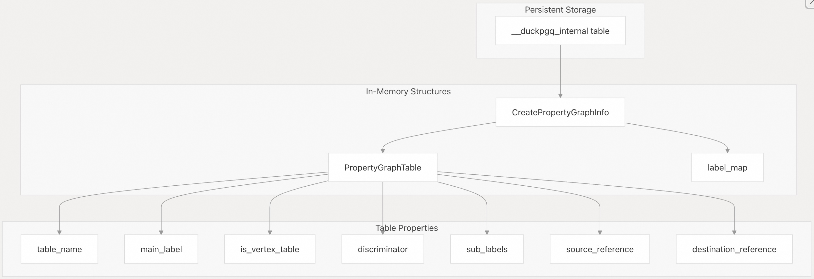
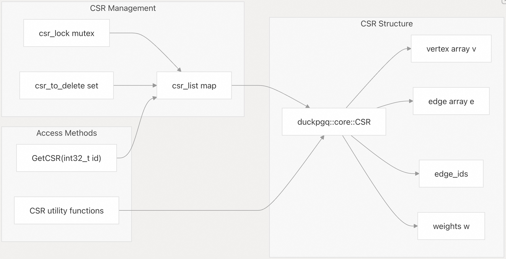

## DuckPGQ 源码学习: 1 概览    
                        
### 作者                        
digoal                        
                        
### 日期                        
2025-11-06                        
                        
### 标签                        
DuckDB , PGQ , 属性图 , DuckPGQ , 源码学习                        
                        
----                     
                        
## 背景                        
**DuckPGQ** 是一个 **DuckDB** **扩展**（**Extension**），它通过实现 **SQL/PGQ**（**Property Graph Queries**，属性图查询）标准支持，将图数据库能力带入**关系型**（**Relational**）世界。该扩展允许用户在现有的关系型表上定义**属性图**（**Property Graphs**），并在 **DuckDB** 熟悉的 **SQL** 环境中执行图查询、**模式匹配**（**Pattern Matching**）和图算法。  
  
本文提供 **DuckPGQ** 扩展架构、核心组件和功能的全面概览。  
  
### 系统架构  
  
**DuckPGQ** 与 **DuckDB** 的架构深度集成，同时保持了图特有功能的清晰分离。该扩展通过一个**分层架构**（**layered architecture**）运行，将关系型数据转换为图表示形式，并提供专门的查询处理能力。  
  
#### 高级组件架构  
  
  
  
来源:  
[`src/duckpgq_extension.cpp` 11-24](https://github.com/cwida/duckpgq-extension/blob/29748bfe/src/duckpgq_extension.cpp#L11-L24)  
[`src/include/duckpgq_state.hpp` 10-41](https://github.com/cwida/duckpgq-extension/blob/29748bfe/src/include/duckpgq_state.hpp#L10-L41)  
[`src/duckpgq_state.cpp` 5-32](https://github.com/cwida/duckpgq-extension/blob/29748bfe/src/duckpgq_state.cpp#L5-L32)  
  
#### 扩展生命周期和状态管理  
  
  
  
来源:  
[`src/duckpgq_extension.cpp` 34-41](https://github.com/cwida/duckpgq-extension/blob/29748bfe/src/duckpgq_extension.cpp#L34-L41)  
[`src/duckpgq_state.cpp` 175-183](https://github.com/cwida/duckpgq-extension/blob/29748bfe/src/duckpgq_state.cpp#L175-L183)  
[`src/include/duckpgq_state.hpp` 29-41](https://github.com/cwida/duckpgq-extension/blob/29748bfe/src/include/duckpgq_state.hpp#L29-L41)  
  
### 核心组件  
  
#### DuckPGQState：中央状态管理器  
  
`DuckPGQState` 类充当客户端上下文中所有图相关操作的**中央协调器**（**Central Coordinator**）。它维护着几个关键的数据结构：  
  
| 组件 (**Component**) | 类型 (**Type**) | 目的 (**Purpose**) |  
| :--- | :--- | :--- |  
| `registered_property_graphs` | `case_insensitive_map_t<unique_ptr<CreateInfo>>` | 已定义的**属性图**（**Property Graphs**）注册表 |  
| `csr_list` | `std::unordered_map<int32_t, unique_ptr<duckpgq::core::CSR>>` | 用于图算法的活动 **CSR**（**Compressed Sparse Row**，压缩稀疏行）结构 |  
| `parse_data` | `unique_ptr<ParserExtensionParseData>` | 图查询的当前解析状态 |  
| `transform_expression` | `unordered_map<int32_t, unique_ptr<ParsedExpression>>` | 查询处理期间的表达式转换 |  
| `csr_to_delete` | `std::unordered_set<int32_t>` | **CSR** 结构体的清理管理 |  
  
来源:  
[`src/include/duckpgq_state.hpp` 34-40](https://github.com/cwida/duckpgq-extension/blob/29748bfe/src/include/duckpgq_state.hpp#L34-L40)  
[`src/duckpgq_state.cpp` 175-183](https://github.com/cwida/duckpgq-extension/blob/29748bfe/src/duckpgq_state.cpp#L175-L183)  
  
#### 属性图元数据管理  
  
**DuckPGQ** 通过**持久化的内部表**（**persistent internal table**）和**内存中的结构**（**in-memory structures**）来维护**属性图**（**Property Graph**）定义：  
  
  
  
来源:  
[`src/duckpgq_state.cpp` 7-28](https://github.com/cwida/duckpgq-extension/blob/29748bfe/src/duckpgq_state.cpp#L7-L28)  
[`src/duckpgq_state.cpp` 34-45](https://github.com/cwida/duckpgq-extension/blob/29748bfe/src/duckpgq_state.cpp#L34-L45)  
[`src/duckpgq_state.cpp` 143-173](https://github.com/cwida/duckpgq-extension/blob/29748bfe/src/duckpgq_state.cpp#L143-L173)  
  
#### CSR 数据结构集成  
  
该**扩展**（**Extension**）使用**压缩稀疏行**（**CSR**）格式进行高效的图表示和算法执行：  
  
  
  
来源:  
[`src/include/duckpgq_state.hpp` 38-40](https://github.com/cwida/duckpgq-extension/blob/29748bfe/src/include/duckpgq_state.hpp#L38-L40)  
[`src/duckpgq_state.hpp` 194-200](https://github.com/cwida/duckpgq-extension/blob/29748bfe/src/duckpgq_state.cpp#L194-L200)  
  
### 关键功能  
  
#### 属性图定义与管理  
  
**DuckPGQ** 允许用户使用 `CREATE PROPERTY GRAPH` 语法在现有的关系型表上定义**属性图**（**Property Graphs**）。该**扩展**支持：  
  
  * **顶点表**（**Vertex Tables**）：定义带有**属性**（**properties**）和**标签**（**labels**）的节点  
  * **边表**（**Edge Tables**）：定义带有源/目标引用的关系  
  * **标签管理**（**Label Management**）：支持带有**判别式**（**discriminators**）的主标签和子标签  
  * **模式灵活性**（**Schema Flexibility**）：**跨模式**（**Cross-schema**）和**跨目录**（**cross-catalog**）的图定义  
  
#### 图查询处理  
  
该**扩展**通过以下方式提供了全面的图查询能力：  
  
  * **模式匹配**（**Pattern Matching**）：支持 `MATCH` 子句进行图遍历模式匹配  
  * **路径查找**（**Path Finding**）：带有长度约束的高级路径查找  
  * **图分析**（**Graph Analytics**）：用于**连通性**（**connectivity**）和**聚类分析**（**clustering analysis**）的内置算法  
  * **SQL 集成**（**SQL Integration**）：与标准 **SQL** 操作的无缝集成  
  
#### 平台支持与分发  
  
**DuckPGQ** 通过自动化构建和分发维护了广泛的平台兼容性：  
  
| 平台 (**Platform**) | 架构 (**Architectures**) | 分发方法 (**Distribution Method**) |  
| :--- | :--- | :--- |  
| Linux | amd64, amd64\_musl, arm64 | S3 存储桶，社区仓库 |  
| macOS | amd64, arm64 | S3 存储桶，社区仓库 |  
| Windows | amd64, amd64\_mingw | S3 存储桶，社区仓库 |  
| WebAssembly | eh, mvp, threads | S3 存储桶 |  
  
来源:  
[`README.md` 49-84](https://github.com/cwida/duckpgq-extension/blob/29748bfe/README.md#L49-L84)  
[`README.md` 10-16](https://github.com/cwida/duckpgq-extension/blob/29748bfe/README.md#L10-L16)  
  
#### 开发状态  
  
**DuckPGQ** 作为一个**研究项目**（**research project**）正在积极开发中，并拥有可用于生产的**分发基础设施**（**distribution infrastructure**）。该**扩展**维护：  
  
  * **版本兼容性**（**Version Compatibility**）：适用于不同 **DuckDB** 版本的多个版本  
  * **自动化测试**（**Automated Testing**）：集成了 **CI/CD**（**Continuous Integration/Continuous Deployment**，持续集成/持续部署）的全面 **SQL** 测试套件  
  * **社区分发**（**Community Distribution**）：通过 **DuckDB** 社区扩展仓库提供  
  * **开发文档**（**Development Documentation**）：构建说明和贡献指南  
  
该**扩展**被标记为“正在进行的工作”（**work in progress**），但为图工作负载提供了稳定的功能，并积极接受社区反馈和贡献。  
  
来源:  
[`README.md` 5-6](https://github.com/cwida/duckpgq-extension/blob/29748bfe/README.md#L5-L6)  
[`README.md` 423-502](https://github.com/cwida/duckpgq-extension/blob/29748bfe/README.md#L423-L502)  
[`README.md` 466-469](https://github.com/cwida/duckpgq-extension/blob/29748bfe/README.md#L466-L469)  
      
#### [PolarDB 学习图谱](https://www.aliyun.com/database/openpolardb/activity "8642f60e04ed0c814bf9cb9677976bd4")
  
  
#### [PostgreSQL 解决方案集合](../201706/20170601_02.md "40cff096e9ed7122c512b35d8561d9c8")
  
  
#### [德哥 / digoal's Github - 公益是一辈子的事.](https://github.com/digoal/blog/blob/master/README.md "22709685feb7cab07d30f30387f0a9ae")
  
  
#### [About 德哥](https://github.com/digoal/blog/blob/master/me/readme.md "a37735981e7704886ffd590565582dd0")
  
  

  
