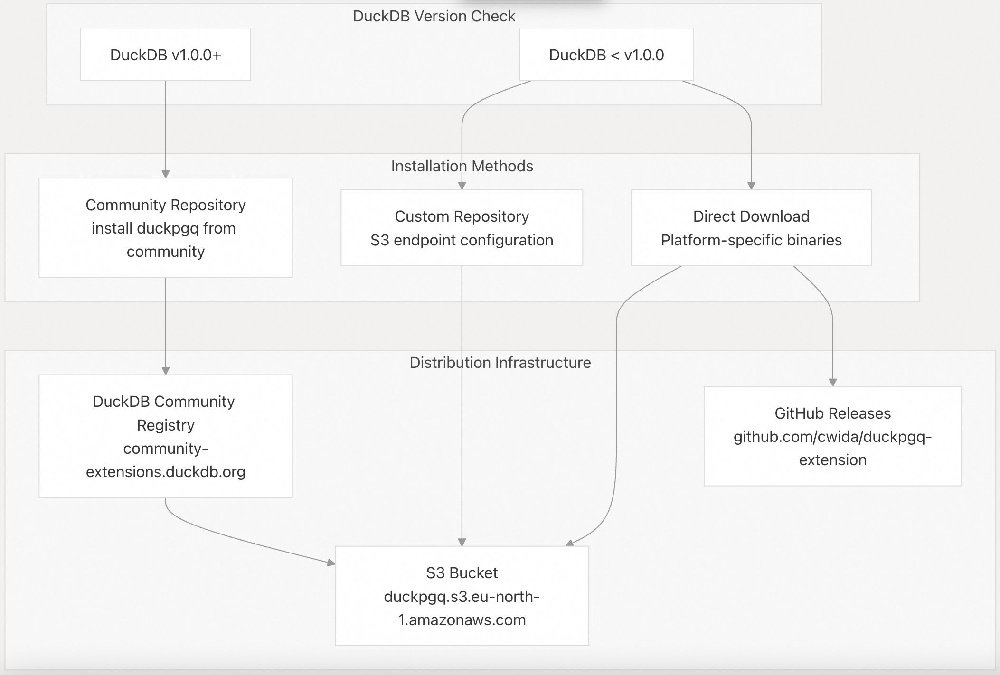
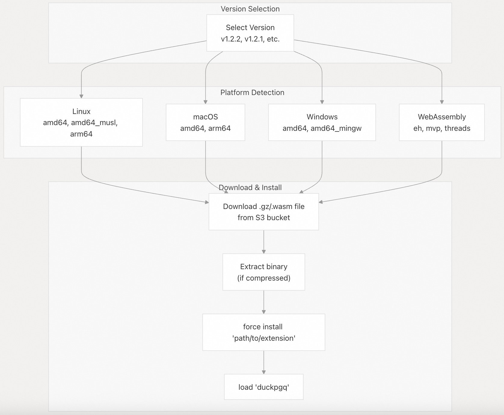
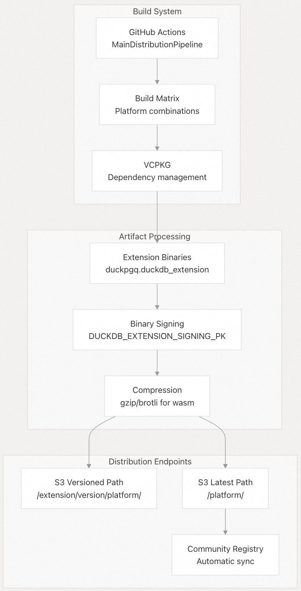
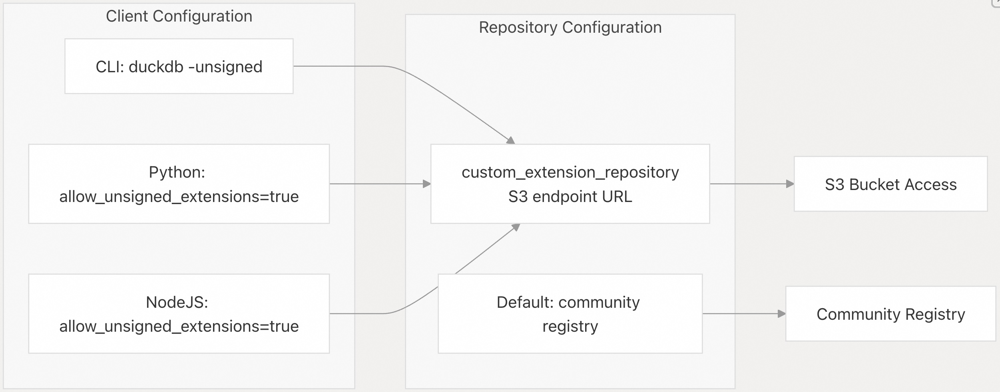

## DuckPGQ 源码学习: 1.1 Installation（安装）  
                          
### 作者                          
digoal                          
                          
### 日期                          
2025-11-06                          
                          
### 标签                          
DuckDB , PGQ , 属性图 , DuckPGQ , 源码学习                          
                          
----                       
                          
## 背景                          
本文介绍在不同平台和 DuckDB 版本上安装 **DuckPGQ extension**（DuckPGQ 扩展）的全面说明。DuckPGQ 通过多个渠道分发，包括 **DuckDB community repository**（DuckDB 社区仓库）、**custom S3 repository**（自定义 S3 仓库）和 **direct download links**（直接下载链接）。  
  
## Installation Methods Overview（安装方法概述）  
  
DuckPGQ 支持三种主要的安装方法，具体取决于您的 DuckDB 版本和要求：  
  
  
  
来源: [`README.md` 10-50](https://github.com/cwida/duckpgq-extension/blob/29748bfe/README.md#L10-L50)  
  
## Community Repository Installation (Recommended)（社区仓库安装 - 推荐）  
  
对于 **DuckDB version 1.0.0** 及更高版本，最简单的安装方法是使用 **community repository**（社区仓库）。此方法不需要 `unsigned` 标志，并提供自动版本兼容性。  
  
### Basic Installation（基本安装）  
  
```sql  
install duckpgq from community;  
load duckpgq;  
```  
  
### Platform Support（平台支持）  
  
**Community repository** 会自动为您的平台和 DuckDB 版本选择合适的 **binary**（二进制文件）。支持的平台包括：  
  
| Platform（平台） | Architectures（架构） |  
| --- | --- |  
| Linux | `amd64`, `amd64_musl`, `arm64` |  
| macOS | `amd64` (Intel), `arm64` (Apple Silicon) |  
| Windows | `amd64`, `amd64_mingw` |  
| WebAssembly | `eh`, `mvp`, `threads` |  
  
来源: [`README.md` 11-16](https://github.com/cwida/duckpgq-extension/blob/29748bfe/README.md#L11-L16) [`README.md` 49-84](https://github.com/cwida/duckpgq-extension/blob/29748bfe/README.md#L49-L84)  
  
## Custom Repository Installation（自定义仓库安装）  
  
对于较旧的 DuckDB 版本或需要特定版本控制时，请使用带有 **S3 endpoint**（S3 端点）的 **custom repository**（自定义仓库）方法。  
  
### CLI Installation（命令行界面安装）  
  
OR  
  
```  
duckdb -unsigned  
```  
  
```  
set custom_extension_repository = 'http://duckpgq.s3.eu-north-1.amazonaws.com';  
force install 'duckpgq';  
load 'duckpgq';  
```  
  
### Python Installation（Python 安装）  
  
  
```  
import duckdb  
  
conn = duckdb.connect(config = {"allow_unsigned_extensions": "true"})  
conn.execute("set custom_extension_repository = 'http://duckpgq.s3.eu-north-1.amazonaws.com';")  
conn.execute("force install 'duckpgq';")  
conn.execute("load 'duckpgq';")  
```  
  
### Other Client Libraries（其他客户端库）  
  
对于 NodeJS：  
  
```  
db = new duckdb.Database(':memory:', {"allow_unsigned_extensions": "true"});  
```  
  
  
来源: [`README.md` 18-40](https://github.com/cwida/duckpgq-extension/blob/29748bfe/README.md#L18-L40) [`README.md` 474-502](https://github.com/cwida/duckpgq-extension/blob/29748bfe/README.md#L474-L502)  
  
## Direct Download Installation（直接下载安装）  
  
直接下载为您提供了对安装的特定版本和平台 **binary**（二进制文件）的最大控制。  
  
### Installation Process（安装流程）  
  
  
  
1.  从 S3 仓库下载特定平台的 `.duckdb_extension` 文件。  
2.  将 **binary** 移动到 DuckDB 的扩展目录（`~/.duckdb/extensions/`）。  
  
### Installation Commands（安装命令）  
  
下载相应的 **binary** 后：  
  
```  
force install 'path/to/duckpgq_extension';  
load 'duckpgq';  
```  
  
**注意 (Note):** DuckDB 必须在 **unsigned mode**（未签名模式）下启动才能进行直接安装。  
  
来源: [`README.md` 42-47](https://github.com/cwida/duckpgq-extension/blob/29748bfe/README.md#L42-L47)  
  
## Distribution Architecture（分发架构）  
  
DuckPGQ 扩展的 **distribution system**（分发系统）使用精密的 **CI/CD pipeline**（持续集成/持续部署流水线），用于在多个平台上构建和部署 **binaries**（二进制文件）。  
  
  
  
### Upload Process Details（上传流程详情）  
  
扩展上传流程处理平台特定的要求：  
  
  * **Standard platforms**（标准平台）：使用 **gzip compression**（gzip 压缩）处理 `.duckdb_extension` 文件  
  * **WebAssembly**：使用 **brotli compression**（brotli 压缩）和 `.wasm` 扩展名  
  * **Signing**（签名）：可选的、使用私钥进行的 **cryptographic signing**（加密签名）  
  * **Metadata**（元数据）：**SHA256 hash calculation**（SHA256 哈希计算）以及为 WASM 注入 **custom section**（自定义部分）  
  
来源: [`.github/workflows/_extension_deploy.yml` 95-121](https://github.com/cwida/duckpgq-extension/blob/29748bfe/.github/workflows/_extension_deploy.yml#L95-L121) [`extension-upload.sh` 16-87](https://github.com/cwida/duckpgq-extension/blob/29748bfe/scripts/extension-upload.sh#L16-L87)  
  
## Version Availability（版本可用性）  
  
DuckPGQ 维护着多个版本，并提供全面的平台支持。可用性通过自动化的 **S3 listing system**（S3 列表系统）进行管理。  
  
### Current Version Matrix（当前版本矩阵）  
  
| Version（版本） | Linux | macOS | Windows | WebAssembly |  
| --- | --- | --- | --- | --- |  
| v1.2.2 | ✓ `amd64`, `amd64_musl`, `arm64` | ✓ `amd64`, `arm64` | ✓ `amd64`, `amd64_mingw` | ✓ `eh`, `mvp`, `threads` |  
| v1.2.1 | ✓ `amd64`, `amd64_musl`, `arm64` | ✓ `amd64`, `arm64` | ✓ `amd64`, `amd64_mingw` | ✓ `eh`, `mvp`, `threads` |  
| v1.2.0 | ✓ `amd64`, `amd64_musl`, `arm64` | ✓ `amd64`, `arm64` | ✓ `amd64`, `amd64_mingw` | ✓ `eh`, `mvp`, `threads` |  
  
### S3 URL Structure（S3 URL 结构）  
  
扩展 **binaries**（二进制文件）遵循一致的 URL 模式：  
  
```  
https://duckpgq.s3.eu-north-1.amazonaws.com/{version}/{platform}/duckpgq.duckdb_extension.gz  
```  
  
对于 **WebAssembly**：  
  
```  
https://duckpgq.s3.eu-north-1.amazonaws.com/{version}/{platform}/duckpgq.duckdb_extension.wasm  
```  
  
来源: [`README.md` 52-325](https://github.com/cwida/duckpgq-extension/blob/29748bfe/README.md#L52-L325) [`s3_availability.py` 22-28](https://github.com/cwida/duckpgq-extension/blob/29748bfe/scripts/s3_availability.py#L22-L28)  
  
## Configuration Requirements（配置要求）  
  
### Unsigned Extensions（未签名扩展）  
  
对于 **custom repository**（自定义仓库）和 **direct download**（直接下载）方法，DuckDB 必须允许 **unsigned extensions**（未签名扩展）：  
  
  
  
### Environment Variables（环境变量）  
  
**Deployment system**（部署系统）使用几个 **environment variables**（环境变量）进行 AWS S3 访问：  
  
  * `AWS_ACCESS_KEY_ID`：S3 访问密钥  
  * `AWS_SECRET_ACCESS_KEY`：S3 秘密密钥  
  * `AWS_DEFAULT_REGION`：S3 区域 (`eu-north-1`)  
  * `BUCKET_NAME`：S3 存储桶名称  
  * `DUCKDB_EXTENSION_SIGNING_PK`：可选的签名密钥  
  
来源: [`_extension_deploy.yml` 104-108](https://github.com/cwida/duckpgq-extension/blob/29748bfe/.github/workflows/_extension_deploy.yml#L104-L108) [`extension-upload.sh` 65-69](https://github.com/cwida/duckpgq-extension/blob/29748bfe/scripts/extension-upload.sh#L65-L69)  
  
## Troubleshooting（故障排除）  
  
### Common Installation Issues（常见安装问题）  
  
1.  **Unsigned Extension Error**（未签名扩展错误）：确保 DuckDB 使用 `allow_unsigned_extensions=true` 启动。  
2.  **Version Compatibility**（版本兼容性）：验证 DuckDB 版本与扩展版本的兼容性。  
3.  **Architecture Mismatch**（架构不匹配）：确认您下载了正确的平台 **binary**（二进制文件）。  
4.  **Network Access**（网络访问）：验证自定义仓库安装所需的 S3 **endpoints**（端点）访问权限。  
  
### Verification（验证）  
  
成功安装后，验证扩展是否已加载：  
  
```sql  
SELECT * FROM duckdb_extensions() WHERE extension_name = 'duckpgq';  
```  
  
来源: [`README.md` 462-463](https://github.com/cwida/duckpgq-extension/blob/29748bfe/README.md#L462-L463)  
      
#### [PolarDB 学习图谱](https://www.aliyun.com/database/openpolardb/activity "8642f60e04ed0c814bf9cb9677976bd4")
  
  
#### [PostgreSQL 解决方案集合](../201706/20170601_02.md "40cff096e9ed7122c512b35d8561d9c8")
  
  
#### [德哥 / digoal's Github - 公益是一辈子的事.](https://github.com/digoal/blog/blob/master/README.md "22709685feb7cab07d30f30387f0a9ae")
  
  
#### [About 德哥](https://github.com/digoal/blog/blob/master/me/readme.md "a37735981e7704886ffd590565582dd0")
  
  

  
