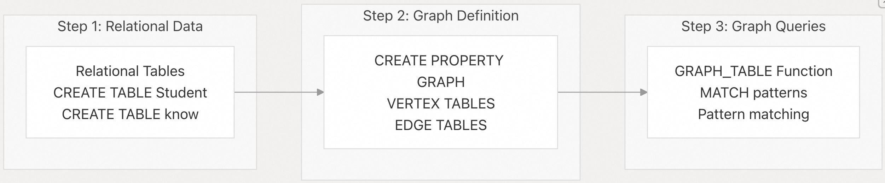
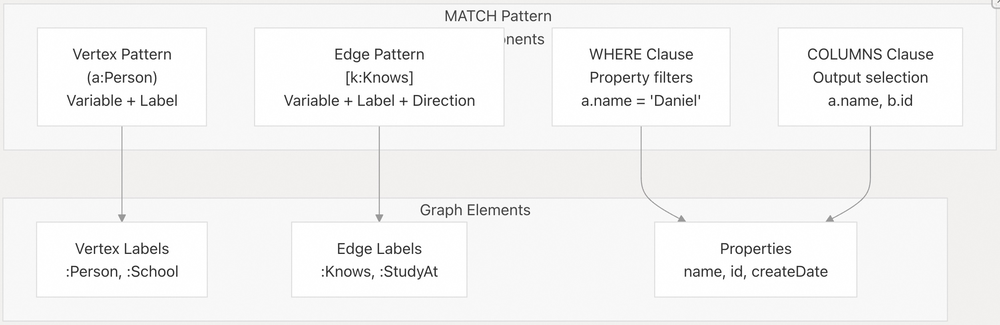

## DuckPGQ 源码学习: 1.2 快速入门 (`Quick Start`)  
                            
### 作者                            
digoal                            
                            
### 日期                            
2025-11-06                            
                            
### 标签                            
DuckDB , PGQ , 属性图 , DuckPGQ , 源码学习                            
                            
----       
                            
## 背景                            
本文介绍在 **DuckPGQ 扩展**（`DuckPGQ extension`）中创建您的第一个**属性图**（`Property Graph`）并运行基本查询的分步说明。使用简单的示例，涵盖了从**关系数据**（`Relational Data`）到图查询的基本工作流程。  
  
## 先决条件 (`Prerequisites`)  
  
在开始之前，请确保：  
  
  * **DuckDB** 已安装并运行  
  * **DuckPGQ 扩展** 已加载（`INSTALL duckpgq FROM community; LOAD duckpgq;`）  
  * 您对 **SQL** 有基本的了解  
  
## 基本工作流程 (`Basic Workflow`)  
  
**DuckPGQ** 的工作流程遵循三个主要步骤：准备关系数据、定义属性图、以及使用**模式匹配**（`Pattern Matching`）查询图。  
  
  
  
来源: [`test/sql/create_pg/create_property_graph.test` 1-216](https://github.com/cwida/duckpgq-extension/blob/29748bfe/test/sql/create_pg/create_property_graph.test#L1-L216) [`test/sql/pattern_matching/basic_match.test` 1-351](https://github.com/cwida/duckpgq-extension/blob/29748bfe/test/sql/pattern_matching/basic_match.test#L1-L351)  
  
## 第 1 步：创建关系表 (`Step 1: Create Relational Tables`)  
  
首先创建标准的 **DuckDB 表**，它们将作为您的属性图的基础。您至少需要一个用于**顶点**（`Vertices`）的表和一个用于**关系**（`Relationships`）的表。  
  
```  
-- Create vertex table for people  
CREATE TABLE Student(id BIGINT, name VARCHAR);  
  
-- Create edge table for relationships  
CREATE TABLE know(src BIGINT, dst BIGINT, createDate BIGINT);  
  
-- Insert sample data  
INSERT INTO Student VALUES (0, 'Daniel'), (1, 'Tavneet'), (2, 'Gabor'), (3, 'Peter');  
INSERT INTO know VALUES (0,1, 10), (0,2, 11), (0,3, 12), (1,2, 14), (1,3, 15), (2,3, 16);  
```  
  
来源: [`test/sql/create_pg/create_property_graph.test` 17-38](https://github.com/cwida/duckpgq-extension/blob/29748bfe/test/sql/create_pg/create_property_graph.test#L17-L38) [`test/sql/pattern_matching/basic_match.test` 11-14](https://github.com/cwida/duckpgq-extension/blob/29748bfe/test/sql/pattern_matching/basic_match.test#L11-L14)  
  
## 第 2 步：创建属性图 (`Step 2: Create Property Graph`)  
  
使用 `CREATE PROPERTY GRAPH` 语句，定义一个属性图，将您的关系表映射到图概念。  
  
```  
CREATE PROPERTY GRAPH pg  
VERTEX TABLES (  
    Student PROPERTIES (id, name) LABEL Person  
)  
EDGE TABLES (  
    know SOURCE KEY (src) REFERENCES Student (id)  
         DESTINATION KEY (dst) REFERENCES Student (id)  
         PROPERTIES (createDate) LABEL Knows  
);  
```  
  
**关键组成部分（Key Components）：**  
  
  * `VERTEX TABLES` (**顶点表**): 将表列映射到顶点属性并分配**标签**（`Labels`）  
  * `EDGE TABLES` (**边表**): 使用源/目标引用定义关系  
  * `LABEL` (**标签**): 为查询中使用的顶点和边创建语义类型  
  
来源: [`test/sql/create_pg/create_property_graph.test` 42-51](https://github.com/cwida/duckpgq-extension/blob/29748bfe/test/sql/create_pg/create_property_graph.test#L42-L51) [`test/sql/pattern_matching/basic_match.test` 23-35](https://github.com/cwida/duckpgq-extension/blob/29748bfe/test/sql/pattern_matching/basic_match.test#L23-L35)  
  
## 第 3 步：查询图 (`Step 3: Query the Graph`)  
  
使用 `GRAPH_TABLE` 函数和 `MATCH` 模式（`MATCH patterns`），通过图遍历语法查询您的属性图。  
  
### 基本模式匹配 (`Basic Pattern Matching`)  
  
```  
-- Find all people that Daniel knows  
SELECT study.a_name, study.b_name  
FROM GRAPH_TABLE (pg  
    MATCH (a:Person)-[k:Knows]->(b:Person)  
    WHERE a.name = 'Daniel'  
    COLUMNS (a.name as a_name, b.name as b_name)  
) study;  
```  
  
### 双向关系 (`Bidirectional Relationships`)  
  
```  
-- Find all people connected to Peter (incoming and outgoing)  
SELECT study.a_name, study.b_name  
FROM GRAPH_TABLE (pg  
    MATCH (a:Person)-[k:Knows]-(b:Person)  
    WHERE a.name = 'Peter'  
    COLUMNS (a.name as a_name, b.name as b_name)  
) study  
ORDER BY a_name, b_name;  
```  
  
### 多跳模式 (`Multi-hop Patterns`)  
  
```  
-- Find triangular relationships (A knows B, B knows C, C knows A)  
SELECT study.a_name, study.b_name, study.c_name  
FROM GRAPH_TABLE (pg  
    MATCH (a:Person)-[k:Knows]->(b:Person)-[k2:Knows]->(c:Person)-[k3:Knows]->(a:Person)  
    COLUMNS (a.name as a_name, b.name as b_name, c.name as c_name)  
) study  
ORDER BY study.a_name, study.b_name, study.c_name;  
```  
  
来源: [`test/sql/pattern_matching/basic_match.test` 86-181](https://github.com/cwida/duckpgq-extension/blob/29748bfe/test/sql/pattern_matching/basic_match.test#L86-L181)  
  
## 模式匹配语法 (`Pattern Matching Syntax`)  
  
核心查询语法使用以下组件：  
  
  
  
来源: [`test/sql/pattern_matching/basic_match.test` 37-98](https://github.com/cwida/duckpgq-extension/blob/29748bfe/test/sql/pattern_matching/basic_match.test#L37-L98) [`test/sql/create_pg/create_property_graph.test` 53-69](https://github.com/cwida/duckpgq-extension/blob/29748bfe/test/sql/create_pg/create_property_graph.test#L53-L69)  
  
## 使用多种顶点类型 (`Working with Multiple Vertex Types`)  
  
您可以在单个属性图中定义多种顶点和边类型：  
  
```  
-- Create additional table  
CREATE TABLE School(name VARCHAR, Id BIGINT, Kind VARCHAR);  
CREATE TABLE StudyAt(personId BIGINT, schoolId BIGINT);  
  
-- Extended property graph  
CREATE PROPERTY GRAPH pg_extended  
VERTEX TABLES (  
    Student PROPERTIES (id, name) LABEL Person,  
    School LABEL School  
)  
EDGE TABLES (  
    know SOURCE KEY (src) REFERENCES Student (id)  
         DESTINATION KEY (dst) REFERENCES Student (id)  
         LABEL Knows,  
    studyAt SOURCE KEY (personId) REFERENCES Student (id)  
            DESTINATION KEY (SchoolId) REFERENCES School (id)  
            LABEL StudyAt  
);  
```  
  
来源: [`test/sql/pattern_matching/basic_match.test` 17-35](https://github.com/cwida/duckpgq-extension/blob/29748bfe/test/sql/pattern_matching/basic_match.test#L17-L35)  
  
## 属性访问模式 (`Property Access Patterns`)  
  
使用**点符号**（`dot notation`）访问顶点和边属性：  
  
```  
-- Access specific properties  
SELECT study.name, study.school  
FROM GRAPH_TABLE (pg_extended  
    MATCH (a:Person)-[s:StudyAt]->(b:School)  
    WHERE a.name = 'Daniel'  
    COLUMNS (a.name as name, b.name as school)  
) study;  
  
-- Access all properties with wildcard  
SELECT study.id, study.name  
FROM GRAPH_TABLE (pg  
    MATCH (a:Person)  
    COLUMNS (a.*)  
) study;  
```  
  
来源: [`test/sql/pattern_matching/basic_match.test` 37-46](https://github.com/cwida/duckpgq-extension/blob/29748bfe/test/sql/pattern_matching/basic_match.test#L37-L46) [`test/sql/pattern_matching/basic_match.test` 257-297](https://github.com/cwida/duckpgq-extension/blob/29748bfe/test/sql/pattern_matching/basic_match.test#L257-L297)  
  
## 下一步 (`Next Steps`)  
  
一旦您掌握了基本的模式匹配, 接下来就可以：  
  
1.  **探索高级查询（Explore Advanced Queries）**: 学习复杂的模式匹配  
2.  **添加图分析（Add Graph Analytics）**: 发现内置算法  
3.  **模式管理（Schema Management）**: 学习修改图  
4.  **路径查找（Path Finding）**: 探索最短路径  
  
您通过基本顶点-边模式构建的基础可以扩展到复杂的**图分析**（`Graph Analytics`）和复杂的**遍历**（`Traversals`）。  
  
来源: [`test/sql/pattern_matching/basic_match.test` 1-351](https://github.com/cwida/duckpgq-extension/blob/29748bfe/test/sql/pattern_matching/basic_match.test#L1-L351) [`test/sql/create_pg/create_property_graph.test` 1-216](https://github.com/cwida/duckpgq-extension/blob/29748bfe/test/sql/create_pg/create_property_graph.test#L1-L216) [`test/sql/create_pg/all_properties.test` 1-127](https://github.com/cwida/duckpgq-extension/blob/29748bfe/test/sql/create_pg/all_properties.test#L1-L127)  
      
#### [PolarDB 学习图谱](https://www.aliyun.com/database/openpolardb/activity "8642f60e04ed0c814bf9cb9677976bd4")
  
  
#### [PostgreSQL 解决方案集合](../201706/20170601_02.md "40cff096e9ed7122c512b35d8561d9c8")
  
  
#### [德哥 / digoal's Github - 公益是一辈子的事.](https://github.com/digoal/blog/blob/master/README.md "22709685feb7cab07d30f30387f0a9ae")
  
  
#### [About 德哥](https://github.com/digoal/blog/blob/master/me/readme.md "a37735981e7704886ffd590565582dd0")
  
  

  
