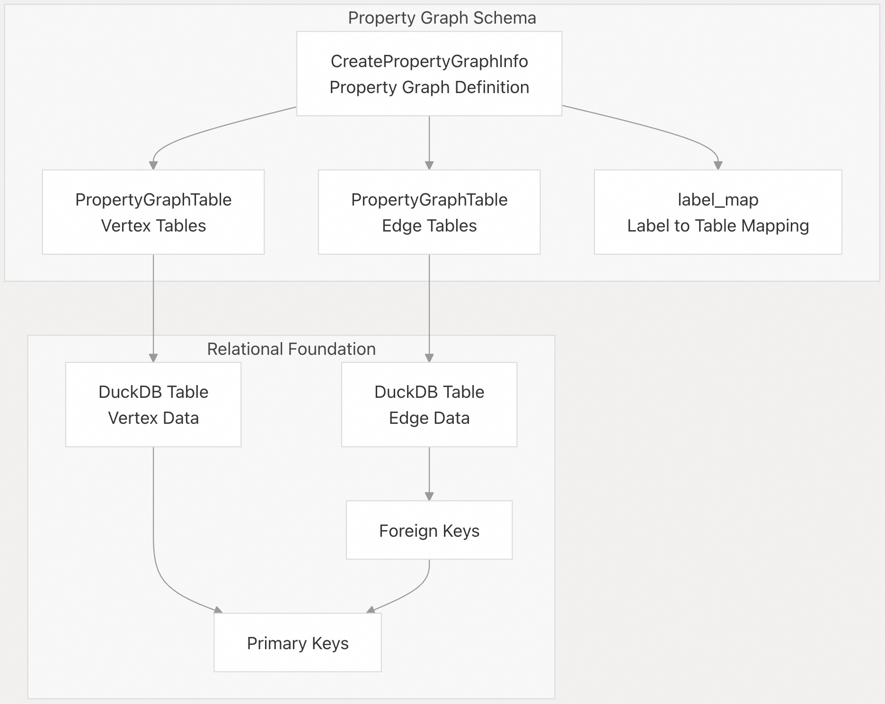
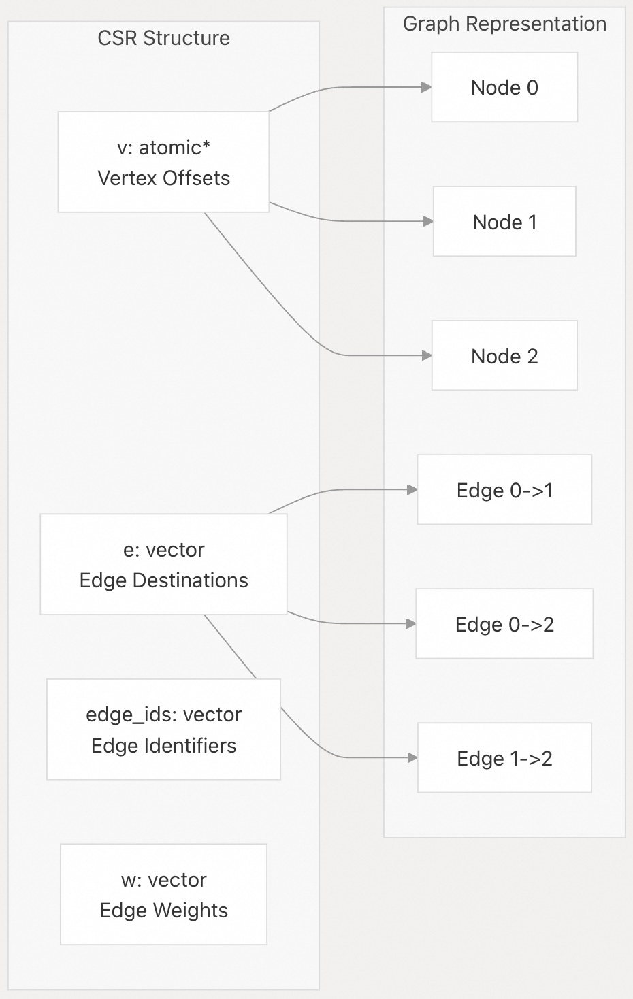
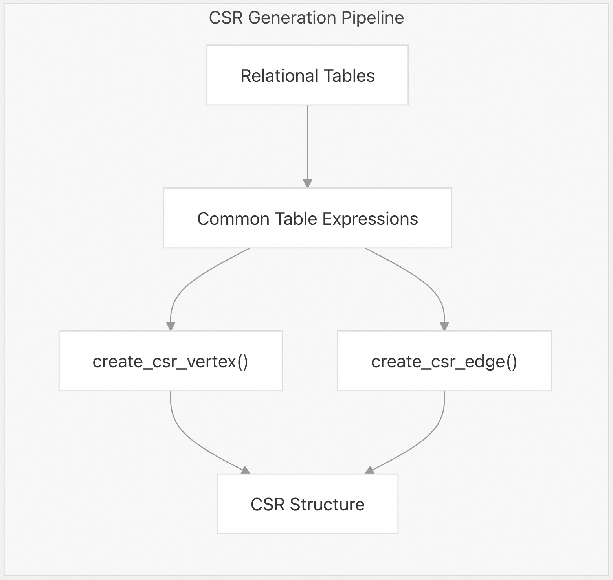
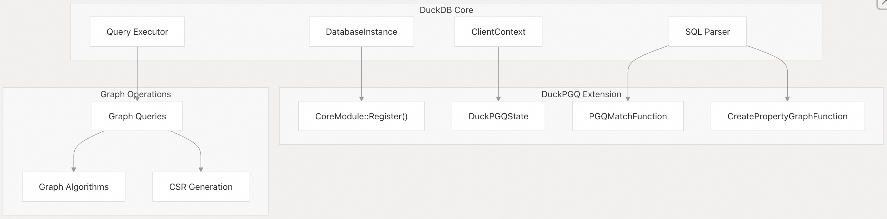
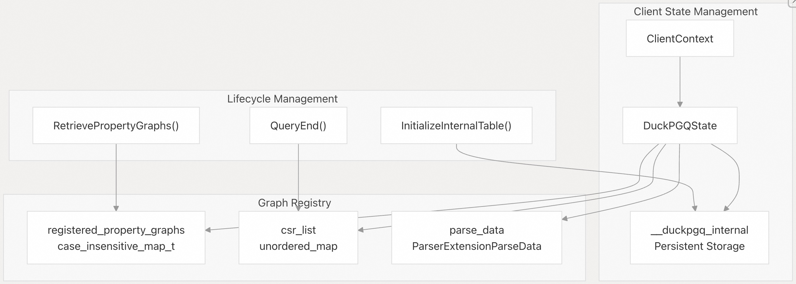
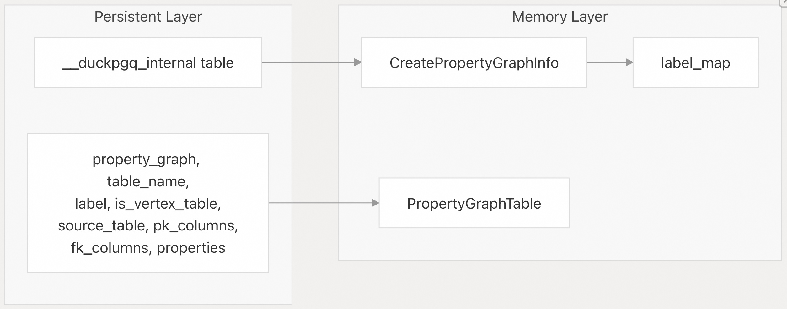

## DuckPGQ 源码学习: 2 核心概念 (Core Concepts)  
                              
### 作者                              
digoal                              
                              
### 日期                              
2025-11-06                              
                              
### 标签                              
DuckDB , PGQ , 属性图 , DuckPGQ , 源码学习                              
                              
----         
                              
## 背景                              
本文介绍 **DuckPGQ** 的架构和实现背后的基本概念。涵盖 **属性图数据模型** (property graph data model)、**内部数据结构** (internal data structures)、**扩展架构** (extension architecture) 和**状态管理系统** (state management systems)，这些共同使得在 **DuckDB** 中实现图查询能力成为可能。  
  
## 属性图数据模型 (Property Graph Data Model)  
  
**DuckPGQ** 将**属性图模型** (property graph model) 作为**关系表** (relational tables) 之上的一个抽象层来实现。属性图由**顶点** (vertices，即**节点** (nodes)) 和**边** (edges) 组成，它们可以拥有**标签** (labels) 和**属性** (properties)，通过显式的**模式映射** (schema mapping) 从现有的 **DuckDB** 表构建而成。  
  
### 属性图组件 (Property Graph Components)  
  
  
  
**`CreatePropertyGraphInfo`** 类代表一个完整的**属性图定义** (property graph definition)，包含顶点表 (vertex tables) 和边表 (edge tables) 的集合及其**标签映射** (label mappings)。每个 **`PropertyGraphTable`** 封装了将**关系数据** (relational data) 映射到图元素 (graph elements) 所需的**元数据** (metadata)。  
  
**来源:** [`src/core/functions/table/create_property_graph.cpp` 16-290](https://github.com/cwida/duckpgq-extension/blob/29748bfe/src/core/functions/table/create_property_graph.cpp#L16-L290) [`src/include/duckpgq/core/functions/table/create_property_graph.hpp` 19-85](https://github.com/cwida/duckpgq-extension/blob/29748bfe/src/include/duckpgq/core/functions/table/create_property_graph.hpp#L19-L85)  
  
### 模式验证与约束 (Schema Validation and Constraints)  
  
属性图创建涉及广泛的**验证** (validation)，以确保顶点表和边表之间的**引用完整性** (referential integrity)。系统会验证**主键-外键** (primary key-foreign key) 关系、**列存在性** (column existence) 和**标签唯一性** (label uniqueness)。  
  
| 验证类型 (Validation Type) | 目的 (Purpose) | 实现 (Implementation) |  
| :--- | :--- | :--- |  
| 列验证 (Column Validation) | 确保指定的列存在 | `CheckPropertyGraphTableColumns` |  
| 标签验证 (Label Validation) | 验证**判别列** (discriminator columns) | `CheckPropertyGraphTableLabels` |  
| 键验证 (Key Validation) | 检查 PK-FK 关系 | `ValidateKeys` |  
| 表注册 (Table Registration) | 确保引用的表存在 | `ValidateVertexTableRegistration` |  
  
**来源:** [`src/core/functions/table/create_property_graph.cpp` 35-70](https://github.com/cwida/duckpgq-extension/blob/29748bfe/src/core/functions/table/create_property_graph.cpp#L35-L70) [`src/core/functions/table/create_property_graph.cpp` 72-128](https://github.com/cwida/duckpgq-extension/blob/29748bfe/src/core/functions/table/create_property_graph.cpp#L72-L128)  
  
## CSR 数据结构 (CSR Data Structures)  
  
**DuckPGQ** 使用**压缩稀疏行** (**C**ompressed **S**parse **R**ow, **CSR**) 格式进行高效的图表示 (graph representation) 和**遍历** (traversal)。CSR 结构在查询执行期间动态创建，并进行**缓存** (cached) 以提高性能。  
  
### CSR 架构 (CSR Architecture)  
  
  
  
**`CSR`** 类为**图算法** (graph algorithms) 和**路径查找** (path finding) 操作提供了核心数据结构。**顶点偏移量** (Vertex offsets, `v`) 指向**边数组** (edge array, `e`)，从而实现**常数时间** (constant-time) 的邻居查找 (neighbor lookups)。  
  
**来源:** [`src/core/utils/compressed_sparse_row.cpp` 15-58](https://github.com/cwida/duckpgq-extension/blob/29748bfe/src/core/utils/compressed_sparse_row.cpp#L15-L58) [`src/include/duckpgq/core/utils/compressed_sparse_row.hpp` 27-47](https://github.com/cwida/duckpgq-extension/blob/29748bfe/src/include/duckpgq/core/utils/compressed_sparse_row.hpp#L27-L47)  
  
### CSR 生成过程 (CSR Generation Process)  
  
**CSR** 结构是通过复杂的 **SQL 转换** (SQL transformations) 生成的，这些转换会为顶点和边数据创建**公共表表达式** (**C**ommon **T**able **E**xpressions, **CTEs**)。**有向图** (directed graphs) 和**无向图** (undirected graphs) 的生成过程有所不同。  
  
  
  
像 **`CreateDirectedCSRCTE`** 和 **`CreateUndirectedCSRCTE`** 这样的函数会生成从属性图表填充 **CSR** 结构所需的 **SQL**。  
  
**来源:** [`src/core/utils/compressed_sparse_row.cpp` 418-561](https://github.com/cwida/duckpgq-extension/blob/29748bfe/src/core/utils/compressed_sparse_row.cpp#L418-L561) [`src/core/utils/compressed_sparse_row.cpp` 220-293](https://github.com/cwida/duckpgq-extension/blob/29748bfe/src/core/utils/compressed_sparse_row.cpp#L220-L293)  
  
## 扩展架构 (Extension Architecture)  
  
**DuckPGQ** 通过**表函数** (table functions)、**解析器扩展** (parser extensions) 和**状态管理** (state management) 深度集成到 **DuckDB** 的架构中。该扩展注册了自定义函数并维护**每个客户端的图状态** (per-client graph state)。  
  
### 核心扩展组件 (Core Extension Components)  
  
  
  
扩展的**入口点** (entry point) 是 **`DuckpgqExtension::Load()`**，它向数据库实例注册了所有与图相关的功能。  
  
**来源:** [`src/duckpgq_extension.cpp` 11-24](https://github.com/cwida/duckpgq-extension/blob/29748bfe/src/duckpgq_extension.cpp#L11-L24) [`src/duckpgq_extension.cpp` 26-30](https://github.com/cwida/duckpgq-extension/blob/29748bfe/src/duckpgq_extension.cpp#L26-L30)  
  
### 表函数集成 (Table Function Integration)  
  
**DuckPGQ** 实现了多个与 **DuckDB** 的 **SQL 处理管线** (SQL processing pipeline) 集成的表函数:  
  
| 函数 (Function) | 目的 (Purpose) | 实现类 (Implementation Class) |  
| :--- | :--- | :--- |  
| `duckpgq_match` | **模式匹配查询** (Pattern matching queries) | `PGQMatchFunction` |  
| `create_property_graph` | **图模式定义** (Graph schema definition) | `CreatePropertyGraphFunction` |  
| `pgq_scan` | **内部数据访问** (Internal data access) | 各种扫描函数 (Various scan functions) |  
  
**`PGQMatchFunction::MatchBindReplace`** 方法通过生成复杂的**连接** (joins) 和**子查询** (subqueries)，将图查询转换为标准的 **SQL**。  
  
**来源:** [`src/include/duckpgq/core/functions/table/match.hpp` 27-33](https://github.com/cwida/duckpgq-extension/blob/29748bfe/src/include/duckpgq/core/functions/table/match.hpp#L27-L33) [`src/core/functions/table/match.cpp` 760-1218](https://github.com/cwida/duckpgq-extension/blob/29748bfe/src/core/functions/table/match.cpp#L760-L1218)  
  
## 状态管理 (State Management)  
  
**DuckPGQ** 通过 **`DuckPGQState`** 类维护**图状态** (graph state)，该类附加到每个**客户端连接** (client connection) 上。此状态包括已注册的属性图、**CSR 缓存**和**解析上下文** (parsing context)。  
  
### 状态架构 (State Architecture)  
  
  
  
**`DuckPGQState`** 提供对图元数据 (graph metadata) 和**运行时结构** (runtime structures) 的集中访问，并在查询完成后自动进行**清理** (cleanup)。  
  
**来源:** [`src/include/duckpgq_state.hpp` 10-41](https://github.com/cwida/duckpgq-extension/blob/29748bfe/src/include/duckpgq_state.hpp#L10-L41) [`src/duckpgq_state.cpp` 5-32](https://github.com/cwida/duckpgq-extension/blob/29748bfe/src/duckpgq_state.cpp#L5-L32)  
  
### 持久化元数据存储 (Persistent Metadata Storage)  
  
属性图定义**持久化** (persisted) 在 **`__duckpgq_internal`** 表中，使图能够在数据库重启后继续存在。状态管理系统会自动从这个**持久化存储** (persistent storage) 中重建**内存中的表示** (in-memory representations)。  
  
  
  
**`RetrievePropertyGraphs`** 方法在**连接初始化** (connection initialization) 期间，从持久化存储中重建**内存中的图注册表** (in-memory graph registry)。  
  
**来源:** [`src/duckpgq_state.cpp` 34-173](https://github.com/cwida/duckpgq-extension/blob/29748bfe/src/duckpgq_state.cpp#L34-L173) [`src/duckpgq_state.cpp` 5-32](https://github.com/cwida/duckpgq-extension/blob/29748bfe/src/duckpgq_state.cpp#L5-L32)  
    
#### [PolarDB 学习图谱](https://www.aliyun.com/database/openpolardb/activity "8642f60e04ed0c814bf9cb9677976bd4")
  
  
#### [PostgreSQL 解决方案集合](../201706/20170601_02.md "40cff096e9ed7122c512b35d8561d9c8")
  
  
#### [德哥 / digoal's Github - 公益是一辈子的事.](https://github.com/digoal/blog/blob/master/README.md "22709685feb7cab07d30f30387f0a9ae")
  
  
#### [About 德哥](https://github.com/digoal/blog/blob/master/me/readme.md "a37735981e7704886ffd590565582dd0")
  
  

  
