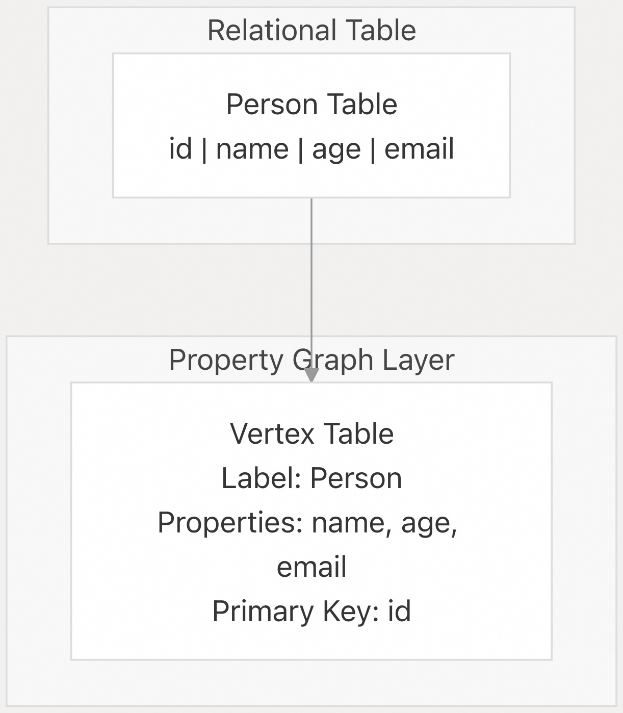
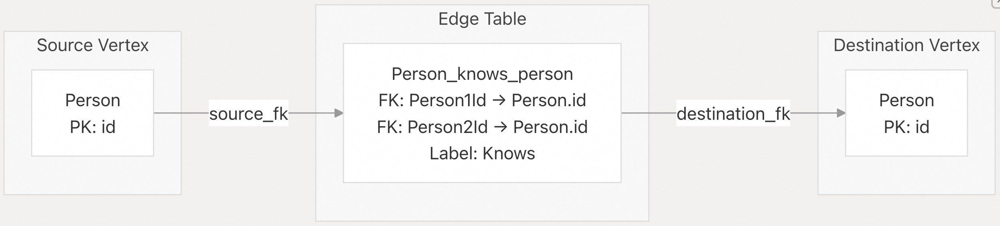
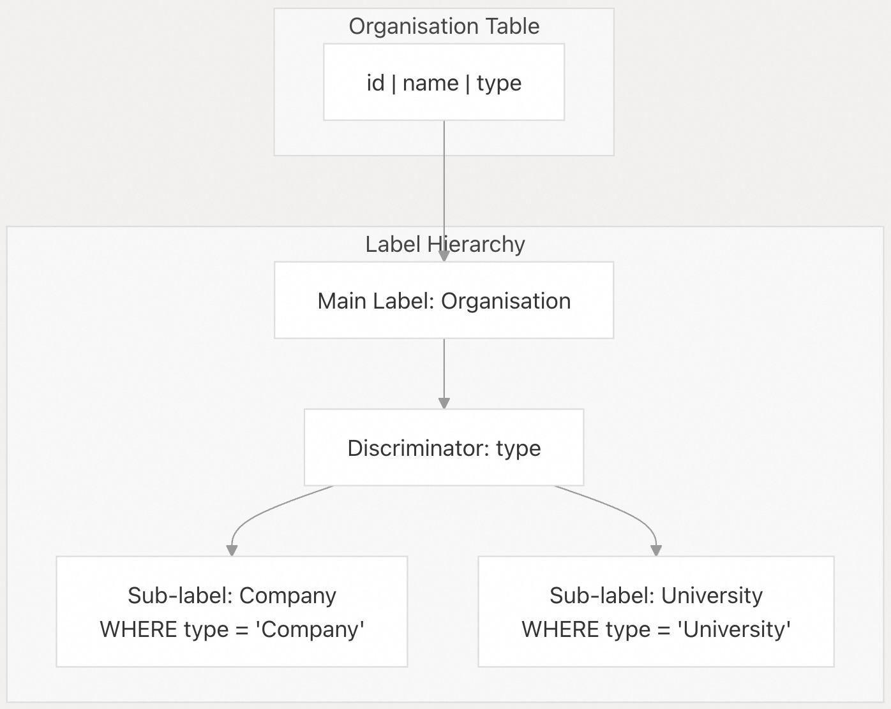
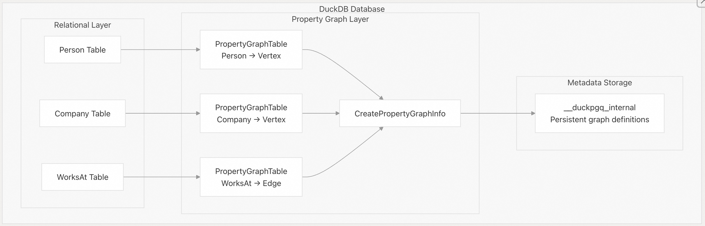
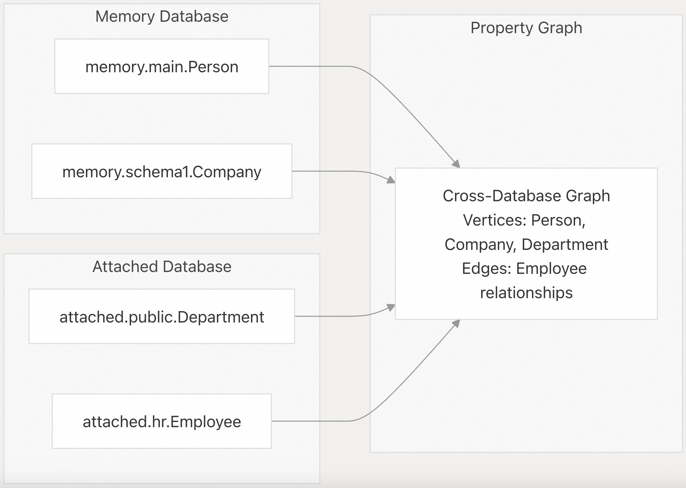
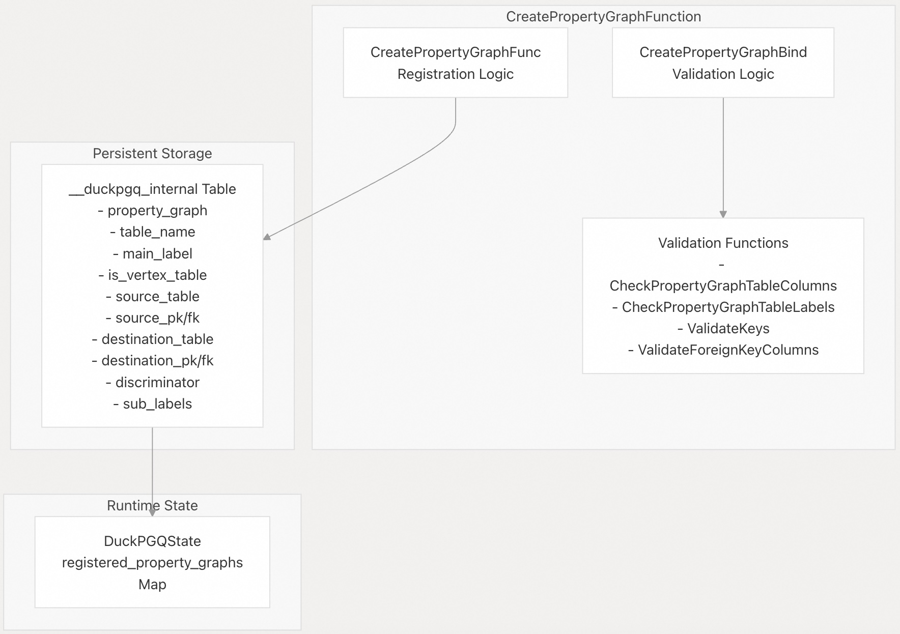

## DuckPGQ 源码学习: 2.1 属性图模型 (Property Graph Model)  
                                
### 作者                                
digoal                                
                                
### 日期                                
2025-11-06                                
                                
### 标签                                
DuckDB , PGQ , 属性图 , DuckPGQ , 源码学习                                
                                
----           
                                
## 背景                                
本文档解释了 **DuckPGQ** 实现的**属性图数据模型**（Property Graph Data Model），包括如何在现有**关系表**（Relational Tables）上定义**属性图**（Property Graphs），以及**顶点表**（Vertex Tables）、**边表**（Edge Tables）、**标签**（Labels）、**属性**（Properties）和内部**元数据表示**（Metadata Representation）的结构。  
  
-----  
  
## 概述 (Overview)  
  
**DuckPGQ** 实现了一种**属性图模型**（Property Graph Model），将现有的**关系表**（Relational Tables）映射到图结构中。与原生图数据库不同，**DuckPGQ** 在标准 **DuckDB** 表之上创建了一个**逻辑图层**（Logical Graph Layer），允许用户在不进行数据复制或迁移的情况下，对**关系数据**执行**图查询**（Graph Queries）。  
  
**属性图模型**由以下部分组成：  
  
  * **顶点表**（Vertex Tables）：表示图节点的**关系表**。  
  * **边表**（Edge Tables）：通过**外键约束**（Foreign Key Constraints）表示图关系的**关系表**。  
  * **标签**（Labels）：顶点和边的**语义标识符**（Semantic Identifiers）。  
  * **属性**（Properties）：来自底层关系表的列数据。  
  * **模式支持**（Schema Support）：用于**跨数据库图**（Cross-Database Graphs）的完整**目录**（Catalog）和**模式限定**（Schema Qualification）。  
  
-----  
  
## 核心组件 (Core Components)  
  
### 顶点表 (Vertex Tables)  
  
**顶点表**（Vertex Tables）代表**属性图**中的节点。每个**顶点表**都由一个**关系表**支撑，其中每一行对应一个图顶点。  
  
  
  
**顶点表映射**  
  
| 组件（Component） | 描述（Description） | 代码引用（Code Reference） |  
| :--- | :--- | :--- |  
| **表名**（Table Name） | 源关系表 | `PropertyGraphTable::table_name` |  
| **标签**（Label） | 顶点类型的语义标识符 | `PropertyGraphTable::main_label` |  
| **属性**（Properties） | 公开为顶点属性的列 | `PropertyGraphTable::column_names` |  
| **判别器**（Discriminator） | 用于子标签分类的列 | `PropertyGraphTable::discriminator` |  
| **子标签**（Sub-labels） | 类型变体（例如 Company、University） | `PropertyGraphTable::sub_labels` |  
  
来源: [`src/core/functions/table/create_property_graph.cpp` 16-70](https://github.com/cwida/duckpgq-extension/blob/29748bfe/src/core/functions/table/create_property_graph.cpp#L16-L70) [`test/sql/create_pg/describe_pg.test` 11-19](https://github.com/cwida/duckpgq-extension/blob/29748bfe/test/sql/create_pg/describe_pg.test#L11-L19)  
  
### 边表 (Edge Tables)  
  
**边表**（Edge Tables）表示顶点之间的关系。每个**边表**通过**外键关系**连接两个**顶点表**。  
  
  
  
**边表结构**  
  
| 组件（Component） | 描述（Description） | 验证函数（Validation Function） |  
| :--- | :--- | :--- |  
| **源引用**（Source Reference） | 关系起点处的顶点表 | `ValidateVertexTableRegistration` |  
| **源键**（Source Keys） | 源的**主键/外键**对（Primary/Foreign Key Pair） | `ValidateKeys`、`ValidatePrimaryKeyInTable` |  
| **目标引用**（Destination Reference） | 关系目标处的顶点表 | `ValidateVertexTableRegistration` |  
| **目标键**（Destination Keys） | 目标的主键/外键对 | `ValidateKeys`、`ValidatePrimaryKeyInTable` |  
| **标签**（Label） | 关系类型的语义标识符 | `PropertyGraphTable::main_label` |  
  
来源: [`src/core/functions/table/create_property_graph.cpp` 72-128](https://github.com/cwida/duckpgq-extension/blob/29748bfe/src/core/functions/table/create_property_graph.cpp#L72-L128) [`src/core/functions/table/create_property_graph.cpp` 142-168](https://github.com/cwida/duckpgq-extension/blob/29748bfe/src/core/functions/table/create_property_graph.cpp#L142-L168)  
  
### 标签和子标签 (Labels and Sub-labels)  
  
**标签**（Labels）为**顶点**（Vertices）和**边**（Edges）提供**语义**（Semantic）意义。**DuckPGQ** 通过**判别器**（Discriminator）列和**子标签**（Sub-labels）支持**分层标签**（Hierarchical Labeling）。  
  
  
  
**判别器机制**（Discriminator Mechanism）支持查询特定的**顶点类型**：  
  
  * `MATCH (c:Company)` - 仅匹配 `type = 'Company'` 的 **Organisation** 顶点  
  * `MATCH (u:University)` - 仅匹配 `type = 'University'` 的 **Organisation** 顶点  
  * `MATCH (o:Organisation)` - 匹配所有 **Organisation** 顶点，无论其类型如何  
  
来源: [`src/core/functions/table/create_property_graph.cpp` 16-33](https://github.com/cwida/duckpgq-extension/blob/29748bfe/src/core/functions/table/create_property_graph.cpp#L16-L33) [`test/sql/label_optional.test` 48-80](https://github.com/cwida/duckpgq-extension/blob/29748bfe/test/sql/label_optional.test#L48-L80)  
  
-----  
  
## 关系映射架构 (Relational Mapping Architecture)  
  
**DuckPGQ** 的**属性图模型**（Property Graph Model）在现有**关系数据**（Relational Data）之上创建了一个**逻辑映射**（Logical Mapping），而无需物理数据移动。  
  
  
  
**关键映射类**  
  
| 类（Class） | 用途（Purpose） | 文件位置（File Location） |  
| :--- | :--- | :--- |  
| `CreatePropertyGraphInfo` | 完整的图定义 | 在绑定函数中引用 |  
| `PropertyGraphTable` | 单个表映射 | 在整个验证过程中使用 |  
| `CreatePropertyGraphBindData` | 绑定上下文 | [`src/include/duckpgq/core/functions/table/create_property_graph.hpp` 28-33](https://github.com/cwida/duckpgq-extension/blob/29748bfe/src/include/duckpgq/core/functions/table/create_property_graph.hpp#L28-L33) |  
  
来源: [`src/core/functions/table/create_property_graph.cpp` 170-290](https://github.com/cwida/duckpgq-extension/blob/29748bfe/src/core/functions/table/create_property_graph.cpp#L170-L290) [`src/core/functions/table/create_property_graph.cpp` 298-451](https://github.com/cwida/duckpgq-extension/blob/29748bfe/src/core/functions/table/create_property_graph.cpp#L298-L451)  
  
-----  
  
## 模式和跨数据库支持 (Schema and Cross-Database Support)  
  
**DuckPGQ** 通过**目录**（Catalog）和**模式**（Schema）引用支持完整的**模式限定**（Schema Qualification）和**跨数据库属性图**（Cross-Database Property Graphs）。  
  
  
  
**模式解析**  
  
**属性图模型**使用以下方式解析表引用：  
  
  * `catalog_name`：数据库目录（Catalog，例如 "memory"、"attached"）  
  * `schema_name`：目录中的模式（Schema，例如 "main"、"public"）  
  * `table_name`：模式中的表  
  
来源: [`test/sql/create_pg/attach_pg.test` 46-51](https://github.com/cwida/duckpgq-extension/blob/29748bfe/test/sql/create_pg/attach_pg.test#L46-L51) [`test/sql/211_using_other_schemas.test` 120-129](https://github.com/cwida/duckpgq-extension/blob/29748bfe/test/sql/211_using_other_schemas.test#L120-L129)  
  
-----  
  
## 内部元数据表示 (Internal Metadata Representation)  
  
**属性图**（Property Graph）定义持久化在 `__duckpgq_internal` **系统表**（System Table）中，从而实现图在跨会话间的持久性。  
  
  
  
**元数据表**（Metadata Table）存储了所有带有完整**模式信息**（Schema Information）、**外键映射**（Foreign Key Mappings）和**标签层次结构**（Label Hierarchies）的图定义。这使得图能够在**数据库会话**（Database Sessions）和**连接上下文**（Connection Contexts）之间重新创建。  
  
来源: [`src/core/functions/table/create_property_graph.cpp` 304-451](https://github.com/cwida/duckpgq-extension/blob/29748bfe/src/core/functions/table/create_property_graph.cpp#L304-L451) [`src/core/functions/table/create_property_graph.cpp` 456-459](https://github.com/cwida/duckpgq-extension/blob/29748bfe/src/core/functions/table/create_property_graph.cpp#L456-L459)  
  
-----  
  
## 属性列管理 (Property Column Management)  
  
**属性图模型**中的**属性**（Properties）对应于底层**关系表**（Relational Tables）中的列。**DuckPGQ** 提供了灵活的**列选择机制**（Column Selection Mechanisms）。  
  
| 列选择（Column Selection） | 语法（Syntax） | 行为（Behavior） |  
| :--- | :--- | :--- |  
| **所有列**（All Columns） | 没有 **PROPERTIES** 子句 | 包含所有表列 |  
| **显式列**（Explicit Columns） | `PROPERTIES (col1, col2)` | 仅包含指定的列 |  
| **排除所有列**（All Except） | `PROPERTIES ALL EXCEPT (col1)` | 包含除指定列之外的所有列 |  
| **无列**（No Columns） | `PROPERTIES ()` | 不包含任何列（仅包含标识符） |  
  
**列验证逻辑**（Column Validation Logic）确保指定的列存在于底层表中，并处理用于查询处理的**列别名**（Column Aliasing）。  
  
来源: [`src/core/functions/table/create_property_graph.cpp` 35-70](https://github.com/cwida/duckpgq-extension/blob/29748bfe/src/core/functions/table/create_property_graph.cpp#L35-L70) [`test/sql/optional_columns.test` 25-90](https://github.com/cwida/duckpgq-extension/blob/29748bfe/test/sql/optional_columns.test#L25-L90)  
  
---  
  
# 附录1: DuckPGQ 如何将结构化数据导入 CSR (Compressed Sparse Row) 表达, 以及这个过程的开销和耗时问题。  
  
## DuckPGQ 的 CSR 导入过程  
  
DuckPGQ 通过自动生成的 SQL 查询将属性图表(Property Graph Tables)转换为 CSR 数据结构。 这个过程分为两个主要阶段:  
  
### 1. 顶点数组初始化 (`create_csr_vertex`)  
  
首先,系统调用 `CsrInitializeVertex` 函数分配顶点偏移数组。 该数组使用 `atomic<int64_t>` 类型以支持并发边插入,并额外分配 2 个填充空间。    
  
### 2. 边数组填充 (`create_csr_edge`)  
  
然后,系统调用 `CsrInitializeEdge` 函数分配边向量和边 ID 向量。 这个函数还会计算顶点数组的累积偏移量。    
  
实际的数据填充通过向量化执行器完成,每条边会更新目标顶点、边 ID 和可选的权重。    
  
## 主要开销  
  
### 内存分配开销  
  
1. **顶点数组**: `(顶点数 + 2) × sizeof(atomic<int64_t>)` 字节    
2. **边数组**: `边数 × sizeof(int64_t)` 字节(用于目标顶点和边 ID)    
3. **权重数组**(可选): `边数 × sizeof(int64_t)` 或 `sizeof(double)` 字节    
  
如果内存分配失败,系统会抛出异常。    
  
### 计算开销  
  
1. **JOIN 操作**: 系统需要执行多次 JOIN 来连接顶点表和边表    
2. **GROUP BY 聚合**: 计算每个顶点的出边数量    
3. **唯一性检查**: 验证顶点是否唯一,如果检测到非唯一顶点会标记 CSR 删除    
  
### 同步开销  
  
所有 CSR 初始化操作都使用互斥锁保护,以确保线程安全。   
  
## 是否耗时?  
  
对于大规模图(如测试中的 5000 个顶点),CSR 创建过程确实需要一定时间。但是,DuckPGQ 采用了几个优化策略:  
  
1. **缓存机制**: CSR 结构创建后存储在 `DuckPGQState.csr_list` 中,可以在多个查询间重用    
2. **向量化处理**: 使用 DuckDB 的向量化执行器批量处理数据    
3. **原子操作**: 使用原子变量避免锁竞争    
  
## Notes  
  
CSR 创建是一次性开销,主要发生在首次执行路径查找查询(如 `shortestpath()`)时。 后续查询可以直接使用已缓存的 CSR 结构,无需重新构建。对于无向图,系统会自动生成双向边,这会使边数翻倍。   
  
---  
  
# 附录2: 当 CSR 结构超出内存大小时 DuckPGQ 如何处理。  
  
## 当前的内存处理机制  
  
DuckPGQ 在 CSR 创建过程中对内存分配失败有明确的错误处理机制:   
  
### 内存分配失败的处理  
  
在 `CsrInitializeVertex` 函数中,当顶点数组分配失败时,系统会捕获 `std::bad_alloc` 异常并抛出内部错误:    
  
类似地,在 `CsrInitializeEdge` 函数中,边数组分配失败时也会抛出异常:   
  
权重数组的分配也有相同的保护机制:    
  
## 内存占用估算  
  
CSR 结构的内存占用主要包括:   
  
1. **顶点数组**: `(顶点数 + 2) × 8 字节` (`atomic<int64_t>`)    
2. **边数组**: `边数 × 8 字节` (int64_t)    
3. **边 ID 数组**: `边数 × 8 字节` (int64_t)    
4. **权重数组**(可选): `边数 × 8 字节` (int64_t 或 double)   
  
对于无向图,边数会翻倍,因为系统会为每条边创建双向连接。    
  
## 当前的限制  
  
**DuckPGQ 目前没有实现内存超限的优雅降级机制**。当内存不足时,系统会直接抛出异常并终止 CSR 创建过程。 这意味着:  
  
1. **无法处理超大图**: 如果图的规模超过可用内存,CSR 创建会失败   
2. **无外部存储支持**: 没有将 CSR 数据溢出到磁盘的机制   
3. **无分块处理**: 不支持将大图分割成多个小的 CSR 结构   
  
## 可能的解决方案  
  
虽然代码中没有实现,但理论上可以考虑以下方案:  
  
1. **预先检查内存**: 在分配前估算所需内存并与可用内存比较   
2. **使用更紧凑的数据类型**: 如果顶点/边数量较小,可以使用 int32_t 而非 int64_t   
3. **分批处理**: 将大图分割成多个子图,分别创建 CSR   
4. **外部存储**: 实现基于磁盘的 CSR 表示(但这会显著降低性能)   
  
## Notes  
  
CSR 结构在创建后会被缓存在 `DuckPGQState.csr_list` 中,直到查询结束或显式删除。 如果检测到非唯一顶点,CSR 会被标记为删除。 查询结束时,所有标记删除的 CSR 会被清理。     
  
目前,如果您的图数据超出可用内存,唯一的选择是增加系统内存或减小图的规模。DuckPGQ 是一个内存图数据库扩展,设计上假设整个 CSR 结构可以放入内存中。   
  
    
#### [PolarDB 学习图谱](https://www.aliyun.com/database/openpolardb/activity "8642f60e04ed0c814bf9cb9677976bd4")
  
  
#### [PostgreSQL 解决方案集合](../201706/20170601_02.md "40cff096e9ed7122c512b35d8561d9c8")
  
  
#### [德哥 / digoal's Github - 公益是一辈子的事.](https://github.com/digoal/blog/blob/master/README.md "22709685feb7cab07d30f30387f0a9ae")
  
  
#### [About 德哥](https://github.com/digoal/blog/blob/master/me/readme.md "a37735981e7704886ffd590565582dd0")
  
  

  
