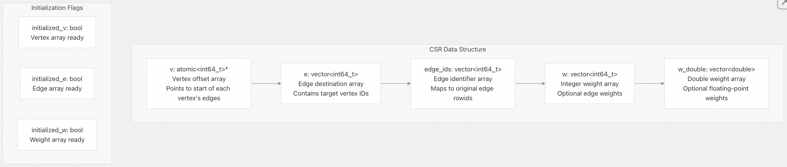
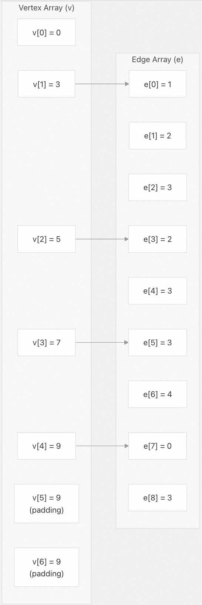
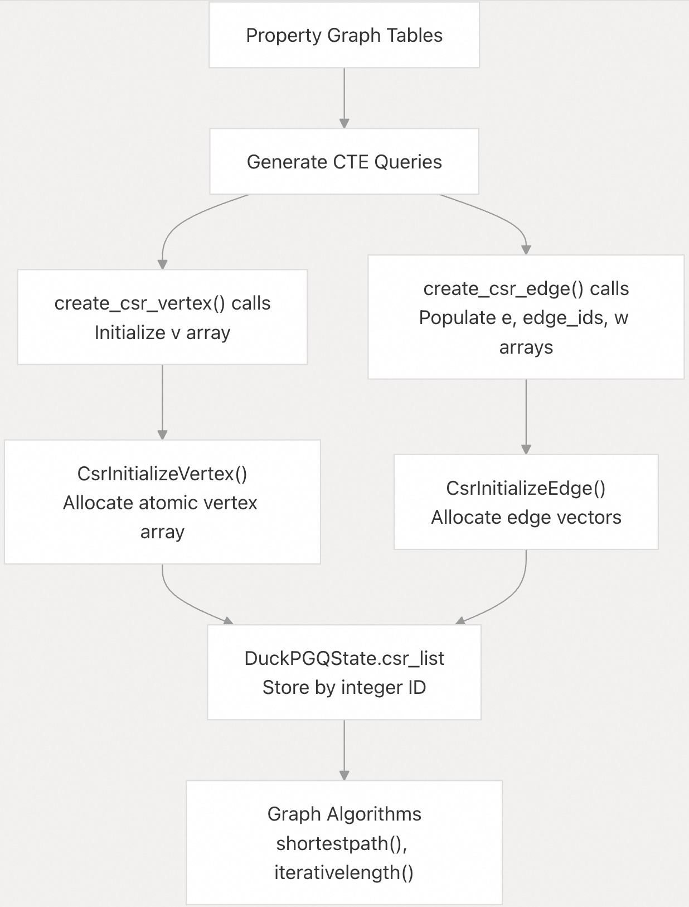
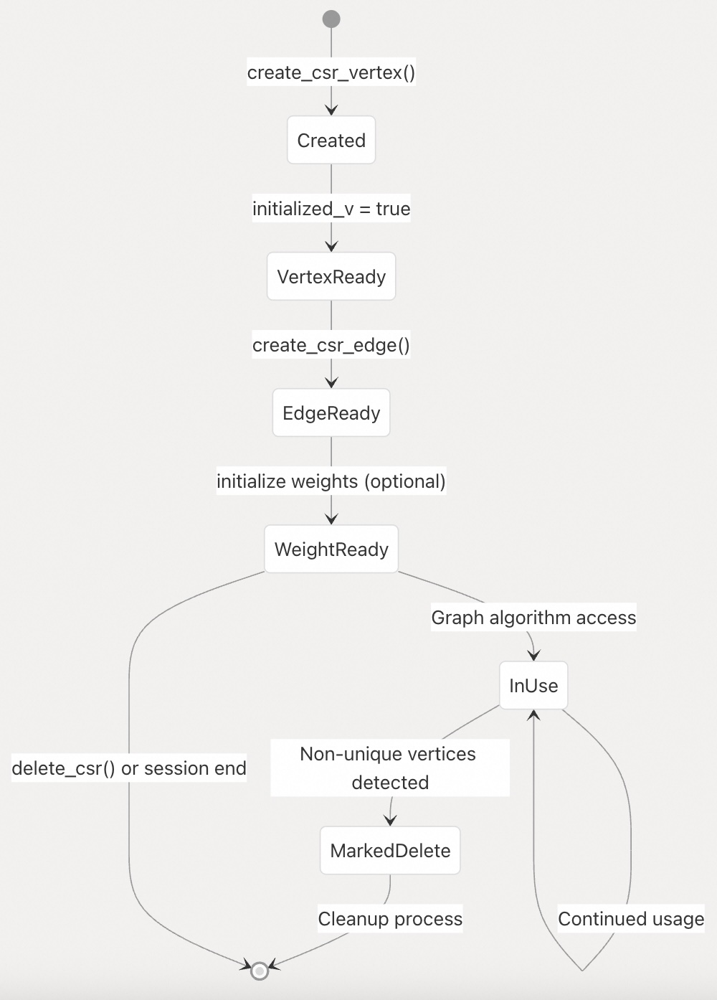
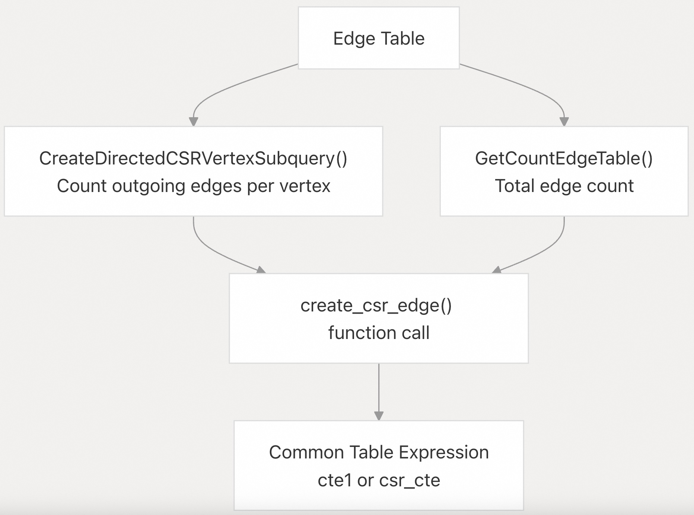
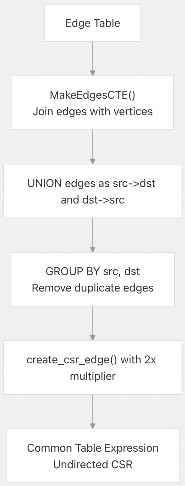
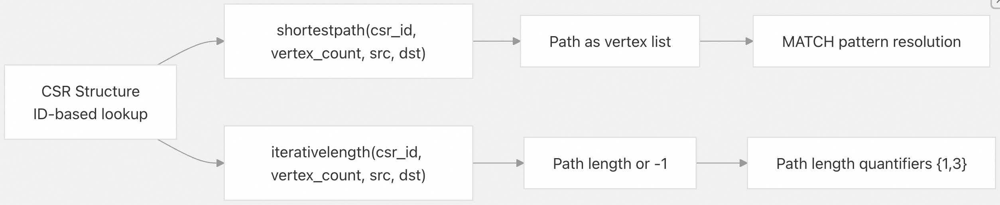
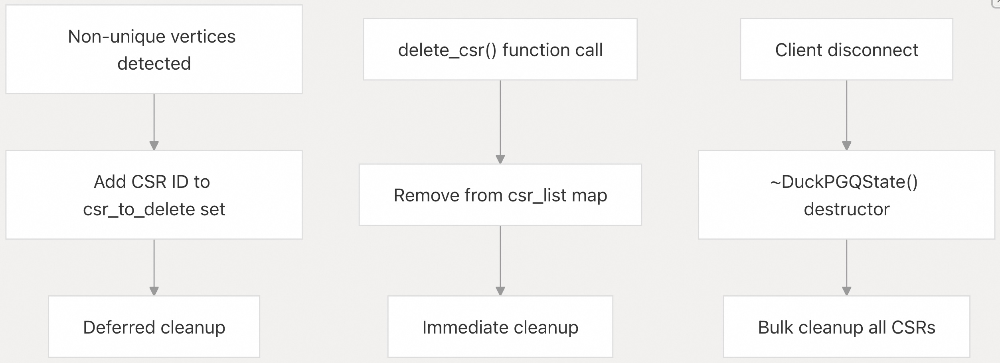

## DuckPGQ 源码学习: 2.2 CSR Data Structures (CSR 数据结构)  
                                  
### 作者                                  
digoal                                  
                                  
### 日期                                  
2025-11-06                                  
                                  
### 标签                                  
DuckDB , PGQ , 属性图 , DuckPGQ , 源码学习                                  
                                  
----             
                                  
## 背景                                  
本文档涵盖了 DuckPGQ 中用于高效图表示（graph representation）和遍历（traversal）的 **压缩稀疏行（Compressed Sparse Row, CSR）** 数据结构。**CSR** 是核心数据结构，它通过提供紧凑存储（compact storage）和快速边遍历（fast edge traversal）能力来实现高性能的图算法（high-performance graph algorithms）。  
  
## 概述 (Overview)  
  
**CSR**（压缩稀疏行）格式是一种**稀疏矩阵表示**（sparse matrix representation），它针对**图存储与遍历**（graph storage and traversal）操作进行了优化。在 DuckPGQ 中，**CSR** 结构是根据属性图表（property graph tables）动态创建的，并被缓存（cached）起来，以便在不同的图查询和算法中重复使用。  
  
相关论文:   
- [《AI论文解读 | DuckPGQ: Bringing SQL/PGQ to DuckDB》](../202507/20250719_08.md)    
- [《AI论文解读 | DuckPGQ: Efficient Property Graph Queries in an analytical RDBMS》](../202507/20250719_06.md)    
  
**CSR 结构组件 (CSR Structure Components)**  
  
  
  
来源: [`src/include/duckpgq/core/utils/compressed_sparse_row.hpp` 27-47](https://github.com/cwida/duckpgq-extension/blob/29748bfe/src/include/duckpgq/core/utils/compressed_sparse_row.hpp#L27-L47)  
  
## CSR 类定义 (CSR Class Definition)  
  
核心的 `CSR` 类提供了**线程安全**（thread-safe）的图表示，并可选择包含边权重（edge weights）：  
  
| 组件 (Component) | 类型 (Type) | 目的 (Purpose) |  
| :--- | :--- | :--- |  
| `v` | `atomic<int64_t>*` (原子型 64 位整型指针) | **顶点偏移量数组**（Vertex offset array），指向边列表的起始位置 |  
| `e` | `vector<int64_t>` (64 位整型向量) | **边目标顶点 ID**（Edge destination vertex IDs） |  
| `edge_ids` | `vector<int64_t>` (64 位整型向量) | **原始边行 ID**（Original edge row IDs），用于结果映射（result mapping） |  
| `w` | `vector<int64_t>` (64 位整型向量) | **整型边权重**（Integer edge weights）（可选） |  
| `w_double` | `vector<double>` (双精度浮点型向量) | **双精度边权重**（Double-precision edge weights）（可选） |  
| `vsize` | `size_t` | **顶点数组总大小**（Total vertex array size），包括**填充**（padding） |  
  
**CSR 内存布局 (CSR Memory Layout)**  
  
  
  
**以上图似乎不太对, 请参考论文中的图示, 实际上“顶点存储的值”对应的是“edge数组中的下标”.**   
  
来源: [`src/include/duckpgq/core/utils/compressed_sparse_row.hpp` 27-47](https://github.com/cwida/duckpgq-extension/blob/29748bfe/src/include/duckpgq/core/utils/compressed_sparse_row.hpp#L27-L47) [`src/core/utils/compressed_sparse_row.cpp` 15-58](https://github.com/cwida/duckpgq-extension/blob/29748bfe/src/core/utils/compressed_sparse_row.cpp#L15-L58)  
  
## CSR 创建函数 (CSR Creation Functions)  
  
DuckPGQ 提供了**标量函数**（scalar functions），用于从属性图数据中填充 **CSR** 结构：  
  
**CSR 顶点创建 (CSR Vertex Creation)**  
  
`create_csr_vertex` 函数用于初始化**顶点偏移量数组**（vertex offset arrays）：  
  
```  
create_csr_vertex(csr_id, vertex_count, dense_id, edge_count)  
```  
  
**CSR 边创建 (CSR Edge Creation)**  
  
`create_csr_edge` 函数用于填充边（edge）和权重（weight）数组：  
  
```  
create_csr_edge(csr_id, vertex_size, edge_sum, edge_count, src_rowid, dst_rowid, edge_rowid [, weight])  
```  
  
**CSR 创建流程 (CSR Creation Workflow)**  
  
  
  
来源: [`src/core/functions/scalar/csr_creation.cpp` 94-181](https://github.com/cwida/duckpgq-extension/blob/29748bfe/src/core/functions/scalar/csr_creation.cpp#L94-L181) [`src/core/functions/scalar/csr_creation.cpp` 16-92](https://github.com/cwida/duckpgq-extension/blob/29748bfe/src/core/functions/scalar/csr_creation.cpp#L16-L92)  
  
## CSR 状态管理 (CSR State Management)  
  
**CSR** 结构在 `DuckPGQState`（DuckPGQ 状态）类中进行管理，并存储在一个**线程安全映射**（thread-safe map）中：  
  
| 组件 (Component) | 类型 (Type) | 目的 (Purpose) |  
| :--- | :--- | :--- |  
| `csr_list` | `map<int32_t, unique_ptr<CSR>>` | 活跃的 **CSR** 结构，按 ID 索引（indexed by ID） |  
| `csr_to_delete` | `set<int32_t>` | 标记为待清理的 **CSR** ID |  
| `csr_lock` | `mutex` (互斥锁) | 用于 **CSR** 操作的线程同步 |  
  
**CSR 生命周期管理 (CSR Lifecycle Management)**  
  
  
  
来源: [`src/core/functions/scalar/csr_creation.cpp` 16-45](https://github.com/cwida/duckpgq-extension/blob/29748bfe/src/core/functions/scalar/csr_creation.cpp#L16-L45) [`src/core/functions/scalar/csr_creation.cpp` 47-67](https://github.com/cwida/duckpgq-extension/blob/29748bfe/src/core/functions/scalar/csr_creation.cpp#L47-L67)  
  
## CSR 创建的 CTE 生成 (CTE Generation for CSR Creation)  
  
DuckPGQ 会自动生成**通用表表达式**（Common Table Expressions, CTE），以便从属性图中创建 **CSR** 结构：  
  
**有向 CSR CTE 生成 (Directed CSR CTE Generation)**  
  
`CreateDirectedCSRCTE` 函数生成用于**有向图表示**（directed graph representation）的 SQL：  
  
  
  
**无向 CSR CTE 生成 (Undirected CSR CTE Generation)**  
  
`CreateUndirectedCSRCTE` 函数处理**双向边表示**（bidirectional edge representation）：  
  
  
  
来源: [`src/core/utils/compressed_sparse_row.cpp` 646-690](https://github.com/cwida/duckpgq-extension/blob/29748bfe/src/core/utils/compressed_sparse_row.cpp#L646-L690) [`src/core/utils/compressed_sparse_row.cpp` 477-561](https://github.com/cwida/duckpgq-extension/blob/29748bfe/src/core/utils/compressed_sparse_row.cpp#L477-L561)  
  
## 与图算法的集成 (Integration with Graph Algorithms)  
  
**CSR** 结构通过专门的函数实现了图算法的高效执行：  
  
**路径查找集成 (Path Finding Integration)**  
  
  
  
**算法函数参数 (Algorithm Function Parameters)**  
  
| 函数 (Function) | 参数 (Parameters) | 返回类型 (Return Type) | 目的 (Purpose) |  
| :--- | :--- | :--- | :--- |  
| `shortestpath` (最短路径) | `(csr_id, vertex_count, src_rowid, dst_rowid)` | `LIST<BIGINT>` | 最短路径作为顶点序列（vertex sequence） |  
| `iterativelength` (迭代长度) | `(csr_id, vertex_count, src_rowid, dst_rowid)` | `BIGINT` | 路径长度，如果不可达（unreachable）则返回 -1 |  
  
来源: [`src/core/functions/table/match.cpp` 454-684](https://github.com/cwida/duckpgq-extension/blob/29748bfe/src/core/functions/table/match.cpp#L454-L684) [`src/core/functions/table/match.cpp` 724-810](https://github.com/cwida/duckpgq-extension/blob/29748bfe/src/core/functions/table/match.cpp#L724-L810)  
  
## 内存管理与清理 (Memory Management and Cleanup)  
  
由于 **CSR** 结构的规模和原始指针（raw pointers）的使用，它需要仔细的**内存管理**（Memory Management）：  
  
**初始化过程 (Initialization Process)**  
  
1.  **顶点数组（Vertex Array）**: 分配为 `atomic<int64_t>` 数组，带有**填充**（padding）以实现线程安全（thread safety）。  
2.  **边向量（Edge Vectors）**: 根据实际边数动态调整大小（dynamically resized）。  
3.  **权重数组（Weight Arrays）**: 根据边权重类型进行可选分配（Optional allocation）。  
  
**清理机制 (Cleanup Mechanisms)**  
  
  
  
**线程安全考量 (Thread Safety Considerations)**  
  
  * 顶点数组使用 `atomic<int64_t>` 进行并发边插入（concurrent edge insertion）。  
  * **CSR** 创建受 `csr_lock` **互斥锁**（mutex）保护。  
  * 状态修改在客户端连接中同步（synchronized）。  
  
来源: [`src/core/functions/scalar/csr_creation.cpp` 16-45](https://github.com/cwida/duckpgq-extension/blob/29748bfe/src/core/functions/scalar/csr_creation.cpp#L16-L45) [`src/core/functions/scalar/csr_creation.cpp` 132-136](https://github.com/cwida/duckpgq-extension/blob/29748bfe/src/core/functions/scalar/csr_creation.cpp#L132-L136)  
  
       
#### [PolarDB 学习图谱](https://www.aliyun.com/database/openpolardb/activity "8642f60e04ed0c814bf9cb9677976bd4")
  
  
#### [PostgreSQL 解决方案集合](../201706/20170601_02.md "40cff096e9ed7122c512b35d8561d9c8")
  
  
#### [德哥 / digoal's Github - 公益是一辈子的事.](https://github.com/digoal/blog/blob/master/README.md "22709685feb7cab07d30f30387f0a9ae")
  
  
#### [About 德哥](https://github.com/digoal/blog/blob/master/me/readme.md "a37735981e7704886ffd590565582dd0")
  
  

  
