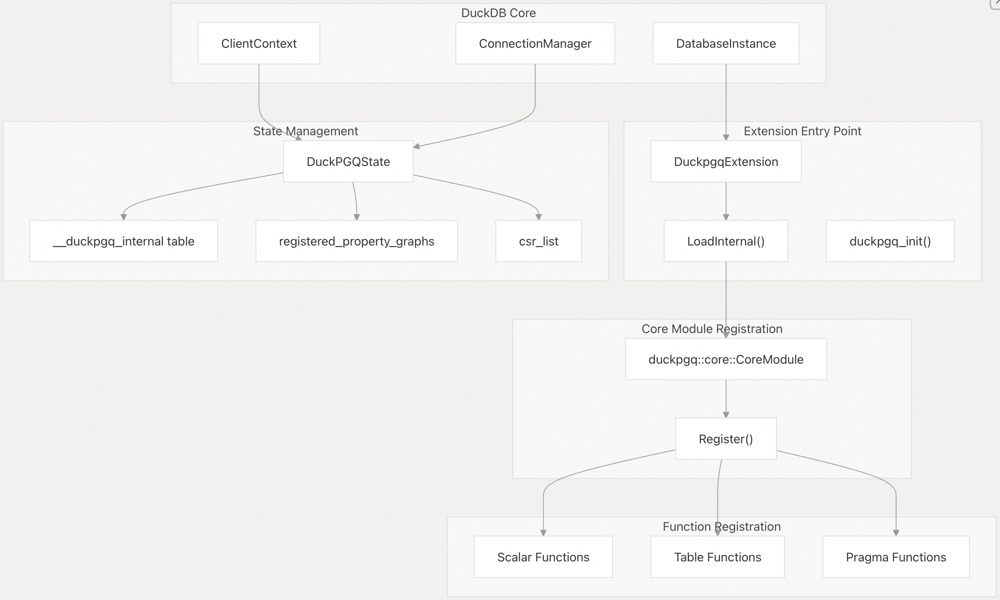
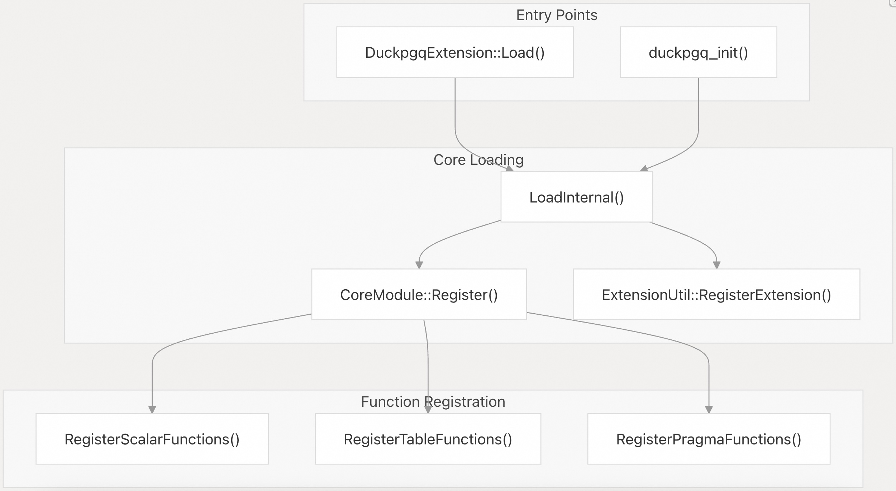
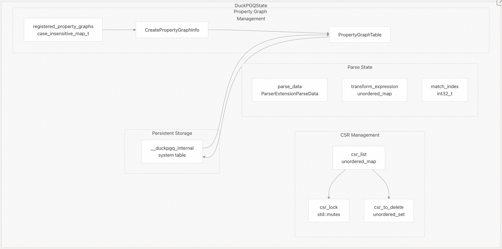
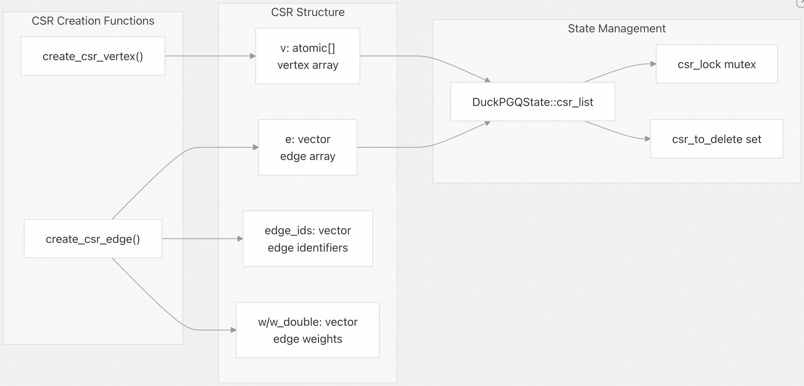
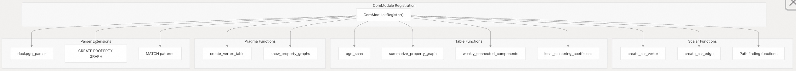

## DuckPGQ 源码学习: 2.3 扩展架构 (`Extension Architecture`)  
                                    
### 作者                                    
digoal                                    
                                    
### 日期                                    
2025-11-06                                    
                                    
### 标签                                    
DuckDB , PGQ , 属性图 , DuckPGQ , 源码学习                                    
                                    
----               
                                    
## 背景                                    
本文档描述了 DuckPGQ 扩展 (`DuckPGQ extension`) 的内部架构，包括其**初始化** (`initialization`)、**状态管理** (`state management`) 和**核心组件** (`core components`)。它涵盖了该扩展如何与 DuckDB 架构 (`DuckDB's architecture`) 集成，以及如何管理**属性图数据结构** (`property graph data structures`)。  
  
-----  
  
## 概述 (`Overview`)  
  
DuckPGQ 是一个 **DuckDB 扩展** (`DuckDB extension`)，它为数据库添加了**属性图能力** (`property graph capabilities`)。其架构遵循 DuckDB 的扩展模式，并带有专门用于**图处理** (`graph processing`)、**状态管理** (`state management`) 和 **SQL 集成** (`SQL integration`) 的组件。  
  
**扩展架构概述** (`Extension Architecture Overview`)  
  
  
  
来源: [`src/duckpgq_extension.cpp` 11-24](https://github.com/cwida/duckpgq-extension/blob/29748bfe/src/duckpgq_extension.cpp#L11-L24) [`src/duckpgq_state.cpp` 5-32](https://github.com/cwida/duckpgq-extension/blob/29748bfe/src/duckpgq_state.cpp#L5-L32) [`src/include/duckpgq_state.hpp` 10-41](https://github.com/cwida/duckpgq-extension/blob/29748bfe/src/include/duckpgq_state.hpp#L10-L41)  
  
## 扩展初始化 (`Extension Initialization`)  
  
该扩展遵循 DuckDB 的标准初始化模式，具有两个主要的入口点：通过 `DuckpgqExtension::Load()` 进行**编程加载** (`programmatic loading`)，以及通过 `duckpgq_init()` 进行 **C API 加载** (`C API loading`)。  
  
**扩展初始化流程** (`Extension Initialization Flow`)  
  
  
  
`LoadInternal()` 函数注册了**核心模块** (`core module`) 和**扩展元数据** (`extension metadata`)。它还包括初始化所有现有连接上的 `DuckPGQState` 的注释代码，表明状态是**惰性地** (`lazily`) 初始化的。  
  
来源: [`src/duckpgq_extension.cpp` 11-40](https://github.com/cwida/duckpgq-extension/blob/29748bfe/src/duckpgq_extension.cpp#L11-L40) [`src/duckpgq/core/module.hpp`](https://github.com/cwida/duckpgq-extension/blob/29748bfe/src/duckpgq/core/module.hpp)  
  
## 状态管理架构 (`State Management Architecture`)  
  
`DuckPGQState` 类管理**每个客户端连接** (`per client connection`) 的所有扩展状态，包括**属性图注册** (`property graph registrations`) 和用于图算法的 **CSR 数据结构** (`CSR data structures`)。  
  
**DuckPGQState 组件** (`DuckPGQState Components`)  
  
  
  
状态在首次通过 `GetDuckPGQState()` 访问时是**惰性地** (`lazily`) 初始化的。该函数会检查现有状态，并在需要时创建它，包括初始化内部**元数据表** (`metadata table`)。  
  
来源: [`src/include/duckpgq_state.hpp` 10-41](https://github.com/cwida/duckpgq-extension/blob/29748bfe/src/include/duckpgq_state.hpp#L10-L41) [`src/duckpgq_state.cpp` 5-32](https://github.com/cwida/duckpgq-extension/blob/29748bfe/src/duckpgq_state.cpp#L5-L32) [`src/core/utils/duckpgq_utils.cpp` 17-31](https://github.com/cwida/duckpgq-extension/blob/29748bfe/src/core/utils/duckpgq_utils.cpp#L17-L31)  
  
## 属性图持久化 (`Property Graph Persistence`)  
  
属性图元数据持久地存储在 `__duckpgq_internal` **系统表** (`system table`) 中，允许属性图在**数据库重启** (`database restarts`) 后仍然存在。  
  
| 列 (`Column`) | 类型 (`Type`) | 用途 (`Purpose`) |  
| :--- | :--- | :--- |  
| `property_graph` | varchar | 属性图名称 |  
| `table_name` | varchar | 底层表名称 |  
| `label` | varchar | 顶点或边标签 (`Vertex or edge label`) |  
| `is_vertex_table` | boolean | 是否为顶点表 |  
| `source_table` | varchar | 边的源表 (`Source table for edges`) |  
| `source_pk/fk` | varchar[] | 主键/外键列 (`Primary/foreign key columns`) |  
| `destination_table` | varchar | 边的目标表 (`Destination table for edges`) |  
| `destination_pk/fk` | varchar[] | 主键/外键列 (`Primary/foreign key columns`) |  
| `properties` | varchar[] | 属性列名称 (`Property column names`) |  
| `column_aliases` | varchar[] | 列别名 (`Column aliases`) |  
  
`DuckPGQState::RetrievePropertyGraphs()` 函数在初始化时加载此元数据，将顶点表 (`vertex`) 和边表 (`edge`) 分离以进行处理。  
  
来源: [`src/duckpgq_state.cpp` 7-28](https://github.com/cwida/duckpgq-extension/blob/29748bfe/src/duckpgq_state.cpp#L7-L28) [`src/duckpgq_state.cpp` 34-173](https://github.com/cwida/duckpgq-extension/blob/29748bfe/src/duckpgq_state.cpp#L34-L173)  
  
## CSR 数据结构管理 (`CSR Data Structure Management`)  
  
该扩展使用**压缩稀疏行** (`Compressed Sparse Row`，**CSR**) 数据结构以实现高效的图遍历。**CSR 创建** (`CSR creation`) 由专门的**标量函数** (`scalar functions`) 处理，这些函数用于填充共享数据结构。  
  
**CSR 创建流程** (`CSR Creation Pipeline`)  
  
  
  
CSR 初始化通过**互斥锁** (`mutex locks`) 实现**线程安全** (`thread-safe`)。`csr_to_delete` 集合用于跟踪应在查询结束时清理的 CSR，尤其是在发生**约束冲突** (`constraint violations`) 时。  
  
来源: [`src/core/functions/scalar/csr_creation.cpp` 16-92](https://github.com/cwida/duckpgq-extension/blob/29748bfe/src/core/functions/scalar/csr_creation.cpp#L16-L92) [`src/include/duckpgq/core/utils/compressed_sparse_row.hpp`](https://github.com/cwida/duckpgq-extension/blob/29748bfe/src/include/duckpgq/core/utils/compressed_sparse_row.hpp)  
  
## 函数注册系统 (`Function Registration System`)  
  
该扩展通过 `CoreModule::Register()` 系统注册了多种类型的函数：  
  
  
  
**函数类别** (`Function Categories`)  
  
| 类别 (`Category`) | 目的 (`Purpose`) |  
| :--- | :--- |  
| **标量函数** (`Scalar Functions`) | 图转换、CSR 创建 |  
| **表函数** (`Table Functions`) | 路径查找 (`Path finding`)、图分析 (`Graph analytics`)、架构管理 (`Schema management`) |  
| **宏函数** (`Macro Functions`) | Cypher-to-SQL 翻译 |  
  
每个函数类别在图处理流程中都有特定用途，从 CSR 创建到高级分析。  
  
来源: [`src/duckpgq/core/module.hpp`](https://github.com/cwida/duckpgq-extension/blob/29748bfe/src/duckpgq/core/module.hpp) [`src/core/functions/scalar/csr_creation.cpp` 237-241](https://github.com/cwida/duckpgq-extension/blob/29748bfe/src/core/functions/scalar/csr_creation.cpp#L237-L241) [`src/core/functions/table/local_clustering_coefficient.cpp` 49-52](https://github.com/cwida/duckpgq-extension/blob/29748bfe/src/core/functions/table/local_clustering_coefficient.cpp#L49-L52)  
  
## 查询生命周期管理 (`Query Lifecycle Management`)  
  
`DuckPGQState` 实现了 `ClientContextState::QueryEnd()` 来在每次查询结束后清理临时状态：  
  
```cpp  
void DuckPGQState::QueryEnd() {  
  parse_data.reset();  
  transform_expression.clear();  
  match_index = 0;  
  for (const auto &csr_id : csr_to_delete) {  
    csr_list.erase(csr_id);  
  }  
  csr_to_delete.clear();  
}  
```  
  
这确保了解析状态和临时 CSR 结构不会在查询之间泄漏，同时保留了持久的属性图注册。  
  
来源: [`src/duckpgq_state.cpp` 175-183](https://github.com/cwida/duckpgq-extension/blob/29748bfe/src/duckpgq_state.cpp#L175-L183) [`src/include/duckpgq_state.hpp` 15](https://github.com/cwida/duckpgq-extension/blob/29748bfe/src/include/duckpgq_state.hpp#L15-L15)  
  
## 实用工具函数 (`Utility Functions`)  
  
该扩展提供了用于常见操作的实用工具函数：  
  
  * `GetDuckPGQState()`: 为客户端上下文检索或创建扩展状态。  
  * `GetPropertyGraphInfo()`: 按名称查找属性图元数据。  
  * `ValidateSourceNodeAndEdgeTable()`: 验证图表的表关系。  
  * `CreateSelectNode()`: 为图操作构建 SQL 查询节点。  
  
这些实用程序弥合了高级图操作和底层 DuckDB API 之间的差距。  
  
来源: [`src/core/utils/duckpgq_utils.cpp` 17-133](https://github.com/cwida/duckpgq-extension/blob/29748bfe/src/core/utils/duckpgq_utils.cpp#L17-L133) [`src/include/duckpgq/core/utils/duckpgq_utils.hpp` 12-25](https://github.com/cwida/duckpgq-extension/blob/29748bfe/src/include/duckpgq/core/utils/duckpgq_utils.hpp#L12-L25)  
  
          
#### [PolarDB 学习图谱](https://www.aliyun.com/database/openpolardb/activity "8642f60e04ed0c814bf9cb9677976bd4")
  
  
#### [PostgreSQL 解决方案集合](../201706/20170601_02.md "40cff096e9ed7122c512b35d8561d9c8")
  
  
#### [德哥 / digoal's Github - 公益是一辈子的事.](https://github.com/digoal/blog/blob/master/README.md "22709685feb7cab07d30f30387f0a9ae")
  
  
#### [About 德哥](https://github.com/digoal/blog/blob/master/me/readme.md "a37735981e7704886ffd590565582dd0")
  
  

  
