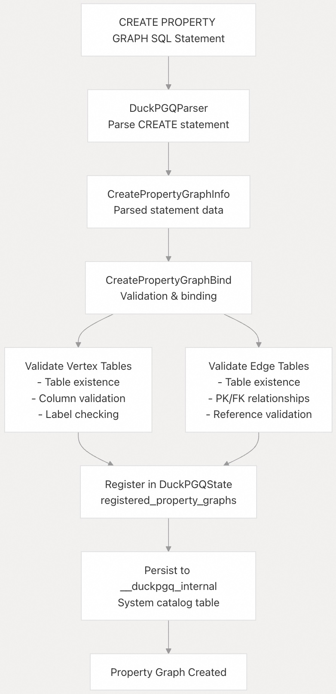
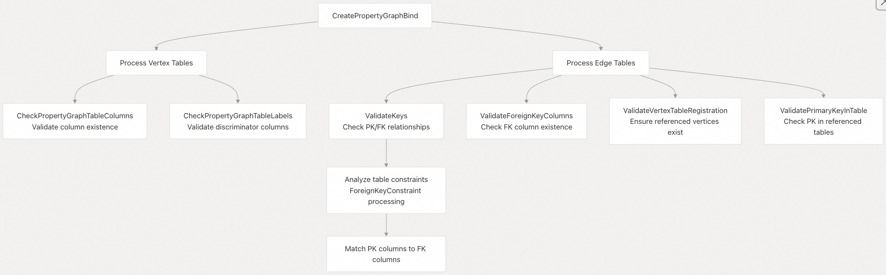
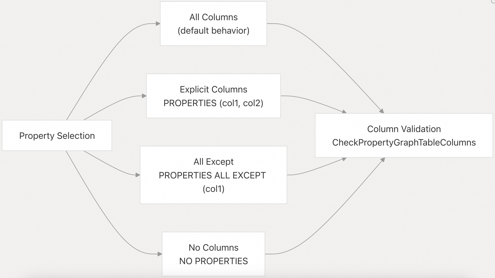
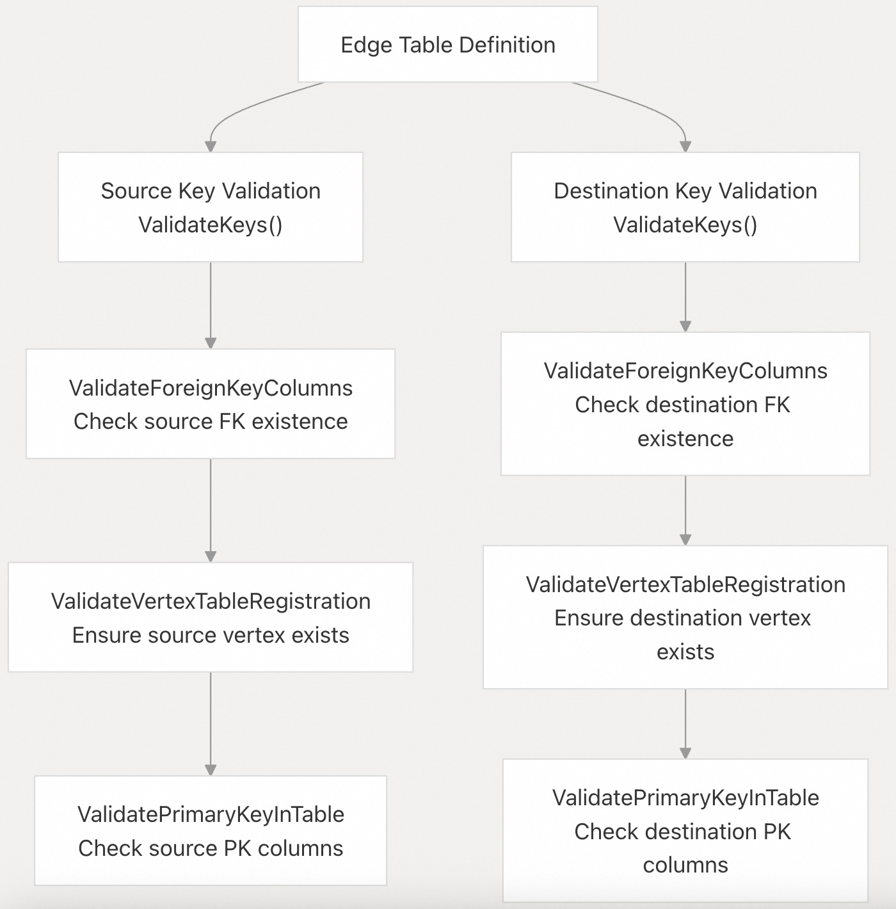
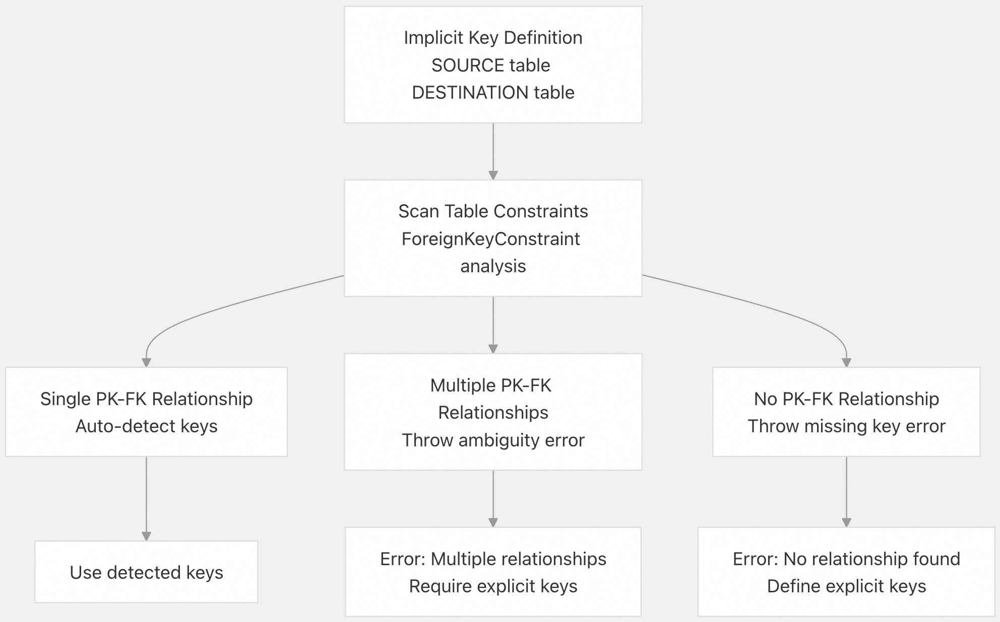
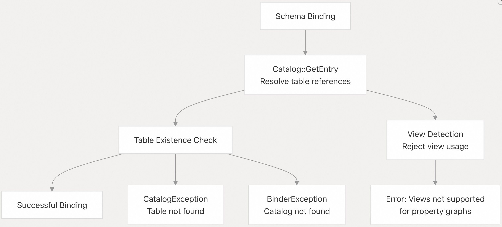
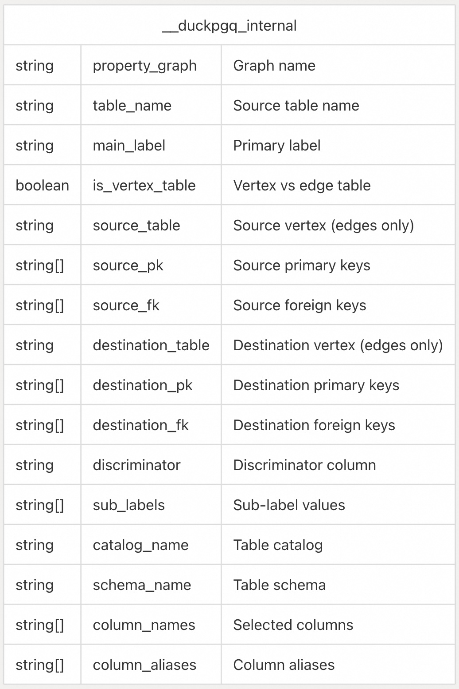

## DuckPGQ 源码学习: 3 图定义 (Graph Definition)  
                                      
### 作者                                      
digoal                                      
                                      
### 日期                                      
2025-11-06                                      
                                      
### 标签                                      
DuckDB , PGQ , 属性图 , DuckPGQ , 源码学习                                      
                                      
----                 
                                      
## 背景                                      
本文档涵盖了在 DuckPGQ 中使用 `CREATE PROPERTY GRAPH` 语句定义属性图（Property Graphs）的过程。它解释了将关系表（relational tables）转换为图结构（graph structures）的语法、验证规则和内部机制。  
  
## 属性图创建流程 (Property Graph Creation Process)  
  
DuckPGQ 中的属性图（Property Graphs）是通过将现有的关系表（relational tables）映射到图结构来定义的。`CREATE PROPERTY GRAPH` 语句通过**顶点表**（vertex tables，即节点）和**边表**（edge tables，即关系），以及它们的属性（properties）和约束（constraints），来建立这些映射。  
  
### 核心 CREATE PROPERTY GRAPH 工作流 (Core CREATE PROPERTY GRAPH Workflow)  
  
  
  
来源: [`src/core/functions/table/create_property_graph.cpp` 170-290](https://github.com/cwida/duckpgq-extension/blob/29748bfe/src/core/functions/table/create_property_graph.cpp#L170-L290)  
  
### 验证架构 (Validation Architecture)  
  
`CreatePropertyGraphFunction` 类通过几个专门的方法实现了全面的验证：  
  
  
  
来源: [`src/core/functions/table/create_property_graph.cpp` 16-290](https://github.com/cwida/duckpgq-extension/blob/29748bfe/src/core/functions/table/create_property_graph.cpp#L16-L290) [`src/include/duckpgq/core/functions/table/create_property_graph.hpp` 39-81](https://github.com/cwida/duckpgq-extension/blob/29748bfe/src/include/duckpgq/core/functions/table/create_property_graph.hpp#L39-L81)  
  
-----  
  
## 顶点表定义 (Vertex Table Definition)  
  
顶点表（Vertex tables）代表属性图中的节点（nodes）。每个顶点表都映射到一个现有关系表，并且可以指定属性（properties）、标签（labels）和用于子标签（sub-labeling）的鉴别列（discriminator columns）。  
  
### 顶点表语法组成部分 (Vertex Table Syntax Components)  
  
| 组成部分 (Component) | 目的 (Purpose) | 示例 (Example) |  
| :--- | :--- | :--- |  
| 表名 (Table Name) | 源关系表 (Source relational table) | `Student` |  
| 表别名 (Table Alias) | 替代引用名称 (Alternative reference name) | `Student as StudentAlias` |  
| 属性 (Properties) | 要包含的列 (Columns to include) | `PROPERTIES (id, name)` |  
| 列别名 (Column Aliases) | 替代列名 (Alternative column names) | `PROPERTIES (id as student_id)` |  
| 标签 (Label) | 主顶点标签 (Primary vertex label) | `LABEL Person` |  
| 鉴别列 (Discriminator) | 用于子标签的列 (Column for sub-labels) | `IN person_type (Teacher, Student)` |  
  
### 属性选择模式 (Property Selection Patterns)  
  
系统支持多种选择列的模式：  
  
  
  
来源: [`src/core/functions/table/create_property_graph.cpp` 35-70](https://github.com/cwida/duckpgq-extension/blob/29748bfe/src/core/functions/table/create_property_graph.cpp#L35-L70)  
  
-----  
  
## 边表定义 (Edge Table Definition)  
  
边表（Edge tables）代表顶点之间的关系（relationships）。它们需要明确的**源**（source）和**目标**（destination）键映射来建立图拓扑（graph topology）。  
  
### 边表验证流程 (Edge Table Validation Process)  
  
  
  
来源: [`src/core/functions/table/create_property_graph.cpp` 242-271](https://github.com/cwida/duckpgq-extension/blob/29748bfe/src/core/functions/table/create_property_graph.cpp#L242-L271)  
  
### 主键-外键关系解析 (Primary Key-Foreign Key Relationship Resolution)  
  
当未明确指定时，系统会自动从表约束中检测主键-外键（PK-FK）关系：  
  
  
  
来源: [`src/core/functions/table/create_property_graph.cpp` 72-128](https://github.com/cwida/duckpgq-extension/blob/29748bfe/src/core/functions/table/create_property_graph.cpp#L72-L128)  
  
-----  
  
## 模式和目录管理 (Schema and Catalog Management)  
  
DuckPGQ 支持跨多个模式（schemas）和目录（catalogs）的属性图，并对跨模式引用进行适当的验证。  
  
### 模式解析流程 (Schema Resolution Process)  
  
系统使用 `Binder::BindSchemaOrCatalog()` 解析表引用，并处理完全限定名称（fully qualified names）：  
  
| 引用模式 (Reference Pattern) | 示例 (Example) | 解析 (Resolution) |  
| :--- | :--- | :--- |  
| 简单名称 (Simple name) | `Student` | 当前模式 (Current schema) |  
| 模式限定 (Schema qualified) | `test_schema.Student` | 指定模式 (Specified schema) |  
| 目录限定 (Catalog qualified) | `memory.test_schema.Student` | 指定目录 + 模式 (Specified catalog + schema) |  
  
### 跨模式验证 (Cross-Schema Validation)  
  
  
  
来源: [`src/core/functions/table/create_property_graph.cpp` 199-287](https://github.com/cwida/duckpgq-extension/blob/29748bfe/src/core/functions/table/create_property_graph.cpp#L199-L287) [`test/sql/211_using_other_schemas.test` 1-332](https://github.com/cwida/duckpgq-extension/blob/29748bfe/test/sql/211_using_other_schemas.test#L1-L332)  
  
-----  
  
## 持久化存储 (Persistent Storage)  
  
属性图的元数据（metadata）存储在 `__duckpgq_internal` 系统表中，以便在不同会话中保持持久性。  
  
### 内部表模式 (Internal Table Schema)  
  
系统使用全面的元数据来持久化属性图定义：  
  
  
  
来源: [`src/core/functions/table/create_property_graph.cpp` 337-451](https://github.com/cwida/duckpgq-extension/blob/29748bfe/src/core/functions/table/create_property_graph.cpp#L337-L451)  
  
-----  
  
## 错误处理和验证规则 (Error Handling and Validation Rules)  
  
系统通过全面的错误消息，强制执行严格的验证规则：  
  
### 常见验证错误 (Common Validation Errors)  
  
| 错误类型 (Error Type) | 原因 (Cause) | 示例 (Example) |  
| :--- | :--- | :--- |  
| 表未找到 (Table Not Found) | 引用的表不存在 | `Table with name Student does not exist` (名为 Student 的表不存在) |  
| 列未找到 (Column Not Found) | 引用的列不存在 | `Column id not found in table Student` (在表 Student 中未找到列 id) |  
| 标签重复 (Duplicate Labels) | 跨表标签非唯一 | `Label person is not unique` (标签 person 非唯一) |  
| 缺少 PK-FK (Missing PK-FK) | 表之间没有关系 | `No primary key - foreign key relationship found` (未找到主键-外键关系) |  
| 关系多重 (Multiple Relationships) | 模糊的 PK-FK 关系 | `Multiple primary key - foreign key relationships detected` (检测到多个主键-外键关系) |  
| 视图使用 (View Usage) | 试图使用视图 | `Creating property graph tables over views not supported` (不支持在视图上创建属性图表) |  
  
来源: [`src/core/functions/table/create_property_graph.cpp` 20-287](https://github.com/cwida/duckpgq-extension/blob/29748bfe/src/core/functions/table/create_property_graph.cpp#L20-L287) [`test/sql/create_pg/create_property_graph.test` 10-216](https://github.com/cwida/duckpgq-extension/blob/29748bfe/test/sql/create_pg/create_property_graph.test#L10-L216)  
       
#### [PolarDB 学习图谱](https://www.aliyun.com/database/openpolardb/activity "8642f60e04ed0c814bf9cb9677976bd4")
  
  
#### [PostgreSQL 解决方案集合](../201706/20170601_02.md "40cff096e9ed7122c512b35d8561d9c8")
  
  
#### [德哥 / digoal's Github - 公益是一辈子的事.](https://github.com/digoal/blog/blob/master/README.md "22709685feb7cab07d30f30387f0a9ae")
  
  
#### [About 德哥](https://github.com/digoal/blog/blob/master/me/readme.md "a37735981e7704886ffd590565582dd0")
  
  

  
