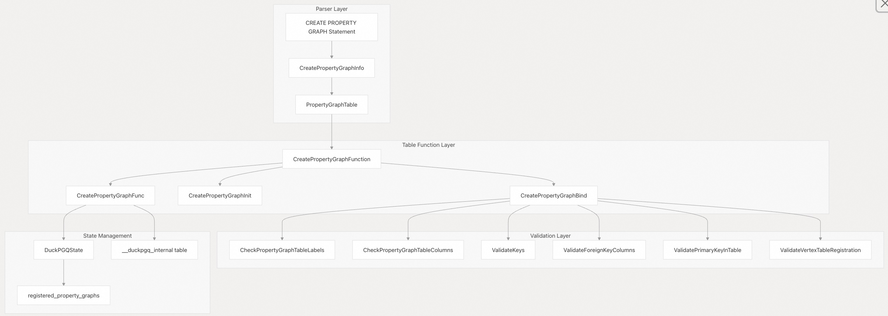
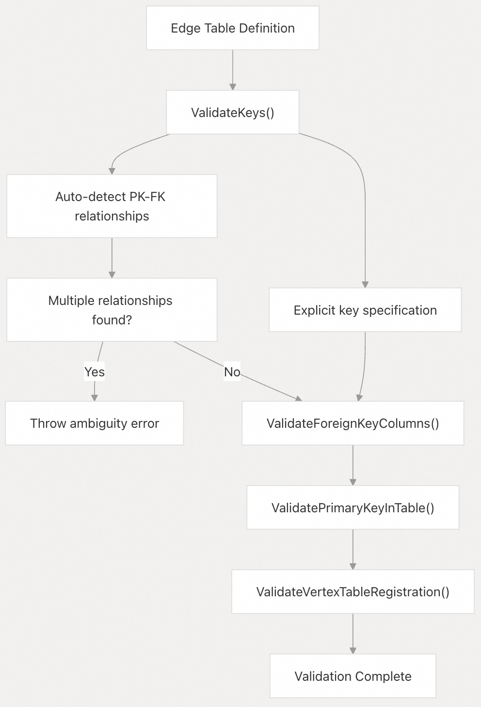

## DuckPGQ 源码学习: 3.1 CREATE PROPERTY GRAPH （创建属性图）  
                                        
### 作者                                        
digoal                                        
                                        
### 日期                                        
2025-11-06                                        
                                        
### 标签                                        
DuckDB , PGQ , 属性图 , DuckPGQ , 源码学习                                        
                                        
----                   
                                        
## 背景     
本文档介绍了 DuckPGQ 中的 `CREATE PROPERTY GRAPH` 语句，该语句在 DuckDB 现有的**关系表**（relational tables）上定义了**属性图**（property graphs）。该语句创建了**关系表**和**图结构**（graph structures）之间的**映射**（mapping），从而可以通过 `GRAPH_TABLE` 函数启用**图查询**（graph queries）。  
  
## 概述  
  
`CREATE PROPERTY GRAPH` 语句允许用户通过指定以下内容来定义一个**属性图**（property graph）：  
  
  * **顶点表**（Vertex tables）：表示图**顶点**（graph vertices）的现有关系表  
  * **边表**（Edge tables）：表示图**边**（graph edges）并带有**源/目标引用**（source/destination references）的现有关系表  
  * **属性**（Properties）：要包含在图表示中的表列  
  * **标签**（Labels）：顶点和边类型的名称，包括**继承层次结构**（inheritance hierarchies）  
  * **键关系**（Key relationships）：边表和顶点表之间的**主键**（Primary key）和**外键**（foreign key）关系  
  
## 语法结构  
  
```sql  
CREATE [OR REPLACE] PROPERTY GRAPH graph_name  
VERTEX TABLES (  
    table_name [AS alias] [PROPERTIES (column_list)] [LABEL label_name] [IN discriminator_column (sub_labels)]  
)  
EDGE TABLES (  
    table_name SOURCE KEY (fk_columns) REFERENCES vertex_table (pk_columns)  
               DESTINATION KEY (fk_columns) REFERENCES vertex_table (pk_columns)  
               [PROPERTIES (column_list)] [LABEL label_name]  
)  
```  
  
来源:  
[`test/sql/create_pg/create_property_graph.test` 42-51](https://github.com/cwida/duckpgq-extension/blob/29748bfe/test/sql/create_pg/create_property_graph.test#L42-L51)  
[`test/sql/create_pg/attach_pg.test` 47-51](https://github.com/cwida/duckpgq-extension/blob/29748bfe/test/sql/create_pg/attach_pg.test#L47-L51)  
  
## 核心架构  
  
下图说明了处理 `CREATE PROPERTY GRAPH` 语句所涉及的主要**组件**（components）：  
  
  
  
来源:  
[`src/core/functions/table/create_property_graph.cpp` 170-289](https://github.com/cwida/duckpgq-extension/blob/29748bfe/src/core/functions/table/create_property_graph.cpp#L170-L289)  
[`src/include/duckpgq/core/functions/table/create_property_graph.hpp` 19-81](https://github.com/cwida/duckpgq-extension/blob/29748bfe/src/include/duckpgq/core/functions/table/create_property_graph.hpp#L19-L81)  
  
## 顶点表  
  
**顶点表**（Vertex tables）定义了**属性图**（property graph）中的**节点**（nodes）。每个顶点表规范包括：  
  
### 基本顶点定义  
  
  * **表名**（Table name）：必须是现有表或**视图**（view）（视图目前不支持）  
  * **别名**（Alias）：用于在边定义中引用的可选表别名  
  * **属性**（Properties）：要包含的特定列，如果省略则包含所有列  
  * **标签**（Label）：来自此表的顶点**主标签**（Primary label）  
  
### 属性规范  
  
`PROPERTIES` **子句**（clause）支持：  
  
  * **显式列**（Explicit columns）：`PROPERTIES (id, name)`  
  * **列别名**（Column aliases）：`PROPERTIES (id AS vertex_id, name)`  
  * **所有列**：省略 `PROPERTIES` 子句以包含所有列  
  * **列排除**（Column exclusion）：`PROPERTIES ALL EXCEPT (column1, column2)`（**隐式支持**（implicit support））  
  
来源:  
[`src/core/functions/table/create_property_graph.cpp` 35-70](https://github.com/cwida/duckpgq-extension/blob/29748bfe/src/core/functions/table/create_property_graph.cpp#L35-L70)  
[`test/sql/create_pg/all_properties.test` 27-36](https://github.com/cwida/duckpgq-extension/blob/29748bfe/test/sql/create_pg/all_properties.test#L27-L36)  
  
### 标签继承  
  
顶点表使用**判别列**（discriminator columns）支持**分层标签**（hierarchical labels）：  
  
```sql  
VERTEX TABLES (  
    Organisation LABEL Organisation IN mask(university, company)  
)  
```  
  
这创建了一个层次结构，其中 `Organisation` 是**父标签**（parent label），而 `university`、`company` 是基于 `mask` 列值的**子标签**（sub-labels）。  
  
来源:  
[`test/sql/pattern_matching/inheritance_support.test` 41-50](https://github.com/cwida/duckpgq-extension/blob/29748bfe/test/sql/pattern_matching/inheritance_support.test#L41-L50)  
[`src/core/functions/table/create_property_graph.cpp` 16-33](https://github.com/cwida/duckpgq-extension/blob/29748bfe/src/core/functions/table/create_property_graph.cpp#L16-L33)  
  
## 边表  
  
**边表**（Edge tables）定义了**顶点**（vertices）之间的**关系**（relationships）。每个边表必须指定**源**（source）和**目标**（destination）顶点引用。  
  
### 源和目标键  
  
边表需要**显式外键关系**（explicit foreign key relationships）：  
  
```sql  
EDGE TABLES (  
    know SOURCE KEY (src) REFERENCES Student (id)  
         DESTINATION KEY (dst) REFERENCES Student (id)  
         LABEL Knows  
)  
```  
  
### 键验证过程  
  
下图显示了边表键的**验证流程**（validation flow）：  
  
  
  
来源:  
[`src/core/functions/table/create_property_graph.cpp` 72-128](https://github.com/cwida/duckpgq-extension/blob/29748bfe/src/core/functions/table/create_property_graph.cpp#L72-L128)  
[`src/core/functions/table/create_property_graph.cpp` 242-271](https://github.com/cwida/duckpgq-extension/blob/29748bfe/src/core/functions/table/create_property_graph.cpp#L242-L271)  
  
### 自动键检测  
  
当键未**显式指定**（explicitly specified）时，系统会尝试从现有的**表约束**（table constraints）中**自动检测**（auto-detect）**主键**（primary key）-**外键**（foreign key）关系。如果存在多个关系，则会抛出**错误**（error），要求进行**显式规范**（explicit specification）。  
  
来源:  
[`src/core/functions/table/create_property_graph.cpp` 87-110](https://github.com/cwida/duckpgq-extension/blob/29748bfe/src/core/functions/table/create_property_graph.cpp#L87-L110)  
[`test/sql/create_pg/create_pg_with_pk_fk.test` 23-28](https://github.com/cwida/duckpgq-extension/blob/29748bfe/test/sql/create_pg/create_pg_with_pk_fk.test#L23-L28)  
  
## 实现细节  
  
### CreatePropertyGraphFunction 类结构  
  
`CreatePropertyGraphFunction` **类**（Class）实现了**表函数接口**（table function interface）：  
  
  
  
```cpp  
class CreatePropertyGraphFunction : public TableFunction {  
    // Member definitions...  
};  
```  
  
来源:  
[`src/include/duckpgq/core/functions/table/create_property_graph.hpp` 19-81](https://github.com/cwida/duckpgq-extension/blob/29748bfe/src/include/duckpgq/core/functions/table/create_property_graph.hpp#L19-L81)  
  
### 绑定阶段验证  
  
**绑定阶段**（bind phase）执行**全面验证**（comprehensive validation）：  
  
1.  **表存在性**（Table Existence）：验证所有引用的表是否存在于**目录**（catalog）中  
2.  **列验证**（Column Validation）：检查指定的列是否存在于其各自的表中  
3.  **标签唯一性**（Label Uniqueness）：确保所有标签在属性图上都是**唯一**（unique）的  
4.  **键关系**（Key Relationships）：验证主键-外键关系  
5.  **顶点注册**（Vertex Registration）：确保边表引用**已注册**（registered）的顶点表  
  
来源:  
[`src/core/functions/table/create_property_graph.cpp` 170-289](https://github.com/cwida/duckpgq-extension/blob/29748bfe/src/core/functions/table/create_property_graph.cpp#L170-L289)  
  
### 执行阶段存储  
  
**执行阶段**（Execution Phase）存储**属性图元数据**（property graph metadata）：  
  
1.  **内存注册**（In-Memory Registration）：存储在 `DuckPGQState.registered_property_graphs` 中  
2.  **持久化存储**（Persistent Storage）：将元数据插入 `__duckpgq_internal` 表中  
3.  **连接传播**（Connection Propagation）：传播到所有**活动连接**（active connections）  
  
来源:  
[`src/core/functions/table/create_property_graph.cpp` 298-451](https://github.com/cwida/duckpgq-extension/blob/29748bfe/src/core/functions/table/create_property_graph.cpp#L298-L451)  
  
## 模式限定符和多数据库支持  
  
DuckPGQ 支持跨**目录**（catalogs）和**模式**（schemas）的**完全限定表名**（fully qualified table names）：  
  
```sql  
CREATE PROPERTY GRAPH cross_schema  
VERTEX TABLES (  
    schema1.Person,  
    schema2.Company  
)  
EDGE TABLES (  
    schema2.WorksAt SOURCE KEY (person_id) REFERENCES schema1.Person (id)  
                    DESTINATION KEY (company_id) REFERENCES schema2.Company (id)  
)  
```  
  
来源:  
[`test/sql/211_using_other_schemas.test` 120-129](https://github.com/cwida/duckpgq-extension/blob/29748bfe/test/sql/211_using_other_schemas.test#L120-L129)  
[`test/sql/create_pg/attach_pg.test` 47-51](https://github.com/cwida/duckpgq-extension/blob/29748bfe/test/sql/create_pg/attach_pg.test#L47-L51)  
  
## 错误处理  
  
系统针对常见问题提供**详细的错误消息**（detailed error messages）：  
  
| 错误类型 (Error Type) | 示例 (Example) | 解决方案 (Resolution) |  
| :--- | :--- | :--- |  
| **未找到表**（Table Not Found） | `Table with name X does not exist` (名称为 X 的表不存在) | 确保表存在于指定的模式中（Ensure table exists in specified schema） |  
| **未找到列**（Column Not Found） | `Column X not found in table Y` (在表 Y 中未找到列 X) | 验证列名和拼写（Verify column names and spelling） |  
| **重复标签**（Duplicate Labels） | `Label X is not unique` (标签 X 不是唯一的) | 在所有表中使用唯一标签（Use unique labels across all tables） |  
| **缺少主键-外键**（Missing PK-FK） | `No primary key - foreign key relationship found` (未找到主键-外键关系) | 添加显式键规范（Add explicit key specifications） |  
| **多重关系**（Multiple Relationships） | `Multiple primary key - foreign key relationships detected` (检测到多个主键-外键关系) | 使用显式 `SOURCE KEY` 和 `DESTINATION KEY` 子句（Use explicit `SOURCE KEY` and `DESTINATION KEY` clauses） |  
  
来源:  
[`src/core/functions/table/create_property_graph.cpp` 20-27](https://github.com/cwida/duckpgq-extension/blob/29748bfe/src/core/functions/table/create_property_graph.cpp#L20-L27)  
[`src/core/functions/table/create_property_graph.cpp` 80-127](https://github.com/cwida/duckpgq-extension/blob/29748bfe/src/core/functions/table/create_property_graph.cpp#L80-L127)  
  
## 冲突解决  
  
该语句支持使用 `CREATE OR REPLACE` 进行**冲突解决**（conflict resolution）：  
  
  * `CREATE`：如果**属性图**（property graph）已存在，则**失败**（Fails）  
  * `CREATE OR REPLACE`：**替换**（Replaces）现有的属性图  
  * `CREATE IF NOT EXISTS`：如果属性图已存在，则**静默成功**（Silently succeeds）  
  
来源:  
[`src/core/functions/table/create_property_graph.cpp` 189-194](https://github.com/cwida/duckpgq-extension/blob/29748bfe/src/core/functions/table/create_property_graph.cpp#L189-L194)  
[`src/core/functions/table/create_property_graph.cpp` 320-335](https://github.com/cwida/duckpgq-extension/blob/29748bfe/src/core/functions/table/create_property_graph.cpp#L320-L335)  
  
## 示例  
  
### 基本属性图  
  
```sql  
CREATE PROPERTY GRAPH social_network  
VERTEX TABLES (  
    Person PROPERTIES (id, name) LABEL Person  
)  
EDGE TABLES (  
    Friendship SOURCE KEY (person1_id) REFERENCES Person (id)  
               DESTINATION KEY (person2_id) REFERENCES Person (id)  
               PROPERTIES (since) LABEL friends_with  
)  
```  
  
### 带继承的多表属性图  
  
```sql  
CREATE PROPERTY GRAPH academic_network  
VERTEX TABLES (  
    Person LABEL Person IN type(student, professor),  
    Institution LABEL Institution  
)  
EDGE TABLES (  
    Affiliation SOURCE KEY (person_id) REFERENCES Person (id)  
                DESTINATION KEY (institution_id) REFERENCES Institution (id)  
                LABEL affiliated_with  
)  
```  
  
来源:  
[`test/sql/create_pg/create_property_graph.test` 42-51](https://github.com/cwida/duckpgq-extension/blob/29748bfe/test/sql/create_pg/create_property_graph.test#L42-L51)  
[`test/sql/pattern_matching/inheritance_support.test` 198-208](https://github.com/cwida/duckpgq-extension/blob/29748bfe/test/sql/pattern_matching/inheritance_support.test#L198-L208)  
      
#### [PolarDB 学习图谱](https://www.aliyun.com/database/openpolardb/activity "8642f60e04ed0c814bf9cb9677976bd4")
  
  
#### [PostgreSQL 解决方案集合](../201706/20170601_02.md "40cff096e9ed7122c512b35d8561d9c8")
  
  
#### [德哥 / digoal's Github - 公益是一辈子的事.](https://github.com/digoal/blog/blob/master/README.md "22709685feb7cab07d30f30387f0a9ae")
  
  
#### [About 德哥](https://github.com/digoal/blog/blob/master/me/readme.md "a37735981e7704886ffd590565582dd0")
  
  

  
