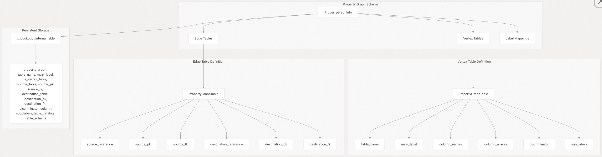
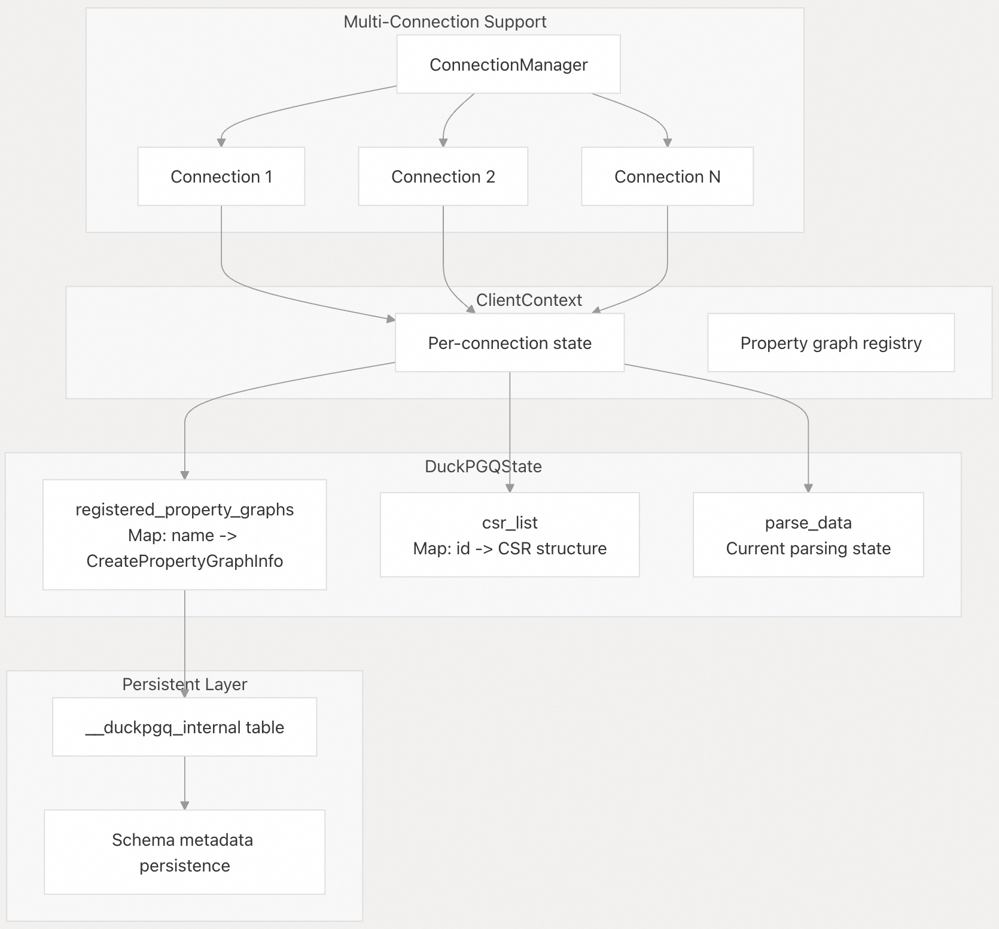
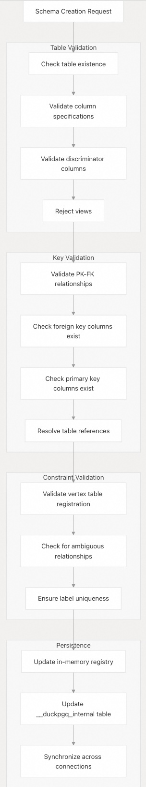
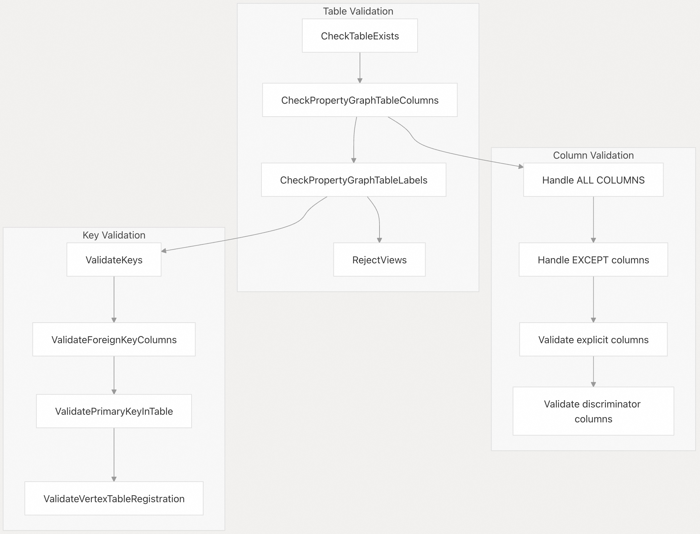
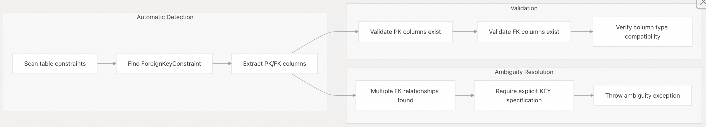
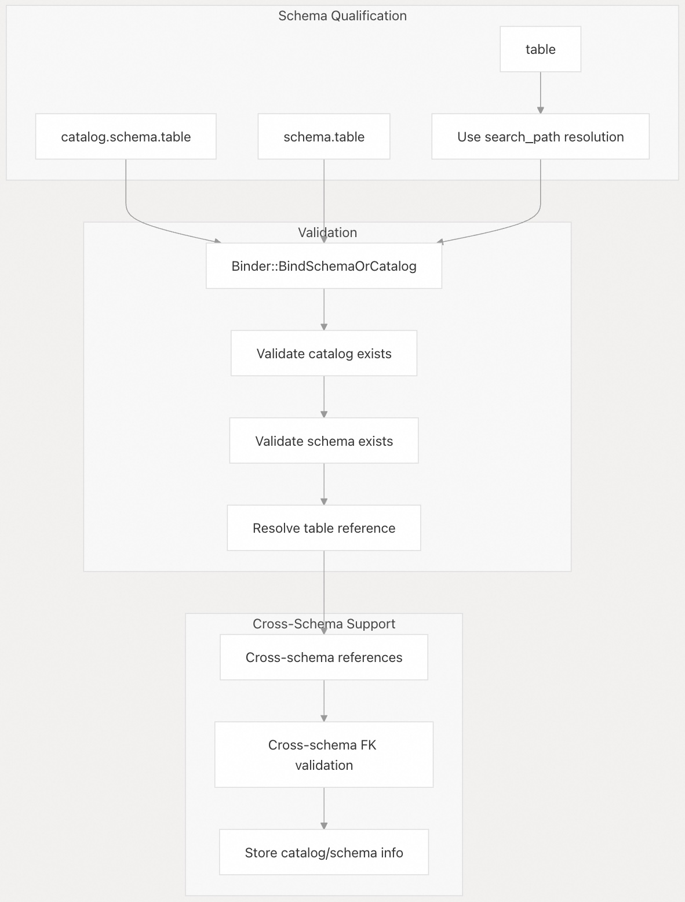
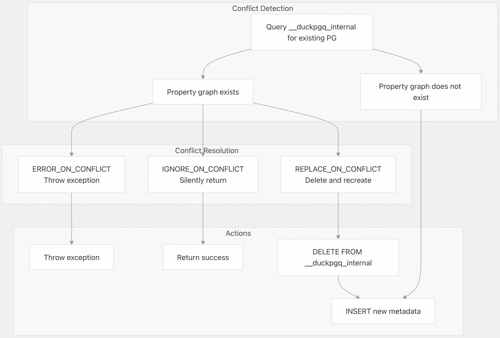

## DuckPGQ 源码学习: 3.2 图模式管理 (Graph Schema Management)  
                                          
### 作者                                          
digoal                                          
                                          
### 日期                                          
2025-11-06                                          
                                          
### 标签                                          
DuckDB , PGQ , 属性图 , DuckPGQ , 源码学习                                          
                                          
----                     
                                          
## 背景       
本文档涵盖了 DuckPGQ 中**属性图模式 (property graph schemas)** 的管理，包括模式定义 (**schema definition**)、验证 (**validation**)、持久化 (**persistence**) 和生命周期操作 (**lifecycle operations**)。图模式管理 (**Graph schema management**) 处理**元数据 (metadata)** 和结构定义，这些定义使得能够对**关系数据 (relational data)** 进行**图查询 (graph queries)**。  
  
## 模式定义与存储 (Schema Definition and Storage)  
  
DuckPGQ 中的**属性图模式 (Property graph schemas)** 定义了**关系表 (relational tables)** 与图概念（**顶点/节点 (vertices)** 和**边 (edges)**）之间的**映射 (mapping)**。模式信息既存储在**内存 (in memory)** 中，也**持久化 (persistently)** 存储在 `__duckpgq_internal` 表中。  
  
### 模式组件 (Schema Components)  
  
  
  
来源: [`src/core/functions/table/create_property_graph.cpp` 170-290](https://github.com/cwida/duckpgq-extension/blob/29748bfe/src/core/functions/table/create_property_graph.cpp#L170-L290) [`src/include/duckpgq/core/functions/table/create_property_graph.hpp` 28-33](https://github.com/cwida/duckpgq-extension/blob/29748bfe/src/include/duckpgq/core/functions/table/create_property_graph.hpp#L28-L33)  
  
### 模式状态管理 (Schema State Management)  
  
**属性图模式 (Property graph schemas)** 通过 `DuckPGQState` 类进行管理，该类维护着**内存中 (in-memory)** 和**持久化 (persistent)** 的表示：  
  
  
  
来源: [`src/core/functions/table/create_property_graph.cpp` 304-309](https://github.com/cwida/duckpgq-extension/blob/29748bfe/src/core/functions/table/create_property_graph.cpp#L304-L309)  
  
## 模式操作 (Schema Operations)  
  
### CREATE PROPERTY GRAPH  
  
`CreatePropertyGraphFunction` 实现了核心的模式创建逻辑，并带有全面的**验证 (validation)**：  
  
| 操作 (**Operation**) | 描述 (**Description**) | 冲突行为 (**Conflict Behavior**) |  
| :--- | :--- | :--- |  
| `CREATE PROPERTY GRAPH` | 创建新的**属性图模式 (property graph schema)** | 如果存在则失败 (**Fails if exists**) |  
| `CREATE OR REPLACE PROPERTY GRAPH` | 创建或**替换 (replaces)** 现有的模式 | 如果存在则替换 (**Replaces if exists**) |  
| `CREATE PROPERTY GRAPH IF NOT EXISTS` | 仅在不存在时创建 | 如果存在则忽略 (**Ignores if exists**) |  
  
来源: [`src/core/functions/table/create_property_graph.cpp` 189-194](https://github.com/cwida/duckpgq-extension/blob/29748bfe/src/core/functions/table/create_property_graph.cpp#L189-L194) [`test/sql/create_pg/create_or_replace_pg.test` 1-44](https://github.com/cwida/duckpgq-extension/blob/29748bfe/test/sql/create_pg/create_or_replace_pg.test#L1-L44)  
  
### DESCRIBE PROPERTY GRAPH  
  
`DESCRIBE PROPERTY GRAPH` 语句提供了全面的**模式信息 (schema information)**：  
  
```  
DESCRIBE PROPERTY GRAPH schema_name;  
```  
  
返回详细的**元数据 (metadata)**，包括：  
  
  * 属性图名称 (**Property graph name**)  
  * 表名称 (**Table names**) 和**标签 (labels)**  
  * 顶点/边分类 (**Vertex/edge classification**)  
  * 源 (**Source**) 和目标 (**destination references**) 引用  
  * 主键 (**Primary key**) 和外键 (**foreign key mappings**) 映射  
  * **判别列 (Discriminator columns)** 和**子标签 (sub-labels)**  
  * **目录 (Catalog)** 和**模式信息 (schema information)**  
  
来源: [`test/sql/create_pg/describe_pg.test` 21-91](https://github.com/cwida/duckpgq-extension/blob/29748bfe/test/sql/create_pg/describe_pg.test#L21-L91)  
  
### 模式验证过程 (Schema Validation Process)  
  
  
  
来源: [`src/core/functions/table/create_property_graph.cpp` 16-289](https://github.com/cwida/duckpgq-extension/blob/29748bfe/src/core/functions/table/create_property_graph.cpp#L16-L289)  
  
## 验证与约束 (Validation and Constraints)  
  
### 表和列验证 (Table and Column Validation)  
  
系统对表和列的规范执行广泛的**验证 (validation)**：  
  
  
  
来源: [`src/core/functions/table/create_property_graph.cpp` 35-70](https://github.com/cwida/duckpgq-extension/blob/29748bfe/src/core/functions/table/create_property_graph.cpp#L35-L70) [`src/core/functions/table/create_property_graph.cpp` 72-128](https://github.com/cwida/duckpgq-extension/blob/29748bfe/src/core/functions/table/create_property_graph.cpp#L72-L128)  
  
### 主键-外键关系验证 (Primary Key-Foreign Key Relationship Validation)  
  
系统自动检测和验证**主键-外键 (PK-FK)** 关系，但在**模棱两可 (ambiguous)** 时需要明确指定：  
  
  
  
来源: [`src/core/functions/table/create_property_graph.cpp` 72-128](https://github.com/cwida/duckpgq-extension/blob/29748bfe/src/core/functions/table/create_property_graph.cpp#L72-L128) [`test/sql/create_pg/create_pg_with_pk_fk.test` 23-28](https://github.com/cwida/duckpgq-extension/blob/29748bfe/test/sql/create_pg/create_pg_with_pk_fk.test#L23-L28)  
  
## 多模式和多目录支持 (Multi-Schema and Multi-Catalog Support)  
  
DuckPGQ 支持跨越多个**模式 (schemas)** 和**目录 (catalogs)** 的属性图，并具有适当的**限定 (qualification)** 和**解析 (resolution)**：  
  
### 模式解析 (Schema Resolution)  
  
  
  
来源: [`test/sql/211_using_other_schemas.test` 120-156](https://github.com/cwida/duckpgq-extension/blob/29748bfe/test/sql/211_using_other_schemas.test#L120-L156) [`src/core/functions/table/create_property_graph.cpp` 199-221](https://github.com/cwida/duckpgq-extension/blob/29748bfe/src/core/functions/table/create_property_graph.cpp#L199-L221)  
  
### 附加和外部数据库支持 (Attachment and External Database Support)  
  
系统支持**附加数据库 (attached databases)** 和**外部目录 (external catalogs)**：  
  
```  
-- Attached database example  
ATTACH 'external.duckdb';  
CREATE PROPERTY GRAPH pg   
VERTEX TABLES (external_db.schema.vertex_table)  
EDGE TABLES (external_db.schema.edge_table   
    SOURCE KEY (src) REFERENCES external_db.schema.vertex_table (id)  
    DESTINATION KEY (dst) REFERENCES external_db.schema.vertex_table (id));  
```      
  
来源: [`test/sql/create_pg/attach_pg.test` 46-51](https://github.com/cwida/duckpgq-extension/blob/29748bfe/test/sql/create_pg/attach_pg.test#L46-L51)  
  
## 持久化与状态管理 (Persistence and State Management)  
  
### 内部表结构 (Internal Table Structure)  
  
属性图**元数据 (metadata)** 被持久化在 `__duckpgq_internal` 表中，其模式 (**schema**) 如下：  
  
| 列名 (**Column**) | 类型 (**Type**) | 描述 (**Description**) |  
| :--- | :--- | :--- |  
| `property_graph` | VARCHAR | 属性图名称 (**Property graph name**) |  
| `table_name` | VARCHAR | 源表名称 (**Source table name**) |  
| `main_label` | VARCHAR | 主标签 (**Primary label**) |  
| `is_vertex_table` | BOOLEAN | 顶点 vs 边分类 (**Vertex vs edge classification**) |  
| `source_table` | VARCHAR | 源顶点表（仅限边）(**Source vertex table (edges only)**) |  
| `source_pk` | VARCHAR[] | 源主键列 (**Source primary key columns**) |  
| `source_fk` | VARCHAR[] | 源外键列 (**Source foreign key columns**) |  
| `destination_table` | VARCHAR | 目标顶点表（仅限边）(**Destination vertex table (edges only)**) |  
| `destination_pk` | VARCHAR[] | 目标主键列 (**Destination primary key columns**) |  
| `destination_fk` | VARCHAR[] | 目标外键列 (**Destination foreign key columns**) |  
| `discriminator_column` | VARCHAR | 判别列名称 (**Discriminator column name**) |  
| `sub_labels` | VARCHAR[] | 子标签值 (**Sub-label values**) |  
| `table_catalog` | VARCHAR | 表目录名称 (**Table catalog name**) |  
| `table_schema` | VARCHAR | 表模式名称 (**Table schema name**) |  
| `column_names` | VARCHAR[] | 选定的列名称 (**Selected column names**) |  
| `column_aliases` | VARCHAR[] | 列别名 (**Column aliases**) |  
  
来源: [`src/core/functions/table/create_property_graph.cpp` 337-450](https://github.com/cwida/duckpgq-extension/blob/29748bfe/src/core/functions/table/create_property_graph.cpp#L337-L450)  
  
### 冲突解决策略 (Conflict Resolution Strategies)  
  
系统支持三种**冲突解决策略 (conflict resolution strategies)**：  
  
  
  
来源: [`src/core/functions/table/create_property_graph.cpp` 320-335](https://github.com/cwida/duckpgq-extension/blob/29748bfe/src/core/functions/table/create_property_graph.cpp#L320-L335)  
      
#### [PolarDB 学习图谱](https://www.aliyun.com/database/openpolardb/activity "8642f60e04ed0c814bf9cb9677976bd4")
  
  
#### [PostgreSQL 解决方案集合](../201706/20170601_02.md "40cff096e9ed7122c512b35d8561d9c8")
  
  
#### [德哥 / digoal's Github - 公益是一辈子的事.](https://github.com/digoal/blog/blob/master/README.md "22709685feb7cab07d30f30387f0a9ae")
  
  
#### [About 德哥](https://github.com/digoal/blog/blob/master/me/readme.md "a37735981e7704886ffd590565582dd0")
  
  

  
