## AI论文解读 | Don’t Hold My Data Hostage - A Case For Client Protocol Redesign
        
### 作者        
digoal        
        
### 日期        
2025-11-07        
        
### 标签        
PostgreSQL , PolarDB , DuckDB , AI , 论文解读        
        
----        
        
## 背景  
      
https://dl.acm.org/doi/pdf/10.14778/3115404.3115408        
  
提示:          
```          
读懂《Don’t Hold My Data Hostage - A Case For Client Protocol Redesign》这篇论文需要提前掌握哪些基础知识, 请使用中文通熟易懂的讲解这些基础知识, 可以引用论文中的图、表或使用Markdown支持的图形(text,mermaid等)增加解释性. 
  
使用中文通熟易懂的解读《Don’t Hold My Data Hostage - A Case For Client Protocol Redesign》这篇论文, 其中的关键内容请着重讲解, 可以引用论文中的图、表或使用Markdown支持的图形(text,mermaid等)增加解释性. 
  
提取《Don’t Hold My Data Hostage - A Case For Client Protocol Redesign》这篇论文中的重要术语, 使用中文对这些术语进行通熟易懂的讲解, 可以引用论文中的图、表或使用Markdown支持的图形(text,mermaid等)增加解释性. 
```     
  
## 1 前置知识 
  
要透彻理解这篇论文《Don’t Hold My Data Hostage - A Case For Client Protocol Redesign》（别把我的数据当人质——为何要重新设计客户端协议），你需要掌握以下几个核心基础知识。

这篇论文的**核心观点**非常直接：当用户试图从数据库中获取**大量**数据（例如，用于机器学习或统计分析）时，查询本身（计算）可能很快，但把查询结果从数据库服务器传输到你的电脑（客户端）这个过程却“惊人地”慢 。

论文通过实验证明了这一点，并指出问题出在老旧的“客户端协议”（即数据传输的规则和格式）上，最后提出了一种新的基于**列式**的传输方法，能将速度提升一个数量级 。

以下是你需要了解的基础知识：

### 1\. 客户端-服务器 (Client-Server) 架构

这是最基本的概念。在数据库的世界里，你的应用程序（比如一个Python脚本、R语言环境或数据分析软件）是**客户端 (Client)**，而存储和管理数据的数据库（如MySQL, PostgreSQL）是**服务器 (Server)** 。

你需要数据时，客户端会向服务器发送一个“请求”（比如一条SQL查询语句），服务器处理这个请求，然后把“结果”返回给客户端 。

**论文中的图2**  完美地展示了这个流程：  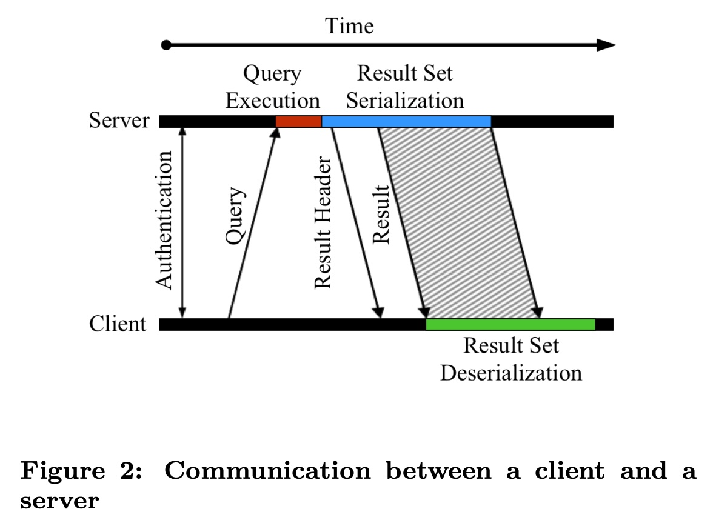  

1.  **认证 (Authentication):** 客户端验明身份（用户名、密码）。
2.  **查询 (Query):** 客户端发送查询请求（例如 `SELECT * FROM ...`）。
3.  **执行与序列化 (Execution & Serialization):** 服务器执行查询，然后把结果“打包”（序列化）准备发送。
4.  **传输 (Result):** 服务器将打包好的数据发回。
5.  **反序列化 (Deserialization):** 客户端收到数据后“解包”（反序列化）并使用。


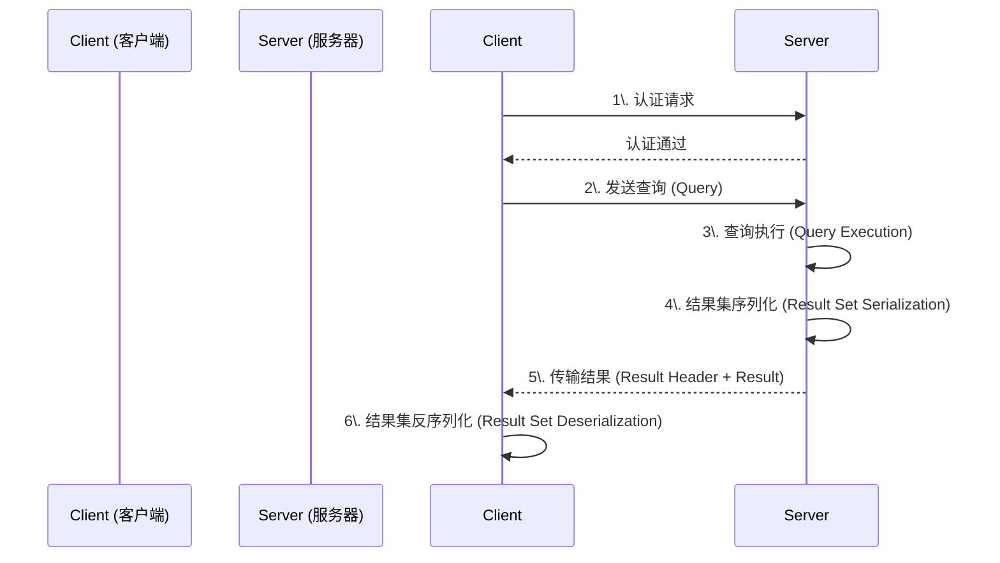

### 2\. 数据库查询的“幕后”开销

当你运行一条查询时，总时间分为好几个部分。这篇论文的**核心论据来自图1** 。  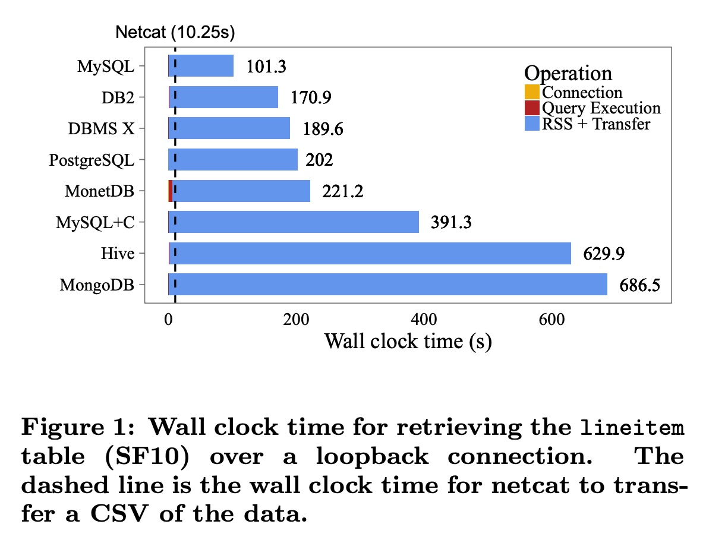  

  * **图1**  展示了从各个主流数据库获取一个大表（`lineitem`）所花费的总时间。
  * 图例  将时间分为三部分：
      * **黄色 (Connection):** 连接时间（几乎看不见）。
      * **红色 (Query Execution):** 查询执行时间（非常短）。
      * **蓝色 (RSS + Transfer):** **结果集序列化 (RSS) + 传输时间（占了绝大部分！）** 。

**你需要理解的是：** 数据库执行查询（在硬盘和内存里计算）的速度其实非常快，真正的瓶颈在于把计算出的海量结果“打包”并“发送”给你的这个过程 。

### 3\. 什么是“序列化” (Serialization)？

这是本文最核心的技术概念。

  * **定义：** 序列化 (Serialization) 是指将数据库内存中复杂的、结构化的数据（比如一张表）转换成一长串的字节流 (stream of bytes)，以便能通过网络（比如网线）这种简单的媒介进行传输 。
  * **反序列化 (Deserialization):** 则是相反的过程，客户端收到字节流后，将其重新组装成可用的数据结构（比如一个数据框）。

**论文的论点是：** 现有的数据库（如PostgreSQL, MySQL）在“序列化”这个步骤上做得非常低效 。**如图5到图8**所示，它们在传输数据时，**每一行 (row)** 都要附带大量的“元数据” (metadata)，比如“这是一个数据包”、“这个字段有多长”、“这个字段是不是NULL”等等 。

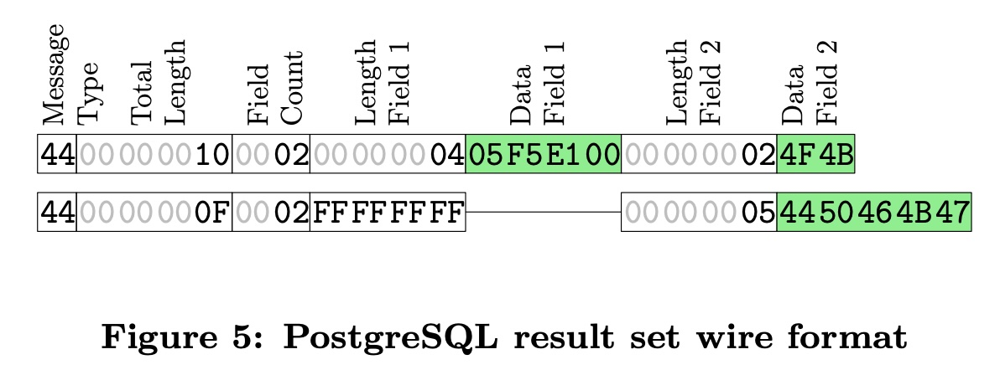  

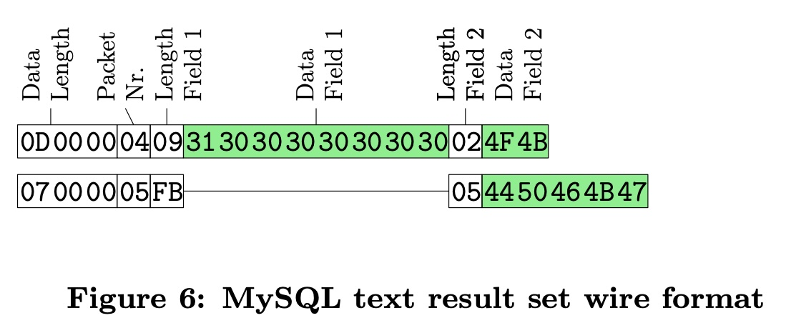  

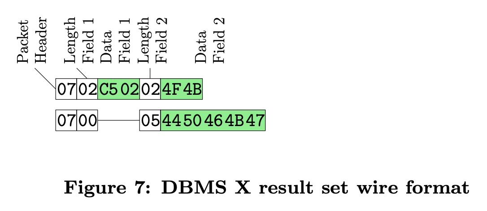  

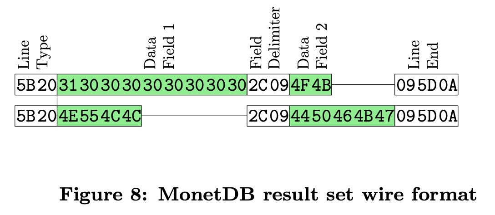  

当你有数百万行数据时，这种“为每一行都单独包装”的方式会产生巨大的额外开销。

### 4\. 关键概念：行式 (Row-wise) vs. 列式 (Column-wise)

这是理解论文“解决方案”的关键。数据在打包传输时，有两种主流方式：

**A. 行式序列化 (Row-wise) (目前大多数数据库的做法 )**
它就像我们平时读表格一样，一行一行地发送数据。

> **数据表:**
> | ID | Name | Age |
> |----|------|-----|
> | 1 | Alice| 30 |
> | 2 | Bob | 25 |
>
> **行式发送顺序:**
> `(1, 'Alice', 30)`, `(2, 'Bob', 25)`

**B. 列式序列化 (Column-wise) (论文提倡的方法 )**
它先把某一列的所有数据打包在一起，再打包下一列。

> **数据表:** (同上)
>
> **列式发送顺序:**
> `(1, 2)`, `('Alice', 'Bob')`, `(30, 25)`

**为什么“列式”更好？**

1.  **极易压缩：** 同一列的数据类型相同，数据特征相似（比如全是数字，或全是日期）。把它们放在一起（如 `(1, 2)` 和 `(30, 25)`）比把混合数据（如 `(1, 'Alice', 30)`）放在一起，压缩软件（如GZIP, Snappy）的压缩效率要高得多 。
2.  **适配分析工具：** 现代数据分析工具（如 R  或 Python Pandas ）在内存中本来就是“列式”存储的。如果数据库用“行式”传过来，客户端还得在本地辛辛苦苦地把它转换回“列式”，这纯属浪费时间 。

### 5\. 网络基础：吞吐量 (Throughput) vs. 延迟 (Latency)

论文还分析了不同网络环境下的性能，你需要理解两个基本网络指标：

  * **吞吐量 (Throughput):** 指网络的“带宽”，可以理解为“水管的粗细”。单位是 `Mb/s`（兆比特每秒）。吞吐量越低，发送大量数据（尤其是未压缩数据）就越慢 。**图4**  就显示了吞吐量对总时间的影响。  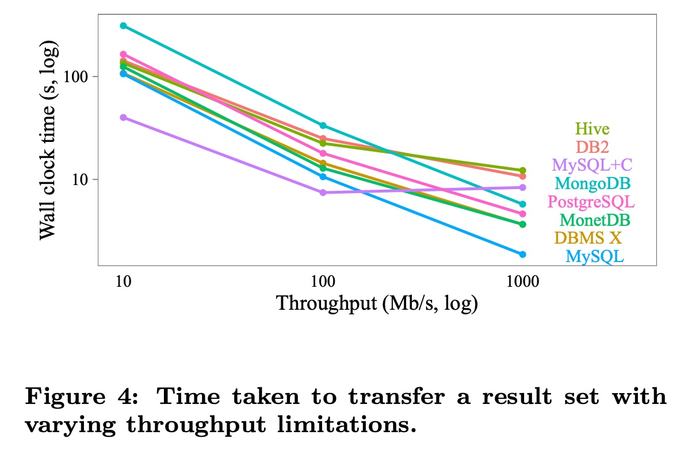  
  * **延迟 (Latency):** 指数据“往返”一次所需的时间，可以理解为“打开水龙头到水流出来的时间差”。单位是 `ms`（毫秒）。延迟高（比如跨国网络）时，那些需要频繁“确认”的“啰嗦”协议（你发一点，我确认一下）会变得奇慢无比 。**图3**  就显示了高延迟对DB2和DBMS X的性能有灾难性影响 。  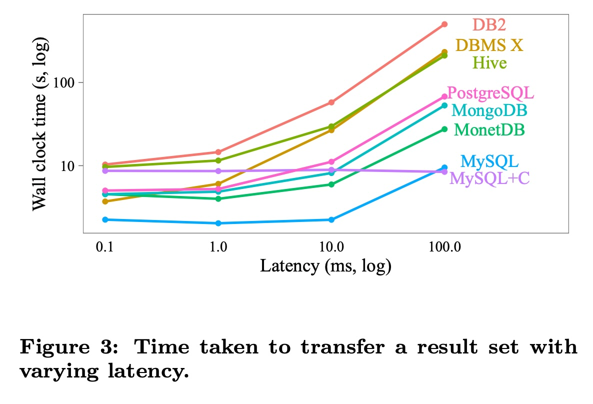  

-----

### 总结

要读懂这篇论文，你需要具备的基础知识是：

1.  **C/S 架构：** 知道数据库是服务器，分析工具是客户端 。
2.  **查询开销分解：** 明白数据传输（RSS + Transfer）是总时间的大头，而不是查询执行（**图1** ）。    
3.  **序列化概念：** 理解“序列化”就是把数据“打包”成字节流的过程 。
4.  **行/列式对比：** 牢记“列式”比“行式”更适合压缩和现代分析工具（这是论文的核心技术点）。
5.  **网络指标：** 知道低吞吐量和高延迟会如何影响数据传输 。

掌握了这些，你就能轻松理解为什么作者说现有的数据库协议“绑架”了我们的数据，以及为什么他们提出的“列式分块”  传输是更好的解决方案。

您想让我详细解释一下图1中的“Netcat (10.25s)”基线是什么意思，为什么它比所有数据库都快吗？   
  
## 2 解读论文 
  
这是一篇非常经典且有影响力的数据库论文。用一句话总结它的核心观点就是：

**“你辛辛苦苦跑的数据库查询，真正慢的不是计算，而是把结果从服务器“打包”发给你的过程。这个过程因为设计老旧，慢得离谱，是时候彻底革新了。”**

这篇论文的标题《Don’t Hold My Data Hostage》（别把我的数据当人质）起得非常形象。它把数据比作“人质”，而老旧的数据库客户端协议（Client Protocol）就是“绑匪”，它抓着你的数据不放，让你等上很久才能拿到。

下面我们就来详细解读这篇论文的关键内容。

-----

### 关键内容一：发现真凶——瓶颈到底在哪？

我们通常认为数据库慢，是慢在 `SELECT` 语句的计算（比如连接、排序、聚合）上。但作者上来就用一张图（论文中的**图1**）颠覆了这个认知。    

**图1：获取一张大表（SF10 lineitem）的总时间** 

  * **横轴：** 各种主流数据库（MySQL, DB2, PostgreSQL, Hive, MongoDB等） 。
  * **纵轴：** 花费的时间（秒） 。
  * **图例（重点）：**
      * **黄色 (Connection):** 连接时间（几乎看不见，可以忽略） 。
      * **红色 (Query Execution):** **查询执行时间**（就是数据库“思考”的时间，非常非常短） 。
      * **蓝色 (RSS + Transfer):** **结果集序列化(RSS) + 传输时间**（把结果打包并发给你的时间）。

**结论一目了然：**
对于所有数据库，真正花费时间的**几乎都是蓝色部分** 。比如PostgreSQL总共202秒，计算（红色）可能只占了不到1秒，剩下200多秒都在传输数据 。

**“人质”出现了：**
作者还做了一个基准测试（Baseline），就是图顶上的 **"Netcat (10.25s)"** 。`netcat` 是一个简单的网络工具，作者用它直接传输一个同样大小的CSV文件，**只花了10.25秒** 。

**这意味着：** 同样的数据，数据库自己慢吞吞地要花100秒、200秒甚至600秒才能发给你 ，而一个简单的工具10秒就传完了。这证明了瓶颈不在网络，也不在计算，而在于数据库“打包和发送数据”的方式有问题 。

-----

### 关键内容二：深挖病根——为什么会这么慢？

作者指出了两个核心病根：

1.  **设计理念过时：** 现在的协议是几十年前设计的，当时主要用于**OLTP（事务处理）场景，比如银行取款，一次只取一行**数据 。这种设计根本没为现代数据分析（一次取**几百万行**数据）优化过 。
2.  **序列化方式拙劣：** “序列化”（Serialization）就是把内存里的数据打包成网络上可以传输的字节流的过程 。

论文通过**图5 (PostgreSQL的协议格式)**  展示了这种老旧设计有多浪费：    

**图5：PostgreSQL的传输格式（简化示意）** 

> 假设你要传输两行数据：  
> (100, 'OK')  
> (NULL, 'DPFKG')  
>  
> PostgreSQL的发送方式（行式传输）：  
>  
> `[包1] {这是'D'类消息, 总长度16字节, 有2个字段, 字段1长4字节, 内容是'100', 字段2长2字节, 内容是'OK'}`  
> `[包2] {这是'D'类消息, 总长度15字节, 有2个字段, 字段1长-1(表示NULL), 字段2长5字节, 内容是'DPFKG'}`  
  
**问题在哪？**
**每一行数据**（Data Row）都要带一大堆重复的元数据（Metadata） 。比如“这是'D'类消息”、“有2个字段”——这些信息对几百万行数据来说都是完全一样的，却要重复发送几百万次，这就是巨大的浪费 。

-----

### 关键内容三：对症下药——论文的解决方案

既然“行式”（Row-wise）传输不行，作者就提出了 **“列式”（Column-wise）** 传输 。

这在数据分析领域是常识：Pandas, R, DuckDB等工具，内部都是列式存储的 。因为列式处理数据效率更高。

**行式 vs. 列式传输**

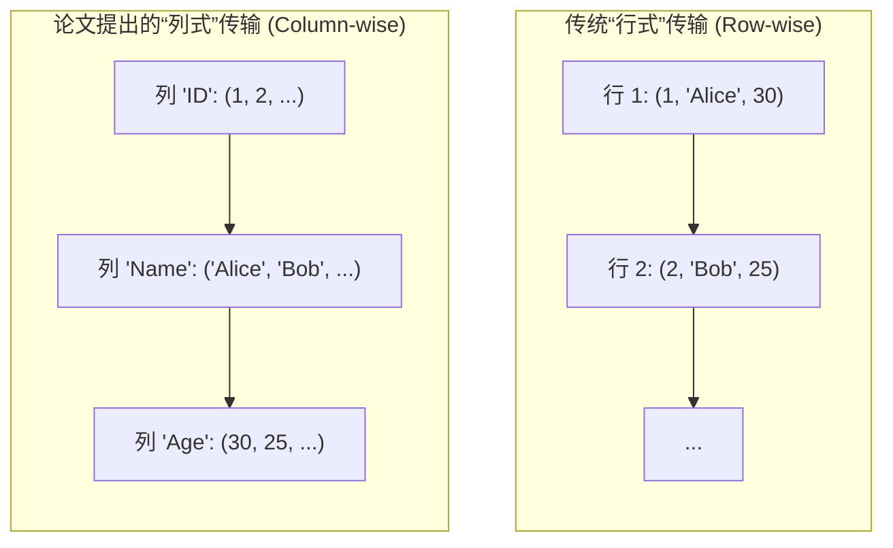

**“列式”传输的好处是什么？**

1.  **开销极低：** 元数据（比如列的类型、名称）只需要在**每一列的开头**发送一次，而不是每一行都发送 。
2.  **压缩率奇高：**
      * **行式压缩：** `(1, 'Alice', 30)` 这种混合数据很难压缩。
      * **列式压缩：** `(1, 2, 3, ...)` 这种纯数字，或者 `('A', 'B', 'A', ...)` 这种纯文本，数据类型和特征都一样，压缩率极高 。
      * **表4**  的实验证明，使用任何压缩算法（LZ4, GZIP等），列式文件的压缩率都远高于行式文件 。  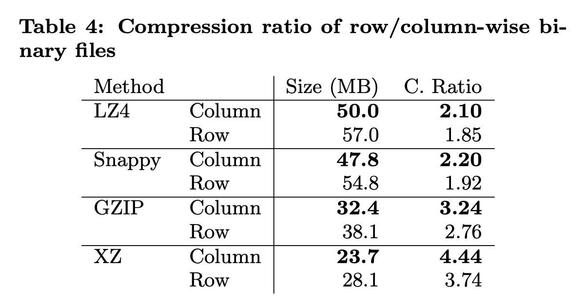  
3.  **适配现代工具：** R 和 Python (Pandas) 本来就是列式存储的 。数据库直接发列式数据过来，客户端拿来就能用，省去了在客户端“行转列”的昂贵开销 。

-----

### 关键内容四：疗效显著——实验结果（“战报”）

作者在PostgreSQL和MonetDB（一个开源列式数据库）中实现了他们的新协议（分别称为 PostgreSQL++ 和 MonetDB++）。

**表10：最终决战——新旧协议对比（Lineitem数据集）** 

| 系统 (System) | 本地 (TLocal) | 局域网 (TLAN) | 广域网 (TWAN) | 传输大小 |
| :--- | :---: | :---: | :---: | :---: |
| (Netcat Baseline) | (9.8s) | (62.0s) | (696.5s) | (7.21GB) |
| **PostgreSQL (旧)** | **205.8s** | 301.1s | 2108.8s | 10.4GB |
| **PostgreSQL++ (新)** | **39.3s** | 46.1s | 518.8s | 5.36GB |
| **MonetDB (旧)** | **222.4s** | 256.1s | 1381.5s | 8.97GB |
| **MonetDB++ (新)** | **10.6s** | 50.3s | 510.8s | 5.80GB |

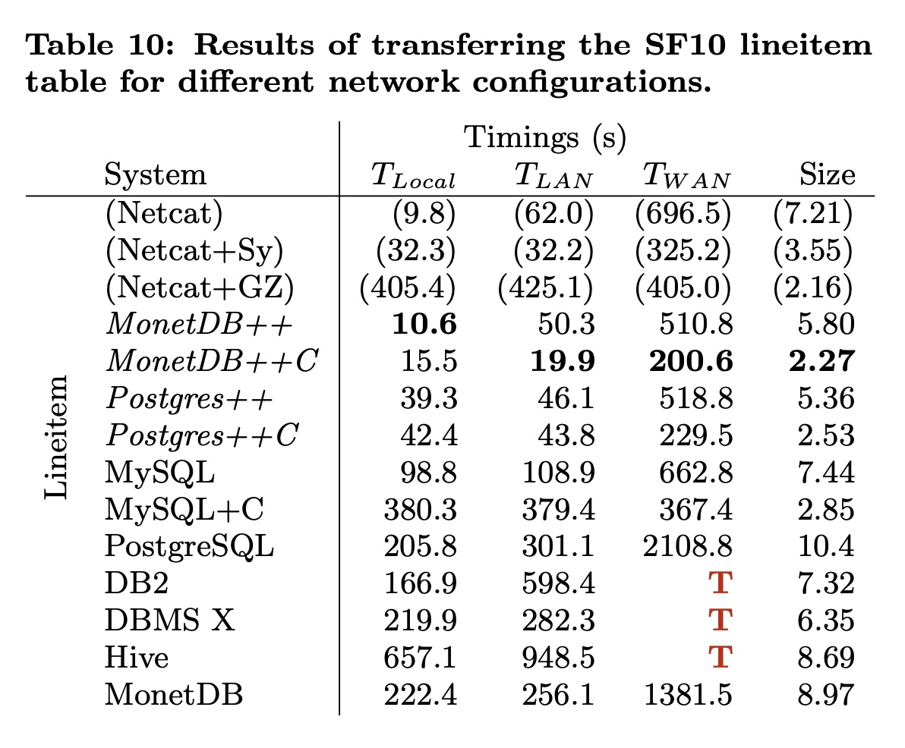  

*(数据来源：论文中的表10，只摘录了关键对比项)* 

**结果震撼：**

1.  **MonetDB++ (新)** 在本地传输只用了 **10.6秒**，几乎达到了Netcat基准的 **9.8秒** 。这证明作者的新协议几乎榨干了所有性能，把老协议浪费的时间全都找了回来。
2.  **PostgreSQL++ (新)** 也从205.8秒缩短到39.3秒，提升了约5倍 。
3.  在广域网（WAN）这种高延迟、低带宽的恶劣网络下，新协议的优势更明显，基本都快了4倍以上。
4.  新协议（尤其是压缩后）的传输体积也更小 。

**结论：** 论文通过实验无可辩驳地证明了，**采用列式序列化协议，可以带来一个数量级（10倍）的性能提升** 。

### 总结

这篇论文是一个“破案”和“解决”的故事：

1.  **破案：** 通过 **图1**，作者证明了数据分析场景下，数据库的真正瓶颈不是计算，而是“结果集序列化(RSS) + 传输”。    
2.  **追凶：** 通过 **图5** 等分析，作者指出“行式”协议的过时设计和大量冗余是元凶。    
3.  **解决：** 作者提出了基于“列式”的新协议，它压缩率高、开销低，并且完美契合现代分析工具。
4.  **结案：** 通过 **表10** 的对比，证明新协议取得了数量级的性能提升，成功“解救”了被“绑架”的数据。    
  
## 3 术语 
  
好的，这篇论文《Don’t Hold My Data Hostage》（别把我的数据当人质）中有很多关键术语。理解了它们，你就能明白为什么从数据库取大量数据会这么慢，以及作者是如何解决这个问题的。

以下是论文中最重要的几个术语及其通俗讲解：

### 1\. 结果集序列化 (Result Set Serialization, RSS)

  * **通俗讲解：** 这是本文**最核心**的术语。当你从数据库查询数据时，数据在服务器内存中是一种特定的（二进制）格式。为了能通过网络（比如网线）发送给你，服务器必须把这些数据“**打包**”成一长串的字节流。这个“打包”的过程就叫**序列化** 。你的电脑收到这串字节流后，还需要“**解包**”（反序列化）来使用数据 。
  * **为什么重要：** 论文的**图1**明确显示，绝大多数数据库（如MySQL, PostgreSQL等）的总耗时（整个柱子）中，绝大部分（蓝色部分）都被“RSS + Transfer”（序列化和传输）所占据 。而查询执行（红色部分）本身其实非常快 。这证明了“打包”和“发送”才是真正的瓶颈。    

### 2\. 客户端协议 (Client Protocol)

  * **通俗讲解：** 这就是数据库服务器（Server）和你的应用程序（Client）之间“沟通的语言” 。它定义了一整套规则，比如：如何登录认证、如何发送SQL查询，以及（本文最关注的）服务器该**以何种格式**把查询结果“打包”（序列化）并发送回来 。
  * **为什么重要：** 论文认为，正是因为现在主流数据库的“客户端协议”设计得太老旧（几十年前为一次只取几行数据的场景设计的），才导致了RSS过程如此低效 。

### 3\. 行式 vs. 列式 (Row-wise vs. Column-wise)

  * **通俗讲解：** 这是数据“打包”的两种不同组织方式。

      * **行式 (Row-wise)：** 也是“行优先”。它先把**第一行**的所有数据打包，再打包**第二行**的所有数据，以此类推 。这是目前绝大多数数据库（如PostgreSQL, MySQL）的默认做法 。
      * **列式 (Column-wise)：** 也是“列优先”。它先把**第一列**的所有数据打包，再打包**第二列**的所有数据，以此类推 。

  * **图示对比：**

    ```mermaid
    graph TD
        subgraph A["传统“行式”打包 (Row-wise)"]
            direction TB
            R1["行 1: (1, 'Alice', 30)"] --> R2["行 2: (2, 'Bob', 25)"] --> R3[...]
        end

        subgraph B["论文提倡的“列式”打包 (Column-wise)"]
            direction TB
            C1["列 'ID': (1, 2, ...)"] --> C2["列 'Name': ('Alice', 'Bob', ...)"] --> C3["列 'Age': (30, 25, ...)"]
        end
    ```

  * **为什么重要：** 论文的核心论点是“列式”打包远优于“行式”。因为同一列的数据类型相同、特征相似（比如全是数字，或全是短字符串），所以“列式”打包的数据**压缩率极高** 。而且，现在的数据分析工具（如Python Pandas或R）内部也是按列存储的，直接接收列式数据可以省去客户端“行转列”的开销 。

### 4\. Netcat (基准)

  * **通俗讲解：** `netcat` (或 `nc`) 是一个非常基础的网络工具，它几乎只做一件事：把数据从一个地方“原封不动”地搬到另一个地方 。
  * **为什么重要：** 在**图1**中，作者用`netcat`传输一个同样大小的CSV文件作为“**基准**”（Baseline）。结果`netcat`只花了**10.25秒** ，而最快的MySQL也花了101.3秒 。这强有力地证明了：网络本身是很快的，是数据库的“客户端协议”导致了90%的额外开销 。

### 5\. 挂钟时间 (Wall clock time)

  * **通俗讲解：** 就是你挂在墙上的钟所走过的时间，即用户感知的“总共花了多长时间” 。
  * **为什么重要：** 这是论文衡量性能的最终指标。**图1**中的所有柱状图（以及**表10**、**表11**中的数据）都是“挂钟时间”，因为它最能反映用户的真实等待体验 。     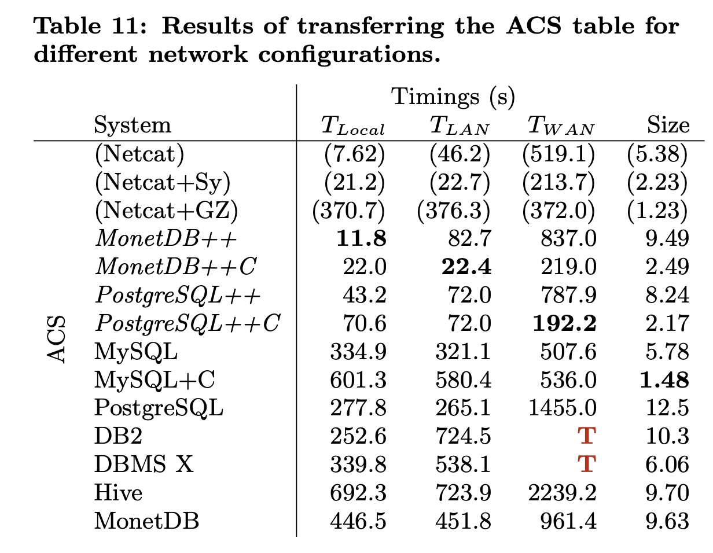  

### 6\. 吞吐量 (Throughput) vs. 延迟 (Latency)

  * **通俗讲解：** 这是衡量网络状况的两个关键指标。
      * **吞吐量 (Throughput)：** 指网络的“带宽”，可以理解为“水管的粗细” 。单位是 Mb/s。吞吐量越低，传输（蓝色条）时间就越长。**图4** 展示了低吞吐量对所有协议的负面影响 。   
      * **延迟 (Latency)：** 指数据“来回一趟”需要的时间，可以理解为“你喊一声，多久能听到回音” 。单位是 ms。
  * **为什么重要：** **图3**显示，高延迟对某些数据库（如DB2和DBMS X）的性能是**致命的** 。作者推测这是因为它们的协议设计了愚蠢的“握手”机制，即每发一小批数据就要等客户端“确认收到”，在高延迟下这会浪费大量时间 。    

### 7\. 序列化格式 (Serialization Format)

  * **通俗讲解：** 指数据被“打包”的具体格式，是文本还是二进制。
  * **为什么重要：** 论文分析了不同数据库的具体格式（如图5到图9所示）。   
      * **PostgreSQL (图5)：** 采用二进制，但**每一行**都带有很多重复的元数据（如总长度、字段数等）。当你有几百万行时，这种冗余开销非常大 。    
      * **MonetDB (图8)：** 采用文本格式，这需要昂贵的“二进制-字符串”转换 。    
      * **MongoDB (表1)：** 序列化后的体积（43.6 GB）是原始CSV（7.19 GB）的6倍 ，因为它在每条记录里都存了字段名 。     
      * **作者的方案 (图10, 图11)：** 采用列式二进制，没有行级开销，非常紧凑 。  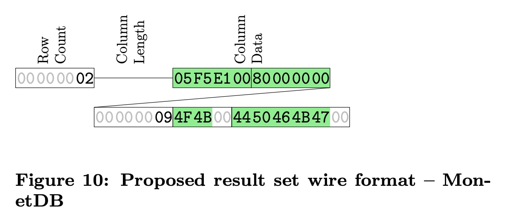   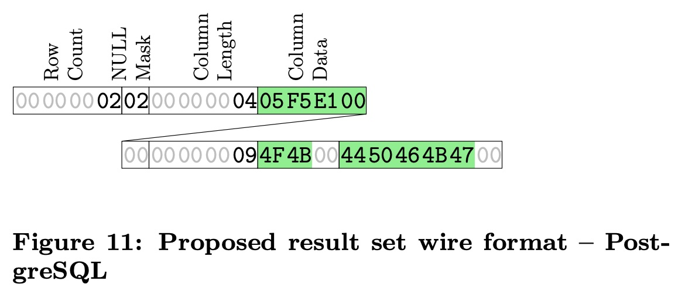  

### 8\. 数据块大小 (Chunk Size)

  * **通俗讲解：** 在作者提出的新“列式”协议中，数据不是一次性把整列发完，而是切分成一个个“数据块”（Chunks）来发送的 。
  * **为什么重要：** **表3** 显示了“数据块大小”的选择很重要 。   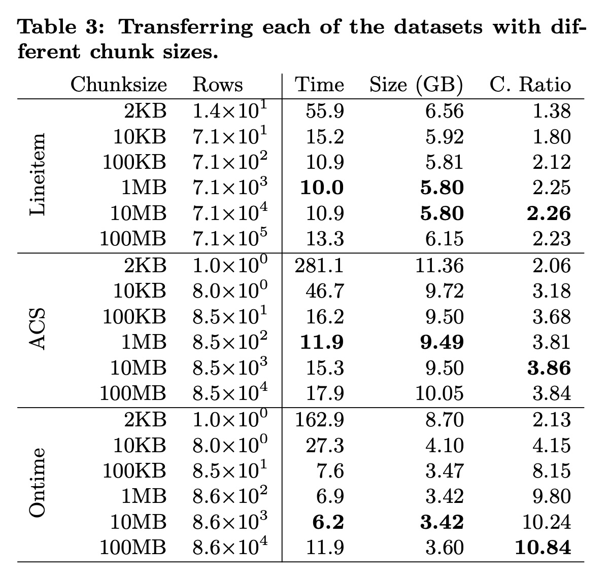 
      * 如果块太小（如2KB），性能会很差，因为失去了列式压缩的优势 。
      * 如果块太大（如100MB），客户端需要占用很多内存来接收 。
      * 实验发现，1MB左右是最佳平衡点 。

希望这些讲解能帮助你更好地理解这篇论文的核心思想！
  
## 参考        
         
https://dl.acm.org/doi/pdf/10.14778/3115404.3115408    
        
<b> 以上内容基于DeepSeek、Qwen、Gemini及诸多AI生成, 轻微人工调整, 感谢杭州深度求索人工智能、阿里云、Google等公司. </b>        
        
<b> AI 生成的内容请自行辨别正确性, 当然也多了些许踩坑的乐趣, 毕竟冒险是每个男人的天性.  </b>        
    
#### [PolarDB 学习图谱](https://www.aliyun.com/database/openpolardb/activity "8642f60e04ed0c814bf9cb9677976bd4")
  
  
#### [PostgreSQL 解决方案集合](../201706/20170601_02.md "40cff096e9ed7122c512b35d8561d9c8")
  
  
#### [德哥 / digoal's Github - 公益是一辈子的事.](https://github.com/digoal/blog/blob/master/README.md "22709685feb7cab07d30f30387f0a9ae")
  
  
#### [About 德哥](https://github.com/digoal/blog/blob/master/me/readme.md "a37735981e7704886ffd590565582dd0")
  
  

  
