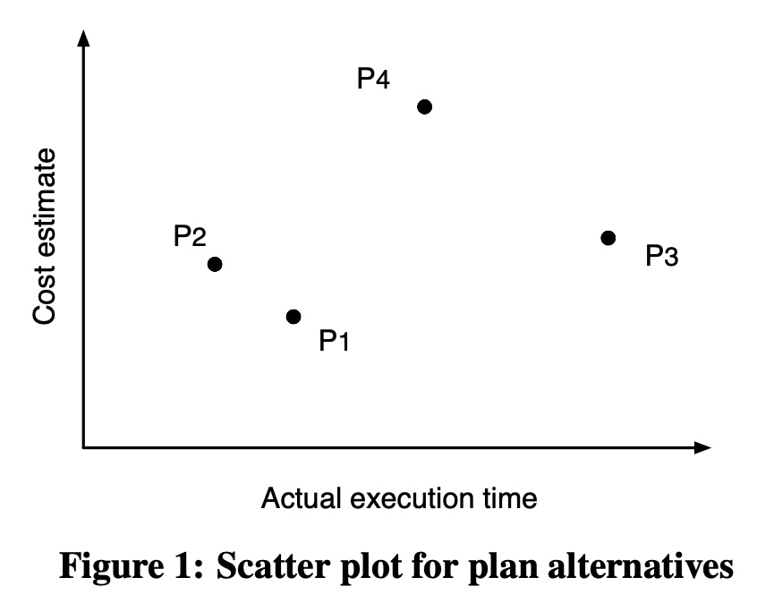
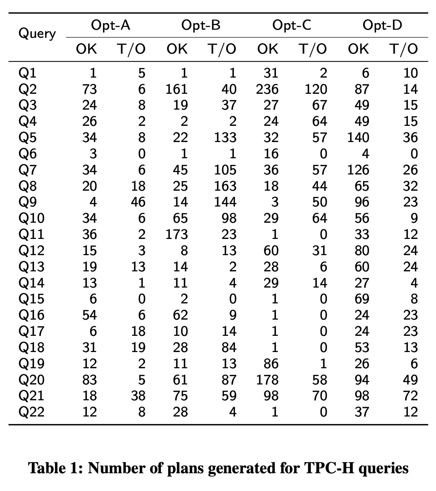
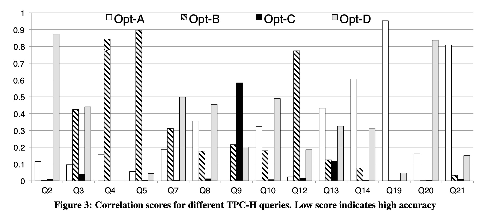
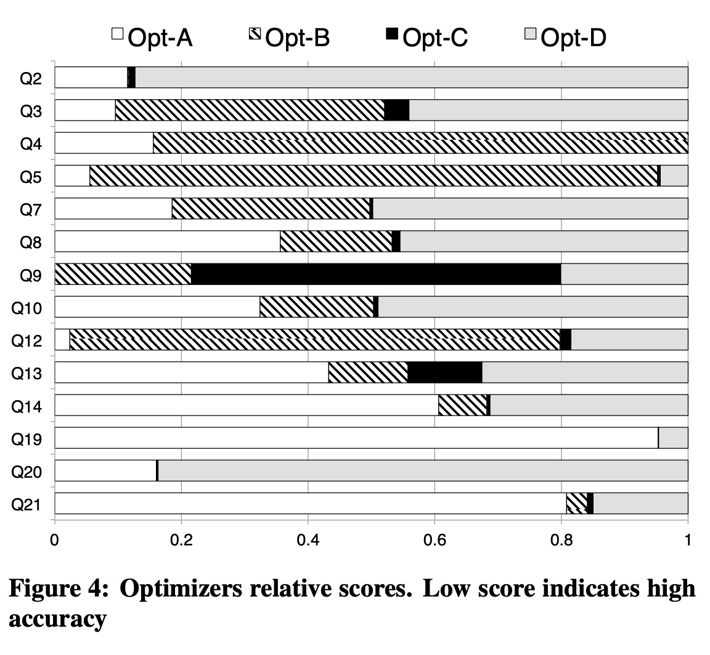
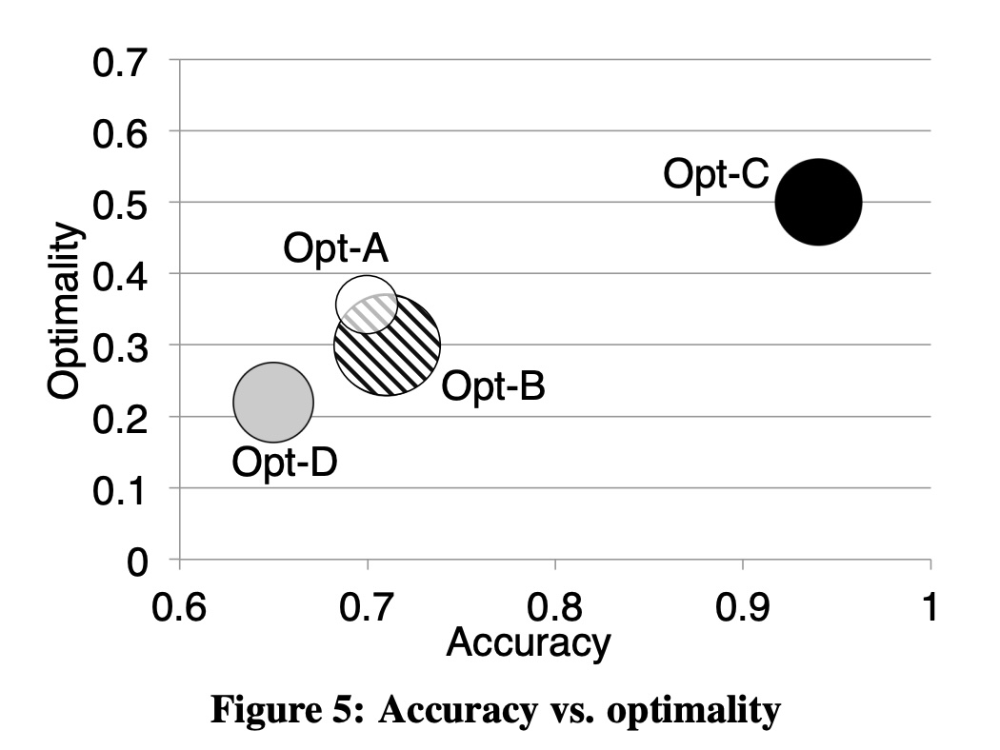
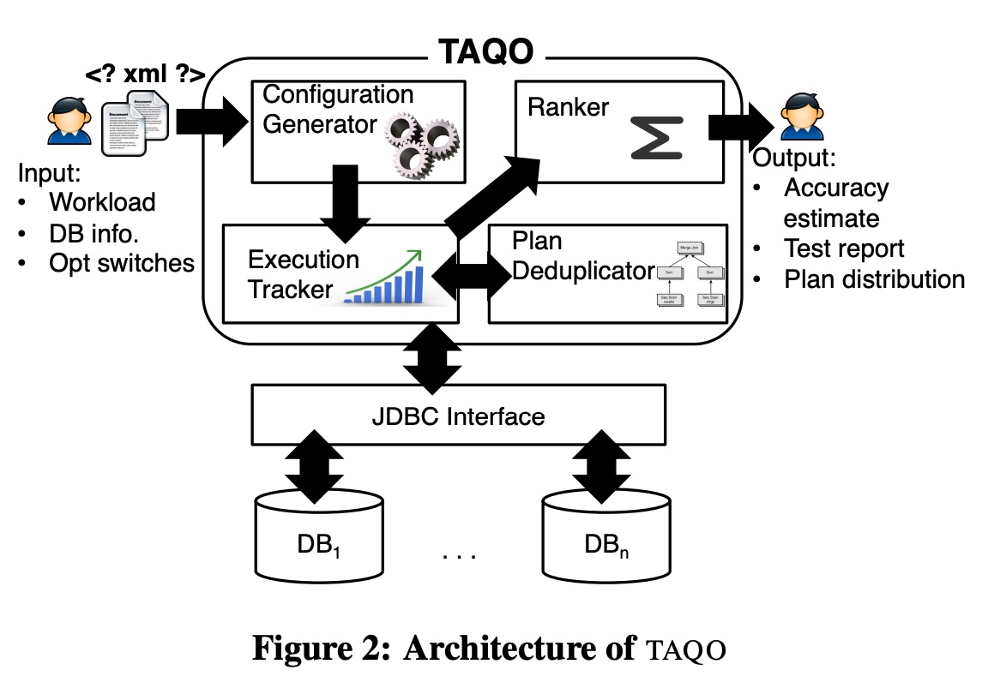
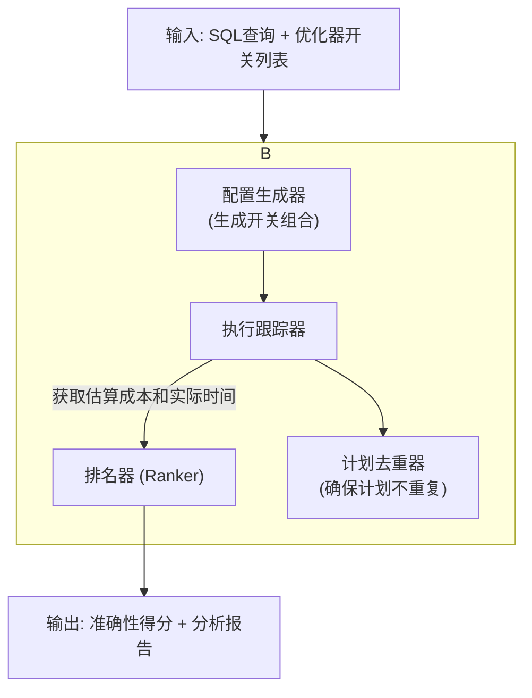
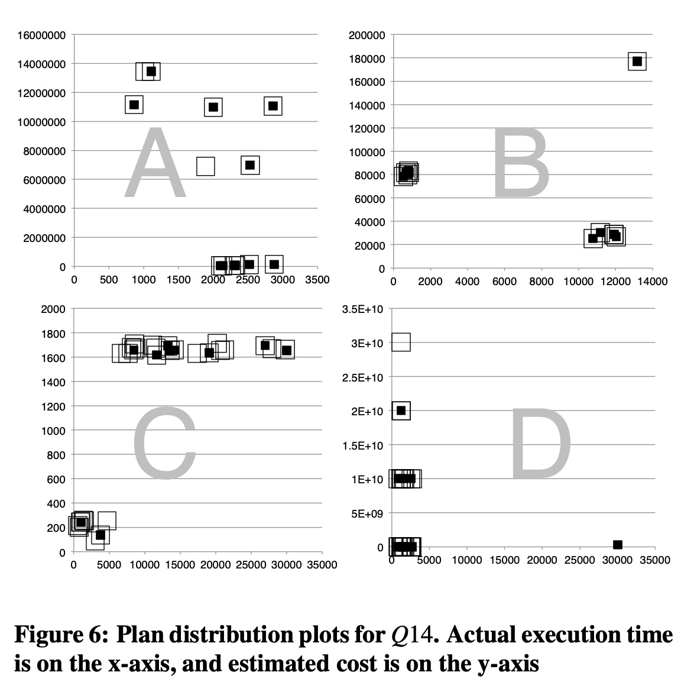
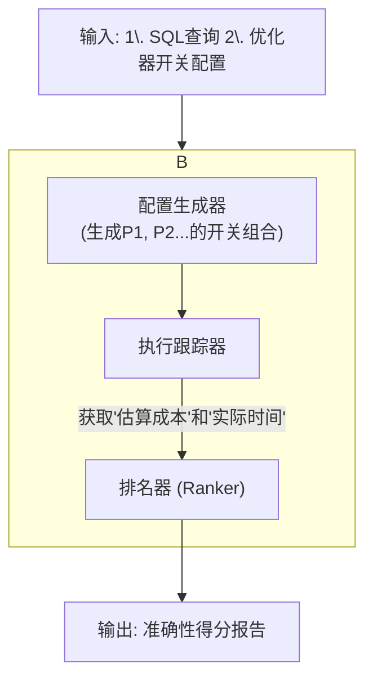

## AI论文解读 | Testing the Accuracy of Query Optimizers
        
### 作者        
digoal        
        
### 日期        
2025-11-07        
        
### 标签        
PostgreSQL , PolarDB , DuckDB , AI , 论文解读        
        
----        
        
## 背景  
      
https://dl.acm.org/doi/pdf/10.1145/2304510.2304525        
  
提示:          
```          
读懂《Testing the Accuracy of Query Optimizers》这篇论文需要提前掌握哪些基础知识, 请使用中文通熟易懂的讲解这些基础知识, 可以引用论文中的图、表或使用Markdown支持的图形(text,mermaid等)增加解释性. 
  
使用中文通熟易懂的解读《Testing the Accuracy of Query Optimizers》这篇论文, 其中的关键内容请着重讲解, 可以引用论文中的图、表或使用Markdown支持的图形(text,mermaid等)增加解释性. 
  
提取《Testing the Accuracy of Query Optimizers》这篇论文中的重要术语, 使用中文对这些术语进行通熟易懂的讲解, 可以引用论文中的图、表或使用Markdown支持的图形(text,mermaid等)增加解释性. 
```     
  
## 1 前置知识 
  
理解这篇名为《Testing the Accuracy of Query Optimizers》（测试查询优化器的准确性）的论文 ，你需要先掌握一些数据库领域的基础知识。这篇论文的核心是关于如何衡量数据库的“大脑”——查询优化器——到底有多“聪明”。

以下是你需要了解的基础知识，我会用通俗易懂的方式来讲解：

### 1\. 什么是数据库查询 (Query)？

  * **通俗理解：** 就像你向图书馆管理员提问：“请帮我找出所有关于计算机科学、在2000年后出版、并且借阅次数超过10次的中文书。”
  * **技术概念：** 在数据库中，这种“提问”通常使用一种叫做 **SQL** (Structured Query Language) 的语言。你的问题会被写成一条SQL语句，数据库会去执行这个语句并返回你想要的数据。

### 2\. 什么是查询优化器 (Query Optimizer)？

  * **通俗理解：** 优化器就是数据库的“大脑”或“首席策略官” 。当你向数据库提问（发送SQL）时，数据库有很多种方法来找到答案。
  * **举个例子：** 还是借书的例子，管理员可以：
      * **方法A：** 遍历图书馆的**每一本书**，逐一检查它是否符合你的所有条件（计算机科学、2000年后、借阅超10次...）。
      * **方法B：** 先去“计算机科学”区域，只看这个区域的书；然后利用索引卡片（如果有的话）快速筛选出2000年后的书；最后再查看这些书的借阅记录。
  * **优化器的职责：** 显然，方法B比方法A快得多。优化器的**唯一工作**就是分析你的查询，然后从成百上千种可能的执行方法中，找出一个它*认为*最快、最省资源的执行方案 。

### 3\. 什么是查询计划 (Query Plan)？

  * **通俗理解：** “查询计划”就是优化器最终选定的那个“方法”或“食谱” 。它是一个详细的步骤指南，告诉数据库引擎应该先做什么、后做什么。
  * **技术概念：** 它会规定是“全表扫描”（像方法A）还是“索引扫描”（像方法B），先连接哪两张表，使用哪种连接算法（比如 Hash Join 或 Nested Loop Join）等等。

### 4\. 什么是基于成本的优化 (Cost-Based Optimization)？

这是理解这篇论文**最核心**的概念。

  * **通俗理解：** 优化器是怎么判断哪个计划“最快”的呢？它靠的是“猜”。它会为每一个可能的查询计划估算一个“成本”（Cost）。
  * **技术概念：** 这个“成本”是一个内部估算值，代表了执行该计划可能需要消耗的资源（比如CPU计算量、磁盘读写次数等）。**重要的是，这个“成本”不等于实际的“秒数”** 。
  * **工作流程：** 优化器会估算所有可能计划的成本，然后选择那个**估算成本最低**的计划去执行 。

-----

### 5\. 论文的核心问题：估算的“成本” vs 实际的“时间”

这篇论文的出发点是：**如果优化器的“估算”不准怎么办？** 

  * **通俗理解：** 就像一个导航App。
      * 它*估算*走A路线需要10分钟（成本低）。
      * 它*估算*走B路线需要30分钟（成本高）。
      * 于是它推荐你走A路线。
      * 但你实际去开，A路线因为突发堵车花了1小时；而B路线上畅通无阻，只需要20分钟。
  * **论文的关注点：** 在这个例子中，导航App（优化器）做出了一个糟糕的选择，因为它*错误地*估算了成本。这篇论文就是要设计一种方法，来衡量优化器到底有多“准”。

这篇论文的 **图1 (Figure 1)**  完美地展示了这一点。它把不同的查询计划（P1, P2...）画在一个图上：    

  * **X轴（横轴）：** 实际执行时间 (Actual execution time) 
  * **Y轴（纵轴）：** 优化器的估算成本 (Cost estimate) 

你可以用下面的文本图来理解：

```text
  ^
  | P4
  | (估算成本高)
  |
  |    P2
  |
  |         P3
  |    P1
  | (估算成本低)
  +----------------------------------->
    (实际时间短)      (实际时间长)
```

  * **理想情况：** 一个完美的优化器，它估算的排名应该和实际时间的排名*完全一致* 。即：实际最快的计划（如P1），它的估算成本也应该是最低的。所有点应该大致在一条**从左下到右上**的斜线上。
  * **糟糕情况：** 看看图中的 P1 和 P2。P1 的实际时间比 P2 **更短** (P1在P2的左边)，但优化器却*错误地认为* P2 的成本更低 (P2在P1的下面)。如果优化器默认选择了P2（因为它估算成本低），系统性能就受损了。

-----

### 6\. 什么是优化器提示 (Optimizer Hints)？

  * **通俗理解：** 这就是论文作者用来“做实验”的工具。通常，优化器只会给你它认为最好的那个计划（默认计划）。但作者想测试*其他*计划。
  * **技术概念：** "Hints" 或 "Switches" 是一种特殊的指令，你可以强行告诉优化器：“不要用你默认的方法，**必须**使用A方法”或“**禁止**使用B方法” 。
  * **论文中的用法：** 作者利用这些“提示”，为*同一个*查询生成了*许多不同*的查询计划（比如图1中的P1, P2, P3, P4），然后记录下每个计划的“估算成本”和“实际时间” 。    

### 7\. 什么是排名相关性 (Rank Correlation)？

  * **通俗理解：** 这是论文用来打分的方法。想象有两组排名：
      * **排名A (估算排名)：** 优化器*认为*的计划好坏排名。
      * **排名B (实际排名)：** 实际跑一遍*真正*的好坏排名。
  * **论文的方法：** 衡量这两组排名的“相似度” 。如果两组排名几乎一样（估算第一的就是实际第一，估算第二的就是实际第二...），那说明优化器非常**准确** (Accuracy 高) 。如果两组排名乱七八糟（估算第一的实际是倒数第一），那优化器就非常**不准**。
  * **技术概念：** 论文使用了统计学上的“肯德尔等级相关系数 (Kendall's Tau)”  作为基础来计算这个分数。

### 8\. 什么是基准测试 (Benchmark, e.g., TPC-H)？

  * **通俗理解：** TPC-H 就像一套标准的“高考模拟卷” 。它包含了一系列复杂的数据查询（如论文中表格1里的 Q1, Q2, ... Q22 ）。    
  * **论文中的用法：** 作者使用这套标准考卷，去“拷问”不同的数据库（论文里匿名为 Opt-A, Opt-B, Opt-C, Opt-D ），看看它们各自的优化器“准确性”得分如何。

-----

### 总结

要读懂这篇论文，你需要理解：

1.  数据库的“大脑”（**优化器**） 会为你的查询（SQL）制定一个“食谱”（**查询计划**）。
2.  它通过“估算成本”（**CBO**） 来挑选它认为最好的那个计划。
3.  但这篇论文的核心是：**它的“估算”不一定准**。
4.  论文的**方法**是：使用“提示”（**Hints**） 强迫数据库生成*很多*不同的计划。
5.  然后比较“估算的排名”和“实际的排名”的**相关性**（**Rank Correlation**），以此来给优化器的“准确性”打分。

掌握了这些概念，你就能看懂论文中的图表（如 Figure 3, 4, 5）是如何比较不同数据库优化器（Opt-A, B, C, D）的优劣了。        

如果您希望我更详细地解释其中任何一个概念（比如“成本估算”或“排名相关性”），请随时告诉我。
  
## 2 解读论文 
  
这是一篇关于如何**客观、量化地“测试”数据库“大脑”——查询优化器（Query Optimizer）——到底有多聪明**的论文。

论文的核心思想是：不要只看优化器*默认*选择的那个执行计划，而是要**迫使**它生成许多*不同*的计划，然后比较它对这些计划的“估算成本排名”与“实际执行时间排名”是否一致 。

以下是对这篇论文关键内容的通俗解读：

### 1\. 核心问题：优化器的好坏很难衡量

每个数据库系统都有一个查询优化器，它的工作是在你发送一条SQL查询时，从成百上千种可能的执行方式（“查询计划”）中，找出一个它*认为*成本最低（即最快）的方案 。

但这里有两个大问题：

1.  **“成本”不是“时间”：** 优化器估算的“成本”是一个内部单位，不等于实际的秒表时间 。你不能拿A数据库的“成本=1000”和B数据库的“成本=50”来比较 。
2.  **“黑盒”问题：** 优化器通常只给你它认为最好的那个计划。你无从得知它是否错过了一个*实际*快100倍、但它*错误地认为*很慢的“神仙”计划 。

一个糟糕的计划选择可能导致查询性能相差几个数量级（比如几秒钟 vs 几小时） ，但业界一直缺少一个标准方法来独立测试优化器的*准确性* 。

### 2\. 论文的创新解法：比较“估算排名”和“实际排名”

作者提出了一个名为 **TAQO (Testing the Accuracy of Query Optimizers)** 的框架 ，其核心步骤如下：

**第1步：生成大量备选计划**
作者利用了几乎所有数据库都提供的一种功能：“优化器提示（Hints）”或“开关（Switches）” 。这就像是强行对优化器说：“你这次**不准**用Hash Join”或“你**必须**用Nested Loop Join”。通过排列组合这些开关，TAQO可以为*同一个查询*生成大量不同的查询计划 。

**第2步：获取“估算成本”和“实际时间”**
对于生成的每一个计划（比如P1, P2, P3...），TAQO会做两件事：

1.  **记录估算成本 (e)：** 从查询计划中读取优化器给它的“估算值” 。
2.  **记录实际时间 (a)：** 真正去执行这个计划，用秒表掐算出它*实际*运行了多久 。

**第3步：核心思想——对比排名**
这篇论文的精髓在 **图1 (Figure 1)**。它展示了一个散点图，X轴是“实际执行时间”，Y轴是“估算成本” 。    

我们可以用一个简化的文本图来理解：

```text
  ^ 估算成本 (Cost estimate)
  |
  |     P4 (估算高, 实际慢)
  |
  | P2 (估算低, 实际快)
  |
  |           P3 (估算高, 实际慢)
  |
  |     P1 (估算低, 实际更快)
  |
  +----------------------------------->
       (快)  实际执行时间 (Actual time)  (慢)
```

  * **一个“完美”的优化器：** 应该让所有点（P1, P2...）大致分布在一条从左下到右上的斜线上。即：实际越快的计划（X轴靠左），它的估算成本（Y轴）也应该越低。
  * **一个“糟糕”的优化器：** 就像上图中的 P1 和 P2。P1 明显比 P2 *实际执行*得快（P1在P2的左边），但优化器却*错误地认为* P2 的成本更低（P2在P1的下面）。如果优化器默认选择了P2，它就犯了一个错误。

TAQO会计算这两组排名（估算排名 vs 实际排名）的**相关性得分**（基于Kendall's Tau） 。如果两组排名高度一致，得分就高（准确性高）；如果排名一团糟，得分就低（准确性低）。

### 3\. TAQO：自动化测试框架

为了实现上述想法，作者构建了一个工具（TAQO），其架构如 **图2 (Figure 2)** 所示 。    

我们可以用一个流程图来简化理解它的工作流：



  * **配置生成器 (Configuration Generator):** 负责排列组合不同的优化器开关（比如“开启Hash Join”、“关闭Index Scan”） 。
  * **执行跟踪器 (Execution Tracker):** 负责运行每个计划并计时 。它还会设置超时，防止某个糟糕的计划跑太久 。
  * **计划去重器 (Plan Deduplicator):** 确保不同的开关组合真的产生了*不同*的执行计划 。
  * **排名器 (Ranker):** 核心计算模块，用于计算最终的“准确性得分” 。

### 4\. 惊人的关键发现：四大数据库对比

作者使用 TPC-H 基准测试（一套标准的数据库“考卷”） ，匿名测试了四个主流商业数据库（称为 Opt-A, Opt-B, Opt-C, Opt-D） 。

#### 关键发现一 (图5)：准确性 (Accuracy) vs. 最优性 (Optimality)

**图5 (Figure 5)** 是本文最重要的总结图表 。    

  * **X轴 (Accuracy)：** 准确性。代表优化器的“排名能力”有多准（得分越靠右越好） 。
  * **Y轴 (Optimality)：** 最优性。代表优化器*默认选择*的那个计划，有多大概率*恰好*是所有备选计划中*实际最快*的那个（得分越靠上越好） 。
  * **气泡大小：** 代表该系统能生成的备选计划数量 。

**解读图5：**

  * **Opt-C (右上角)：** 是明显的赢家。它不仅“排名”排得最准（Accuracy最高），而且它默认“选择”的那个计划也最常是最好的（Optimality最高） 。
  * **Opt-D (左下角)：** 是明显的输家。它的排名能力很差，而且默认选择的计划也经常不是最好的 。
  * **Opt-A 和 Opt-B：** 表现平平，处于中间位置 。

#### 关键发现二 (图6)：为什么Opt-D这么差？

**图6 (Figure 6)** 深入分析了四大系统在处理查询Q14时的散点图 。    

  * **图 6 - C (Opt-C)：** 表现很好。点基本呈上升趋势 。这说明它的估算成本（Y轴）和实际时间（X轴）匹配得很好。
  * **图 6 - D (Opt-D)：** 表现非常糟糕。
      * 请看图 D 的**左下角**：那里本应是“估算成本低、实际时间短”的最佳计划，但几乎是空的。
      * 再看图 D 的**右下角**：优化器*错误地*给了这些计划极低的“估算成本”（Y轴很低），但它们*实际*运行时间非常长（X轴靠右） 。
      * 再看图 D 的**左上角**：优化器*又错误地*给了那个实际最快的计划（X轴最靠左）一个非常高的“估算成本”（Y轴很高） 。

**这说明 Opt-D 的成本模型在 Q14 上完全是错乱的 ，这导致了它在图5中的低分。**    

### 总结

这篇论文的重大贡献在于，它提出了**第一个通用的、可自动化的框架（TAQO）** ，使得人们终于可以摆脱“只看默认计划”的局限，转而通过“强制生成多计划并比较排名”的方式，来**客观地量化和比较**不同数据库优化器的*准确性* 。

实验结果表明，不同商业数据库优化器的准确性确实存在**巨大差异** ，这项工作为数据库开发商改进优化器、防止性能退化提供了有力的工具 。
  
## 3 术语 
  
好的，这篇论文《Testing the Accuracy of Query Optimizers》（测试查询优化器的准确性）中有很多专业术语。以下是其中最关键术语的通俗解读，并会引用论文中的图表来辅助解释。

### 1\. 查询优化器 (Query Optimizer)

  * **通俗讲解：**
    它就像数据库的“大脑” 。当你用SQL（查询语言）向数据库“提问”时，数据库有很多种方法来找出答案（比如先查A表还是先查B表）。优化器的工作就是分析你的问题，然后从成百上千种可能的执行方案中，挑选出一个它*认为*最高效、最省资源的方案 。
  * **论文中的重要性：**
    优化器的“聪明”程度（即准确性）直接决定了数据库的查询速度 。一个坏的选择可能导致查询慢上千倍 。

### 2\. 查询计划 (Query Plan / Plan)

  * **通俗讲解：**
    这就是优化器最终选定的那个“执行方案”或“作战地图” 。它详细说明了数据库应该按什么步骤去获取数据，比如：
    1.  第一步：扫描 A 表。
    2.  第二步：使用哈希连接 (Hash Join) 的方式关联 B 表 。
    3.  第三步：对结果进行排序。
  * **论文中的重要性：**
    这篇论文的核心就是通过比较*不同*计划的好坏，来反推优化器到底准不准 。

### 3\. 成本模型 (Cost Model)

  * **通俗讲解：**
    这是优化器内部的一套“估价系统”或“计算公式” 。优化器依靠这个模型来“猜测”执行一个查询计划大概需要多少“成本”（比如要读多少次硬盘、要用多少CPU） 。
  * **论文中的重要性：**
    成本模型是优化器的核心 。如果这个“估价系统”不准，优化器就会做出错误的选择 。这篇论文测的“准确性”，本质上就是在测这个成本模型的准确性 。

### 4\. 估算成本 (Estimated Cost) vs. 实际成本 (Actual Cost)

这是理解本论文**最核心**的一对术语。

  * **估算成本 (e)：**
    优化器*通过成本模型“猜”出来*的数值 。这个值没有固定单位，它只用于在*同一个查询*的*不同计划*之间进行比较（比如计划A的估算成本是1000，计划B是500，优化器就会选B） 。
  * **实际成本 (a)：**
    这个计划*真正*在机器上运行所花费的时间 ，比如5.2秒。这是衡量计划好坏的“黄金标准”。

**图解 (基于论文图1 )：**

论文中的 **图1 (Figure 1)**  完美地展示了这种差异。    

```text
  ^ 估算成本 (Estimated Cost)
  |
  |     P4
  |
  | P2
  |
  |           P3
  |
  |     P1
  |
  +----------------------------------->
       (快)  实际执行时间 (Actual Time)  (慢)
```

  * **看 P1 和 P2：** P1 的实际时间比 P2 **更短**（P1在P2的左边），但优化器却*错误地认为* P2 的成本更低（P2在P1的下面）。
  * **看 P3 和 P4：** P4 的估算成本和实际时间都比 P3 高。在这里优化器做出了正确的排序。

### 5\. 准确性 (Accuracy)

  * **通俗讲解：**
    论文对“准确性”的定义很简单：就是优化器“排序”的能力 。
    一个“准确”的优化器，应该能正确地给计划排名。如果它估算计划A比计划B好，那么计划A的*实际运行时间*也必须比计划B短 。
  * **图解：**

<!-- end list -->

```text
    如果 优化器估算： Plan A (成本50) < Plan B (成本100)
    
    那么 实际执行时： Plan A (时间3秒) < Plan B (时间10秒)
    
    ===> 这种情况就是 "准确" (Accurate)
```

### 6\. 提示 (Hints) / 开关 (Switches)

  * **通俗讲解：**
    这是一种“作弊”或“干预”手段，让用户可以*强迫*优化器使用或禁用某个特定的执行方式 。
      * 例如：`/*+ NO_HASH_JOIN */` (强制优化器不要使用Hash Join)。
  * **论文中的重要性：**
    这是作者用来“做实验”的关键工具。通过不断切换这些“开关”，作者能迫使优化器为同一个查询生成大量*不同*的查询计划（P1, P2, P3...），而不仅仅是它默认选的那一个 。没有这个工具，就无法收集到图1里的那些数据点。    

### 7\. TAQO (Testing the Accuracy of Query Optimizers)

  * **通俗讲解：**
    就是这篇论文作者开发的这个“优化器准确性自动化测试框架”的名字缩写 。
  * **图解 (基于论文图2 )：**    
    TAQO 框架的简易工作流程如下：




  * **配置生成器 (Configuration Generator):** 负责排列组合不同的开关 。
  * **执行跟踪器 (Execution Tracker):** 负责去数据库里真正执行这些计划，并掐表计时 。
  * **排名器 (Ranker):** 负责计算“估算排名”和“实际排名”之间的差异，最后给出一个总分 。

### 8\. 排名相关性 (Rank Correlation)

  * **通俗讲解：**
    一种统计学方法，用来衡量两组排名的“相似度” 。这篇论文用它来计算“估算成本排名”和“实际时间排名”到底有多一致。
      * **高相关性：** 估算的排名 ≈ 实际的排名。（优化器很准）
      * **低相关性：** 估算的排名和实际的排名一团糟。（优化器不准）
  * **论文中的重要性：**
    这是TAQO框架中“排名器 (Ranker)”  模块的核心算法。论文基于 Kendall's Tau (肯德尔等级相关系数)  来计算这个分数。

### 9\. 最优性 (Optimality)

  * **通俗讲解：**
    这是一个与“准确性”相关但不同的概念。
      * **准确性 (Accuracy):** 衡量优化器对*所有*计划的*排序*能力（如上文所述）。
      * **最优性 (Optimality):** 只看一个点——优化器*默认选择*的那个计划（Default Plan） ，是不是*恰好*就是所有备选方案中*实际最快*的那一个 。
  * **论文中的重要性：**
    **图5 (Figure 5)**  就同时比较了这两个指标。    
      * **Opt-C** 不仅“准确性”高（X轴靠右），“最优性”也很高（Y轴靠上），说明它既排得准，也选得对 。
      * **Opt-D** 则两项得分都很低 。

### 10\. 计划分布图 (Plan Distribution Plot)

  * **通俗讲解：**
    就是 **图6 (Figure 6)**  那样的散点图，它把一个查询的所有备选计划都画了出来。   
      * X轴 = 实际执行时间 
      * Y轴 = 估算成本 
  * **论文中的重要性：**
    这种图可以非常直观地看出一个优化器“犯错”的模式。
      * **好的优化器 (如图6中的Opt-C):** 点应该大致呈一条“左下到右上”的斜线，说明估算和实际基本匹配 。
      * **差的优化器 (如图6中的Opt-D):**
          * **右下角**有密集的点：说明优化器*严重低估*了这些“慢计划”的成本 。
          * **左上角**有密集的点：说明优化器*严重高估*了这些“快计划”的成本 。
  
## 参考        
         
https://dl.acm.org/doi/pdf/10.1145/2304510.2304525    
        
<b> 以上内容基于DeepSeek、Qwen、Gemini及诸多AI生成, 轻微人工调整, 感谢杭州深度求索人工智能、阿里云、Google等公司. </b>        
        
<b> AI 生成的内容请自行辨别正确性, 当然也多了些许踩坑的乐趣, 毕竟冒险是每个男人的天性.  </b>        
    
#### [PolarDB 学习图谱](https://www.aliyun.com/database/openpolardb/activity "8642f60e04ed0c814bf9cb9677976bd4")
  
  
#### [PostgreSQL 解决方案集合](../201706/20170601_02.md "40cff096e9ed7122c512b35d8561d9c8")
  
  
#### [德哥 / digoal's Github - 公益是一辈子的事.](https://github.com/digoal/blog/blob/master/README.md "22709685feb7cab07d30f30387f0a9ae")
  
  
#### [About 德哥](https://github.com/digoal/blog/blob/master/me/readme.md "a37735981e7704886ffd590565582dd0")
  
  

  
