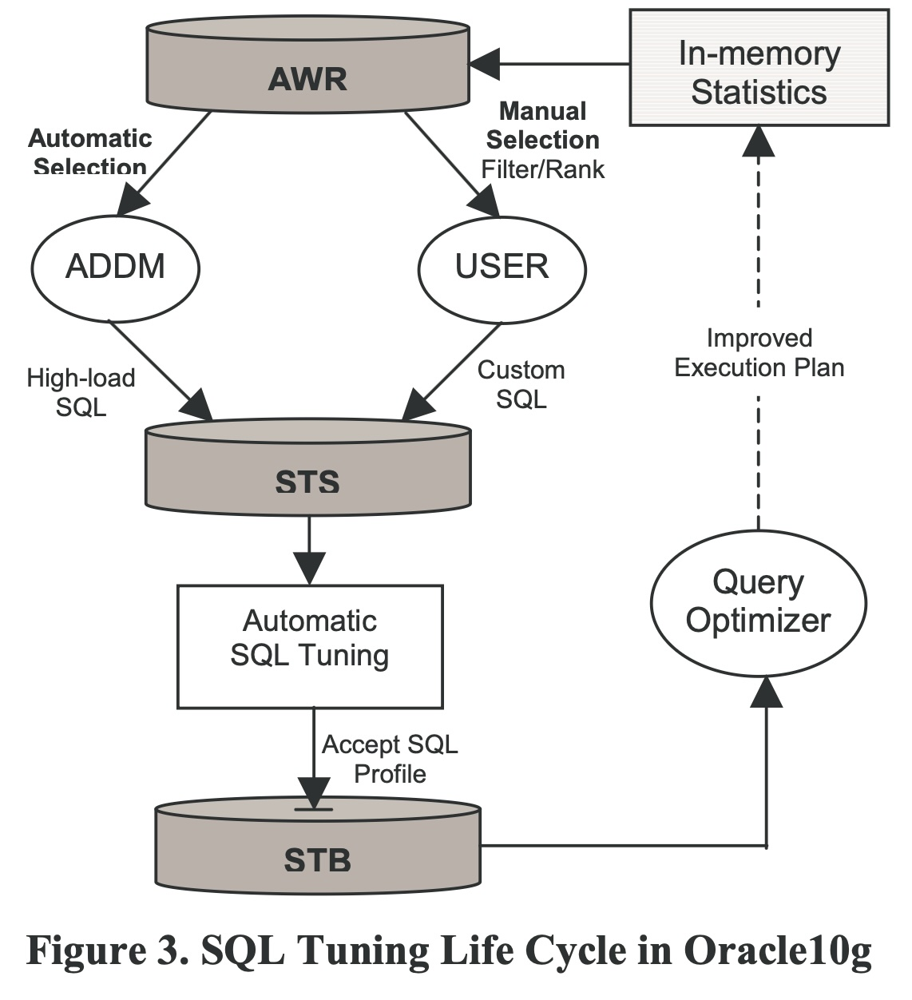
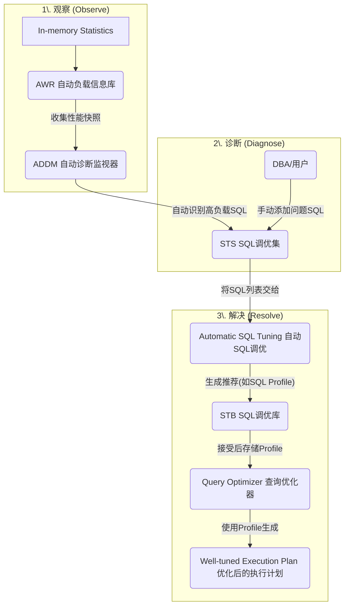
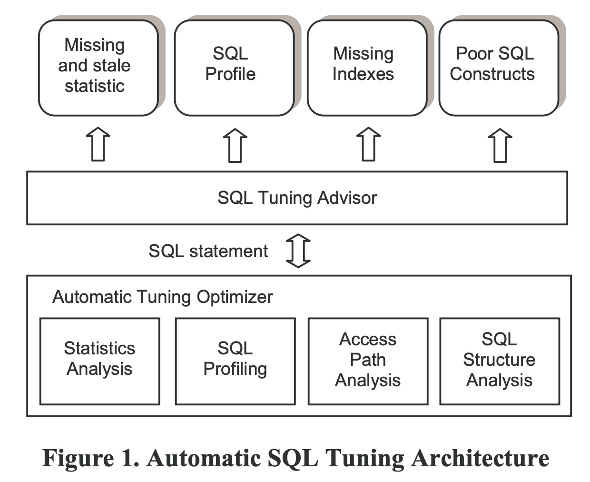
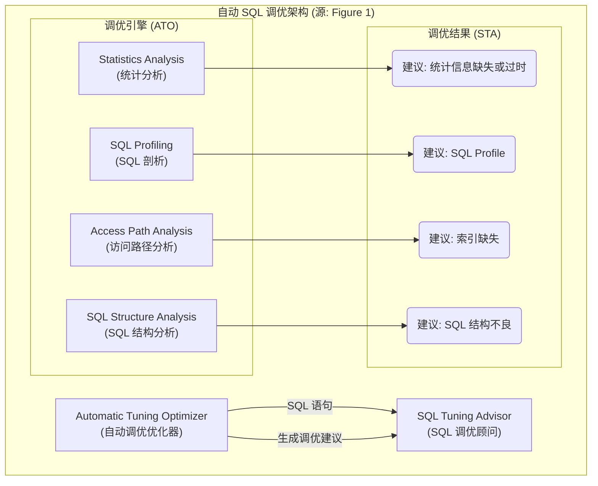
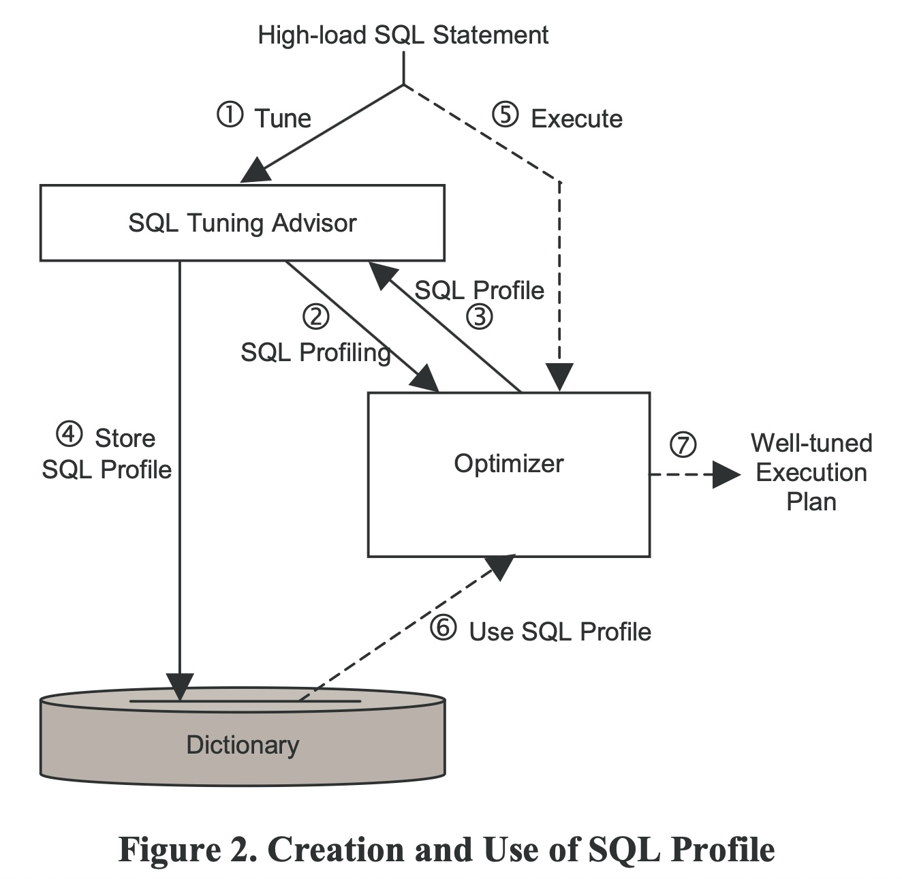
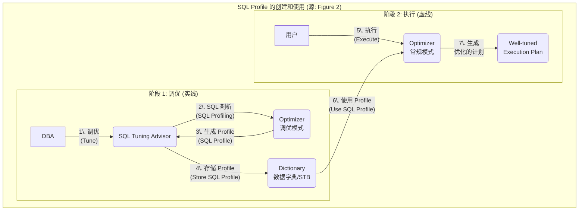
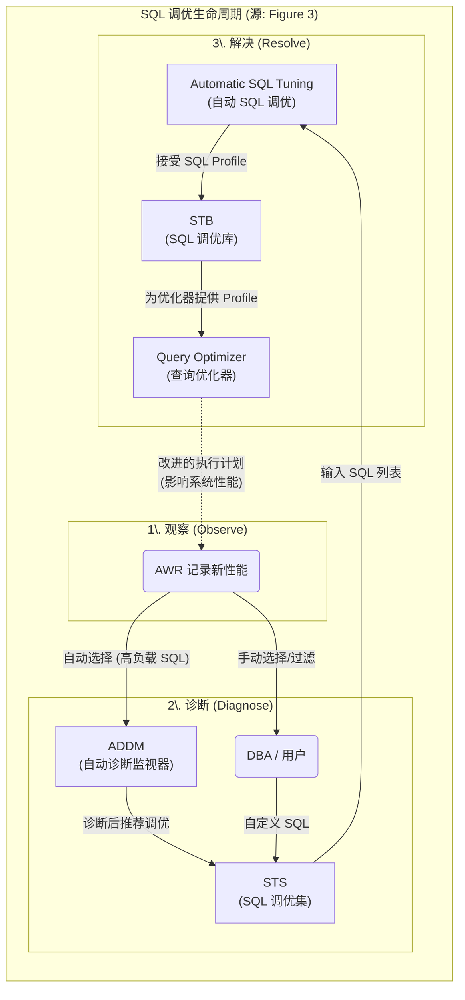
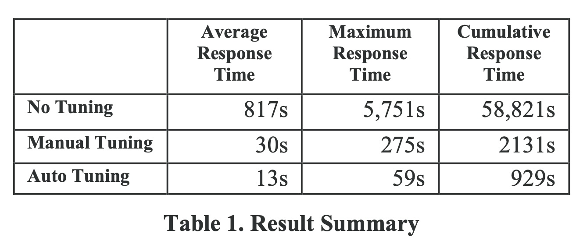

## AI论文解读 | Automatic Sql Tuning In Oracle 10G
        
### 作者        
digoal        
        
### 日期        
2025-11-07        
        
### 标签        
PostgreSQL , PolarDB , DuckDB , AI , 论文解读        
        
----        
        
## 背景  
      
https://github.com/lonng/db-papers/blob/main/papers/diagnosis-and-tuning/automatic-sql-tuning-in-oracle-10g.pdf        
  
提示:          
```          
读懂《Automatic Sql Tuning In Oracle 10G》这篇论文需要提前掌握哪些基础知识, 请使用中文通熟易懂的讲解这些基础知识, 可以引用论文中的图、表或使用Markdown支持的图形(text,mermaid等)增加解释性. 
  
使用中文通熟易懂的解读《Automatic Sql Tuning In Oracle 10G》这篇论文, 其中的关键内容请着重讲解, 可以引用论文中的图、表或使用Markdown支持的图形(text,mermaid等)增加解释性. 
  
提取《Automatic Sql Tuning In Oracle 10G》这篇论文中的重要术语, 使用中文对这些术语进行通熟易懂的讲解, 可以引用论文中的图、表或使用Markdown支持的图形(text,mermaid等)增加解释性. 
```     
  
## 1 前置知识 
  
要完全理解《Automatic SQL Tuning in Oracle 10g》这篇论文 ，您需要先掌握一些数据库管理和性能优化的核心基础知识。这篇论文介绍的是一项自动化技术，旨在解决 SQL 调优这个“非常关键”  且“ inherently complex (天生复杂)”  的任务。

通俗来说，SQL 调优就像是为数据库的“数据查询”任务寻找一条最快、最省力的执行路径。

以下是理解这篇论文所需的基础知识，我会用尽量易懂的方式讲解：

### 1\. 核心概念：什么是“执行计划” (Execution Plan)？

您可以把“查询优化器”（Query Optimizer）想象成一个数据库内置的“GPS导航系统” 。

  * **您下达的 SQL 语句：** 就像是您输入的目的地（“我想从用户表、订单表、商品表里找出A客户的所有消费记录”）。
  * **执行计划 (Execution Plan)：** 就像是 GPS 计算出的具体路线（“路线1：先访问用户表，再访问订单表... 路线2：先访问订单表，再...”）。

同一个 SQL 查询可以有多种执行计划，有的效率极高（几毫秒），有的则可能导致系统卡死（几小时）。SQL 调优的**首要目标**就是让优化器选择一个最高效的“执行计划” 。

### 2\. 优化的依据：“成本” (Cost) 和“统计信息” (Statistics)

“GPS导航系统”（优化器）是如何判断哪条“路线”（执行计划）更好的呢？它依赖两个东西：

  * **统计信息 (Statistics)：** 这就像是 GPS 依赖的“地图数据”和“实时路况”。它告诉优化器：

      * 这张表有多大？（有多少行数据）
      * 这条路（某个列）上的数据分布是否均匀？（例如，性别列只有“男/女”，而身份证列则几乎不重复）
      * 数据库系统当前的负载情况等。

  * **成本 (Cost)：** 优化器会利用“统计信息”去*估算*每条执行计划（路线）需要花费的“成本”（比如预估的 I/O、CPU 消耗）。它会选择一个它认为“总成本”最低的计划。

**这会带来一个关键问题：** 如果“地图数据”错了，或者“路况”过时了（即**统计信息丢失或陈旧** ），那么 GPS（优化器）就很可能会估算错误，从而选出一条很慢的“次优计划” (sub-optimal plan) 。

### 3\. 传统调优的“三板斧”

在 Oracle 10g 的自动化功能出现之前，数据库管理员 (DBA) 主要是“手动”进行调优。这篇论文提到的自动化功能，就是为了解决这些手动任务的复杂性 。您需要了解这些传统方法：

1.  **改善访问结构 (Access Design)：**

      * **最常见的就是“创建索引” (Index)** 。
      * **通俗比喻：** 索引就像是为一本书创建“目录”。没有索引，查询数据（比如找一个词）就需要“全表扫描” (Full Table Scan)，即从第一页翻到最后一页 。有了索引（目录），就可以快速定位 。
      * *论文对应功能：* **Access Path Analysis (访问路径分析)** 。

2.  **改善 SQL 设计 (SQL Design)：**

      * **即“重写 SQL 语句” (Rewrite the SQL)** 。
      * **通俗比喻：** 有时候您向 GPS 提问的方式很绕（“我想去那个离A公园很近、B商店对面的地方”），导致它无法优化。如果您能把 SQL 写得更直接（“我想去C地址”），优化器就能更好地理解。
      * 例如，论文中提到，有时把 `UNION`（会去重，很慢）改成 `UNION ALL`（不去重，很快）会极大提升性能 。
      * *论文对应功能：* **SQL Structure Analysis (SQL 结构分析)** 。

3.  **改善优化器环境 (Optimizer Environment)：**

      * **即“更新统计信息”**  或**使用“提示” (Hints)** 。
      * **通俗比喻：** “更新统计信息”就像是告诉 GPS：“嘿，你的地图该更新了！”。“提示” (Hints) 则更强硬，像是手动指定：“我不管你怎么想，就必须走这条路（比如强制使用某个索引）” 。

### 4\. 论文的核心创新：SQL Profiling (SQL 剖析)

这是理解这篇论文**最重要**的知识点。

前面提到，优化器会因为“统计信息不准”而选错路 。传统的做法（上面的“三板斧”）是修正地图（更新统计）、重建道路（加索引）或强行改路线（用 Hints）。

Oracle 10g 提出的 **SQL Profiling**  是一种全新的思路：

  * **它承认“地图（统计信息）可能就是不准的”** 。
  * 它通过一个叫“自动调优优化器”(Automatic Tuning Optimizer)  的工具，花更多的时间去*实际验证*那些容易估算错误的步骤（比如跑一小部分数据看看）。
  * 然后，它会生成一个“**SQL Profile**”（SQL 剖析档案）。
  * **通俗比喻：** 这个 "Profile" 就像一张“**修正便签**”，贴在原始的 SQL 语句上。

当优化器（GPS）下次再看到这条 SQL 时，它不仅会看“地图（统计信息）”，还会看这张“便签（Profile）”。便签上写着：“注意！你上次估算这条路（某个连接操作）的成本时严重低估了，这里实际的成本应该乘以10！” 。

这样，优化器就能基于更准的“修正后成本”，选出真正最优的执行计划 。

**最大的好处是：** 这个过程不需要修改应用程序的源代码（不用重写 SQL），这对于运行第三方“黑盒”应用（如 Oracle E-Business Suite）的客户来说至关重要 。

### 5\. 论文的整体架构 (图 3 解读)

如果您掌握了以上知识，再来看论文的图 3 (Figure 3) ，就能理解 Oracle 10g 的整个自动化调优“生态系统”：    



  * **AWR (Automatic Workload Repository):** 一个“黑匣子”，持续不断地记录数据库的所有性能数据和高负载 SQL 。
  * **ADDM (Automatic Database Diagnostic Monitor):** 一个“诊断医生”，它会自动分析 AWR 的数据，找出系统瓶颈，并“建议”DBA 去调优那些最耗资源的“高负载 SQL” (High-load SQL) 。
  * **STS (SQL Tuning Set):** 一个“待办清单”。ADDM 找到的问题 SQL，或者 DBA 自己关心的 SQL，都会被放进这个清单里 。
  * **Automatic SQL Tuning (本文主角):** 对“待办清单” (STS) 里的每条 SQL 运行 SQL Profiling、Access Path 分析等 。
  * **STB (SQL Tuning Base):** 一个“知识库”。如果 DBA 接受了调优建议（比如接受了某个 SQL Profile），这个建议就会被存到 STB 。
  * **Query Optimizer (常规优化器):** 当用户再次执行那条 SQL 时，优化器会自动从 STB 查找并使用那个“修正便签” (SQL Profile)，从而生成一个更好的执行计划 。

-----

### 总结

要读懂这篇论文，您需要提前理解：

1.  **为什么 SQL 需要调优**（因为“执行计划”有好有坏）。
2.  **优化器如何工作**（依赖“统计信息”来估算“成本”）。
3.  **优化器为什么会犯错**（因为“统计信息”可能不准）。
4.  **传统的三种调优手段**（索引、重写SQL、Hints）。
5.  **本文的核心创新 (SQL Profiling)**（它不改变 SQL 或索引，而是给优化器一张“修正便签”来纠正其错误的估算）。

希望这个解释对您有帮助！您希望我更详细地解释其中某个概念吗？例如 SQL Profiling 的具体工作原理。
  
## 2 解读论文 
  
这是一篇关于 Oracle 10g 中“自动 SQL 调优”功能的开创性论文。用一句话概括：**Oracle 10g 打造了一套能自动诊断、分析并“修正”慢速 SQL 的智能系统，其核心技术“SQL 剖析 (SQL Profiling)” 甚至无需修改任何代码，就能让优化器“学到”如何生成更优的执行计划。**

以下是对这篇论文关键内容的通俗易懂的解读。

### 1\. 核心问题：SQL 调优为什么这么难？

SQL 调优（Tuning）是数据库性能优化的关键环节 。但它天生就非常复杂 ，传统上需要专家（DBA）投入大量时间，原因如下：

  * **高度复杂：** 调优专家需要精通多个领域，包括查询优化（如何改进执行计划）、访问设计（如何识别缺失的索引）和 SQL 设计（如何重写糟糕的 SQL 语句） 。
  * **极其耗时：** SQL 语句量大且不断变化，专家需要逐个分析 。
  * **依赖外部工具：** 以前的调优工具大多独立于数据库“优化器”之外，它们只是在外部解读优化信息，因此效果有限且不直接 。

### 2\. 解决方案：自动 SQL 调优架构 (图 1 解读)

Oracle 10g 的方案是**将调优功能直接内置到数据库核心中**。它引入了一个“自动调优优化器” (Automatic Tuning Optimizer) ，这是常规“查询优化器”的一个增强版 。

  * **常规优化器 (GPS 导航)：** 必须在几毫秒内给出一个“还行”的执行计划（路线）。
  * **自动调优优化器 (专家团队)：** 可以在后台花费更长的时间（例如几分钟） ，对一条慢 SQL 进行深入的“what-if”分析和验证 。

这个架构（见论文图 1）主要由两部分和四种分析组成：    



用户通过“SQL 调优顾问” (SQL Tuning Advisor)  提交任务，“自动调优优化器”会进行四大分析 ，最后给出四类建议 。

-----

### 3\. 【重点】关键技术 (1)：SQL Profiling (SQL 剖析)

这是论文中**最具创新性**的技术 。

#### 为什么需要它？

查询优化器（GPS）严重依赖“统计信息”（地图数据）来估算“成本”（路线耗时）。如果估算错了，就会选错路（生成次优计划）。

常见的估算错误原因有 ：

  * 统计信息缺失或过时 。
  * 谓词太复杂（例如 `(a*b)/c > 10`），优化器算不准 。
  * 数据是相关的，但优化器假设它们是独立的 。

#### SQL Profile 是什么？

它是一种“修正机制”。它不是去修改原始的“地图数据”（统计信息），而是针对某一条特定的 SQL 语句，生成一份“**修正便签**” 。

这份“便签”（SQL Profile）里记录了优化器在估算时出现的错误，以及修正后的信息 。

#### SQL Profile 如何工作？ (图 2 解读)

这个过程分为“调优”和“执行”两个阶段（见论文图 2）：    



  * **阶段 1 (调优)：**

    1.  DBA 将一条慢 SQL（高负载 SQL）交给“SQL 调优顾问” 。
    2.  顾问调用“自动调优优化器”对其进行深入剖析（SQL Profiling）。
    3.  优化器通过采样、部分执行等技术 ，发现估算中的错误，并生成一份 SQL Profile 。
    4.  DBA 接受这个 Profile 后，它被永久存储在数据库的“数据字典”中 。

  * **阶段 2 (执行)：**
    5\.  当用户再次执行*同一条* SQL 语句时 。
    6\.  常规优化器会立刻从字典中找到匹配的 SQL Profile 。
    7\.  优化器结合*原始统计信息*和这份*SQL Profile（修正便签）* ，得出一个更准确的成本估算，从而生成一个高度优化的执行计划 。

> **关键优势：** 这个过程对用户完全透明 ，最重要的是**不需要修改应用程序的任何源代码** 。这对于那些使用“黑盒”打包应用（如 Oracle E-Business Suite）的公司来说是革命性的 。

-----

### 4\. 关键技术 (2)：其他三种辅助分析

自动调优优化器还会做其他三种检查，作为 SQL Profiling 的补充：

1.  **统计分析 (Statistics Analysis)：** 检查 SQL 相关的表或索引是否*没有*统计信息，或者统计信息已经*过时* 。它会建议 DBA 重新收集统计信息 。

2.  **访问路径分析 (Access Path Analysis)：** 简单说就是“**索引建议**” 。它会进行“what-if”分析：如果我在这里创建一个新索引，查询计划会不会变得极好？ 如果性能提升巨大，它就会推荐创建这个索引 。

3.  **SQL 结构分析 (SQL Structure Analysis)：** 简单说就是“**SQL 改写建议**” 。它专门寻找那些“写得很烂”的 SQL 。例如：

      * 开发者用了 `UNION`（会去重，很慢），但业务逻辑上允许重复，本该用 `UNION ALL`（很快） 。
      * 开发者在索引列上使用了函数（如 `func(col) = ...`），导致索引失效 。
      * 开发者意外写出了“笛卡尔积”（漏了 JOIN 条件） 。

    这类建议通常需要开发人员修改代码 ，因此更适合在开发阶段使用 。

-----

### 5\. 【重点】关键技术 (3)：端到端的自动化生态 (图 3 解读)

这篇论文最厉害的地方在于，它不是一个孤立的工具，而是 Oracle 10g “自治（Self-Managing）”框架的*有机组成部分* 。

这个过程（见论文图 3）完美诠释了“观察 -\> 诊断 -\> 解决”的自动化闭环 。    



1.  **观察 (Observe)：AWR**

      * **AWR (自动负载信息库)** 是一个性能“黑匣子” 。
      * 它会定时（例如每小时）自动抓取系统快照，并自动识别出消耗资源最多的“Top SQL”（即高负载 SQL）。

2.  **诊断 (Diagnose)：ADDM 与 STS**

      * **ADDM (自动数据库诊断监视器)** 是一个“诊断医生” 。
      * 它自动分析 AWR 快照数据，找出性能瓶颈 。
      * 如果瓶颈是某条 SQL 语句，ADDM 会自动“建议”DBA 去调优它 。
      * **STS (SQL 调优集)** 是一个“待办清单”或“篮子” 。DBA 可以把 ADDM 建议的 SQL，或者从 AWR 手动挑选的 SQL，都放进这个 STS 里，作为调优任务 。

3.  **解决 (Resolve)：AST 与 STB**

      * DBA 启动“自动 SQL 调优” (AST)，让它去处理 STS 里的所有 SQL 。
      * AST 会生成一系列建议（比如 SQL Profile）。
      * 当 DBA 点击“接受”这个 SQL Profile 时 ，这个 Profile 就被存入 **STB (SQL 调优库)** 。
      * 此后，查询优化器 (Optimizer) 每次执行该 SQL 时，都会自动从 STB 加载这个 Profile ，性能得到提升。

这个过程会不断循环：性能提升 -\> AWR 捕获到新的（不同的）Top SQL -\> ADDM 诊断出新问题 -\> DBA 再次调优。

-----

### 6\. 实验结果：自动调优 vs 手动调优 (表 1 解读)

论文用一个真实的客户决策支持系统（73 个查询）进行了对比 。

**结果 (见论文 Table 1)：**

| 调优方式 | 平均响应时间 | 最长响应时间 | 累计响应时间 |
| :--- | :---: | :---: | :---: |
| **无调优** | 817 秒 | 5,751 秒 (\~1.6小时) | 58,821 秒 (\~16.3小时) |
| **手动调优** (专家使用 Hints) | 30 秒 | 275 秒 | 2,131 秒 (\~35.5分钟) |
| **自动调优** (仅使用 SQL Profile) | **13 秒** | **59 秒** | **929 秒 (\~15.5分钟)** |

*[数据来源: 376]*

  

**结论非常震撼：**

  * 手动调优已经极大地提升了性能 。
  * 但**自动 SQL 调优（仅 SQL Profile）的表现甚至超越了资深专家的手动调优** 。
  * 更重要的是，自动调优完成整个工作负载（73个查询）总共只花了 74 分钟 ，而手动调优则花费了专家们“大量的工时” (significant man-hours) 。

### 总结

《Automatic SQL Tuning in Oracle 10g》展示了一套高度集成且智能化的 SQL 调优框架。其核心技术 **SQL Profiling** 尤为关键，它通过创建“修正便签”的方式，在不修改任何代码的前提下，让优化器“学会”如何纠正自己的估算错误，从而生成更优的执行计划。结合 AWR 和 ADDM 组成的自动化生态，该功能极大地降低了 SQL 调优的门槛，并被实验证明比传统专家手动调优更高效、更出色。
  
## 3 术语 
  
根据您提供的《Automatic SQL Tuning in Oracle 10g》论文, 我为您提取了其中关键的技术术语, 并结合论文中的图示, 用通俗易懂的中文进行讲解。

### 核心概念：自动SQL调优的“铁三角”

SQL调优是一项复杂  且耗时  的工作。Oracle 10g 引入的 **Automatic SQL Tuning (自动SQL调优)**  特性, 旨在通过自动化流程解决这一难题。

这项功能主要由两大核心组件构成：

1.  **Automatic Tuning Optimizer (自动调优优化器)**

      * **它是什么？** 可以理解为 Oracle 数据库常规“查询优化器”的“超级增强版” 。
      * **它做什么？** 常规优化器为了快速响应, 必须在亚秒级时间内找出“还不错”的执行计划 。而自动调优优化器 (ATO) 则被允许花费更长的时间（例如几分钟） , 对SQL进行“深度体检” 。
      * **深度体检包括：** \* **SQL分析 (SQL Profiling)** 
          * **“What-if”假设分析** ：比如“假如我在这里创建一个索引会怎么样？”
          * **验证统计信息** 

2.  **SQL Tuning Advisor (SQL调优顾问)**

      * **它是什么？** 这是用户（如数据库管理员DBA）与自动调优优化器(ATO)交互的“界面”或“中介” 。
      * **它做什么？** 你把有问题的SQL语句交给它 , 它会请求 ATO 进行深度分析 , 然后把ATO的分析结果（即“调优建议”）以简单易懂的方式呈现给你 。

-----

### 核心架构：自动调优优化器的四大分析模块

论文中的图1  清晰地展示了自动调优的架构。自动调优优化器 (ATO) 在分析一个SQL时, 主要执行四项任务, 这些任务的产出最终会汇总成给用户的建议。    

```text
               +---------------------------+
               |  SQL Tuning Advisor (顾问) |
               +-------------^-------------+
                             | (输出建议)
                             |
+----------------------------|-----------------------------+
|    Automatic Tuning Optimizer (自动调优优化器)  |
|                                             |
|  +------------------+  +----------------+   |
|  | Statistics       |  | SQL            |   |
|  | Analysis         |  | Profiling      |   |
|  | (统计信息分析)   |  | (SQL分析)      |   |
|           |         |   |
|  +------------------+  +----------------+   |
|                                             |
|  +------------------+  +----------------+   |
|  | Access Path      |  | SQL Structure  |   |
|  | Analysis         |  | Analysis       |   |
|  | (访问路径分析)   |  | (SQL结构分析)  |   |
|           |         |   |
|  +------------------+  +----------------+   |
|                                             |
+---------------------------------------------+
```

*图表1：改编自论文图1的自动SQL调优架构*

下面我们分别解释这四项分析工作：

#### 1\. Statistics Analysis (统计信息分析)

  * **通俗讲解：** 优化器就像一个“将军”, 它需要准确的“地图”（即统计信息）来制定作战计划（执行计划） 。如果地图是错的或过期的（统计信息缺失或陈旧） , 将军就可能做出错误决策（例如, 以为敌人只有100人, 实际上有10000人） 。
  * **ATO做什么：** 它会检查SQL语句涉及的表、索引等对象的统计信息是否“靠谱” , 它会通过抽样数据来验证这些信息 。
  * **产出：** 建议DBA去重新收集统计信息 。

#### 2\. Access Path Analysis (访问路径分析)

  * **通俗讲解：** “访问路径”就像是去一个地方选择走高速公路（索引）还是走国道（全表扫描）。
  * **ATO做什么：** 它会进行“What-if”分析 。比如, 它发现你总是在某个没有索引的列上进行查询 , 它就会“假设”如果这里建了索引, 速度会快多少 。
  * **产出：** 如果提升巨大, 它会给出 **Missing Indexes (缺失索引)**  的建议。

#### 3\. SQL Structure Analysis (SQL结构分析)

  * **通俗讲解：** 有时候SQL语句本身“写得很烂” 。比如, 开发者为了省事用了 `UNION`（会去重, 很慢）, 而实际上用 `UNION ALL`（不去重, 很快）也能满足业务需求 。
  * **ATO做什么：** 它会分析SQL的语法结构, 找出这种“可以写得更好”的地方 , 比如识别出那些导致索引失效的写法（如在索引列上使用函数） 。
  * **产出：** 给出 **Poor SQL Constructs (不良SQL结构)**  的建议, 指导开发者如何重写SQL 。

#### 4\. SQL Profiling (SQL分析) 与 SQL Profile (SQL配置文件)

这是 Oracle 10g 自动调优中 **最具创新性** 的概念 。

  * **SQL Profiling (SQL分析) - 这个过程：** 这是一个深度分析过程。ATO 会去纠正优化器在估算中犯的错误 。比如, 优化器可能因为谓词太复杂  或数据间存在关联性  而严重低估了中间结果集的大小。SQL Profiling 就是要找出这些“估算错误”并加以纠正 。

  * **SQL Profile (SQL配置文件) - 这个产物：**

      * **它是什么？** 它是 SQL Profiling 过程的最终产物 。它是一个包含了“纠正信息”的数据包, 专门针对某一条SQL语句 。你可以把它理解为给这条SQL配备的“专属外挂”或“定制眼镜”。

      * **它有什么用？** 最大的好处是 **不需要修改SQL源代码** 。这对于那些你无法修改源码的“黑盒”应用（如SAP、Oracle E-Business Suite等打包应用）来说是唯一的调优途径 。

      * **工作流程 (基于图2 )：**

        ```text
        (调优阶段 - 实线)
           1. DBA 提交高负载SQL 
              |
              V
        +-----------------------+   2. 请求SQL Profiling 
        | SQL Tuning Advisor    |--------------------------->+---------------+
        +-----------------------+                          |               |
           ^                                               | Optimizer     |
           | 3. 生成 SQL Profile                | (ATO 模式)    |
           |                                               |               |
        +--|------------------+                          +---------------+
        | 4. DBA接受, 存储Profile |
        |          |
        V                     |
        +-----------------------+
        | Dictionary (数据字典) |
        +-----------------------+
           ^
           | 6. 执行时, 查找匹配的Profile 
           |
        (执行阶段 - 虚线)
           | 5. 应用执行SQL 
           |
        +--|------------------+                          +---------------+
        | User Application      |--------------------------->|               |
        +-----------------------+                          | Optimizer     | 7. 使用Profile
                                                           | (常规模式)    | + 统计信息
                                                           |               | 生成更优的计划
                                                           +------|--------+ 
                                                                  |
                                                                  V
                                                            (Well-tuned Plan)
        ```

  

        *图表2：改编自论文图2的SQL Profile创建和使用流程*

-----

### 端到端调优框架：SQL调优的“生命周期”

自动SQL调优不是孤立的, 它被集成在 Oracle 10g 整个“自管理”框架中 。这个框架遵循 **观察 (Observe) -\> 诊断 (Diagnose) -\> 解决 (Resolve)** 的循环 。

论文中的图3  展示了这个闭环, 涉及以下几个关键组件：

```text
(观察)
+-------+
| AWR   |  (自动工作负载信息库)
+---v---+
    | (自动选择 High-load SQL)
    |
(诊断)
+---v---+
| ADDM  |  (自动数据库诊断监视器)
+---v---+
    | (建议调优)
    |
+---v---+
| STS   |  (SQL调优集)
+---v---+
    | (作为输入)
    |
+-----------------------+
| Automatic SQL Tuning  | (执行调优)
+---v-------------------+
    | (接受 SQL Profile) 
    |
(解决)
+---v---+
| STB   |  (SQL调优库)
+---v---+
    | (供优化器使用) 
    |
+---v---+
| Query Optimizer       |
+-------+
```

  

*图表3：改编自论文图3的SQL调优生命周期*

1.  **AWR (Automatic Workload Repository - 自动工作负载信息库)**

      * **阶段：** 观察
      * **讲解：** 数据库的“黑匣子”或“性能日志库” 。它以固定间隔（如1小时）自动抓取系统性能快照 , 并持久化存储, 其中就包括了那些最消耗资源的“Top SQL” 。

2.  **ADDM (Automatic Database Diagnostic Monitor - 自动数据库诊断监视器)**

      * **阶段：** 诊断
      * **讲解：** 数据库的“自动诊断医生” 。它在AWR快照生成后自动运行, 分析AWR数据 , 找出系统性能的“病根”（即瓶颈） 。
      * **与SQL调优的关系：** 如果 ADDM 发现“高负载SQL”是主要的性能瓶颈, 它会**自动建议**用户对这些SQL运行 **SQL Tuning Advisor (SQL调优顾问)** 。

3.  **STS (SQL Tuning Set - SQL调优集)**

      * **阶段：** 诊断
      * **讲解：** 一个“篮子”, 用来装你准备要调优的SQL语句 。
      * **来源：** 你可以把 ADDM 建议的SQL 、AWR 里的 Top SQL  或你自己手写的SQL  装进这个“篮子”。
      * **作用：** 这个 STS 是 **SQL Tuning Advisor** 的主要输入源 。

4.  **STB (SQL Tuning Base - SQL调优库)**

      * **阶段：** 解决
      * **讲解：** 这是存放调优“成果”（即 SQL Profiles）的“仓库” 。
      * **作用：** 当 DBA 在 SQL Tuning Advisor 中“接受”一个 SQL Profile 建议后 , 这个 Profile 就被存储到 STB 中 。之后, 每当常规的查询优化器编译那条SQL时, 都会去 STB 查找并使用这个 Profile 。

### 总结

Oracle 10g 的自动SQL调优功能通过 **Automatic Tuning Optimizer (ATO)** 提供的四大分析（统计、路径、结构、Profile）, 以及 **SQL Tuning Advisor (STA)** 这一交互界面, 极大地简化了SQL调优。

尤其是 **SQL Profile** 技术的引入, 使得在不修改代码的情况下改善SQL性能成为可能 , 实验数据也表明, 其效果甚至超越了专家手动的调优 。

而这一切又被无缝集成在 **AWR -\> ADDM -\> STS -\> STB** 这一“观察-诊断-解决”的自管理闭环中 。
  
## 参考        
         
https://github.com/lonng/db-papers/blob/main/papers/diagnosis-and-tuning/automatic-sql-tuning-in-oracle-10g.pdf    
        
<b> 以上内容基于DeepSeek、Qwen、Gemini及诸多AI生成, 轻微人工调整, 感谢杭州深度求索人工智能、阿里云、Google等公司. </b>        
        
<b> AI 生成的内容请自行辨别正确性, 当然也多了些许踩坑的乐趣, 毕竟冒险是每个男人的天性.  </b>        
    
#### [PolarDB 学习图谱](https://www.aliyun.com/database/openpolardb/activity "8642f60e04ed0c814bf9cb9677976bd4")
  
  
#### [PostgreSQL 解决方案集合](../201706/20170601_02.md "40cff096e9ed7122c512b35d8561d9c8")
  
  
#### [德哥 / digoal's Github - 公益是一辈子的事.](https://github.com/digoal/blog/blob/master/README.md "22709685feb7cab07d30f30387f0a9ae")
  
  
#### [About 德哥](https://github.com/digoal/blog/blob/master/me/readme.md "a37735981e7704886ffd590565582dd0")
  
  

  
