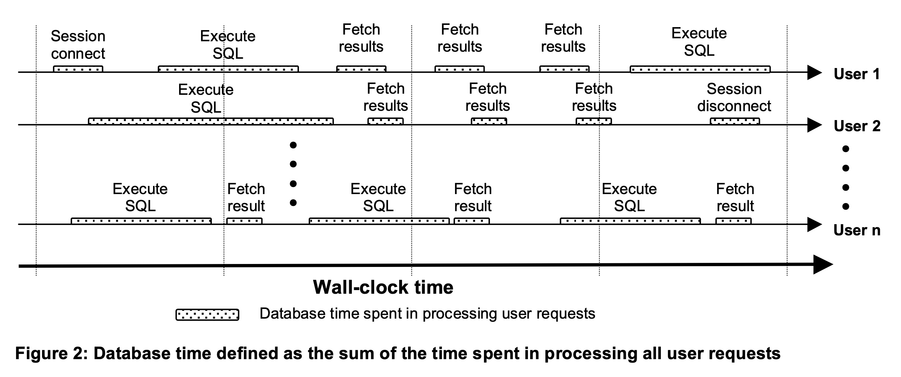
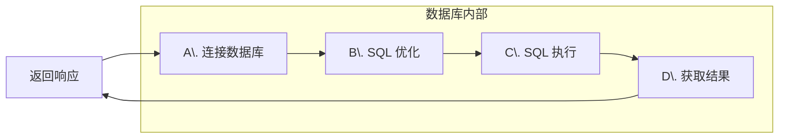
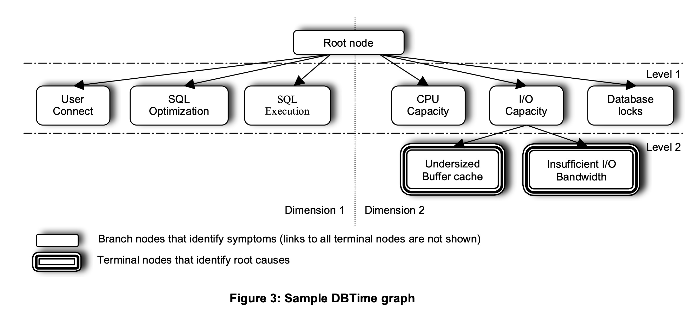
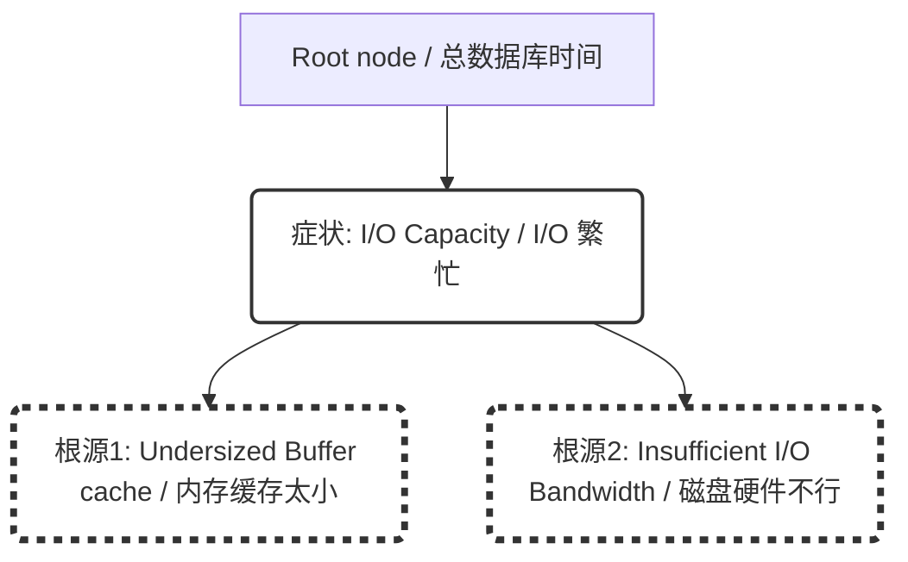
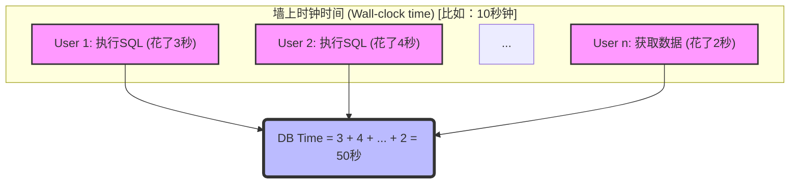
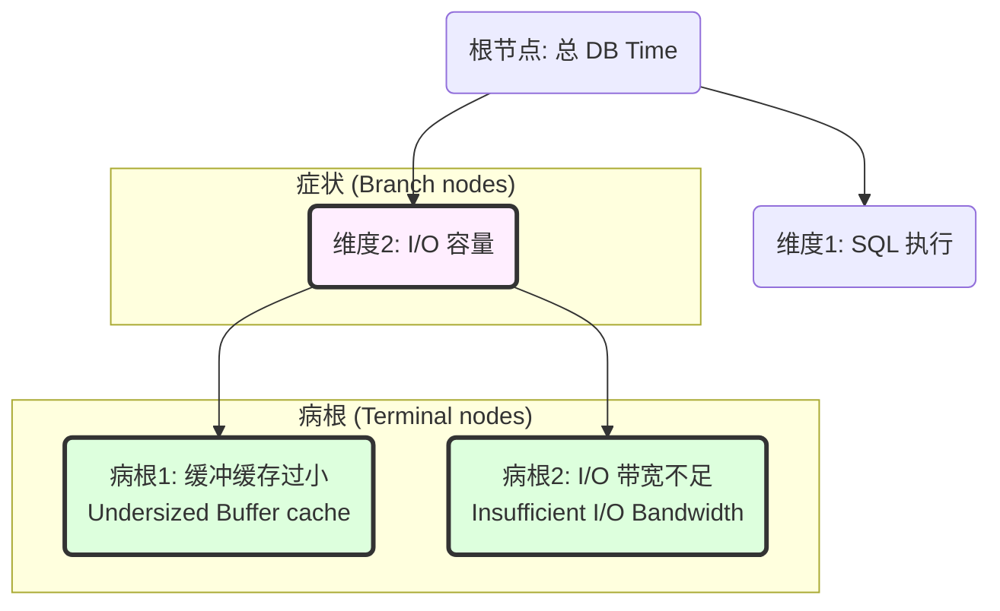
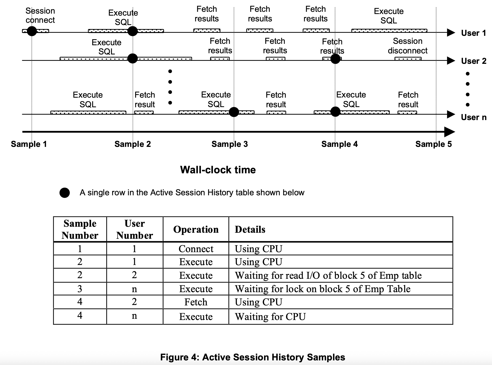

## AI论文解读 | Automatic Performance Diagnosis And Tuning In Oracle
        
### 作者        
digoal        
        
### 日期        
2025-11-07        
        
### 标签        
PostgreSQL , PolarDB , DuckDB , AI , 论文解读        
        
----        
        
## 背景  
      
https://github.com/lonng/db-papers/blob/main/papers/diagnosis-and-tuning/automatic-performance-diagnosis-and-tuning-in-oracle.pdf        
  
提示:          
```          
读懂《Automatic Performance Diagnosis And Tuning In Oracle》这篇论文需要提前掌握哪些基础知识, 请使用中文通熟易懂的讲解这些基础知识, 可以引用论文中的图、表或使用Markdown支持的图形(text,mermaid等)增加解释性. 
  
使用中文通熟易懂的解读《Automatic Performance Diagnosis And Tuning In Oracle》这篇论文, 其中的关键内容请着重讲解, 可以引用论文中的图、表或使用Markdown支持的图形(text,mermaid等)增加解释性. 
  
提取《Automatic Performance Diagnosis And Tuning In Oracle》这篇论文中的重要术语, 使用中文对这些术语进行通熟易懂的讲解, 可以引用论文中的图、表或使用Markdown支持的图形(text,mermaid等)增加解释性. 
```     
  
## 1 前置知识 
  
你好！这是一篇非常经典且有影响力的关于 Oracle 数据库自动化性能调优的论文。它介绍了 Oracle 10g  中一个革命性的工具——**ADDM (Automatic Database Diagnostic Monitor)**  和一个核心概念 —— **“数据库时间 (Database Time)”** 。

为了能透彻理解这篇论文，你需要先掌握一些数据库领域的基础知识。以下我将用通俗易懂的语言为你讲解这些知识点，并结合论文中的图示来帮助你理解。

-----

## 📚 理解论文所需的基础知识

你需要了解以下几个核心概念：

1.  **数据库和 DBA 的角色**
2.  **什么是“数据库性能调优”？**
3.  **数据库如何处理一个请求？**
4.  **关键的“资源”：CPU、内存和磁盘 I/O**
5.  **核心难点：“等待”和“瓶颈”**
6.  **调优的“症状”与“根源”**

-----

### 1\. 数据库和 DBA 的角色

  * **数据库 (Database):** 你可以把它想象成一个超级智能、有条理的巨型仓库（比如图书馆），它专门用来存储和管理海量数据。
  * **DBA (Database Administrator):** 也就是数据库管理员。他是这个“仓库”的“馆长”。他的工作是确保仓库（数据库）运行平稳、安全、高效，并且当有人（用户程序）来存取数据时，能非常快地完成。
  * **论文的背景:** 这篇论文提到，DBA 的工作非常辛苦，因为性能调优需要大量专业知识，非常耗时，而且容易“治标不本” 。论文的目标就是开发一个“自动化专家”（ADDM），来帮助 DBA 。

### 2\. 什么是“数据库性能调优”？

“调优”就是想办法让数据库跑得更快。但这个“快”很难衡量。

在 ADDM 出现之前，DBA 们会看各种“孤立”的指标 ，比如：

  * **缓冲命中率 (Buffer hit-ratio):** 比如 90%。越高越好，但 90% 就够好了吗？还是 99%？提升 1% 需要多大代价？
  * **I/O 延迟 (I/O latency):** 比如 10 毫秒。越低越好，但它对“用户”的最终感受有多大影响？
  * **每秒事务数 (Transactions per second):** 越高越好，但如果它降低了，到底是哪个环节出了问题？

**论文的核心创新点（“数据库时间”）:**
论文指出，这些“不相关的指标” (unrelated metrics)  让人很难看清全局。

因此，它提出了一个叫 **“数据库时间 (Database Time)”** 的 **“通用货币” (common currency)** 。

  * **定义:** 所有用户请求在数据库“内部”所花费的时间总和 。
  * **看图 2 (Figure 2):** 这张图  非常好地解释了这一点。    
      * “Wall-clock time”（墙上时钟时间）就是我们现实中流逝的时间（比如 1 分钟）。
      * 在这 1 分钟内，可能有 100 个用户 (User 1 ... User n)  都在向数据库发请求 (Execute SQL, Fetch results) 。
      * **“数据库时间”**  就是把所有这些用户在数据库里花费的时间（图中的虚线小框）全部加起来。
      * 如果在这 1 分钟内，这 100 个用户总共在数据库里花了 5 分钟的时间，那么“数据库时间”就是 5 分钟。

**调优的目标：** ADDM 的目标就是想办法**减少“数据库时间”** 。如果能把这 5 分钟减少到 3 分钟，就意味着数据库的效率提升了。

### 3\. 数据库如何处理一个请求？

当你发送一个 SQL 查询（比如 `SELECT * FROM users WHERE id = 1`）时，数据库内部大致会经历几个阶段。



  * **A. 连接 (Connect):** 建立和数据库的通信。
  * **B. 优化 (Optimization):** 这是数据库的“大脑”。它会思考：“我是该先查索引，还是该全表扫描？” 它会计算成本，找出一个最高效的“执行计划”。
  * **C. 执行 (Execution):** 按照“执行计划”去干活。
  * **D. 获取 (Fetch):** 把数据从数据库里取出来，准备返回给用户。

**论文中的应用:**
这篇论文的 **DBTime-graph (图 3)**  的“维度 1” (Dimension 1)  就是按照这个流程来划分的，它会分析“数据库时间”具体花在了哪个阶段，比如 "User Connect"（连接）、"SQL Optimization"（优化）或 "SQL Execution"（执行） 。

  

### 4\. 关键的“资源”：CPU、内存和磁盘 I/O

数据库干活离不开计算机的硬件资源：

  * **CPU (中央处理器):** 真正干活的“工人”。负责计算、执行指令。
  * **内存 (Memory):** 速度飞快但昂贵的“工作台”。数据库会把最常用的数据放在内存里（称为**缓冲缓存，Buffer Cache**），这样就不用每次都去“仓库”里拿了。
  * **磁盘 (Disk / I/O):** 速度很慢但容量巨大的“仓库”。数据最终都存在这里。从磁盘读取数据（称为 I/O）是一个非常耗时的操作。

**论文中的应用:**
DBTime-graph (图 3)  的“维度 2” (Dimension 2)  就是在分析“数据库时间”花在了哪些“资源”上，比如 "CPU Capacity"（CPU 算力）、"I/O Capacity"（磁盘读写能力）。

### 5\. 核心难点：“等待”和“瓶颈”

在数据库里，一个请求（会话 Session）只有两种状态：

1.  **在 CPU 上工作 (On CPU):** 比如在计算、在优化 SQL。
2.  **在等待 (Waiting):** 这才是性能调优的关键！

**“等待”** 意味着“工人”（CPU）想干活，但被卡住了。等什么呢？

  * **等磁盘 I/O:** 等待数据从慢速磁盘读取到内存 。
  * **等锁 (Locks):** 等待其他用户释放资源。比如 A 在修改 5 号数据，B 也想修改，B 就必须“等待” A 完成（即等待 "Database locks"）。
  * **等 CPU:** CPU 太忙了，有 100 个任务在排队，你只能“等待” CPU 。

**“瓶颈 (Bottleneck)”** 指的就是系统中“最慢”的那个环节，它决定了整个系统的速度。

**论文中的应用:**
“数据库时间 (DB Time)”这个概念的伟大之处在于它**包含了“等待时间”** 。
ADDM 的工作就是分析“数据库时间”中，占比最高的“等待”是什么。如果 80% 的“数据库时间”都花在 "I/O Capacity"  上，那么 I/O 就是瓶颈。

### 6\. 调优的“症状”与“根源”

这是性能调优中最容易犯错的地方，也是论文着重解决的问题 。

  * **症状 (Symptom):** 表面现象。比如“I/O 等待时间很长”。
  * **根源 (Root Cause):** 导致该现象的根本原因。

**看图 3 (Figure 3):** 这张图  完美地展示了这个逻辑。



  

*(这是一个简化的示意图，模拟了论文图 3 的结构 )*

  * ADDM 发现“I/O Capacity”（I/O 能力） 消耗了大量数据库时间。这是一个“症状”（图中的 Branch node）。
  * **为什么 I/O 繁忙？** 论文说，ADDM 会继续向下钻取 。
  * 它可能会发现**根源 1 (Root Cause)**：**"Undersized Buffer cache"**（缓冲缓存太小）。因为内存这个“工作台”太小，数据刚放上来就又被踢出去了，导致 CPU 频繁地去“仓库”（磁盘）拿数据，所以 I/O 繁忙。
  * 它也可能发现**根源 2 (Root Cause)**：**"Insufficient I/O Bandwidth"**（I/O 带宽不足）。意思是内存够大，但“仓库”和“工作台”之间的“路”太窄了（磁盘硬件不行），导致运输缓慢 。

ADDM 的价值在于它能帮你区分这些“根源”（图中的 Terminal nodes），并给出“可执行的建议” (actionable recommendations) ，比如“给数据库增加内存”或“更换更快的磁盘”。

-----

### 总结

你需要带着这些基础知识去阅读论文：

1.  **DBA 的痛点:** 调优复杂、耗时、易出错 。
2.  **旧方法的缺陷:** 各种指标（命中率、延迟）互不相干，无法衡量对全局的影响 。
3.  **论文的解决方案:**
      * **一个新指标 (DB Time):** 以“时间”为通用货币，统一衡量所有瓶颈 。
      * **一个新工具 (ADDM):** 自动运行，分析 DB Time 。
      * **一个新方法 (DBTime-graph):** 通过“处理阶段”（维度1） 和“资源消耗”（维度2） 两个维度，层层钻取，找到“症状”背后的“根源” 。

希望这些讲解能帮助你顺利读懂这篇论文！

您希望我针对论文中的某个特定部分（比如 Active Session History (ASH)  或 AWR ）做进一步的解释吗？
  
## 2 解读论文 
  
好的，这是一篇数据库领域的经典论文，它开创了数据库“自我管理”的时代。我来为您通俗易懂地解读一下这篇论文的核心思想。

这篇论文的核心是介绍 Oracle 10g 中一个革命性的功能——**ADDM (自动数据库诊断监视器)** 。

您可以把 ADDM 想象成一个 **内置在数据库里的“7x24小时全天候性能专家”** 。

在它出现之前，数据库性能调优（“调优”）是一个极其痛苦的过程。

### 1\. 核心问题：为什么数据库调优这么难？

论文在一开始就指出了 DBA（数据库管理员）的“四大痛点”：

1.  **高度依赖专家：** 调优需要大量专业知识和经验，非常耗时 。
2.  **“治标不治本”：** DBA 经常花费大量时间去解决一个“症状”，而不是“病根” 。比如，DBA 发现磁盘很忙（症状），就去升级磁盘，结果发现问题是某个 SQL 语句写得太烂（病根）导致的。
3.  **缺乏“全局视角”：** 数据库组件太多，DBA 很难获得一个“整体健康状况”的视图 。
4.  **指标无法“换算”：** 调优时会看到各种指标，比如“内存命中率 90%”、“I/O 延迟 10毫秒”、“每秒事务数 500”。这些指标“单位”不同，无法比较 。你不知道是把内存命中率从 90% 提升到 95% 更重要，还是把 I/O 延迟从 10ms 降低到 5ms 更重要。

为了解决这些问题，这篇论文提出了一个革命性的新概念，也是 ADDM 的基石。

-----

### 2\. 关键概念一：“数据库时间 (Database Time)” (DB Time)

这是**整篇论文最核心的创新点**。

论文定义了一个 **“通用货币” (common currency)** ，叫做 **“数据库时间 (DB Time)”** 。

  * **通俗定义：** 所有用户请求在数据库“内部”所花费的时间总和 。
  * **关键点：** DB Time **包含**了两种时间：
    1.  真正“在 CPU 上干活”的时间。
    2.  所有“等待”的时间（比如等 I/O、等锁、等网络）。

**看懂论文中的图 2 (Figure 2)：**
这张图非常关键。它解释了为什么 DB Time 和我们平时说的“墙上时钟时间 (Wall-clock time)”不一样 。

  



  * 假设在“现实世界的 10 秒钟”内（Wall-clock time），有 100 个用户同时向数据库发出了请求 。
  * 数据库（可能有很多个 CPU）在同时处理这些请求。
  * 我们把这 100 个用户在数据库内部花费的时间（包括等待时间） **全部加起来** ，可能得到了 50 秒。
  * 那么，在这 10 秒钟内， **“数据库时间 (DB Time)” 就是 50 秒** 。

**DB Time 的意义：**
有了这个“通用货币”，性能调优的目标瞬间变得清晰了：**ADDM 的唯一目标，就是想办法减少“总的数据库时间”** 。

以前那些“内存命中率”、“I/O 延迟”现在都可以被换算成 DB Time 了。比如：

  * “I/O 等待” 占用了 20 秒的 DB Time。
  * “CPU 运行” 占用了 15 秒的 DB Time。
  * “锁等待” 占用了 10 秒的 DB Time。

ADDM 立即知道，“I/O 等待” 是最大的瓶颈，应该优先解决它。

-----

### 3\. 关键概念二：ADDM 如何找到“病根”？(DBTime-graph)

ADDM 使用“数据库时间”这个武器，通过一个叫 **"DBTime-graph" (数据库时间图)** 的方法论来自动分析问题 。

论文指出，ADDM 会从**两个维度 (two dimensions)** 来分解 DB Time ：

1.  **维度 1 (按流程看)：** 时间花在了哪个“处理阶段”？
      * 是 "SQL Execution"（SQL 执行）？
      * 还是 "SQL Optimization"（SQL 优化）？
      * 还是 "User Connect"（用户连接）？
2.  **维度 2 (按资源看)：** 时间花在了哪个“资源等待”上？
      * 是 "CPU Capacity"（CPU 算力不足）？
      * 是 "I/O Capacity"（I/O 性能不足）？
      * 还是 "Database locks"（数据库锁）？

**看懂论文中的图 3 (Figure 3)：**
这张图展示了 ADDM 如何区分“症状”和“病根” 。    



  * ADDM 从“根节点”（总 DB Time）出发，发现“I/O 容量”消耗了最多的 DB Time 。这是一个“症状”。
  * ADDM 不会停在这里，它会继续向下钻取 。
  * 它会分析“为什么 I/O 这么高？” 是因为 **“病根1：缓冲缓存过小”** （导致数据库频繁读盘），还是因为 **“病根2：I/O 带宽不足”** （磁盘硬件本身慢）？
  * ADDM 会找到真正的“病根”，并给出“可执行的建议” (actionable tuning recommendations) ，比如建议你增加内存 (解决病根1)，或者更换磁盘 (解决病根2)。

-----

### 4\. 关键概念三：ADDM 的“数据来源”是什么？

ADDM 这个“专家”诊断问题需要数据。论文介绍了两个关键组件，它们负责收集数据：

**1. AWR (Automatic Workload Repository) - 自动工作负载信息库**

  * 您可以把 AWR 想象成数据库的 **“历史档案库”** 。
  * 它会 **定期（比如每小时）** 对数据库的所有关键性能统计数据拍一张“快照” (snapshot) 并永久存储起来 。
  * ADDM 的工作模式就是 **自动分析“两个快照之间”** （比如 10:00 到 11:00）的性能数据 ，然后出具一份“体检报告”。

**2. ASH (Active Session History) - 活动会话历史**

  * AWR 提供了“宏观”的统计（比如“这 1 小时总共等待了 1000 次 I/O”），但缺乏“微观”的细节（比如“具体是哪个 SQL、哪个用户在等 I/O？”）。
  * 要想记录所有细节，开销太大，会严重影响数据库性能 。
  * ASH 解决办法是 **“高频抽样” (sampling)** 。
  * **看懂论文中的图 4 (Figure 4)：**     
      * ASH 就像一个“采样器”，**每秒钟**去看一下数据库里所有“正在活动”的用户都在干什么 。
      * 它会把采样结果（比如 "User 2 正在等待 I/O" 或 "User n 正在使用 CPU"）记录到一张表里 。
  * 因为采样频率非常高，当 ADDM 分析 AWR 时，它可以查询 ASH 数据，**非常精确地定位到“谁在什么时间、因为什么SQL、在等待什么资源”** 。

-----

### 论文总结

《Automatic Performance Diagnosis and Tuning in Oracle》这篇论文通过定义 **“数据库时间 (DB Time)”** 这一“通用货币”，彻底改变了性能调优的游戏规则。

它使得性能调优从一门依赖“专家直觉”的“艺术”，变成了一门由 **ADDM** 工具自动执行的、数据驱动的“科学”。ADDM 利用 **AWR**（宏观统计）和 **ASH**（微观采样）的数据 ，通过 **DBTime-graph** 的分析方法 ，能够自动、准确地识别出性能“症状”背后的“病根” ，并给出**按“DB Time 收益”排序**的优化建议 。

论文最后通过高通 (Qualcomm) 等真实案例证明，ADDM 确实能快速找到例如“应用升级后缺失索引”这类致命的性能问题 ，极大地解放了 DBA。
  
## 3 术语 
  
好的，这篇论文《Automatic Performance Diagnosis And Tuning In Oracle》中包含了几个非常关键的术语，理解了它们，就等于理解了 Oracle 数据库自动化调优的核心。

以下是这些重要术语的通俗讲解：

-----

### 1\. 数据库时间 (Database Time)

这是**整篇论文最核心、最具创新性**的术语。

  * **通俗讲解：**
    您可以把“数据库时间”想象成一种衡量数据库有多“忙”的 **“通用货币”** 。

    它**不是**指我们现实世界中流逝的时间（比如“墙上时钟过了1分钟”）。它是指**所有**用户请求在数据库“内部”所花费时间的**总和** 。

    **引用论文中的图 2 (Figure 2) 来解释：**    

      * 假设在“墙上时钟”的 1 分钟内，有 100 个用户 (User 1...User n) 都在访问数据库 。
      * User 1 在数据库里花了 3 秒；User 2 花了 5 秒；... User 100 花了 2 秒。
      * 那么，在这 1 分钟内，总的“数据库时间”就是 `3 + 5 + ... + 2 =` (假设) 300 秒。
      * 这个 300 秒（5分钟）就是“数据库时间”，它远远大于“墙上时钟”的 1 分钟 。

  * **为什么重要：**
    在“数据库时间”这个概念出现之前，DBA 很难比较“内存命中率低”和“I/O延迟高”哪个问题更严重 。

    有了“数据库时间”这把“尺子”，调优目标变得非常清晰：**ADDM 的目标就是减少总的“数据库时间”消耗** 。如果 ADDM 发现“I/O 等待”消耗了 80% 的“数据库时间”，那么 I/O 就是最大的瓶颈。

-----

### 2\. ADDM (自动数据库诊断监视器)

  * **通俗讲解：**
    **ADDM (Automatic Database Diagnostic Monitor)** 就是论文标题中的“自动性能诊断”工具 。

    您可以把它想象成一个内置在数据库里的、永不疲倦的 **“7x24小时性能专家”** 。

    它会在后台自动运行，分析数据库的“病症”，诊断出性能瓶颈，并提供“可执行的” (actionable) 建议来解决这些问题 。

-----

### 3\. 症状 (Symptom) 与 根源 (Root-cause)

这是 ADDM 诊断问题的核心逻辑。

  * **通俗讲解：**
    论文指出，DBA 过去常常“治标不治本”，浪费大量时间去修复“症状”，而不是“病根” 。

      * **症状 (Symptom)：** 表面现象。例如：“系统很慢，I/O 读写非常繁忙”。
      * **根源 (Root-cause)：** 导致该现象的根本原因。

    ADDM 的核心能力就是**区分“症状”和“根源”** 。

  * **引用论文中的图 3 (Figure 3) 来解释：**

      * ADDM 发现“I/O 容量”(I/O Capacity) 消耗了大量“数据库时间”。这是一个“症状”（图 3 中的 Branch node，分支节点） 。    
      * ADDM 不会停在这里，它会继续向下钻取，分析为什么 I/O 繁忙？
      * 它可能会发现 **“根源1”** (Terminal node，终端节点)：**"Undersized Buffer cache" (缓冲缓存过小)**。因为内存这个“工作台”太小，导致数据频繁从磁盘“仓库”取，I/O 才变忙 。
      * 或者 **“根源2”** ： **"Insufficient I/O Bandwidth" (I/O 带宽不足)** 。意思是内存够大，但是磁盘硬件（“仓库的路”）太慢了 。

    ADDM 会明确告诉你“病根”是哪个，并给出相应的建议（比如“增加内存”或“升级磁盘”）。

-----

### 4\. DBTime-graph (数据库时间图)

  * **通俗讲解：**
    这是 ADDM 用来定位“病根”的“诊断流程图”或“方法论” 。

    为了找到问题，ADDM 会从**两个独立的维度 (two independent dimensions)** 来分解“数据库时间” ：

    1.  **维度1（按流程看）：** DB Time 花在了哪个“处理阶段”？
          * 比如：是花在 "SQL Execution"（执行 SQL）上，还是花在 "SQL Optimization"（优化 SQL）上？
    2.  **维度2（按资源看）：** DB Time 花在了哪个“资源”上？
          * 比如：是花在 "CPU Capacity"（CPU 运算）上，还是花在 "I/O Capacity"（等待磁盘）上，还是在等 "Database locks"（数据库锁）？

    通过这两个维度的交叉分析（如下图所示），ADDM 就能快速定位到消耗“数据库时间”最多的那个“根源” 。

    ```mermaid
    graph TD
        Root["总数据库时间 (DB Time)"] --> Dim1(维度1: 处理阶段)
        Root --> Dim2(维度2: 资源消耗)
        
        Dim1 --> SQL_Exec(SQL 执行)
        Dim1 --> SQL_Opt(SQL 优化)
        
        Dim2 --> CPU(CPU 容量)
        Dim2 --> IO(I/O 容量)
        Dim2 --> Locks(数据库锁)
        
        %% 结合图3的例子 %%
        IO --> Symptom[症状: I/O 繁忙]
        Symptom --> Cause1[根源1: 缓冲缓存过小]
        Symptom --> Cause2[根源2: I/O 带宽不足]
    ```

-----

### 5\. AWR 与 ASH (ADDM 的数据来源)

ADDM 这个“专家”诊断问题需要“病历数据”。AWR 和 ASH 就是数据库的“病历”和“心电图”。

#### AWR (自动工作负载信息库)

  * **通俗讲解：**
    **AWR (Automatic Workload Repository)** 是一个数据库的 **“历史性能档案库”** 。
  * **工作方式：**
    数据库会定期（比如每小时）对系统所有关键性能指标（比如总共等待了多少次 I/O、执行了多少次 SQL）拍一张“快照” (snapshot)，并把这些快照永久保存在 AWR 中 。
  * **用途：**
    ADDM 会自动分析**两个快照之间**（比如 10:00 到 11:00）的性能数据 ，然后出具一份关于这个时间段的“体检报告”。

#### ASH (活动会话历史)

  * **通俗讲解：**
    AWR 提供了“宏观”的统计（“这 1 小时 I/O 很忙”），但缺乏“微观”的细节（“具体是哪个用户、哪条 SQL 导致的 I/O 忙？”）。

    **ASH (Active Session History)** 就是解决这个问题的“高频采样器” 。

  * **工作方式（引用论文中的图 4）：**    
    ASH **每秒钟**  都会去检查一下数据库里所有“正在活动”的用户会话 ，并记录下：“在这一秒，User 2 正在等待 I/O”、“User 5 正在使用 CPU” 。

  * **用途：**
    通过分析 ASH 数据，ADDM 就能非常精确地定位到具体是哪个 SQL 语句、哪个表、哪种等待导致了性能瓶颈 。

-----

### 6\. 最小侵入原则 (Minimal intrusion principle)

  * **通俗讲解：**
    这是 ADDM 收集数据时的一个核心要求： **“看病”的动作本身，不能让“病人”的病情加重** 。
  * **含义：**
    收集性能数据（比如 AWR 和 ASH）这个行为，必须对数据库的正常运行性能影响降到最低 。
  * **应用：**
    ASH 采用“采样” (sampling)  而不是“全量跟踪” (full trace) ，就是这个原则的最佳体现。因为“全量跟踪”的性能开销是无法接受的 ，而“采样”的开销则非常小 。
  
## 参考        
         
https://github.com/lonng/db-papers/blob/main/papers/diagnosis-and-tuning/automatic-performance-diagnosis-and-tuning-in-oracle.pdf    
        
<b> 以上内容基于DeepSeek、Qwen、Gemini及诸多AI生成, 轻微人工调整, 感谢杭州深度求索人工智能、阿里云、Google等公司. </b>        
        
<b> AI 生成的内容请自行辨别正确性, 当然也多了些许踩坑的乐趣, 毕竟冒险是每个男人的天性.  </b>        
    
#### [PolarDB 学习图谱](https://www.aliyun.com/database/openpolardb/activity "8642f60e04ed0c814bf9cb9677976bd4")
  
  
#### [PostgreSQL 解决方案集合](../201706/20170601_02.md "40cff096e9ed7122c512b35d8561d9c8")
  
  
#### [德哥 / digoal's Github - 公益是一辈子的事.](https://github.com/digoal/blog/blob/master/README.md "22709685feb7cab07d30f30387f0a9ae")
  
  
#### [About 德哥](https://github.com/digoal/blog/blob/master/me/readme.md "a37735981e7704886ffd590565582dd0")
  
  

  
