## AI论文解读 | What Every Programmer Should Know About Memory
        
### 作者        
digoal        
        
### 日期        
2025-11-07        
        
### 标签        
PostgreSQL , PolarDB , DuckDB , AI , 论文解读        
        
----        
        
## 背景  
      
https://people.freebsd.org/~lstewart/articles/cpumemory.pdf        
  
提示:          
```          
读懂《What Every Programmer Should Know About Memory》这篇论文需要提前掌握哪些基础知识, 请使用中文通熟易懂的讲解这些基础知识, 可以引用论文中的图、表或使用Markdown支持的图形(text,mermaid等)增加解释性. 
  
使用中文通熟易懂的解读《What Every Programmer Should Know About Memory》这篇论文, 其中的关键内容请着重讲解, 可以引用论文中的图、表或使用Markdown支持的图形(text,mermaid等)增加解释性. 
  
提取《What Every Programmer Should Know About Memory》这篇论文中的重要术语, 使用中文对这些术语进行通熟易懂的讲解, 可以引用论文中的图、表或使用Markdown支持的图形(text,mermaid等)增加解释性. 
```     
  
## 1 前置知识 
  
要读懂这篇经典的《What Every Programmer Should Know About Memory》，你需要一些计算机科学的基础知识。这篇论文（更像是一本小手册）是为程序员写的，它深入探讨了硬件（特别是内存和缓存）如何影响软件性能。

作者 Ulrich Drepper 默认读者已经对计算机系统有基本了解 。如果你缺乏这些背景，阅读起来可能会感觉像在看天书。

这里为你梳理了阅读前需要掌握的基础知识，并用通俗易懂的语言进行讲解。

-----

### 基础1: 计算机组织结构 (“电脑的大致模样”)

你需要知道一个简化的计算机模型，即CPU（中央处理器）、内存（RAM）和输入/输出（I/O）设备是如何协同工作的。

  * **CPU (中央处理器):** 大脑，负责计算。
  * **RAM (随机存取存储器):** 临时工作台，存放CPU正在使用的数据和指令。
  * **总线 (Bus):** CPU和内存之间通信的公路。论文中提到了 **FSB (Front Side Bus, 前端总线)** 。
  * **芯片组 (Chipset):** 交通枢纽。论文（图2.1 ）详细描述了旧式计算机的结构，它分为：
      * **北桥 (Northbridge):** 高速枢纽，连接CPU、RAM和高速显卡 。
      * **南桥 (Southbridge):** 低速枢纽，连接USB、硬盘(SATA)、PCI-E等设备 。

你可以参考论文中的这张图（图2.1 ），它展示了这些组件的关系：    

```text
   [ CPU1 ]  [ CPU2 ]
      |         |
      +----FSB----+
            |
      [ Northbridge ] <---- [ RAM ]
            |
      [ Southbridge ] <---- [ PCI-E, SATA, USB ]
```

**为什么这很重要?**
因为这决定了数据流动的路径。比如，CPU要从硬盘读取数据，路径是 `硬盘 -> Southbridge -> Northbridge -> CPU`。所有数据（包括CPU之间的数据）都必须经过Northbridge，这使它成为一个关键的性能瓶颈 。

-----

### 基础2: 内存的基本工作原理

你不需要成为电子工程师，但需要了解两种主要内存的区别，论文在 2.1 节  详细讨论了它们：

1.  **SRAM (静态RAM):**

      * **原理:** 像一个电灯开关（由6个晶体管组成，见图2.4 ）。只要有电，它就能一直保持状态（开或关）。    
      * **特点:** 非常快，非常贵，非常耗电。
      * **用途:** CPU 缓存 (L1, L2, L3 cache) 。

2.  **DRAM (动态RAM):**

      * **原理:** 像一个漏水的小水桶（由1个晶体管和1个电容组成，见图2.5 ）。电容里有电荷代表"1"，没电荷代表"0"。   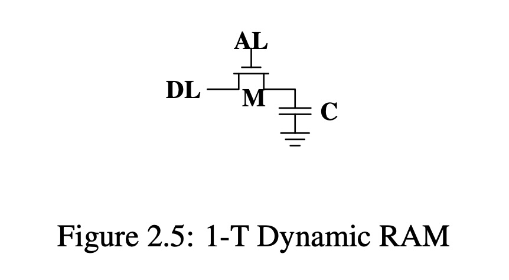  
      * **特点:** 因为电容会漏电 (leakage) ，所以必须**周期性地刷新 (Refresh)** （把水桶重新灌满）。这导致它比SRAM慢得多，但也便宜得多，功耗更低 。
      * **用途:** 你的主内存条（例如 DDR4, DDR5）。


  * **内存访问 (RAS/CAS):**
    DRAM为了省钱（减少引脚），地址是分两次发送的 ：
    1.  **RAS (Row Address Selection):** 先发“行地址”（选中一整排）。
    2.  **CAS (Column Address Selection):** 再发“列地址”（选中这一排里的某个数据）。
        论文中的图2.8  展示了这个时序，理解 "CAS延迟(CL)"  和 "RAS到CAS延迟(tRCD)"  等概念，就能明白为什么访问内存有这么多固有的延迟。  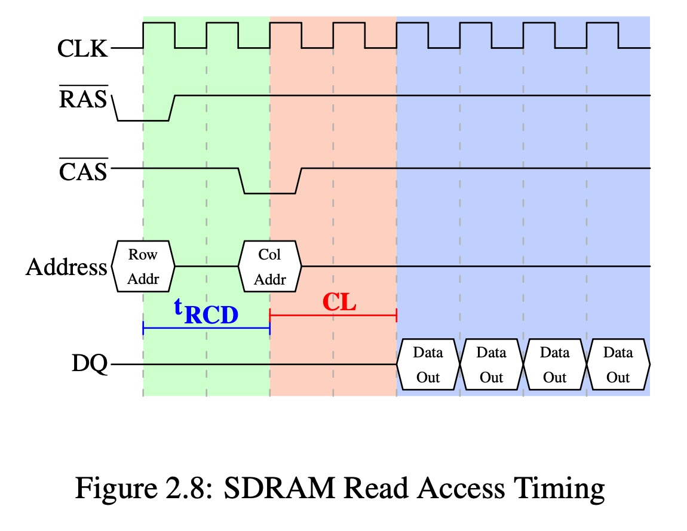  

**为什么这很重要?**
这解释了“为什么我们不全用SRAM？”（太贵了），以及为什么内存访问本身就存在延迟（DRAM需要刷新和复杂的RAS/CAS时序）。

-----

### 基础3: CPU 缓存 (本文最重要的核心)

这是理解这篇论文**最关键**的基础知识。论文第3节  专门讲这个。

  * **为什么需要缓存? (The Memory Wall)**
    CPU的速度增长远远超过了DRAM内存的速度增长 。如果CPU每次都要等慢吞吞的DRAM，它的大部分时间都在“摸鱼”。

      * **论文数据:** 访问寄存器 \< 1个周期, 访问L1缓存约 3 周期, 访问L2约 14 周期, 访问主内存约 240+ 周期 。

  * **局部性原理 (Locality):**
    缓存之所以有效，是基于程序的两个访问特性：

    1.  **时间局部性 (Temporal Locality):** 刚被访问过的数据，很可能马上会再次被访问（比如循环中的变量）。
    2.  **空间局部性 (Spatial Locality):** 刚被访问过的数据，它附近的数据也很可能马上被访问（比如遍历数组）。

  * **缓存行 (Cache Line):**
    缓存不是一个字节一个字节地读写内存，而是一块一块地搬运。这个“块”就叫缓存行，现在通常是 64 字节 。当你读取一个变量时，CPU会把包含这个变量的整个 64 字节都加载到缓存中，这就是利用了空间局部性。

  * **缓存相联度 (Associativity):**
    这是一个内存地址的数据可以被存放到缓存的哪些位置。论文在 3.3.1 节  讨论了它。

      * **直接映射 (Direct-Mapped):** 简单粗暴。每个内存地址只能去缓存里的一个固定位置。如果两个常用数据恰好要映射到同一个位置，它们就会不停地把对方踢出去（冲突），导致缓存失效。
      * **全相联 (Fully-Associative) :** 极度灵活。任何内存地址可以去缓存里的任何位置。成本高，查找慢，只用于很小的缓存（如TLB）。
      * **N路组相联 (N-Way Set-Associative):** 完美折中。缓存被分成很多“组”（Set），每个内存地址固定映射到一个“组”，但可以在该“组”内的 N 个位置中任选一个存放。

    下面这个图可以帮你理解（你可以对照论文的图3.5, 3.6, 3.7）：  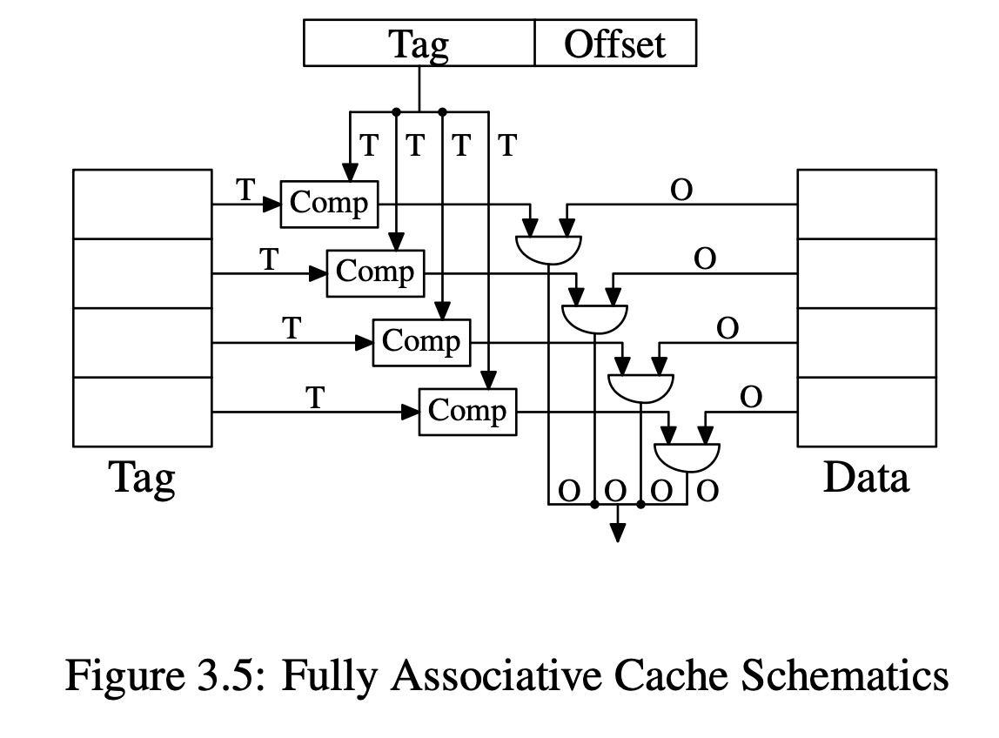  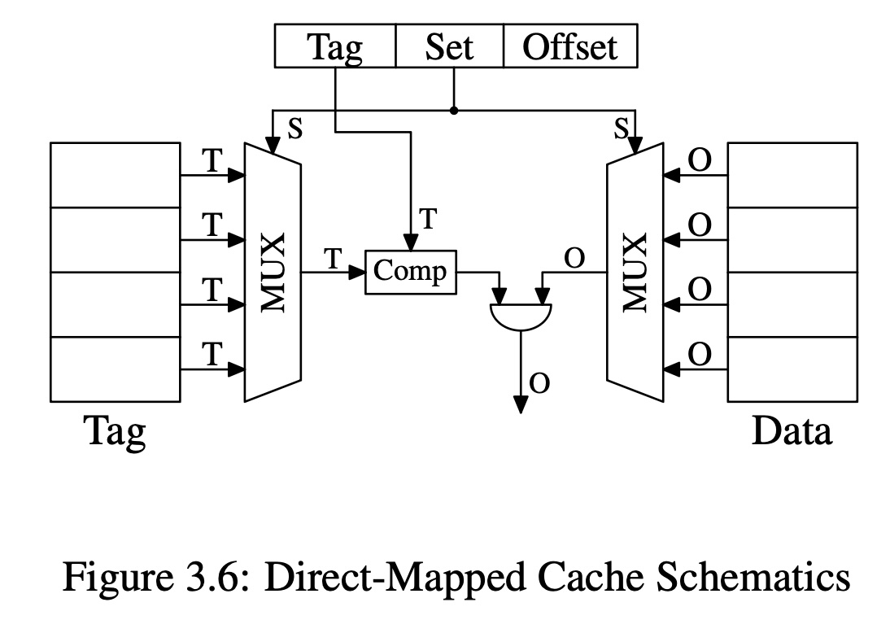  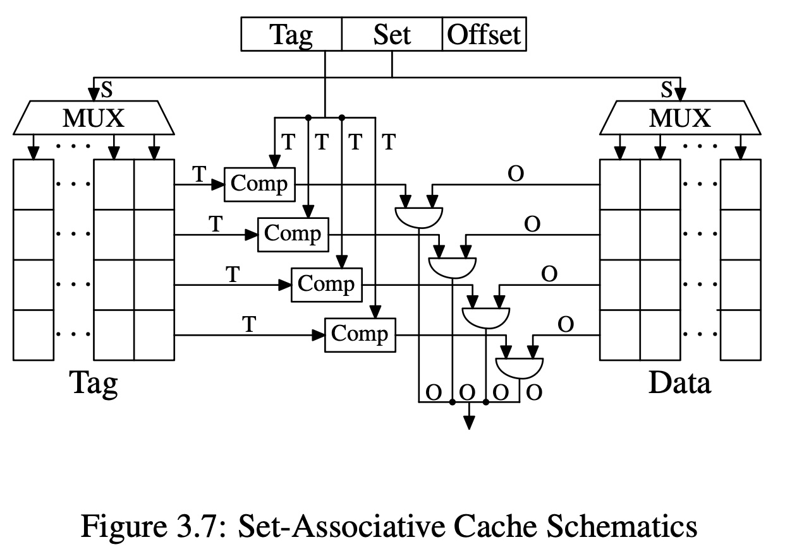  

    ```mermaid
    graph TD
        subgraph "直接映射 (Direct-Mapped) "
            direction LR
            A(内存地址 1) --> B(缓存位置 1)
            C(内存地址 5) --> B
            D(内存地址 9) --> B
            E[内存地址1, 5, 9 <br> 竞争同一个位置]
        end
        subgraph "2路组相联 (2-Way Set-Associative)"
            direction LR
            F(内存地址 1) --> G(缓存组 1)
            H(内存地址 5) --> G
            I(内存地址 9) --> G
            G -- 可放入 --> K(位置 1\.1)
            G -- 可放入 --> L(位置 1\.2)
            M[内存地址1, 5, 9 <br> 可共享组内2个位置]
        end
        subgraph "全相联 (Fully-Associative) "
            direction LR
            P(内存地址 1) --> Q(任意缓存位置)
            R(内存地址 5) --> Q
            S(内存地址 9) --> Q
            T[任意内存地址可放入任意位置]
        end
    ```

  * **缓存一致性 (Cache Coherency):**
    在多核CPU上，每个核心都有自己的L1缓存（甚至L2）。如果核心1修改了A变量（在它的L1缓存里），核心2的L1缓存里可能还是A的旧值 。

      * **MESI 协议 :** 为了解决这个问题，CPU使用一种协议（如MESI）来同步缓存。当一个核心要写入时，它必须先发送一个 "Request For Ownership" (RFO) 消息 ，通知其他所有核心“这个缓存行归我了，你们的都作废 (Invalid)” 。

**为什么这很重要?**
这是论文第6节（给程序员的建议） 的全部基础。理解了缓存，你才能明白为什么“伪共享 (False Sharing)”  会带来巨大性能灾难，以及为什么矩阵乘法要按特定顺序写（见论文 6.2.1 节 ）。

-----

### 基础4: 操作系统核心概念

论文的第4节  专门讨论了虚拟内存，这需要一些操作系统的基础知识。

  * **虚拟内存 (Virtual Memory):**
    你的程序看到的内存地址（虚拟地址）不是真实的物理RAM地址（物理地址）。
  * **页表 (Page Tables):**
    操作系统维护一个“地址翻译簿”，即页表，告诉CPU如何把虚拟地址翻译成物理地址。这个翻译工作由 **MMU (内存管理单元)**  完成。
      * 论文的图4.1  和图4.2  展示了页表是如何（多级）工作的。    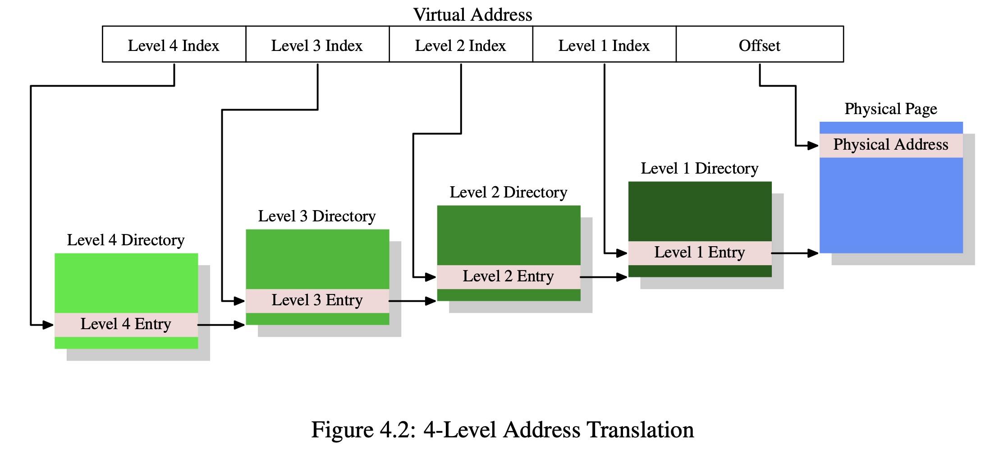  
  * **TLB (Translation Look-Aside Buffer):**
    查页表这个动作本身也需要访问内存，这太慢了。因此，CPU 内置了一个“页表缓存”，专门缓存最近用过的地址翻译结果，这就是 TLB 。
  * **缺页中断 (Page Fault):**
    当程序访问一个虚拟地址，但该地址对应的数据不在物理RAM中时（可能在硬盘上，或者还未分配），CPU会产生一个“缺页中断”。操作系统介入，从硬盘加载数据到RAM，然后程序才能继续 。

**为什么这很重要?**
因为访问内存不仅有DRAM延迟和缓存延迟，还可能有TLB未命中 （导致需要访问内存去查页表 ）和缺页中断（导致访问硬盘）的开销。论文强调，TLB未命中的代价很高，使用“大页 (Huge Pages)”  是一个优化手段。

-----

### 基础5: 并行和多核概念

论文的第5节 (NUMA)  和第6.4节 (多线程)  涉及并行计算。

  * **多线程 (Multi-Threading) vs 多进程 (Multi-Processing):**
    你需要知道线程共享同一个地址空间 ，而进程不共享。
  * **NUMA (Non-Uniform Memory Access):**
    在大型多处理器（多Socket）机器上，一个CPU访问“离自己近”的内存（直连）比访问“离其他CPU近”的内存（通过互联总线）要快 。
      * 论文的图2.3  展示了这种“本地内存”的架构。    
      * 这种访问速度的差异，就是所谓的 **NUMA 因子 (NUMA Factor)** 。
  * **原子操作 (Atomic Operations):**
    当多个线程同时修改一个变量时（比如 `i++`），你需要“原子操作”来保证操作不被打断。论文在 6.4.2 节  讨论了 **CAS (Compare-and-Swap)**  和 **LL/SC (Load Lock/Store Conditional)**  这两种实现原子操作的底层指令。

**为什么这很重要?**
这是现代多核编程的核心难点。你需要理解NUMA，才能知道为什么要把线程“钉”在某个CPU上（线程亲和性, Affinity ）以及如何分配内存（内存策略 ）。你需要理解原子操作，才能明白锁和无锁编程的性能代价。

-----

### 总结

要轻松阅读这篇论文，你最好提前对以下概念有一个清晰的认识：

1.  **CPU、芯片组、RAM 的物理连接方式 (图2.1)。**    
2.  **SRAM/DRAM 的原理区别 (图2.4, 2.5)。**      
3.  **CPU 缓存（L1/L2/L3）、缓存行、局部性原理。**
4.  **缓存相联度（直接映射、组相联）。**
5.  **缓存一致性（MESI）和伪共享。**
6.  **虚拟内存、页表、TLB (图4.2)。**     
7.  **NUMA 架构 (图2.3)。**    
8.  **多线程与原子操作 (CAS)。**

你不需要是这些领域的专家，但至少要听说过这些术语并大致理解它们的含义。这篇论文会帮你把这些零散的点串联起来，告诉你它们是如何共同影响你写的每一行代码的。

在此基础上，您希望我详细解释哪个具体概念吗？例如，深入讲解一下“伪共享”或“MESI协议”？
  
## 2 解读论文 
  
这是一篇在程序员界被誉为“必读”的经典论文。作者 Ulrich Drepper（当时任职于 Red Hat） 在 2007 年  撰写了这份长达 114 页的“备忘录”，其核心论点在今天依然至关重要：

> 随着 CPU 变得越来越快，对大多数程序而言，真正的性能瓶颈已经（并将在未来一段时间内）是**内存访问** 。

这篇论文就是一份详细的指南，旨在告诉程序员为什么内存很慢，硬件是如何“作弊”来隐藏这种缓慢的，以及程序员应该如何编写代码来“帮助”硬件作弊。

下面，我将为你通俗易懂地解读这篇论文的核心关键内容。

-----

### 开篇：你面临的“内存墙” (The Memory Wall)

论文开宗明义地指出了一个问题：CPU 的速度和核心数量在飞速增长，但内存（RAM）的访问速度却远远跟不上 。

想象一下：

  * **CPU 核心** 就像一个速度极快的厨师，可以在 1 秒内切好 100 盘菜（执行 100 条指令）。
  * **主内存 (RAM)** 就像一个距离厨房 1 公里外的大仓库。

当厨师（CPU）需要一个不在手边的食材（数据）时，他必须停下手中的一切工作，跑到 1 公里外的仓库，拿到食材，再跑回来。这个来回可能需要几分钟（几百个时钟周期）。在这期间，厨师（CPU）什么也干不了，只能空等。

这就是 **“内存墙”** 。硬件设计师为了解决这个问题，设计了一套复杂的“作弊”系统，但这个系统需要程序员的配合才能发挥最大效能 。

### 关键内容一：硬件的真相 (现代内存架构)

要理解如何优化，首先要知道硬件的结构。

#### 1\. 经典架构：北桥与南桥 (Northbridge / Southbridge)

在 2007 年（论文撰写时），主流的电脑架构是这样的 ：

```text
       +-------+     +-------+
       | CPU 1 |     | CPU 2 |
       +-------+     +-------+
           |             |
           +----(FSB)----+
                 |
+--------------+-------+
|   北桥 (Northbridge)  | <---- (内存总线) ----> [ RAM (主内存) ]
+--------------+-------+
                 |
+--------------+-------+
|   南桥 (Southbridge)  | <---- (I/O 总线) ----> [ 硬盘, USB, 网卡等 ]
+--------------+-------+
```

  * **北桥 (Northbridge)：** 这是一个高速枢纽，连接着 CPU、内存 (RAM) 和南桥 。所有内存访问都必须经过它 。
  * **南桥 (Southbridge)：** 负责处理所有慢速的 I/O 设备，比如硬盘、USB、网络等 。
  * **瓶颈 (Bottlenecks)：**
      * 所有 CPU 访问内存都必须通过北桥 。
      * 如果 CPU 1 和 CPU 2 同时访问内存，它们会争抢北桥的带宽 。
      * 更糟的是，当网卡通过 DMA (直接内存访问)  向内存写入数据时，它也在和 CPU 争抢北桥的带宽 。

#### 2\. 现代架构：NUMA (非统一内存访问)

为了解决北桥的瓶颈，现代高端系统（尤其是多处理器服务器）开始采用 **NUMA (Non-Uniform Memory Architecture)** 。

AMD 的 Opteron  和 Intel 的 CSI (Nehalem 架构后) 都将内存控制器集成到了 CPU 内部 。这意味着每个 CPU 都有自己的“本地内存” 。

```text
       +----------+         +----------+
       |  CPU 1   |         |  CPU 2   |
       | (带 MC)  |         | (带 MC)  |
       +----------+         +----------+
            |                    |
        [ 本地内存 1 ]         [ 本地内存 2 ]
            |                    |
       +----(互联总线)------------+
```

  * **本地访问：** CPU 1 访问“本地内存 1”非常快 。
  * **远程访问：** CPU 1 访问“本地内存 2”时，必须通过互连总线（比如 AMD 的 HyperTransport）。这个访问成本远高于访问本地内存 。

**关键启示：** 在 NUMA 系统上， **“数据放在哪里”** 变得至关重要。如果一个线程在 CPU 1 上运行，但它需要的数据全在“本地内存 2”里，它的性能将大打折扣 。

-----

### 关键内容二：CPU Cache (缓存)——“免费”午餐的真相

为了填补 CPU 和主内存之间的巨大速度鸿沟 ，硬件设计师在 CPU 芯片上集成了一种非常小、但速度极快的内存（SRAM），这就是 **CPU 缓存 (Cache)** 。

#### 1\. 缓存的层级 (Cache Levels)

缓存是分层的，离 CPU 越近，速度越快，但容量也越小 。

  * **L1 Cache (一级缓存)：** 容量极小（如 32KB），速度几乎和 CPU 一样快（访问约 3 个时钟周期）。它还分为 **L1d** (数据缓存) 和 **L1i** (指令缓存) 。
  * **L2 Cache (二级缓存)：** 容量稍大（如 512KB - 4MB），速度稍慢（访问约 14 个时钟周期）。
  * **L3 Cache (三级缓存)：** 容量更大（如 8MB+），速度更慢，通常被同一 CPU 上的所有核心共享 。
  * **主内存 (RAM)：** 巨大（GB 级别），但访问极慢（约 200-400+ 个时钟周期）。

#### 2\. 缓存工作的核心单位：缓存行 (Cache Line)

这是程序员**必须**理解的最重要概念之一。

缓存不是按字节来存取数据的。它操作的最小单位是一个固定大小的数据块，称为 **“缓存行” (Cache Line)** 。在现代 CPU 上，一个缓存行通常是 **64 字节** 。

当你从内存中读取一个 `int` (4 字节) 时，CPU 实际上会：

1.  检查 L1d 缓存。
2.  如果不在 (Miss)，检查 L2 缓存。
3.  如果还不在 (Miss)，检查 L3 缓存。
4.  如果仍然不在 (Miss)，去主内存 (RAM) 中读取**一整个 64 字节的缓存行**，并将其带回 L1、L2、L3 缓存中，最后才把你要的 4 字节数据交给 CPU 。

**关键启示 (空间局部性)：**

  * **好处：** 如果你接下来要访问的数据刚好在同一个缓存行里（比如数组中的下一个元素），那么它会“顺便”被一起加载到缓存中 。下次访问时，它会直接在 L1d 中命中 (Hit)，速度极快。
  * **坏处：** 如果你只需要 1 个字节，却加载了 64 字节，并且这 64 字节中其他 63 字节你都用不到，你就浪费了内存带宽和缓存空间 。

#### 3\. 缓存的“游戏规则”：关联性 (Associativity)

缓存的容量远小于主内存 。当缓存满了，需要放入新数据时，必须踢出一个旧数据（称为“驱逐” Eviction ）。踢掉谁呢？这就取决于“关联性”。

想象一下主内存是一个巨大的图书馆（几十亿本书），而 L1 缓存是一个只有 8 个空位的书架。

  * **全关联 (Fully Associative)：**  任何一本书（内存地址）都可以放在书架的**任意**一个空位上。
      * *优点：* 空间利用率最高。
      * *缺点：* 当 CPU 找书时，它必须同时比较 8 个空位上的所有书的标签（Tag），看是不是自己要的 。这在硬件上非常昂贵且缓慢 。
  * **直接映射 (Direct-Mapped)：**  每本书只能放在书架上的**一个固定位置**。比如，书号尾数是 1 的只能放第 1 位，尾数是 2 的只能放第 2 位... 尾数是 9 的也只能放第 1 位。
      * *优点：* CPU 查找极快 。它只需要看那个固定位置的书是不是自己要的 。
      * *缺点：* 灾难性的冲突。如果你连续访问书号 1、9、17（它们都必须放在第 1 位），缓存会疯狂地换入换出 (Conflict Misses) ，即使书架的其他 7 个位置全是空的！
  * **N路组关联 (N-Way Set Associative)：**  这是前两者的妥协，也是现代 CPU 的选择。
      * 它把书架分成几“组”(Set)。比如 8 个位置分成 4 组，每组 2 个位置 (2-Way)。
      * 书号尾数是 1 的书，可以放在“第 1 组”的**任意**一个位置（2 个位置可选）。
      * *优点：* CPU 查找时，只需比较“第 1 组”的 2 个位置 ，硬件开销可控。
      * *缺点：* 冲突概率远低于直接映射，利用率高于直接映射 。

论文中的图 3.8（和表 3.1）清楚地显示了提高关联性的好处： 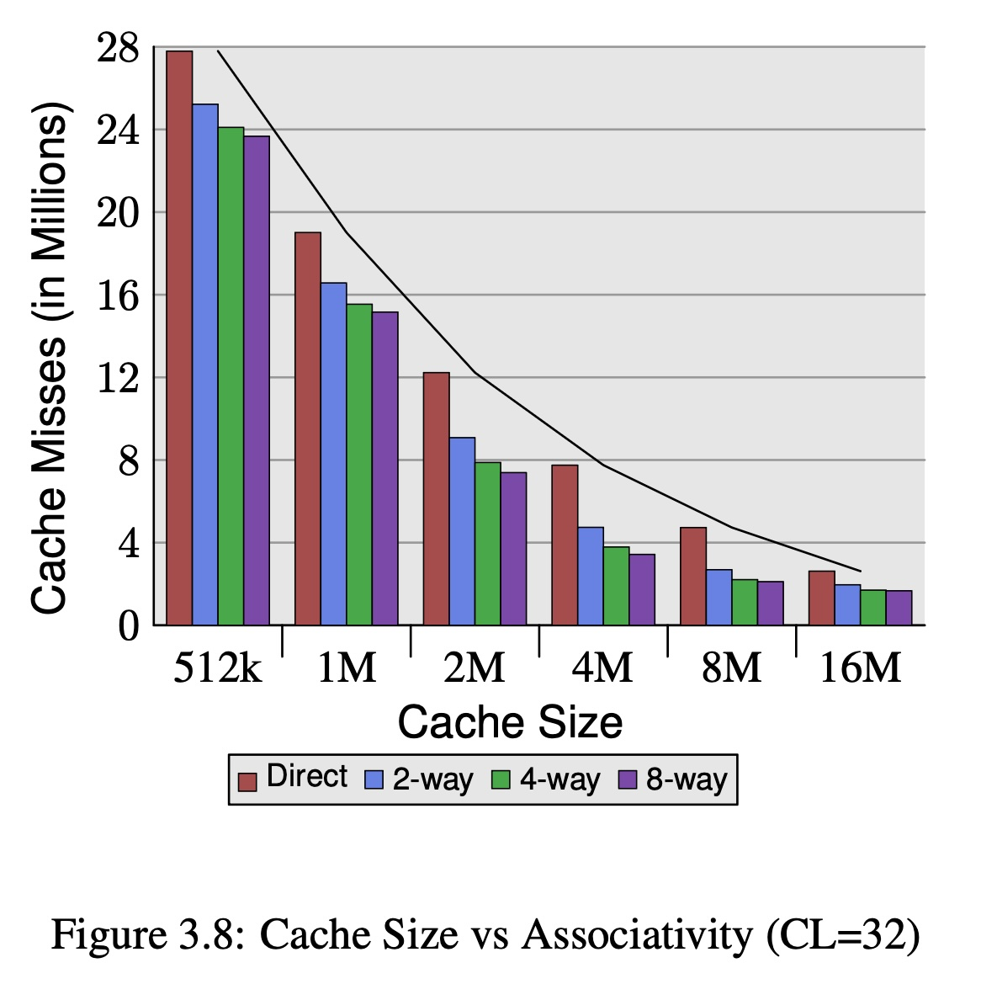  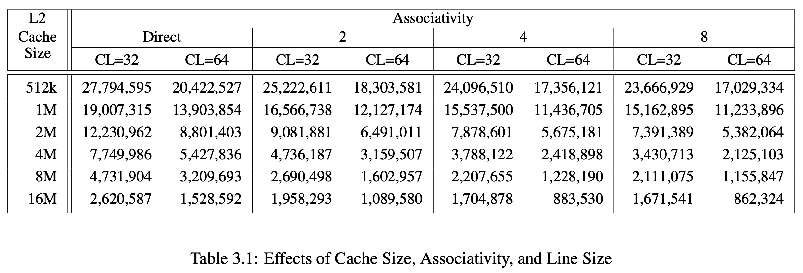  

> [\!TIP]   
> 论文使用 `gcc` 编译作为基准测试 。数据显示，对于一个 8MB 的缓存，从“直接映射 (1-Way)”升级到“2-Way 组关联”，缓存未命中次数减少了近 44% 。但从 4-Way 升到 8-Way 的收益就小得多了 。   

-----

### 关键内容三：多核时代的“缓存一致性” (MESI)

这可能是现代程序员最容易犯错的地方。在多核 CPU 中，每个核心都有自己的 L1 和 L2 缓存（L3 通常共享）。

**问题：** 核心 1 和 核心 2 都读取了内存地址 `A` 的值（假设是 5）。`A` 现在同时存在于两个核心的 L1 缓存中 。
如果 核心 1 把 `A` 的值改成了 10 。
此时，核心 2 再去读 `A`，它读到的是自己缓存里的旧值 5，还是 核心 1 的新值 10？

为了保证所有处理器看到的内存视图是一致的（称为 **“缓存一致性” Cache Coherency** ），CPU 们使用了一种协议，最著名的就是 **MESI** 。

MESI 协议规定了缓存行（Cache Line）的四种状态 ：

  * **M (Modified - 修改)：**  只有我（当前核心）有这份数据，而且我修改了它（和主内存不一致）。如果别人要，我必须先把数据写回内存 。
  * **E (Exclusive - 独占)：**  只有我有这份数据，但我没修改它（和主内存一致）。如果我（本地）要写，可以直接写，并变为 **M** 状态，这个操作很快 。
  * **S (Shared - 共享)：**  不止我有这份数据，别人（其他核心）也有。数据和主内存一致。
      * 如果我（本地）要读取：直接读 。
      * 如果我（本地）要写入：我必须大喊一声（发送 RFO 信号），通知所有其他核心，把它们的副本设为 **I (无效)** 。然后我才能把我的状态变为 **M** 并写入。这个操作（S -\> M）很慢 。
  * **I (Invalid - 无效)：**  我这份数据是无效的（垃圾数据）。

#### 程序员的噩梦：伪共享 (False Sharing)

理解了 MESI 和缓存行，你就能理解“伪共享”。

假设你有一个结构体数组，在 64 位系统上，一个 `long` 占 8 字节：

```c
struct {
  long thread1_counter; // 8 字节
  long thread2_counter; // 8 字节
} counters; 
```

你以为你做到了线程安全：

  * 线程 1 只会写入 `thread1_counter`。
  * 线程 2 只会写入 `thread2_counter`。

它们操作的是不同的变量，所以不需要加锁，对吗？ **大错特错！**

**问题在于缓存行：**
`thread1_counter` 和 `thread2_counter` 极有可能位于**同一个 64 字节的缓存行**中 。

当线程 1 (运行在 核心 1) 写入 `thread1_counter` 时，它会：

1.  核心 1 为该缓存行发送 RFO (Request For Ownership) 信号 。
2.  核心 2 缓存中的同一行（包含 `thread2_counter`）被迫变为 **I (无效)** 状态 。

当线程 2 (运行在 核心 2) 想要写入 `thread2_counter` 时，它会：

1.  发现自己的缓存行无效了，必须重新从 核心 1（或主内存）获取数据。
2.  获取后，核心 2 为该缓存行发送 RFO 信号。
3.  核心 1 缓存中的同一行（包含 `thread1_counter`）被迫变为 **I (无效)** 状态。

这两个线程虽然在逻辑上毫无关系，但在硬件层面，它们在疯狂地“抢夺”同一个缓存行的所有权 。这个现象称为 **“伪共享” (False Sharing)** 。

论文中的图 6.10 显示了伪共享的恐怖代价：在 4 处理器系统上，当 4 个线程各自修改位于同一个缓存行上的变量时，其性能损失高达 **1147%** (即慢了 11.47 倍) 。  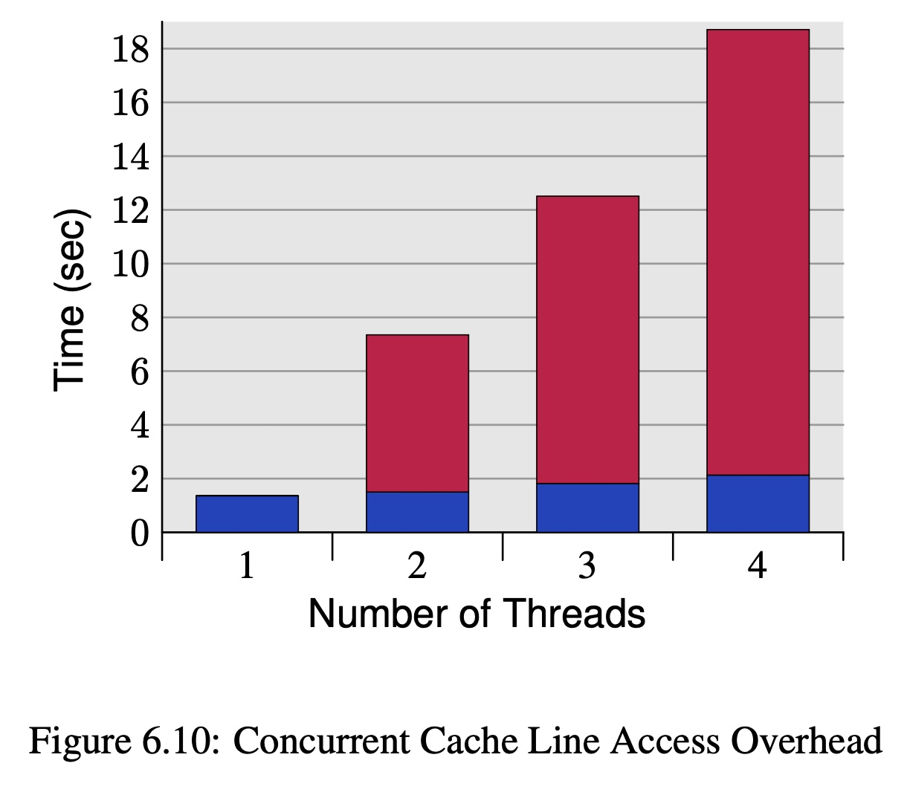  

**解决方案：** 确保被不同线程频繁写入的变量位于**不同的缓存行** 。最简单的方法是“填充”(Padding) ：

```c
struct {
  long thread1_counter; // 8 字节
  char padding[56];     // 填充 56 字节，占满 64 字节
} counter1;

struct {
  long thread2_counter; // 8 字节
  char padding[56];     // 填充 56 字节
} counter2;
```

-----

### 关键内容四：虚拟内存与TLB (“隐形”的缓存)

程序使用的是“虚拟地址”，CPU 最终需要的是“物理地址” 。这个翻译工作由 **MMU (内存管理单元)**  负责，它通过查询操作系统维护的“页表”(Page Tables) 来完成 。

现代操作系统使用多级页表（比如 4 级）。这意味着，一次虚拟地址到物理地址的翻译，在最坏情况下，可能需要 **4 次内存访问**！(访问 L4 表、L3 表、L2 表、L1 表) 。

这太慢了，无法接受 。因此，CPU 内部有另一个专门的缓存，用来缓存“地址翻译的结果”。这就是 **TLB (Translation Look-Aside Buffer，转换检测旁路缓冲器)** 。

  * **TLB Hit：** CPU 拿到虚拟地址，在 TLB 中一查，立刻（比如 1 个周期）就得到了物理地址。
  * **TLB Miss：** CPU 在 TLB 中没查到，被迫去内存中进行“页表遍历”(Page Table Walk) ，这个过程可能需要几十上百个周期 。

**关键启示 (TLB Miss 的代价)：**
论文中的图 3.12 显示了 TLB Miss 的巨大影响 。如果程序在短时间内访问了大量不同的内存页（比如一个巨大的稀疏数组），TLB 会被不断“冲刷”(Flush)，导致性能急剧下降 。  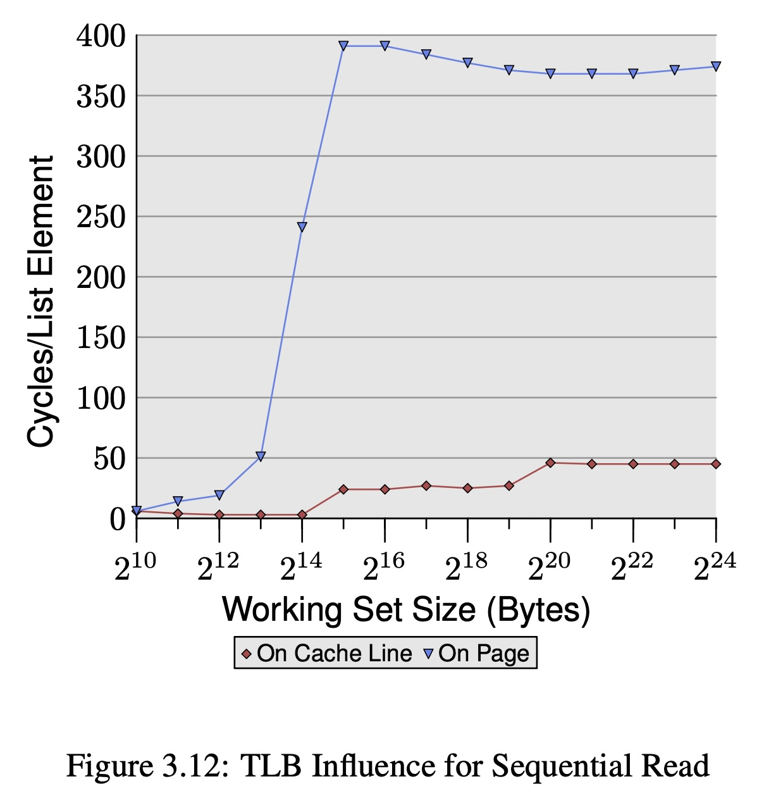  

**解决方案：** 尽可能使用 **“大页” (Huge Pages)** 。

  * 标准页大小是 4KB 。一个 2MB 的 TLB 条目（如果存在）可以一次性映射 2MB 的连续内存 。
  * 访问 2MB 数据：
      * 使用 4KB 页：需要 512 个 TLB 条目。
      * 使用 2MB 页：**只需要 1 个 TLB 条目** 。
  * 图 7.9 证明了这一点：使用 2MB 大页时，随机访问一个 512MB 的工作集，性能提升了 **38%** 。  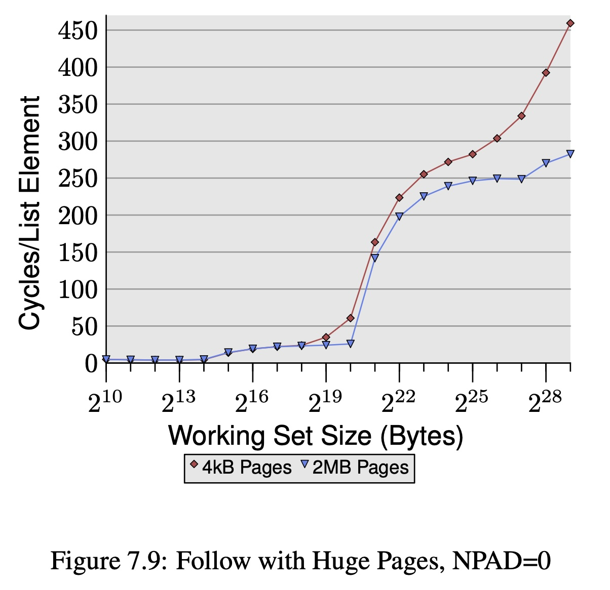  

-----

### 核心：程序员到底能做什么？(Sec 6)

论文的第 6 节  是全文的精华，它给出了程序员可以采取的行动。

#### 1\. 优化数据结构 (Sec 6.2.1)

  * **对齐 (Alignment)：** 始终确保你的数据结构（尤其是会被复制或频繁访问的） **对齐到缓存行** 。
      * 在栈上：`__attribute__((aligned(64)))` 。
      * 在堆上：使用 `posix_memalign` 。
      * *原因：* 避免一次访问跨越两个缓存行 。图 6.4 显示，未对齐的访问可能导致高达 **300%** 的性能下降 。 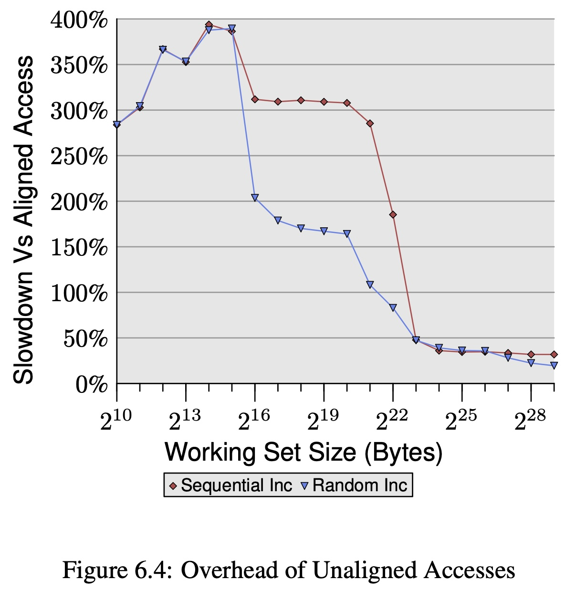  
  * **打包 (Packing)：** 将**会一起使用的数据**紧密地放在一起（最好在同一个缓存行内）。
  * **分离 (Separating)：** 将“热”数据（频繁读写）和“冷”数据（不常用）分离到不同的结构体中 。
      * *反例：* `struct { double price; bool paid; const char *buyer[5]; }`。如果你只是循环计算总价 (price)，`buyer` 字段（冷数据）会“污染”缓存行 ，导致 L1d 命中率下降。
  * **关键数据前置 (Critical Word First)：** 将结构体中**第一个被访问**的成员（“关键数据”）放在结构体的最开头 。
      * *原因：* 缓存行是串行填充的。如果 CPU 在等待 `word 8`，它必须等 `word 1-7` 都加载完毕 。如果它要的是 `word 1`，那么数据一旦开始加载，CPU 就可以立即恢复工作 。

#### 2\. 优化代码逻辑 (Sec 6.3)

  * **软件预取 (Software Prefetching)：**  如果你知道你“很快”将需要一块内存，但不是“现在”，请告诉 CPU。
      * `_mm_prefetch(void *p, enum _mm_hint h)` 。
      * `_MM_HINT_T0`：预取到所有缓存（L1, L2, L3）。适用于马上要用的数据 。
      * `_MM_HINT_NTA` (Non-Temporal)：预取到 L1，但告诉 CPU “我只用一次，用完就扔” 。这可以防止它污染 L2/L3 缓存 。
  * **绕过缓存 (Bypassing Cache)：**  如果你知道你只是在“写入”一块很大的内存，并且短期内不会再读它（比如 `memset` 一个大数组），请使用“非易失性存储”(Non-Temporal Stores)。
      * `_mm_stream_si128(...)` 。
      * 这会使用“写合并”(Write-Combining)  缓冲区，填满一个缓存行后，**直接写入主内存**，完全不读取旧数据，也不污染 L1/L2/L3 缓存 。

#### 3\. 优化多线程 (Sec 6.4)

  * **杜绝伪共享 (False Sharing)：**  这是首要任务。为不同线程频繁写入的数据（如计数器）进行缓存行填充 。
  * **使用线程局部存储 (TLS)：**  如果一个数据只被一个线程使用，就用 `__thread` 关键字（在 C/C++ 中）声明它 。这样每个线程都会有该变量的私有副本 ，从根本上消除了共享问题。
  * **使用正确的原子操作 (Atomic Operations)：** 
      * 在 x86 上，`lock add` 指令（如 `__sync_add_and_fetch` ）比使用 `CAS` (Compare-and-Swap) 循环（如 `__sync_bool_compare_and_swap` ）要快得多 。
      * *原因：* `CAS` 循环涉及“读取-修改-比较-写入”，在竞争激烈时会多次失败重试，导致大量 RFO 消息（缓存行争抢）。而 `lock add` 是一条指令，硬件保证其原子性，总线争抢少得多 。
  * **使用辅助线程 (Helper Threads)：**  在具有超线程 (Hyper-Threading) 的核心上，这是一个绝佳的技巧 。
      * 线程 1 (HT 0)：执行主要的计算工作 。
      * 线程 2 (HT 1)：作为“预取助手”，它的任务就是提前遍历数据结构，将数据加载到 L1/L2 缓存中 。
      * *原因：* 两个超线程共享 L1/L2 缓存 。当计算线程需要数据时，预取助手已经把它准备好了 。图 6.8 显示，这种方法在工作集大于 L2 缓存时，性能提升了约 **25%** 。  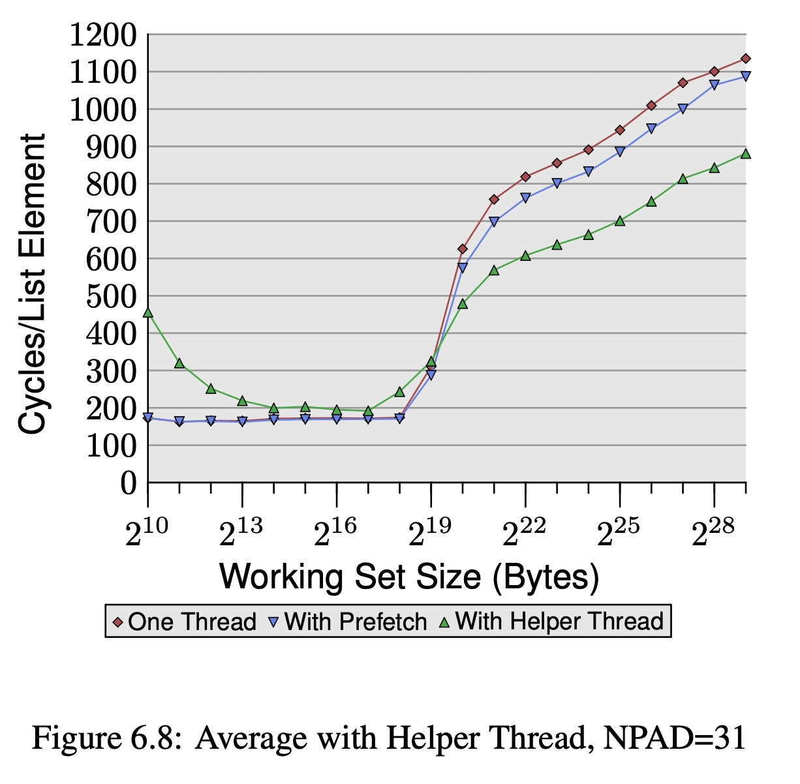  

#### 4\. 优化 NUMA (Sec 6.5)

  * **线程亲和性 (Thread Affinity)：**  把线程“钉”在特定的 CPU 核心上 (使用 `sched_setaffinity`  或 `pthread_setaffinity_np` )。
      * *场景1：* 两个线程**共享大量数据**。将它们钉在**同一个 CPU** 的两个核心上（或共享 L3 的核心），这样它们可以通过 L3 缓存共享数据，而无需访问主内存 。
      * *场景2：* 两个线程**毫无关系**。将它们钉在**不同的 CPU** 上 ，这样它们就不会互相争抢缓存和内存带宽 。
  * **内存策略 (Memory Policy)：**  使用 `mbind`  或 `set_mempolicy`  告诉操作系统在哪-个 NUMA 节点上分配内存。
  * **复制只读数据 (Replicate Read-Only Data)：**  如果线程需要访问一个大型的只读数据结构（如查找表），不要让所有 CPU 都去远程读取它。而是在每个 NUMA 节点上都创建一份该数据的副本 。

### 总结

《What Every Programmer Should Know About Memory》的核心思想是：**内存不是一个统一、平坦的地址空间**。它是一个复杂的、分层的、非统一的系统。

硬件设计师已经用缓存、预取、乱序执行等技术尽力隐藏了内存的缓慢 。但要榨干最后一丝性能，程序员必须停止将内存视为“黑盒”，而是要像硬件一样思考，通过优化数据布局和访问模式来“帮助”硬件 。

您可以把这份解读当作论文的“索引”。如果您对某个特定主题（如 MESI 或 NUMA）感兴趣，可以深入阅读论文中对应的章节。

您希望我详细解释一下文中提到的某个具体优化技巧（比如“非易失性存储”或“辅助线程”）吗？
  
## 3 术语 
  
这篇论文《What Every Programmer Should Know About Memory》内容非常密集且技术性强。我为您提取了其中最关键的、程序员必须理解的术语，并用通俗的中文进行了解读。

-----

### 1\. 硬件架构术语

#### 1.1 NUMA (Non-Uniform Memory Architecture, 非统一内存访问)

  * **通俗讲解：**
    想象一个大办公室（电脑系统），里面有多个团队（多颗 CPU）。

      * **UMA (统一内存访问)：** 只有一个中央文件柜（主内存），所有团队都去那里拿文件，速度都一样慢。
      * **NUMA (非统一内存访问)：**  每个团队（CPU）旁边都有一个自己的小文件柜（本地内存），取文件非常快 。但如果 1 号团队需要 2 号团队的文件，它就必须派人跑过去拿（通过互连总线访问远程内存），这个过程会慢很多 。

  * **论文中的图示 (图 2.3 )：**    
    论文中的图 2.3 展示了这种架构，其中每个 CPU 都有自己直连的 RAM（本地内存），CPU 之间通过互连总线通信。

    ```text
           +----------+         +----------+
           |  CPU 1   |         |  CPU 2   |
           | (带 MC)  |         | (带 MC)  |
           +----------+         +----------+
                |                    |
            [ 本地 RAM ]         [ 本地 RAM ]
                |                    |
           +----(互联总线)------------+
                |                    |
           +----------+         +----------+
           |  CPU 3   |         |  CPU 4   |
           | (带 MC)  |         | (带 MC)  |
           +----------+         +----------+
                |                    |
            [ 本地 RAM ]         [ 本地 RAM ]
    ```

  * **关键点：** 在 NUMA 系统上，CPU 访问不同内存地址的延迟是**不一样的**。程序性能会因为线程运行在哪个 CPU 上、以及它访问的数据存储在哪个节点的内存上而产生巨大差异 。

#### 1.2 DMA (Direct Memory Access, 直接内存访问)

  * **通俗讲解：**
    在没有 DMA 的情况下，如果一块硬盘（I/O 设备）要把数据读入内存，它必须先把数据交给 CPU，CPU 再亲手把数据写入内存 。这会极大地占用 CPU 的时间。

    有了 DMA，CPU 可以对硬盘说：“你（硬盘）自己把数据直接送到内存的这个地址去，弄完了再通知我” 。这样，CPU 就可以在数据传输期间去干别的事 。

  * **关键点：** DMA 大大解放了 CPU ，但也带来了新的问题：它（比如网卡）在访问内存时，会和 CPU 竞争内存总线的带宽 。

-----

### 2\. DRAM (内存) 访问术语

#### 2.1 SRAM (静态 RAM) vs DRAM (动态 RAM)

  * **SRAM (Static RAM)：**

      * **讲解：** 用 6 个晶体管（如图 2.4 ）来存储 1 个比特，只要通电，数据就一直保持 。    
      * **优点：** 速度极快（几乎和 CPU 一样快）。
      * **缺点：** 非常昂贵，耗电，密度低（占地方大）。
      * **用途：** CPU 缓存 (Cache) 。

  * **DRAM (Dynamic RAM)：**

      * **讲解：** 用 1 个晶体管和 1 个电容 (Capacitor)（如图 2.5 ）来存储 1 个比特。    
      * **优点：** 结构简单，密度高，成本低廉 。
      * **缺点：** 速度慢 。电容会“漏电”(Leakage) ，所以必须**周期性地“刷新”(Refresh)** 来给电容重新充电，否则数据会丢失 。刷新操作会占用时间，导致内存暂时不可访问 。
      * **用途：** 电脑的主内存 (RAM) 。

#### 2.2 DRAM 访问时序 (RAS, CAS, CL)

  * **通俗讲解：**
    访问 DRAM 就像在 Excel 表格里找一个单元格，你不能直接跳过去，必须分两步：

    1.  **RAS (Row Address Selection, 行地址选择)：**  先告诉内存你要访问“哪一行”。内存控制器发出 $\overline{RAS}$ 信号并发送行地址 。
    2.  **CAS (Column Address Selection, 列地址选择)：**  在选定行之后，再告诉内存你要访问“哪一列”。内存控制器发出 $\overline{CAS}$ 信号并发送列地址 。

  * **关键延迟参数：**

      * **$t_{RCD}$ (RAS-to-CAS Delay, 行到列延迟)：**  选中“行”之后，必须等待 $t_{RCD}$ 这么久，才能开始选“列”。
      * **CL (CAS Latency, CAS 延迟)：**  选中“列”之后，必须等待 $CL$ 这么久，数据才会真正出现在总线上。
      * **$t_{RP}$ (Row Precharge Time, 行预充电时间)：**  在访问完一行后，不能马上访问另一行。必须等待 $t_{RP}$ 这么久，对当前行进行“预充电”（关闭）后，才能发下一个 $\overline{RAS}$ 信号去选新行 。

  * **论文中的图示 (图 2.8  和 2.9 )：**      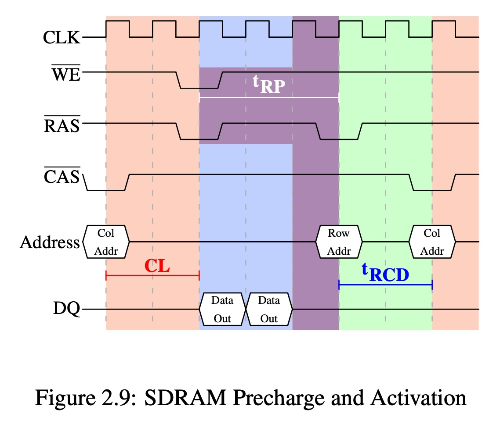  
    这些时序图展示了在总线时钟 (CLK) 驱动下， $\overline{RAS}$ 、 $\overline{CAS}$ 、地址线 (Address) 和数据线 (DQ) 是如何协同工作的，以及 $t_{RCD}$ 和 $CL$ 延迟在其中扮演的角色。

    ```mermaid
    sequenceDiagram
        participant MC as 内存控制器
        participant DRAM as 内存芯片
        MC->>DRAM: (1) $\overline{RAS}$ 激活 (行地址)
        Note right of DRAM: 等待 $t_{RCD}$ 延迟
        MC->>DRAM: (2) $\overline{CAS}$ 激活 (列地址)
        Note right of DRAM: 等待 $CL$ 延迟
        DRAM-->>MC: (3) Data Out (数据)
        Note right of DRAM: (4) 传输...
        DRAM-->>MC: (5) Data Out (数据)
    ```

-----

### 3\. CPU 缓存 (Cache) 核心术语

#### 3.1 空间局部性 (Spatial Locality) 和 时间局部性 (Temporal Locality)

  * **通俗讲解：** 这是缓存能够“作弊”成功的两大理论基础 。
      * **时间局部性 (Temporal Locality)：**  如果你刚用过一个东西，你很可能马上会再用它一次。（例如：循环中的计数器变量）。
      * **空间局部性 (Spatial Locality)：**  如果你刚用过一个东西，你很可能马上要用它旁边的东西。（例如：遍历数组的下一个元素）。
  * **关键点：** 缓存系统就是赌这两个原理会成真。

#### 3.2 Cache Line (缓存行)

  * **通俗讲解：**
    这是**整篇论文最重要的术语**。缓存和内存之间不是一个字节一个字节地交换数据，而是一块一块地交换。这个“块”就是缓存行 。

    在现代 CPU 上，一个缓存行通常是 **64 字节** 。

    当你需要内存地址 `0x1000` 上的一个整数（4 字节）时，CPU 会从主内存中抓取**一整个 64 字节**（比如从 `0x1000` 到 `0x103F`）的数据块，并把它放进 L1 缓存 。

  * **关键点：** 这个设计完美利用了“空间局部性” 。如果你接下来要访问地址 `0x1004`，它已经在 L1 缓存里了，速度极快。但它也导致了“伪共享”问题。

#### 3.3 缓存关联性 (Cache Associativity)

  * **通俗讲解：**
    这个术语回答了一个问题：一个内存地址的数据，可以被存放到缓存的哪些位置？

    想象主内存是图书馆，L1 缓存是你面前的一个只有 8 个槽位的书架。

      * **Direct-Mapped (直接映射)：**  每本书（内存地址）只能放在书架上的一个“固定”槽位。如果两个你经常看的书（比如地址 `0x1000` 和 `0x2000`）恰好要放在同一个槽位，你就会不停地把它们换入换出，即使书架上其他 7 个槽位都是空的。这就是“冲突未命中”(Conflict Misses) 。
      * **Fully Associative (全关联)：**  任何书可以放在书架的“任意”槽位。非常灵活，但找书时，你必须同时看 8 个槽位，硬件上非常昂贵且缓慢 。
      * **N-Way Set Associative (N路组关联)：**  妥协方案。书架被分成“组”(Set)。比如 8 个槽位分成 4 组，每组 2 个槽位（2-Way）。一本书必须放在“固定”的组里（如第 3 组），但可以放在该组的“任意”一个槽位（2 个位置可选）。

  * **论文中的图示 (图 3.7 )：**    
    这张图展示了组关联缓存的结构。虚拟地址的一部分（S 位）用来选择“组”，然后 CPU 并行比较该组中所有 N 个槽位的“标签”(Tag)，看是否命中。

    ```text
           +-------------+-------------+  (地址)
           |   Tag (T)   |  Set (S)    |  Offset (O) |
           +-------------+-------------+-------------+
                             |
                             |  (S位用于选择 "组")
                             V
    +--------+--------+    +--------+--------+
    | Tag | 数据 |    | Tag | 数据 | ... (共 2^S 组)
    +--------+--------+    +--------+--------+
    | Tag | 数据 |    | Tag | 数据 |
    +--------+--------+    +--------+--------+
         (N 路)                 (N 路)
    ```

#### 3.4 写策略 (Write-Through vs Write-Back)

  * **通俗讲解：** 当 CPU 往缓存里“写”数据时，什么时候更新到主内存？
      * **Write-Through (写通)：**  “同步”写入。CPU 每次写入缓存时，都**必须同时**写入主内存 。优点是简单且数据一致，缺点是速度受限于主内存，非常慢 。
      * **Write-Back (写回)：**  “异步”写入。CPU 写入缓存后，把该缓存行标记为“脏”(Dirty) ，然后就完事了。只有当这个“脏”的缓存行因为某种原因（比如缓存满了）被从缓存中“驱逐”(Evict) 出去时，它才会被一次性写回主内存 。
  * **关键点：** 写回策略性能远高于写通 ，但它也引出了缓存一致性的复杂问题。

-----

### 4\. 多核 (并发) 关键术语

#### 4.1 缓存一致性 (Cache Coherency) 与 MESI 协议

  * **通俗讲解：**
    在多核 CPU 中，同一个内存地址的数据可能在多个核心的缓存中都有副本 。**缓存一致性**协议就是一套规则，用来保证当一个核心修改了数据后，其他核心不会读到旧的、失效的数据 。

    **MESI** 是最著名的缓存一致性协议，它为每个缓存行定义了四种状态 ：

      * **M (Modified - 修改)：**  只有我有，而且我改过了（“脏”数据）。
      * **E (Exclusive - 独占)：**  只有我有，但我没改过（“干净”数据）。
      * **S (Shared - 共享)：**  我有，别人也有，数据是“干净”的。
      * **I (Invalid - 无效)：**  我的这份数据是垃圾，不能用。

  * **关键点：**

      * 当一个核心想“写入”一个 'S' (共享) 状态的缓存行时，它必须先向所有其他核心广播一个“请求所有权”(RFO, Request For Ownership) 消息，强制其他所有核心将它们的副本变为 'I' (无效) 。
      * 当一个核心想“读取”一个 'M' (修改) 状态的缓存行时，拥有 'M' 状态的核心必须先把数据写回主内存（或者直接传给它），并把两者都置为 'S' 状态 。
      * 这些 RFO 消息和状态切换就是多核性能问题的核心。

#### 4.2 False Sharing (伪共享)

  * **通俗讲解：**
    这是多线程编程中最隐蔽的性能杀手。当两个线程（运行在不同核心上）各自访问**不同的**变量时，如果这些变量碰巧位于**同一个缓存行**上，就会发生伪共享 。

      * **场景：** 核心 1 上的线程 A 不断写入变量 `X`；核心 2 上的线程 B 不断写入变量 `Y`。`X` 和 `Y` 在内存中相邻，位于同一个 64 字节的缓存行上。
      * **过程：**
        1.  线程 A 写入 `X`。核心 1 广播 RFO，核心 2 的缓存行变为 'I' 。
        2.  线程 B 写入 `Y`。核心 2 发现缓存行无效，必须重新加载。
        3.  线程 B 写入 `Y`。核心 2 广播 RFO，核心 1 的缓存行变为 'I'。
        4.  线程 A 写入 `X`。核心 1 发现缓存行无效，必须重新加载...

    两个线程虽然在逻辑上完全不相干，但在硬件上却在疯狂地抢夺同一个缓存行的所有权，导致缓存行在两个核心间“乒乓” 。

  * **论文中的图示 (图 6.10)：**    
    该图显示，在 4 个处理器上，当 4 个线程各自修改同一个缓存行上的不同变量时，性能（红色柱）比修改不同缓存行（蓝色柱）慢了 **11.47 倍** (1147% 的惩罚) 。

    ```mermaid
    gantt
        title 图 6.10 伪共享开销 (4 线程)
        dateFormat  X
        axisFormat %s s

        section 单独的缓存行 (蓝色柱)
        线程 1 : 0, 1.5
        线程 2 : 0, 1.5
        线程 3 : 0, 1.5
        线程 4 : 0, 1.5
        
        section 共享的缓存行 (红色柱)
        线程 1 : 0, 17.2
        线程 2 : 0, 17.2
        线程 3 : 0, 17.2
        线程 4 : 0, 17.2
    ```

-----

### 5\. 性能与优化术语

#### 5.1 TLB (Translation Look-Aside Buffer, 转换检测旁路缓冲器)

  * **通俗讲解：**
    程序使用的是“虚拟地址”，CPU 访问内存用的是“物理地址”。操作系统通过“页表”(Page Table) 来进行这种翻译 。

    在最坏情况下，每访问一次内存，CPU 都需要先去主内存中读取 4 次页表项才能完成翻译 。这是无法接受的。

    TLB 就是一个专门用来缓存“虚拟地址 → 物理地址”翻译结果的**高速缓存** 。

  * **TLB Miss (TLB 未命中)：**
    如果 TLB 中没有缓存某个虚拟地址的翻译结果，CPU 就必须暂停执行，去主内存中进行一次缓慢的“页表遍历”(Page Table Walk) 。图 3.12  展示了这种操作的巨大开销。    

  * **关键点：** 减少 TLB Miss 的最有效方法是使用**大页 (Huge Pages)** 。一个 4KB 的页需要一个 TLB 条目；一个 2MB 的大页也只需要一个 TLB 条目，但它覆盖的内存范围是前者的 512 倍 。

#### 5.2 Prefetching (预取)

  * **通俗讲解：**
    一种隐藏内存访问延迟（即 CPU 等待数据的时间）的技术 。与其在需要数据时才去拿，不如在它被需要**之前**就提前把它加载到缓存中。
      * **Hardware Prefetching (硬件预取)：**  CPU 自动检测内存访问模式 。如果你在访问数组元素 `A[0]`、`A[1]`、`A[2]`，CPU 会“猜到”你接下来要访问 `A[3]`、`A[4]`... 于是自动提前加载它们 。它的主要缺点是无法跨越内存页（Page）的边界 。
      * **Software Prefetching (软件预取)：**  程序员通过插入 `_mm_prefetch`  这样的指令，明确告诉 CPU：“请帮我把这个地址的数据准备好，我稍后会用到它”。

#### 5.3 Non-Temporal Access (NT, 非易失性访问)

  * **通俗讲解：**
    这是程序员给 CPU 的一个“提示”，意思是：“我操作的这块数据，**短期内不会再次使用**，请不要用它污染我的常规缓存” 。
      * **NT 写入 (如 `_mm_stream_...` )：** 用于 `memset` 或写入大视频帧。它会绕过缓存，使用“写合并”(Write-Combining) 缓冲区，然后直接将数据写入主内存 。这避免了（1）因写入而从内存中读取旧缓存行的开销  和（2）用“只用一次”的数据污染了宝贵的 L1/L2 缓存。
      * **NT 预取 (如 `_MM_HINT_NTA` )：** 用于读取只用一次的数据。CPU 会将其加载到 L1，但会尽量避免它进入 L2/L3 。

#### 5.4 Critical Word First (关键数据优先)

  * **通俗讲解：**
    当你需要一个 64 字节的缓存行时，数据并不是瞬间全部到达的，而是（比如）以 8 字节为一块，分 8 次串行到达。

    假设 CPU 需要的数据（“关键数据”）是这 64 字节中的**最后 8 字节**。CPU 必须等待前 7 块（56 字节）都加载完毕后才能拿到它需要的数据，这会浪费很多时间 。

    “关键数据优先”是一种硬件优化 ，CPU 告诉内存控制器它最急需的是哪一块，内存控制器会**优先传输那一块数据**，CPU 拿到后可以立即开始工作，同时在后台接收缓存行的其余部分 。

  * **关键点：** 程序员应将结构体中最重要的、最先被访问的成员放在结构体的最开头（即缓存行的起始位置）。
  
## 参考        
         
https://people.freebsd.org/~lstewart/articles/cpumemory.pdf    
        
<b> 以上内容基于DeepSeek、Qwen、Gemini及诸多AI生成, 轻微人工调整, 感谢杭州深度求索人工智能、阿里云、Google等公司. </b>        
        
<b> AI 生成的内容请自行辨别正确性, 当然也多了些许踩坑的乐趣, 毕竟冒险是每个男人的天性.  </b>        
    
#### [PolarDB 学习图谱](https://www.aliyun.com/database/openpolardb/activity "8642f60e04ed0c814bf9cb9677976bd4")
  
  
#### [PostgreSQL 解决方案集合](../201706/20170601_02.md "40cff096e9ed7122c512b35d8561d9c8")
  
  
#### [德哥 / digoal's Github - 公益是一辈子的事.](https://github.com/digoal/blog/blob/master/README.md "22709685feb7cab07d30f30387f0a9ae")
  
  
#### [About 德哥](https://github.com/digoal/blog/blob/master/me/readme.md "a37735981e7704886ffd590565582dd0")
  
  

  
