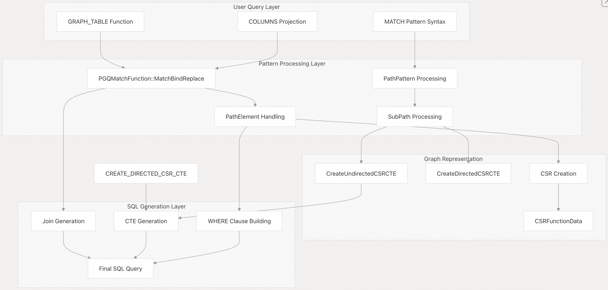
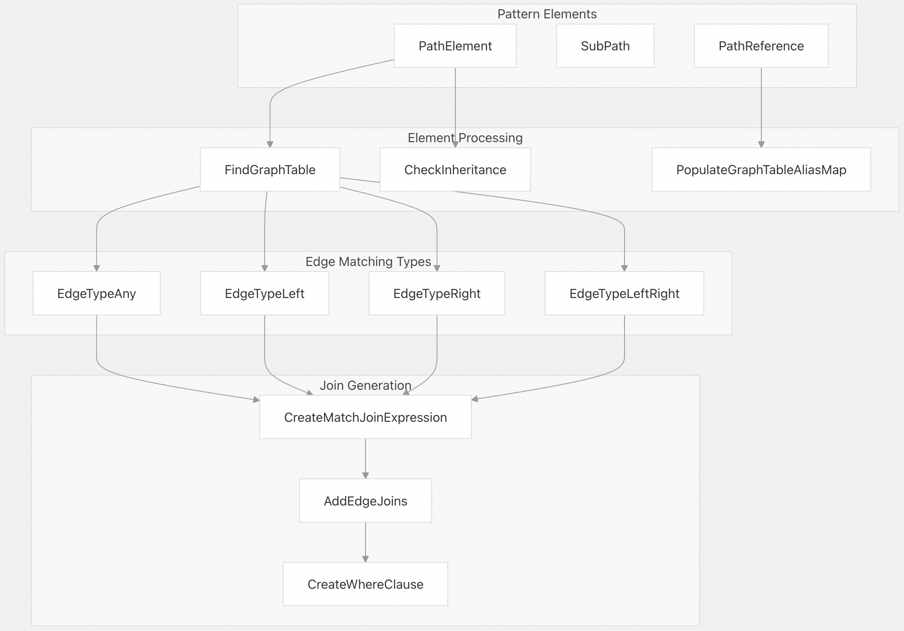

## DuckPGQ 源码学习: 4 图查询 (Graph Querying)  
                                            
### 作者                                            
digoal                                            
                                            
### 日期                                            
2025-11-07                                            
                                            
### 标签                                            
DuckDB , PGQ , 属性图 , DuckPGQ , 源码学习                                     
                                            
----                       
                                            
## 背景         
本文档涵盖了 **DuckPGQ** 的核心**图查询 (graph querying)** 能力，重点关注 `GRAPH_TABLE` 函数和 `MATCH` 模式语法。它解释了用于**模式匹配 (pattern matching)**、**路径查找 (path finding)** 和**查询处理 (query processing)** 的内部架构，该架构使得可以在**属性图 (property graphs)** 上实现与 SQL 集成的图查询。  
  
## 概览 (Overview)  
  
DuckPGQ 通过 `GRAPH_TABLE` **表函数 (table function)** 提供图查询，该函数接受 `MATCH` 模式并将其转换为优化的 **SQL** 查询。该系统使用**压缩稀疏行 (Compressed Sparse Row, CSR)** 数据结构来实现高效的**图遍历 (graph traversal)**，并支持基本模式匹配和高级路径查找操作。  
  
核心查询功能围绕三个主要组件构建：  
  
  * **模式匹配引擎 (Pattern Matching Engine)**：处理 `MATCH` 子句中的**顶点 (vertex)** 和**边 (edge)** 模式。  
  * **CSR 图表示 (CSR Graph Representation)**：实现路径查找操作的高效遍历。  
  * **SQL 转换层 (SQL Translation Layer)**：将图模式转换为带有适当**连接 (joins)** 和**公共表表达式 (CTEs)** 的优化 SQL。  
  
## 查询处理架构 (Query Processing Architecture)  
  
  
  
来源:  
[`src/core/functions/table/match.cpp` 1-1420](https://github.com/cwida/duckpgq-extension/blob/29748bfe/src/core/functions/table/match.cpp#L1-L1420) [`src/include/duckpgq/core/functions/table/match.hpp` 27-183](https://github.com/cwida/duckpgq-extension/blob/29748bfe/src/include/duckpgq/core/functions/table/match.hpp#L27-L183)  
  
## GRAPH\_TABLE 函数结构 (Function Structure)  
  
`GRAPH_TABLE` 函数是 DuckPGQ 中所有图查询的**入口点 (entry point)**。它接受一个属性图名称、`MATCH` 模式和一个 `COLUMNS` 规范：  
  
```  
FROM GRAPH_TABLE(property_graph_name   
    MATCH pattern   
    WHERE conditions  
    COLUMNS (projection_list)  
) alias  
```  
  
该函数是通过 `PGQMatchFunction` 类实现的，该类扩展了 DuckDB 的 `TableFunction` **接口 (interface)**。核心处理发生在 `MatchBindReplace` 中，它将图模式转换为等效的 SQL 查询。  
  
## 核心模式匹配组件 (Core Pattern Matching Components)  
  
  
  
来源:  
[`src/core/functions/table/match.cpp` 133-145](https://github.com/cwida/duckpgq-extension/blob/29748bfe/src/core/functions/table/match.cpp#L133-L145) [`src/core/functions/table/match.cpp` 147-185](https://github.com/cwida/duckpgq-extension/blob/29748bfe/src/core/functions/table/match.cpp#L147-L185) [`src/core/functions/table/match.cpp` 686-722](https://github.com/cwida/duckpgq-extension/blob/29748bfe/src/core/functions/table/match.cpp#L686-L722)  
  
### 模式元素类型 (Pattern Element Types)  
  
该系统处理三种主要的模式元素类型：  
  
  * **路径元素 (PathElement)**：表示模式中的单个顶点 `(v:Label)` 或边 `[e:Label]`。  
  * **子路径 (SubPath)**：表示**量化路径模式 (quantified path patterns)**，例如 `->+` 或 `->{1,3}`。  
  * **路径引用 (PathReference)**：包含 `PathElement` 和 `SubPath` 的**基类 (Base class)**。  
  
`GetPathElement` 和 `GetSubPath` 函数在处理过程中区分这些类型。  
  
### 边方向处理 (Edge Direction Handling)  
  
DuckPGQ 支持四种**边方向类型 (edge direction types)**，每种类型都由特定的方法处理：  
  
| 方向类型 (Direction Type) | 语法 (Syntax) | 处理器方法 (Handler Method) | 描述 (Description) |  
| :--- | :--- | :--- | :--- |  
| 右向 (Right) | `->` | `EdgeTypeRight` | 从源 (source) 到目标 (destination) 的**有向边 (Directed edge)** |  
| 左向 (Left) | `<-` | `EdgeTypeLeft` | 从目标到源的有向边 |  
| 任意 (Any) | `-` | `EdgeTypeAny` | **无向边 (Undirected edge)**（双向） |  
| 左右向 (Left-Right) | `<->` | `EdgeTypeLeftRight` | **双向边 (Bidirectional edge)** |  
  
来源:  
[`src/core/functions/table/match.cpp` 291-361](https://github.com/cwida/duckpgq-extension/blob/29748bfe/src/core/functions/table/match.cpp#L291-L361) [`src/core/functions/table/match.cpp` 363-391](https://github.com/cwida/duckpgq-extension/blob/29748bfe/src/core/functions/table/match.cpp#L363-L391) [`src/core/functions/table/match.cpp` 393-430](https://github.com/cwida/duckpgq-extension/blob/29748bfe/src/core/functions/table/match.cpp#L393-L430)  
  
## 基于 CSR 的路径查找 (CSR-Based Path Finding)  
  
对于路径查找操作（如 `->*` 或 `->{1,5}` 等量化模式），DuckPGQ 使用**压缩稀疏行 (Compressed Sparse Row, CSR)** 数据结构来实现高效的图遍历。  
  
### CSR 数据结构 (Data Structure)  
  
`CSR` 类以**压缩稀疏行格式 (compressed sparse row format)** 表示图：  
  
```  
class CSR {  
    atomic<int64_t> *v{};        // Vertex offset array  
    vector<int64_t> e;           // Edge destination array    
    vector<int64_t> edge_ids;    // Edge ID array  
    vector<int64_t> w;           // Edge weights  
    // ... initialization flags and size  
};  
```  
  
### CSR 创建过程 (Creation Process)  
  
  
  
来源:  
[`src/core/utils/compressed_sparse_row.cpp` 646-690](https://github.com/cwida/duckpgq-extension/blob/29748bfe/src/core/utils/compressed_sparse_row.cpp#L646-L690) [`src/core/utils/compressed_sparse_row.cpp` 478-561](https://github.com/cwida/duckpgq-extension/blob/29748bfe/src/core/utils/compressed_sparse_row.cpp#L478-L561) [`src/core/utils/compressed_sparse_row.cpp` 418-475](https://github.com/cwida/duckpgq-extension/blob/29748bfe/src/core/utils/compressed_sparse_row.cpp#L418-L475)  
  
CSR 创建过程包括：  
  
1.  **顶点数组创建 (Vertex Array Creation)**：`CreateDirectedCSRVertexSubquery` 或 `CreateUndirectedCSRVertexSubquery` 生成**顶点偏移数组 (vertex offset array)**。  
2.  **边数组填充 (Edge Array Population)**：处理边关系以创建**压缩的边表示 (compressed edge representation)**。  
3.  **CTE 集成 (CTE Integration)**：CSR 数据结构作为**公共表表达式 (Common Table Expressions, CTEs)** 嵌入到最终查询中。  
  
### 路径查找函数 (Path Finding Functions)  
  
路径查找操作使用对 CSR 结构进行操作的专用函数：  
  
  * `shortestpath(csr_id, vertex_count, src_rowid, dst_rowid)`：查找顶点之间的**最短路径 (shortest paths)**。  
  * `iterativelength(csr_id, vertex_count, src_rowid, dst_rowid)`：计算用于**量词界限 (quantifier bounds)** 的路径长度。  
  
这些函数通过 `AddPathQuantifierCondition` 方法集成到 SQL 查询中，该方法创建 `BETWEEN` 表达式以强制执行**路径长度约束 (path length constraints)**。  
  
来源:  
[`src/core/functions/table/match.cpp` 724-758](https://github.com/cwida/duckpgq-extension/blob/29748bfe/src/core/functions/table/match.cpp#L724-L758) [`src/core/functions/table/match.cpp` 454-520](https://github.com/cwida/duckpgq-extension/blob/29748bfe/src/core/functions/table/match.cpp#L454-L520)  
  
## 查询处理管道 (Query Processing Pipeline)  
  
完整的查询处理遵循此**管道 (pipeline)**：  
  
1.  **模式解析 (Pattern Parsing)**：`MatchBindReplace` 接收解析后的 `MATCH` 表达式。  
2.  **别名解析 (Alias Resolution)**：`PopulateGraphTableAliasMap` 将**模式变量 (pattern variables)** 映射到**属性图表 (property graph tables)**。  
3.  **路径处理 (Path Processing)**：`ProcessPathList` 处理顶点和边的**序列 (sequence)**。  
4.  **连接生成 (Join Generation)**：`AddEdgeJoins` 为边模式创建适当的 SQL **连接 (joins)**。  
5.  **CSR 集成 (CSR Integration)**：路径查找模式触发 CSR **CTE** 创建。  
6.  **条件构建 (Condition Building)**：`CreateWhereClause` 结合所有**模式约束 (pattern constraints)**。  
7.  **SQL 组装 (SQL Assembly)**：使用适当的 `FROM`、`WHERE` 和 `SELECT` 子句构造最终的 SQL 查询。  
  
生成的 SQL 查询保持了原始图模式的**语义 (semantics)**，同时利用 DuckDB 的 SQL 执行引擎进行高效处理。  
  
来源:  
[`src/core/functions/table/match.cpp` 124-126](https://github.com/cwida/duckpgq-extension/blob/29748bfe/src/core/functions/table/match.cpp#L124-L126) [`src/core/functions/table/match.cpp` 439-452](https://github.com/cwida/duckpgq-extension/blob/29748bfe/src/core/functions/table/match.cpp#L439-L452)  
    
#### [PolarDB 学习图谱](https://www.aliyun.com/database/openpolardb/activity "8642f60e04ed0c814bf9cb9677976bd4")
  
  
#### [PostgreSQL 解决方案集合](../201706/20170601_02.md "40cff096e9ed7122c512b35d8561d9c8")
  
  
#### [德哥 / digoal's Github - 公益是一辈子的事.](https://github.com/digoal/blog/blob/master/README.md "22709685feb7cab07d30f30387f0a9ae")
  
  
#### [About 德哥](https://github.com/digoal/blog/blob/master/me/readme.md "a37735981e7704886ffd590565582dd0")
  
  

  
