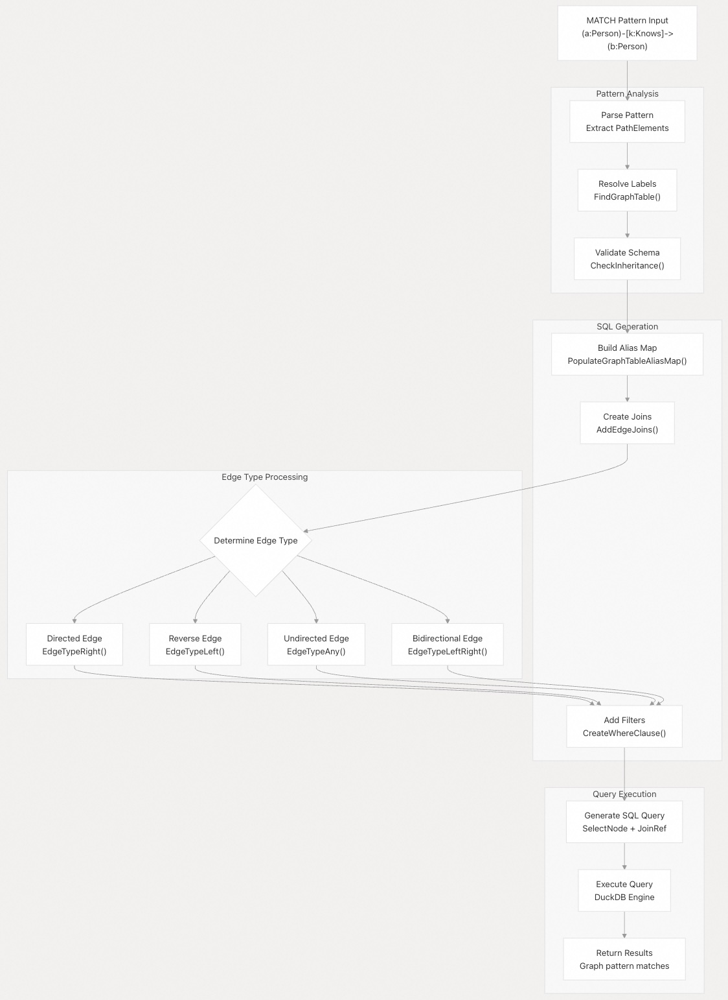
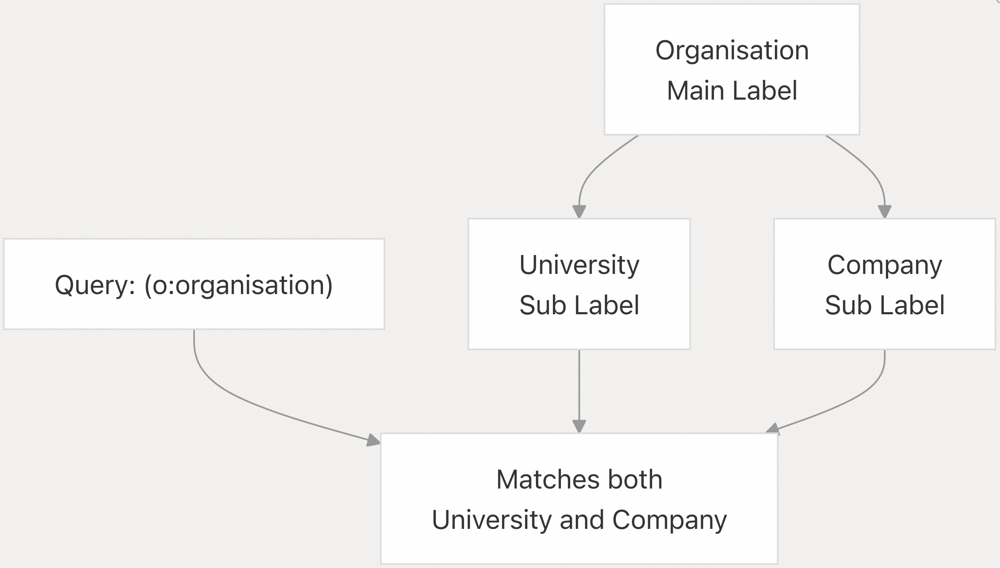

## DuckPGQ 源码学习: 4.1 模式匹配 (Pattern Matching)   
                                              
### 作者                                              
digoal                                              
                                              
### 日期                                              
2025-11-07                                              
                                              
### 标签                                              
DuckDB , PGQ , 属性图 , DuckPGQ , 源码学习                                       
                                              
----                         
                                              
## 背景           
本文档涵盖了 DuckPGQ 的**模式匹配** (`pattern matching`) 功能，这是在 `GRAPH_TABLE` 函数中使用 `MATCH` 语法查询**属性图** (`property graphs`) 的核心功能。模式匹配允许用户使用**声明式语法** (`declarative syntax`) 指定**图遍历模式** (`graph traversal patterns`)，并从属性图中检索匹配的**子图** (`subgraphs`)。  
  
## 模式语法概述 (Pattern Syntax Overview)  
  
DuckPGQ 中的模式匹配使用声明式语法 (`declarative syntax`)，其中**图模式** (`graph patterns`) 是用圆括号中的**顶点** (`vertices`) `(vertex)` 和带方向箭头的方括号中的**边** (`edges`) `[edge]` 指定的。基本模式结构遵循以下格式：  
  
```  
FROM GRAPH_TABLE (property_graph_name  
    MATCH (vertex1:Label1)-[edge:EdgeLabel]->(vertex2:Label2)  
    WHERE conditions  
    COLUMNS (selected_expressions)  
) alias  
```  
  
### 基本模式元素 (Basic Pattern Elements)  
  
| 元素 (Element) | 语法 (Syntax) | 示例 (Example) | 描述 (Description) |  
| :--- | :--- | :--- | :--- |  
| 顶点 (`Vertex`) | `(alias:Label)` | `(p:Person)` | 带有**标签** (`Label`) 和**绑定** (`binding`) 的顶点 (`Vertex`) |  
| 有向边 (`Directed Edge`) | `[alias:Label]->` | `[k:Knows]->` | 带有方向 (`direction`) 的边 |  
| 反向边 (`Reverse Edge`) | `<-[alias:Label]` | `<-[k:Knows]` | 反向 (`reverse direction`) 的边 |  
| 无向边 (`Undirected Edge`) | `-[alias:Label]-` | `-[k:Knows]-` | 没有方向约束 (`direction constraint`) 的边 |  
| 双向边 (`Bidirectional Edge`) | `<-[alias:Label]->` | `<-[k:Knows]->` | 可以匹配两个方向的边 |  
  
来源: [`test/sql/pattern_matching/basic_match.test` 37-98](https://github.com/cwida/duckpgq-extension/blob/29748bfe/test/sql/pattern_matching/basic_match.test#L37-L98) [`test/sql/pattern_matching/basic_match.test` 124-150](https://github.com/cwida/duckpgq-extension/blob/29748bfe/test/sql/pattern_matching/basic_match.test#L124-L150)  
  
## 模式匹配架构 (Pattern Matching Architecture)  
  
  
  
来源: [`src/core/functions/table/match.cpp` 27-184](https://github.com/cwida/duckpgq-extension/blob/29748bfe/src/core/functions/table/match.cpp#L27-L184) [`src/include/duckpgq/core/functions/table/match.hpp` 27-183](https://github.com/cwida/duckpgq-extension/blob/29748bfe/src/include/duckpgq/core/functions/table/match.hpp#L27-L183)  
  
## 模式处理流程 (Pattern Processing Flow)  
  
  
  
来源: [`src/core/functions/table/match.cpp` 124-231](https://github.com/cwida/duckpgq-extension/blob/29748bfe/src/core/functions/table/match.cpp#L124-L231) [`src/core/functions/table/match.cpp` 686-722](https://github.com/cwida/duckpgq-extension/blob/29748bfe/src/core/functions/table/match.cpp#L686-L722)  
  
## 边方向模式 (Edge Direction Patterns)  
  
DuckPGQ 支持四种类型的边方向模式，每种模式都由 `PGQMatchFunction` 类中的特定函数处理：  
  
### 正向 (`Forward Direction`) (`->`)  
  
```  
(a:Person)-[k:Knows]->(b:Person)  
```  
  
  * 匹配从**源点** (`source`) 到**目标点** (`destination`) 的边  
  * 由 `EdgeTypeRight()` 实现  
  * 验证源点和目标点引用  
  * 创建**连接条件** (`join conditions`): `source.key = edge.src AND destination.key = edge.dst`  
  
### 反向 (`Reverse Direction`) (`<-`)  
  
```  
(a:Person)<-[k:Knows]-(b:Person)  
```  
  
  * 匹配从目标点 (`destination`) 到源点 (`source`) 的边  
  * 由 `EdgeTypeLeft()` 实现  
  * 在连接条件中交换源点和目标点  
  
### 无向 (`Undirected`) (`-`)  
  
```  
(a:Person)-[k:Knows]-(b:Person)  
```  
  
  * 匹配任意方向的边  
  * 由 `EdgeTypeAny()` 实现  
  * 创建两个方向的**并集** (`UNION`)  
  * 使用 **CSR** (`Compressed Sparse Row`) 结构进行高效遍历 (`efficient traversal`)  
  
### 双向 (`Bidirectional`) (`<->`)  
  
```  
(a:Person)<-[k:Knows]->(b:Person)  
```  
  
  * 要求同一顶点之间存在两个方向的边  
  * 由 `EdgeTypeLeftRight()` 实现  
  * 为第二个方向创建额外的**边别名** (`edge alias`)  
  * 比无向匹配更具**限制性** (`restrictive`)  
  
来源: [`src/core/functions/table/match.cpp` 291-430](https://github.com/cwida/duckpgq-extension/blob/29748bfe/src/core/functions/table/match.cpp#L291-L430) [`test/sql/pattern_matching/basic_match.test` 110-150](https://github.com/cwida/duckpgq-extension/blob/29748bfe/test/sql/pattern_matching/basic_match.test#L110-L150)  
  
## WHERE 子句集成 (WHERE Clause Integration)  
  
模式匹配支持使用 `WHERE` 子句对模式中的顶点 (`vertices`) 和边 (`edges`) 进行**过滤** (`filtering`)：  
  
### 顶点过滤 (Vertex Filtering)  
  
```  
(a:Person WHERE a.name = 'Daniel')  
```  
  
  * 根据属性 (`properties`) 过滤顶点  
  * 由 `HandleNestedSubPath()` 处理  
  * 集成到主 `WHERE` 子句中  
  
### 边过滤 (Edge Filtering)  
  
```  
[k:Knows WHERE k.createDate > 2020]  
```  
  
  * 根据属性 (`properties`) 过滤边  
  * 与连接条件 (`join conditions`) 结合  
  
### 模式级别过滤 (Pattern-Level Filtering)  
  
```  
MATCH (a:Person)-[k:Knows]->(b:Person) WHERE a.id <> b.id  
```  
  
  * 过滤整个模式匹配结果  
  * 在连接条件之后应用  
  
来源: [`test/sql/path_finding/subpath_match.test` 36-54](https://github.com/cwida/duckpgq-extension/blob/29748bfe/test/sql/path_finding/subpath_match.test#L36-L54) [`src/core/functions/table/match.cpp` 432-452](https://github.com/cwida/duckpgq-extension/blob/29748bfe/src/core/functions/table/match.cpp#L432-L452)  
  
## 标签继承支持 (Label Inheritance Support)  
  
DuckPGQ 支持顶点的**标签继承** (`label inheritance`)，允许查询匹配**父标签** (`parent labels`) 或**子标签** (`child labels`)：  
  
  
  
继承检查由 `CheckInheritance()` 函数处理，该函数：  
  
  * 使用**鉴别列** (`discriminator columns`) 验证**标签层次结构** (`label hierarchy`)  
  * 为子标签匹配生成**位掩码条件** (`bit-mask conditions`)  
  * 使用 **2的幂编码** (`power-of-2 encoding`) 进行高效的标签检查  
  
来源: [`src/core/functions/table/match.cpp` 147-185](https://github.com/cwida/duckpgq-extension/blob/29748bfe/src/core/functions/table/match.cpp#L147-L185) [`test/sql/pattern_matching/inheritance_support.test` 41-107](https://github.com/cwida/duckpgq-extension/blob/29748bfe/test/sql/pattern_matching/inheritance_support.test#L41-L107)  
  
## CSR 集成以提高性能 (CSR Integration for Performance)  
  
模式匹配与**压缩稀疏行** (`Compressed Sparse Row`, **CSR**) 数据结构集成，以实现高效的**图遍历** (`graph traversal`)：  
  
### CSR 在模式匹配中的使用 (CSR Usage in Pattern Matching)  
  
  * 无向边匹配使用 `CreateUndirectedCSRCTE()`  
  * 有向边匹配使用 `CreateDirectedCSRCTE()`  
  * **路径查找查询** (`Path finding queries`) 利用 CSR 进行**最短路径算法** (`shortest path algorithms`)  
  * CSR 结构作为**公共表表达式** (`Common Table Expressions`, **CTEs**) 创建  
  
### 性能优势 (Performance Benefits)  
  
  * O(1) **顶点度数** (`vertex degree`) 查找  
  * 高效的边遍历 (`edge traversal`)  
  * 减少**内存占用** (`Reduced memory footprint`)  
  * 针对图算法进行优化  
  
来源: [`src/core/utils/compressed_sparse_row.cpp` 478-561](https://github.com/cwida/duckpgq-extension/blob/29748bfe/src/core/utils/compressed_sparse_row.cpp#L478-L561) [`src/core/functions/table/match.cpp` 770-810](https://github.com/cwida/duckpgq-extension/blob/29748bfe/src/core/functions/table/match.cpp#L770-L810)  
  
## 列选择和投影 (Column Selection and Projection)  
  
模式匹配支持灵活的**列选择** (`column selection`)：  
  
### 单个属性 (Individual Properties)  
  
```  
COLUMNS (a.name, b.id, k.createDate)  
```  
  
### 通配符选择 (Wildcard Selection)  
  
```  
COLUMNS (a.*, b.*, k.*)  
```  
  
### 顶点/边对象 (Vertex/Edge Objects)  
  
```  
COLUMNS (a, k, b)  -- Returns full objects as structs  
```  
  
### 聚合函数 (Aggregate Functions)  
  
```  
COLUMNS (count(*), avg(a.id))  
```  
  
**列绑定验证** (`column binding validation`) 由 `CheckColumnBinding()` 执行，以确保所有引用的属性都存在于**属性图** (`property graph`) **模式** (`schema`) 中。  
  
来源: [`test/sql/pattern_matching/basic_match.test` 257-348](https://github.com/cwida/duckpgq-extension/blob/29748bfe/test/sql/pattern_matching/basic_match.test#L257-L348) [`src/include/duckpgq/core/functions/table/match.hpp` 177-182](https://github.com/cwida/duckpgq-extension/blob/29748bfe/src/include/duckpgq/core/functions/table/match.hpp#L177-L182)  
  
## 错误处理和验证 (Error Handling and Validation)  
  
模式匹配系统包括全面的**错误处理** (`error handling`)：  
  
### 模式验证 (Schema Validation)  
  
  * 验证属性图 (`property graph`) 中是否存在顶点 (`vertex`) 和边 (`edge`) **标签** (`labels`)  
  * 根据**表模式** (`table schemas`) 验证**属性引用** (`property references`)  
  * 检查边的**源/目标键约束** (`source/destination key constraints`)  
  
### 模式验证 (Pattern Validation)  
  
  * 确保**顶点变量** (`vertex variables`) 正确**绑定** (`bound`)  
  * 验证**边方向约束** (`edge direction constraints`)  
  * 检查 `WHERE` 子句中属性引用的有效性  
  
### 运行时错误 (Runtime Errors)  
  
  * 处理缺失的表引用  
  * 报告无效的属性访问  
  * 提供详细的错误消息用于**调试** (`debugging`)  
  
来源: [`src/core/functions/table/match.cpp` 136-145](https://github.com/cwida/duckpgq-extension/blob/29748bfe/src/core/functions/table/match.cpp#L136-L145) [`src/core/functions/table/match.cpp` 187-200](https://github.com/cwida/duckpgq-extension/blob/29748bfe/src/core/functions/table/match.cpp#L187-L200) [`test/sql/pattern_matching/basic_match.test` 183-209](https://github.com/cwida/duckpgq-extension/blob/29748bfe/test/sql/pattern_matching/basic_match.test#L183-L209)  
            
#### [PolarDB 学习图谱](https://www.aliyun.com/database/openpolardb/activity "8642f60e04ed0c814bf9cb9677976bd4")
  
  
#### [PostgreSQL 解决方案集合](../201706/20170601_02.md "40cff096e9ed7122c512b35d8561d9c8")
  
  
#### [德哥 / digoal's Github - 公益是一辈子的事.](https://github.com/digoal/blog/blob/master/README.md "22709685feb7cab07d30f30387f0a9ae")
  
  
#### [About 德哥](https://github.com/digoal/blog/blob/master/me/readme.md "a37735981e7704886ffd590565582dd0")
  
  

  
