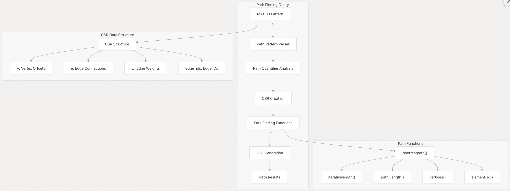
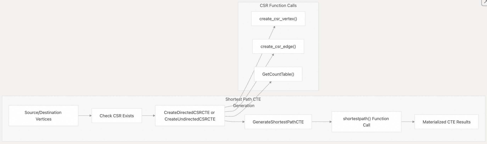
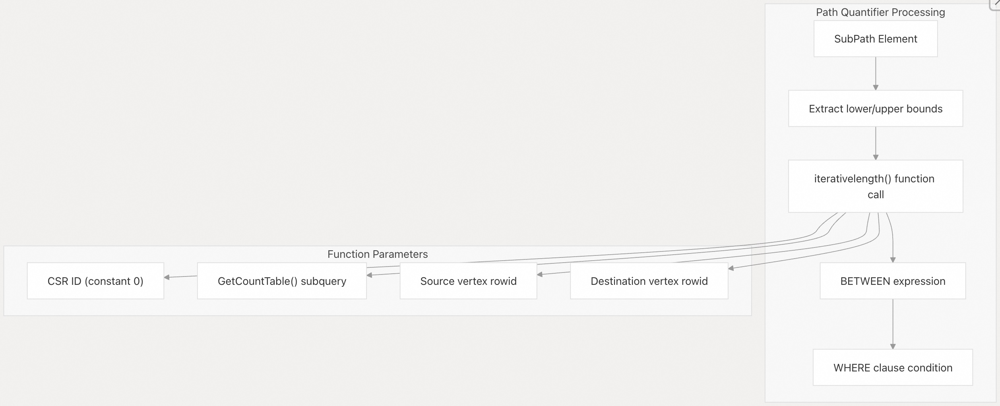
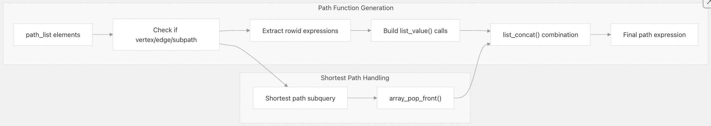
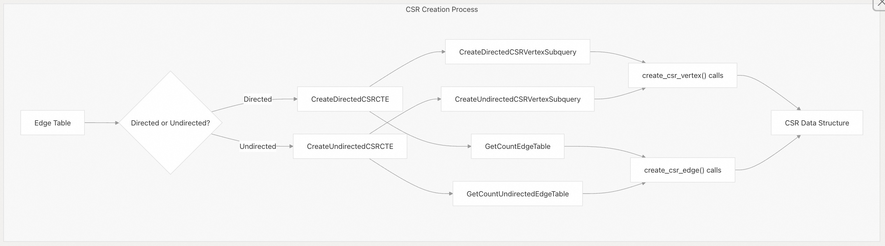
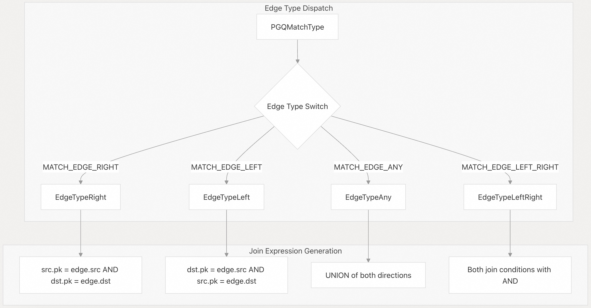

## DuckPGQ 源码学习: 4.2 路径查找 (Path Finding)   
                                                
### 作者                                                
digoal                                                
                                                
### 日期                                                
2025-11-07                                                
                                                
### 标签                                                
DuckDB , PGQ , 属性图 , DuckPGQ , 源码学习                                         
                                                
----                           
                                                
## 背景             
DuckPGQ 中的路径查找 (Path finding) 功能可以高效地发现属性图 (property graphs) 中顶点 (vertices) 之间的路径，包括最短路径算法 (shortest path algorithms) 和带有量词 (quantifiers) 的路径模式匹配 (path pattern matching)。此功能通过压缩稀疏行 (Compressed Sparse Row, CSR) 数据结构和专用的 SQL 函数 (specialized SQL functions) 实现，并集成到 DuckDB 的查询执行引擎 (query execution engine) 中。  
  
## 核心路径查找架构 (Core Path Finding Architecture)  
  
DuckPGQ 的路径查找系统围绕三个关键组件构建：用于高效图遍历 (graph traversal) 的 **CSR 数据结构 (CSR data structures)**、用于物化最短路径计算 (materialized shortest path computation) 的 **公用表表达式 (Common Table Expressions, CTEs)**，以及用于路径操作 (path manipulation) 的**专用 SQL 函数 (specialized SQL functions)**。  
  
   
  
**来源:**  
[`src/core/functions/table/match.cpp` 454-685](https://github.com/cwida/duckpgq-extension/blob/29748bfe/src/core/functions/table/match.cpp#L454-L685)  
[`src/core/utils/compressed_sparse_row.hpp` 27-47](https://github.com/cwida/duckpgq-extension/blob/29748bfe/src/core/utils/compressed_sparse_row.hpp#L27-L47)  
[`src/include/duckpgq/core/functions/table/match.hpp` 132-142](https://github.com/cwida/duckpgq-extension/blob/29748bfe/src/include/duckpgq/core/functions/table/match.hpp#L132-L142)  
  
## 最短路径查询 (Shortest Path Queries)  
  
DuckPGQ 支持使用 `ANY SHORTEST` 语法和路径量词 (path quantifiers) 进行最短路径查询 (shortest path queries)。系统会自动创建 CSR 数据结构并生成物化 CTE (materialized CTE) 以实现高效计算。  
  
### 基本最短路径语法 (Basic Shortest Path Syntax)  
  
```  
-- Find any shortest path from person a to person b  
FROM GRAPH_TABLE (pg  
    MATCH p = ANY SHORTEST (a:Person)-[k:knows]->(b:Person)  
    COLUMNS (path_length(p), vertices(p))  
)  
  
-- Shortest path with quantifiers  
FROM GRAPH_TABLE (pg    
    MATCH p = ANY SHORTEST (a:Person)-[k:knows]->{1,3}(b:Person)  
    COLUMNS (path_length(p), element_id(p))  
)  
```  
  
该实现为最短路径计算创建了专用 CTE (specialized CTEs)，如 `GenerateShortestPathCTE` 函数所示：  
  
   
  
**来源:**  
[`src/core/functions/table/match.cpp` 454-520](https://github.com/cwida/duckpgq-extension/blob/29748bfe/src/core/functions/table/match.cpp#L454-L520)  
[`src/core/functions/table/match.cpp` 770-810](https://github.com/cwida/duckpgq-extension/blob/29748bfe/src/core/functions/table/match.cpp#L770-L810)  
[`src/core/utils/compressed_sparse_row.cpp` 646-690](https://github.com/cwida/duckpgq-extension/blob/29748bfe/src/core/utils/compressed_sparse_row.cpp#L646-L690)  
  
## 路径量词和约束 (Path Quantifiers and Constraints)  
  
路径量词 (Path quantifiers) 指定了对路径长度 (path length) 和遍历模式 (traversal patterns) 的约束 (constraints)。DuckPGQ 支持多种量词类型：  
  
| 量词 (Quantifier) | 描述 (Description) | 示例 (Example) |  
| :--- | :--- | :--- |  
| `+` | 一次或多次跳跃 (One or more hops) | `-[e:knows]+->` |  
| `*` | 零次或多次跳跃 (Zero or more hops) | `-[e:knows]*->` |  
| `{n}` | 恰好 n 次跳跃 (Exactly n hops) | `-[e:knows]{3}->` |  
| `{m,n}` | 介于 m 和 n 次跳跃之间 (Between m and n hops) | `-[e:knows]{1,3}->` |  
  
路径量词的实现使用了 `AddPathQuantifierCondition` 函数来生成 `BETWEEN 表达式` (BETWEEN expressions)：  
  
   
  
**来源:**  
[`src/core/functions/table/match.cpp` 724-758](https://github.com/cwida/duckpgq-extension/blob/29748bfe/src/core/functions/table/match.cpp#L724-L758)  
[`src/core/functions/table/match.cpp` 560-592](https://github.com/cwida/duckpgq-extension/blob/29748bfe/src/core/functions/table/match.cpp#L560-L592)  
  
## 路径操作函数 (Path Manipulation Functions)  
  
DuckPGQ 提供了几个用于处理路径结果 (path results) 的函数：  
  
### 核心路径函数 (Core Path Functions)  
  
  * **`path_length(p)`**: 返回路径 `p` 的长度 (length)（边数 (number of edges)）  
  * **`vertices(p)`**: 返回路径 `p` 中**顶点行 ID** (vertex row IDs) 的数组 (array)  
  * **`element_id(p)`**: 返回路径 `p` 中**所有元素**（顶点 + 边）**行 ID** (element row IDs) 的数组  
  
### 路径函数实现 (Path Function Implementation)  
  
`CreatePathFindingFunction` 生成了用于**连接** (concatenate) 顶点和边行 ID 的列表表达式 (list expressions)：  
  
```  
-- Generated expression structure for element_id()  
list_concat(  
    list_value(prev_vertex_rowid, edge_rowid, next_vertex_rowid),  
    shortest_path_results  
)  
```  
  
对于最短路径结果，系统使用了 `array_pop_front()` 来避免**重复第一个顶点** (duplicating the first vertex)：  
  
   
  
**来源:**  
[`src/core/functions/table/match.cpp` 522-684](https://github.com/cwida/duckpgq-extension/blob/29748bfe/src/core/functions/table/match.cpp#L522-L684)  
[`src/core/functions/table/match.cpp` 850-870](https://github.com/cwida/duckpgq-extension/blob/29748bfe/src/core/functions/table/match.cpp#L850-L870)  
  
## CSR 数据结构集成 (CSR Data Structure Integration)  
  
路径查找严重依赖于 CSR (Compressed Sparse Row，压缩稀疏行) 数据结构来实现高效的图遍历 (graph traversal)。CSR 将图表示为三个主要的数组 (three main arrays)：  
  
### CSR 结构组件 (CSR Structure Components)  
  
  * **`v` 数组**: **顶点偏移量** (Vertex offsets)，指向边数组 (edge array)  
  * **`e` 数组**: 每条边的**目标顶点** (Target vertices)  
  * **`edge_ids` 数组**: **原始边行 ID** (Original edge row IDs)  
  * **`w` 数组**: **边权重** (Edge weights)（可选 (optional)）  
  
   
  
**来源:**  
[`src/core/utils/compressed_sparse_row.cpp` 646-690](https://github.com/cwida/duckpgq-extension/blob/29748bfe/src/core/utils/compressed_sparse_row.cpp#L646-L690)  
[`src/core/utils/compressed_sparse_row.cpp` 477-561](https://github.com/cwida/duckpgq-extension/blob/29748bfe/src/core/utils/compressed_sparse_row.cpp#L477-L561)  
[`src/core/utils/compressed_sparse_row.hpp` 27-47](https://github.com/cwida/duckpgq-extension/blob/29748bfe/src/core/utils/compressed_sparse_row.hpp#L27-L47)  
  
## 边类型处理 (Edge Type Handling)  
  
DuckPGQ 支持不同的边遍历方向 (edge traversal directions)，每种方向都需要不同的连接策略 (join strategies)：  
  
| 边类型 (Edge Type) | 方向 (Direction) | 实现函数 (Implementation Function) |  
| :--- | :--- | :--- |  
| `->` | 右 (有向) (Right (directed)) | `EdgeTypeRight` |  
| `<-` | 左 (有向) (Left (directed)) | `EdgeTypeLeft` |  
| `-` | 任意 (无向) (Any (undirected)) | `EdgeTypeAny` |  
| `<->` | 双向 (Both directions) | `EdgeTypeLeftRight` |  
  
### 边类型处理流程 (Edge Type Processing)  
  
`AddEdgeJoins` 函数**分派** (dispatches) 给相应的边类型处理程序 (edge type handlers)：  
  
   
  
**来源:**  
[`src/core/functions/table/match.cpp` 686-722](https://github.com/cwida/duckpgq-extension/blob/29748bfe/src/core/functions/table/match.cpp#L686-L722)  
[`src/core/functions/table/match.cpp` 291-361](https://github.com/cwida/duckpgq-extension/blob/29748bfe/src/core/functions/table/match.cpp#L291-L361)  
[`src/core/functions/table/match.cpp` 363-391](https://github.com/cwida/duckpgq-extension/blob/29748bfe/src/core/functions/table/match.cpp#L363-L391)  
  
## 命名子路径处理 (Named Subpath Processing)  
  
命名子路径 (Named subpaths) 允许在列表达式 (column expressions) 中引用路径段 (path segments)。`CheckNamedSubpath` 函数处理这些引用：  
  
```  
-- Example with named subpath  
FROM GRAPH_TABLE (pg  
    MATCH path_var = (a:Person)-[k:knows]+-(b:Person)    
    COLUMNS (element_id(path_var), path_length(path_var))  
)  
```  
  
该实现将 `element_id(path_var)` 等函数调用替换为生成的路径查找表达式 (path finding expressions)。  
  
**来源:**  
[`src/core/functions/table/match.cpp` 812-870](https://github.com/cwida/duckpgq-extension/blob/29748bfe/src/core/functions/table/match.cpp#L812-L870)  
  
## 性能考量 (Performance Considerations)  
  
### CSR 物化 (CSR Materialization)  
  
  * CSR 结构被创建为**物化 CTE** (materialized CTEs)，以避免**重复计算** (recomputation)。  
  * 系统在创建新的 CSR CTE 之前，会使用 `cte_map.find()` 检查现有的 CSR CTE。  
  * CSR ID 0 通常用于**主图结构** (primary graph structure)。  
  
### 路径查找优化 (Path Finding Optimization)  
  
  * 最短路径查询使用专用的 `shortestpath()` **UDF** (User-Defined Function) 以提高效率。  
  * 带有 `iterativelength()` 的**迭代长度检查** (Iterative length checking) 避免了**完整的路径枚举** (full path enumeration)。  
  * 路径量词条件 (Path quantifier conditions) 作为 `WHERE` 子句**下推** (pushed down)。  
  
### 顶点唯一性要求 (Vertex Uniqueness Requirement)  
  
路径查找查询要求使用**唯一顶点** (unique vertices) 才能正常运行。非唯一顶点将在执行期间触发**约束错误** (constraint error)。  
  
**来源:**  
[`src/core/functions/table/match.cpp` 571-592](https://github.com/cwida/duckpgq-extension/blob/29748bfe/src/core/functions/table/match.cpp#L571-L592)  
[`test/sql/path_finding/non-unique-vertices.test` 39-55](https://github.com/cwida/duckpgq-extension/blob/29748bfe/test/sql/path_finding/non-unique-vertices.test#L39-L55)  
  
# 附录1: 如何表示边的跳数: 0到n跳? n到无穷跳?  
您询问的是如何在 DuckPGQ 中查询边跳数为 0 到 n 跳,或者 n 到无穷跳的路径。   
  
## 查询边跳数范围  
  
在 DuckPGQ 中,您可以使用**路径量词(path quantifiers)**来指定边的跳数范围:   
  
### 0 到 n 跳  
  
使用 `->{0,n}` 语法来查询 0 到 n 跳的路径:    
  
例如,查询 0 到 3 跳:    
  
这会返回包括起点自身(0 跳)在内的所有路径。   
  
### n 到无穷跳  
  
对于 n 到无穷跳,您可以使用 `->{n,}` 语法, 但需要注意:**无上界的路径查询在 WALK 模式下会导致错误**,因为可能产生无限结果:    
  
### 1 到 n 跳  
  
如果您想查询至少 1 跳的路径,使用 `->{1,n}` 语法:    
  
### 特殊语法  
  
- `->*`: 等同于 `->{0,}`,表示 0 到无穷跳    
- `->+`: 等同于 `->{1,}`,表示 1 到无穷跳    
- `->{,n}`: 等同于 `->{0,n}`,表示 0 到 n 跳    
  
## 实现原理  
  
这些路径查询通过 `iterativelength` 函数实现,该函数使用 CSR(Compressed Sparse Row)数据结构进行高效的图遍历:    
  
路径长度约束会被转换为 SQL 的 `BETWEEN` 条件:    
  
## Notes  
  
- 0 跳路径会返回起点自身  
- 无上界查询(`->*` 或 `->+`)在默认 WALK 模式下会报错,需要指定上界或使用其他路径模式  
- 所有路径查询都需要使用 `ANY SHORTEST` 关键字来指定路径查找策略  
- 路径量词只能应用于边模式,不能应用于顶点模式  
  
# 附录2: DuckPGQ 中的 WALK 模式  
您询问的是 DuckPGQ 中的 WALK 模式。   
  
## WALK 模式概述  
  
WALK 模式是 DuckPGQ 中的**默认路径模式**,用于路径查找查询。在 WALK 模式下, 路径可以重复访问相同的顶点和边,这意味着可以形成环路。   
  
## WALK 模式的限制  
  
WALK 模式的主要限制是:**不允许无上界的路径查询**,因为这可能导致无限结果。    
  
当您尝试使用无上界的路径量词(如 `->*` 或 `->+`)时,系统会抛出错误:    
  
错误信息明确指出: `ALL unbounded with path mode WALK is not possible as this could lead to infinite results. Consider specifying an upper bound or path mode other than WALK`。  
  
## 解决方案  
  
要使用无上界的路径查询,您有两个选择:  
  
1. **指定上界**:使用有界的路径量词,如 `->{1,3}` 或 `->{0,10}`    
  
2. **使用其他路径模式**:虽然代码中提到了其他路径模式的可能性,但从当前的代码库来看,具体的替代路径模式(如 TRAIL 或 SIMPLE)的实现细节并未在检索到的代码中明确展示。   
  
## Notes  
  
- WALK 模式允许路径中重复访问顶点和边,因此可能产生环路  
- 这种特性使得无上界查询在理论上可以产生无限多的结果  
- 系统通过在查询执行前检查路径模式和上界来防止无限循环  
- 所有路径查找查询都需要使用 `ANY SHORTEST` 关键字来指定路径查找策略  
    
#### [PolarDB 学习图谱](https://www.aliyun.com/database/openpolardb/activity "8642f60e04ed0c814bf9cb9677976bd4")
  
  
#### [PostgreSQL 解决方案集合](../201706/20170601_02.md "40cff096e9ed7122c512b35d8561d9c8")
  
  
#### [德哥 / digoal's Github - 公益是一辈子的事.](https://github.com/digoal/blog/blob/master/README.md "22709685feb7cab07d30f30387f0a9ae")
  
  
#### [About 德哥](https://github.com/digoal/blog/blob/master/me/readme.md "a37735981e7704886ffd590565582dd0")
  
  

  
